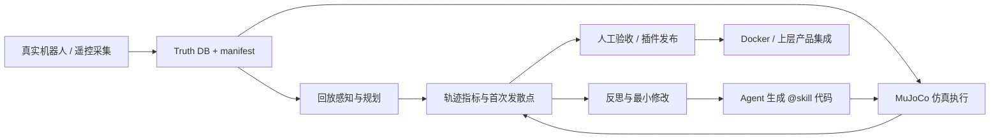

<div align="center">


<h1>TOPSUN DimOS</h1>

<p><strong>中坚科技 · 机器人 Agent 应用与工程集成</strong></p>
<p>面向通用机器人的 Agent-Native 运行时与验证闭环。</p>
<p>让机器人理解任务、记住环境，并把导航、跟随与迎宾接成可验证的应用。</p>

<p>
  
  <a href="LICENSE"></a>
</p>

<p>
  <a href="#features">功能</a> ·
  <a href="#workflow">验证闭环</a> ·
  <a href="#quickstart">开始使用</a> ·
  <a href="#research">研究与交付</a> ·
  <a href="#history">开发历程</a> ·
  <a href="#contributing">协作与文档</a>
</p>

<strong>当前定位：研究版 / Alpha</strong>

</div>

TOPSUN DimOS 基于 [dimensionalOS/dimos](https://github.com/dimensionalOS/dimos) 持续开发。上游提供模块、数据流、硬件适配、Agent/MCP、感知和控制基础；TOPSUN 在此之上扩展面向 Go2、G1 的任务技能、空间记忆、导航、跟随与迎宾应用。

本 README 对应当前合并工作树：`origin/main@f3bbe0e3` 加上 `origin/codex/go2-truth-capture-gui@83a8594d`。代码存在、测试通过和实机验收是不同阶段；尚未完成的项目保持明确的开发或 HOLD 状态。

## 为什么做

机器人 Agent 的难点不是“能不能让大模型调用一个函数”，而是让一段代码在真实约束下可重复、可诊断、可交付：

- 传感器、控制器和算法模块需要稳定的输入/输出契约；
- Agent 生成的机器人代码可能语法正确，但坐标系、方向、时序或参数语义错误；
- 一次 demo 或现场成功，不能说明代码能在另一条路线、另一台机器人或下一次运行中复现；
- 仿真、回放、真机、日志和 Docker 环境需要能够对齐，问题才可定位和回归。

TOPSUN DimOS 的目标，是提供一套 Python-first、模块化、Agent-native 的机器人研发底座：

> **让机器人能力先变成有契约的模块和技能，再变成有数据、有指标、有回退路径的可验收插件。**

### 事实、计划与未知

| 类别 | 当前结论 |
|---|---|
| 已有代码事实 | `dimos/` 包含模块、Blueprint、机器人连接、导航、感知、操作、Agent/MCP、回放和 Docker 构建链路。 |
| 已合入当前工作分支 | Truth Capture CLI/GUI、VLX 风格 waypoint 跟随、代码生成轨迹评估、技能 lint、检查点和能力记录工具。 |
| 当前计划 | 用真值数据集、仿真轨迹、ATE/RPE/Hit Rate 和首次发散点，形成 AI 代码生成的可验证闭环。 |
| 尚未证明 | 公开论文、公开网站、公开数据集、量产级安全认证、跨机器人泛化和真实机器人长期稳定性。 |

<a id="features"></a>
## 功能与合并记录

| TOPSUN 扩展 | 解决的问题 | 代码与记录 |
| :--- | :--- | :--- |
| **语义导航与到达复核** | 从位置名称、地标和记忆中寻找目标，加入分步导航、重定位与视觉复核流程 | [导航技能](dimos/agents/skills/navigation.py) · [#85](https://github.com/topsun-bot/topsun_dimos/pull/85)、[#91](https://github.com/topsun-bot/topsun_dimos/pull/91)、[#99](https://github.com/topsun-bot/topsun_dimos/pull/99) |
| **空间记忆与盲区探索** | 保存场景位置与观察记录，结合地图寻找尚未充分观察的区域，减少重复探索 | [空间记忆入口](dimos/perception/spatial_perception.py) · [探索说明](docs/capabilities/memory/spatial_memory_blindspot_explorer.md) · [#90](https://github.com/topsun-bot/topsun_dimos/pull/90)、[#101](https://github.com/topsun-bot/topsun_dimos/pull/101) |
| **ReID 人员跟随** | 用人物外观特征关联跟随目标，并提供丢失后的等待与报告逻辑 | [follow_me](dimos/agents/skills/follow_me.py) · [Qwen 跟随蓝图](dimos/robot/unitree/go2/blueprints/agentic/unitree_go2_qwen_follow.py) · [#86](https://github.com/topsun-bot/topsun_dimos/pull/86) |
| **LiDAR 目标绕行** | 从代价地图提取障碍边缘，生成保持距离的切向绕行控制 | [orbit_object](dimos/agents/skills/orbit_object.py) · [使用说明](docs/development/orbit_object.md) · [#80](https://github.com/topsun-bot/topsun_dimos/pull/80) |
| **Landmark Pack 地标包** | 将场景地标打包、导入和导出，通过 CLI 管理可复用的地点信息 | [地标包](dimos/landmark/landmark_pack.py) · [CLI](dimos/cli/landmarks.py) · [#100](https://github.com/topsun-bot/topsun_dimos/pull/100) |
| **Go2 视觉导航实验** | 将 NoMaD 候选轨迹、代价地图评分、多航点选择和跟随控制接成实验链路 | [nav-go2 示例](examples/nav-go2/README.md) · [#72](https://github.com/topsun-bot/topsun_dimos/pull/72) |
| **G1 迎宾与机载导览** | 提供原地迎宾、语音与手势；Orin 版本进一步接入 DDS 导航、标点和到站讲解 | [迎宾蓝图](dimos/robot/unitree/g1/blueprints/agentic/unitree_g1_greeter.py) · [机载蓝图](dimos/robot/unitree/g1/blueprints/agentic/unitree_g1_greeter_onboard.py) · [#111](https://github.com/topsun-bot/topsun_dimos/pull/111) |
| **Truth Capture 与 AI Coding 评估** | 采集可回放真值，定位轨迹首次发散，支持 Agent 代码的仿真/回放评估 | [Truth Capture](dimos/robot/unitree/go2/cli/truth_capture.py) · [codegen_loop](dimos/eval/codegen_loop/) · [评估方案](docs/development/ai_coding_data_loop_plan.md) |
| **VLX 风格短时域跟随** | 将目标历史转成 waypoint，用纯跟踪控制、LiDAR 弹性带和硬停止门执行 | [waypoint 跟随](dimos/navigation/visual_servoing/vlx_waypoint_following.py) · [合并提交](https://github.com/topsun-bot/topsun_dimos/commit/83a8594d) |
| **运行与工程适配** | 为长运行记忆增加容量边界，整合 Go2 语音输出，并调整 fork 仓库的 CI 与依赖流程 | [#69](https://github.com/topsun-bot/topsun_dimos/pull/69)、[#73](https://github.com/topsun-bot/topsun_dimos/pull/73)、[#87](https://github.com/topsun-bot/topsun_dimos/pull/87) |

**使用边界：** NoMaD 示例需要额外模型与依赖；跟随和绕行需要相应感知、控制与硬件配置。G1 迎宾默认采用模板路由，`llm_enabled=False`，不将模板外输入交给 LLM 自由回答。VLX 跟随和机载导览属于当前工作分支的开发集成，不代表完整实机验收。

### 仍在开发或尚未进入 `main`

- [83a8594d](https://github.com/topsun-bot/topsun_dimos/commit/83a8594d)：已合入当前工作分支，但尚未进入 `main`。
- [#118](https://github.com/topsun-bot/topsun_dimos/pull/118)：HoloAgent robot bridge 接口适配。
- [#125](https://github.com/topsun-bot/topsun_dimos/pull/125)：EmbodiedGen 仿真资源桥接。
- [#132](https://github.com/topsun-bot/topsun_dimos/pull/132)：在 #120 之后继续同步上游更新。

以各分支和 PR 的最新状态、评审意见和测试结果为准。

## 能力路线

我们将能力分成四层，避免把“框架能运行”直接写成“产品已量产”：

| 层级 | 目标 | 代表能力 | 状态 |
|---|---|---|---|
| L1：模块化运行时 | 让机器人能力可组合 | typed streams、Module、Blueprint、`autoconnect()` | 代码已有，按环境验证 |
| L2：Agent 接口 | 让 Agent 能发现和调用能力 | `@skill`、MCP Server/Client、CLI | 代码与示例已有 |
| L3：数据与评测 | 让生成代码可以复现和诊断 | Truth DB、replay、MuJoCo、ATE/RPE、首次发散点 | 工具与方案持续完善 |
| L4：产品化交付 | 让能力可接入上层产品 | 插件契约、权限/安全门、Docker、版本与数据清单 | 规划中，需独立验收 |

### 路线目标

| 阶段 | 目标能力 | 本仓库对应工作 | 验收边界 |
|---|---|---|---|
| P0 | 一个场景可复现 | Go2-W 真值采集、回放/仿真、轨迹对比 | 有 DB、manifest、check 和可重复命令 |
| P1 | 一个 Agent 技能可评测 | `@skill` 白名单、生成代码、仿真运行、指标反馈 | 不以 LLM 返回成功作为通过 |
| P2 | 一个插件可集成 | 导航/巡检或感知记忆插件 | 有输入输出契约、失败回退和人工验收 |
| P3 | 一套可交付物 | 网站、代码、论文、数据集、Docker 镜像 | 每项都有公开地址、版本或明确的待补状态 |

<a id="workflow"></a>
## 从机器人数据到可验收代码



每一次修改都应能回答三个问题：

1. 代码在什么场景、什么起点、什么数据上运行；
2. 它与真值或基线差在哪里，首次发散发生在什么时间和位姿；
3. 修改后是否通过明确阈值、回退策略和人工验收。

### 评测口径

- **ATE**：衡量对齐后的绝对轨迹误差；
- **RPE**：衡量时间窗口内的相对位移误差；
- **Hit Rate**：按路线顺序通过等距 waypoint 的比例；
- **First Divergence**：记录第一处超过阈值的轨迹偏差，作为 Agent 反思输入；
- **PASS / HOLD / FAIL**：缺少可归因证据时保持 HOLD，不把“命令返回成功”当作物理任务成功。

详细规约见 [Codegen Loop Spec](CODEGEN_LOOP_SPEC.md)、[AI 代码轨迹闭环方案](AI_CODEGEN_TRAJECTORY_LOOP.md) 和 [Go2-W 真值轨迹采集](docs/development/go2_truth_capture.md)。

## 开始使用

<a id="quickstart"></a>

需要 Git、Git LFS、Python 3.12 和 uv。先按系统准备依赖：[Ubuntu](docs/installation/ubuntu.md) · [macOS](docs/installation/osx.md) · [Nix/Linux](docs/installation/nix.md)。

```bash
GIT_LFS_SKIP_SMUDGE=1 git clone https://github.com/topsun-bot/topsun_dimos.git
cd topsun_dimos
uv sync --group tests --frozen
uv run dimos list
```

这里安装的是本仓库源码及测试依赖。模型、录制数据和硬件专项依赖按所选蓝图补齐，详见[系统要求](docs/requirements.md)与[蓝图指南](docs/usage/blueprints.md)。

| 想做什么 | 从哪里开始 |
| :--- | :--- |
| 不接机器人，先看录制回放 | `uv run dimos --replay run unitree-go2`，参见 [Go2 指南](docs/platforms/quadruped/go2/index.md) |
| 运行 G1 仿真 | [G1 平台指南](docs/platforms/humanoid/g1/index.md)，安装仿真依赖后选择相应蓝图 |
| 做 Go2 视觉导航实验 | [NoMaD 导航示例](examples/nav-go2/README.md)，按说明准备模型权重 |
| 接入 Agent 与 MCP | [Agent 指南](docs/capabilities/agents/index.md)，在包含 McpServer 的蓝图启动后查询技能 |
| 采集 Go2-W 真值数据 | [Truth Capture](docs/development/go2_truth_capture.md)，真机操作需现场安全负责人 |
| 配置 G1 机载迎宾 | [Orin 迎宾部署](docs/platforms/humanoid/g1/greeter_onboard.md) |
| 查看运行状态和日志 | `uv run dimos status` · `uv run dimos log` · [CLI 文档](docs/usage/cli.md) |

### Agent / MCP 快速入口

```bash
uv run dimos --replay run unitree-go2-agentic --daemon
uv run dimos status
uv run dimos mcp list-tools
uv run dimos agent-send "explore the room"
uv run dimos stop
```

回放用于观察录制数据，不会形成实体运动闭环。实体机器人运行前应完成对应平台的网络、控制权、限位、看护人和急停确认；本 README 不替代现场 SOP。

<a id="research"></a>
## 研究方向与交付

以下是候选研究方向，不代表论文已经投稿或结果已经成立。

| 候选方向 | 核心亮点 | 需要的验证 |
|---|---|---|
| Evidence-Bounded Code Generation for Generalist Robots | 生成 → 仿真/回放 → 轨迹指标 → 首次发散诊断 → 最小修改 | 至少 3 个独立路线、固定基线、完整日志和人工验收 |
| Truth DB as a Regression Contract for Robot Agents | 用真值 DB、manifest、数据切片和回放协议把机器人任务变成可回归样本 | 数据集卡、许可、哈希、跨版本重放和失败样本 |
| Typed Robot Skills with Blueprint Composition | 用 typed streams、Blueprint 和 MCP 把模块能力暴露给 Agent，并保持可替换性 | 接口稳定性、跨机器人适配、故障注入和延迟/吞吐测试 |

### 论文与数据当前状态

- 论文全文：—
- 公开预印本：—
- 公开数据集地址：—
- 当前可复用的内部研究材料：[`PROJECT_PLAN_AI_CODING_ON_ROBOTS.md`](PROJECT_PLAN_AI_CODING_ON_ROBOTS.md)、[`CODEGEN_LOOP_SPEC.md`](CODEGEN_LOOP_SPEC.md)、[`dimos/eval/codegen_loop/`](dimos/eval/codegen_loop/)。

### 可被上层量产集成的 Plugin

“可集成”只表示接口方向和代码基础，不表示已经满足量产准入。

| Plugin | 对外接口 | 当前基础 | 量产前必须补齐 |
|---|---|---|---|
| Robot Adapter | Module / Blueprint | `dimos/robot/`、`dimos/control/` | 设备矩阵、版本兼容、断链回退、现场 SOP |
| Navigation & Patrol | `@skill` / MCP / stream | `dimos/navigation/`、导航 Blueprint | 地图版本、任务超时、急停、失败回退、长期稳定性 |
| Perception & Spatial Memory | sensor streams / memory API | `dimos/perception/`、`dimos/memory/` | 数据闭环、误检漏检指标、隐私与存储策略 |
| Agent Skill Gateway | MCP Server / Client | `dimos/agents/mcp/`、`@skill` | 权限分级、参数校验、审计、沙箱、人工接管 |
| Truth Capture & Replay | DB + manifest + CLI | `dimos/robot/unitree/go2/cli/truth_capture.py` | 数据集版本、脱敏、自动质检、发布清单 |
| Safety Gateway / Watchdog | 本地 gate / watchdog | 作为量产必需项规划 | 由安全负责人和硬件负责人独立验收，不能由 LLM 自证 |

推荐的产品接入顺序：

```text
Robot Adapter → Safety Gateway → Navigation/Perception Plugin → Agent Skill Gateway → 上层产品
                                      ↓
                             Truth Capture & Replay
```

### 未来一个月的最小工作安排

| 工作流角色 | 第 1 周：冻结边界 | 第 2 周：跑通闭环 | 第 3 周：扩大验证 | 第 4 周：形成交付 |
|---|---|---|---|---|
| 运行时 / Blueprint | 支持矩阵、输入输出、失败状态 | 1 个 Blueprint + 1 个 mock 插件 | 接口兼容和故障注入 | API 文档、示例和版本说明 |
| 机器人 / 安全 | 设备、网络、控制权、限位、急停 SOP | 1 条安全真值路线 | 至少 3 条路线或场景重复测试 | 现场 SOP、风险清单和验收记录 |
| 数据 / 评测 | 字段、命名、哈希、指标阈值 | GT → sim/replay → report | 独立场景、失败样本和基线对比 | Dataset Card、评测报告和复现实验命令 |
| Agent / Plugin | schema、权限、输入校验 | 1 个 Agent 调用场景 | 评测反馈和最小修改 | 插件包、调用文档和安全边界 |
| 论文 / 网站 / 发布 | 问题、图表、栏目、发布清单 | 结果与失败案例收集 | 初稿、网页草图和 Docker smoke test | 候选版本；缺证据栏目保持空白 |

### 五类交付物

| 交付物 | 当前仓库证据 | 当前状态 |
|---|---|---|
| 网站 | `docs/` | 公开地址：— |
| Code | [`dimos/`](dimos/)、[`tools/`](tools/)、[开发文档](docs/development/) | 代码底座已有；量产验收待补 |
| 论文 / 文章 | 候选论文点与实验方案 | 公开论文：— |
| 数据集 | [真值采集流程](docs/development/go2_truth_capture.md)、`data/` | 公开下载：— |
| Docker 镜像 | [`docker/`](docker/)、[镜像说明](docs/development/docker.md) | 正式版本/digest 待补 |

只有同时具备“地址/版本、运行命令、输入输出说明、已知限制、验收证据”的交付物，才标记为完成。没有公开地址或独立验收记录的项目保持 `HOLD`。

<a id="history"></a>
## 从上游基础到 TOPSUN 应用

这个仓库保留了上游提交历史，因此贡献记录里既有 Dimensional 社区开发者，也有 TOPSUN 仓库贡献者，以及依赖更新、格式修复等自动化账号。**作者数量不等于本团队人数，提交数量也不等于新增功能数量。**

<details>
<summary><strong>第 1、3、10、100 次提交分别做了什么？</strong></summary>

按 `git log --first-parent --reverse f3bbe0e3` 从旧到新编号，只沿主线计算，避免把并行分支的先后混在一起。这些早期提交属于上游历史；“第 100 次提交”与“PR #100”不是一回事。

| 主线序号 | 提交 | 日期 | 当时做的事情 |
| :---: | :--- | :--- | :--- |
| 1 | [437ca4c9](https://github.com/topsun-bot/topsun_dimos/commit/437ca4c9) | 2025-10-18 | 创建最初 Python 包与构建产物 |
| 2 | [e361a94d](https://github.com/topsun-bot/topsun_dimos/commit/e361a94d) | 2025-10-18 | 导入项目内容 |
| 3 | [99ddcb0f](https://github.com/topsun-bot/topsun_dimos/commit/99ddcb0f) | 2025-10-18 | 增加 Agent、数据、环境和操作模块的空骨架 |
| 10 | [1bddc1a8](https://github.com/topsun-bot/topsun_dimos/commit/1bddc1a8) | 2025-10-18 | 接入 COLMAP 子模块 |
| 100 | [a4900b3f](https://github.com/topsun-bot/topsun_dimos/commit/a4900b3f) | 2025-11-30 | 清理构建产物、调整开发脚本与目录 |

该快照包含 373 个主线提交、1378 个可达提交。数字仅用于解释这份快照，不作为研发绩效指标。

</details>

<details>
<summary><strong>TOPSUN 功能里程碑与贡献来源</strong></summary>

下表列出代表性合并 PR 的作者账号，不替代完整贡献名单，也不将合并操作者当作全部代码的作者。

| 阶段 | 代表性工作 | PR 作者与证据 |
| :--- | :--- | :--- |
| 2026-05-22 | 目标绕行、长运行内存控制 | mundodr [#80](https://github.com/topsun-bot/topsun_dimos/pull/80) · feipeng1234 [#69](https://github.com/topsun-bot/topsun_dimos/pull/69) |
| 2026-05-25 | Go2 NoMaD 导航、传输配置扩展 | sguanke [#72](https://github.com/topsun-bot/topsun_dimos/pull/72) · hualdds [#84](https://github.com/topsun-bot/topsun_dimos/pull/84) |
| 2026-05-26 至 05-28 | 语义导航与视觉复核 | di-jiarong [#85](https://github.com/topsun-bot/topsun_dimos/pull/85) · feipeng1234 [#91](https://github.com/topsun-bot/topsun_dimos/pull/91) · guoyan88 [#99](https://github.com/topsun-bot/topsun_dimos/pull/99) |
| 2026-05-27 至 05-28 | ReID 跟随、空间记忆盲区探索 | Yaocheng-yan [#86](https://github.com/topsun-bot/topsun_dimos/pull/86) · mundodr [#90](https://github.com/topsun-bot/topsun_dimos/pull/90)、[#101](https://github.com/topsun-bot/topsun_dimos/pull/101) |
| 2026-05-28 | Landmark Pack 导入、导出与 CLI | dingyi0219 [#100](https://github.com/topsun-bot/topsun_dimos/pull/100) |
| 2026-06-23 | G1 迎宾、Orin 机载导览集成 | dingyi0219 [#111](https://github.com/topsun-bot/topsun_dimos/pull/111) |
| 2026-09-11 | 同步上游，保留 TOPSUN 导航与空间记忆兼容入口 | yixinzhangagent [#120](https://github.com/topsun-bot/topsun_dimos/pull/120) |
| 2026-09-13 | Truth Capture、VLX 跟随和代码生成评估闭环 | yixinzhangagent [83a8594d](https://github.com/topsun-bot/topsun_dimos/commit/83a8594d) |

查看[完整提交历史](https://github.com/topsun-bot/topsun_dimos/commits/main/)、[贡献者记录](https://github.com/topsun-bot/topsun_dimos/graphs/contributors)，或阅读[2026 年 5 月的 100 个提交总结](docs/development/main_100_commits_summary.md)。旧总结反映当时结构，当前文件路径以上方源码链接为准。

</details>

**最近一个月的主要更新：** 上游带来了 Zenoh 默认传输、Cockpit 视频/地图/聊天/按键语音、SQLite/MCAP 录制与云数据、cuVSLAM/DimSLAM、双臂遥操作和操作规划增强；TOPSUN 在 #120 中完成同步，并在当前工作分支继续接入 Truth Capture、VLX 跟随与 AI Coding 评估。这些应区分为上游能力、本仓库集成成果和仍需验证的研究方向，而非全部归为 TOPSUN 原创算法。

<a id="contributing"></a>
## 协作与文档

| 开发入口 | 工程入口 |
| :--- | :--- |
| [模块](docs/usage/modules.md) · [蓝图](docs/usage/blueprints.md) · [配置](docs/usage/configuration.md) | [测试](docs/development/testing.md) · [Docker](docs/development/docker.md) · [LFS 数据](docs/development/large_file_management.md) |
| [导航](docs/capabilities/navigation/index.md) · [空间记忆](docs/capabilities/memory/index.md) · [机械臂](docs/capabilities/manipulation/index.md) | [贡献指南](CONTRIBUTING.md) · [Agent 开发约定](AGENTS.md) · [CI 结果](https://github.com/topsun-bot/topsun_dimos/actions/workflows/ci.yml) |

从 `main` 创建功能分支，提交前运行相关检查，通过 PR 评审后合并。README、功能代码和验证证据应一起更新；默认主分支是开发版本，最新 CI 状态请查看实际运行记录。

---

<div align="center">
<p><strong>TOPSUN · 中坚科技</strong></p>
<p>基于 <a href="https://github.com/dimensionalOS/dimos">Dimensional 开源项目</a> 持续开发 · <a href="LICENSE">Apache-2.0</a></p>
<p><a href="https://www.topsunpower.cc/?lang=zh-cn">中坚科技官网</a> · <a href="https://github.com/topsun-bot/topsun_dimos/issues">问题反馈</a> · <a href="https://github.com/topsun-bot/topsun_dimos/pulls">参与开发</a></p>
</div>
