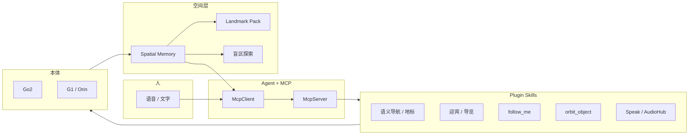

<div align="center">


<h2>TopSun DimOS</h2>

<h3>面向物理空间的智能体操作系统</h3>

The Agentive Operating System for Physical Space

<br/>

<!-- 没有正式发布的入口保持灰标，不编造链接。有了之后把 badge 换成彩色并补 URL。 -->
[](#deliverables)
[](https://github.com/topsun-bot/topsun_dimos)
[](#publications)
[](#deliverables)
[](https://github.com/orgs/topsun-bot/packages)

<br/>

[News](#news) ·
[Motivation](#why-topsun-dimos) ·
[Highlights](#highlights) ·
[Plugins](#plugins) ·
[Plan](#plan) ·
[Deliverables](#deliverables) ·
[Demos](#demos) ·
[Start](#getting-started)

</div>

**TopSun DimOS** 是 [dimensionalOS/dimos](https://github.com/dimensionalOS/dimos) 的工程化分支，面向宇树 Go2 / G1 等本体，把感知、空间记忆、导航、语音和 `@skill` 编成可部署的 Blueprint。它既是可独立运行的机器人操作系统，也是 [HoloAgent](https://github.com/topsun-bot/HoloAgent) 量产集成时的技能与运行时底座。

> 网站、主论文、公开数据集尚未发布，对应徽章先留空。代码与 Docker 镜像已经可用。

---

<a id="news"></a>
## 🔥 News

- **[2026.06]** G1 迎宾与 Orin 机载导览迎宾合入：原地接待、机身语音、标点带路、到站讲解。
- **[2026.05]** 语义导航稳健环、VLM 到达重验证、Landmark Pack、ReID `follow_me`、LiDAR `orbit_object`、空间记忆盲区探索。
- **[2026.05]** DashScope / Qwen / DeepSeek 智能体蓝图，以及 LCM / SHM 全局传输切换。
- **[ongoing]** Docker 镜像持续发布到 [`ghcr.io/topsun-bot/`](https://github.com/orgs/topsun-bot/packages)。

---

<a id="why-topsun-dimos"></a>
## 💡 Why TopSun DimOS

对照 [HoloMotion](https://github.com/HorizonRobotics/HoloMotion) 的 Motivation：先把「为什么做、解决什么、怎么交付」摊开，再谈安装。

### 把语言变成可监控的技能图

DimOS 不是把大模型直接接到电机上。`@skill` + Blueprint + MCP 把「去前台 / 跟着我 / 绕展品一圈」落成可调度、可回传、可恢复的技能。HoloAgent 的 AgentOS 已经吸收了这套 Skill / Blueprint / Harness 思路。

### 空间记忆，而不是一次性地图

巡检和导览要回答的是「我在哪看过什么」，不是「栅格是否可走」。CLIP + 位姿写入空间记忆，再叠加地标包、门/地标记录和盲区补采样，让找物、带路、重访同一套数据。

### 一套运行时，多种本体

Go2、G1、机械臂、无人机走同一套 Module / 传输 / 配置。场馆换机器人，换 Blueprint，不换操作系统。

### 先能上现场，再谈开放问答

G1 迎宾默认模板短路、不让 LLM 现场编造位置事实。讲解词在标点时写入，到站只播已录入文本。这是接待/导览能进大厅的前提，不是功能阉割。

### 对上可插拔，对下可复现

对上：技能以 plugin 形式进 HoloAgent / MCP。对下：replay、仿真、Docker、Landmark Pack 让同一套栈在办公室、展厅、机载 Orin 上复现。

| 你想做的事 | 从这里开始 | 需要什么 |
| --- | --- | --- |
| 先看四足导航，不接真机 | `dimos --replay run unitree-go2` | 本仓库 + uv |
| 用自然语言控狗 | `dimos --simulation run unitree-go2-agentic` | LLM key 或本地 Ollama |
| G1 仿真智能体 | `dimos --simulation run unitree-g1-agentic-sim` | `dimos[sim]` |
| 大厅原地迎宾 | `dimos run unitree-g1-greeter` | 真机 G1，可不含导航 |
| Orin 导览迎宾 | `unitree-g1-greeter-onboard` | 机载 Orin + Mid360 + 标点 |
| 给 HoloAgent 接技能 | [Plugins](#plugins) | 运行中的 DimOS MCP 或 skill 容器 |
| 训练自己的策略 / 发论文 | [论文点](#highlights) | 数据与评测仍待发布 |

---

## ✅ Release Status

- [x] TopSun DimOS 代码（本仓库）
- [x] Docker 镜像：`python` / `dev` / `ros` / `ros-python` / `ros-dev`
- [x] Go2 导航、空间记忆、agentic + MCP
- [x] G1 迎宾（笔记本 WebRTC）与 Orin 导览迎宾蓝图
- [x] 语义导航稳健环、Landmark Pack、`follow_me`、`orbit_object`、盲区探索
- [ ] 项目网站
- [ ] TopSun DimOS 主论文 / 技术报告
- [ ] 公开数据集（导览地标包、语义导航评测、迎宾交互）
- [ ] HoloAgent `robot_bridge` 量产 plugin 合入主线
- [ ] G1 Orin 导览迎宾真机闭环验收
- [ ] 网站 + 论文 + 数据集 + Docker 的统一发布页

---

## 🧩 Components

- **Agent Runtime：** LangGraph 智能体、`@skill`、`McpServer` / `McpClient`，把自然语言编成技能调用。
- **Spatial Memory：** 相机帧 + 位姿 + CLIP / Chroma，地点标注、文本检索、房间重定位。
- **Navigation：** 原生 SLAM / costmap / A*、拓扑与语义导航、到达 VLM 复核、nav-go2 NoMaD 示例。
- **Embodied Skills：** 跟随、绕行、迎宾手势、导览讲解、语音播报，均可作为 HoloAgent plugin。
- **Venue Pack：** Landmark Pack 导入导出，把场馆标点和讲解词做成可复制数据包。
- **Transport：** LCM / SHM / ROS 2 / DDS，图像走共享内存，对外话题可钉在 LCM。



---

<a id="highlights"></a>
## 🌟 论文点与特色

主论文尚未写成。下面是已经在代码里站得住、适合写成文章或技术报告的点。没有评测集的先空着，不报不存在的数字。

| 点 | 主张 | 场景里解决什么 | 现状 |
| --- | --- | --- | --- |
| **Skill / Blueprint 作为具身插件层** | 技能是带类型、可监控、可 MCP 暴露的接口，而不是脚本堆砌。HoloAgent 已按同一思路做 Harness。 | 量产时把接待、跟随、绕行、导览插进上层 AgentOS，不必重写栈。 | 代码已有；对接 HoloAgent 的 bridge 仍在推进。 |
| **语义导航稳健环 + 到达视觉复核** | 文本目标 → 记忆/检测/地标多层回退 → 到点后 VLM 确认「东西还在不在」。 | 办公室找杯子、展厅找展品：走到坐标不等于任务成功。 | 已合入；公开 SR / SPL 表为空。 |
| **记忆覆盖驱动的盲区探索** | 探索目标来自「可通行但没好好看过」的缺口，而不是只扩 Occupancy。 | 安防巡检：地图走过了，语义记忆仍是盲区。 | 设计与实现已合入。 |
| **Landmark Pack 场馆复制** | 名称 + 位姿 + 讲解词打成包，CLI 导入导出。 | 同一套迎宾机器人换展厅，复制数据包而不是重标一周。 | 格式与 `dimos landmarks` 已有；公开数据集为空。 |
| **模板约束的机载接待** | 迎宾/导览默认不开放 LLM 问答，位置事实只来自已标点数据。 | 大厅接待：不能幻觉「厕所在左边」。 | 笔记本迎宾可用；Orin 真机验收未完成。 |
| **ReID 跟随与几何绕行** | `follow_me` 用 OSNet 在人流里锁人；`orbit_object` 用 LiDAR 轮廓绕行，不依赖检测框。 | 展厅跟人、绕展品拍摄、被箱子挡住时主动绕。 | 技能已合入。 |

相关但独立的定位工作（组织仓库，**不是**本仓库主论文）：

- [Super-LIO](https://arxiv.org/abs/2509.05723)（RA-L 2026）紧凑地图的激光惯性里程计
- [Elevator-LIO](https://arxiv.org/abs/2605.24495) 电梯非惯性系下的跨楼层定位

---

<a id="plugins"></a>
## 🔌 Plugins

给 [HoloAgent](https://github.com/topsun-bot/HoloAgent) / 其他 AgentOS 量产集成用。机制对齐 DimOS `@skill` + MCP；不把 Horizon 的 ROS / FSR-VLN 树打进本仓库。

| Plugin | 入口 | 场景 | 接入方式 | 状态 |
| --- | --- | --- | --- | --- |
| **Skill / Blueprint / MCP 机制** | `dimos/agents/annotation.py`，`McpServer` `:9990` | 统一注册、隔离、给 LLM 当工具 | HoloAgent Harness 已借鉴；也可直接 `dimos mcp call` | 可用 |
| **语义导航** | `navigate_with_text`，`navigate_to_landmark` | 「去找红色灭火器」「带我去前台」 | MCP skill，或经 robot_bridge 转发 | 可用 |
| **Landmark Pack** | `dimos landmarks`，`dimos/landmark/` | 场馆预置点与讲解词复制 | 数据包 + CLI；启动时灌进空间记忆 | 可用 |
| **G1 迎宾** | `GreeterSkillContainer` | 挥手、比心、寒暄、拒答开放题 | 技能容器挂到 HoloAgent 交互层 | 可用 |
| **G1 导览** | `greeter_tour_skill`，`unitree-g1-greeter-onboard` | 标点、带路、到站播讲解词 | 机载 Blueprint；上层只发意图 | 蓝图已有，真机验收中 |
| **follow_me** | `dimos/agents/skills/follow_me.py` | 展厅 / 安防跟人，跟丢原地等 | `@skill` + MCP | 可用 |
| **orbit_object** | `dimos/agents/skills/orbit_object.py` | 绕展品、绕配电柜、绕障 | `@skill` + costmap | 可用 |
| **盲区探索** | `explore_memory_blindspot` | 巡检补语义记忆 | 导航 + 空间记忆 | 可用 |
| **Speak / AudioHub** | `SpeakSkill`，Go2 AudioHub | 中文播报、机身喇叭 | 语音技能 | 可用 |
| **HoloAgent Bridge** | `holoagent_semantic_nav` / `relative_move` / `arm` | 已有 HoloAgent `robot_bridge` 时互调 | HTTP skill shim | 推进中，主线未合入 |

最小对接：先起本仓库 agentic 蓝图，再用 MCP 调技能。

```bash skip
dimos --replay run unitree-go2-agentic --daemon
dimos mcp list-tools
dimos mcp call relative_move --arg forward=0.5
dimos agent-send "explore the room"
```

---

<a id="plan"></a>
## 📅 本月工作安排

时间窗：**2026.09–2026.10**。按当前仓库主人与未完成交付物排列。空着的网站 / 论文 / 数据集欢迎认领。

| 成员 | 功能 | 场景 | 要解决的问题 |
| --- | --- | --- | --- |
| **丁一** | G1 Orin 导览迎宾真机闭环；Landmark 讲解词 | 大厅接待、展厅带路、到站介绍 | 蓝图已在，DDS 手势 / 机身语音 / Mid360 标点带路还要在 Orin 上跑通 |
| **郭岩** | 语义导航与空间记忆主线；目标跟踪注释与稳健性 | 跨房间找物、记忆检索 | 记忆、检测、地标多层回退在杂乱办公室里不能抖 |
| **狄佳荣** | 语义导航稳健环、VLM bbox 方位、到达再捕获 | 「去找椅子」走到了但目标已挪走 | 过期坐标、漏检、到了却验不上 |
| **刘飞鹏** | 到达视觉重验证 | 导航成功 ≠ 任务成功 | 用 VLM 确认目标还在视野里，失败则重规划 |
| **朱博** | 空间记忆盲区探索；`orbit_object` | 安防巡检、绕设备拍摄 | 可走区域没有语义记忆；被障碍挡住时要几何绕行 |
| **孙冠科** | nav-go2 NoMaD 示例硬化 | 四足视觉导航演示与对照实验 | 栅格边界、规划器输入、轨迹时序要稳到可对外演示 |
| **Yaocheng-yan** | ReID `follow_me` + Qwen-VL | 展厅跟人、人流中不跟错 | 跟丢恢复、描述注入、室外禁自由避障 |
| **姜涛** | Go2 AudioHub 语音；语义导航配合 | 安防喊话、接待播报 | 语音要走机身链路，不能只在笔记本音箱响 |
| **闫梦雪** | Agentic 蓝图、MCP 工具面 | 「用一句话把机器人跑起来」 | 新技能要进 prompt / MCP，文档和演示一致 |
| **李华伟** | CI、Docker、DashScope 可选依赖 | 复现环境、国内模型 | 镜像可拉、CI 绿、密钥不进仓库 |
| **佘洪涛** | 文档、测试覆盖、doclinks | 对外 README / 对内验收 | 别人能按页面对上代码，而不是对着过期路径 |
| **待认领** | 项目网站 | 对外主页，对标 HoloAgent / HoloMotion | 现在没有 URL，徽章为空 |
| **待认领** | DimOS 主论文 / 技术报告 | 方法、实验、与 HoloAgent 的分层关系 | 论文点已有，稿件为空 |
| **待认领** | 公开数据集 | 地标包、导览轨迹、语义导航评测 | 只有仓库内 demo pack 与 replay，没有 Hugging Face 卡 |

---

<a id="deliverables"></a>
## 📦 Deliverables

和 HoloMotion / HoloAgent 一样，按「能点开的交付」列。没有的格子留空。

| 交付物 | 状态 | 位置 |
| --- | --- | --- |
| **1. 网站** | 空 | — |
| **2. 代码** | 已发布 | [github.com/topsun-bot/topsun_dimos](https://github.com/topsun-bot/topsun_dimos) |
| **3. 论文** | 空 | 主文待写。相关工作见 [Publications](#publications) |
| **4. 数据集** | 空 | 计划：Landmark Pack、导览/巡检轨迹、语义导航评测。现有 replay 仅供本仓库跑通 |
| **5. Docker** | 已发布 | [`ghcr.io/topsun-bot/`](https://github.com/orgs/topsun-bot/packages) |

```bash skip
docker run -it ghcr.io/topsun-bot/dev:latest bash
docker run -it ghcr.io/topsun-bot/ros-dev:latest bash
```

| 镜像 | 用途 |
| --- | --- |
| `ghcr.io/topsun-bot/python` | 无 ROS 的 Python 运行时 |
| `ghcr.io/topsun-bot/dev` | 开发镜像 |
| `ghcr.io/topsun-bot/ros` | ROS 2 Humble + 导航包 |
| `ghcr.io/topsun-bot/ros-python` | ROS + DimOS Python |
| `ghcr.io/topsun-bot/ros-dev` | 完整 ROS 开发环境 |

`main` → `latest`，`dev` → `dev`。说明见 [docs/development/docker.md](docs/development/docker.md)。

---

<a id="demos"></a>
## 🤖 Real-Robot Demonstrations

压缩预览。完整流程见能力文档；项目页上线后再挂全分辨率视频。

<table>
  <tr>
    <td align="center" width="50%">
      <a href="docs/capabilities/navigation/native/index.md"></a>
    </td>
    <td align="center" width="50%">
      
    </td>
  </tr>
  <tr>
    <td align="center">
      <b>Navigation and Mapping</b><br/>
      SLAM、动态避障、路径规划、自主探索
    </td>
    <td align="center">
      <b>Perception</b><br/>
      检测、三维投影、VLM、语音
    </td>
  </tr>
  <tr>
    <td align="center" width="50%">
      <a href="docs/capabilities/agents/readme.md"></a>
    </td>
    <td align="center" width="50%">
      
    </td>
  </tr>
  <tr>
    <td align="center">
      <b>Agentive Control, MCP</b><br/>
      「去厨房看看」——技能调用而不是遥控摇杆
    </td>
    <td align="center">
      <b>Spatial Memory</b><br/>
      时空检索、物体持久化、盲区补采样
    </td>
  </tr>
</table>

| 场景 | 谁在跑 | 解决什么 |
| --- | --- | --- |
| 办公室语义找物 | Go2 + 空间记忆 + VLM 复核 | 自然语言目标，到点后确认物体仍在 |
| 展厅导览迎宾 | G1 Orin + 地标包 | 挥手接待、带路、到站只念已录入讲解词 |
| 人流中跟随 | Go2 + ReID `follow_me` | 「跟着我」，跟丢原地等，不跟错路人 |
| 绕展品 / 绕障 | `orbit_object` | 不靠检测框，沿 LiDAR 轮廓转 |
| 巡检补记忆 | 盲区探索 | 地图有了、语义没看过的地方主动补采 |

---

## 🦾 Hardware

<table>
  <tr>
    <td align="center" width="20%"><h3>Quadruped</h3></td>
    <td align="center" width="20%"><h3>Humanoid</h3></td>
    <td align="center" width="20%"><h3>Arm</h3></td>
    <td align="center" width="20%"><h3>Drone</h3></td>
    <td align="center" width="20%"><h3>Misc</h3></td>
  </tr>
  <tr>
    <td align="center">
      🟩 <a href="docs/platforms/quadruped/go2/index.md">Unitree Go2 pro/air</a><br>
      🟥 <a href="dimos/robot/unitree/b1">Unitree B1</a>
    </td>
    <td align="center">
      🟨 <a href="docs/platforms/humanoid/g1/index.md">Unitree G1</a><br>
      🟨 <a href="docs/platforms/humanoid/g1/greeter.md">G1 迎宾</a>
    </td>
    <td align="center">
      🟨 <a href="docs/capabilities/manipulation/readme.md">xArm</a><br>
      🟨 <a href="docs/capabilities/manipulation/readme.md">AgileX Piper</a>
    </td>
    <td align="center">
      🟧 <a href="dimos/robot/drone/README.md">MAVLink</a><br>
      🟧 <a href="dimos/robot/drone/README.md">DJI Mavic</a>
    </td>
    <td align="center">
      🟥 Force Torque Sensor
    </td>
  </tr>
</table>

<div align="right">

🟩 stable · 🟨 beta · 🟧 alpha · 🟥 experimental

</div>

---

<a id="getting-started"></a>
## 🏗 Getting Started

### 安装

```bash skip
uv venv --python "3.12"
source .venv/bin/activate
uv pip install 'dimos[base,unitree]'

# 无真机：回放四足导航（首次会拉 LFS 数据）
dimos --replay run unitree-go2
```

```bash skip
uv pip install 'dimos[base,unitree,sim]'
dimos --simulation run unitree-go2
dimos --simulation run unitree-g1-agentic-sim
```

```bash skip
export ROBOT_IP=<YOUR_ROBOT_IP>
dimos run unitree-go2
dimos run unitree-g1-greeter
```

系统依赖：[Ubuntu](docs/installation/ubuntu.md) · [Nix](docs/installation/nix.md) · [macOS](docs/installation/osx.md) · [requirements](docs/requirements.md)

一键脚本（上游安装器，按需使用）：

```sh skip
curl -fsSL https://raw.githubusercontent.com/dimensionalOS/dimos/main/scripts/install.sh | bash
```

### Featured runfiles

| 命令 | 做什么 |
| --- | --- |
| `dimos --replay run unitree-go2` | 四足导航回放：SLAM、costmap、A* |
| `dimos --replay --replay-db go2_bigoffice run unitree-go2-memory` | 空间 / 时序记忆回放 |
| `dimos --simulation run unitree-go2-agentic` | 四足智能体 + MCP |
| `dimos --simulation run unitree-g1-agentic-sim` | G1 仿真智能体 |
| `dimos run unitree-g1-greeter` | G1 原地迎宾（文字） |
| `dimos run unitree-g1-greeter-voice` | G1 迎宾 + 麦克风 |
| `dimos run unitree-g1-greeter-onboard` | Orin 导览迎宾（真机待验收） |
| `dimos --replay run drone-agentic` | 无人机回放 + 飞行技能 |
| `dimos run demo-camera` | 仅摄像头，无机器人 |

完整 Blueprint：[docs/usage/blueprints.md](docs/usage/blueprints.md)。给 Agent 读的入口：[AGENTS.md](AGENTS.md)。

### Agent CLI 与 MCP

```bash skip
dimos run unitree-go2-agentic --daemon
dimos status
dimos log -f
dimos agent-send "explore the room"
dimos mcp list-tools
dimos mcp call relative_move --arg forward=0.5
dimos stop
```

CLI：[docs/usage/cli.md](docs/usage/cli.md)

### 库用法

```py skip
from dimos.core.coordination.blueprints import autoconnect
from dimos.robot.unitree.go2.connection import go2_connection
from dimos.agents.mcp.mcp_client import McpClient
from dimos.agents.mcp.mcp_server import McpServer

blueprint = autoconnect(
    go2_connection(),
    McpServer.blueprint(),
    McpClient.blueprint(),
)

if __name__ == "__main__":
    blueprint.build().loop()
```

更多：[Modules](docs/usage/modules.md) · [Blueprints](docs/usage/blueprints.md) · [Transports](docs/usage/transports/index.md) · [Configuration](docs/usage/configuration.md) · [Visualization](docs/usage/visualization.md)

开发者安装：

```sh skip
export GIT_LFS_SKIP_SMUDGE=1
git clone https://github.com/topsun-bot/topsun_dimos.git
cd topsun_dimos
uv run pytest --numprocesses=auto dimos
```

语言互操作（LCM）：[C++](examples/language-interop/cpp/) · [Lua](examples/language-interop/lua/) · [TypeScript](examples/language-interop/ts/)

---

<a id="publications"></a>
## 📚 Publications & Citation

**TopSun DimOS 主论文：空。** 有草稿或 arXiv 后再把顶栏 Paper 徽章换成正式链接。

组织内、可引用的相关工作：

```bibtex
@article{wang2026superlio,
  title   = {Super-LIO: A Robust and Efficient LiDAR-Inertial Odometry System with a Compact Mapping Strategy},
  author  = {Wang, Liansheng and Zhang, Xinke and Li, Chenhui and He, Dongjiao and Pan, Yihan and Yi, Jianjun},
  journal = {IEEE Robotics and Automation Letters},
  year    = {2026},
  volume  = {11},
  number  = {3},
  pages   = {2666--2673},
  doi     = {10.1109/LRA.2026.3653372},
  url     = {https://arxiv.org/abs/2509.05723},
}
```

```bibtex
@misc{elevatorlio2026,
  title         = {Elevator-LIO: Robust LiDAR-Inertial Odometry for Multi-Floor Navigation under Elevator-Induced Non-Inertial Motion},
  year          = {2026},
  eprint        = {2605.24495},
  archivePrefix = {arXiv},
  primaryClass  = {cs.RO},
  url           = {https://arxiv.org/abs/2605.24495},
}
```

上层 Agent 框架（对接对象，不是本仓库论文）：

```bibtex
@misc{holoagent2026holoagent0,
  title         = {HoloAgent-0: A Unified Embodied Agent Framework with 3D Spatial Memory},
  year          = {2026},
  eprint        = {2606.23565},
  archivePrefix = {arXiv},
  primaryClass  = {cs.RO},
  url           = {https://arxiv.org/abs/2606.23565},
}
```

```bibtex
@misc{zhou2025fsrvlnfastslowreasoning,
  title         = {FSR-VLN: Fast and Slow Reasoning for Vision-Language Navigation with Hierarchical Multi-modal Scene Graph},
  author        = {Xiaolin Zhou and Tingyang Xiao and Liu Liu and Yucheng Wang and Maiyue Chen and Xinrui Meng and Xinjie Wang and Wei Feng and Wei Sui and Zhizhong Su},
  year          = {2025},
  eprint        = {2509.13733},
  archivePrefix = {arXiv},
  primaryClass  = {cs.RO},
  url           = {https://arxiv.org/abs/2509.13733},
}
```

---

## 🙏 Acknowledgements

本仓库基于并感谢 [dimensionalOS/dimos](https://github.com/dimensionalOS/dimos)、[HoloAgent](https://github.com/HorizonRobotics/HoloAgent)、[HoloMotion](https://github.com/HorizonRobotics/HoloMotion)、[rerun](https://github.com/rerun-io/rerun)、[openclaw](https://github.com/openclaw/openclaw)。

现场工程 Skills 见 [topsun-bot/skills](https://github.com/topsun-bot/skills)。

---

## ⚖️ License

[Apache License 2.0](LICENSE)。
