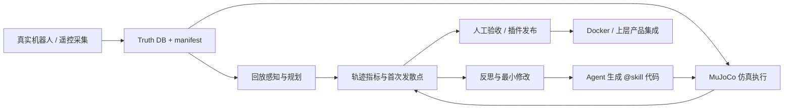

<div align="center">


# TOPSUN DimOS

### 面向通用机器人的 Agent-Native 运行时与验证闭环

[](LICENSE)
[](pyproject.toml)
[](docs/usage/transports/dds.md)
[](docs/development/docker.md)

<p>
把机器人传感器、模块、技能、Agent、仿真/回放和交付环境接成一条可复现的工程链路。
</p>

[动机](#为什么做) ·
[能力路线](#能力路线) ·
[工作闭环](#从机器人数据到可验收代码) ·
[一个月计划](#未来一个月工作安排) ·
[交付物](#五类交付物)

**当前定位：研究版 / Alpha。代码底座和部分工具已在仓库中；论文、网站、公开数据集和正式发布版本仍需单独验收。**

</div>

> 本 README 的结构参考 [HoloMotion](https://github.com/HorizonRobotics/HoloMotion) 的公开项目组织方式：先说明动机与目标，再给出路线、工作流、用户入口和论文/数据/部署交付物。参考项目的事实不等于 TOPSUN DimOS 已具备同等结果。

## 为什么做

机器人 Agent 的难点不是“能不能让大模型调用一个函数”，而是让一段代码在真实约束下可重复、可诊断、可交付：

- 传感器、控制器和算法模块缺少稳定的输入/输出契约；
- Agent 生成的机器人代码可能语法正确，但坐标系、方向、时序或参数语义错误；
- 仅靠 demo 或一次现场成功，无法说明代码能在另一条路线、另一台机器人或下一次运行中复现；
- 仿真、回放、真机、日志和 Docker 环境如果不能对齐，问题很难定位和回归。

TOPSUN DimOS 的目标，是提供一套 Python-first、模块化、Agent-native 的机器人研发底座：

> **让机器人能力先变成有契约的模块和技能，再变成有数据、有指标、有回退路径的可验收插件。**

### 事实、计划与未知

| 类别 | 当前结论 |
|---|---|
| 已有代码事实 | `dimos/` 包含模块、Blueprint、机器人连接、导航、感知、操作、Agent/MCP、回放和 Docker 构建链路。 |
| 已有研究底座 | `dimos/eval/codegen_loop/`、`tools/skill_lint/`、`tools/interruption_checkpoint/` 和 `tools/capability_bayes/` 已有代码或工具文档。 |
| 当前计划 | 用真值数据集、仿真轨迹、ATE/RPE/Hit Rate 和首次发散点，形成 AI 代码生成的可验证闭环。 |
| 尚未证明 | 公开论文、公开网站、公开数据集、量产级安全认证、跨机器人泛化和真实机器人长期稳定性。 |

## 能力路线

我们将能力分成四层，避免把“框架能运行”直接写成“产品已量产”：

| 层级 | 目标 | 代表能力 | 状态 |
|---|---|---|---|
| L1：模块化运行时 | 让机器人能力可组合 | typed streams、Module、Blueprint、`autoconnect()` | 代码已有，按环境验证 |
| L2：Agent 接口 | 让 Agent 能安全发现和调用能力 | `@skill`、MCP Server/Client、CLI | 代码与示例已有 |
| L3：数据与评测 | 让生成代码可以复现和诊断 | truth DB、replay、MuJoCo、ATE/RPE、首次发散点 | 工具与方案持续完善 |
| L4：产品化交付 | 让能力可接入上层产品 | 插件契约、权限/安全门、Docker、版本与数据清单 | 规划中，需独立验收 |

### 路线目标

| 阶段 | 目标能力 | 本仓库对应工作 | 验收边界 |
|---|---|---|---|
| P0 | 一个场景可复现 | Go2-W 真值采集、回放/仿真、轨迹对比 | 有 DB、manifest、check 和可重复命令 |
| P1 | 一个 Agent 技能可评测 | `@skill` 白名单、生成代码、仿真运行、指标反馈 | 不以 LLM 返回成功作为通过 |
| P2 | 一个插件可集成 | 导航/巡检或感知记忆插件 | 有输入输出契约、失败回退和人工验收 |
| P3 | 一套可交付物 | 网站、代码、论文、数据集、Docker 镜像 | 每项都有公开地址、版本或明确的待补状态 |

## 从机器人数据到可验收代码



这条闭环的关键不是“自动改很多次”，而是每一次修改都能回答三个问题：

1. 代码在什么场景、什么起点、什么数据上运行；
2. 它与真值或基线差在哪里，首次发散发生在什么时间和位姿；
3. 修改后是否通过明确阈值、回退策略和人工验收。

### 评测口径

- **ATE**：衡量对齐后的绝对轨迹误差；
- **RPE**：衡量时间窗口内的相对位移误差；
- **Hit Rate**：按路线顺序通过等距 waypoint 的比例；
- **First Divergence**：记录第一处超过阈值的轨迹偏差，作为 Agent 反思输入；
- **PASS / HOLD / FAIL**：缺少可归因证据时保持 HOLD，不把“命令返回成功”当作物理任务成功。

详细规约见 [Codegen Loop Spec](CODEGEN_LOOP_SPEC.md)、[AI 代码轨迹闭环方案](AI_CODEGEN_TRAJECTORY_LOOP.md) 和 [Go2-W 真值轨迹采集](docs/development/go2_truth_capture.md)。

## 解决什么问题

| 场景 | 需要解决的问题 | 当前入口 | 证据边界 |
|---|---|---|---|
| 机器人研发 | 传感器、规划、控制和可视化模块难以组合 | [Modules](docs/usage/modules.md)、[Blueprints](docs/usage/blueprints.md) | 框架能力不等于每台硬件均已验证 |
| 室内导航/巡检 | 让机器人按路线移动、建图、避障并保留回放 | [Navigation](docs/capabilities/navigation/readme.md)、`unitree-go2` | 需要真实场景和安全验收 |
| Agent 控制 | 用自然语言发现和调用机器人技能 | [Agent/MCP](docs/capabilities/agents/readme.md)、`dimos mcp` | MCP 调用成功不等于动作完成 |
| 感知与记忆 | 将相机、激光、目标和空间记忆接入同一运行时 | [Perception](docs/capabilities/perception/readme.md)、[Memory](docs/capabilities/memory/index.md) | 识别、定位、持久性需按任务测量 |
| 操作与遥操作 | 接入 xArm、Piper、OpenArm、Quest、手机等入口 | [Manipulation](docs/capabilities/manipulation/readme.md)、[Teleop](dimos/teleop/README.md) | 需要按机械臂、控制器和限位分别验收 |
| AI Coding | 让生成的机器人代码经历仿真、指标、反思和迭代 | [codegen_loop](dimos/eval/codegen_loop/)、[评测方案](docs/development/ai_coding_data_loop_plan.md) | 当前是研究闭环，不能直接宣称量产 |

## 用户从哪里开始

| 你的目标 | 起点 | 需要什么 |
|---|---|---|
| 只看回放或跑无硬件示例 | `dimos --replay run unitree-go2` | Python 环境和仓库数据；不需要真机 |
| 在仿真中运行 G1 Agent | `dimos --simulation run unitree-g1-agentic-sim` | 仿真依赖；不发送真机控制 |
| 让 Agent 通过 MCP 调用技能 | `dimos --replay run unitree-go2-agentic --daemon` | MCP Server/Client 和对应模型配置 |
| 开发一个模块 | [Use DimOS as a Library](docs/usage/python-api.md) | Python、Module、In/Out stream |
| 采集 Go2-W 真值数据 | [Truth Capture](docs/development/go2_truth_capture.md) | 真机、遥控器、现场安全负责人 |
| 构建交付环境 | [Docker Images](docs/development/docker.md) | Docker；需要发布时再固定镜像 digest |

### 最小安装与检查

```bash
uv sync --extra all

# 查看当前仓库可运行的 Blueprint
uv run dimos list

# 无硬件回放
uv run dimos --replay run unitree-go2

# G1 仿真
uv run dimos --simulation run unitree-g1-agentic-sim
```

### Agent / MCP 快速入口

```bash
uv run dimos --replay run unitree-go2-agentic --daemon
uv run dimos status
uv run dimos mcp list-tools
uv run dimos agent-send "explore the room"
uv run dimos stop
```

涉及真实机器人时，先完成机器人网络、控制权、限位、看护人和急停确认；本 README 不替代现场 SOP。

## 特色功能

### 1. Typed Streams + Blueprint 组合

模块通过 `In[T]` / `Out[T]` typed streams 通信，Blueprint 通过 `autoconnect()` 按名称和类型连接模块。这样可以在不重写整个机器人应用的情况下替换感知、导航、Agent 或硬件适配器。

### 2. `@skill` 到 MCP 的 Agent 接口

`@skill` 将机器人能力变成带文档和参数类型的工具，MCP Server 对外暴露技能，MCP Client 或其他 Agent 可以发现并调用它们。静态检查器位于 [tools/skill_lint](tools/skill_lint/README.md)，不会导入机器人模块或连接硬件。

### 3. Truth DB 驱动的回放与仿真评测

真值采集使用 `odom`、`lidar`、`color_image` 等流，并保存 manifest 与检查结果；同一份数据可以被回放、分析和用于构建回归基线。具体字段与门禁见 [Go2-W Truth Trajectory Capture](docs/development/go2_truth_capture.md)。

### 4. 首次发散点驱动的 AI 代码闭环

轨迹评测不只输出一个分数，还可以定位第一处偏差的时间、位置和航向，帮助 Agent 做“最小修改”。这是本仓库当前最值得形成论文和数据集的研究方向，但结果仍需在多个独立场景上验证。

### 5. 可中断、可恢复的研发流程

[中断检查点](tools/interruption_checkpoint/README.md)保存目标、最后完成、下一动作、阻碍和验收证据；它是工程协作支架，不是机器人能力或人员能力的证明。

## 论文点、亮点与特色方向

以下是候选论文点，不代表论文已经投稿或结果已经成立。

| 候选题目 | 核心亮点 | 需要的验证 |
|---|---|---|
| Evidence-Bounded Code Generation for Generalist Robots | 将 Agent 生成的技能放入“生成 → 仿真/回放 → 轨迹指标 → 首次发散诊断 → 最小修改”闭环 | 至少 3 个独立路线、固定基线、完整运行日志和人工验收 |
| Truth DB as a Regression Contract for Robot Agents | 用遥控真值 DB、manifest、数据切片和回放协议把机器人任务变成可回归样本 | 数据集卡、许可、哈希、跨版本重放和失败样本 |
| Typed Robot Skills with Blueprint Composition | 用 typed streams、Blueprint 和 MCP 把模块能力暴露给 Agent，并保持可替换性 | 接口稳定性、跨机器人适配、故障注入和延迟/吞吐测试 |

### 论文与数据当前状态

- 论文全文：—
- 公开预印本：—
- 公开数据集地址：—
- 当前可复用的内部研究材料：[`PROJECT_PLAN_AI_CODING_ON_ROBOTS.md`](PROJECT_PLAN_AI_CODING_ON_ROBOTS.md)、[`CODEGEN_LOOP_SPEC.md`](CODEGEN_LOOP_SPEC.md)、[`dimos/eval/codegen_loop/`](dimos/eval/codegen_loop/)。

## 可被上层量产集成的 Plugin

这里的“可集成”只表示接口方向和代码基础，不表示已经满足量产准入。

| Plugin | 解决场景 | 对外接口 | 当前基础 | 量产前必须补齐 |
|---|---|---|---|---|
| Robot Adapter | 统一接入 Go2、G1、B1、无人机和机械臂 | Module / Blueprint | `dimos/robot/`、`dimos/control/` | 设备矩阵、版本兼容、断链回退、现场 SOP |
| Navigation & Patrol | 室内巡检、路线执行、目标跟随 | `@skill` / MCP / stream | `dimos/navigation/`、导航 Blueprint | 地图版本、任务超时、急停、失败回退、长期稳定性 |
| Perception & Spatial Memory | 目标识别、定位、空间记忆和复盘 | sensor streams / memory API | `dimos/perception/`、`dimos/memory2/` | 数据闭环、误检漏检指标、隐私与存储策略 |
| Agent Skill Gateway | 让上层 Agent 发现和调用机器人能力 | MCP Server / Client | `dimos/agents/mcp/`、`@skill` | 权限分级、参数校验、审计、沙箱、人工接管 |
| Truth Capture & Replay | 采集真值、构建回归样本、复现问题 | DB + manifest + CLI | `dimos/robot/unitree/go2/cli/truth_capture.py`、[采集文档](docs/development/go2_truth_capture.md) | 数据集版本、脱敏、自动质检、发布清单 |
| Safety Gateway / Watchdog | 限制危险动作并在异常时回退 | 本地 gate / watchdog | 作为量产必需项规划 | 必须由安全负责人和硬件负责人独立验收，不能由 LLM 自证 |

推荐的产品接入顺序：

```text
Robot Adapter → Safety Gateway → Navigation/Perception Plugin → Agent Skill Gateway → 上层产品
                                      ↓
                             Truth Capture & Replay
```

## 未来一个月工作安排

人员姓名和最终负责人尚未提供，先按工作流角色排期；姓名栏有信息后直接补入，不改变任务边界。

| 人员 | 工作流角色 | 具体功能与场景 | 第 1 周：冻结边界 | 第 2 周：跑通闭环 | 第 3 周：扩大验证 | 第 4 周：形成交付 |
|---|---|---|---|---|---|---|
|  | 运行时 / Blueprint | 统一模块、stream、Blueprint 和 Plugin Contract，服务于 Go2/G1/机械臂接入 | 列出支持矩阵、输入输出和失败状态 | 跑通 1 个 Blueprint + 1 个 mock 插件 | 做接口兼容和故障注入 | 输出 API 文档、示例和版本说明 |
|  | 机器人 / 安全 | Go2-W 室内巡检或路线跟随，解决真机控制、停止和回退问题 | 确认设备、网络、控制权、限位和急停 SOP | 完成 1 条安全真值路线 | 至少 3 条路线或场景重复测试 | 输出现场 SOP、风险清单和验收记录 |
|  | 数据 / 评测 | Truth DB、manifest、replay、ATE/RPE/Hit Rate、首次发散诊断 | 固定数据字段、命名、哈希和指标阈值 | 跑通 GT → sim/replay → report | 做独立场景、失败样本和基线对比 | 输出 Dataset Card、评测报告和可复现实验命令 |
|  | Agent / Plugin | `@skill`、MCP、技能白名单和一个可集成上层的插件 | 冻结技能 schema、权限和输入校验 | 完成一个 Agent 调用场景 | 接入评测反馈和最小修改 | 输出插件包、调用文档和安全边界 |
|  | 论文 / 网站 / 发布 | 将工程结果整理成网站、文章、代码、数据和镜像 | 确定论文问题、图表、网站栏目和发布清单 | 收集可公开的结果与失败案例 | 完成初稿、网页草图和 Docker smoke test | 发布候选版本；缺证据的栏目保持空白 |

### 一个月的最小验收门槛

1. 至少 1 个场景能从数据采集/读取开始，完整复现到报告；
2. 至少 1 个 Agent 技能能在 mock 或仿真环境完成可归因评测；
3. 至少 1 个插件拥有明确输入输出、错误处理、回退路径和人工验收人；
4. 三类公开交付状态可明确回答：已发布、内部可用，或尚未具备；
5. 不把 prompt、截图、单次 demo 或模型返回值单独当成量产证据。

## 五类交付物

| 交付物 | 当前仓库证据 | 目标形态 | 当前状态 |
|---|---|---|---|
| 1. 网站 | `docs/` 和 `docs/docs.json` 文档源 | 一个公开、可导航、带版本和 Demo/论文/数据入口的网站 | 公开地址：— |
| 2. Code | [`dimos/`](dimos/)、[`tools/`](tools/)、[开发文档](docs/development/) | 可安装、可复现、带最小示例和测试的代码仓库 | 代码底座已有；量产验收待补 |
| 3. 论文 / 文章 | 候选论文点与实验方案 | 预印本、技术报告或正式文章，包含方法、基线、失败案例和限制 | 公开论文：— |
| 4. 数据集 | [真值采集流程](docs/development/go2_truth_capture.md)、`data/` | 带 Dataset Card、许可、manifest、哈希、训练/验证/测试划分的数据集 | 公开下载：— |
| 5. Docker 镜像 | [`docker/`](docker/)、[镜像说明](docs/development/docker.md)、GHCR workflow | 固定版本和 digest，可按一条命令运行并复现关键结果 | 构建链路已有；正式版本/digest 待补 |

### 交付物完成定义

只有同时具备“地址/版本、运行命令、输入输出说明、已知限制、验收证据”的交付物，才标记为完成。没有公开地址或独立验收记录的项目保持 `HOLD`。

## 仓库导航

- [安装与系统要求](docs/requirements.md)
- [CLI 使用](docs/usage/cli.md)
- [Modules](docs/usage/modules.md)
- [Blueprints](docs/usage/blueprints.md)
- [数据流与回放](docs/usage/data_streams/README.md)
- [导航](docs/capabilities/navigation/readme.md)
- [感知](docs/capabilities/perception/readme.md)
- [Agent / MCP](docs/capabilities/agents/readme.md)
- [操作与机械臂](docs/capabilities/manipulation/readme.md)
- [Docker](docs/development/docker.md)
- [测试](docs/development/testing.md)

## Citation

目前暂无 TOPSUN DimOS 的公开论文或正式 BibTeX。论文发布后在此补充。

## 参考布局与致谢

- README 结构参考 [HoloMotion](https://github.com/HorizonRobotics/HoloMotion)；
- 研究方法可对照 [HoloMotion project site](https://horizonrobotics.github.io/robot_lab/holomotion/) 和 [HoloMotion-1 Technical Report](https://arxiv.org/abs/2605.15336)；
- 本仓库保留 DimOS 上游项目的 Apache-2.0 许可与相关署名，详见 [LICENSE](LICENSE)。
