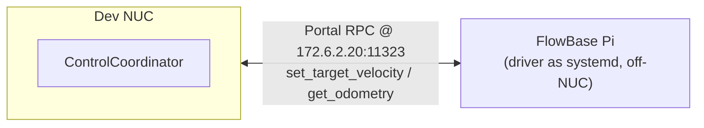

# FlowBase

Holonomic base control over Portal RPC. Coordinator side lives here; the
driver runs on the i2rt base.

## External system



The base driver is off-NUC. The dev NUC runs the ControlCoordinator, which
speaks Portal RPC to the Pi.

## 1. FlowBase driver

The driver (`flow_base_controller_modified.py`) runs on the FlowBase Pi as
a **systemd service** and starts automatically on boot. No SSH needed for
normal operation — it exposes a Portal RPC server on `172.6.2.20:11323`
(`set_target_velocity`, `get_odometry`) the moment the Pi is powered up.

To debug or restart the service:

```bash
ssh i2rt@172.6.2.20
systemctl --user status flow_base_controller    # check it's running
systemctl --user restart flow_base_controller   # restart
journalctl --user -u flow_base_controller -f    # tail logs
```

A `No joystick/gamepad connected` line in the logs is normal — RPC works
without a gamepad.

Verify reachability from your dev machine:

```bash
nc -vz 172.6.2.20 11323
```

## 2. Launch

Two blueprints:

```bash
# Coordinator only (drive /cmd_vel from another source)
dimos run coordinator-flowbase

# Coordinator + WASD pygame teleop
dimos run coordinator-flowbase-keyboard-teleop
```

Both use the `flowbase` adapter against `172.6.2.20:11323` and
publish/subscribe on LCM `/cmd_vel` + `/coordinator_joint_state`.

### Blueprint notes

- **`coordinator-flowbase-keyboard-teleop`** opens a small pygame window —
  **focus that window** to drive. Controls: W/S forward-back · Q/E strafe ·
  A/D turn · Shift boost · Ctrl slow · Space stop · ESC quit.
- **`coordinator-flowbase`** is just the bare driver; you publish `/cmd_vel`
  from somewhere else.

## Notes

- Frame convention: FlowBase uses inverted Y/yaw. The adapter negates
  `vy` and `wz` before sending — commands in / odometry out are standard
  ROS frame.
- Address override: edit `_flowbase_twist_base(address=...)` in
  [mobile.py](../../../control/blueprints/mobile.py).
