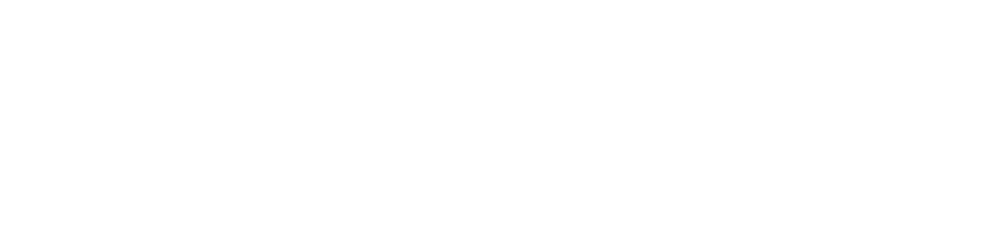

# Agents

LLM agents run as native dimOS modules. They subscribe to camera, LiDAR, odometry, and spatial memory streams and they control the robot through skills.

## Architecture

<details>
<summary>Pikchr</summary>

```pikchr fold output=assets/agent_architecture.svg
color = white
fill = none
boxrad = 5px

Input: box "humancli / WebInput" "dimos agent-send" fit wid 170% ht 170%
arrow right 0.6in "human_input" above "In[str]" below
Agent: box "McpClient" "LangGraph + LLM" fit wid 170% ht 170%
Skills: box "@skill methods" "on any Module" fit wid 170% ht 170% \
    with .w at (Agent.e.x + 0.9in, Agent.e.y)
arrow right 0.5in from Skills.e
Robot: box "Robot" fit wid 200% ht 190%

# The agent calls a skill and waits for what it returns, so the two directions
# get their own lane rather than one arrow standing in for both.
arrow from (Agent.e.x, Agent.e.y + 0.13in) to (Skills.w.x, Skills.w.y + 0.13in) \
    "skill call (RPC)" above
arrow from (Skills.w.x, Skills.w.y - 0.13in) to (Agent.e.x, Agent.e.y - 0.13in) \
    "result" below

Streams: box "color_image  ·  odom  ·  spatial_memory" fit wid 120% ht 170% \
    with .n at (Agent.s.x, Agent.s.y - 0.6in)
arrow from Streams.n to Agent.s "subscribes" ljust

arrow from Agent.n up 0.5in then left until even with Input.n then to Input.n \
    "agent: Out[BaseMessage]" above
```

</details>



**McpClient** (`dimos/agents/mcp/mcp_client.py`) is a `Module` with:
- `human_input: In[str]`: receives text from `humancli`, `WebInput`, or `agent-send`
- `agent: Out[BaseMessage]`: publishes agent responses (text, tool calls, images)
- `agent_idle: Out[bool]`: signals when the agent is waiting for input

The agent uses LangGraph with a configurable LLM. The default is `gpt-5.6-luna` and you need to provide an `OPENAI_API_KEY` environment variable. On startup, it discovers all `@skill`-annotated methods across deployed modules via RPC and exposes them as LangChain tools.

## Skills

Skills are methods decorated with `@skill` on any `Module`. The agent discovers them automatically at startup.

```python
from dimos.agents.annotation import skill
from dimos.core.module import Module


class MySkillContainer(Module):
    @skill
    def wave_hello(self) -> str:
        """Wave at the nearest person."""
        # ... robot control logic ...
        return "Waving!"
```

**Rules:**
- Parameters must be JSON-serializable primitives (`str`, `int`, `float`, `bool`, `list`, `dict`).
- Docstrings become the tool description the LLM sees. Write them clearly so the agent has sufficient context.
- The function should return a `str`, or any object implementing `agent_encode()` (such as an `Image` or a `SkillResult`, `dimos/agents/skill_result.py`); other return values are converted with `str()`. The result is what the agent uses to decide what to do next.

### Built-in Skills

| Skill | Module | Description |
|-------|--------|-------------|
| `move_to(x, y, degrees, relative)` | `UnitreeSkillContainer` | Drive to a world position; `relative=True` for a forward/left offset from where it stands |
| `execute_sport_command(command_name)` | `UnitreeSkillContainer` | Unitree sport commands (sit, stand, flip, etc.) |
| `wait(seconds)` | `UnitreeSkillContainer` | Pause execution |
| `observe()` | `ObserveSkill` | Capture and return current camera frame |
| `navigate_with_text(query)` | `NavigationSkillContainer` | Navigate to a location by description |
| `tag_location(location_name)` | `NavigationSkillContainer` | Tag current position for later recall |
| `stop_navigation()` | `NavigationSkillContainer` | Cancel current navigation goal |
| `follow_person(query)` | `PersonFollowSkillContainer` | Visual servoing to follow a described person |
| `stop_following()` | `PersonFollowSkillContainer` | Stop person following |
| `speak(text)` | `SpeakSkill` | Text-to-speech through robot speakers |
| `where_am_i()` | `GoogleMapsSkillContainer` | Current street/area from GPS |
| `get_gps_position_for_queries(queries)` | `GoogleMapsSkillContainer` | Look up GPS coordinates |
| `set_gps_travel_points(points)` | `GpsNavSkillContainer` | Navigate via GPS waypoints |
| `map_query(query_sentence)` | `OsmSkill` | Search OpenStreetMap with VLM |

## MCP

All agentic blueprints use two modules: `McpServer` and `McpClient`.

* `McpServer` exposes the methods annotated with `@skill` as MCP tools. Any external client can connect to the server to use the MCP tools.
* `McpClient` has a LangGraph LLM which calls MCP tools from `McpServer`.

CLI access:

```bash
dimos mcp list-tools                                # List available skills
dimos mcp call move_to --arg x=0.5 --arg relative=true  # Call a skill
dimos mcp status                                    # Server status
```

## Input Methods

| Method | How it works |
|--------|-------------|
| `humancli` | Standalone terminal: type messages, see responses |
| `dimos agent-send "text"` | One-shot CLI command via LCM |
| `WebInput` | Web interface at localhost:5555 with Whisper STT |

## Models

| Config | Model | Notes |
|--------|-------|-------|
| Default | `gpt-5.6-luna` | Requires `OPENAI_API_KEY` |
| `ollama:llama3.1` | Local Ollama | Requires `ollama serve` running |
| Custom | Any LangChain-compatible | Set via `McpClient.blueprint(model="...")` |
