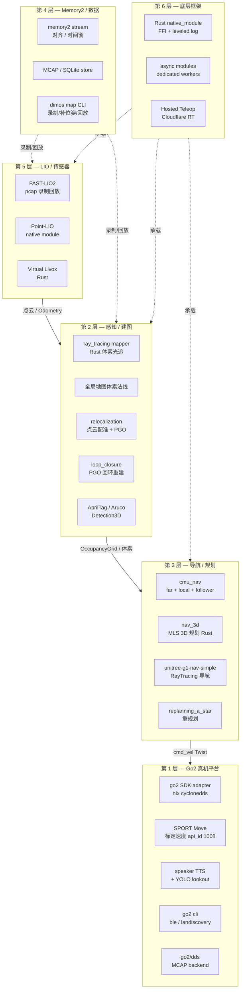
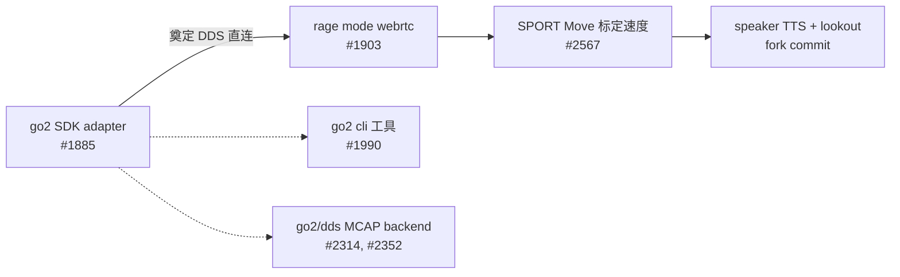
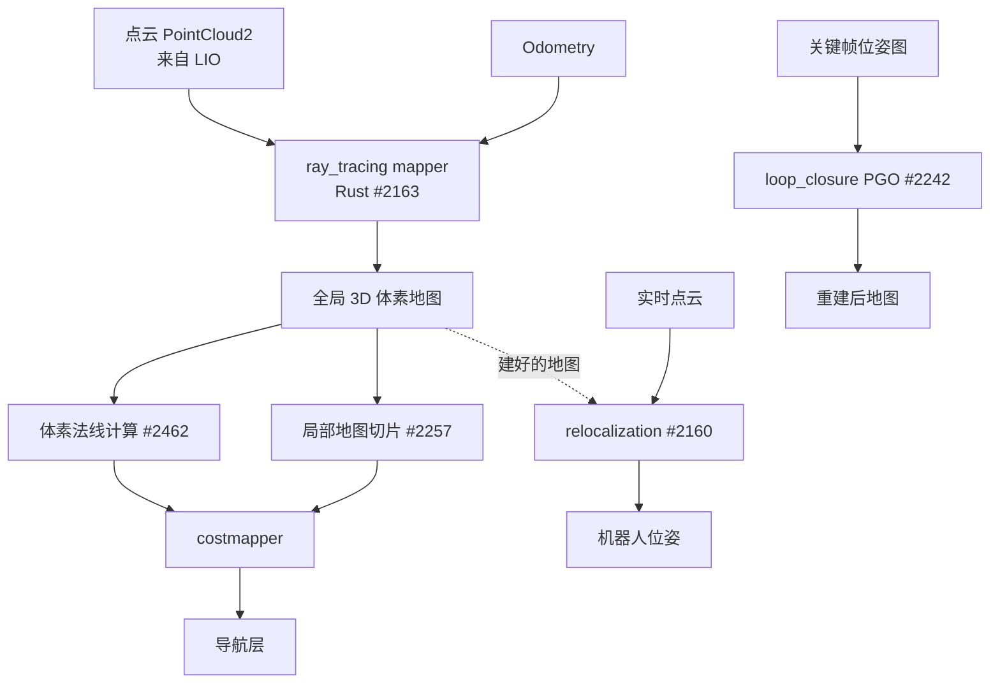
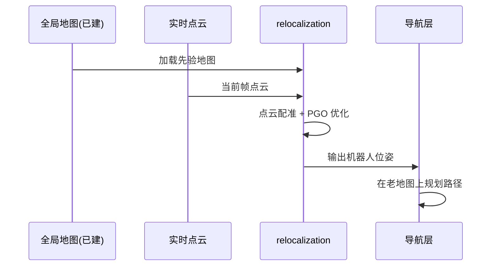
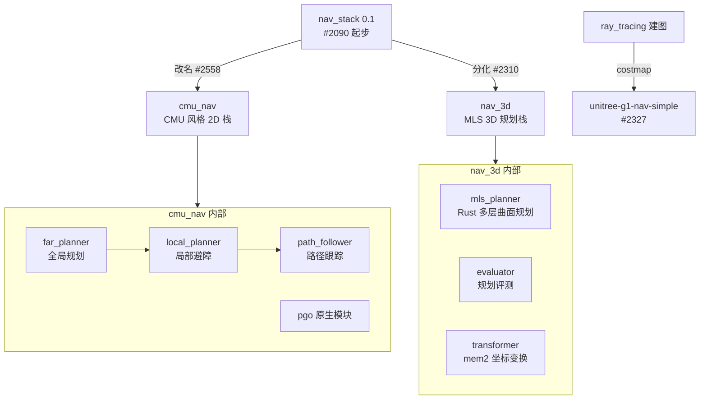
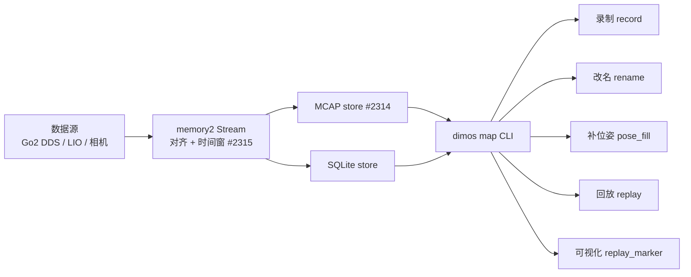
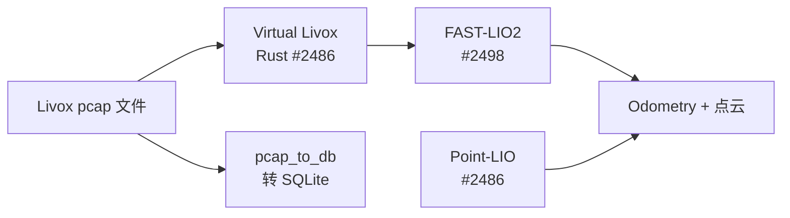
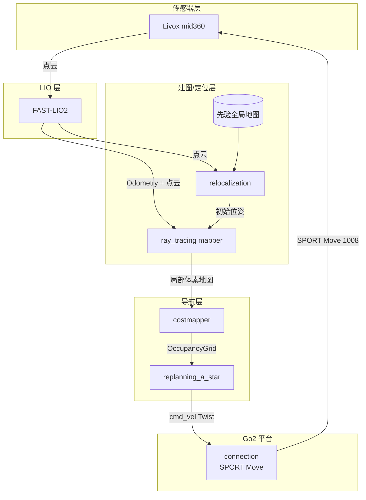
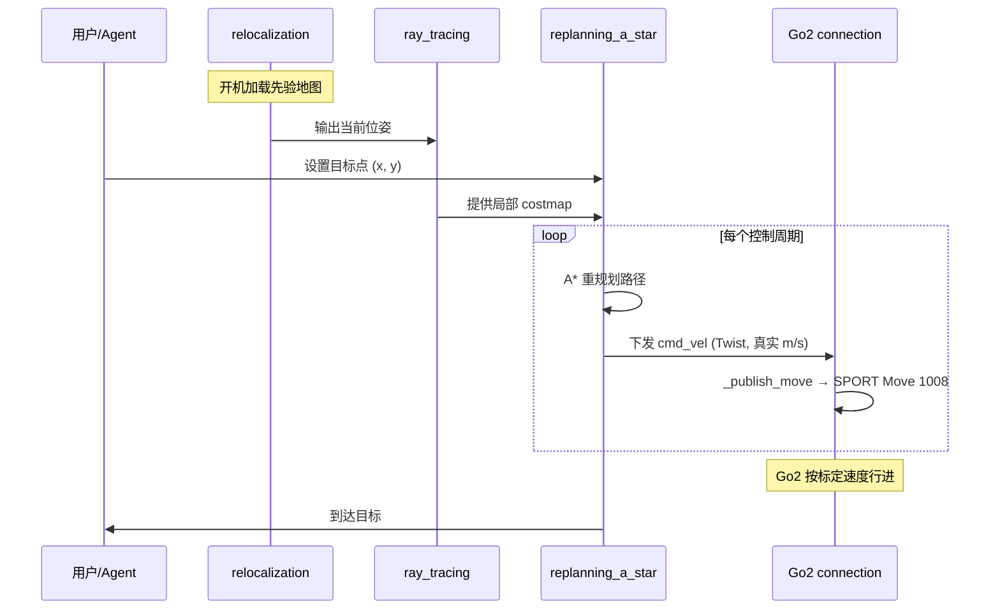

# 从零理解：upstream/main 同步的 100+ commits 都做了什么 —— Go2 与导航专题

> 这份文档写给「已经在用 dimos、熟悉 Module / Blueprint / Skill 基本概念，但没跟进上游进度」的同学。读完你会知道：本次同步把 Go2 平台、导航/建图栈、底层框架推到了什么程度，每个新模块解决什么问题，怎么跑起来。
>
> 基于 `main` 分支 commit `7d2affd7d`（merge: sync upstream/main，100 commits），merge 时间 2026-06-24。
>
> 本文是 `jiangtao/cursor/dimos-nav-mapping-update-march-to-may-2026.md`（覆盖 3-5 月）的**延续**，主要补齐 5 月中到 6 月底的进展。

---

## 目录

- [一、通俗篇：这 100 多个 commit 到底改了什么](#一通俗篇这-100-多个-commit-到底改了什么)
- [二、总览：6 大主题 × 模块对照表](#二总览6-大主题--模块对照表)
- [三、Go2 平台 — 从 SDK 到语音再到精确速度控制](#三go2-平台--从-sdk-到语音再到精确速度控制)
- [四、感知/建图 — 体素光线追踪、全局地图、回环 PGO](#四感知建图--体素光线追踪全局地图回环-pgo)
- [五、导航 — 从 nav_stack 到 cmu_nav，再到 nav_3d](#五导航--从-nav_stack-到-cmu_nav再到-nav_3d)
- [六、Memory2 与重放工具链 — 录制即回放](#六memory2-与重放工具链--录制即回放)
- [七、底层框架 — Rust 原生模块、LIO 全家桶、Hosted Teleop](#七底层框架--rust-原生模块lio-全家桶hosted-teleop)
- [八、端到端实战 — 用 Go2 跑一遍重定位 + 导航](#八端到端实战--用-go2-跑一遍重定位--导航)
- [九、扩展点与升级 cheatsheet](#九扩展点与升级-cheatsheet)

---

# 一、通俗篇：这 100 多个 commit 到底改了什么

> 这一章 0 代码、0 dimos 类名、0 模块路径，先用大白话告诉你「为什么改」「改成了什么样」。

## 1.1 一句话总结

**这次同步把 dimos 从「能建图、能导航的演示系统」推向了「能在真机上长期稳定跑的生产系统」**：Go2 真机能精确按 m/s 速度走、能说话、能在已知地图里重新定位；导航栈被拆成三套并行方案；底层大量算法（LIO、光线追踪、3D 规划）改写成 Rust 原生模块，性能和稳定性大幅提升。

## 1.2 六件最直观的事

**1）Go2 现在按「真实速度」走，不再是摇杆比例值。** 以前让 Go2 前进，发的是一个 -1~1 的摇杆归一化值，机器人实际走多快全凭firmware心情。现在改成 Unitree 官方的 SPORT `Move` 接口（api_id 1008），你说「0.5 m/s」它就真的走 0.5 m/s。导航规划器算出来的速度终于能被忠实执行了。

**2）Go2 会说话了。** 新增了机器人扬声器 TTS 能力，agent 可以让 Go2 用喇叭播报「我看到一个人」之类的内容。还加了 YOLO lookout（边走边看）和连接超时保护。

**3）机器人能在老地图里「认路」了（重定位）。** 以前每次开机都要从零建图。现在有了 relocalization 模块：给它一张之前建好的全局地图，它通过点云配准 + 位姿图优化（PGO）算出「我现在站在地图的哪个位置」，然后直接在老地图上导航。

**4）建图升级到 3D 体素光线追踪。** 不再只是 2D 栅格地图，而是用 Rust 写的光线追踪建图器，维护一张全局 3D 体素地图，还能算每个体素的法线（判断地面/墙面/斜坡），并且能切出「当前机器人周围的局部地图」给规划器用。

**5）导航栈一拆为三。** 原来的 `nav_stack` 改名 `cmu_nav`（CMU 风格的 far_planner + local_planner + path_follower）；新增 `nav_3d`（基于 MLS 多层曲面的 3D 路径规划，Rust 实现）；G1 人形机器人上线了专属的 RayTracing 导航栈 `unitree-g1-nav-simple`。

**6）数据采集→回放→评测打通了。** memory2 引入 MCAP / SQLite 后端，Go2 的 DDS 数据能直接录成标准格式；新增一整套 `dimos map` CLI 工具链（录制、改名、补位姿、回放、可视化）；FAST-LIO 支持 pcap 录制回放 + 虚拟 Livox。

## 1.3 为什么有这一波更新？

承接 3-5 月那波「记忆 + 探索 + 点击导航」的基础设施，这两个月的主线是**「让它在真机上稳、准、快」**：

| 痛点 | 旧状态 | 这次怎么解决 |
|---|---|---|
| 速度控制不准 | 摇杆归一化值，走多快不可控 | SPORT Move 标定速度，真实 m/s |
| 每次都要重新建图 | 没有重定位 | relocalization + PGO 模块 |
| Python 算法慢、易崩 | LIO/光追/规划纯 Python | 改写 Rust 原生模块 |
| 只有 2D 栅格 | costmap 2D | 3D 体素 + 法线 + 局部切片 |
| 数据格式杂乱 | 自定义录制 | MCAP/SQLite 标准化 + CLI 工具链 |

## 1.4 该重点关注哪些？

- **用 Go2 真机** → 第三章（SPORT_Move、speaker TTS、relocalization、go2 cli）
- **做导航/建图** → 第四、五章（体素光追、cmu_nav、nav_3d MLS、回环 PGO）
- **做框架/性能** → 第七章（Rust native_module、LIO 全家桶、async module、hosted teleop）

---

# 二、总览：6 大主题 × 模块对照表

> 先看一张大图：这 100 个 commit 落在哪些层、彼此怎么串。然后是「主题 → 关键 PR → 输入/输出」对照表。



**这张图怎么读**：数据从下往上流——LIO（第 5 层）吐出点云和里程计，建图层（第 2 层）做成体素/栅格地图，导航层（第 3 层）规划出路径并下发 `cmd_vel`，最终由 Go2 平台（第 1 层）执行。Memory2（第 4 层）横向贯穿，负责录制和回放任意一层的数据流。底层框架（第 6 层）是所有 Rust/算法模块的运行时载体。

## 2.1 主题 → 关键 PR → 输入/输出对照表

| 主题 | 关键 PR | 输入 | 输出 | 落点 |
|---|---|---|---|---|
| Go2 标定速度 | #2567 | `Twist`（真实 m/s） | SPORT Move 命令 | `dimos/robot/unitree/connection.py` |
| Go2 SDK 适配 | #1885 | cmd_vel | CycloneDDS 控制 | `dimos/hardware/drive_trains/unitree_go2/adapter.py` |
| Go2 重定位 | #2160 | 全局地图 + 实时点云 | 机器人位姿 | `dimos/mapping/relocalization/` |
| 体素光追建图 | #2163, #2257 | 点云 + Odometry | 全局/局部 3D 体素地图 | `dimos/mapping/ray_tracing/` |
| 体素法线 | #2462 | 体素地图 | 带法线的体素 | `dimos/mapping/` |
| 回环 PGO | #2242 | 关键帧位姿图 | 优化后地图 | `dimos/mapping/loop_closure/pgo.py` |
| cmu_nav | #2558 (改名) | 全局地图 + 目标 | 路径 + cmd_vel | `dimos/navigation/cmu_nav/` |
| nav_3d MLS | #2310, #2368 | 3D 体素表面 | 3D 路径 | `dimos/navigation/nav_3d/mls_planner/` |
| G1 导航栈 | #2327 | costmap | cmd_vel | `dimos/robot/unitree/g1/blueprints/navigation/` |
| Memory2 MCAP | #2314 | DDS 数据流 | MCAP/SQLite 文件 | `dimos/memory2/store/mcap.py` |
| dimos map CLI | #2306, #2242 | 录制 db | 对齐/补位姿/回放 | `dimos/mapping/utils/cli/` |
| FAST-LIO pcap | #2498 | Livox pcap | 里程计 + 点云 | `dimos/hardware/sensors/lidar/fastlio2/` |
| Point-LIO | #2486 | Livox 数据 | 里程计 | `dimos/hardware/sensors/lidar/pointlio/` |
| Rust native | #1794, #2080 | — | 原生模块运行时 | `native/rust/`, `dimos/core/native_module.py` |
| Hosted Teleop | #2411 | Quest VR | Cloudflare RT 流 | `dimos/teleop/quest_hosted/` |

---

# 三、Go2 平台 — 从 SDK 到语音再到精确速度控制

> Go2 是本次更新最受益的平台。我们按「连接 → 控制 → 表达 → 工具」四站走一遍。



## 3.1 第一站：SPORT Move — 让速度命令「说到做到」（#2567）

文件：`dimos/robot/unitree/connection.py`

**问题**：以前 `move()` 走的是 `WIRELESS_CONTROLLER`（摇杆仿真），发的是 `{lx, ly, rx, ry}` 这种 -1~1 的归一化值。规划器算出「0.5 m/s」，但实际机器人走多快取决于 firmware 内部的摇杆映射曲线，**不可标定、不可复现**。

**答案**：改用 Unitree 官方 SPORT `Move` 接口（api_id 1008），参数直接是真实的 `{x, y, z}` 速度（m/s 和 rad/s）。

核心改动（节选）：

```python
def _publish_move(self, vx: float, vy: float, vyaw: float) -> None:
    """发布一条 SPORT Move（api_id 1008）速度命令。"""
    self._move_seq += 1
    payload = {
        "header": {"identity": {"id": self._move_seq, "api_id": SPORT_CMD["Move"]}},
        # parameter 必须是 JSON 字符串（firmware 约定）
        "parameter": json.dumps({"x": vx, "y": vy, "z": vyaw}),
    }
    self.conn.datachannel.pub_sub.publish_without_callback(
        RTC_TOPIC["SPORT_MOD"],  # "rt/api/sport/request"
        data=payload,
        msg_type=DATA_CHANNEL_TYPE["REQUEST"],
    )
```

| 维度 | 旧（WIRELESS_CONTROLLER） | 新（SPORT Move 1008） |
|---|---|---|
| 参数 | `{lx, ly, rx, ry}` 归一化 -1~1 | `{x, y, z}` 真实 m/s / rad/s |
| 坐标系 | 摇杆映射（x 右、y 前） | body frame（x 前、y 左、z yaw CCW）|
| 可标定 | 否 | 是 |
| 停止 | 发零摇杆 | 发零速度 Move（与命令路径一致） |

> **关键点**：导航/规划链路下发的 `cmd_vel` 现在能被 Go2 忠实执行，这是「精确导航」在 Go2 上落地的前提。

## 3.2 第二站：Go2 SDK adapter + CycloneDDS（#1885）

文件：`dimos/hardware/drive_trains/unitree_go2/adapter.py`（约 690 行新增）

**问题**：webrtc 协议复杂、延迟高（~100ms），跑不了高频控制。
**答案**：新增一条直连 DDS 的路径，用 Unitree 自家 SDK + nix 配置 CycloneDDS。局域网内延迟降到 ~10ms 级别。配套新增键盘遥控 blueprint `unitree_go2_keyboard_teleop`。

## 3.3 第三站：Rage Mode via WebRTC（#1903）

文件：`dimos/robot/unitree/connection.py`、`go2/connection.py`

解锁 Go2 的 rage mode（运动性能模式，最大前进速度可达 ~2.5 m/s），并新增 `unitree_go2_webrtc_rage_keyboard_teleop` blueprint。

## 3.4 第四站：Speaker TTS + YOLO Lookout（fork 自有 commit `07a940d5b`）

> 这是本仓库 fork 自有的 commit，不在上游 100 条里，但同属本次同步窗口，一并说明。

新增三项 Go2 能力：机器人扬声器 TTS（agent 让 Go2 用喇叭说话）、YOLO lookout（边走边检测）、连接超时保护。参见 `dimos/agents/skills/speak_skill.py`。

## 3.5 第五站：go2 cli 工具集（#1990）

文件：`dimos/robot/unitree/go2/cli/`

| 工具 | 作用 |
|---|---|
| `ble.py` | 通过蓝牙配网 / 发现 Go2 |
| `landiscovery.py` | 局域网发现 Go2 设备 |
| `go2tool.py` | Go2 综合命令行工具 |

## 3.6 第六站：go2/dds + MCAP backend（#2314, #2352）

文件：`dimos/robot/unitree/go2/dds/`（原 `go2dds`，#2352 改名归位）

把 Go2 的 DDS 原始消息（`LowState`、`SportModeState`、`IMUState`、`BmsState` 等）编解码后，作为 memory2 的 MCAP 后端录制下来。这样 Go2 真机数据就能用标准 MCAP 格式存档和回放。

---

# 四、感知/建图 — 体素光线追踪、全局地图、回环 PGO

> 建图这一块是本次更新的「硬核区」：从 2D 栅格升级到 3D 体素，且大量用 Rust 实现。



## 4.1 第一站：Voxel Ray Tracing Mapper — Rust 写的体素建图器（#2163）

文件：`dimos/mapping/ray_tracing/`（Rust 主体 `rust/src/main.rs` ~690 行 + Python `module.py`）

**问题**：纯 Python 建图器在真机点云速率下跟不上，且只能做 2D。
**答案**：用 Rust 实现光线追踪建图——对每条激光射线从原点到命中点做体素遍历，沿途标记 free / 命中点标记 occupied，维护一张全局 3D 体素地图。

| 字段 | 含义 |
|---|---|
| voxel 大小 | 体素分辨率（默认随 LIO 配置） |
| free/occupied | 光线穿过=free，命中=occupied |
| 输出 | 全局体素地图 + 可发布的局部切片 |

## 4.2 第二站：发布全局地图的局部切片（#2257）

文件：`dimos/mapping/ray_tracing/rust/src/main.rs`（+207 行）

**问题**：全局地图越建越大，规划器不需要全图，只要机器人周围一小块。
**答案**：建图器在维护全局地图的同时，按机器人当前位置切出一块局部地图发布出去，规划器订阅局部切片即可，省内存省带宽。

## 4.3 第三站：体素法线计算（#2462）

文件：`dimos/mapping/`

给全局地图的每个体素算法线方向。法线能区分地面（法线朝上）、墙面（法线水平）、斜坡（法线倾斜），这是 3D 导航判断「哪里能走」的基础——也直接喂给第五章的 MLS 3D 规划器。

## 4.4 第四站：Go2 重定位 relocalization（#2160）

文件：`dimos/mapping/relocalization/`（`module.py` + `pgo.py` + `relocalize.py`，~880 行新增）

**问题**：每次开机机器人都不知道自己在已建地图的哪儿。
**答案**：给定一张之前建好的全局地图（如 `go2_hongkong_office_twopass_map`），用实时点云做配准 + 位姿图优化（PGO），算出当前位姿，从而能直接在老地图上导航。



配套：`dimos` CLI 新增重定位相关命令（`dimos/robot/cli/dimos.py` +43 行），文档见 `docs/capabilities/mapping/relocalization.md`。

## 4.5 第五站：Loop Closure / Map Reconstruction（#2242）

文件：`dimos/mapping/loop_closure/pgo.py`（~716 行）+ `eval.py` + `test_pgo.py`

**问题**：长时间建图会累积漂移，机器人绕一圈回到起点时地图对不上。
**答案**：检测回环（机器人回到曾经来过的地方），用位姿图优化（PGO）把整条轨迹的累积误差摊平，重建一致的地图。注意此 PR 把原先放在 `relocalization/pgo.py` 的 PGO 逻辑迁移并扩展到了独立的 `loop_closure/` 模块。

配套还引入了 fiducial marker（AprilTag #2107 / Aruco #2037）的 Detection3D 支持，可作为回环/重定位的额外约束。

---

# 五、导航 — 从 nav_stack 到 cmu_nav，再到 nav_3d

> 导航是本次结构性变化最大的一块。原来一套 `nav_stack`，现在演化成「CMU 风格 2D 栈 + 3D MLS 栈 + G1 专属栈」三条线并行。



## 5.1 第一站：cmu_nav — nav_stack 改名归位（#2558）

文件：`dimos/navigation/cmu_nav/`（原 `dimos/navigation/nav_stack/`）

**问题**：`nav_stack` 这个名字太泛，让人以为是「唯一的导航栈」，实际它是 CMU 自主探索风格的一套特定实现（far_planner + local_planner + path_follower + PGO）。
**答案**：整体改名 `cmu_nav`，路径资产 `nav_stack_paths.tar.gz` → `cmu_nav_paths.tar.gz`，并更新所有引用（mobile.py、fastlio2/module.py、pointlio/module.py 等）。

`cmu_nav` 的内部模块：

| 模块 | 职责 |
|---|---|
| `far_planner` | 全局规划（远距离路径） |
| `local_planner` | 局部规划/避障 |
| `path_follower` | 路径跟踪，输出 cmd_vel |
| `nav_record` | 导航过程录制 |
| `pgo` (C++) | 位姿图优化原生模块 |
| `click_start_goal_router` | 鼠标点击设起点/终点 |

> nav_stack 0.1（#2090 Flowbase 集成 + 后续 Nav pt1/pt2）是这套栈的起点，详见 3-5 月那篇笔记，本次主要是改名 + 稳定化。

## 5.2 第二站：nav_3d MLS Planner — Rust 写的 3D 规划器（#2310）

文件：`dimos/navigation/nav_3d/mls_planner/`（Rust 主体 ~2400 行）

**问题**：2D 栅格规划无法处理斜坡、台阶、多层结构。
**答案**：基于 MLS（Multi-Level Surface，多层曲面）做 3D 路径规划。Rust 实现，模块拆分清晰：

| Rust 源文件 | 职责 |
|---|---|
| `surfaces.rs` | 从体素构建多层曲面 |
| `nodes.rs` / `edges.rs` | 构图：可通行节点 + 连接边 |
| `adjacency.rs` | 邻接关系 |
| `dijkstra.rs` | 最短路搜索 |
| `planner.rs` | 规划主流程 |
| `voxel.rs` | 体素表示 |

配套：`evaluator/`（规划评测，从 nav_stack 迁来）、`click_start_goal_router.py`（点击设目标）。

## 5.3 第三站：ray tracer + planner 的 mem2 坐标变换（#2368）

文件：`dimos/mapping/ray_tracing/transformer.py`、`dimos/navigation/nav_3d/mls_planner/transformer.py`

**问题**：建图和规划用的数据来自 memory2 录制流，坐标系不统一。
**答案**：给光追建图器和 MLS 规划器各加一个 `transformer`，统一把 mem2 数据变换到规划坐标系，并新增 `plan_rrd.py`（规划结果导出到 Rerun 的 .rrd 可视化）。

## 5.4 第四站：G1 RayTracing 导航栈（#2327）

文件：`dimos/robot/unitree/g1/blueprints/navigation/unitree_g1_nav_simple.py`

**问题**：G1 人形机器人此前没有开箱即用的导航栈。
**答案**：基于 ray_tracing 建图 + costmapper + replanning_a_star，组装出 `unitree-g1-nav-simple` blueprint。同时改进了 `costmapper.py`（+51 行）和 `replanning_a_star/module.py`，并补齐 G1 的 primitive/vis blueprint 体系。

运行：

```bash
dimos --simulation run unitree-g1-nav-simple
```

## 5.5 第五站：Flowbase 集成 + Nav 降噪（#2090, #2095）

- **#2090 Flowbase**：把 Flowbase 驱动底盘接入 `control/blueprints/mobile.py`（+161 行），新增 Flowbase adapter 和 README。
- **#2095 降噪**：调 fastlio、PGO、replanning_a_star 的参数，减少导航抖动。
- **#2466**：把 mid360 的 scan voxel 默认值设为 0.1 m，修复里程计发散问题——真机调参的关键一行。

---

# 六、Memory2 与重放工具链 — 录制即回放

> Memory2 是 dimos 的「记忆 + 数据」基础设施。本次重点是：标准化存储格式（MCAP/SQLite）+ 完整的 CLI 工具链。



## 6.1 dimos map CLI 工具链（#2306）

文件：`dimos/mapping/utils/cli/`（从 `dimos/utils/cli/map.py` 迁移并大幅扩展）

| 工具 | 作用 |
|---|---|
| `replay.py` | 回放录制数据 |
| `pose_fill.py` | 给缺位姿的帧补插值位姿 |
| `rename.py` | 重命名数据流 |
| `summary.py` | 数据集摘要统计 |
| `replay_marker.py` | 回放时叠加 marker 可视化 |
| `pgo_auto.py` | 自动位姿图优化（~854 行） |

配套引入大量 LFS 录制数据（HK office/village/building 用于回环和重定位评测）。

## 6.2 MCAP 后端 + 流对齐（#2314, #2315）

- **MCAP store**：`dimos/memory2/store/mcap.py`，把数据流写成业界标准 MCAP 格式，方便用 Foxglove 等外部工具查看。
- **流对齐**：`memory2/stream.py` 支持多流时间对齐 + 时间窗口（time windowing），解决「点云和里程计时间戳不一致」的问题。

## 6.3 录制/回放修复

| PR | 修复点 |
|---|---|
| #1925 | Go2 autorecorder 修复 |
| #2034 | go2 recording 修复 |
| #2025 | 回放内存泄漏修复 |
| #2031 | mapper 内存泄漏 + measurement transforms |
| `9e0fac5fb` (fork) | 防止 Rerun 冻结 + 修复 replay-db 路径解析 |

---

# 七、底层框架 — Rust 原生模块、LIO 全家桶、Hosted Teleop

> 这一层是「让上面所有东西跑得快、跑得稳」的地基。

## 7.1 Rust Native Module 框架（#1794, #2080, #2351）

文件：`native/rust/`（`module.rs` ~416 行 + `lcm.rs` + `transport.rs`）、`dimos/core/native_module.py`

**问题**：Python 模块在高频数据流下有 GIL 和性能瓶颈。
**答案**：建立 Rust 原生模块框架，让模块能用 Rust 写，通过 LCM/SHM 与 Python 模块互通。后续 FastLIO、Point-LIO、ray_tracing、mls_planner 全部基于它。

相关后续：
- #2080 Rust 性能和 API 改进
- #2351 Rust 模块 FFI
- #2200 Rust 在丢 LCM 包时告警
- #2207 原生模块在 build 阶段编译
- #2235 原生模块分级日志
- #2205 CI 加 Rust format + 测试

## 7.2 LIO 全家桶 — FAST-LIO2 + Point-LIO + Virtual Livox



- **FAST-LIO pcap 录制回放（#2498）**：`fastlio2` 大重构，新增 `recorder.py` + `tools/pcap_to_db.py`（~500 行），支持把 Livox pcap 转成可回放的 db。C++ 主体 `main.cpp` 大幅精简（从 voxel_map.hpp 等下沉到原生模块框架）。
- **Point-LIO 原生模块（#2486）**：全新 `dimos/hardware/sensors/lidar/pointlio/`，C++ 实现（~518 行 main.cpp）+ Python module + blueprints。
- **Virtual Livox（#2486）**：Rust 实现的虚拟 Livox（~531 行 main.rs），无真机也能产生 mid360 数据流测试 LIO/建图。

## 7.3 Async Modules + 专属 Worker（#1920, #2185）

- **#1920 async modules**：模块支持异步运行，不阻塞主循环。
- **#2185 dedicated workers**：模块可申请专属 worker 进程，重负载模块不影响其他模块。
- **#3bda85b9f**：patrol 巡逻模块改造成异步模块。

## 7.4 Hosted Teleop over Cloudflare RT（#2411）

文件：`dimos/teleop/quest_hosted/`（~2100 行新增）

把机器人相机流通过 Cloudflare Realtime 推到 Quest VR 头显，实现「云端中转的远程遥操作」——操作者不用和机器人在同一局域网。配套有时钟同步（`test_clock_sync.py`）、视频统计、SDP 协商等完整实现。

## 7.5 其他基础设施清理

| 主题 | PR | 说明 |
|---|---|---|
| 移除 rpyc | #2094 | 删掉旧的 RPC 库 |
| 移除 Foxglove viewer | #2122 | 统一到 Rerun |
| 删 docker_module | #2224 | 清理并行进程层级 |
| 删 agents_deprecated | #2335 | 删除旧 agent 实现 |
| LFS 后端迁移 | #2022 | GitHub LFS → lfs.dimensionalos.com |
| robot_id 配置 | #2490 | GlobalConfig 加 robot_id |
| TF 等待未来变换 | #2229 | TF service 支持等待未来 transform |

---

# 八、端到端实战 — 用 Go2 跑一遍重定位 + 导航

> 把前面几章的模块串起来，看一次完整任务里数据怎么流动。

## 8.1 拓扑图



## 8.2 一次「去某点」的时序



## 8.3 关键命令

```bash
# 1. Go2 真机 + 重定位 + 导航（先准备好先验地图）
dimos run unitree-go2 --robot-ip 192.168.123.161

# 2. 回放已录数据做建图/定位调试（无真机）
dimos --replay run unitree-go2

# 3. G1 仿真导航
dimos --simulation run unitree-g1-nav-simple

# 4. 用 dimos map CLI 回放并补位姿
dimos map replay <db-file>

# 5. agentic + MCP（可让 agent 调 move 等 skill）
dimos --replay run unitree-go2-agentic --daemon
dimos mcp call move --json-args '{"x": 0.5, "duration": 2.0}'
```

> 注意：`move` skill 现在下发的 `x` 是真实 m/s（SPORT Move），不再是摇杆归一化值。

---

# 九、扩展点与升级 cheatsheet

## 9.1 升级后需要注意的兼容性变化

| 变化 | 影响 | 应对 |
|---|---|---|
| `nav_stack` → `cmu_nav` | import 路径变了 | 改 `dimos.navigation.cmu_nav` |
| `go2dds` → `go2/dds` | import 路径变了 | 改 `dimos.robot.unitree.go2.dds` |
| SPORT Move 速度语义 | `move()` 参数从归一化变真实 m/s | 重新标定上层速度命令 |
| 移除 rpyc / Foxglove | 依赖这些的代码失效 | 改用 Rust 模块 / Rerun |
| 删 docker_module | docker 模块层级没了 | 用 native_module |
| LFS 后端迁移 | 拉数据走新地址 | `git lfs pull` 自动用新 endpoint |

## 9.2 参数 cheatsheet

| 想做的事 | 看哪 |
|---|---|
| 改 Go2 速度命令 | `dimos/robot/unitree/connection.py::_publish_move` |
| 调 mid360 voxel 分辨率 | `fastlio2/config/mid360.yaml`（默认 0.1 m） |
| 配置 cmu_nav 路径资产 | `data/.lfs/cmu_nav_paths.tar.gz` |
| 调 MLS 3D 规划 | `dimos/navigation/nav_3d/mls_planner/rust/src/planner.rs` |
| 加载先验地图重定位 | `dimos/mapping/relocalization/module.py` |
| 录制/回放数据 | `dimos map` CLI（`dimos/mapping/utils/cli/`） |
| G1 导航 | `unitree-g1-nav-simple` blueprint |

## 9.3 推荐配套阅读

- 3-5 月那篇：`jiangtao/cursor/dimos-nav-mapping-update-march-to-may-2026.md`
- 导航/建图通俗教程：`jiangtao/cursor/dimos-navigation-mapping-tutorial.md`
- 重定位专题：`jiangtao/cursor/dimos-relocalization-tutorial.md`
- 上游文档：`docs/capabilities/mapping/relocalization.md`、`docs/platforms/quadruped/go2/index.md`

## 9.4 怎么自己验证这次同步

```bash
# 看本次 merge 引入了哪些 commit
git log --oneline 7d2affd7d~101..7d2affd7d~1

# 看某个 PR 改了哪些文件
git show --stat <sha>

# 重新生成 blueprint 注册表（若新增/改名了 blueprint）
pytest dimos/robot/test_all_blueprints_generation.py

# 快速跑回放验证建图/导航链路
dimos --replay run unitree-go2
```

---

> 本文档基于 `main` 分支 commit `7d2affd7d`（merge: sync upstream/main，100 commits）。后续上游继续演进时细节可能调整，但「Go2 标定速度 + 三套导航栈 + Rust 原生 LIO/建图/规划 + memory2 标准化」这条主线应保持稳定。


