# 从零理解: upstream/main 同步的 75 commits 都做了什么 - 传输层 / 学习管线 / Go2 增强专题

> 这份文档写给「已经在用 dimos、熟悉 Module / Blueprint / Skill 基本概念, 但没跟进上游 6 月底到 7 月初进度」的同学。读完你会知道: 本次同步把传输层从「只有 LCM」推向「LCM + Zenoh + WebRTC SFU 三后端可选」, 把数据采集从「只录不炼」推向「teleop -> record -> LeRobot/HDF5 端到端管线」, 把 Go2 从「能走」推向「能 rage + 能查电量 + 能低状态遥测」, 还引入了 Scene 离线烹饪和多层 3D 导航。
>
> 基于 `jtlinux` 分支 commit `77ca3291c` (merge: integrate upstream/main `fdf3cb7d` on `7d2affd7d` baseline), merge 时间 2026-07-09。
>
> 本文是 `docs/cursor/20260624-upstream-main同步说明-100commits.md` (覆盖到 6 月底) 的**延续**, 主要补齐 6 月底到 7 月 9 日的 75 条上游 commit。

---

## 目录

- [一、通俗篇: 这 75 个 commit 到底改了什么](#一通俗篇这-75-个-commit-到底改了什么)
- [二、总览: 5 大主题 x 模块对照表](#二总览5-大主题--模块对照表)
- [三、传输层 - 从 LCM 单后端到 Zenoh / WebRTC SFU 三选](#三传输层--从-lcm-单后端到-zenoh--webrtc-sfu-三选)
- [四、学习与遥操作 - teleop 到 LeRobot 数据集的端到端管线](#四学习与遥操作--teleop-到-lerobot-数据集的端到端管线)
- [五、Go2 平台增强 - rage 模式 / 低状态 / 电池 SOC](#五go2-平台增强--rage-模式--低状态--电池-soc)
- [六、建图 / 导航 / 传感器 - Scene 烹饪 / MLS 3D / DDS 编解码 / Point-LIO 整理](#六建图--导航--传感器--scene-烹饪--mls-3d--dds-编解码--point-lio-整理)
- [七、冲突解决与 topsun 自有改动保留](#七冲突解决与-topsun-自有改动保留)
- [八、端到端实战 - 验证同步后的关键链路](#八端到端实战--验证同步后的关键链路)
- [九、扩展点与升级 cheatsheet](#九扩展点与升级-cheatsheet)

---

# 一、通俗篇: 这 75 个 commit 到底改了什么

> 这一章 0 代码、0 dimos 类名、0 模块路径, 先用大白话告诉你「为什么改」「改成了什么样」。

## 1.1 一句话总结

**这次同步把 dimos 从「单传输后端 + 只能录数据」的系统, 推向了「多传输后端可选 + 从遥操作到数据集的完整学习管线 + Go2 高速模式与状态感知」**: 传输层多了 Zenoh (可靠投递) 和 WebRTC SFU (跨网遥操作); 数据采集能直接产出 LeRobot v3.0 / HDF5 数据集; Go2 解锁 rage 模式 (最高 2.5 m/s) 并能查电池电量; 此外还有 Scene 资产离线烹饪、多层 3D 导航、DDS 编解码改进、Point-LIO 整理等。

## 1.2 五件最直观的事

**1) 传输层不再只有 LCM, 加了 Zenoh 后端和 WebRTC SFU。** 以前所有模块通信都走 LCM (UDP 多播), 局域网内够用但有两个硬伤: 一是 UDP 丢包不补, 高频图像/点云拥塞时数据丢失; 二是跨网段 (比如操作员在办公室, 机器人在厂房) 多播不通。这次加了 Zenoh (一种 pub/sub 中间件, 支持可靠投递和 QoS) 作为 LCM 的对等后端, 一行环境变量 `DIMOS_TRANSPORT=zenoh` 就能切换; 还加了 WebRTC SFU DataChannel 传输, 走 Cloudflare 或自建 broker 中转, 专门给跨网遥操作用。

**2) 数据采集从「录个 db」升级成「端到端产出 LeRobot 数据集」。** 以前录数据就是开个 memory2 recorder 把流写进 SQLite, 拿到 db 后还要自己写脚本转成训练格式。这次新增了一整套学习管线: teleop (Quest VR 或键盘) 驱动机器人 -> EpisodeMonitor 模块自动切分「这一段是一个 episode」-> CollectionRecorder 录成 db -> 离线 `dimos dataprep build` 命令把 db 转成 LeRobot v3.0 或 HDF5 数据集, 直接喂给模仿学习训练。

**3) Go2 能跑 rage 模式, 还能查电池电量。** rage 模式解锁 Go2 的运动性能上限, 最大前进速度从 ~1.0 m/s 提到 ~2.5 m/s; 同时新增低状态 (LowState) 流, 提供电量 (SOC)、IMU、电机、足力等遥测; agent 新增 `get_battery_soc` skill, LLM 能直接问「还剩多少电」。

**4) 建图/导航引入 Scene 烹饪和多层 3D 规划。** Scene 烹饪是离线把 3D 资产 (网格、点云) 转成运行时包, 给 MuJoCo 仿真和 Rerun 可视化用; 多层 3D 导航 (MLS planner) 是 Rust 写的 3D 路径规划器, 能处理斜坡、台阶、多层结构 (上次同步已起步, 这次补齐 runtime scene package 支持)。

**5) Go2 DDS 编解码重写成 spec 驱动的 CDR。** 以前 Go2 DDS 消息 (LowState、SportModeState 等) 的编解码是手写的, 每加一个消息类型要手写一堆序列化代码。这次改成基于 spec 的 CDR (Common Data Representation) 编解码, 消息类型定义一次就能自动编解码, 维护性大幅提升。

## 1.3 为什么有这一波更新?

承接上次同步 (6 月 24 日, 100 commits) 把 Go2 / 导航 / 建图 / Rust 原生模块推到位, 这半个月的主线是**「让 dimos 能做学习 + 能跨网遥操作 + 能感知自身状态」**:

| 痛点 | 旧状态 | 这次怎么解决 |
|---|---|---|
| LCM 丢包 / 跨网不通 | 只有 LCM UDP 多播 | Zenoh 可靠投递 + WebRTC SFU 跨网 |
| 录了 db 还要手动转训练格式 | 只有 recorder | teleop + dataprep 端到端管线 |
| Go2 速度上限低 | 默认模式 ~1.0 m/s | rage 模式 ~2.5 m/s |
| Agent 不知道电量 | 没有电池查询 | LowState 流 + get_battery_soc skill |
| Scene 资产运行时加载慢 | 每次解析原始 3D 文件 | 离线烹饪成 runtime package |
| DDS 编解码手写难维护 | 每个消息手写序列化 | spec 驱动 CDR 自动编解码 |

## 1.4 该重点关注哪些?

- **做传输 / 跨网遥操作** -> 第三章 (Zenoh、WebRTC SFU、dimos spy)
- **做模仿学习 / 数据采集** -> 第四章 (teleop + dataprep 管线)
- **用 Go2 真机** -> 第五章 (rage 模式、电池 SOC、低状态)
- **做建图 / 导航 / 仿真** -> 第六章 (Scene 烹饪、MLS、DDS、Point-LIO)
- **关心合并了哪些冲突** -> 第七章 (topsun 自有改动保留情况)

---

# 二、总览: 5 大主题 x 模块对照表

> 先看一张大图: 这 75 个 commit 落在哪些层、彼此怎么串。然后是「主题 -> 关键 PR -> 输入/输出」对照表。

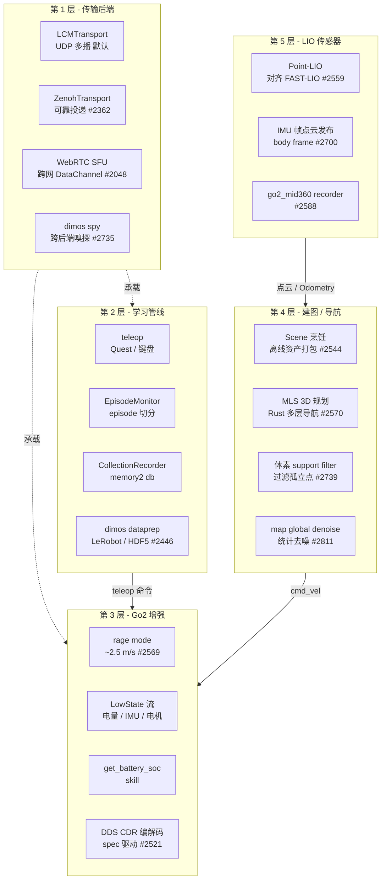

**这张图怎么读**: 传输层 (第 1 层) 是所有模块通信的地基, Zenoh 和 WebRTC 是本次新增的可选后端。学习管线 (第 2 层) 横跨传输和机器人: teleop 命令通过传输层下达给 Go2, 同时 recorder 录下数据, 离线由 dataprep 转成数据集。Go2 (第 3 层) 接收命令并反馈状态。建图/导航 (第 4 层) 消费 LIO (第 5 层) 的点云和里程计, 产出地图和路径。

## 2.1 主题 -> 关键 PR -> 输入/输出对照表

| 主题 | 关键 PR | 输入 | 输出 | 落点 |
|---|---|---|---|---|
| Zenoh 传输后端 | #2362 | 任意 typed/pickled 消息 | 可靠 pub/sub | `dimos/protocol/pubsub/impl/zenohpubsub.py` |
| WebRTC SFU 传输 | #2048 | 视频 / 数据流 | 跨网 DataChannel | `dimos/protocol/pubsub/impl/webrtc/` |
| dimos spy | #2735 | 传输层原始字节 | topic 速率 / 大小 / 活性 | `dimos/utils/cli/spy/` |
| 学习采集管线 | #2446 | teleop 输入 + 机器人状态 | LeRobot / HDF5 数据集 | `dimos/learning/` |
| Go2 rage 模式 | #2569 | rage 使能 | ~2.5 m/s 速度包络 | `dimos/robot/unitree/go2/connection.py` |
| Go2 低状态 + 电池 | #2569 | LowState DDS 流 | SOC / IMU / 电机遥测 | `dimos/robot/unitree/type/lowstate.py` |
| Go2 DDS CDR 编解码 | #2521 | 原始 DDS 字节 | 结构化消息 | `dimos/robot/unitree/go2/dds/` |
| Scene 烹饪管线 | #2544 | 3D 资产 (网格/点云) | runtime scene package | `dimos/experimental/scene_cooking/` |
| 多层 3D 导航 | #2570 | 3D 体素表面 | 3D 路径 | `dimos/navigation/nav_3d/mls_planner/` |
| 体素 support filter | #2739 | 体素地图 | 过滤孤立点的体素 | `dimos/mapping/ray_tracing/rust/` |
| 全局地图去噪 | #2811 | 录制点云地图 | 统计去噪后地图 | `dimos/mapping/utils/cli/map.py` |
| Point-LIO 整理 | #2559 | Livox 数据 | Odometry + 点云 | `dimos/hardware/sensors/lidar/pointlio/` |
| IMU 帧点云发布 | #2700 | LIO body 帧点云 | sensor_frame 点云 + TF | `pointlio/cpp/main.cpp`、`fastlio2/cpp/main.cpp` |
| 键盘遥操作重构 | #2683 | 键盘输入 | EEF twist 命令 | `dimos/teleop/keyboard/`、`dimos/control/tasks/eef_twist_task/` |

---


# 三、传输层 - 从 LCM 单后端到 Zenoh / WebRTC SFU 三选

> 传输层是 dimos 所有模块通信的地基。本次更新最大的结构性变化: LCM 不再是唯一后端。

```mermaid
flowchart LR
  APP[Module / Blueprint<br/>In[T] / Out[T]] --> FACT[transport_factory<br/>make_transport]
  FACT -->|默认| LCM[LCMTransport<br/>UDP 多播]
  FACT -->|DIMOS_TRANSPORT=zenoh| ZEN[ZenohTransport<br/>可靠投递 + QoS]
  FACT -->|显式 attach| WRTC[WebRTC SFU<br/>跨网 DataChannel]
  LCM -.字节流.-> SPY[dimos spy<br/>跨后端嗅探]
  ZEN -.字节流.-> SPY
```

## 3.1 第一站: Zenoh 传输后端 - LCM 的可靠投递替代 (#2362)

文件: `dimos/protocol/pubsub/impl/zenohpubsub.py`、`dimos/core/transport_factory.py`、`dimos/core/transport.py`

**问题**: LCM 走 UDP 多播, 有两个硬伤: (1) UDP 不保证投递, 高频图像/点云拥塞时丢包, 下游模块可能永远收不到关键消息; (2) 多播在跨网段 (VPN、跨子网、云端到厂房) 场景下不通, 需要额外配 multicast routing。

**答案**: 引入 Zenoh (一种 pub/sub 查询中间件) 作为 LCM 的对等后端。Zenoh 支持 TCP 单播, 天然跨网段; 支持可靠投递 (QoS) 和订阅者驱动的流速控制。

核心机制在 `transport_factory.py`:

```python
def make_transport(name, msg_type=None, *, g=global_config):
    use_pickled = msg_type is None or getattr(msg_type, "lcm_encode", None) is None
    topic = transport_topic(name, g)
    if g.transport == "zenoh":
        ztopic = ZenohTopic(topic, None if use_pickled else msg_type,
                            qos=default_zenoh_qos(name, msg_type))
        return pZenohTransport(ztopic) if use_pickled else ZenohTransport(ztopic)
    if use_pickled:
        return pLCMTransport(topic)
    return LCMTransport(topic, msg_type)
```

> **关键点**: `make_transport` 是所有 `In[T]` / `Out[T]` 流的统一入口, 它根据 `GlobalConfig.transport` (由 `DIMOS_TRANSPORT` 环境变量或 `--transport` CLI 参数设置) 选择后端。切换后端不需要改任何业务代码。

### Zenoh 的 QoS 策略

`transport_factory.py` 为不同类型的流预设了 QoS:

| 流类型 | QoS 策略 | 含义 |
|---|---|---|
| `sensor_msgs.Image` / `PointCloud2` | `QOS_LATEST_WINS` | 拥塞时丢旧帧, 永不阻塞发布者 |
| `human_input` / `agent` / `agent_idle` | `QOS_NEVER_DROP` | 低频但每条都重要, 永不丢 |
| 其他 | Zenoh 默认 | 按连接配置 |

### 话题命名映射

LCM 话题带前导斜杠 (`/cmd_vel`), Zenoh key expression 不能以 `/` 开头, 所以 `transport_topic()` 做了映射:

| 后端 | 逻辑名 `cmd_vel` | 实际 topic |
|---|---|---|
| LCM | `cmd_vel` | `/cmd_vel` |
| Zenoh | `cmd_vel` | `dimos/cmd_vel` |

| 维度 | LCM | Zenoh |
|---|---|---|
| 传输 | UDP 多播 | TCP 单播 (可配多播) |
| 可靠性 | 尽力而为 | 可靠 (可配 QoS) |
| 跨网段 | 不通 (需 multicast routing) | 通 (TCP 直连) |
| 切换方式 | 默认 | `DIMOS_TRANSPORT=zenoh` 或 `--transport zenoh` |

## 3.2 第二站: WebRTC SFU DataChannel 传输 - 跨网遥操作 (#2048)

文件: `dimos/protocol/pubsub/impl/webrtc/webrtcpubsub.py`、`providers/cloudflare.py`、`providers/broker.py`

**问题**: Zenoh 解决了局域网可靠投递, 但跨互联网 (操作员在办公室, 机器人在远程厂房) 仍需打洞或中转。现有 Hosted Teleop (上次同步的 Cloudflare RT) 只推视频, 没有数据通道。

**答案**: 新增 WebRTC SFU (Selective Forwarding Unit) DataChannel 传输。它不是一个全局后端 (不像 LCM/Zenoh 那样用 `DIMOS_TRANSPORT` 切换), 而是**显式 attach 到特定流**上, 把该流的数据通过 WebRTC DataChannel 中转。

两种 provider:

| Provider | 场景 | 文件 |
|---|---|---|
| Cloudflare | 用 Cloudflare TURN/STUN, 免运维 | `providers/cloudflare.py` |
| Broker | 自建 broker, 完全私有部署 | `providers/broker.py` |

> **与 Zenoh 的区别**: Zenoh 是「换一个全局 pub/sub 后端」, 所有流都走它; WebRTC SFU 是「给特定流加一条跨网数据通道」, 其他流仍走 LCM/Zenoh。典型用法: 视频流走 WebRTC (跨网低延迟), 控制流走 Zenoh (局域网可靠)。

## 3.3 第三站: dimos spy - 跨后端的 topic 嗅探器 (#2735)

文件: `dimos/utils/cli/spy/core.py`、`run_spy.py`; CLI 入口 `dimos/robot/cli/dimos.py`

**问题**: 以前调试 topic 要用 `lcmspy`, 但它只认 LCM。切到 Zenoh 后没法看流量。

**答案**: `dimos spy` 是一个**传输层无关**的 TUI (终端 UI) topic 监视器。它直接 tap 传输层的原始字节层 (LCMPubSubBase / ZenohPubSubBase, 在编码 mixin 之下), 所以不管后端是什么都能用。

核心设计约束 (来自 `core.py` docstring):

> HARD CONSTRAINT: the spy never decodes message payloads. Sources tap the raw-bytes pubsub layer, so the hot path per message is (topic string, payload length, timestamp) and nothing else.

| 特性 | lcmspy | dimos spy |
|---|---|---|
| 后端 | 只 LCM | LCM + Zenoh |
| 解码 payload | 是 | 否 (只看 topic / 大小 / 速率) |
| 性能影响 | 解码开销大 | 极低 (只读字节长度) |
| 消息类型可见 | 是 | 是 (嵌在 topic 字符串里) |

运行:

```bash
dimos spy              # 启动 TUI
dimos spy --transport zenoh  # 监听 Zenoh 后端
```

## 3.4 传输层完整链路

```mermaid
flowchart TB
  subgraph APP["业务层"]
    M1[Module A<br/>Out[Twist]]
    M2[Module B<br/>In[Twist]]
  end
  subgraph FACTORY["传输工厂"]
    MT[make_transport<br/>按 DIMOS_TRANSPORT 选后端]
  end
  subgraph BACKENDS["后端"]
    LCM[LCMTransport<br/>UDP 多播]
    ZEN[ZenohTransport<br/>TCP 可靠]
    WRTC[WebRTCTransport<br/>SFU DataChannel]
  end
  subgraph SPY["调试"]
    SP[dimos spy<br/>跨后端字节嗅探]
  end
  M1 --> MT
  MT -->|默认| LCM
  MT -->|zenoh| ZEN
  MT -.显式 attach.-> WRTC
  LCM --> M2
  ZEN --> M2
  WRTC --> M2
  LCM -.tap.-> SP
  ZEN -.tap.-> SP
```

---


# 四、学习与遥操作 - teleop 到 LeRobot 数据集的端到端管线

> 这是本次更新最完整的新功能块: 从人驱动机器人, 到录制成 db, 到离线转成训练数据集, 全链路打通。

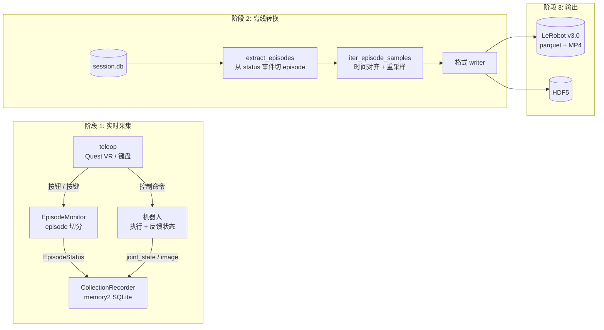

## 4.1 第一站: 实时采集 - teleop + EpisodeMonitor + CollectionRecorder (#2446)

文件: `dimos/learning/collection/blueprint.py`、`episode_monitor.py`、`recorder.py`

**问题**: 以前录数据要手动开关 recorder, 手动标记「这一段是第几个 episode」, 手动丢弃录坏的片段。录完拿到一个 db, 还要自己写脚本提取 joint / image / action。

**答案**: 新增三个模块协作, 自动完成采集:

| 模块 | 职责 |
|---|---|
| `EpisodeMonitorModule` | 监听 teleop 输入 (Quest 按钮 / 键盘), 运行 start/save/discard 状态机, 输出 `EpisodeStatus` |
| `CollectionRecorder` | memory2 recorder, 录 `color_image` + `coordinator_joint_state` + `status` 三条流到 SQLite |
| teleop blueprint | 组装 teleop 栈 + EpisodeMonitor + CollectionRecorder |

### EpisodeMonitor 的状态机

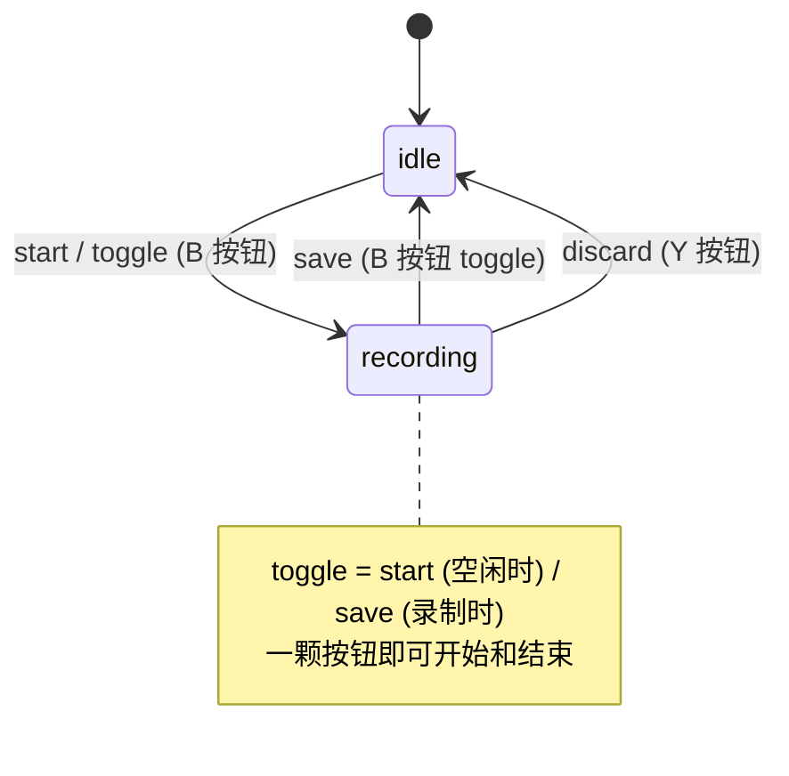

`EpisodeStatus` 携带 `ts, state, episodes_saved, episodes_discarded, last_event, task_label`。`CollectionRecorder` 把它录成一条 `status` 流, 离线 dataprep 就靠读这条流来切分 episode, 不需要解析原始按钮。

### 采集 blueprint

```python
learning_collect_quest_xarm7 = autoconnect(
    teleop_quest_xarm7,
    *_camera_if_real(),
    EpisodeMonitorModule.blueprint(),  # 默认按钮: toggle=B, discard=Y
    CollectionRecorder.blueprint(db_path=_session_db("xarm7")),
)
```

`_session_db` 生成时间戳路径: `STATE_DIR/recordings/session_xarm7_20260709_143000.db`。

## 4.2 第二站: 离线转换 - dimos dataprep (#2446)

文件: `dimos/learning/dataprep/cli.py`、`core.py`、`build.py`、`formats/lerobot/writer.py`

**问题**: 录好的 db 不能直接喂给模仿学习训练框架 (如 LeRobot), 需要转换: 切 episode、对齐多流时间戳、重采样到固定帧率、提取 observation / action。

**答案**: `dimos dataprep build` 是一个一次性批处理命令 (不是 Module), 把 db 转成 LeRobot v3.0 或 HDF5 数据集。

### DataPrepConfig

```python
class DataPrepConfig(BaseConfig):
    source: str = ""               # 录制 db 路径
    episodes: EpisodeExtractor = EpisodeExtractor()
    observation: dict[str, StreamField]  # 观测: 如 image + joint_pos
    action: dict[str, StreamField]       # 动作: 如 joint_pos (next-state)
    sync: SyncConfig = SyncConfig(anchor="image", rate_hz=30.0, tolerance_ms=50.0)
    output: OutputConfig = OutputConfig(format="lerobot", path=...)
```

### 时间对齐机制

`iter_episode_samples` 以 anchor 流 (通常是 image) 的帧率为基准, 对每一帧在其他流里找 `tolerance_ms` 内最近的样本:

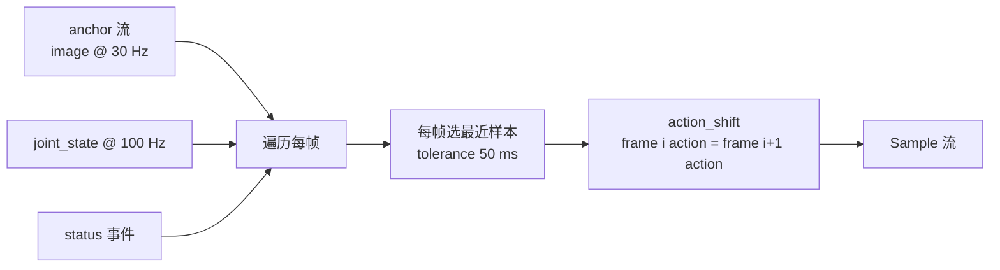

`action_shift=1` 表示第 i 帧的动作目标是第 i+1 帧的状态 (next-state target), 这是模仿学习的标准做法。

### LeRobot v3.0 输出格式

| 文件 | 内容 |
|---|---|
| `data.parquet` | 所有 episode 拼接的 chunked parquet (observation.state, action) |
| `videos/*.mp4` | 每个相机的视频 |
| `episodes.parquet` | 每 episode 的元数据 (帧范围、task label) |
| `dimos_meta.json` | 数据集元信息 |
| `stats.json` | 全局 + per-episode 统计 (mean/std/min/max/q01/q99) |

规范特征名: `observation.state` (单一本体感知向量)、`action`、`observation.images.<key>`。

## 4.3 第三站: 键盘遥操作重构为 EEF twist task (#2683)

文件: `dimos/teleop/keyboard/keyboard_teleop_module.py`、`dimos/control/tasks/eef_twist_task/eef_twist_task.py`

**问题**: 以前键盘遥操作直接发布 joint 命令或 cmd_vel, 输入和控制耦合在一起, 换个输入源 (VR、joystick) 要重写控制逻辑。

**答案**: 拆成两层:
- **输入层**: `KeyboardTeleopModule` 只负责把按键映射成 `TwistStamped` (线速度 + 角速度), 发布到 `coordinator_ee_twist_command` topic。
- **控制层**: `EEFTwistTask` 消费 twist, 积分到当前末端位姿, 解 IK 得到 joint 命令。

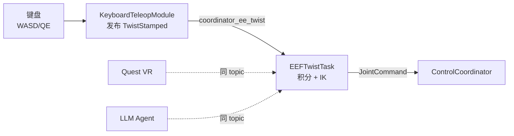

关键绑定:

| 按键 | 动作 |
|---|---|
| W/S | 前进/后退 (x) |
| A/D | 左右 (y) |
| Q/E | 上下 (z) |
| R/F | 翻滚 (roll) |
| T/G | 俯仰 (pitch) |
| Y/H | 偏航 (yaw) |

> **关键点**: 同一个 `EEFTwistTask` 可以被键盘、VR、甚至 LLM agent 驱动, 因为它们都发布同一个 `TwistStamped` topic。这是「输入与控制解耦」的典型实践。

## 4.4 学习管线完整链路

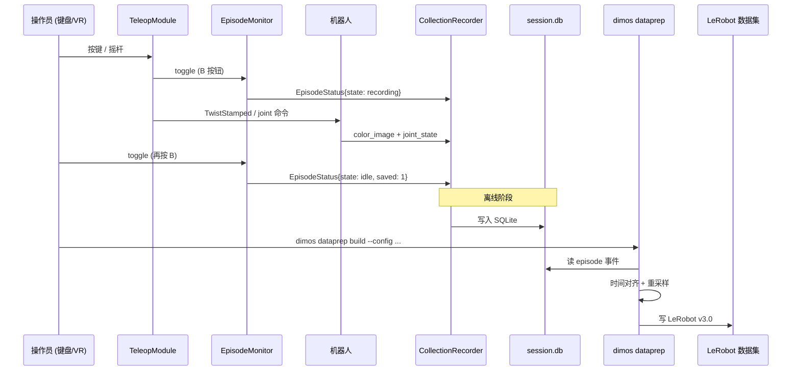

---


# 五、Go2 平台增强 - rage 模式 / 低状态 / 电池 SOC

> Go2 是本次更新继续深化的平台。上次同步解决了「速度标定 (SPORT Move)」, 这次解决「速度上限 (rage)」和「状态感知 (电量/低状态)」。

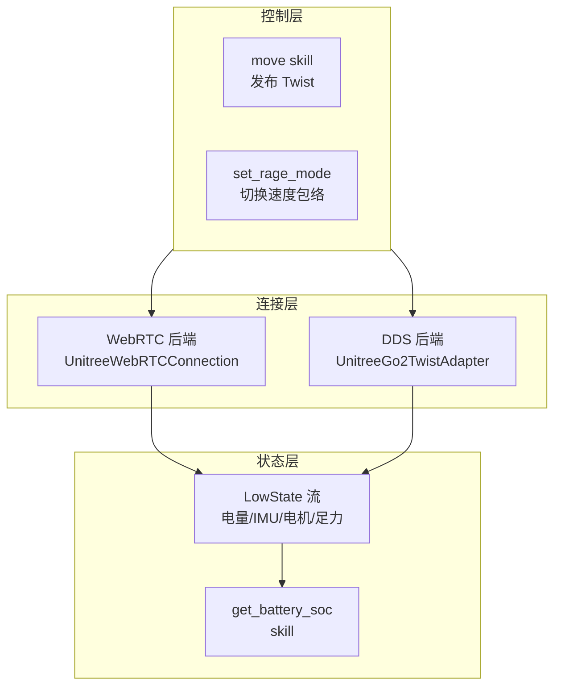

## 5.1 第一站: Rage 模式 - 解锁 ~2.5 m/s (#2569)

文件: `dimos/robot/unitree/go2/connection.py`、`dimos/robot/unitree/connection.py`、`dimos/hardware/drive_trains/unitree_go2/adapter.py`

**问题**: Go2 默认运动模式速度上限约 1.0 m/s, 做巡逻 / 快速移动时太慢。Unitree 有个隐藏的 rage 模式 (FsmRageMode), 但 `SportClient.Move` 在 rage 模式下被忽略, 必须走 `WirelessController_` 摇杆仿真通道。

**答案**: 在两个后端都实现 rage 模式切换:

### WebRTC 后端 (`UnitreeWebRTCConnection`)

- `_SPORT_API_ID_RAGEMODE = 2059`
- `set_rage_mode(enable)`: 先进 BalanceStand, 再发 api_id 2059, 最后 `SwitchJoystick(enable)`。开启后, 正常 `move()` 的 Twist 命令驱动 rage 包络。

### DDS 后端 (`UnitreeGo2TwistAdapter`)

同样发 api_id 2059 切换模式, 但速度命令不走 `SportClient.Move` (会被忽略), 而是起一个 100 Hz 的线程, 把 Twist 归一化成摇杆轴值, 发布到 `rt/wirelesscontroller_unprocessed`:

```python
def _rage_joystick_loop(self, session):
    period = 1.0 / self._RAGE_PUBLISH_HZ  # 100 Hz
    while not session.rage_stop.wait(period):
        vx, vy, wz = session.rage_cmd
        ly = clip(vx / _RAGE_UP_VX, -1, 1) * _RAGE_LY_SIGN
        lx = clip(vy / _RAGE_UP_VY, -1, 1) * _RAGE_LX_SIGN
        rx = clip(wz / _RAGE_UP_VYAW, -1, 1) * _RAGE_RX_SIGN
        # 发布 WirelessController_ 消息
```

Rage 速度包络常量:

| 参数 | 值 | 含义 |
|---|---|---|
| `_RAGE_UP_VX` | 2.5 m/s | 最大前进速度 |
| `_RAGE_UP_VY` | 1.0 m/s | 最大侧向速度 |
| `_RAGE_UP_VYAW` | 5.0 rad/s | 最大偏航角速度 |

### Go2Connection 模块

`GO2Connection` 在 config 里暴露 `mode: Go2Mode` (DEFAULT / RAGE), 启动时自动切换:

```python
class Go2Mode(str, Enum):
    DEFAULT = "default"
    RAGE = "rage"
```

配套 blueprint `unitree_go2_webrtc_rage_keyboard_teleop` 设 `mode="rage"`, `linear_speed=1.25, angular_speed=1.2`。

> **与上次同步的关系**: 上次同步 (#2567) 引入 SPORT Move 让速度「说到做到」(真实 m/s); 这次 (#2569) 引入 rage 模式把速度上限从 ~1.0 提到 ~2.5 m/s。但注意上游 **#2598 撤回了 SPORT Move** (因为某些 firmware 不兼容), rage 模式改走摇杆仿真通道, 这是速度控制路径的又一次调整。

## 5.2 第二站: LowState 流 + 电池 SOC skill (#2569)

文件: `dimos/robot/unitree/type/lowstate.py`、`dimos/robot/unitree/go2/connection.py`

**问题**: 以前 agent 无法知道电量, 也没有 IMU / 电机 / 足力等低状态遥测, 做长时间任务时可能中途没电。

**答案**: 新增 `lowstate_stream()` 订阅 Go2 的 LowState DDS 消息, 并暴露 `get_battery_soc` skill 给 LLM。

### LowState 消息结构

```python
class LowStateData(TypedDict):
    imu_state: ImuState          # IMU 姿态 / 角速度 / 加速度
    motor_state: list[MotorState] # 12 个电机的位置 / 速度 / 力矩
    bms_state: BmsState          # 电池: soc / current / cycle / 温度
    foot_force: list[int]        # 4 个足端力传感器
    temperature_ntc1: int
    power_v: float
```

### get_battery_soc skill

```python
@skill
def get_battery_soc(self) -> int | None:
    """Returns the robot's battery state-of-charge as a percentage (0-100).

    Use this skill to answer battery / power / charge questions. Returns
    None if no low-level state has been received yet.
    """
    try:
        return int(self._latest_lowstate["data"]["bms_state"]["soc"])
    except (KeyError, TypeError, ValueError):
        return None
```

> **关键点**: 这是「让 Go2 成为 first-class agentic 平台」的一步 -- agent 能自己查电量, 决定是否返航充电。`ReplayConnection` (回放模式) 提供这些方法的无操作 stub, 所以离线调试也能用。

## 5.3 第三站: Go2 DDS 编解码改进 - spec 驱动 CDR (#2521)

文件: `dimos/robot/unitree/go2/dds/codec.py`、`cdr.py`、`ros.py`、`store.py`

**问题**: 以前 Go2 DDS 消息 (LowState、SportModeState、IMUState 等) 的编解码是手写的, 每加一个消息类型要手写一堆序列化 / 反序列化代码, 维护成本高, 容易出错。

**答案**: 改成基于 spec 的 CDR (Common Data Representation) 编解码。消息类型定义一次 (spec), 编解码代码自动生成。

| 文件 | 职责 |
|---|---|
| `codec.py` | 编解码入口 |
| `cdr.py` | CDR 原语序列化 (字节对齐、端序) |
| `ros.py` | ROS 消息类型映射 |
| `store.py` | 消息存储 (对接 memory2) |

> **与 LowState 的关系**: 5.2 的 LowState 流能工作, 底层就是靠这套 CDR 编解码把 Go2 DDS 原始字节解成结构化 TypedDict。

---


# 六、建图 / 导航 / 传感器 - Scene 烹饪 / MLS 3D / DDS 编解码 / Point-LIO 整理

> 这一章覆盖建图、导航、传感器层的增量改进。上次同步已经把 3D 体素建图和 MLS 规划器推到位, 这次是补齐周边: Scene 资产离线烹饪、多层导航 runtime 支持、体素过滤、全局地图去噪、Point-LIO 整理。

## 6.1 第一站: Scene 包烹饪管线 - 离线资产打包 (#2544)

文件: `dimos/experimental/scene_cooking/cook.py`、`dimos/simulation/scene_assets/spec.py`

**问题**: MuJoCo 仿真和 Rerun 可视化需要 3D 场景资产 (网格、点云、URDF), 每次运行时解析原始资产文件慢, 且格式不统一。

**答案**: 离线把 3D 资产「烹饪」成 runtime scene package。这是一个离线工具 (不是 DimOS runtime Module), 产出被 runtime 模块通过正常 config 消费。

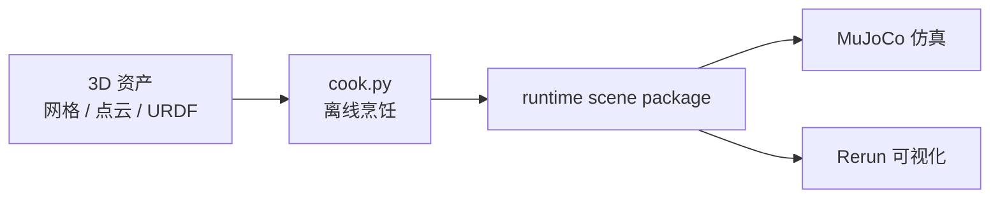

> **与上次同步的关系**: 上次同步引入了 runtime scene packages 的初步支持 (#2594 MuJoCo + Rerun), 这次补齐了离线烹饪管线, 形成完整的「资产 -> 烹饪 -> runtime 消费」闭环。

## 6.2 第二站: 多层 3D 导航 runtime 支持 (#2570)

文件: `dimos/navigation/nav_3d/mls_planner/rust/src/mls_planner.rs`、`mls_planner_native.py`

**问题**: 上次同步 (#2310) 引入了 MLS (Multi-Level Surface) 3D 规划器的 Rust 主体, 但 runtime 集成不完整, 无法在 blueprint 里直接用。

**答案**: 补齐 runtime scene package 支持, 让 MLS 规划器能在实际 blueprint 里跑。Rust 主体处理 3D 体素表面 -> 多层曲面 -> 图 (节点 + 边) -> Dijkstra 最短路。

| Rust 源文件 | 职责 |
|---|---|
| `surfaces.rs` | 从体素构建多层曲面 |
| `nodes.rs` / `edges.rs` | 构图: 可通行节点 + 连接边 |
| `adjacency.rs` | 邻接关系 |
| `dijkstra.rs` | 最短路搜索 |
| `planner.rs` | 规划主流程 |
| `voxel.rs` | 体素表示 |

> **关键点**: MLS 规划器能处理斜坡、台阶、多层结构, 这是 2D 栅格规划器做不到的。配合 4.1 的体素法线 (区分地面 / 墙面 / 斜坡), 这是 dimos 3D 导航的核心。

## 6.3 第三站: 体素 support filter - 过滤孤立点 (#2739)

文件: `dimos/mapping/ray_tracing/rust/src/voxel_ray_tracer.rs`

**问题**: 光线追踪建图器在局部地图切片里会产生孤立体素 (一个体素周围全是空体素), 这些通常是噪声, 会干扰规划器判断可通行性。

**答案**: 在局部地图发布前加一个 support filter, 用邻居计数判断体素是否有支撑: 如果一个体素周围的邻居数低于阈值, 就把它标记为 free (移除)。

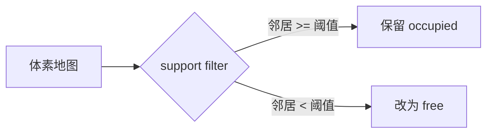

> **关键点**: 这个过滤器只作用于**局部地图切片** (给规划器用的), 不影响全局地图的累积。这样既保证了规划质量, 又不丢全局信息。

## 6.4 第四站: 全局地图去噪 - dimos map global --denoise (#2811)

文件: `dimos/mapping/utils/cli/map.py`

**问题**: `dimos map global` 从录制数据重建全局地图时, 会有稀疏的离群点 (飞点), 影响地图质量。

**答案**: 新增 `--denoise` 选项, 在地图累积完成后、导出前, 用 Open3D 的统计离群点移除 (Statistical Outlier Removal) 清理:

```python
def _denoise(cloud):
    if cloud is None or len(cloud.pointcloud.points) < 20:
        return cloud
    clean, _ = cloud.pointcloud_tensor.remove_statistical_outliers(
        nb_neighbors=20, std_ratio=2.0
    )
    return PointCloud2(pointcloud=clean, frame_id=cloud.frame_id, ts=cloud.ts)
```

对三种地图产物 (raw / PGO / full-PGO) 都生效。参数固定 (`nb_neighbors=20, std_ratio=2.0`), 是 Open3D 的标准统计去噪。

| 产物 | 去噪前 | 去噪后 |
|---|---|---|
| raw map | 有飞点 | 干净 |
| PGO map | 有飞点 | 干净 |
| full PGO map | 有飞点 | 干净 |

运行:

```bash
dimos map global <db> --denoise
```

> **与 LIO recorder 的关系**: 这个去噪功能配合 #2811 的另一部分 -- Athens LIO recording pipeline (Point-LIO/FAST-LIO + memory2 Recorder 端到端可用) -- 形成完整的「录制 -> 重建 -> 去噪 -> 导出」流程。

## 6.5 第五站: Point-LIO 整理 - 对齐 FAST-LIO (#2559)

文件: `dimos/hardware/sensors/lidar/pointlio/module.py`、`recorder.py`、`cpp/main.cpp`

**问题**: Point-LIO (第二套 LiDAR-inertial SLAM 后端) 的 Python wrapper 与 FAST-LIO2 不一致: 配置散落在 YAML 文件里, recorder 没有用 memory2 基础设施, 帧命名不统一。

**答案**: 三项整理, 让 Point-LIO 与 FAST-LIO2 结构一致:

### (1) 无 YAML 配置

所有 Point-LIO 调参直接住在 `PointLioConfig` (Pydantic `NativeModuleConfig`) 上, 作为 CLI 参数传给 C++ 二进制, 不再有 YAML 文件:

```python
class PointLioConfig(NativeModuleConfig):
    # Point-LIO tuning, passed to the binary as plain CLI args (no YAML).
    con_frame: bool = False
    blind: float = 0.5          # spherical min range (m)
    point_filter_num: int = 3   # pre-KF decimation
    # ...
```

好处: 自动获得 CLI flag 生成、`.env` / `DIMOS_POINTLIO_*` 环境变量回退、Pydantic 校验。

### (2) memory2 Recorder

`PointlioRecorder` 继承 `dimos.memory2.module.Recorder`, 录 `pointlio_odometry` + `pointlio_lidar` 两条流到 SQLite。关键设计是 `@pose_setter_for` 装饰器: 每帧 lidar 点云打上最新 odometry 位姿, 这样 `dimos map global` 能直接注册 body-frame 点云, 不需要单独的 pose-fill 步骤。

### (3) 帧命名方案

两个 LIO 后端统一用「sensor frame」方案:

| 字段 | 含义 | 默认值 |
|---|---|---|
| `frame_id` | 固定 odom 帧 | `FRAME_ODOM` |
| `sensor_frame_id` | 运动 sensor 帧 | `mid360_link` |

C++ 二进制发布: odometry (`frame_id -> sensor_frame_id`) + TF + 点云 (stamped `sensor_frame_id`)。消费者 (建图器) 通过 TF 查询把 sensor-frame 点云注册到 world frame。

## 6.6 第六站: IMU 帧点云发布 (#2700)

文件: `dimos/hardware/sensors/lidar/pointlio/cpp/main.cpp`、`fastlio2/cpp/main.cpp`

**问题**: 以前 LIO 发布的点云是 world-frame 注册过的, 消费者无法拿到原始 sensor-frame 点云, 且 world-frame 注册依赖 LIO 内部状态, 不够解耦。

**答案**: 改成发布 sensor (body/IMU) 帧的点云。点云 `frame_id` 是 `sensor_frame_id` (`mid360_link`), odometry 提供 `frame_id -> sensor_frame_id` 的 TF 变换, 消费者通过 TF 查询注册到 world frame。

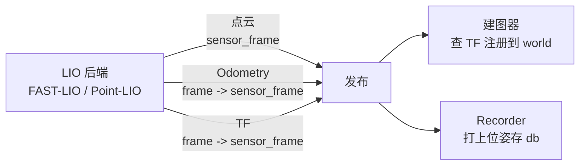

> **关键点**: 这是「发布 body 帧, 让消费者注册」的解耦方案。SLAM 后端只管吐 raw sensor-frame 点云 + odometry/TF, 建图前端负责累加 world-frame 体素。recorder 也存的是 body-frame 点云 + 位姿, 离线 `dimos map global` 能重新注册。

---


# 七、冲突解决与 topsun 自有改动保留

> 本次 merge 的基线是 `7d2affd7d` (上次同步, 文件内容同步而非 git 历史), topsun 在此基础上有自有改动。上游 75 commits 涉及 496 文件 (+36891 / -8987), 其中 dimos/ 源码 367 文件 (+34519 / -4706)。采用 `merge -X theirs` + topsun 补丁策略, 实际手工处理 17 个文件。

## 7.1 合并策略

由于 topsun 分支与 upstream 没有 git 历史共同祖先 (基线是文件内容同步), 直接 `git merge` 会产生大量假冲突 (add/add、rename/delete)。采用的策略:

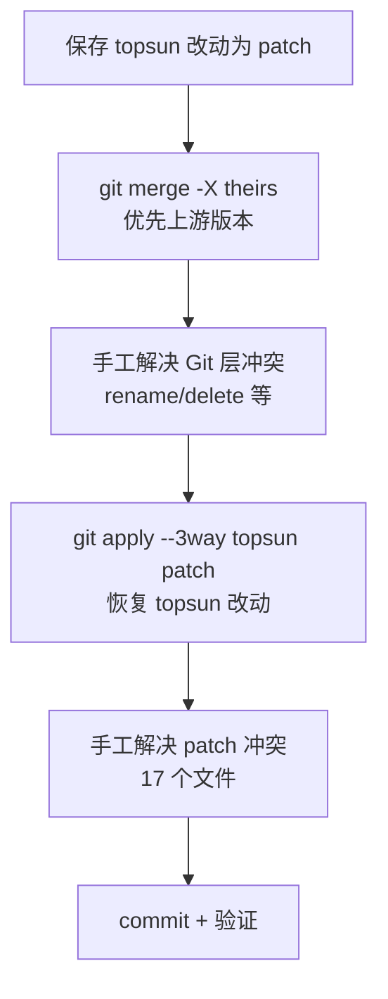

## 7.2 保留的 topsun 自有改动

以下改动完整保留 (与上游不冲突或已手工合并):

| 文件 | topsun 改动 | 状态 |
|---|---|---|
| `dimos/mapping/relocalization/module.py` | fast ICP diagnostics + point-to-plane option (850 行) | 完整保留 |
| `dimos/mapping/relocalization/relocalize.py` | ICP 核心算法增强 (578 行) | 完整保留 |
| `dimos/robot/unitree/go2/blueprints/basic/unitree_go2_basic.py` | Mid-360 Rerun 可视化 + macOS SHM subscriber | 完整保留 (取 ours) |
| `dimos/robot/unitree/go2/connection.py` | `free_avoid` API + `_stream_name` | 与上游 `set_rage_mode` 合并 |
| `dimos/robot/unitree/connection.py` | `free_avoid` 实现 | 与上游 `set_motion_mode` 合并 |
| `dimos/agents/crow_agent.py` | topsun 自有 agent | 完整恢复 |
| `dimos/examples/mapping-go2/` | topsun 示例 | 完整恢复 |
| `.gitignore` | `jiangtao/tmp/`、`jiangtao/data/` | 与上游规则合并 |

## 7.3 关键冲突解决详情

### 冲突 1: `dimos/core/transport.py`

topsun 有 pSHM pickle 修复, 上游重构了 pSHM transport 的序列化。检查发现 topsun 的修复与上游一致 (都是用 `_reconstruct_pshm_transport` 恢复 kwargs), 取上游版本, 无功能损失。

### 冲突 2: `dimos/robot/unitree/go2/connection.py`

topsun 有 `free_avoid` (SportClient FreeAvoid, api_id 2048) 和 `_stream_name` (数据集流名优先选择); 上游加了 `set_rage_mode` 和 `Go2Mode` enum。手工合并保留全部:

```python
class Go2ConnectionProtocol(Protocol):
    def set_rage_mode(self, enable: bool) -> bool: ...  # 上游新增
    def free_avoid(self, enabled: bool = True) -> bool: ...  # topsun 保留
```

### 冲突 3: `dimos/robot/unitree/connection.py`

topsun 有 `free_avoid` 实现 (WebRTC 后端); 上游加了 `set_motion_mode` (motion switcher)。手工合并保留两者:

```python
def set_motion_mode(self, name: str) -> None: ...  # 上游新增
def free_avoid(self, enabled: bool = True) -> bool: ...  # topsun 保留
def set_rage_mode(self, enable: bool) -> bool: ...  # 上游新增
```

### 冲突 4: `dimos/robot/unitree/go2/blueprints/basic/unitree_go2_basic.py`

topsun 有大量 Mid-360 可视化定制 (macOS SHM、Rerun 配置), 上游只改了 import。取 topsun 版本 (ours), 完整保留定制。

### 冲突 5: `.gitignore`

topsun 加了 `/jiangtao/tmp/`、`/jiangtao/data/`; 上游加了 `.codegraph/`。手工合并保留两者。

## 7.4 上游撤回的 SPORT Move

注意上游 #2598 撤回了上次同步引入的 SPORT Move (标定速度, api_id 1008), 原因是某些 firmware 不兼容。本次 merge 后 Go2 的速度控制路径:

| 路径 | 状态 | 说明 |
|---|---|---|
| SPORT Move (api_id 1008) | 上游已撤回 | 不可用 |
| 默认模式 move() | 摇杆归一化 | 走 WIRELESS_CONTROLLER |
| rage 模式 move() | 摇杆归一化 (rage 包络) | 走 WirelessController_ 100 Hz 线程 |

> **影响**: topsun 如果有依赖 SPORT Move 的代码, 需要检查。目前 topsun 的 `free_avoid` 走的是 SportClient FreeAvoid (api_id 2048), 不受影响。

---

# 八、端到端实战 - 验证同步后的关键链路

> 把前面几章的模块串起来, 看同步后怎么验证关键链路。

## 8.1 传输层切换验证

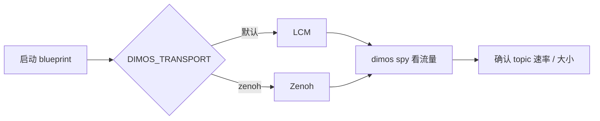

```bash
# 1. 默认 LCM 后端
dimos --replay run unitree-go2 --daemon
dimos spy

# 2. 切到 Zenoh 后端
DIMOS_TRANSPORT=zenoh dimos --replay run unitree-go2 --daemon
dimos spy --transport zenoh

# 3. agentic + MCP (任意后端)
dimos --replay run unitree-go2-agentic --daemon
dimos mcp call move --json-args '{"x": 0.5, "duration": 2.0}'
dimos mcp call get_battery_soc
```

## 8.2 学习采集管线验证

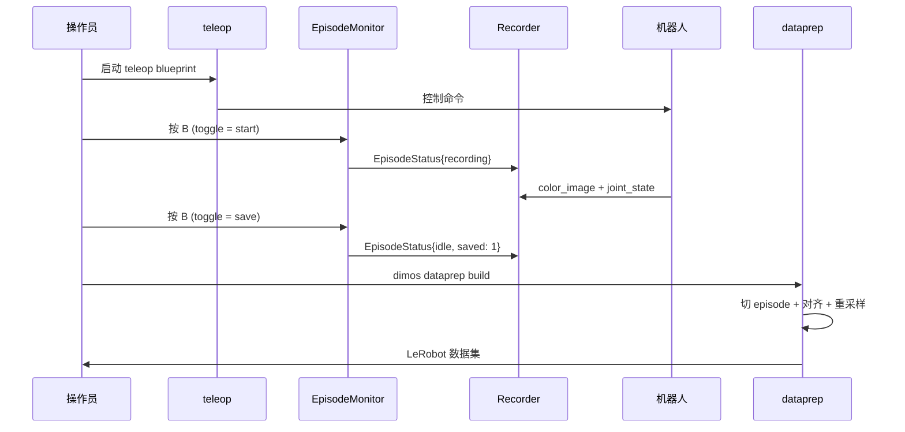

```bash
# 1. 启动采集 (xarm7 + Quest)
dimos run learning-collect-quest-xarm7 --robot-ip <ip>

# 2. 操作员用 Quest 遥操作, 按 B 开始/结束 episode, 按 Y 丢弃

# 3. 离线转数据集
dimos dataprep build --config dimos/learning/dataprep/example_config.json

# 4. 检查产出
ls ~/.local/state/dimos/datasets/default/
# data.parquet videos/ episodes.parquet dimos_meta.json stats.json
```

## 8.3 Go2 rage 模式验证

```bash
# 1. rage 模式键盘遥操作
dimos run unitree-go2-webrtc-rage-keyboard-teleop --robot-ip 192.168.123.161

# 2. agentic + rage + 查电量
dimos run unitree-go2-agentic --robot-ip 192.168.123.161
dimos mcp call get_battery_soc
# 返回: 85
```

## 8.4 建图去噪验证

```bash
# 1. 用 LIO recorder 录制
dimos run mid360-pointlio-voxels

# 2. 离线重建全局地图 (带去噪)
dimos map global <db> --denoise

# 3. 检查产出 (.rrd 可视化 + .pc2.lcm 导出)
ls *.rrd *.pc2.lcm
```

---

# 九、扩展点与升级 cheatsheet

## 9.1 升级后需要注意的兼容性变化

| 变化 | 影响 | 应对 |
|---|---|---|
| SPORT Move 撤回 (#2598) | 依赖 api_id 1008 的代码失效 | 改用 rage 模式摇杆通道或默认 move() |
| `DIMOS_TRANSPORT=zenoh` | 话题名加 `dimos/` 前缀 | 跨后端通信用 `transport_topic()` |
| EpisodeMonitor 按钮映射 | 默认 toggle=B, discard=Y | 可在 config 里改 `button_map` |
| Point-LIO 无 YAML | 旧 YAML 配置不生效 | 改用 `PointLioConfig` 字段 / `DIMOS_POINTLIO_*` |
| DDS CDR 编解码 | 旧手写编解码代码废弃 | 用 `go2/dds/codec.py` |
| Scene 烹饪 | 仿真资产路径可能变 | 用 `cook.py` 重新烹饪 |

## 9.2 参数 cheatsheet

| 想做的事 | 看哪 |
|---|---|
| 切换传输后端 | `DIMOS_TRANSPORT=zenoh` 或 `--transport zenoh` |
| 配置 Zenoh QoS | `dimos/core/transport_factory.py::default_zenoh_qos` |
| 调 rage 速度包络 | `dimos/hardware/drive_trains/unitree_go2/adapter.py::_RAGE_UP_VX` |
| 查电池电量 | `dimos mcp call get_battery_soc` |
| 配置学习采集 | `dimos/learning/collection/blueprint.py` |
| 转数据集 | `dimos dataprep build --config <json>` |
| 调 dataprep 时间对齐 | `DataPrepConfig.sync` (anchor, rate_hz, tolerance_ms) |
| 全局地图去噪 | `dimos map global <db> --denoise` |
| 调 Point-LIO 参数 | `PointLioConfig` 字段 / `DIMOS_POINTLIO_*` 环境变量 |
| Scene 烹饪 | `python -m dimos.experimental.scene_cooking.cook` |
| 跨网遥操作 | WebRTC SFU: `dimos/protocol/pubsub/impl/webrtc/` |

## 9.3 新增 / 重构的 blueprint 速查

| Blueprint | 用途 | 来源 |
|---|---|---|
| `learning-collect-quest-xarm7` | xArm7 + Quest 采集 | #2446 |
| `learning-collect-quest-piper` | Piper + Quest 采集 | #2446 |
| `unitree-go2-webrtc-rage-keyboard-teleop` | Go2 rage + 键盘遥操作 | #2569 |
| `mid360_pointlio` | Point-LIO + Rerun | #2559 |
| `mid360_pointlio_voxels` | Point-LIO + 体素建图 | #2559 |

## 9.4 推荐配套阅读

- 上次同步说明: `docs/cursor/20260624-upstream-main同步说明-100commits.md`
- 导航/建图教程: `jiangtao/cursor/dimos-navigation-mapping-tutorial.md`
- 重定位专题: `jiangtao/cursor/dimos-relocalization-tutorial.md`
- 上游传输文档: `docs/usage/transports/index.md`
- 上游学习文档: `docs/capabilities/learning/`

## 9.5 怎么自己验证这次同步

```bash
# 看本次 merge 引入了哪些 commit
git log --oneline 7d2affd7d..upstream/main --no-merges

# 看某个 PR 改了哪些文件
git show --stat <sha>

# 重新生成 blueprint 注册表
pytest dimos/robot/test_all_blueprints_generation.py

# 快速跑回放验证传输层
DIMOS_TRANSPORT=zenoh dimos --replay run unitree-go2
dimos spy --transport zenoh

# 验证 Go2 agentic + 电池
dimos --replay run unitree-go2-agentic --daemon
dimos mcp call get_battery_soc

# 回滚本次 merge
git reset --hard cadd99364
```

---

> 本文档基于 `jtlinux` 分支 commit `77ca3291c` (merge: integrate upstream/main `fdf3cb7d` on `7d2affd7d` baseline, 75 commits)。后续上游继续演进时细节可能调整, 但「Zenoh/WebRTC 多后端 + 学习端到端管线 + Go2 rage/电量 + Scene 烹饪 + DDS CDR」这条主线应保持稳定。
