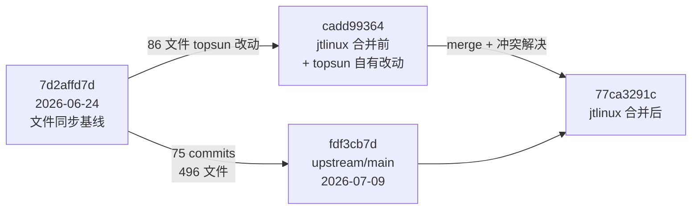
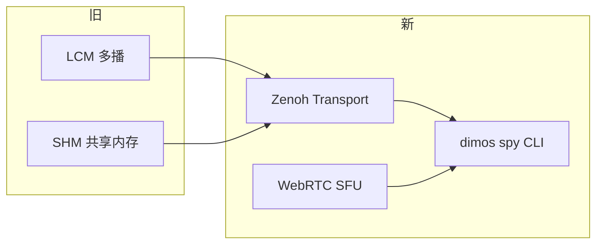
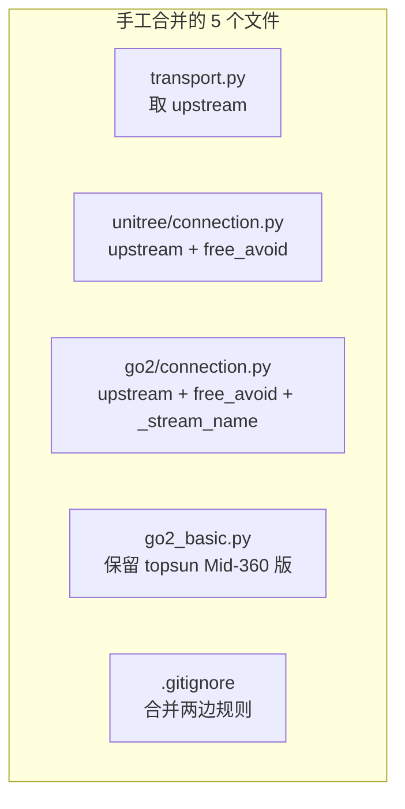

# 深入理解：jtlinux 合并 upstream/main（fdf3cb7d）— 75 commits 更新与冲突解决全记录

> 写给「已在 topsun_dimos/jtlinux 上开发、基线对齐到 `7d2affd7d`（2026-06-24 文件同步）」的同学。读完你会知道：这次从 upstream 拿了什么、哪些 topsun 自有改动被保留、合并时踩了哪些坑、怎么验证。
>
> 基于 `jtlinux` 分支 commit `77ca3291c`（merge upstream/main `fdf3cb7d`），合并时间 2026-07-09。

---

## 目录

- [一、通俗篇：这次合并到底做了什么](#一通俗篇这次合并到底做了什么)
- [二、总览：合并策略与变更规模](#二总览合并策略与变更规模)
- [三、upstream 75 commits 主题详解](#三upstream-75-commits-主题详解)
- [四、冲突解决 — 12 个 Git 冲突 + 5 个手工合并](#四冲突解决--12-个-git-冲突--5-个手工合并)
- [五、保留的 topsun 自有改动](#五保留的-topsun-自有改动)
- [六、端到端验证 — 合并后怎么跑](#六端到端验证--合并后怎么跑)
- [七、扩展点与 cheatsheet](#七扩展点与-cheatsheet)

---

# 一、通俗篇：这次合并到底做了什么

> 这一章 0 代码，只讲「为什么要合」「合完变成什么样」。

## 1.1 一句话总结

**在 6 月 24 日文件同步基线（`7d2affd7d`）之上，把上游 6 月底到 7 月初的 75 个 commit 合进来，同时完整保留 topsun 的重定位增强、Mid-360 导航栈和 Go2 连接修复。**

## 1.2 三个关键事实

**1）你的基线其实对齐得很好。** 用 `git diff 7d2affd7d jtlinux` 核对，核心 `dimos/` 源码只有 18 个文件、约 3000 行自有改动，不是「漏了 132 个 commit」那种状态——之前那个数字是 Git 历史分叉的误判。

**2）upstream 又走了 75 步。** 从 `7d2affd7d` 到 `fdf3cb7d`（2026-07-09），上游改了 496 个文件，主线是 Zenoh 传输、dimos spy 调试工具、WebRTC 云传输、Scene 包烹饪管线、多层导航、Go2 DDS 解码改进。

**3）真正需要手工处理的冲突只有十几个文件。** 用 `7d2affd7d` 作共同基线模拟合并，潜在冲突 12 个；合并过程中另有 5 个文件需要手工叠加 topsun 补丁。

## 1.3 合并策略（为什么不用普通 git merge 一把梭）

```
┌─────────────────────────────────────────────────────────────┐
│  问题：jtlinux 的 Git 历史从 5 月分叉，直接 merge 会触发     │
│        100+ 个「双方都添加」的假冲突                          │
├─────────────────────────────────────────────────────────────┤
│  解法：                                                      │
│  ① git merge upstream/main -X theirs   ← 大方向拿 upstream   │
│  ② 解决 12 个 rename/delete 类真冲突                          │
│  ③ git apply topsun-local.patch        ← 叠回自有改动         │
│  ④ 手工合并 5 个双方都改过的核心文件                          │
└─────────────────────────────────────────────────────────────┘
```

## 1.4 合完后你应该关注什么

| 你若在做… | 重点看第几章 |
|---|---|
| Go2 真机 / Mid-360 导航 | 三（Go2 DDS）、五（blueprint 保留）、六 |
| 重定位调参 | 五（module.py 完整保留） |
| 传输 / 调试 | 三（Zenoh、spy、WebRTC） |
| CI / 依赖升级 | 三（v0.0.13 发布）、七（cheatsheet） |

---

# 二、总览：合并策略与变更规模

## 2.1 版本时间线



## 2.2 变更规模对照表

| 维度 | 数值 |
|---|---|
| upstream 新 commits | **75**（73 个非 merge） |
| upstream 变更文件 | 496（+36,891 / -8,987 行） |
| topsun 相对基线改动 | 86 文件（`dimos/` 18 个） |
| 合并后总 diff（相对 7d2affd7d） | 559 文件 |
| Git 自动冲突（rename/delete） | **12** |
| 补丁冲突需手工处理 | **5** |
| 合并 commit | `77ca3291c` |

## 2.3 模块 → 输入 → 输出（本次合入的核心新能力）

| 层 | 模块 | 输入 | 输出 |
|---|---|---|---|
| 传输 | Zenoh Transport | LCM topic / 模块流 | 跨进程 Zenoh pub/sub |
| 传输 | WebRTC SFU DataChannel | 云端信令 | 低延迟 DataChannel 流 |
| 调试 | dimos spy | 任意 transport | 实时 topic 嗅探 |
| 建图 | Athens LIO 录制 | 雷达 + IMU | 带全局地图去噪的录制 |
| 建图 | 体素 support filter | 3D 体素图 | 过滤后体素 + 数据采集 |
| 导航 | multi level navigation | 多层地图 | 跨层路径 |
| 仿真 | Scene package cooking | MuJoCo/Rerun 场景描述 | 运行时 scene 包 |
| 学习 | teleop + dataprep | 遥操作录制 | LeRobot / HDF5 数据集 |
| 发布 | v0.0.13 / .post1 | — | PyPI 正式版 |

---

# 三、upstream 75 commits 主题详解

## 3.1 传输与调试 — Zenoh + spy + WebRTC



**关键 PR / commit：**

| commit 主题 | 影响 |
|---|---|
| Integrate Zenoh (#2362) | `dimos/core/transport_factory.py`、Zenoh 后端 |
| dimos spy (#2735) | `dimos mcp` 同级新 CLI：`dimos spy` |
| Cloudflare SFU WebRTC (#2048) | 新 `DDSTransport` / WebRTC DataChannel |
| shmrpc queue | 共享内存 RPC 队列化 |

**对你影响**：`dimos/core/transport.py` 在合并时取了 upstream 版（含 `_reconstruct_pshm_transport`），topsun 的 pSHM pickle 修复与 upstream 一致，无需额外处理。

## 3.2 Go2 平台 — DDS 解码 + rage mode + 录制器

| 功能 | 说明 |
|---|---|
| go2 dds decoding (#2521) | `dimos/robot/unitree/go2/dds/codec.py` 解码改进 |
| rage mode + lowstate (#2569) | `set_rage_mode`、电池 SOC skill |
| go2_mid360 recorder (#2588) | Mid-360 + RealSense 30fps 录制器 |
| replay cleanup (#2730) | memory2 回放进度条与清理 |

**注意**：upstream 在 #2598 **Revert 了 SPORT Move 标定速度**——你当前基线上的 SPORT Move 若来自 6/24 同步，合并后该 revert 已生效。

## 3.3 建图 / LIO — Point-LIO 对齐 + 全局地图去噪

| 功能 | 说明 |
|---|---|
| Point-LIO 清理 (#2559) | 无 YAML 配置、memory2 Recorder、frame 统一 |
| *lio IMU frame (#2700) | 点云发布改 IMU 坐标系 |
| Athens lio + denoise (#2811) | 全局地图去噪选项 |
| 体素 support filter (#2739) | 体素过滤 + 数据采集 |

**对你影响**：`dimos/mapping/relocalization/` **upstream 这 75 个 commit 未改动**，topsun 的 fast ICP / point-to-plane 完整保留。

## 3.4 导航 — 多层导航 + 文档重组

| 功能 | 说明 |
|---|---|
| multi level navigation (#2570) | 多层地图导航 |
| cmu nav docs 迁移 (#2597) | `navigation/` 专注 Go2 nav |
| keyboard teleop 重构 (#2683) | EEF twist task |

## 3.5 Scene / 仿真 / 学习

| 功能 | 说明 |
|---|---|
| Scene package cooking (#2544) | **最新 HEAD** — MuJoCo/Rerun 运行时场景包 |
| runtime scene packages (#2594) | 场景包基础设施 |
| teleop + dataprep (#2446) | 学习数据管线 |
| roboplan 集成 | 机械臂规划 |

## 3.6 发布与 CI

- **v0.0.13 / v0.0.13.post1** 正式发布及多个 backport
- native modules 构建缓存 (#2470)
- Dependabot 配置
- Mintlify 文档结构重组

---

# 四、冲突解决 — 12 个 Git 冲突 + 5 个手工合并

## 4.1 Git 自动冲突（12 个，`-X theirs` 后剩余）

这些是 **rename/delete 类**冲突，无法自动选边：

| 文件 | 冲突类型 | 解决方式 |
|---|---|---|
| `dimos/control/tasks/cartesian_ik_task/_registry.py` | rename/rename | 取 upstream `_registry.py`，删 `__registry__.py` |
| `dimos/control/tasks/g1_groot_wbc_task/_registry.py` | rename/rename | 同上 |
| `dimos/control/tasks/servo_task/_registry.py` | rename/rename | 取 upstream |
| `dimos/hardware/end_effectors/end_effector.py` | 双方删除 | `git rm`（upstream 已移除） |
| `dimos/robot/unitree/go2/blueprints/smart/_with_jpeg.py` | 双方删除 | `git rm` |
| `dimos/spec/nav.py` | 双方删除 | `git rm` |
| `docs/capabilities/manipulation/readme.md` | modify/delete | 删除（upstream 已迁移到 Mintlify） |
| `docs/capabilities/navigation/readme.md` | modify/delete | 删除 |
| `docs/coding-agents/index.md` | both added | 取 upstream |
| `examples/mapping-go2/__init__.py` | rename 误判 | 恢复 topsun 版 `__init__.py` |

## 4.2 补丁冲突（5 个，需手工合并）

合并后叠回 topsun 补丁时，以下文件双方都有改动：



| 文件 | upstream 改了什么 | topsun 保留了什么 | 最终策略 |
|---|---|---|---|
| `dimos/core/transport.py` | Zenoh、`_reconstruct_pshm_transport` | pSHM pickle 修复 | **完全一致，取 upstream** |
| `dimos/robot/unitree/connection.py` | `set_motion_mode` | `free_avoid` API | **两者都保留** |
| `dimos/robot/unitree/go2/connection.py` | `set_rage_mode`、DDS 改进 | `free_avoid` 启动逻辑、`_stream_name` | **两者都保留** |
| `dimos/robot/unitree/go2/blueprints/basic/unitree_go2_basic.py` | 精简 blueprint | Mid-360 rerun 配置、macOS SHM | **取 topsun 完整版** |
| `.gitignore` | upstream 规则 | `jiangtao/tmp`、`jiangtao/data` | **合并两边** |

## 4.3 未冲突、自动保留的 topsun 改动

以下文件 topsun 改了、upstream 没动，合并后**原样保留**：

- `dimos/mapping/relocalization/module.py`（850 行，fast ICP 全套）
- `dimos/mapping/relocalization/relocalize.py`
- `dimos/mapping/relocalization/test_*.py`
- `dimos/agents/crow_agent.py`
- `dimos/robot/unitree/go2/fleet_connection.py`
- `dimos/utils/logging_config.py`
- `examples/mapping-go2/*`（4 个文件）
- `jiangtao/` 全部资料

---

# 五、保留的 topsun 自有改动

## 5.1 重定位模块 — 完整保留

文件：`dimos/mapping/relocalization/module.py`

**问题**：upstream 6/24 基线的在线重定位功能完整，但缺少 topsun 的 fast ICP 诊断、persisted transform、point-to-plane 等增强。

**答案**：合并后 `module.py` 仍为 850 行 topsun 版，upstream 75 commits 未触及此目录。

## 5.2 Go2 Mid-360 蓝图 — 完整保留

文件：`dimos/robot/unitree/go2/blueprints/basic/unitree_go2_basic.py`

保留内容：
- `_go2_rerun_blueprint()` 双栏布局（Camera + 3D）
- `max_hz` 节流（lidar 2Hz、color_image 5Hz 等）
- macOS `pSHMTransport` + `_ColorImageSHMSubscriber`
- `_transports_base` 平台分支

## 5.3 FreeAvoid 接线 — 手工合并保留

文件：`dimos/robot/unitree/connection.py`、`dimos/robot/unitree/go2/connection.py`

```python
# dimos/robot/unitree/connection.py — 保留 topsun 添加的 free_avoid
def free_avoid(self, enabled: bool = True) -> bool:
    return bool(
        self.publish_request(
            RTC_TOPIC["SPORT_MOD"],
            {"api_id": self._SPORT_API_ID_FREEAVOID, "parameter": {"data": bool(enabled)}},
        )
    )
```

## 5.4 完整的 topsun 自有文件清单（18 个 dimos 文件）

| 文件 | 改动性质 |
|---|---|
| `dimos/mapping/relocalization/module.py` | 重定位增强（核心） |
| `dimos/mapping/relocalization/relocalize.py` | ICP 算法增强 |
| `dimos/mapping/relocalization/test_module.py` | 新增测试 |
| `dimos/mapping/relocalization/test_relocalize.py` | 新增测试 |
| `dimos/robot/unitree/go2/blueprints/basic/unitree_go2_basic.py` | Mid-360 可视化 |
| `dimos/robot/unitree/go2/connection.py` | FreeAvoid + replay 流名 |
| `dimos/robot/unitree/connection.py` | FreeAvoid WebRTC |
| `dimos/robot/unitree/go2/fleet_connection.py` | 舰队连接 |
| `dimos/robot/unitree/connection.py` | IP 发现等 |
| `dimos/core/global_config.py` | `free_avoid` 等字段 |
| `dimos/constants.py` | 常量扩展 |
| `dimos/robot/all_blueprints.py` | 蓝图注册 |
| `dimos/robot/cli/dimos.py` | CLI 小改动 |
| `dimos/utils/logging_config.py` | 日志目录 |
| `dimos/agents/crow_agent.py` | Crow agent |
| `dimos/robot/unitree/mujoco_connection.py` | 仿真连接 |
| `dimos/navigation/replanning_a_star/test_replanning_planner.py` | 测试 |
| `dimos/robot/unitree/go2/blueprints/agentic/unitree_go2_crow_agentic.py` | 新蓝图 |

---

# 六、端到端验证 — 合并后怎么跑

## 6.1 合并结果确认命令

```bash
# 确认在 jtlinux 且包含 upstream
git log -1 --oneline
# 应显示 77ca3291c merge: integrate upstream/main fdf3cb7d ...

# 确认重定位模块仍是 topsun 版
wc -l dimos/mapping/relocalization/module.py
# 应显示 850

# 确认无残留冲突标记
grep -r '^<<<<<<< ' dimos/ && echo "有冲突!" || echo "干净"
```

## 6.2 依赖更新

```bash
uv sync --extra all
```

`uv.lock` 已随 upstream 更新（约 3800 行变动），**必须重新 sync**。

## 6.3 跑 Go2 基本栈

```bash
dimos run unitree-go2 --robot-ip <GO2_IP> --viewer rerun
```

## 6.4 跑重定位

```bash
dimos --replay run unitree-go2 --daemon
dimos mcp status
# 确认 RelocalizationModule 在模块列表中
```

## 6.5 验证新 upstream 功能

```bash
# Zenoh spy（新）
dimos spy --help

# 查看新 blueprint
dimos list | grep -E 'scene|mid360|multi'
```

---

# 七、扩展点与 cheatsheet

## 7.1 下次再合 upstream 怎么搞

推荐流程（基于本次经验）：

```bash
# 1. 保存自有改动补丁
git diff 7d2affd7d HEAD > /tmp/topsun-local.patch

# 2. 合并（优先 upstream）
git fetch upstream
git merge upstream/main -X theirs --no-commit

# 3. 解决 rename/delete 冲突
git diff --name-only --diff-filter=U

# 4. 叠回自有改动
git apply --3way /tmp/topsun-local.patch

# 5. 手工处理仍冲突的核心文件（通常 <10 个）
```

## 7.2 参数 cheatsheet

| 想做的事 | 看哪 |
|---|---|
| 开关 FreeAvoid | `GlobalConfig.free_avoid`（默认 `True`） |
| 调试 transport | `dimos spy`（新） |
| 重定位 ICP 参数 | `RelocalizationModule.config` |
| Go2 rage mode | `Go2Mode.RAGE` 或 `set_rage_mode` skill |
| 新 scene 包 | `dimos/experimental/scene_cooking/` |

## 7.3 已知注意事项

| 事项 | 说明 |
|---|---|
| SPORT Move 已 revert | upstream #2598 回滚了标定速度，当前用摇杆归一化 |
| `.cursor/` 不入库 | 合并时勿提交 `.cursor/rules/` |
| `jiangtao/cache/` 不入库 | 运行时缓存，已在 `.gitignore` |
| LFS 推送 | 本机无凭据时用 `GIT_LFS_SKIP_PUSH=1 git push` |

## 7.4 合并提交索引

| 字段 | 值 |
|---|---|
| 分支 | `jtlinux` |
| 合并 commit | `77ca3291c` |
| upstream 源 | `fdf3cb7d`（Scene package cooking pipeline #2544） |
| 基线 | `7d2affd7d`（2026-06-24 文件同步） |
| 合并前 HEAD | `cadd99364` |
| 时间 | 2026-07-09 11:15 +0800 |

---

> 文档基于 `77ca3291c`（jtlinux merge upstream/main `fdf3cb7d`）。后续 upstream 继续演进时细节可能调整，但「Zenoh + spy + WebRTC 传输 + Scene 包 + 多层导航 + topsun 重定位保留」这条主线应保持稳定。
