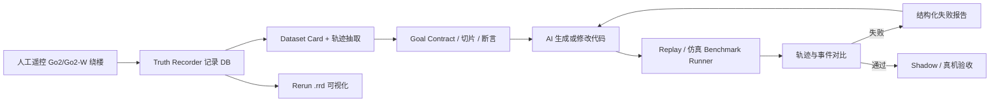

# AI Coding 数据闭环验证方案

> 来源：根据 `/Users/zhang/Downloads/aicoding-voice.m4a` 的本地转录提炼。录音较长且有噪声，Whisper 在部分片段出现重复幻觉，因此本文保留稳定可辨认的产品和工程意图，不作为逐字稿。

## 1. 录音里提取出的核心意图

1. 要把一句 PRD 式目标，转换成 AI 能理解、能验证、能不断修代码的工程目标。
   - 原始目标类似：让 Go2/Go2-W 机器狗围绕办公楼持续自主巡航。
   - AI 不能只收到一句口号，它需要收到数据、断言、指标和失败反馈。

2. 现有 LFS/replay 数据不能只是放在那里，要变成 AI Coding 的基准数据。
   - 录音里多次提到 office、big office、hongkong office、lidar、camera/WebRTC、DB 等数据。
   - 这些数据应先被盘点清楚：是谁采的、用来测什么、包含哪些流、有没有真值轨迹。

3. 先用遥控器跑出一条稳定轨迹，再把这条轨迹结构化为“真值”。
   - 人遥控机器狗绕楼跑一圈，系统记录 odom/lidar/image/cmd/path 等数据。
   - 后续 AI 生成代码后，在回放或仿真里跑出自己的轨迹，再和遥控轨迹比较。

4. 验证要分阶段。
   - 第一阶段：在 replay DB 或短切片里跑通，不破坏旧功能。
   - 第二阶段：在仿真或 shadow 模式里验证逻辑闭环。
   - 第三阶段：再上真机验证硬件、网络、SDK、定位漂移等问题。

5. 不能只告诉 AI “失败了”。
   - 断言触发后，要返回结构化失败原因：在哪个时间、哪个切片、哪个指标、偏差多少、相关日志和轨迹片段是什么。
   - AI 根据这些失败报告继续改代码，直到通过。

6. 长任务要切片。
   - “绕楼持续巡航”太大，应拆成几秒到几十秒的 route slice。
   - 每个切片对应一个可测目标，例如：看到门要进入、经过走廊要持续前进、遇到障碍要停或绕、到达局部 waypoint。

7. replay/仿真能解决逻辑问题，但不能覆盖全部真机问题。
   - replay 可以验证感知、规划、状态机、命令输出是否合理。
   - 静态 replay 不能证明 AI 的控制命令会改变下一帧世界状态。
   - 真机仍然需要最终验收。

## 2. 方案一句话

建立一个“数据驱动的 AI Coding 闭环”：用人工遥控采集的轨迹 DB 作为基准真值，把大目标拆成可验证切片和断言，让 AI 生成代码后自动在 replay/仿真中运行，输出轨迹和事件，再与真值比较；失败则生成结构化反馈交给 AI 继续修，直到指标通过，再进入真机验证。

## 3. 目标定义方式

建议把自然语言目标固化成一个 goal contract，例如：

```yaml
goal_id: go2_office_patrol_v1
robot: unitree_go2
natural_goal: 让机器狗围绕办公楼持续自主巡航
truth_dataset: recordings/go2_office_loop.db
reference_streams:
  - odom
  - corrected_odometry
  - cmd_vel
  - lidar
  - color_image
  - path
  - waypoint
success_metrics:
  moving_ratio_min: 0.75
  route_coverage_min: 0.85
  trajectory_rms_error_m_max: 0.8
  trajectory_max_error_m_max: 2.0
  yaw_error_deg_p95_max: 35
  stop_without_reason_s_max: 3.0
  forbidden_zone_violations_max: 0
  collision_events_max: 0
repair_policy:
  max_iterations: 10
  feedback: structured_failure_report
```

这里的关键点是：AI 的目标不是“写一个看起来像自主巡航的功能”，而是“让代码在指定数据和断言下通过”。

## 4. 系统架构



分工原则：

- `.db` 或 `.bag` 是真值数据和回放数据。
- `.rrd` 是可视化留存，不应作为唯一真值。
- 断言和指标是 AI 的反馈接口。
- 真机测试是最后一关，不是第一关。

## 5. 当前 DimOS 里相关代码位置

| 问题 | 代码位置 | 结论 |
| --- | --- | --- |
| Rerun bridge 如何启动 | `dimos/visualization/rerun/bridge.py:199` | `RerunBridgeModule` 订阅 pubsub 全量消息，能把带 `to_rerun()` 的消息写进 Rerun。 |
| Rerun 如何接入 blueprint | `dimos/visualization/vis_module.py:26` | `vis_module()` 按 `viewer_backend` 选择 Rerun/Foxglove/none；Rerun 默认接 LCM。 |
| `.rrd` 如何保存 | `dimos/visualization/rerun/bridge.py:187`、`dimos/visualization/rerun/bridge.py:410` | `save_to_disk=True` 时调用 `rr.save()`，生成 `.rrd`；这是可视化留存，不是控制真值。 |
| CLI 如何打开 replay/Rerun 保存 | `dimos/core/global_config.py:45`、`dimos/core/global_config.py:53`、`dimos/robot/cli/dimos.py:78` | `GlobalConfig` 里有 `replay/replay_db/rerun_save/rerun_save_dir`，CLI 会动态生成 `--replay`、`--replay-db`、`--rerun-save` 等参数。 |
| Go2 如何切换真实/回放连接 | `dimos/robot/unitree/go2/connection.py:116` | `make_connection()` 根据 `global_config.unitree_connection_type` 返回 `ReplayConnection`、MuJoCo、DimSim 或真实 WebRTC。 |
| Replay 读哪些流 | `dimos/robot/unitree/go2/connection.py:137` | `ReplayConnection` 用 `TimedSensorReplay` 读取 `{dataset}/lidar`、`{dataset}/odom`、`{dataset}/color_image`。 |
| 现有 Go2 记录蓝图 | `dimos/robot/unitree/go2/blueprints/smart/unitree_go2.py:45` | `Go2Memory` 记录 `color_image/lidar/odom`，适合做最小真值起点，但不够完整。 |
| 通用 DB 记录器 | `dimos/memory2/module.py:240` | `Recorder` 会把所有 `In` port 写入 memory2 SQLite；replay 模式下会自动禁用记录，避免覆盖原数据。 |
| 导航全量记录器 | `dimos/navigation/nav_stack/modules/nav_record/nav_record.py:37` | `NavRecord` 已定义 `cmd_vel/corrected_odometry/path/goal_path/way_point/goal/effective_cmd_vel/terrain_map/global_map` 等，接近我们需要的 truth recorder。 |
| 导航栈如何启用记录 | `dimos/navigation/nav_stack/main.py:40`、`dimos/navigation/nav_stack/main.py:173` | `create_nav_stack(record=True)` 会挂上 `NavRecord`。 |
| 已有 replay 指标样例 | `dimos/navigation/nav_stack/modules/local_planner/test_local_planner_rosbag.py:160` | 已有 path deviation 计算和阈值断言，可作为 AI 轨迹对比器的原型。 |
| LFS/replay 数据说明 | `docs/development/large_file_management.md:89`、`docs/development/large_file_management.md:128` | 文档明确 `get_data()` 会拉取 LFS 并解压；replay 数据通过 `TimedSensorReplay` 加载。 |

现状判断：

- DimOS 已经具备 replay、Rerun、DB 数据、导航测试的基础。
- 但要支撑录音里说的 AI Coding 闭环，还缺“真值记录格式统一、轨迹抽取、切片断言、benchmark runner、AI 失败反馈协议”这几层胶水。

### 5.1 Rerun 架构说明

Rerun 在这个系统里的角色是“观察和回看”，不是“控制”和“真值”。

运行链路如下：

1. 机器人模块、导航模块、感知模块通过 LCM/SHM 等 pubsub 发消息。
2. `vis_module(viewer_backend=global_config.viewer)` 把 `RerunBridgeModule` 接进 blueprint。
3. `RerunBridgeModule.start()` 启动 Rerun gRPC server，按配置打开 native/web viewer。
4. bridge 对所有 pubsub topic 调 `_on_message()`，把可转换消息写到 `rr.log()`。
5. 如果 `--rerun-save` 开启，bridge 同时调用 `rr.save()` 写 `.rrd`。

所以 Rerun 可以一直运行，也可以保存 `.rrd`，但 `.rrd` 最适合做“可视化证据”。真正要给 AI 做验证的数据，应以 `.db/.bag` 为准。

### 5.2 Replay/record 架构说明

回放链路如下：

1. CLI 设置 `--replay --replay-db <name>`。
2. `GlobalConfig.unitree_connection_type` 返回 `replay`。
3. `make_connection()` 创建 `ReplayConnection`。
4. `ReplayConnection` 用 `TimedSensorReplay("<dataset>/<stream>")` 读取 memory2 SQLite。
5. `GO2Connection.start()` 把 replay 出来的 `lidar/odom/color_image` 发布到 DimOS 流里。

记录链路如下：

1. 在 blueprint 中添加 `Recorder` 子类。
2. 子类声明要记录的 `In[...]` stream。
3. `Recorder.start()` 为每个输入流建立 memory2 stream，并把消息 append 到 SQLite。
4. 对 Go2 最小记录，可用 `unitree_go2_memory`。
5. 对 AI Coding 真值记录，应扩展为包含 nav/control/event 的 `RunTruthRecorder`。

### 5.3 本地已验证的 replay DB

当前本地 `data/.lfs/extracted/` 下已有这些可直接作为第一批数据盘点对象：

| DB | 主要流 | 样本数 | 时长 |
| --- | --- | ---: | ---: |
| `go2_short.db` | `color_image/lidar/odom` | 855 / 461 / 1122 | 约 60s |
| `go2_bigoffice.db` | `color_image/color_image_embedded/lidar/odom` | 4164 / 267 / 2251 / 5465 | 约 292s |
| `go2_hongkong_office.db` | `color_image/color_image_embedded/lidar/odom` | 7953 / 1008 / 4235 / 10437 | 约 558s |
| `go2_china_office.db` | `color_image/lidar/odom` | 1951 / 982 / 2602 | 约 139s |

这些 DB 目前更像“传感器+里程计回放数据”。要做“AI 代码轨迹 vs 遥控器轨迹”的完整闭环，还需要补充或确认是否记录了 `cmd_vel/path/goal/event` 等控制和导航流。

### 5.4 可行性判断

方案可行，但要分清三种验证能力：

1. 可直接做：数据留存、Rerun 回看、传感器 replay、轨迹抽取、离线指标对比、回归测试。
2. 需要补胶水：AI 自动生成代码后的 benchmark runner、轨迹 comparator、结构化失败反馈、短切片断言。
3. 不能只靠 replay 完成：真实闭环控制。当前 `ReplayConnection.move()` 只是返回 `True`，不会让 AI 的控制命令改变下一帧 replay 世界状态。因此 replay 只能证明逻辑输出是否合理，不能证明真机一定能跑。

最终验收必须走 `replay -> 仿真/shadow -> 真机` 三层门禁。

## 6. 数据留存方案

### 6.1 真值数据

人工遥控机器狗绕楼运行时，记录至少这些流：

- `odom` 或 `corrected_odometry`
- `cmd_vel` 和实际执行后的 `effective_cmd_vel`
- `path` / `goal_path` / `waypoint` / `goal`
- `lidar`
- `color_image`
- TF 或 frame 信息
- 事件流：手动接管、停止、异常、障碍、重定位、任务开始/结束

现有 `unitree_go2_memory` 可以作为起点，但它偏向记录 `color_image/lidar/odom`，建议扩展成 `unitree_go2_truth_record` 或增加一个 `RunTruthRecorder`，把导航命令、路径、goal、事件一起存入 memory2 DB。

### 6.2 Rerun 数据

Rerun 应同时保存 `.rrd`，用于回看和人工审查：

```bash
uv run dimos \
  --robot-ip <GO2_IP> \
  --viewer rerun \
  --rerun-save \
  --rerun-save-dir recordings/rrd \
  run unitree-go2-memory \
  -o go2memory.db_path=recordings/go2_office_loop.db
```

这个命令需要按当前蓝图参数名再用 `dimos run unitree-go2-memory --help` 校验一次。真值以 DB 为准，Rerun 只是辅助观察。

### 6.3 推荐新增的 truth recorder

`unitree_go2_memory` 只能记录 `color_image/lidar/odom`。建议新增一个 recorder，目标是把 AI 验证要用的数据一次记录全：

```python
class Go2TruthRecorder(Recorder):
    color_image: In[Image]
    lidar: In[PointCloud2]
    odom: In[PoseStamped]
    cmd_vel: In[Twist]
    effective_cmd_vel: In[Twist]
    path: In[NavPath]
    goal_path: In[NavPath]
    way_point: In[PointStamped]
    goal: In[PointStamped]
```

它可以先复用 `NavRecord` 的字段设计，再接到 Go2 patrol/navigation blueprint 上。这样遥控器跑出来的不是单纯 odom 线，而是“传感器、定位、控制命令、规划输出、事件”的完整真值包。

## 7. AI 生成与验证闭环

核心循环就是：

```text
代码生成 -> 仿真/回放测试 -> 错误反思 -> 代码修正 -> 再测试
```

这不是一句流程口号，而是系统边界：

- **代码生成**：AI 根据 goal contract、允许修改范围、数据集切片和现有架构生成代码。
- **仿真/回放测试**：先跑静态检查和 replay 切片；需要验证控制闭环时，再进入 MuJoCo/DimSim/shadow。
- **错误反思**：benchmark runner 不能只返回“失败”，必须返回指标、轨迹偏差、触发断言、关键日志和疑似代码位置。
- **代码修正**：AI 只根据结构化失败报告修改允许范围内的代码，再进入下一轮。

建议把每一轮记录成一个 iteration artifact：

```yaml
iteration: 3
goal_id: go2_office_patrol_v1
code_patch: patches/iter_003.diff
runner: replay
dataset_slice: go2_bigoffice:120s-150s
status: failed
failed_metrics:
  trajectory_rms_error_m: 1.42
  moving_ratio: 0.41
reflection:
  likely_cause: planner stops when waypoint confidence drops
  evidence:
    - cmd_vel is near zero from 132.4s to 138.1s
    - odom still moves in reference trajectory
next_action: adjust waypoint recovery and rerun slice
```

这个 artifact 是 AI 反思和下一轮修正的输入，也是人类复盘“AI 为什么改、改得对不对”的证据。

### 7.1 输入给 AI 的内容

每次让 AI 写代码，不只给需求，还要给：

- goal contract
- 允许修改的文件范围
- 相关模块架构说明
- 数据集路径和切片列表
- 必须通过的命令
- 失败报告格式
- 安全边界：真机命令默认 dry-run 或 shadow，不直接执行危险动作

### 7.2 自动验证流程

1. 静态检查：ruff、mypy、单测、蓝图加载。
2. Replay 检查：用指定 DB 跑切片，收集 AI 输出的 cmd/path/event。
3. 断言检查：每个切片产生 pass/fail 和失败原因。
4. 轨迹对比：AI 轨迹与遥控真值轨迹做时间对齐和空间误差计算。
5. 失败反馈：生成 JSON 报告交给 AI 修复。
6. 通过后进入仿真或 shadow。
7. 最后小范围真机验证。

### 7.3 轨迹对比指标

不要要求“每一帧完全一样”。现实中定位漂移、动态人员、门、障碍物都会让轨迹不可能完全一致。建议用这些指标：

- RMS XY 误差
- 最大 XY 误差
- yaw 误差 P95
- route coverage
- loop closure error
- stop ratio 和 moving ratio
- waypoint 到达率
- command smoothness
- dynamic obstacle response
- forbidden zone violation

必要时再加 DTW 或 Frechet distance，处理速度不同但路线相似的情况。

## 8. 最小可落地版本

第一周：

1. 做数据盘点脚本，输出每个 DB 的 stream、count、duration、payload type。
2. 为每个 replay DB 写 dataset card。
3. 从现有 DB 抽取 `odom` 轨迹，导出统一 JSON/CSV。
4. 写一个 `compare_trajectory.py`，支持 RMS/max/coverage。
5. 挑一个短切片作为 `go2_office_patrol_slice_001`。

第二周：

1. 扩展 truth recorder，记录导航命令、goal、path、事件。
2. 写 `benchmark_runner.py`，能跑一个切片并输出 structured failure report。
3. 把 AI Coding 任务模板固化成 `goal + data + allowed files + tests + feedback`。
4. 跑通一次“AI 修改代码 -> replay benchmark 失败 -> 报告 -> AI 修复 -> benchmark 通过”的闭环。

第三阶段：

1. 接入仿真或 shadow runner。
2. 建立真机前置安全检查。
3. 把通过的切片加入 CI 或 nightly benchmark。

## 9. 需要向原团队确认的问题

1. LFS 中每个 Go2 DB 的采集目的是什么：demo、回归测试、定位评估、导航评估，还是只是可视化样例？
2. DB 中是否存在人工遥控命令、planner 输出、真实执行 cmd，还是只有传感器和 odom？
3. 当前 replay 是纯传感器回放，还是支持控制命令影响下一帧环境？
4. 原始数据有没有标注好的 route、goal、事件、失败点？
5. Rerun `.rrd` 是否只是视觉回放，还是曾被设计成评测输入？
6. Go2-W 遥控器控制时，SDK 层命令能否同步记录？

## 10. 结论

这个方案可行，但边界要讲清楚：

- 可行的是：用数据回放和仿真把 AI Coding 从“凭感觉写代码”变成“对着目标和断言自动修到通过”。
- 不可行的是：只靠静态 replay 就证明真实机器狗能绕楼自主巡航。
- 最正确的路线是：真值 DB 记录、短切片断言、轨迹对比、结构化反馈、仿真/shadow、最后真机验收。

录音里最有价值的点是：不要先纠结 AI 会不会一次写对，而是把“什么叫写对”定义清楚。只要目标、数据、断言、反馈闭环搭起来，AI 才有可能持续修到可用。
