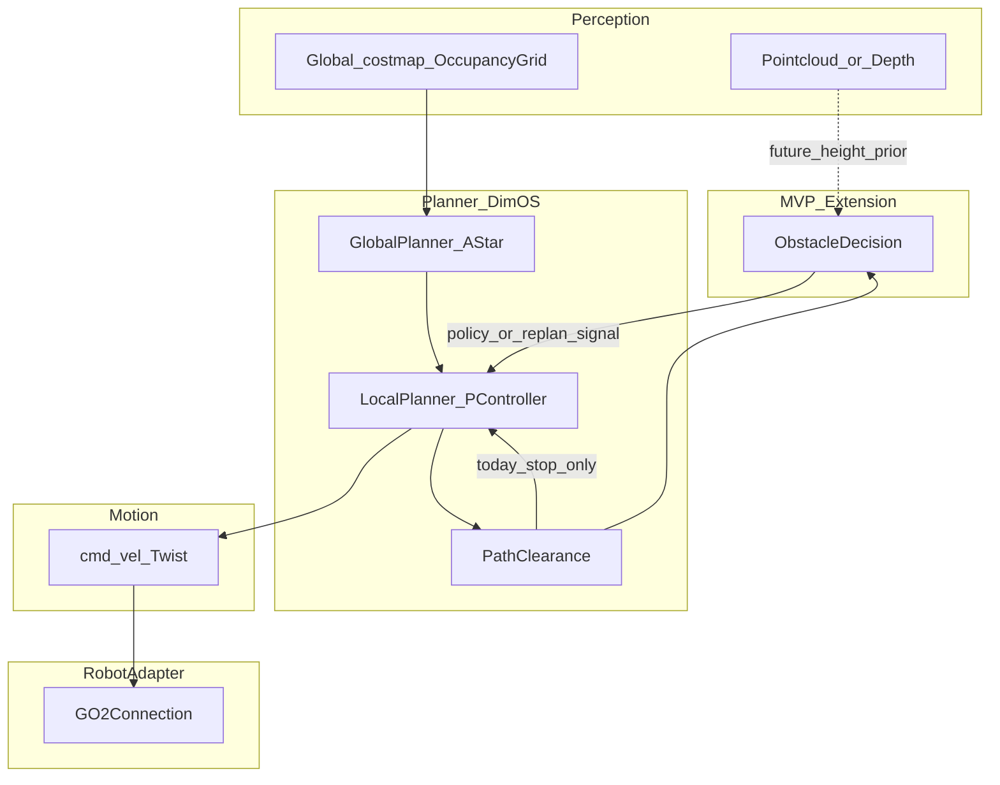
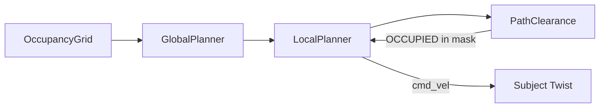
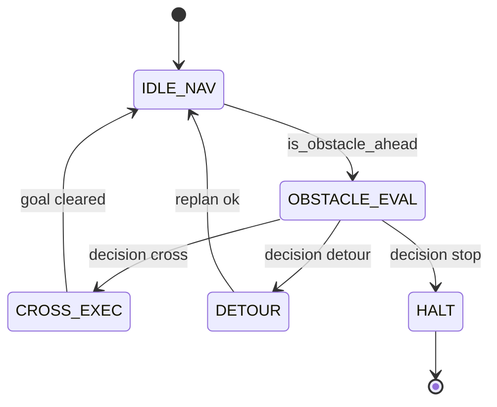
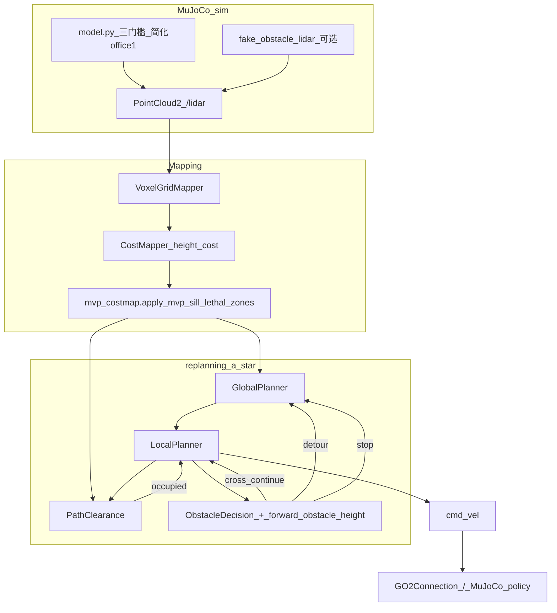

# AI 重构机器人导航模块 — 完整方案（DimOS / Go2）

**说明**：本文为该主题的**唯一**完整技术方案正文（周会设计、PRD、源码分析、真机归档模板、Code Review 清单、二阶段 C++ 预留均在此文件内，不拆分为多份 Markdown）。  
**修订**：2026-05-21（新增 [§12 MVP 实现状态](#12-mvp-实现状态2026-05)）

---

## 1. 背景与总目标

在 **不重写全局 A\***、**不改动 `autoconnect` 全图** 的前提下，为 Go2 在 DimOS 现有 **`replanning_a_star` 栈**上的局部遇障行为增加 **「约 10cm 级可跨越 vs 绕行 vs 硬停」** 的显式决策空间；感知对齐 **代价图 / 点云 / 深度** 与 `OccupancyGrid` 管线，运动出口仍为 **`Twist` → `GO2Connection.move()`**。

**不引入**第二套运行时「多 Agent 集群」；采用 **角色化工作流**（几何 / 策略 / 运动参数 / Review）产出 **模块 + 测试 + 文档**。

---

## 2. 周会目标 → DimOS 落地映射

| 周会表述 | DimOS 含义 |
|----------|------------|
| 感知 → 决策 → 运动 → Robot Adapter | **代价图 / 点云 / 深度**（如 `VoxelGridMapper`、`OccupancyGrid`、`NavigationMap`）→ **`GlobalPlanner` + `LocalPlanner`**（遇障原逻辑：`PathClearance.is_obstacle_ahead` 为真即停并发 `obstacle_found`）→ **`cmd_vel` (`Twist`)** → **`GO2Connection`**（LCM `cmd_vel` → `move()`；Sport 侧 `FreeAvoid` / `obstacle_avoidance` 见第 7 节） |
| 可复用动态库 | 已有 **`min_cost_astar_cpp`** + Python 回退；MVP 先 **(A) Python 决策包 + 接口**，可选 **(B)** 后续 `libnavigation_obstacle.so` |
| 多 Agent | **流程角色**，非运行时多进程 Agent |
| AI 只改局部 | 首阶段 **局部遇障分支** 或实验旁路；**不改**全局图与蓝图全连接 |

---

## 3. MVP 行为摘要（与第 6 节 PRD 一致）

- **输入**：前方高度（cm，可空）+ `PathClearance.is_obstacle_ahead()`。  
- **输出三态**：`cross` / `detour` / `stop`（语义与 `stopped_navigating` 对齐，见第 6 节）。  
- **默认阈值**：`None` → `detour`；`h ≤ 10` → `cross`；`10 < h ≤ 50` → `detour`；`h > 50` → `stop`。

**代码落地与数据流**见 [§12](#12-mvp-实现状态2026-05)。

---

## 4. 架构与数据流

### 4.1 与现有栈关系



### 4.2 局部数据流（现状）



### 4.3 集成档位

| 档位 | 做法 | 建议 |
|------|------|------|
| **档 A（侵入小）** | 在 `local_planner.py` 中，`is_obstacle_ahead()` 为真且 **feature flag 默认关** 时调用决策；`detour` → `obstacle_found`；`cross` 不立即 break；`stop` → `obstacle_abort` | **首周推荐** |
| **档 B（零侵入）** | 新 `Module` 仲裁 `cmd_vel` | 成本高，不建议首周 |

`GlobalPlanner` 通过 `_replan_event` / `_replan_reason` **单线程**消费 `stopped_navigating`；扩展 `obstacle_abort` 时须 **`cancel_goal()`** 而非 `_replan_path()`。

### 4.4 建议代码布局（实现阶段）

与 `dimos/experimental/security_demo/` 同级：

```text
dimos/experimental/navigation_obstacle_mvp/
├── __init__.py
├── obstacle_decision.py
├── obstacle_nav_bridge.py    # 可选
├── README.md
└── tests/
    └── test_obstacle_decision.py
```

验证用最小 `autoconnect` 或 `unitree_go2_spatial` 变体；二阶段 C++ 可放 `native/navigation_obstacle/` 或与 `min_cost_astar_cpp` 同构 CMake。

**已实现文件与钩子**见 [§12.4](#124-模块改动清单)（2026-05 落地，含 `forward_obstacle_height.py`、`mvp_costmap.py`、`fake_obstacle_lidar.py` 等）。

---

## 5. 角色化工作流与周计划

### 5.1 角色（非运行时）

| 角色 | 产出 |
|------|------|
| Obstacle Detection | 高度 cm、宽度、夹角；脚本 + fixture |
| Decision Planner | 显式状态机（文档 + 代码）；禁止 LLM 运行时改状态机 |
| Motion Executor | Sport 参数表；人工对照 SDK 落入 `connection` / `@rpc` |
| Code Reviewer | 第 9 节清单 |

### 5.2 按周任务

| 阶段 | 任务 |
|------|------|
| 周一 | 读 `replanning_a_star` + `GO2Connection`；ROS2 真机对照 `ROSTransport`（首周可不改编排） |
| 周二 | 定稿输入/输出/状态机/安全；上文 mermaid 定稿 |
| 周三 | 决策 + 单测；档 A 则 `local_planner` 最小 diff + `GlobalConfig` 布尔默认关 |
| 周四 | 真机短距、仅 flag 开；录屏与日志（第 8 节） |
| 周五 | 终版与视频归档；无 `.so` 则 Python MVP + 接口冻结 + 第 10 节 C++ 边界 |

### 5.3 代码与构建交付物（路径）

| 类型 | 路径 |
|------|------|
| 决策与测试 | `dimos/experimental/navigation_obstacle_mvp/` |
| 可选钩子 | `dimos/navigation/replanning_a_star/local_planner.py`、`global_planner.py` |
| 配置 | `dimos/core/global_config.py`（如 `obstacle_crossing_mvp` 等，以实现为准） |
| 二阶段 native | `native/` 或与 `min_cost_astar_cpp` 同构 |

---

## 6. PRD：导航局部遇障「跨 / 绕 / 停」MVP（Go2 / DimOS）

**版本**：v1（工程草案）  
**状态**：与周会 OKR 对齐；真机参数在第 8 节迭代记录。

### 6.1 背景与目标

全局栈已有 **A* + 局部 P 跟踪 + PathClearance 二值走廊**；遇障时当前行为为 **停发并重规划**。本 PRD 在 **不改全局图、不改 autoconnect 全图** 前提下，为 **约 10cm 级** 障碍增加显式策略空间，并与 **GO2Connection / Sport** 能力边界对齐。

### 6.2 周会 OKR 映射（PRD 视角）

| OKR / 周会表述 | 本 PRD 落地 |
|----------------|------------|
| 感知 → 决策 → 运动 → Adapter | 高度/几何 **输入**（首期可为配置注入或感知）→ **`ObstacleDecision` 三态** → **`Twist` / `move`** → **GO2Connection**；不引入第二套运行时 Agent 集群。 |
| AI 只改局部 | **LocalPlanner 遇障分支** + **`dimos/experimental/navigation_obstacle_mvp/`**；默认 **功能开关关闭**。 |
| 可复用动态库 | **首阶段 Python**；二阶段 ABI 见第 10 节。 |

### 6.3 输入 / 输出

#### 输入

| 字段 | 类型 | 来源（首期） | 说明 |
|------|------|--------------|------|
| 前方障碍等效高度 | `float \| None`（cm） | `GlobalConfig.obstacle_crossing_mvp_height_cm` 或后续感知 | `None` 为未知 |
| 路径走廊占用 | bool | `PathClearance.is_obstacle_ahead()` | **进入决策的前置条件** |

**冻结说明**：真机高度与 ROI 由「SDK/topic 摸底」后填入 **第 8 节附录 A**；未冻结前 **不得**在公开配置中写入危险默认值。

#### 输出（三态）

| 状态 | 含义 | 执行侧（首期） |
|------|------|----------------|
| `cross` | 可跨越（约 ≤10cm 级） | 继续本周期局部控制（**不**触发 `obstacle_found`）；后续可接 Sport 序列。 |
| `detour` | 需绕开或重规划 | `stopped_navigating` → **`obstacle_found`** → `GlobalPlanner._replan_path()`。 |
| `stop` | 安全停且不重规划 | `stopped_navigating` → **`obstacle_abort`** → `cancel_goal()`（与 `GlobalPlanner` 分支对齐）。 |

#### 高度阈值（默认）

- `h is None`：**`detour`**。  
- `h ≤ cross_max_cm`（默认 **10**）：`cross`。  
- `cross_max_cm < h ≤ detour_max_cm`（默认 **50**）：`detour`。  
- `h > detour_max_cm`：`stop`。

### 6.4 状态机（文档级，禁止 LLM 运行时改写）

与代码中 `PlannerState` 不同层，供运维 / 开发对照：



- **IDLE_NAV**：未触发走廊占用或正常跟踪。  
- **OBSTACLE_EVAL**：占用为真，进入 `ObstacleDecision`。  
- **CROSS_EXEC**：本周期继续 `cmd_vel`。  
- **DETOUR**：发 `obstacle_found`。  
- **HALT**：发 `obstacle_abort`。

### 6.5 安全上限与原则

| 类别 | 要求 |
|------|------|
| 线速度 | 沿用 `LocalPlanner` / `PController` 与 `nerf_speed`；**禁止** MVP 中静默提高 `Rage` 包络。 |
| 功能开关 | `obstacle_crossing_mvp` **默认 `False`**；真机短距、有人监护。 |
| 未知高度 | 不得默认 `cross`。 |
| 急停 | `stop_planning` / `cancel_goal` 仍发零 `Twist`。 |
| 合入 | `bash scripts/verify.sh`；小 PR、可回滚。 |

### 6.6 Sport / SDK 边界（摘要）

- **FreeAvoid / obstacle_avoidance**：`GO2Connection.start()` 按 `GlobalConfig` 设置；与 MVP 决策 **正交**。  
- **无抬腿 API**：`cross` 仅为规划语义；真机能否通过须 **护栏 + 限速 + 录包** 验证，否则降级 `detour`。

### 6.7 验收（MVP）

- [ ] 开关关闭时与改动前 **一致**（遇障 → `obstacle_found` → 重规划）。  
- [ ] 单测覆盖 `ObstacleDecision` 全分支。  
- [ ] 真机短跑：日志与视频记入 **第 8 节**。  
- [ ] **第 9 节** Code Review 清单已勾选。

### 6.8 终版交付（代码侧，以实现为准）

- **Python MVP**：`obstacle_decision.py` + pytest；`GlobalConfig` 开关与可选高度字段；`LocalPlanner` 可选钩子。  
- **仿真**：`dimos/experimental/navigation_obstacle_mvp/tests/test_mujoco_obstacle_mvp.py`（`@pytest.mark.mujoco`，默认 fast 不收集）；本机 2026-05-21 验证 **5 passed**（`-m mujoco`）。实现细节见 [§12](#12-mvp-实现状态2026-05)；操作手册见 [`dimos/experimental/navigation_obstacle_mvp/README.md`](../../dimos/experimental/navigation_obstacle_mvp/README.md)。
- **手动运行**：Go2 蓝图须 `--robot-ip`（真机）、`--simulation mujoco`（仿真）或 `--replay`；MVP 开关可与任一模式组合，命令示例见 [§12.6](#126-cli-与启动) 与 README「开启方式」。  
- **无 `.so`**：二阶段见第 10 节。

---

## 7. 导航重规划栈源码分析（GlobalPlanner / LocalPlanner / PathClearance / GO2Connection）

对应「感知 → 决策 → 运动 → Adapter」在 DimOS 中的落地，路径：`dimos/navigation/replanning_a_star/`、`dimos/robot/unitree/go2/connection.py`、`dimos/core/global_config.py`。

### 7.1 总览与数据流

1. **代价图**：`GlobalPlanner.handle_global_costmap` 更新 `NavigationMap`（`voronoi` / `gradient`）。  
2. **全局路径**：`handle_goal_request` → `_plan_path` → `_find_safe_goal` → `_find_wide_path`（`min_cost_astar`）→ `smooth_resample_path` → `path.on_next` → `LocalPlanner.start_planning`。  
3. **局部跟踪**：`LocalPlanner._loop`，默认 **10Hz**，`PController` → `Twist`。  
4. **遇障**：`PathClearance.is_obstacle_ahead()` 为真 → **`obstacle_found`** 并 break。  
5. **重规划**：`GlobalPlanner` 订阅 `stopped_navigating`；`obstacle_found` / `error` → `_replan_path()`；`arrived` → `cancel_goal(arrived=True)`。

### 7.2 GlobalPlanner（`global_planner.py`）

**职责**：目标、安全目标、全局路径、stuck/偏离/局部停机监控与重规划。

| 成员 | 作用 |
|------|------|
| `_navigation_map` / `_navigation_map_near` | 距离相关梯度代价图宽度 |
| `_local_planner` | `cmd_vel`、`stopped_navigating`、`navigation_costmap` |
| `_replan_event` / `_replan_reason` | 局部只置事件，**重规划在监控线程** |
| `_replan_limiter` | 重试上限 |
| `_replanning_enabled` | 关则遇障后直接 `cancel_goal()` |

**遇障链路**：`LocalPlanner` → `"obstacle_found"` → `_on_stopped_navigating` → `_handle_stop_message` → `_replan_path()`。

**扩展点**：`"obstacle_abort"` 须在 `_handle_stop_message` 中 **`cancel_goal()`**，非 `_replan_path()`。

### 7.3 LocalPlanner（`local_planner.py`）

**职责**：`initial_rotation` → `path_following` → `final_rotation` → `arrived`；每周期更新 `PathClearance`；发布 `cmd_vel`。

- `_speed` 默认 **0.55 m/s**（可乘 `nerf_speed`）；**10 Hz**；初始对准约 **0.35 rad**。  
- **遇障位置**：`_loop` 在算 `cmd_vel` **前**调 `is_obstacle_ahead()`；真则 break。  
- **扩展点**：`obstacle_crossing_mvp` 下调用决策；`cross` 不 break；`detour` / `stop` 见第 6 节。

### 7.4 PathClearance（`path_clearance.py`）

沿 `pose_index` 向前 **3m** 走廊（`make_path_mask`，宽 `GlobalConfig.robot_width`），mask 内 **`CostValues.OCCUPIED`** 即障。**无二值以外高度**；高度须上游或配置注入。`costmap is None` → `is_obstacle_ahead()` 为 **True**。

### 7.5 PController（`controllers.py`）

大航向误差原地转；否则前向衰减；最小线速度 **0.2 m/s**、角速度 **0.2 rad/s**（仿真角速度可放大）。`cross` 若叠加序列须限 **Twist 与频率**。

### 7.6 GO2Connection（`dimos/robot/unitree/go2/connection.py`）

`cmd_vel` → `subscribe(self.move)` → **`connection.move(twist, duration)`**。`deploy()`：`LCMTransport(..., Twist)`。

#### Sport / 避障

| 能力 | 说明 |
|------|------|
| `set_obstacle_avoidance` | ObstaclesAvoidClient，`api_id≈1001`，`GlobalConfig.obstacle_avoidance` |
| `free_avoid` | SportClient::FreeAvoid，`api_id≈2048`，`GlobalConfig.free_avoid`，与上者独立 |
| `enable_rage_mode` | 前向包络约 **2.5 m/s**，与默认 P 速度无耦合 |
| `move` | WebRTC/Sport；**无保证**「按 cm 抬腿」RPC；步态须 SDK / `publish_request` 扩展 |

**结论**：闭环 **`Twist` → `move()`**；无法步态 API 时退化为 **限速 Twist + 参数 + 护栏**。

### 7.7 与 C++ A* 的关系

`min_cost_astar` → `min_cost_astar_cpp`（失败 Python 回退）。MVP **不改**全局 A*。

### 7.8 线程与安全

- `LocalPlanner._loop` 为 daemon；`stop_planning` 发零 `Twist`。  
- **禁止**在局部线程阻塞 RPC/网络；高度须预先写入。

---

## 8. 附录 A：真机短场景与日志 / 视频归档

每次真机跑后**在下方追加一节**（复制表格填写）。

| 字段 | 填写 |
|------|------|
| 日期 / 操作者 | |
| 蓝图名 / `dimos run` 命令 | |
| MVP 开关与高度来源 | |
| 场景（距离、障碍类型） | |
| Run ID | `dimos status` |
| 日志路径 | `~/.local/state/dimos/logs/<run-id>/main.jsonl` |
| 视频链接 | |
| SDK/topic / ROI 冻结结论 | |
| 异常与回退 | |

**（以下为历次记录占位，按日期追加。）**

---

## 9. 附录 B：AI Code Review 清单（导航 MVP）

每次 PR 或合入前勾选。

- [ ] LCM / topic 名与 `Twist` 单位与现网一致  
- [ ] 局部控制线程 **无阻塞** RPC / 网络  
- [ ] `GlobalConfig` 开关默认 **关**；真机监护已在本文或发布说明中体现  
- [ ] `obstacle_found` / `obstacle_abort` 与 `GlobalPlanner` 分支一致  
- [ ] 与 `free_avoid` / `obstacle_avoidance` **无隐式耦合**  
- [ ] 单测覆盖决策边界；必要时录包回放  
- [ ] `scripts/verify.sh` 已通过  

**（以下为评审记录占位：日期 / PR / 结论 / 遗留）**

---

## 10. 二阶段 C++ 动态库接口预留（无实现）

若抽离 `libnavigation_obstacle.so`，建议纯 C ABI：

```text
// 返回：0=cross, 1=detour, 2=stop
int navigation_obstacle_classify(float height_cm, float max_cross_cm, float max_detour_cm);
```

栅格几何下沉 native 可与 `min_cost_astar_cpp` 同仓构建；**不改变**默认 Python `GlobalPlanner` 路径。

---

## 11. 风险与合入原则（汇总）

- **真机 / 仿真差异**：限速、俯仰硬限、急停。  
- **AI 幻觉**：`cross` 必须单测 + 录包；附录 B 强制勾选。  
- **合入**：小 PR、`verify.sh`、flag 默认关；PR 目标分支遵循仓库流程。

---

## 12. MVP 实现状态（2026-05）

本节记录 **navigation obstacle MVP** 在仓库中的落地情况，与第 2、6 节 PRD 及第 4 节架构对齐。操作步骤、FAQ、弹窗排障见 [`dimos/experimental/navigation_obstacle_mvp/README.md`](../../dimos/experimental/navigation_obstacle_mvp/README.md)（操作手册，不重复本文方案叙述）。

### 12.1 与 PRD / 周会目标的对应

| 周会 / PRD 目标 | 实现落点 | 状态 |
|-----------------|----------|------|
| 感知 → 决策 → 运动 → Adapter | `VoxelGridMapper` / `CostMapper`（`height_cost` + MVP lethal）→ `PathClearance` → `ObstacleDecision` → `LocalPlanner` / `GlobalPlanner` → `Twist` → `GO2Connection` | 仿真路径已打通；真机高度仍依赖配置或后续感知 |
| AI 只改局部、开关默认关 | `GlobalConfig.obstacle_crossing_mvp=False`；钩子仅在 `LocalPlanner._handle_obstacle_ahead` 与 `GlobalPlanner` 重规划分支 | 已合入 |
| 三态 cross / detour / stop | `obstacle_decision.decide_obstacle_action` + `stopped_navigating` 映射 | 已合入 |
| 不改全局 A*、不改 autoconnect 全图 | 全局仍 `min_cost_astar`；MVP 仅在遇障与 costmap 后处理加逻辑 | 已遵守 |
| 可复用动态库 | 仍为 Python；ABI 预留见第 10 节 | 未实现 `.so` |
| 真机短场景归档 | 第 8 节附录 A 表格 | 待填 |

### 12.2 实现方案与三态决策

**档位**：采用第 4.3 节 **档 A**——在 `local_planner.py` 的 `PathClearance.is_obstacle_ahead()` 为真时，若 `obstacle_crossing_mvp` 开启则走决策；否则保持原行为（一律 `obstacle_found`）。

**高度解析**（`forward_obstacle_height.resolve_obstacle_height_cm`）：

1. MuJoCo office1 走廊内：按机器人位姿 **推断** 最近门槛（`MVP_SILLS`，与 `model.py` 几何一致）；推断成功则 **优先于** CLI `obstacle_crossing_mvp_height_cm`。  
2. 在走廊内、代价图已报障但未匹配到具体槛：**不回退** 到低 CLI 默认值，保守 `detour`。  
3. 走廊外或未开仿真：使用 CLI 配置高度；`None` → `detour`。

**三态与停机信号**（与第 6.3 节一致）：

| 条件（默认阈值） | 决策 | `stopped_navigating` | 全局行为 |
|------------------|------|----------------------|----------|
| `h is None` | `detour` | `obstacle_found` | `_replan_path()` |
| `h ≤ 10 cm` | `cross` | （不发布） | 本周期继续 `cmd_vel`；近低槛可 creep（线速 ×0.35） |
| `10 < h ≤ 50 cm` | `detour` | `obstacle_found` | 重规划；仿真下可走 **MVP 绕槛路径**（`mvp_detour_waypoints`） |
| `h > 50 cm` | `stop` | `obstacle_abort` | `cancel_goal()`，不重规划 |

**扩展行为**（仿真专用）：

- **Detour preempt**：`path_following` 且距非 cross 槛 **<0.6 m**、推断高度 **≥18 cm** 时，局部先发零速并发布 `obstacle_found`（或 `obstacle_abort`），避免顶死在中/高槛前。  
- **代价图 lethal**：中/高槛在 `apply_mvp_sill_lethal_zones` 中整槛宽标 `OCCUPIED(100)`，避免 A* 把 1.1× 狗宽当可穿缝。  
- **低槛 cross**：5 cm 在 `height_cost` 可能低于 `PathClearance` 阈值；靠 pose 预判 + creep，不依赖代价图先报障。

### 12.3 端到端数据流



**重规划绕槛**（`obstacle_found` 且 MVP 开）：`GlobalPlanner._find_mvp_detour_path` 在阻挡槛侧插入 ±0.8 m 横向 waypoint，分段 A*；局部 `_mvp_detour_hold_active` 期间持续零速直至新 path 下发。

### 12.4 模块改动清单

| 路径 | 作用 |
|------|------|
| `dimos/experimental/navigation_obstacle_mvp/obstacle_decision.py` | 纯函数三态决策（`cross` / `detour` / `stop`） |
| `dimos/experimental/navigation_obstacle_mvp/forward_obstacle_height.py` | 走廊判定、`MVP_SILLS`、位姿推断高度、`resolve_obstacle_height_cm` |
| `dimos/experimental/navigation_obstacle_mvp/mvp_costmap.py` | 中/高槛 lethal 区、绕槛 waypoint、`find_blocking_sill` |
| `dimos/experimental/navigation_obstacle_mvp/fake_obstacle_lidar.py` | 离屏 GL 失败时从 MVP geom 合成 `/lidar` 点云 |
| `dimos/navigation/replanning_a_star/local_planner.py` | MVP 遇障分支、detour preempt、creep、detour hold |
| `dimos/navigation/replanning_a_star/global_planner.py` | `obstacle_abort` → `cancel_goal`；costmap lethal；MVP 绕槛重规划 |
| `dimos/navigation/replanning_a_star/path_clearance.py` | 无逻辑变更（仍二值走廊）；高度由上游注入 |
| `dimos/mapping/costmapper.py` | 发布前调用 `apply_mvp_sill_lethal_zones` |
| `dimos/core/global_config.py` | `obstacle_crossing_mvp`、`obstacle_crossing_mvp_height_cm`、`mujoco_navigation_test_obstacles`；CLI `normalize_global_config_argv`；`apply_simulation_viewer_defaults` |
| `dimos/simulation/mujoco/model.py` | office1 剥离家具、注入三门槛（5/20/58 cm）、无 person |
| `dimos/simulation/mujoco/mujoco_process.py` | 离屏 GL 多后端、fake LiDAR、GLX preflight、viewer 与离屏隔离 |
| `dimos/simulation/mujoco/display_env.py` | 离屏 GL 后端选择与 Mesa 软件渲染环境 |
| `dimos/simulation/mujoco/viewer_probe.py` | 弹窗前 GLX/GLFW 子进程探测，失败则 10s 内降级 headless |
| `dimos/simulation/mujoco/diagnose.py` | DISPLAY / OpenGL / NVIDIA 诊断 CLI |
| `dimos/core/torch_cuda_warnings.py` | 抑制重复 CUDA 804 等告警 |
| `scripts/demo-mvp.sh` | headless 端到端 smoke（fake LiDAR → goal → MVP 日志） |

**Agentic 栈（与 MVP 并行，便于 `unitree-go2-agentic` 无 GPU/API 启动）**：

| 路径 | 作用 |
|------|------|
| `dimos/agents/skills/speak_skill.py` | 无 `OPENAI_API_KEY` 时跳过 TTS |
| `dimos/agents/mcp/mcp_client.py` | 无 API key 时跳过 LangGraph，MCP 直连仍可用 |
| `dimos/agents/web_human_input.py` | STT 可选降级 |
| `dimos/models/segmentation/edge_tam.py` | 无 CUDA 时 stub，安保巡逻无跟踪段 |

**测试**（`dimos/experimental/navigation_obstacle_mvp/tests/`，fast 默认 **21 passed**；`-m mujoco` **5 passed**）：决策、局部/全局钩子、高度推断、costmap、fake LiDAR、`test_demo_smoke`、`test_planner_sim_performance`。

### 12.5 MuJoCo 验证场景（office1 北走廊）

启用 `--obstacle-crossing-mvp` 或 `--mujoco-navigation-test-obstacles` 时：`scene_office1.xml` 移除桌椅等家具，在 spawn `(-1, 1)` 北侧 **+Y** 注入三薄槛（宽约 1.5 m、厚 0.05 m，中心 x≈-1.12 m，间距 1.7 m）：

| 几何名 | 中心 (x, y) m | 顶高（决策 / 物理） | 期望决策 |
|--------|---------------|---------------------|----------|
| `mvp_threshold_low` | (-1.12, 1.45) | **5 cm** | `cross` |
| `mvp_threshold_medium` | (-1.12, 3.15) | **20 cm** / MuJoCo **15 cm**（减挂死） | `detour` |
| `mvp_threshold_high` | (-1.12, 4.85) | **58 cm** | `stop` |

手动验收：从 spawn 向北依次经过低 → 中 → 高槛；或在 Rerun / Command Center（7779）点击对应 goal。界面与弹窗命令见 README。

### 12.6 CLI 与启动

| 场景 | 命令要点 |
|------|----------|
| MuJoCo + MVP + agent（常用） | `uv run dimos --simulation mujoco --obstacle-crossing-mvp --obstacle-crossing-mvp-height-cm 8 run unitree-go2-agentic` |
| 仅导航栈 smoke | `… run unitree-go2` |
| 真机（短距、监护） | 加 `--robot-ip <IP>`，同样 MVP 开关 |
| 弹窗推荐前缀 | `GDK_BACKEND=x11 MUJOCO_GL=glfw CUDA_VISIBLE_DEVICES=""` + `--mujoco-offscreen-gl off` |
| headless + fake LiDAR | `--no-mujoco-viewer --mujoco-offscreen-gl off --viewer none` |
| 一键 smoke | `bash scripts/demo-mvp.sh` |

`--obstacle-crossing-mvp-height-cm8` 类笔误由 `normalize_global_config_argv` 拆分为合法 flag；未修复时 Typer 报错且高度为 `None`（遇障走 `detour`）。

### 12.7 测试与验收现状

| 项 | 状态 |
|----|------|
| 开关关闭行为与改动前一致 | 单测 + 设计保证；真机待第 8 节记录 |
| `ObstacleDecision` 全分支 | `test_obstacle_decision.py` |
| `obstacle_abort` 不重规划 | `test_global_planner_obstacle_abort.py` |
| MVP 绕槛路径不穿槛心 | `test_global_planner_mvp_detour.py` |
| MuJoCo 场景与 costmap | `test_mujoco_obstacle_mvp.py`（`-m mujoco`） |
| 第 9 节 Code Review 清单 | PR 时勾选 |
| 真机短跑录包 | **未完成**（附录 A 待填） |

### 12.8 已知限制与后续

| 限制 | 说明 | 后续 |
|------|------|------|
| 无真机高度感知 | 高度来自 CLI 或 MuJoCo pose 推断，非激光/深度 ROI | 第 8 节冻结 topic/ROI 后接入 |
| `cross` 无抬腿 API | 语义为「不立即停/不重规划」；近槛仅 creep + MockController 限幅 | Sport 序列需 SDK 摸底 |
| 二值 `PathClearance` | 5 cm 低槛可能不报障；依赖 pose 预判 | 可选高度通道或更低占用阈值 |
| C++ `.so` | 未实现 | 第 10 节 ABI |
| 真机与仿真差异 | stuck 窗口、角速度下限、MuJoCo policy 限幅仅仿真 | 真机附录 A + 限速护栏 |
| FreeAvoid / `obstacle_avoidance` | 与 MVP 决策正交，勿隐式耦合 | 保持 GlobalConfig 独立 |

---

*若正文与代码实现冲突，以代码与最新 PR 说明为准。*
