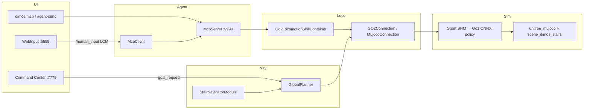

# Go2 楼梯仿真：改动说明、启动与测试流程

本文档汇总当前工作区中与 **Go2 直线楼梯 MuJoCo 仿真**、**楼梯导航**、**Sport 运控**、**Agent/MCP** 及 **可视化操控** 相关的全部改动，并给出推荐的仿真启动与测试步骤。

更细的 Sport API / SHM 机制见：[go2_stair_mujoco_sport.md](./go2_stair_mujoco_sport.md)。  
Unitree MuJoCo 后端通用说明见：[unitree_mujoco_sim.md](./unitree_mujoco_sim.md)。

---

## 1. 目标与能力

| 能力 | 说明 |
|------|------|
| 楼梯场景 | 10 级均匀 **15 cm** 踏高、可调踏深（默认 **32 cm** ≈ 25°），沿 **+x** 上行 |
| 感知与建图 | 仿真 rig 激光/相机 → 代价地图；楼梯走廊规划 |
| 运控 | `WalkStair` (API **1049**) + `cmd_vel`；MuJoCo 经 SHM 近似 Sport |
| 导航 | `stair_navigation`、走廊 A*、`climb_stairs` 目标吸附 |
| Agent | `unitree-go2-stairs-agentic`：MCP + 轻量 skills（无 hydra / PersonFollow） |
| 操控 | Command Center 代价地图点目标；键盘 `cmd_vel`；Web 语音/文字 |

---

## 2. 蓝图

| CLI 名称 | 模块入口 | 用途 |
|----------|----------|------|
| `unitree-go2-stairs` | `unitree_go2_stairs` | 楼梯栈 + `StairNavigatorModule`；仿真/真机/回放 |
| `unitree-go2-stairs-agentic` | `unitree_go2_stairs_agentic` | 上者 + `McpServer` / `McpClient` + 运控 skills + `WebInput` |

`unitree-go2-stairs` 默认全局配置（见 `unitree_go2_stairs.py`）：

- `stair_navigation=True`
- `mujoco_room=stairs`
- `mujoco_backend=unitree`（官方 `unitree_mujoco` + DimOS 楼梯 MJCF）
- `mujoco_start_pos=1.85, 0.0`（第一级踏前平地）

`unitree-go2-stairs-agentic` **不**使用 `_common_agentic`（避免 `PersonFollow` → hydra、`NavigationSkillContainer` → `SpatialMemory`）。运控与导航 skills 见 `Go2LocomotionSkillContainer` + `UnitreeSkillContainer`。

---

## 3. 架构（运行时）



**行走三层：**

1. **即时速度**：`move` / 键盘 → `GO2Connection.move` → `cmd_vel`
2. **地图导航**：代价地图目标 / `climb_stairs` → `NavigationInterfaceSpec.set_goal`
3. **楼梯 Sport**：`walk_stair` / `climb_stairs` → `Go2StairSportController` → `WalkStair` 等

---

## 4. 改动清单（按子系统）

### 4.1 仿真场景与 Sport

| 路径 | 改动要点 |
|------|----------|
| `dimos/simulation/mujoco/build_scene_stairs.py` | 生成 `scene_stairs.xml` 与 `scene_dimos_stairs*.xml`；`stair_top_goal_xy()`；环境变量 `DIMOS_STAIR_TREAD_M` |
| `dimos/simulation/unitree_mujoco/scenes/scene_dimos_stairs.xml` | Unitree 后端楼梯场景 |
| `dimos/simulation/mujoco/sport_state.py` | Sport SHM 增益、WalkStair / CrossStep 等仿真档 |
| `dimos/simulation/mujoco/policy.py` | DimOS MuJoCo 策略侧 Sport 观测与限速 |
| `dimos/simulation/unitree_mujoco/go2_policy.py` | 官方 Go2 仿真策略继承楼梯逻辑 |
| `dimos/robot/unitree/go2/stair_locomotion/sport_actions.py` | **新增** SDK/WebRTC 动作表（含 API 1049 `WalkStair`） |
| `dimos/robot/unitree/go2/stair_locomotion/sport_api.py` | 楼梯模式状态机、仿真/真机分支 |
| `dimos/robot/unitree/go2/stair_locomotion/locomotion_policy.py` | 分阶段 ALIGN → ON_STAIR、倾倒检测 |
| `dimos/simulation/mujoco/test_stair_climb_sim.py` | **新增** `@pytest.mark.mujoco` 无头爬楼验收 |

### 4.2 楼梯导航与规划

| 路径 | 改动要点 |
|------|----------|
| `dimos/navigation/stairs/stair_navigator_module.py` | 点云楼梯检测；仿真 `mujoco_room=stairs` 时 **预置走廊** |
| `dimos/navigation/stairs/scene_corridor.py` | **新增** 与 `build_scene_stairs` 几何一致的 `StairCorridor` |
| `dimos/navigation/stairs/plan_in_corridor.py` | 走廊内路径；离中心线远时插入机器人起点 |
| `dimos/navigation/replanning_a_star/global_planner.py` | 地图外目标夹边；楼梯 `unknown_penalty`；`goal_requests_stair_corridor` 吸附 |
| `dimos/navigation/replanning_a_star/goal_validator.py` | `goal_inside_costmap` / `clamp_goal_to_costmap` |
| `dimos/mapping/terrain/stair_detection.py` | 楼梯候选检测（合成点云 fixture 测试） |

### 4.3 Agent / MCP / Skills

| 路径 | 改动要点 |
|------|----------|
| `dimos/robot/unitree/go2/go2_locomotion_skill_container.py` | **新增** `move`, `climb_stairs`, `walk_stair`, `free_walk`, … |
| `dimos/robot/unitree/go2/go2_stair_system_prompt.py` | **新增** Agent 楼梯说明 appendix |
| `dimos/robot/unitree/go2/blueprints/agentic/_stairs_agentic.py` | **新增** 轻量 agentic 包 |
| `dimos/robot/unitree/go2/blueprints/agentic/unitree_go2_stairs_agentic.py` | **新增** 注册蓝图 |
| `dimos/robot/all_blueprints.py` | 注册 `unitree-go2-stairs-agentic` |
| `dimos/agents/mcp/mcp_server.py` | `start()` 即注册本机 skills；`on_system_modules` 合并远程 skills；注册日志 |
| `dimos/agents/mcp/mcp_client.py` | `tools/list` 轮询直到非空 |
| `dimos/core/coordination/module_coordinator.py` | `on_system_modules`：**McpServer 最后执行** |
| `pyproject.toml` | `go2-sim = dimos[sim,agents,web]` + `transformers`；`agents` 含 `httpx` |

### 4.4 可视化与 Web

| 路径 | 改动要点 |
|------|----------|
| `dimos/web/command-center-extension/...` | 键盘 blur 不关闭控制；可视化相关修复 |
| `dimos/web/websocket_vis/websocket_vis_module.py` | `move_command` 始终 publish |
| `dimos/web/templates/rerun_dashboard.html` | 说明：3D 视图不能直接设导航目标 |
| `data/.lfs/command_center.html.tar.gz` | Command Center 前端 LFS 包 |

### 4.5 文档

| 路径 | 说明 |
|------|------|
| `docs/development/go2_stair_mujoco_sport.md` | Sport API 与 MuJoCo 镜像（已更新） |
| `docs/development/go2_stairs_sim_workflow.md` | **本文档** |

---

## 5. MCP Skills 一览

`Go2LocomotionSkillContainer`（经 MCP 暴露，需等全栈 `start` 完成并出现 registry 日志）：

| Skill | 作用 |
|-------|------|
| `move` | 机体坐标系 `cmd_vel` |
| `stop_motion` | 零速度 |
| `stop_navigation` | 取消导航目标并清零速度 |
| `balance_stand` | BalanceStand |
| `free_walk` | FreeWalk（cmd_vel 生效前常需调用） |
| `walk_stair` | 开关 WalkStair (1049) |
| `climb_stairs` | WalkStair + 导航目标 `stair_top_goal_xy()` |

`McpServer` 自身：`agent_send`、`server_status`、`list_modules`。

**注意：** HTTP 端口 **9990** 在 `McpServer.start()` 后即监听，但 **远程 skills**（含 `climb_stairs`）要等所有模块 `start()` 结束（Whisper 等可能需数分钟）且日志出现 `MCP tool registry updated` 后才齐全。`agent_send` 在 MCP 启动后即可用。

---

## 6. 环境安装

```bash
cd /path/to/topsun_dimos

# 楼梯仿真 + Agent/MCP + Web（推荐）
uv sync --extra go2-sim

# 或完整开发依赖（跑更多测试）
uv sync --extra all

# LFS 数据（回放、场景资源）
git lfs pull
```

可选：重建楼梯 MJCF（修改 `build_scene_stairs.py` 后）：

```bash
uv run python -m dimos.simulation.mujoco.build_scene_stairs
```

更陡场景（CI 头less 测试用，约 28°）：

```bash
DIMOS_STAIR_TREAD_M=0.28 uv run python -m dimos.simulation.mujoco.build_scene_stairs
```

---

## 7. 仿真启动流程

### 7.1 仅楼梯栈（无 LLM）

```bash
# 终端 1：前台运行（便于看日志）
dimos --simulation --viewer rerun-web run unitree-go2-stairs

# 或后台
dimos --simulation --viewer rerun-web run unitree-go2-stairs --daemon
dimos log -f
```

启动后访问：

| 服务 | URL / 端口 |
|------|------------|
| Rerun Web | CLI 输出的 rerun-web 地址（通常 9090 一带） |
| Command Center | http://localhost:7779/command-center |
| MCP | http://localhost:9990/mcp |

自定义起点：

```bash
dimos --simulation run unitree-go2-stairs --mujoco-start-pos 1.85,0.0
```

DimOS 内置 MuJoCo（非 unitree 后端）：

```bash
dimos --simulation --mujoco-backend dimos run unitree-go2-stairs
```

### 7.2 Agent + MCP + 楼梯 skills（推荐联调）

```bash
dimos stop   # 若已有实例占端口

dimos --simulation --viewer rerun-web run unitree-go2-stairs-agentic
# 或 --daemon + dimos log -f
```

等待日志（顺序大致如下）：

1. MuJoCo / 模块部署
2. `Web interface started at http://localhost:5555`
3. `Starting Whisper transcription service`（首次可能下载模型，**阻塞**后续 `on_system_modules`）
4. `MCP tool registry updated`（第一次：含 `agent_send` 等）
5. 全部 `start()` 完成后第二次 registry（应含 `climb_stairs`、`move` 等）
6. 楼梯：`Stair corridor preset (scene_stairs geometry)` 或 `Stair corridor armed`

验证 MCP：

```bash
dimos mcp list-tools | grep -E 'agent_send|climb_stairs|move'
dimos mcp status
dimos agent-send "先 free_walk 再 climb_stairs"
dimos mcp call climb_stairs
dimos mcp call move --arg x=0.2 --arg duration=1.0
```

### 7.3 真机（参考）

```bash
dimos run unitree-go2-stairs --robot-ip 192.168.123.161
dimos run unitree-go2-stairs-agentic --robot-ip 192.168.123.161
```

仿真行为与真机固件不完全一致，真机需按 [go2_stair_mujoco_sport.md](./go2_stair_mujoco_sport.md) 检查 API 1049 是否可用。

### 7.4 停止与重启

```bash
dimos status
dimos stop
dimos restart    # 使用上次相同参数
```

---

## 8. 手动测试流程（建议顺序）

### 8.1 仿真运控（无导航）

1. 启动 `unitree-go2-stairs` 或 agentic 蓝图。
2. 日志确认：`Go2 stair sport mode active` 或 `MuJoCo sport SHM updated`（debug）。
3. MCP：`dimos mcp call free_walk`，再 `dimos mcp call move --arg x=0.15 --arg duration=2.0`。
4. 观察 MuJoCo 中机器人前进；若倾倒，查看 `locomotion_policy` 中止日志。

### 8.2 一键爬楼（导航 + Sport）

1. 确认 `MCP tool registry updated` 中含 `climb_stairs`。
2. `dimos mcp call climb_stairs`。
3. 日志应含：`WalkStair` / `climb_stairs goal`、规划 `Stair corridor goal accepted` 或沿走廊规划。
4. 失败时：`dimos mcp call stop_navigation`，调整后再试。

### 8.3 Command Center 点目标

1. 打开 http://localhost:7779/command-center **左侧面板**代价地图（非 Rerun 右侧 3D）。
2. 沿楼梯**中心线**点击目标（避免点在红色障碍格）。
3. 等待 `Stair corridor preset` 或 `Stair corridor armed` 后再点顶层附近。

### 8.4 Web 与 Agent

1. http://localhost:5555 文字或语音 → LCM `/human_input` → `McpClient`。
2. `dimos agent-send "..."` 与 Web 等价（经 MCP `agent_send`）。

### 8.5 键盘控制

Command Center 内键盘控制面板；需面板聚焦。发送 `move_command` 到 `cmd_vel`（已修复 transport 判断）。

---

## 9. 自动化测试流程

默认 `uv run pytest` / `./bin/pytest-fast` **排除** `slow`、`mujoco`、`tool`。CI 慢测用 `./bin/pytest-slow`。

### 9.1 快速（无 MuJoCo GUI）

```bash
# 楼梯几何 / 走廊 / 规划 / 契约
uv run pytest dimos/navigation/stairs/ -v
uv run pytest dimos/navigation/replanning_a_star/test_goal_validator.py -v
uv run pytest dimos/mapping/terrain/test_stair_detection.py -v
uv run pytest dimos/robot/unitree/go2/test_go2_locomotion_skill_container.py -v
uv run pytest dimos/simulation/mujoco/test_build_scene_stairs.py -v
uv run pytest dimos/simulation/mujoco/test_sport_state.py -v
uv run pytest dimos/robot/unitree/go2/stair_locomotion/test_stair_locomotion_policy.py -v
```

### 9.2 MuJoCo 标记（需 `uv sync --extra sim` 或 `go2-sim`）

```bash
uv run pytest dimos/simulation/mujoco/test_stair_climb_sim.py -v -m mujoco
uv run pytest dimos/simulation/unitree_mujoco/test_unitree_mujoco.py -v -m mujoco
```

`test_stair_climb_sim.py`：无头仿真，验证至少爬过 5 级宏观 15 cm 踏面（Go1 ONNX + WalkStair SHM）。

### 9.3 慢测 / 集成

```bash
uv run pytest dimos/navigation/stairs/test_stair_navigator_integration.py -v -m slow
./bin/pytest-slow   # 全库慢测 + CI 门禁
```

### 9.4 MCP 集成（slow）

```bash
uv run pytest dimos/core/test_mcp_integration.py -v -m slow
```

### 9.5 注册蓝图一致性

```bash
uv run pytest dimos/robot/test_all_blueprints_generation.py -v
```

新增蓝图后需运行上述命令更新 `dimos/robot/all_blueprints.py`。

---

## 10. 验收日志关键词

| 日志 | 含义 |
|------|------|
| `MCP tool registry updated` | MCP 工具表已刷新；检查 `tools=[...]` |
| `Stair corridor preset (scene_stairs geometry)` | 仿真预置走廊（无需等待激光检测） |
| `Stair corridor armed` | 在线检测并设置走廊 |
| `Stair corridor goal accepted` | 目标已吸附到走廊 |
| `Found path` / `plan_in_corridor` | 走廊规划成功 |
| `climb_stairs goal` | 爬楼目标坐标 |
| `Go2 stair sport mode active` | 楼梯 Sport 模式 |
| `No safe goal found` | 目标在障碍上且未走走廊吸附 → 见故障排除 |
| `MCP tool not found` | 工具表未就绪或旧进程占 9990 → 见故障排除 |

---

## 11. 故障排除

### 11.1 `MCP tool not found`（`agent_send` / `climb_stairs`）

**原因：**

- MCP HTTP 已开，但 `on_system_modules` 尚未执行（常见于 **Whisper 模型下载/加载** 阻塞 `start_all_modules`）。
- 旧 `dimos` 实例仍占用 **9990**。

**处理：**

```bash
dimos stop
# 等待启动日志中出现 MCP tool registry updated
dimos mcp list-tools
```

- `agent_send`：MCP 启动后很快应可用。
- `climb_stairs`：需等 **第二次** registry（含 `Go2LocomotionSkillContainer`）。

### 11.2 `No safe goal found` / `No path found`

**原因：** 目标点在代价地图障碍格（楼梯立面常被标为障碍）；走廊未 armed。

**处理：**

1. 确认 `stair_navigation=True`（`unitree-go2-stairs` 默认已开）。
2. 日志有 `Stair corridor preset` 或 `Stair corridor armed`。
3. 在 **Command Center 左侧** 沿中心线点目标，或使用 `dimos mcp call climb_stairs`。
4. 多走几步完成建图后再规划。

### 11.3 `cmd_vel` 无反应

先 `dimos mcp call free_walk` 或 `balance_stand`，再 `move`。

### 11.4 仿真翻倒

见 [go2_stair_mujoco_sport.md](./go2_stair_mujoco_sport.md)「仿真稳定性」表；可减小 `move` 速度或调 `StairLocomotionConfig`。

### 11.5 依赖缺失

| 现象 | 安装 |
|------|------|
| `No module named 'mujoco'` | `uv sync --extra go2-sim` |
| `No module named 'httpx'` / langchain | `uv sync --extra go2-sim` 或 `agents` |
| `hydra`（若误用 `unitree-go2-agentic`） | 楼梯请用 `unitree-go2-stairs-agentic` |

---

## 12. 关键文件速查

```
dimos/robot/unitree/go2/blueprints/smart/unitree_go2_stairs.py
dimos/robot/unitree/go2/blueprints/agentic/unitree_go2_stairs_agentic.py
dimos/robot/unitree/go2/go2_locomotion_skill_container.py
dimos/robot/unitree/go2/stair_locomotion/sport_actions.py
dimos/simulation/mujoco/build_scene_stairs.py
dimos/navigation/stairs/stair_navigator_module.py
dimos/navigation/stairs/scene_corridor.py
dimos/agents/mcp/mcp_server.py
```

---

## 13. 变更记录说明

本文档描述的是**当前工作区未提交改动**的集合（含已修改与未跟踪文件）。提交 PR 前建议：

```bash
git status
git diff --stat
uv run pytest dimos/navigation/stairs dimos/robot/unitree/go2/test_go2_locomotion_skill_container.py -q
```

若仅需 Sport/场景细节，请同时维护 [go2_stair_mujoco_sport.md](./go2_stair_mujoco_sport.md) 与本文档的交叉引用。
