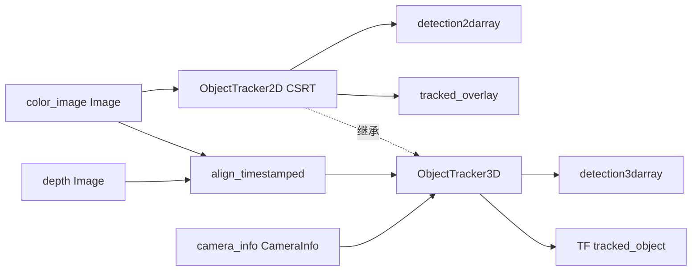
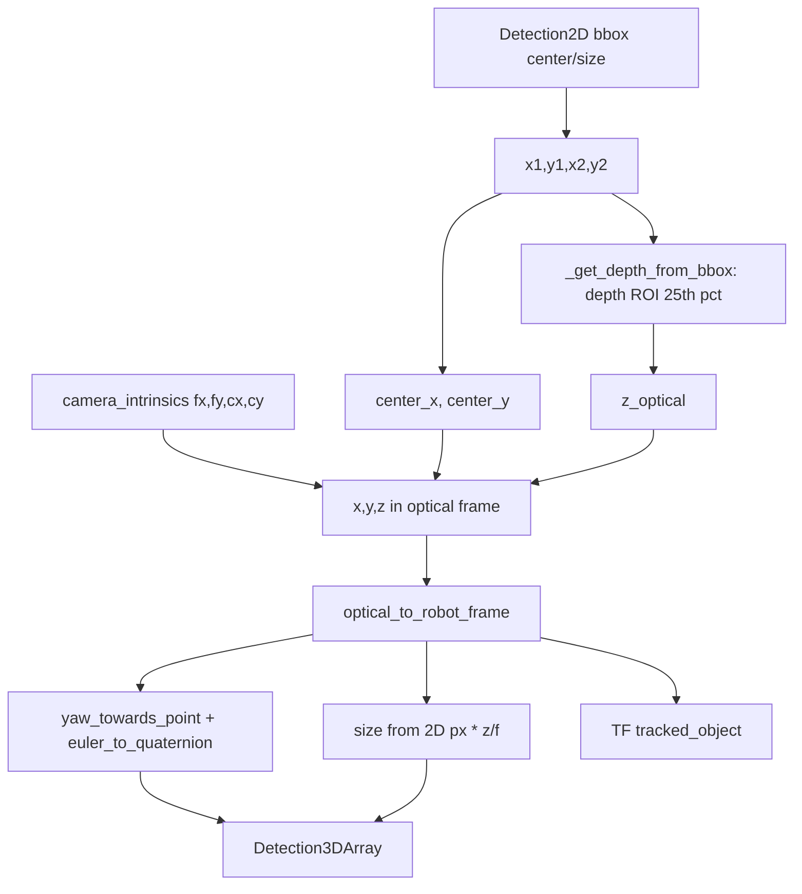

# ObjectTracker2D / ObjectTracker3D 技术说明

**日期：** 2026-05-22  
**源码：** `dimos/perception/object_tracker_2d.py`、`dimos/perception/object_tracker_3d.py`  
**说明：** 行号以当前 `main` 工作区为准；若 rebase 后漂移，以文件内符号为准。

---

## 1. 输入数据与 `In[]` / `Out[]` 流对比

### 共同点

- **都不订阅** `Detection2DArray` / `Detection3DArray` 作为输入；2D 框由 **OpenCV 视觉跟踪器**（优先 CSRT，见 `_create_opencv_tracker`）在模块内部跟踪产生，再 **发布** 检测结果。
- **都不使用** `PointCloud2`、激光、或外部检测器输出。
- 跟踪由 RPC `track(bbox: [x1,y1,x2,y2])` 启动，后台线程 `_tracking_loop`（约 **5 Hz**，`tracking_rate = 5.0`）调用 `_process_tracking`。

### ObjectTracker2D（纯 2D）

| 方向 | 流名 | 类型 | 作用 |
|------|------|------|------|
| **In** | `color_image` | `dimos.msgs.sensor_msgs.Image.Image` | 唯一输入：RGB，`frame_msg.data` → `numpy` |
| **Out** | `detection2darray` | `Detection2DArray` | 跟踪得到的 2D 检测 |
| **Out** | `tracked_overlay` | `Image` (RGB) | 画绿框的可视化 |

**订阅（`start()`，约 134–141 行）：**

```134:141:dimos/perception/object_tracker_2d.py
        def on_frame(frame_msg: Image) -> None:
            arrival_time = time.perf_counter()
            with self._frame_lock:
                self._latest_rgb_frame = frame_msg.data
                self._frame_arrival_time = arrival_time

        unsub = self.color_image.subscribe(on_frame)
```

- 仅 `color_image.subscribe`。
- 无 depth、`CameraInfo`、TF 订阅。

---

### ObjectTracker3D（继承 2D，增加深度与内参）

| 方向 | 流名 | 类型 | 作用 |
|------|------|------|------|
| **In**（继承） | `color_image` | `Image` | RGB（与 2D 相同） |
| **In**（新增） | `depth` | `Image` | 深度图；`DEPTH16` 时 **mm→m**（÷1000） |
| **In**（新增） | `camera_info` | `dimos_lcm.sensor_msgs.CameraInfo` | 从 `K` 取 `[fx, fy, cx, cy]` |
| **Out**（继承） | `detection2darray`, `tracked_overlay` | 同 2D | 父类 `_process_tracking` 仍发布 |
| **Out**（新增） | `detection3darray` | `Detection3DArray` | 由 2D + 深度推算 |

**订阅（`start()`，约 78–115 行）：**

1. **`super().start()`** → 父类仍对 `color_image` 单独 `subscribe`（与下面对齐订阅 **并存**）。
2. **`align_timestamped(color_image, depth)`** → 时间对齐后同时更新 RGB 与深度：

```82:102:dimos/perception/object_tracker_3d.py
        def on_aligned_frames(frames_tuple) -> None:  # type: ignore[no-untyped-def]
            rgb_msg, depth_msg = frames_tuple
            with self._frame_lock:
                self._latest_rgb_frame = rgb_msg.data

                depth_data = depth_msg.data
                # Convert from millimeters to meters if depth is DEPTH16 format
                if depth_msg.format == ImageFormat.DEPTH16:
                    depth_data = depth_data.astype(np.float32) / 1000.0
                self._latest_depth_frame = depth_data

        # Create aligned observable for RGB and depth
        aligned_frames = align_timestamped(
            self.color_image.observable(),
            self.depth.observable(),
            buffer_size=2.0,  # 2 second buffer
            match_tolerance=0.5,  # 500ms tolerance
        )
```

3. **`camera_info.subscribe(on_camera_info)`** → `camera_intrinsics = [K[0], K[4], K[2], K[5]]`（fx, fy, cx, cy）。

**对齐语义**（`dimos/types/timestamped.py` 中 `align_timestamped`）：主路 `color_image`，辅路 `depth` 在 **500 ms** 容差内取最近帧，缓冲 **2 s**。

---

### 差异小结

| 项目 | 2D | 3D |
|------|----|----|
| RGB | `color_image` 直接订阅 | 父类直接订阅 + 与 depth 对齐订阅 |
| 深度 | 无 | `depth: In[Image]`，对齐 RGB |
| 相机内参 | 无 | `camera_info: In[CameraInfo]` |
| 点云 | 无 | 无 |
| 3D 输出 / TF | 无 | `detection3darray` + `TF.publish("tracked_object")` |

同逻辑的完整版（含 ORB Re-ID）在 `dimos/perception/object_tracker.py` 的 `ObjectTracking`；`object_tracker_3d.py` 是从该逻辑拆出的简化子类。

**Blueprint 示例：** `unitree_go2_spatial` 使用 `ObjectTracker2D`（`frame_id="camera_link"`），并将 `BBoxNavigationModule.detection2d` 重映射到 `detection2darray`。

---

### 数据流（ASCII）

```
[相机/蓝图上游]
     |
     +-- color_image (RGB Image) ----+
     |                                |
     |                    ObjectTracker2D: subscribe -> CSRT -> Detection2DArray
     |                                |              \-> tracked_overlay
     |
     +-- depth (Image, 可选 DEPTH16) --+-- align_timestamped --+
     |                                |                        |
     +-- camera_info (CameraInfo K) --+---- ObjectTracker3D --+-> Detection3DArray
                                      |                        +-> TF tracked_object
                                      +-> (继承 2D 输出)
```



---

## 2. `_create_detection3d_from_2d` 原理（约 168–252 行）

**触发**：子类重写 `_process_tracking`（123–166 行）：先 `super()._process_tracking()` 得到 `_latest_detection2d`，再在 **有 2D 检测 + 深度 + 内参** 时调用 `_create_detection3d_from_2d`。

**未使用**：点云裁剪、多角点反投影、查询 TF 树；只有 **深度图 ROI 统计 + bbox 中心针孔反投影**。

### 步骤拆解

| 步骤 | 代码位置 | 做什么 |
|------|----------|--------|
| 1. 取 2D 框 | 173–185 | 从 `Detection2D` 的 center/size 算 `x1,y1,x2,y2` |
| 2. 深度 | 188, 254–285 | `_get_depth_from_bbox`：裁 ROI → 有效深度 → **25% 分位数**（偏近处，抗噪） |
| 3. 光学系 3D 点 | 193–203 | 针孔：`z=depth`，`x=(cx_px-cx)*z/fx`，`y=(cy_px-cy)*z/fy`；姿态先单位四元数 |
| 4. 机器人系位置 | 206 | `optical_to_robot_frame`（光学 Z 前 → 机器人 X 前等） |
| 5. 朝向 | 208–211 | `yaw_towards_point(robot_pose.position)` → `euler_to_quaternion`（仅 yaw） |
| 6. 3D 尺寸 | 214–216 | `size_x = width*z/fx`，`size_y = height*z/fy`，`size_z = 0.1` 固定 |
| 7. 消息 + TF | 218–250 | 填 `Detection3D` / `Detection3DArray`，`TF.publish` child=`tracked_object` |

### 核心公式（168–216 行）

```168:216:dimos/perception/object_tracker_3d.py
    def _create_detection3d_from_2d(self, detection2d: Detection2DArray) -> Detection3DArray | None:
        ...
        depth_value = self._get_depth_from_bbox([x1, y1, x2, y2], self._latest_depth_frame)
        ...
        z_optical = depth_value
        x_optical = (center_x - cx) * z_optical / fx
        y_optical = (center_y - cy) * z_optical / fy
        ...
        robot_pose = optical_to_robot_frame(optical_pose)
        yaw = yaw_towards_point(robot_pose.position)
        ...
        size_x = width * z_optical / fx
        size_y = height * z_optical / fy
        size_z = 0.1  # Default depth size
```

### 被调用的辅助函数

**`_get_depth_from_bbox`（254–285，本文件）**

- 裁剪 `depth_frame[y1:y2, x1:x2]`（**不是** PointCloud2）。
- `valid_depths = finite & > 0`。
- `np.percentile(valid_depths, 25)` → 代表深度 `z`。

**`optical_to_robot_frame`**（`dimos/utils/transform_utils.py` 约 114–163 行）

- 位置：`robot_x = z_opt`, `robot_y = -x_opt`, `robot_z = -y_opt`。
- 旋转：固定 3×3 轴变换矩阵作用在四元数/旋转矩阵上。

**`yaw_towards_point`**（`transform_utils.py` 约 208–225 行）

- 默认朝向原点：`atan2(y, x)`，表示物体在机器人平面内“面向相机/原点”的 yaw。

**`euler_to_quaternion`**（`transform_utils.py` 约 293–307 行）

- `(roll,pitch,yaw)` → 四元数，此处仅 yaw 非零。

**`align_timestamped`**（仅 `start` 用，保证 `_latest_depth_frame` 与 RGB 时间接近）

**`TF.publish`**（242–250 行）

- 发布 `frame_id` → `tracked_object` 的 `Transform`（平移+旋转），**不是**从 TF 查外参做 3D 提升。

---

### 2D→3D 流水线（Mermaid）



---

## 3. 实现上需注意的点

1. **无点云、无完整 bbox 反投影**：深度是 ROI 标量；3D 位置只用 **框中心** 像素 + 该深度；物理宽高由 2D 像素尺寸按针孔缩放，**厚度 `size_z` 写死 0.1 m**。
2. **3D 依赖 2D 线程产物**：不是消费外部 `Detection2DArray`，而是本模块 CSRT 输出再升格。
3. **`_draw_reid_overlay`（287–312 行）** 引用 `last_good_matches` 等，但 `ObjectTracker2D` **未定义** 这些属性（完整 Re-ID 在 `object_tracker.py` 的 `ObjectTracking`）。当前 3D 里这段在纯 2D/3D 拆分版上**可能无法运行**，除非另有 mixin。
4. 与 legacy **`ObjectTracking`** 相比：3D 升格逻辑与 `object_tracker.py` 中对应段落 **基本一致**；差别主要是 2D 侧无 ORB、跟踪频率 5 Hz vs 30 Hz。
5. **`ObjectTracker3D.start()` 双重 RGB 路径**：父类 `color_image.subscribe` 与 `align_timestamped` 都会写 `_latest_rgb_frame`；深度仅在对齐回调中更新，故 3D 推算应依赖对齐后的 `_latest_depth_frame`。

---

## 4. 相关文件索引

| 文件 | 说明 |
|------|------|
| `dimos/perception/object_tracker_2d.py` | 2D 模块与 CSRT 循环 |
| `dimos/perception/object_tracker_3d.py` | 3D 继承与 `_create_detection3d_from_2d` |
| `dimos/perception/object_tracker.py` | 含 Re-ID 的 legacy 一体实现 |
| `dimos/utils/transform_utils.py` | `optical_to_robot_frame`、`yaw_towards_point` 等 |
| `dimos/types/timestamped.py` | `align_timestamped` |
| `dimos/robot/unitree/go2/blueprints/smart/unitree_go2_spatial.py` | 使用 `ObjectTracker2D` 的 spatial 蓝图 |
