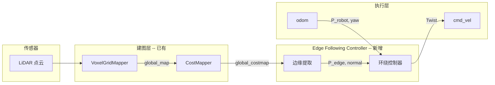

# 绕物品边缘旋转 (Orbit Object Edge) 功能开发文档

## 1. 目标效果

基于 LiDAR costmap 的边缘跟随能力，实现以下场景：

| 场景 | 描述 | 示例指令 |
|------|------|---------|
| **围绕物品转一圈** | 机器人沿物品轮廓 360 度环绕，保持固定距离，用于全角度巡检、拍摄 | "围绕这把椅子转一圈" |
| **绕过某物品** | 机器人沿物品边缘走半圈或弧线，从一侧绕到另一侧，用于路径被阻挡时的主动绕行 | "从左边绕过这个箱子" |
| **物体轮廓探索** | 机器人贴着未知物体边缘慢速行走，边走边建图，获取完整轮廓 | "沿着这面墙走一遍" |
| **环绕拍摄** | 面向目标物体做环绕运动，摄像头始终朝向物体，采集多视角图像 | "绕这个展品拍一组照片" |
| **定点巡逻** | 围绕关键设备/区域做周期性环绕巡视 | "每小时绕配电柜巡检一次" |

以上场景共享同一套边缘跟随控制器，通过参数差异（圈数、方向、是否面向目标）覆盖不同需求。

## 2. 功能概述

机器人沿障碍物/物品的轮廓边缘做环绕运动，保持固定距离。基于 LiDAR costmap 的几何边缘跟随，不依赖视觉检测模型。

## 3. 现状分析

### 3.1 可复用的基础设施

| 能力 | 模块 | 说明 |
|------|------|------|
| 全局代价地图 | `CostMapper` → `OccupancyGrid` | LiDAR 点云 → 体素累积 → 占用栅格，分辨率 0.05m |
| 体素地图 | `VoxelGridMapper` | 带 `carve_columns` 的 Open3D 体素累积，动态更新 |
| 里程计 | `GO2Connection.odom` | 持续发布 PoseStamped |
| 全向移动 | `cmd_vel` (Twist) | `linear.x`(前后) + `linear.y`(横移) + `angular.z`(旋转) |
| 导航蓝图已有 | `unitree-go2` | 已包含 VoxelGridMapper + CostMapper + 导航链路 |

### 3.2 核心优势

- **不需要 YOLO/VLM 等视觉检测** -- 纯几何方案
- **自动适应任意形状** -- 圆形、方形、不规则物体都能沿边缘走
- **LiDAR 360 度覆盖** -- 不存在目标离开相机视野的问题
- **数据源零成本** -- `global_costmap` 在导航蓝图中已在运行

### 3.3 缺失的部分

1. **Edge Following Controller** -- 沿占用边缘保距行走的控制器
2. **边缘提取** -- 从 costmap 中提取最近占用区域的边缘轮廓
3. **环绕完成判定** -- 判断是否绕了一整圈
4. **Skill 封装** -- 供 Agent 调用的 `orbit_object` 技能

## 4. 系统设计

### 4.1 数据流



### 4.2 核心算法: 边缘跟随 (Edge Following)

采用 **wall following** 的经典思路，基于 costmap 实现：

```
输入:
  costmap       -- OccupancyGrid (来自 CostMapper)
  P_robot       -- 机器人当前位置 (x, y)
  yaw           -- 机器人当前朝向
  D             -- 期望保持距离 (m)
  direction     -- 绕行方向: "cw" (顺时针/右手法则) 或 "ccw" (逆时针/左手法则)
  forward_speed -- 沿边缘前进速度 (m/s)

每个控制周期 (10 Hz):

  Step 1: 边缘提取
    - 以 P_robot 为中心, 取 costmap 中半径 (D + margin) 内的格子
    - 找到所有 cost >= OCCUPIED (100) 的格子
    - 取距机器人最近的占用格子 P_nearest
    - 计算 P_nearest 处的边缘法线 N (指向自由空间方向)

  Step 2: 距离控制 (径向)
    - d = |P_robot - P_nearest|         // 当前距离
    - v_radial = Kp * (D - d)           // 偏近则远离, 偏远则靠近

  Step 3: 切向运动 (沿边缘前进)
    - T = rotate(N, 90°)                // 切线方向 (法线旋转 90°)
    - if direction == "cw": T = -T      // 顺时针取反向切线
    - v_tangential = forward_speed      // 沿切线匀速前进

  Step 4: 合成世界系速度
    - V_world = v_radial * N + v_tangential * T

  Step 5: 转换到机器人体坐标系
    - vx_body =  cos(yaw)*V_world.x + sin(yaw)*V_world.y
    - vy_body = -sin(yaw)*V_world.x + cos(yaw)*V_world.y

  Step 6: 朝向控制 (始终面向物体)
    - theta = atan2(P_nearest.y - P_robot.y, P_nearest.x - P_robot.x)
    - angular_z = Kp_yaw * angle_diff(theta, yaw)

  Step 7: 发布
    - Twist(linear.x=vx_body, linear.y=vy_body, angular.z=angular_z)
```

### 4.3 边缘提取细节

从 `OccupancyGrid` 中提取边缘的具体方法：

```
1. 取机器人周围的 costmap 窗口 (如 3m x 3m)
2. 二值化: occupied = (cost >= 100)
3. 找到所有占用格到机器人的距离, 取最近的 K 个格子
4. 对这 K 个格子做 PCA 或最小二乘拟合局部边缘线段
5. 法线 N = 垂直于边缘线段, 指向机器人侧 (自由空间)
6. P_edge = 最近占用格的世界坐标
```

也可以更简单地用 **Sobel 边缘检测** 直接在栅格上算梯度方向作为法线。

### 4.4 环绕完成判定

通过累积角度变化判断是否绕了一整圈：

```
初始化:
  start_angle = atan2(P_obj_center.y - P_robot.y, P_obj_center.x - P_robot.x)
  accumulated_angle = 0
  last_angle = start_angle

每个周期:
  current_angle = atan2(P_obj_center.y - P_robot.y, P_obj_center.x - P_robot.x)
  delta = angle_diff(current_angle, last_angle)
  accumulated_angle += delta
  last_angle = current_angle

  if |accumulated_angle| >= 2*pi*laps:
    完成
```

其中 `P_obj_center` 可以用初始时刻机器人前方最近占用区域的质心来估算。

### 4.5 关键参数

| 参数 | 建议默认值 | 说明 |
|------|-----------|------|
| `distance` | 0.8 m | 与物体边缘的保持距离 |
| `forward_speed` | 0.3 m/s | 沿边缘前进速度 |
| `kp_distance` | 0.8 | 距离保持 P 系数 |
| `kp_yaw` | 0.5 | 朝向 P 系数 |
| `direction` | "ccw" | 绕行方向, ccw=逆时针/左手法则 |
| `laps` | 1.0 | 绕行圈数 |
| `face_target` | True | 是否始终面向物体 |
| `search_radius` | 3.0 m | costmap 边缘搜索半径 |
| `control_hz` | 10 | 控制频率 |

### 4.6 停止条件

- 累积角度达到 `2*pi*laps`（完成指定圈数）
- Agent 调用 `stop_orbit()`
- 距离偏差过大（`d > 2*distance` 或 `d < 0.2 m`）-- 防碰撞/丢边
- 搜索半径内找不到占用格子（物体丢失）

## 5. 目标指定机制

纯靠"最近障碍物"在复杂环境中会有歧义（周围有墙、椅子、桌子）。支持三种方式指定绕行目标，按优先级递减：

### 5.1 方式一: 指定世界坐标 (精确)

Agent 先通过感知能力获取目标世界坐标，再传给 orbit skill：

```
Agent 执行流程:
  1. observe()                            → 拍照
  2. VLM: "图中椅子的位置"                  → Detection3D 得到世界坐标 (3.2, 1.5)
  3. orbit_object(x=3.2, y=1.5, ...)      → 搜索该坐标附近的占用边缘来绕
```

控制器在 `(x, y)` 周围 `search_radius` 范围内搜索占用边缘，忽略远处的障碍物。坐标来源可以是：
- `observe()` + VLM + Detection3D
- `SpatialMemory` 查询 ("上次看到椅子的位置")
- Agent 对话中用户直接给出的位置

### 5.2 方式二: 指定方向 (简单)

通过 `bearing` 参数指定目标相对于机器人的方向，只在该扇区搜索：

```
"绕左边那个东西转" → orbit_object(bearing=90)
"绕右边那个东西转" → orbit_object(bearing=-90)
"绕前方物体转"     → orbit_object(bearing=0)
```

控制器在 `bearing ± 45°` 的扇区内搜索最近占用边缘。

### 5.3 方式三: 先导航再绕行 (最简单)

不传任何定位参数，利用物理接近隐式指定：

```
Agent 执行流程:
  1. "走到椅子旁边" → navigate_with_text("chair")   // 已有 skill
  2. "绕它转一圈"   → orbit_object()                 // 最近障碍即目标
```

适合目标周围没有其他障碍物紧挨的简单场景。

### 5.4 优先级逻辑

```
if x, y 已指定:
    搜索 (x,y) 附近 search_radius 内的占用边缘
elif bearing 已指定:
    搜索 bearing ± 45° 扇区内最近占用边缘
else:
    搜索机器人周围最近占用边缘
```

## 6. Skill 接口设计

新建 `dimos/agents/skills/orbit_object.py`：

```python skip
class OrbitObjectSkillContainer(Module):
    odom: In[PoseStamped]
    global_costmap: In[OccupancyGrid]
    cmd_vel: Out[Twist]

    @skill
    def orbit_object(
        self,
        x: float | None = None,
        y: float | None = None,
        bearing: float | None = None,
        distance: float = 0.8,
        laps: float = 1.0,
        speed: float = 0.3,
        clockwise: bool = False,
    ) -> str:
        """Orbit around an object edge detected by LiDAR.

        Target selection (by priority):
        1. If x and y are given, orbit the obstacle nearest to that coordinate.
        2. If bearing is given, orbit the nearest obstacle in that direction.
        3. Otherwise, orbit the nearest obstacle to the robot.

        Args:
            x: Target world X coordinate in meters. Use with y for precise targeting.
            y: Target world Y coordinate in meters. Use with x for precise targeting.
            bearing: Direction to search for target relative to robot front, in degrees.
                     0 = front, 90 = left (CCW-positive), -90 = right.
            distance: Distance to maintain from the object edge in meters.
            laps: Number of laps to complete around the object.
            speed: Forward speed along the edge in m/s.
            clockwise: True for clockwise, False for counter-clockwise.
        """

    @skill
    def stop_orbit(self) -> str:
        """Stop the current orbit operation."""
```

## 7. 蓝图集成

```python skip
unitree_go2_agentic = autoconnect(
    unitree_go2_spatial,
    McpServer.blueprint(),
    McpClient.blueprint(),
    _common_agentic,
    OrbitObjectSkillContainer.blueprint(),  # 新增
)
```

`global_costmap` 和 `odom` 会通过 `autoconnect` 的 (name, type) 匹配自动连接到已有的 CostMapper 和 GO2Connection 输出。

## 8. 开发步骤

| 阶段 | 内容 | 预估工时 |
|------|------|---------|
| **P0: 边缘提取** | 从 OccupancyGrid 提取最近占用边缘 + 法线方向, 单元测试 | 1 天 |
| **P1: Edge Following Controller** | 径向保距 + 切向前进 + 朝向控制, mock 测试 | 1 天 |
| **P2: 圈数判定** | 累积角度计算 + 停止逻辑 | 0.5 天 |
| **P3: Skill 封装** | Module + @skill + 蓝图集成 | 0.5 天 |
| **P4: 实机调参** | Go2 真机测试, 调整 Kp/速度/距离 | 1 天 |

总计约 **4 天**。

## 9. 测试计划

### 9.1 单元测试

测试文件: `dimos/agents/skills/test_orbit_object.py`，无特殊标记，默认 CI 运行。

- **边缘提取**: 用 numpy 构造简单 costmap (方形/圆形占用), 验证返回正确的最近边缘点和法线
- **控制器输出**: 各种相对位置输出正确的 Twist 方向
  - 偏近 → 径向远离
  - 偏远 → 径向靠近
  - 在目标距离上 → 纯切向前进
  - 顺/逆时针切向方向正确
  - 体坐标系转换正确
- **圈数判定**: 模拟角度序列, 验证 1 圈/0.5 圈/2 圈的判定, 包括角度跨越 ±π 边界

```bash
uv run pytest dimos/agents/skills/test_orbit_object.py -v
```

### 9.2 集成测试

标记 `@pytest.mark.slow`，用 Stub Module 替代真实硬件依赖。

- **RPC 链路**: Stub odom + Stub costmap → `orbit_object()` RPC → 验证 `cmd_vel` 有输出
- **蓝图连线**: `autoconnect()` 验证 `global_costmap`/`odom`/`cmd_vel` 正确匹配
- **Agent 工具选择**: `agent_setup` + MockModel，验证 LLM 能正确选择 `orbit_object` 工具

```bash
uv run pytest -m slow dimos/agents/skills/test_orbit_object.py -v
```

### 9.3 真机测试

#### 前置条件

| 条件 | 说明 |
|------|------|
| Go2 机器人已开机联网 | 确认 WiFi 连接，默认 IP `192.168.123.161` |
| 测试场地 | 空旷区域，目标物体周围至少 1.5m 无其他障碍物 |
| 目标物体 | 选择高度 > 15cm 的物体（椅子/箱子/垃圾桶），确保 LiDAR 能扫到 |
| API Key | 如需 Agent 交互，确保 `OPENAI_API_KEY` 已配置 |

#### Step 1: 启动蓝图

```bash
# 发现机器人（可选，确认 IP）
dimos go2tool discover --lan

# 启动 agentic 蓝图（带 Rerun 可视化，后台运行）
dimos --viewer rerun run unitree-go2-agentic --robot-ip 192.168.123.161 --daemon

# 确认启动成功
dimos status
dimos log -n 20
```

> **注意**: 绕行时 Unitree 内置避障可能干扰 `cmd_vel`。如遇控制异常，尝试关闭内置避障：
> `dimos --no-obstacle-avoidance --no-free-avoid run unitree-go2-agentic --robot-ip 192.168.123.161 --daemon`

#### Step 2: 确认数据流正常

```bash
# 确认 costmap 有数据（频率应 ~5-10 Hz）
dimos lcmspy
# 或监听 topic
dimos topic echo /global_costmap

# 确认 orbit_object skill 已注册
dimos mcp list-tools | grep orbit
```

在 Rerun 3D 视图中检查：
- `world/global_costmap` 图层可见，障碍物区域有颜色
- `world/global_map` 点云正常
- 机器人位姿 (`tf/base_link`) 更新正常

#### Step 3: 将机器人移动到目标物体附近

```bash
# 用 Agent 导航到目标附近（约 1-2m）
dimos agent-send "走到椅子旁边"

# 或手动控制移动
dimos mcp call relative_move --arg forward=1.0 --arg left=0 --arg degrees=0
```

在 Rerun 中确认：机器人位于目标物体 1-2m 范围内，costmap 中目标物体的占用栅格清晰可见。

#### Step 4: 执行绕行测试

按优先级依次测试三种目标指定方式：

**测试 A: 最近障碍物（最简单）**

```bash
# MCP 直接调用 -- 绕最近障碍物逆时针一圈
dimos mcp call orbit_object --arg distance=0.8 --arg laps=1.0 --arg speed=0.3 --arg clockwise=false

# 或通过 Agent 自然语言
dimos agent-send "围绕最近的物体转一圈"
```

**测试 B: 指定方向**

```bash
# 绕左侧障碍物 (bearing=90, CCW-positive)
dimos mcp call orbit_object --arg bearing=90 --arg distance=0.8 --arg laps=1.0

# 绕右侧障碍物 (bearing=-90)
dimos mcp call orbit_object --arg bearing=-90 --arg distance=0.8 --arg laps=1.0

# 通过 Agent
dimos agent-send "绕右边那个东西转一圈"
```

**测试 C: 指定坐标（精确）**

```bash
# 先获取目标坐标（从 Rerun 中读取，或用 observe → VLM）
dimos mcp call orbit_object --json-args '{"x": 3.2, "y": 1.5, "distance": 0.8, "laps": 1.0}'
```

**测试 D: 中途停止**

```bash
# 启动绕行
dimos mcp call orbit_object --arg laps=3.0
# 等几秒后中途停止
dimos mcp call stop_orbit
```

#### Step 5: 观察与验证

在测试过程中，同时开启日志跟踪：

```bash
dimos log -f
```

**Rerun 可视化检查项：**

| 检查项 | 在 Rerun 中观察 | 通过标准 |
|--------|-----------------|---------|
| 轨迹贴合 | 3D 视图中机器人轨迹（`tf/base_link`）与 costmap 边缘平行 | 无明显偏离或穿越障碍 |
| 距离保持 | 机器人与障碍物 costmap 边缘的间距 | 目标距离 ±15cm |
| 朝向控制 | 机器人朝向（箭头）始终指向物体 | 无大幅震荡或背对物体 |
| 完成停止 | 绕完一圈后机器人静止 | `cmd_vel` 归零 |

**日志检查项：**

```bash
# 过滤 orbit 相关日志
dimos log --json | grep -i orbit

# 检查控制器输出频率（应 ~10 Hz）
dimos log --json | grep "edge_follow" | head -20
```

#### Step 6: 参数调优

根据观察结果调整参数，重复 Step 4-5：

| 现象 | 调整方向 |
|------|---------|
| 距离过近/碰到物体 | 增大 `distance` (0.8 → 1.0) 或增大 `kp_distance` |
| 距离过远/飘开 | 减小 `distance` 或增大 `kp_distance` |
| 运动不平稳/震荡 | 减小 `kp_distance` 和 `kp_yaw`，降低 `speed` |
| 绕行太慢 | 增大 `speed` (0.3 → 0.4)，但不超过 0.5 |
| 朝向来回摆动 | 减小 `kp_yaw` (0.5 → 0.3)，或设 `face_target=false` |
| 在凹口处卡住 | 增大 `search_radius` 或降低 `speed` 给控制器更多反应时间 |
| 横移无力 | 设 `face_target=false`，改用前进方向沿边缘 |

#### Step 7: 完整场景验证

完成基础调参后，执行完整场景测试矩阵：

| 场景 | 命令 | 验证重点 |
|------|------|---------|
| 圆形物体(垃圾桶) | `orbit_object(distance=0.8, laps=1)` | 轨迹接近圆形 |
| 方形物体(箱子) | `orbit_object(distance=0.8, laps=1)` | 拐角处平滑过渡 |
| 不规则物体(椅子) | `orbit_object(distance=1.0, laps=1)` | 自适应复杂轮廓 |
| 顺时针 | `orbit_object(clockwise=true)` | 方向正确 |
| 半圈 | `orbit_object(laps=0.5)` | 半圈后准确停止 |
| 两圈 | `orbit_object(laps=2.0)` | 连续两圈无累积偏移 |
| 自然语言触发 | `agent-send "围绕这把椅子转一圈"` | Agent 正确理解并调用 |
| 复杂环境 | 目标附近有墙壁 | 不误跳到墙壁边缘 |
| 中途停止 | `stop_orbit` | 1s 内停止，无惯性滑行 |

#### 停止测试

```bash
dimos stop
```

### 9.4 真机测试通过标准

| 指标 | 最低标准 | 理想标准 |
|------|---------|---------|
| 距离保持 | ±20cm | ±10cm |
| 一圈角度误差 | ±30° | ±15° |
| 轨迹连续性 | 无突变/跳跃 | 平滑贴合 |
| 停止响应 | < 2s | < 1s |
| 成功率(简单物体) | 80% (8/10) | 95%+ |
| 成功率(复杂环境) | 60% | 80%+ |

## 10. 已知风险与局限

1. **凹形物体** -- 凹陷区域可能导致控制器在凹口处震荡, 需要平滑法线或增加前瞻
2. **多物体靠近** -- 如果附近有多个障碍物, 边缘可能跳到其他物体上; 可通过限制搜索扇区缓解
3. **costmap 更新延迟** -- 体素地图的 `carve_columns` 是逐帧覆盖, 绕行中远侧的点云可能尚未更新
4. **Go2 横移能力有限** -- 面向物体时主要靠横移前进, 速度受限; 可改为不面向目标, 用前进代替
5. **Unitree 内置避障干扰** -- `obstacle_avoidance` / `free_avoid` 开启时固件可能覆盖 cmd_vel, 绕行时建议关闭
