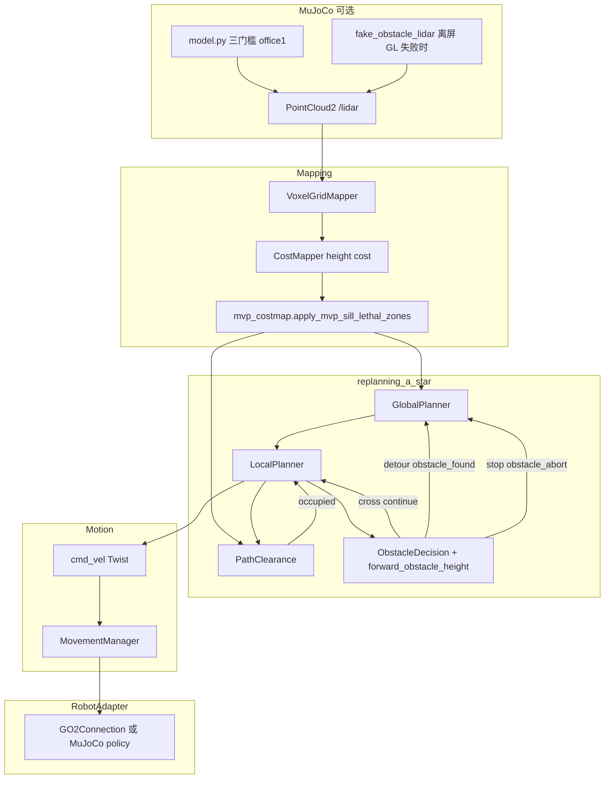

# 个人开发总结：导航遇障 MVP 与相关栈（约两周）

**周期**：2026-05-08 — 2026-05-22  
**当前分支**：`feat/avoidance_obj`（跟踪 `origin/feat/avoidance_obj`；大量改动尚未提交）  
**并行分支**：`feat/detection`（飞书 / 安保巡检配置；Agent 会话 `f5c0351c-e38e-4ebf-ab80-f0a347a704f4`）  
**上游合并**：近期 `main`/`dev` 侧可见 PR #59（sync upstream，topsun-bot/topsun_dimos）及 dimensionalOS 导航相关合并（如 #2095、#2100 等），与本 MVP 工作并行存在。  
**Agent 工作记录**（主要导航 MVP）：`fd858ea7-0636-4772-8c54-ed5b107ab133`

---

## 一、做了什么

### 1.1 导航遇障 MVP（核心）

| 主题 | 内容 | 状态 |
|------|------|------|
| 方案定稿 | 周会方案、PRD、源码分析合并为单一主文档 | 完成 |
| 实验包 | `dimos/experimental/navigation_obstacle_mvp/`：三态决策、高度推断、代价图 lethal、fake LiDAR、13+ 测试文件 | 完成（未提交） |
| 规划器挂钩（档 A） | `local_planner.py` / `global_planner.py`：`cross` / `detour` / `stop` 与 `obstacle_found` / `obstacle_abort` | 完成（未提交） |
| GlobalConfig | `obstacle_crossing_mvp`、`obstacle_crossing_mvp_height_cm`、`mujoco_navigation_test_obstacles`；CLI argv 规范化 | 完成（未提交） |
| MuJoCo 验证场景 | office1 简化 + 三门槛（5 / 20 / 58 cm）；间距、宽度、detour 绕槛 | 完成（多轮迭代） |
| 操作手册 | MVP README：跑法、FAQ、OpenGL/CUDA、性能调优 | 完成 |
| **真机短跑** | Go2 `--robot-ip` + MVP flag；主方案附录 A 真机归档表 | **2026-05-22 验证通过** |

**证据与关键路径**

- 真机短跑（2026-05-22）：Go2 真机短距 MVP 验证通过；可按需将 run-id 与 `~/.local/state/dimos/logs/<run-id>/main.jsonl` 路径补入主方案附录 A
- 主方案：`docs/development/ai_navigation_refactor_master_plan.md`（§12 MVP 实现状态）
- 操作手册：`dimos/experimental/navigation_obstacle_mvp/README.md`
- 一键 smoke：`scripts/demo-mvp.sh`
- 测试目录：`dimos/experimental/navigation_obstacle_mvp/tests/`（13 个文件）

### 1.2 仿真 / MuJoCo

| 主题 | 内容 | 状态 |
|------|------|------|
| 场景与障碍几何 | `model.py` 注入 `mvp_threshold_{low,medium,high}` | 完成 |
| 离屏 GL / viewer | `mujoco_process.py`、`display_env.py`、`viewer_probe.py`、`diagnose.py` | 完成 |
| Fake LiDAR | GL 失败时从 MVP geom 合成 `/lidar` | 完成 |
| 仿真默认 viewer | `apply_simulation_viewer_defaults()` → 默认 `rerun` native | 完成 |
| 性能调优 | `voxels.py`、`costmapper.py`、planner stuck 窗口、MVP creep 范围 | 完成 |
| NVIDIA 排障 | `scripts/fix-nvidia-driver.sh` | 完成 |
| CUDA 告警抑制 | `dimos/core/torch_cuda_warnings.py` | 完成（未跟踪） |

### 1.3 Agent / MCP / 安保（并行）

| 主题 | 内容 | 状态 |
|------|------|------|
| 无 API key 启动 | `SpeakSkill`、`McpClient` 降级；MuJoCo + MVP 可测导航 | 完成（未提交） |
| WebInput / Whisper | 无 HF 缓存时 STT 跳过 | 完成（未提交） |
| EdgeTAM | 无 CUDA 时 stub | 完成（未提交） |
| 安保 + 飞书设计 | `docs/development/security_patrol_feishu_design.md` | 完成（未提交） |
| 飞书实现与推送 | `feat/detection`：`feishu_webhook.py`、`security_module`、local.toml | **进行中**（verify 曾长时间 `uv sync`；全量 pytest 有 LCM 多播依赖） |

### 1.4 文档与 Git 事实

- CLI / 可视化：`docs/usage/cli.md`、`docs/usage/visualization.md` 已更新（未提交）
- Go2 平台：`docs/platforms/quadruped/go2/index.md` 小幅更新
- `scripts/verify.sh`：本地门禁（ruff + pytest）存在于 `feat/detection` 差异；导航 MVP 分支未单独合入
- **Git**：近两周 log 未见导航 MVP 独立 commit；当前分支 HEAD 与 `origin/feat/avoidance_obj` 一致为 `316737c5`（Merge PR #59）；`git status` 约 29 个已改文件 + 大量未跟踪（含整个 `navigation_obstacle_mvp/`）；`gh pr list` 未查到以 `feat/avoidance_obj` 或 `feat/detection` 为 head 的已开 PR → **待创建 PR（分支 feat/avoidance_obj）**

---

## 二、方法

### 2.1 总体策略（档 A）

遵循 `docs/development/ai_navigation_refactor_master_plan.md` 第 4.3 节：

1. **不重写**全局 A*，不改 `autoconnect` 全图。
2. `PathClearance.is_obstacle_ahead()` 为真且 `GlobalConfig.obstacle_crossing_mvp` 开启时，调用纯函数 `decide_obstacle_action()` 得三态。
3. 映射到现有信号：`cross` 继续局部跟踪；`detour` → `obstacle_found` → 全局 `_replan_path()`（含 MVP 绕槛 waypoint）；`stop` → `obstacle_abort` → `cancel_goal()`。
4. **默认关闭** MVP 开关，与改动前行为一致。

### 2.2 高度与感知（首期）

| 来源 | 方法 |
|------|------|
| MuJoCo office1 走廊 | `forward_obstacle_height.resolve_obstacle_height_cm()` 按位姿匹配 `MVP_SILLS`（优先于 CLI） |
| 走廊外 / 无仿真 | CLI `obstacle_crossing_mvp_height_cm`；`None` 时保守 `detour` |
| 代价图 | `mvp_costmap.apply_mvp_sill_lethal_zones()` 对中/高槛标 lethal，避免 A* 穿缝 |
| 无 OpenGL | `fake_obstacle_lidar` 从 geom 采样合成点云，维持 costmap → PathClearance 链路 |

### 2.3 仿真与可测性

- **角色化工作流**（文档 / Review 清单），非运行时多 Agent。
- **迭代式人工 + 单测**：MuJoCo 三门槛对照 cross / detour / stop；修复 CLI typo（`height-cm8`）、点击 goal 不动、中槛卡死、规划过慢等（见 Agent 会话子任务链）。
- **降级启动**：agentic 蓝图在无 GPU / 无 OpenAI / 无 Whisper 时仍可 deploy，便于只测导航。

### 2.4 安保 / 飞书（并行线）

- 单模块状态机（`SecurityModule`）：YOLO 识人 + 可选 EdgeTAM 跟随 + TTS + 飞书 Webhook。
- 配置经 `GlobalConfig` + `dimos.local.toml`；与 MVP **正交**（同一 `unitree-go2-agentic` 蓝图可叠加）。

---

## 三、数据流

### 3.1 导航遇障 MVP 主链路（仿真 / headless 可闭环）

**文字摘要**：点云（真实 LiDAR 或 fake）→ 体素/代价图（含 MVP lethal 区）→ 全局 A* + 局部 P 控制 → 路径走廊占用检测 → 高度解析 + 三态决策 → `nav_cmd_vel` / `cmd_vel` → Go2 或 MuJoCo。

### 3.2 人机交互目标流（界面测试）

证据：MVP README「界面设起点/终点」；日志关键字 `Got new goal` → `Found path` → `Publishing nav_cmd_vel`。

### 3.3 安保巡检（并行，非 MVP 决策链）

`color_image` → YOLO →（可选）EdgeTAM → `cmd_vel` / Navigator RPC；飞书异步线程。详见 `docs/development/security_patrol_feishu_design.md` §3。

---

## 四、交付物

### 4.1 已交付（工作区，多数未 commit）

| 交付物 | 路径 / 命令 | 状态 |
|--------|-------------|------|
| 唯一主方案 | `docs/development/ai_navigation_refactor_master_plan.md` | 完成 |
| MVP 实验包 + 测试 | `dimos/experimental/navigation_obstacle_mvp/` | 完成（未 commit） |
| 规划器改动 | `dimos/navigation/replanning_a_star/{local,global}_planner.py` 等 | 完成（未 commit） |
| GlobalConfig 开关 | `dimos/core/global_config.py` | 完成（未 commit） |
| MuJoCo 场景与进程 | `dimos/simulation/mujoco/{model,mujoco_process,display_env,viewer_probe,diagnose}.py` | 完成（未 commit） |
| 端到端 smoke | `bash scripts/demo-mvp.sh` | 完成 |
| 安保飞书设计 | `docs/development/security_patrol_feishu_design.md` | 完成（未 commit） |
| Agent 降级 | `speak_skill.py`、`mcp_client.py`、`web_human_input.py`、`edge_tam.py` | 完成（未 commit） |
| **真机 MVP 短跑** | Go2 + `--robot-ip` + `--obstacle-crossing-mvp` | **2026-05-22 通过** |

### 4.2 测试与日志证据

| 项 | 结果 | 状态 |
|----|------|------|
| Fast 单测（2026-05-22） | `uv run pytest dimos/experimental/navigation_obstacle_mvp/ -q` → **56 passed**，7 deselected（~1.35s） | 通过 |
| 文档记载（2026-05-21） | fast 21 passed；`-m mujoco` 5 passed | 见 MVP README |
| MuJoCo 标记测试 | `uv run pytest … -m mujoco -v` | 需 `--extra sim`、LFS、本机 GL/LCM；CI smoke 带 `skipif_in_ci` |
| 端到端 smoke | `bash scripts/demo-mvp.sh` | 脚本存在；需 daemon + LCM；文档生成时未自动跑通 |
| 人工仿真 | `dimos --simulation mujoco --obstacle-crossing-mvp … run unitree-go2-agentic` | 多轮修复记录；无归档视频 |
| **真机短跑（Go2）** | `dimos --obstacle-crossing-mvp … run unitree-go2-agentic --robot-ip <IP>` | **2026-05-22 验证通过** |
| 运行日志 | `~/.local/state/dimos/logs/<run-id>/main.jsonl`；`dimos log` | 模板见主方案附录 A |

### 4.3 未交付 / 待补

| 交付物 | 阻塞 / 下一步 | 状态 |
|--------|----------------|------|
| **GitHub PR（导航 MVP）** | 工作未 commit；分支 `feat/avoidance_obj` | **待创建 PR**：先 `git add`、ruff/pytest、`git push` |
| 真机附录 A / 录屏归档 | 真机短跑已于 2026-05-22 通过；run-id、日志路径、视频 URL 可补入主方案附录 A | 可选 |
| C++ `libnavigation_obstacle.so` | 二阶段；主方案 §10 ABI 仅文档 | 未开始 |
| `feat/detection` 合入 | `verify.sh` 全量 pytest 可能因 LCM `sudo ip link` 失败 | 进行中 |
| CI 全绿 | 自托管 CI 周期长；MVP smoke 在 CI 跳过 | 待 PR 后验证 |
| 录屏 / 视频 URL | 无仓库内链接 | 未完成 |

### 4.4 未完成项与建议下一步

| # | 项 | 阻塞点 | 建议下一步 |
|---|-----|--------|------------|
| 1 | 导航 MVP **提交并开 PR** | 改动均在 working tree / untracked | 在 `feat/avoidance_obj` 分批 commit；跑 `uv run pytest dimos/experimental/navigation_obstacle_mvp/ -q`；`gh pr create` 指向 `main` |
| 2 | 真机附录 A / 录屏（可选） | 真机已于 2026-05-22 通过 | 将 run-id、`main.jsonl` 路径与录屏 URL 写入主方案 §8 附录 A |
| 3 | 视频 / 日志归档 | 未链接到文档 | 每次跑记录 `dimos status` run-id + 日志路径 |
| 4 | `feat/detection` 推送 | verify 耗时 / LCM 多播权限 | 仅跑相关 pytest；或配置 lo multicast；再 push |
| 5 | C++ 动态库 | MVP 阶段产品范围外 | 冻结 Python ABI 后立项 native |
| 6 | `demo-mvp.sh` 常态化 | 需 LCM + 后台 dimos | 纳入 PR Test plan；CI 仍 skip 子进程 smoke |

---

## 五、一句话结论

约两周内完成了**档 A 导航遇障 MVP**（实验包、规划器挂钩、MuJoCo 三门槛、56 项 fast 单测、**2026-05-22 Go2 真机短跑通过**），并并行做了 **Agent/MCP 降级启动** 与 **安保飞书设计**；主要缺口是 **工作区尚未 commit / 未开 PR**、可选的真机日志/录屏归档，以及 `feat/detection` 飞书实现与 CI 验证仍进行中。

---

## 六、参考路径速查

| 类型 | 路径 |
|------|------|
| 主方案 | `docs/development/ai_navigation_refactor_master_plan.md` |
| MVP 操作 | `dimos/experimental/navigation_obstacle_mvp/README.md` |
| 安保设计 | `docs/development/security_patrol_feishu_design.md` |
| Smoke | `scripts/demo-mvp.sh` |
| Agent 会话（导航） | `fd858ea7-0636-4772-8c54-ed5b107ab133` |
| Agent 会话（detection） | `f5c0351c-e38e-4ebf-ab80-f0a347a704f4` |
| 上游 PR（sync） | PR #59，topsun-bot/topsun_dimos |
| 导航 MVP PR | **待创建 PR（分支 feat/avoidance_obj）** |

---

*本文档仅陈述 Agent 会话、git 状态、README 与可复现 pytest 结果；若与代码后续变更冲突，以仓库 HEAD 为准。*
