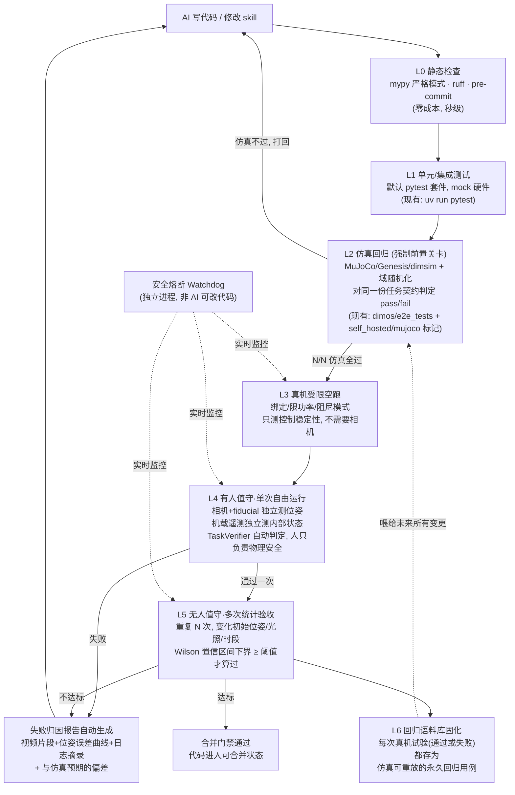

# 真机闭环验证架构：从"单相机人工目测"到"可统计、可审计、可安全停止"的自验证闭环

> 调查依据：仓库内现有代码（`dimos/perception/fiducial/`、`dimos/simulation/`、`dimos/e2e_tests/`、`ai_longrun_harness/`、`dimos/core/run_registry.py`、`.github/workflows/ci.yml`、`docs/development/testing.md`）。本文只提出基于这些既有能力可以落地的方案，不假设不存在的基础设施。

---

## 0. 问题重述

当前协作方式：

```
AI 写代码 → 人把代码部署到宇树机器狗 → 人观察 → 人用自然语言描述失败现象 → AI 猜测原因继续改
```

瓶颈不是"没有相机"，而是这个循环里**唯一的信息来源是人的主观描述**，且**唯一的验收标准是人的主观判断**。你提出"加一台独立相机自动判断动作是否完成"，方向是对的（把验收从人的主观判断变成可自动化的客观判断），但**只加一台相机做视觉判断，本质上只是把"人目测"换成"AI 目测"，没有解决三个更深的问题**：

1. **相机只能告诉你"失败了"，不能告诉你"为什么失败"** —— AI 拿到"没做到"三个字，跟拿到人说"它没走过去"，信息量几乎一样，下一轮还是在猜。
2. **单次判断在物理世界里统计上不可信** —— 真机有电量、地面摩擦、WiFi 延迟、电机温度漂移等随机因素，一次相机判"过"不代表这份代码稳定，一次判"不过"也不代表代码有 bug。2/100 这种低成功率本身也可能包含"代码没问题、但那次刚好没触发"的噪声。
3. **没有独立于 AI 循环之外的安全底线** —— 如果验收全靠"相机看了说重来"，那机器狗会在无人干预的情况下被反复摆到危险状态（跌倒、堵转、撞人）而没有硬性熔断。

下面给出的方案把"外部相机"降级为**闭环里的一个组件**，而不是整个闭环，并给出把 2/100 提升到 98/100 的具体机制（不是靠更聪明的相机判断，而是靠**大幅减少需要真机试验的次数、并让每次真机试验的信息密度变高**）。

---

## 1. 核心设计原则

1. **验收标准要在写代码之前就形式化，而不是事后靠人/相机"看着办"。** 每个 AI 要实现的动作，必须先有一份机器可读的"完成条件"（目标位姿、容差、超时、禁止的异常），相机和遥测都只是去检验这份契约，而不是临时用眼睛判断"看起来做到了没有"。
2. **能在仿真里发现的 bug，永远不该消耗一次真机试验。** 2/100 这个数字很大概率不是"仿真过了、真机不过"的 sim-to-real gap 问题为主，而是**根本没有把仿真当作强制前置关卡**——仓库里已经有 MuJoCo / Isaac / Genesis / dimsim 四套仿真引擎和 `dimos/e2e_tests/`，但目前 AI 每次改完代码大概率是直接部署到狗上试。真机应该是漏斗最窄的最后一环，不是第一环。
3. **外部观测者和机载遥测必须相互独立、双重交叉验证。** 只用外部相机，等于只信一个证人；只用机载遥测（里程计、IMU），等于让"嫌疑人自证清白"——机器人自己的定位模块本身也可能是 bug 来源。两者独立采集、事后比对，才能既判断"结果对不对"，又定位"是感知错了、控制错了、还是执行器出了问题"。
4. **单次通过/不通过不是验收标准，统计置信区间才是。** "98/100" 这个目标只有在有重复试验、有置信区间的前提下才有意义，否则很容易变成"随便挑一次好的视频合并"。
5. **安全熔断必须独立于 AI 能修改的代码之外。** 不能让"要不要停"这件事本身也由 AI 写的、可能有 bug 的代码来判断。

---

## 2. 整体架构：验证漏斗（Verification Funnel）



**这个架构和你原来"一台相机判断，不合格打回 AI"的方案的本质区别：**

| | 你的原方案 | 本方案 |
|---|---|---|
| 验收依据 | 相机的一次视觉判断 | 位姿契约（相机+fiducial 量化位姿）+ 遥测双重交叉验证 |
| 何时用到真机 | 每次改完代码就上机试 | 仅当仿真已经 N/N 通过后才排队上机（漏斗收窄） |
| 失败反馈 | "没做到"（相机的定性结论） | 结构化报告：位姿误差数值、遥测异常点、日志摘录、与仿真预期的偏差 |
| 通过标准 | 单次相机判"过" | 多次统计置信区间下界达标 |
| 安全 | 隐含在"失败就重来"里，没有硬约束 | 独立 Watchdog 进程，与 AI 代码解耦的硬性熔断条件 |
| 复用现有代码 | 无 | 复用 `MarkerTfModule`、`dimsim`/`mujoco`、结构化 jsonl 日志、`self_hosted` CI 标记体系 |

---

## 3. 各层详细设计

### L2 仿真回归层（强制前置关卡）—— 这是提高成功率最大的杠杆

仓库里 `dimos/simulation/` 已经有 MuJoCo / Isaac / Genesis / dimsim 四套引擎，`dimos/e2e_tests/` 已经有基于 `DimSimClient`（`dimos/e2e_tests/dim_sim_client.py`）的走位/重规划/跟随测试（`test_dimsim_walk_forward.py`、`test_dimsim_path_replaning.py`、`test_patrol_and_follow.py` 等），`docs/development/testing.md` 里也已经定义了 `self_hosted` / `mujoco` 两个 pytest 标记。**这些东西存在，但目前不是"AI 上机前必须通过"的硬性关卡**，只是"CI 会跑但不阻止上机"。

建议：

1. 给每个要上机验证的 skill/blueprint 增加一份**任务契约**（新文件，例如 `dimos/verification/task_contract.py`），内容是：目标位姿/状态（容差范围）、允许的最大耗时、禁止出现的异常类型。这份契约既是仿真测试的断言依据，也是后面真机 TaskVerifier 的断言依据——**同一份契约，两处复用**，这样仿真通过和真机通过判的是同一件事，不会出现"仿真的验收标准"和"真机的验收标准"对不上的情况。
2. 在仿真里跑该契约 N 次（建议 N≥10），并加域随机化（摩擦系数、电机响应延迟抖动、传感器噪声）——利用现有 `mujoco`/`dimsim` 引擎参数化即可，不需要新引擎。
3. 只有 N/N（或达到某个比例）通过，才允许该 commit 进入"排队上机"状态。这一步直接把"每次改代码都要真人守着狗试一次"变成"大多数迭代在仿真里以机器速度完成，真机只留给已经在仿真里稳定的候选"——**这是 2/100 → 98/100 里最大的一块提升，因为它减少的是需要真机验证的"坏代码"的比例，而不是让相机更聪明。**

### L3 真机受限空跑（新增，成本低、能提前挡掉一大类 sim-to-real gap）

在完全自由运行之前，增加一个"绑定/限功率/阻尼模式"的中间档位：机器人被吊挂或限制活动范围，只验证控制指令是否稳定、关节是否有异常抖动/堵转，不需要相机，只靠机载遥测（关节状态、IMU，已经通过 LCM 发布）。这一层专门用来挡住"仿真过了但真机控制不稳定"这类典型 sim-to-real 问题，且失败了不会摔坏机器人，可以更激进地重试。

### L4/L5 外部观测 + 机载遥测双重独立验证（把"相机判断"升级为"量化位姿比对"）

**关键改造点：不要让相机（或看相机画面的 LLM）做主观视觉判断，而是让相机变成一个独立的位姿测量系统。**

仓库里已经有现成的构件：

- `dimos/perception/fiducial/marker_tf_module.py` 的 `MarkerTfModule`：订阅任意相机的 `Image`/`CameraInfo`，检测 ArUco/AprilTag 标记，发布 `world -> marker_i` 的 TF。
- `dimos/perception/fiducial/fixture_verification.py`：已经有对标记检测质量（可见性、几何误差 p95）做量化校验的成熟逻辑。

方案：

1. 在调试场地固定安装 1 台或多台**独立外部相机**（不是机器人自带的相机），跑一份 `MarkerTfModule` 实例，标定到场地世界坐标系。
2. 在机器狗身上贴一个 fiducial 标记（或复用已有的 AprilTag board）。
3. 这样外部相机系统给出的是**独立于机器人自身里程计的、世界坐标系下的机器人位姿时间序列**——这是运动捕捉级别的量化数据，不是"AI 看视频猜"。
4. 新增一个 `TaskVerifier` 模块（新文件，例如 `dimos/verification/task_verifier.py`），同时订阅：
   - 外部相机侧的 `world -> robot_marker` TF（独立真值）
   - 机器人机载遥测（关节状态、IMU、自身里程计、异常/日志流，走现有 LCM + `~/.local/state/dimos/logs/<run-id>/main.jsonl` 结构化日志）
   - 该次任务的任务契约（目标位姿、容差、超时）
5. `TaskVerifier` 在任务结束或超时时，输出一份 `TrialResult`：是否满足契约（数值化的位姿误差，不是"看起来对不对"）、以及失败时**两路数据是否互相矛盾**（例如："外部相机说机器人根本没到目标点，但机载里程计说到了" → 定位到"机器人自身定位/建图有 bug"，跟"外部相机和机载遥测都说没到位" → 定位到"控制/执行层没执行到位"，这是完全不同的两类 bug，靠单一相机永远分不出来）。

这一步是本方案相对你原方案最核心的增强：**从"过/不过"一个 bit，变成"过/不过 + 两路独立信号是否一致"两个 bit**，后者直接把根因缩小到"感知/定位类" vs "控制/执行类"，AI 下一轮修改的目标会精确得多。

### 失败归因报告自动生成（替代人工口头描述）

新增 `dimos/verification/failure_report.py`，在 `TrialResult` 判定失败时自动生成一份结构化报告，包含：

- 外部相机时间对齐的视频片段（失败前后各几秒）
- 位姿误差随时间的曲线（目标 vs 外部相机测得的真实轨迹）
- 机载遥测异常摘录（哪个关节力矩超限、哪次 LCM 心跳丢失、哪条异常日志）
- 若该任务在仿真里跑过，附上仿真轨迹 vs 真机轨迹的偏差（直接量化 sim-to-real gap 大小）
- 自动分类的失败类别（感知误判 / 控制不稳定 / 执行器故障 / 环境不符 / 超时 / 契约本身不合理等）

这份报告就是喂给下一轮 AI 会话的上下文，取代"人观察后口头描述"，信息密度和精确度都远高于目前的流程。

### L6 回归语料库（让"修好一次"变成"永远不再犯"）

每一次真机试验（无论成功失败）都归档为一条永久用例：外部相机视频 + LCM 录制包 + `TrialResult` 判定 + 若失败则附带的失败类别。这些用例回灌进 L2 的仿真回归——`dimos/e2e_tests/` 的模式已经支持"仿真里重放一个场景"，只需要把真机录制的失败场景转成仿真初始条件（起始位姿、目标、必要的环境扰动参数）。

这一步的意义：**每修好一个真机 bug，都会变成以后所有新代码在仿真阶段就必须通过的一条硬性回归测试**，成功率的提升会随着回归库增长而复利式积累，而不是每次都从零开始试错。这也是把 2/100 提升到 98/100 中"98"能长期稳住、不因为下次改动又退化回去的关键机制。

### 统计验收（Merge Gate）—— 让"98/100"这个数字本身有意义

单次相机判"过"在物理世界里统计上是弱证据。建议：

- 每个 skill 维护一个滚动的试验记录（trial count / pass count / 失败类别直方图 / 最近一次时间），存成简单的 JSON 记分板（可以直接放在 `dimos/verification/scoreboard/` 或复用现有 `~/.local/state/dimos/` 状态目录的模式）。
- 合并门禁不是"这次相机说过了就合并"，而是"该 skill 最近 N 次独立真机试验的 Wilson 置信区间下界 ≥ 阈值（例如 90%）才允许合并"。
- 这样"100 个功能里有 98 个能稳定在机器狗上正确运行"就有了明确、可审计的定义：**98 个 skill 各自都独立达到了统计置信下界，而不是 98 次单次运气好的演示。**

### 安全熔断层（独立于 AI 循环）

新增一个不属于 AI 可修改代码路径的 `safety_watchdog`（例如作为一个不经过 skill/blueprint 逻辑、直接挂在硬件层或与 `module_coordinator` 并列的独立进程/模块），实时监控并有权直接下发急停/阻尼指令，不经过 AI 写的控制逻辑：

- IMU 姿态角超过跌倒阈值
- 关节力矩/电流超过厂商限制
- 外部相机/fiducial 追踪到机器人越出场地安全区域（geofence），或连续 T 秒丢失追踪（状态不明 → 视为不安全，停）
- LCM/网络心跳丢失超过 T 秒
- 同一 skill 连续 K 次同一失败类别 → 自动暂停并升级给人（说明这不是"再试一次"能解决的偶发问题，而是系统性设计问题）
- 电量低于安全阈值

这一层的关键约束是：**它的判断逻辑本身要足够简单、可审查、几乎不变，不能是 AI 每次迭代都会碰的代码**，否则安全底线本身也会被"顺手改坏"。

---

## 4. 与现有 CI / Git 工作流的集成

- 复用 `docs/development/testing.md` 里已有的 `self_hosted` / `mujoco` 标记体系，新增一个 `physical_trial` 标记，代表"需要引用真机试验记分板数据才能通过"的检查。
- 在 `.github/workflows/ci.yml` 里新增一个门禁 job（可先做成非阻塞的报告，稳定后转为必须项）：读取目标 skill 的记分板，校验 Wilson 下界是否达标，未达标则明确列出还差多少次试验/差在哪个失败类别。
- `ai_longrun_harness/run_to_main.sh` 目前的流程是"多智能体循环 → 直接跑 PR pipeline"，中间应该插入"必须先过 L2 仿真关卡，且记分板达标"这一步，而不是循环结束就直接推 PR。

---

## 5. 落地路线图（每一步都复用现有代码，不是推倒重来）

| 阶段 | 内容 | 复用的现有代码 | 预期效果 |
|---|---|---|---|
| P1 | 定义任务契约格式；用一台外部相机 + 现有 `MarkerTfModule` 做独立位姿真值；写出最小版 `TaskVerifier`，替代人工目测 | `dimos/perception/fiducial/marker_tf_module.py` | 验收从主观变客观，失败反馈开始带数值 |
| P2 | 把 `dimsim`/`mujoco` 仿真变成上机前的强制关卡 | `dimos/e2e_tests/`、`dimos/simulation/` | 大部分 bug 在仿真阶段拦下，真机试验次数大幅减少 |
| P3 | 自动失败归因报告 + 回归语料库固化 | 结构化 jsonl 日志、`run_registry.py` | 反馈信息密度提升，历史 bug 不再复发 |
| P4 | 独立安全 Watchdog + CI 统计验收门禁 | `.github/workflows/ci.yml` 现有 self-hosted job 模式 | "98/100"变成可审计的统计声明，且有硬性安全底线 |
| P5 | 把这套自验证闭环接入日常协作节奏 | — | 见下节 |

---

## 6. 一点组织层面的对应关系

你附带的 Boris Cherny "Steps of AI Adoption" 阶梯里，从 Step 1（Assisted：人全程盯着每一次改动）迈向 Step 2（Parallel：Claude 先自检——测试/构建/lint/e2e，人只看最终 diff）的关键解锁条件，原文写的是：

> "a self-verification loop you trust (tests + build + lint + e2e testing with a real dev environment)"

目前"人盯着狗、口头描述失败"这个流程，本质上就是卡在 Step 1，而且是 Step 1 里最慢的一种——因为物理试验比看屏幕慢得多、贵得多。本文提出的分层验证漏斗，就是把这句话里的"e2e testing with a real dev environment"对应到"真机+仿真"场景的具体实现：**只有当这套闭环的判断结果足够可信（客观、可统计、可审计），人才能真正从"每次都要在场判断"退出来，变成"只在安全熔断触发或统计门禁不过时才介入"**——这正是从 Step 1 迈向 Step 2、乃至 Step 3（Supervised autonomy：人关心的问题从"这次它做到了没有"变成"模型缺了什么上下文，下次怎么解决"）在机器狗这个具体场景下的落地路径。

---

## 7. 小结

- 不要只加一台相机做"过/不过"的目测判断——那只是把人工判断自动化，没有解决信息量不足、统计不可信、无独立安全底线三个根本问题。
- 真正能把 2/100 提到 98/100 的杠杆，主要不在"相机判断得多准"，而在：**（a）用仿真拦住绝大多数不该上机的坏代码，（b）让每次真机试验产出的失败信息足够精确到能一次定位根因，（c）用统计置信区间而不是单次判断来定义"过"，（d）让每个修好的 bug 永久变成回归测试，不再复发。**
- 相机的正确定位，是"外部独立位姿真值源"，要和机载遥测交叉验证，而不是单独作为裁判。
- 安全熔断必须是一段几乎不变、独立于 AI 每次迭代所碰的代码路径之外的硬约束。
