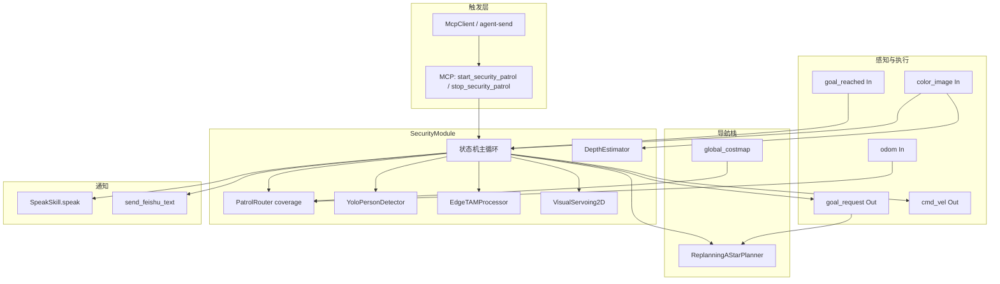
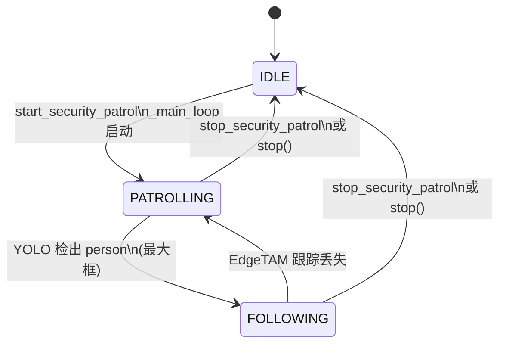

# 巡检识人 + 语音 + 飞书：方案设计

本文档描述 DimOS 中 **「安防巡检 → 视觉识人 → 跟随 → 语音播报 + 飞书告警」** 能力的架构与实现方案。联调步骤、现象速查与排障清单见 companion 文档 [`test_security_patrol_feishu.md`](test_security_patrol_feishu.md)；本文聚焦 **设计意图、模块边界、数据流与验收标准**。

---

## 1. 背景与目标

### 背景

园区/室内安防场景需要机器人在已知地图上 **自主巡逻**，在摄像头视野内 **发现人员** 时能够：

1. **中断当前导航目标**，切换为 **视觉跟随**；
2. **现场语音提醒**（中文 TTS），提示在场人员注意；
3. **异步推送飞书群消息**，供值班人员远程感知。

DimOS 将上述行为收敛在实验模块 **`SecurityModule`**（`dimos/experimental/security_demo/security_module.py`）中，用 **单模块内部状态机** 替代「Agent 在多模块间来回 RPC」的编排方式，降低延迟与 LLM 回合开销。

### 目标

| 维度 | 目标 |
|------|------|
| 功能 | 覆盖巡逻、识人、跟随、语音、可选飞书告警的端到端闭环 |
| 触发 | 通过 MCP / Agent 技能 **`start_security_patrol`** / **`stop_security_patrol`** 显式启停 |
| 可观测 | 发布 `security_state`、`detection`、`tracking_image` 等流；日志含 `Detection`、飞书成功/节流/失败 |
| 可配置 | 飞书 Webhook、签名密钥、告警节流经 **`GlobalConfig`**；TTS 依赖 **`OPENAI_API_KEY`** |
| 可测试 | 单元测试覆盖状态转移与飞书调度；联调文档与 `verify.sh` 门禁 |

### 非目标（当前实现）

- 不依赖 `GlobalConfig.detection_model`（默认 `moondream`）做识人；巡检识人使用 **`YoloPersonDetector`**。
- 飞书仅发送 **纯文本**（`msg_type: text`），不含图片、富文本卡片或 @ 人。
- 不在 `FOLLOWING` 状态重复发送飞书告警（节流窗口内亦如此）；丢失目标后恢复巡逻，不单独发「恢复巡逻」飞书。

---

## 2. 用户场景与验收标准

### 典型场景

1. **值班员** 启动 `unitree-go2-agentic`（回放 / 仿真 / 真机），通过 MCP 或自然语言让 Agent 调用 **`start_security_patrol`**。
2. 机器人在全局 costmap 上按 **coverage 巡逻路由** 依次下发导航目标；同时每帧处理彩色图像。
3. 巡逻中 YOLO 检出 **`person`** 且选中 **面积最大** 的框 → 取消当前 goal → 播报 **「检测到人员，请注意」** → 后台线程尝试飞书 **「【巡检告警】摄像头视野内检测到人员，请关注。」** → 进入 EdgeTAM 跟随。
4. 跟踪丢失 → 停车、播报 **「已丢失目标，恢复巡逻」** → 重置路由器 → 回到巡逻。
5. 值班员调用 **`stop_security_patrol`** 或停止蓝图 → 状态回到 **IDLE**，发布零速度。

### 验收标准

| # | 条件 | 预期 |
|---|------|------|
| A1 | 已 `start_security_patrol`，画面有稳定 `person` | `security_state` 经 `PATROLLING` → `FOLLOWING`；日志含 `Detection` |
| A2 | 同上，且配置 `feishu_webhook_url` | 飞书群收到 `_FEISHU_PERSON_DETECTED` 文案；日志 `Feishu person alert sent successfully` |
| A3 | 同上，且配置 `OPENAI_API_KEY` | 机器人播报 `_SPEAK_PERSON_DETECTED`（「检测到人员，请注意」） |
| A4 | 跟随中目标丢失 | `cmd_vel` 零速；播报恢复巡逻文案；`security_state` → `PATROLLING` |
| A5 | 未 `start_security_patrol` | 无巡检主循环、无上述 Detection/飞书链路（见排障文档） |
| A6 | 未配置 Webhook | 识人与语音仍可进行；日志一次性 warning，不调用 `send_feishu_text` |
| A7 | 自动化 | `pytest dimos/experimental/security_demo/test_security_module.py` 与 `dimos/utils/test_feishu_webhook.py` 通过 |

---

## 3. 系统架构

### 3.1 蓝图组成

`SecurityModule` 通过 **`unitree_go2_spatial`** 接入 Go2 栈，再由 **`unitree_go2_agentic`** 叠加 MCP 与 Agent 技能容器：

```text
unitree_go2_agentic
├── unitree_go2_spatial
│   ├── unitree_go2          # 建图、costmap、ReplanningAStarPlanner、PatrollingModule 等
│   ├── SpatialMemory
│   ├── PerceiveLoopSkill
│   └── SecurityModule       # 本方案核心
├── McpServer                # 暴露 @skill（含 start_security_patrol）
├── McpClient                # LLM Agent
└── _common_agentic
    ├── NavigationSkillContainer
    ├── PersonFollowSkillContainer
    ├── UnitreeSkillContainer
    ├── WebInput
    └── SpeakSkill           # SecurityModule 经 SpeakSkillSpec RPC 调用
```

关键源码：

- 蓝图接线：[`dimos/robot/unitree/go2/blueprints/smart/unitree_go2_spatial.py`](../../dimos/robot/unitree/go2/blueprints/smart/unitree_go2_spatial.py)
- Agentic 顶层：[`dimos/robot/unitree/go2/blueprints/agentic/unitree_go2_agentic.py`](../../dimos/robot/unitree/go2/blueprints/agentic/unitree_go2_agentic.py)
- `SpeakSkill` 注册：[`dimos/robot/unitree/go2/blueprints/agentic/_common_agentic.py`](../../dimos/robot/unitree/go2/blueprints/agentic/_common_agentic.py)

另：`unitree-go2-security` 在 agentic 栈上增加 Rerun 视图（含 `tracking_image`），见 [`unitree_go2_security.py`](../../dimos/robot/unitree/go2/blueprints/agentic/unitree_go2_security.py)。

### 3.2 模块关系图



说明：`SecurityModule` 持有 **独立的** `PatrolRouter`（`create_patrol_router("coverage", ...)`），与栈内 **`PatrollingModule`**（`dimos/navigation/patrolling/module.py`）并行存在；巡检行为由 `SecurityModule` 主循环驱动，不通过 `PatrollingModule` 的 skill 启动。

### 3.3 数据流（识人告警路径）

```mermaid
sequenceDiagram
    participant Loop as SecurityModule._main_loop
    participant Patrol as _patrol_step
    participant YOLO as YoloPersonDetector
    participant Nav as goal_request / Planner
    participant Speak as SpeakSkill
    participant FS as Feishu background thread

    Loop->>Patrol: state == PATROLLING
    Patrol->>Nav: next_goal() 若无 active goal
    Patrol->>YOLO: _find_best_person(image)
    alt 无 person
        Patrol-->>Loop: return
    else 有 person
        Patrol->>Nav: _cancel_current_goal()
        Patrol->>Speak: speak("检测到人员，请注意", blocking=False)
        Patrol->>FS: _schedule_feishu_person_detected()
        Patrol->>Loop: _transition_to(FOLLOWING)
    end
```

---

## 4. 核心流程

### 4.1 状态机

状态类型定义：`State = Literal["IDLE", "PATROLLING", "FOLLOWING"]`。



| 状态 | 行为摘要 |
|------|----------|
| **IDLE** | 无巡检主线程；默认初始状态 |
| **PATROLLING** | `_patrol_step`：下发 coverage 巡逻 goal、监听 `goal_reached`、并行 YOLO 识人 |
| **FOLLOWING** | `_follow_step`：EdgeTAM 跟踪 + `VisualServoing2D` 发布 `cmd_vel`；跟丢则回巡逻 |

每次 `_transition_to` 会向 **`security_state`**（`Out[String]`）发布当前状态字符串，并写结构化日志 `state transition`。

### 4.2 识人触发条件

仅在 **`PATROLLING`** 且主循环未停止时，在 `_patrol_step` 内触发：

1. 存在 **`_latest_image`**（`color_image` 回调更新）；
2. `YoloPersonDetector.process_image` 返回的检测中 **`name == "person"`** 非空；
3. 取 **`bbox_2d_volume()` 最大** 的一个作为 `best`（`_find_best_person`）。

触发后顺序（同一线程，飞书除外）：

1. 日志 `Detection`（bbox、confidence、area）；
2. 绘制框与骨架 → **`detection.publish`**；
3. **`EdgeTAMProcessor.init_track`**（用 YOLO bbox 初始化）；
4. **`_cancel_current_goal`**（向 `goal_request` 发布当前位姿以取消导航）；
5. **`_speak_skill.speak(_SPEAK_PERSON_DETECTED, blocking=False)`**；
6. **`_schedule_feishu_person_detected()`**；
7. **`_transition_to("FOLLOWING")`**。

**不触发** 的情况：未调用 `start_security_patrol`、处于 `FOLLOWING`/`IDLE`、无图像、YOLO 无 `person`、或 `PerceiveLoopSkill` 等其他可视化路径的检测（见排障文档）。

### 4.3 跟随与丢失

`_follow_step`（默认 `follow_frequency = 20.0 Hz`）：

- `EdgeTAMProcessor.process_image` 有检测 → 选最大框 → `VisualServoing2D.compute_twist` → `cmd_vel.publish`；叠加 mask 与 YOLO 骨架 → **`tracking_image.publish`**。
- 检测为空 → 零速、`speak` 恢复巡逻文案、`_router.reset()`、回到 **`PATROLLING`**。

### 4.4 启停与规划器协作

**`start_security_patrol`**（`@skill`）：

- 若主线程已存活则返回提示使用 `stop_security_patrol`；
- `_router.reset()`；
- 经 **`ReplanningAStarPlannerSpec`**：`set_replanning_enabled(False)`、`set_safe_goal_clearance(robot_rotation_diameter/2 + EXTRA_CLEARANCE)`；
- 启动守护线程执行 `_main_loop`。

**`stop_security_patrol` / `stop`**：

- `_stop_event.set()`，恢复 replanning 与 clearance，取消当前 goal，join 主线程，发布零 `cmd_vel`，状态 **IDLE**。

---

## 5. 各子能力说明

### 5.1 安防巡检（PatrolRouter / goal 路由）

| 项 | 说明 |
|----|------|
| 路由器 | `create_patrol_router("coverage", clearance_radius_m)`，`clearance_radius_m = robot_width * 0.5`（来自 `GlobalConfig`） |
| 输入 | `odom` → `handle_odom`；`global_costmap` → `handle_occupancy_grid` |
| 输出 | `goal_request` → `ReplanningAStarPlanner.goal_request` |
| 到达 | `goal_reached` 清除 `_has_active_goal`，以便 `next_goal()` |
| 无 goal | 日志 `no patrol goal available, retrying in 2s`，等待 2s（依赖有效 costmap / 里程计） |

实现参考：[`security_module.py`](../../dimos/experimental/security_demo/security_module.py) 中 `_create_router`、`_patrol_step`；路由器工厂 [`create_patrol_router.py`](../../dimos/navigation/patrolling/create_patrol_router.py)。

### 5.2 识人（YOLO + EdgeTAM follow）

| 阶段 | 组件 | 职责 |
|------|------|------|
| 巡逻识人 | `YoloPersonDetector` | 全图检测，筛选 `person`，按框面积取最大 |
| 跟随 | `EdgeTAMProcessor` | 以 YOLO bbox 初始化 track，逐帧 `process_image` |
| 伺服 | `VisualServoing2D` | 由 bbox 与 `camera_info` 计算 `Twist`；仿真时用 `MujocoConnection.camera_info_static` |
| 可视化 | `draw_bounding_box`、骨架绘制 | 巡逻命中 → `detection`；跟随 → `tracking_image`（含 mask 叠加） |
| 深度 | `DepthEstimator` | 订阅彩色图，发布 `depth_image`（辅助可视化，不参与飞书触发） |

### 5.3 语音播报（SpeakSkill）

| 项 | 说明 |
|----|------|
| 调用方式 | `SecurityModule` 注入 **`SpeakSkillSpec`**，内部 RPC `speak(text, blocking=False)` |
| TTS | `OpenAITTSNode`（`Voice.ONYX`，`speed=1.2`）+ `SounddeviceAudioOutput` |
| 前置条件 | 进程环境中 **`OPENAI_API_KEY`**；未设置时 `start()` 打 warning，`speak` 返回 *TTS disabled*，不播报 |
| 非阻塞 | `blocking=False` 时后台线程播报，不阻塞巡检主循环 |
| 文案常量 | `_SPEAK_PERSON_DETECTED = "检测到人员，请注意"`；`_SPEAK_LOST_RESUME_PATROL = "已丢失目标，恢复巡逻"` |

源码：[`dimos/agents/skills/speak_skill.py`](../../dimos/agents/skills/speak_skill.py)、[`speak_skill_spec.py`](../../dimos/agents/skills/speak_skill_spec.py)。

Agent 侧另暴露 **`speak`** skill 供 LLM 主动发言；安防链路使用的是 **模块间 RPC**，不经过 LLM 选词。

### 5.4 飞书通知

| 项 | 说明 |
|----|------|
| 入口 | `_schedule_feishu_person_detected` → 守护线程 `SecurityModule-notify` |
| HTTP | `dimos.utils.feishu_webhook.send_feishu_text` |
| 消息 | `_FEISHU_PERSON_DETECTED = "【巡检告警】摄像头视野内检测到人员，请关注。"` |
| 配置 | `GlobalConfig.feishu_webhook_url`、`feishu_webhook_secret`、`feishu_min_interval_s`（默认 **60s**） |
| 节流 | 仅在上次 **HTTP 成功** 后计时；间隔内打 `Feishu person alert skipped (min_interval_s throttle)` 并跳过 |
| 签名 | 若 `secret` 非空，payload 含 `timestamp` + HMAC-SHA256 `sign`（见 `_feishu_sign`） |
| 失败 | `requests` 异常、非 2xx、JSON `code`/`StatusCode` 非 0 → 返回 `False`，**不更新**成功时间戳 |
| 空 URL | 仅首次 `logger.warning`，提示配置 `FEISHU_WEBHOOK_URL` / `dimos.local.toml` / Docker `/app/.env` |

`send_feishu_text` 契约：POST JSON，`msg_type: text`，超时默认 5s，成功当 `code == 0` 或 `StatusCode == 0`。

---

## 6. 配置与部署

### 6.1 GlobalConfig 相关字段

定义见 [`dimos/core/global_config.py`](../../dimos/core/global_config.py)：

| 字段 | 环境变量（别名） | 用途 |
|------|------------------|------|
| `feishu_webhook_url` | `DIMOS_FEISHU_WEBHOOK_URL`, `FEISHU_WEBHOOK_URL` | 飞书自定义机器人 Hook URL |
| `feishu_webhook_secret` | `DIMOS_FEISHU_WEBHOOK_SECRET`, `FEISHU_WEBHOOK_SECRET` | 签名校验密钥（可选） |
| `feishu_min_interval_s` | `DIMOS_FEISHU_MIN_INTERVAL_S`, `FEISHU_MIN_INTERVAL_S` | 成功告警最小间隔（秒） |
| `robot_ip` | `DIMOS_ROBOT_IP` 等 | 真机 Go2 WebRTC 连接 |
| `robot_width` / `robot_rotation_diameter` | — | 巡逻 clearance 与 safe goal clearance |
| `simulation` / `replay` | CLI 标志 | 连接类型与场景数据 |

**配置优先级**（低 → 高）：字段默认 → `.env` → `dimos.local.toml` 的 `[feishu]` → 环境变量 → 构造参数 / `global_config.update` → **CLI 根命令标志**。

`dimos.local.toml` 示例（勿提交真实 URL/密钥）：

```toml
[feishu]
webhook_url = "https://open.feishu.cn/open-apis/bot/v2/hook/REPLACE_ME"
webhook_secret = ""
min_interval_s = 60.0
```

模板：[`dimos.local.example.toml`](../../dimos.local.example.toml)。

### 6.2 CLI 标志顺序

`GlobalConfig` 标志挂在 **根命令**，必须写在 **`run` 子命令之前**：

```bash
dimos --robot-ip 192.168.123.161 run unitree-go2-agentic
dimos --replay run unitree-go2-agentic --daemon
dimos --simulation run unitree-go2-agentic
```

启停巡检（需蓝图已含 `McpServer`）：

```bash
dimos mcp call start_security_patrol
dimos mcp call stop_security_patrol
```

验证配置时需使用 **与 `run` 相同的前缀**，例如 `dimos --simulation show-config`（详见排障文档）。

### 6.3 语音与其它密钥

- **`OPENAI_API_KEY`**：在运行 `dimos` 的 shell / `.env` 中设置；与 `GlobalConfig` 无直接字段。
- **切勿**将 Webhook、密钥写入 Git 或本文档；泄露后应在飞书侧轮换机器人。

### 6.4 Docker 宿主机 vs 容器

- 宿主机 `export` 的变量 **不会自动** 进入容器；需在容器内可见的位置配置（如 **`/app/.env`**，并由 `docker/dev/bash.sh` 等入口 `source`）。
- `SecurityModule` 在 Webhook 缺失时的 warning 明确提到 Docker 场景检查 `/app/.env`。
- 飞书 HTTP 从 **运行 SecurityModule 的 worker 进程** 发出，需容器出网可达 `open.feishu.cn`；注意 `HTTPS_PROXY` 指向未启动的本地代理会导致 POST 失败（排障文档有述）。

---

## 7. 触发与排障要点

完整清单、现象表与手工 curl 测试见 **[`test_security_patrol_feishu.md`](test_security_patrol_feishu.md)**。此处仅列架构相关要点：

1. **必须先 `start_security_patrol`**，否则无 `_main_loop`、无 `Detection` 日志链路与飞书调度。
2. 飞书 **只在 `_patrol_step` 识人成功路径** 调度，不是任意可视化或深度叠加。
3. Rerun 绿色框来自 `SecurityModule.detection` 时方可作为巡检命中佐证；其他模块配色/话题不等价。
4. `dimos show-config` 与正在运行的实例可能不一致，需对齐 CLI 前缀。
5. 自动化回归：`bash scripts/verify.sh` 或  
   `uv run pytest dimos/utils/test_feishu_webhook.py dimos/experimental/security_demo/test_security_module.py -v`。

---

## 8. 测试策略

### 8.1 单元测试

| 文件 | 覆盖点 |
|------|--------|
| [`test_security_module.py`](../../dimos/experimental/security_demo/test_security_module.py) | `_find_best_person`；`_patrol_step` → `FOLLOWING`、speak、飞书 mock、goal 取消；无 Webhook 不调飞书；`_follow_step` 伺服与丢失回巡逻；`_main_loop` 干净退出 IDLE |
| [`test_feishu_webhook.py`](../../dimos/utils/test_feishu_webhook.py) | HTTP 成功（`code` / `StatusCode`）、失败、带 `secret` 的签名 payload |

测试中对 `_spawn_background` 同步执行以便断言飞书调用（生产环境为真异步）。

### 8.2 联调

按 [`test_security_patrol_feishu.md`](test_security_patrol_feishu.md)：启动 `unitree-go2-agentic` → MCP 启巡检 → 画面出现 `person` → 听语音 / 看飞书 / 搜日志关键字。

### 8.3 真机 / 仿真 / 回放

| 模式 | 命令示例 | 注意 |
|------|----------|------|
| 回放 | `dimos --replay run unitree-go2-agentic` | 数据集无人形则无法触发识人 |
| 仿真 | `dimos --simulation run unitree-go2-agentic` | MuJoCo 相机内参走 `MujocoConnection.camera_info_static` |
| 真机 | `dimos --robot-ip <IP> run unitree-go2-agentic` | 需 costmap、里程计、相机流正常 |

E2E 参考：[`dimos/e2e_tests/test_security_module.py`](../../dimos/e2e_tests/test_security_module.py)（Agent 调用 `start_security_patrol`）。

---

## 9. 风险与后续演进

### 风险

| 级别 | 风险 | 缓解 / 现状 |
|------|------|-------------|
| P1 | YOLO 误检导致错误跟随与告警 | 仅最大框触发；可考虑置信度阈值、连续帧确认 |
| P1 | 飞书节流窗口内多次识人只告警一次 | 符合「防刷屏」设计；值班场景需知悉 |
| P1 | `OPENAI_API_KEY` 缺失时静默无语音 | 启动时 warning；验收需检查密钥 |
| P2 | `PatrollingModule` 与 `SecurityModule` 双路由概念并存 | 文档与培训说明「安防巡检走 SecurityModule」 |
| P2 | `no patrol goal available` 长时间重试 | 依赖 costmap/定位；回放数据需含导航流 |
| P2 | 实验路径 `experimental/security_demo` | API 可能变更；晋升正式模块时需蓝图与文档同步 |

### 后续演进（建议）

1. **识人策略**：置信度门槛、多帧一致、ROI 限制；可选与 `GlobalConfig.detection_model` 统一配置入口。
2. **告警丰富度**：飞书卡片、截图附件、机器人位置/时间戳；跟随阶段心跳或丢失通知。
3. **状态外显**：将 `security_state` 接入 Foxglove/Rerun 面板或值班大屏。
4. **多机/多区域**：Webhook 与节流按区域配置；与 `SpatialMemory` 联动上报语义位置。
5. **生产硬化**：从 `experimental` 迁出、补充 slow/e2e 在 CI 的固定场景、明确与 `PersonFollowSkillContainer` 的职责划分（Agent 技能跟随 vs 安防自动跟随）。

---

## 相关文件索引

| 资源 | 路径 |
|------|------|
| 安全巡检模块 | [`dimos/experimental/security_demo/security_module.py`](../../dimos/experimental/security_demo/security_module.py) |
| 飞书 HTTP | [`dimos/utils/feishu_webhook.py`](../../dimos/utils/feishu_webhook.py) |
| 全局配置 | [`dimos/core/global_config.py`](../../dimos/core/global_config.py) |
| 语音技能 | [`dimos/agents/skills/speak_skill.py`](../../dimos/agents/skills/speak_skill.py) |
| 联调与排障 | [`docs/development/test_security_patrol_feishu.md`](test_security_patrol_feishu.md) |
| 配置说明 | [`docs/usage/configuration.md`](../usage/configuration.md) |
