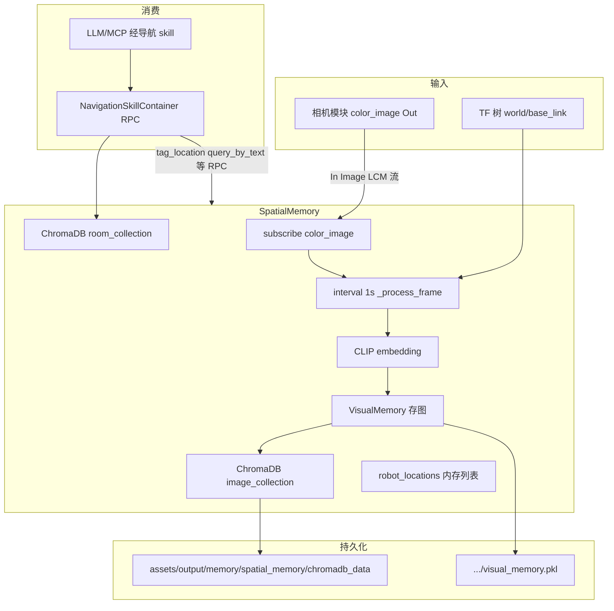

# 空间记忆（Spatial Memory）架构说明

> 调查分支：`feat/gy_semantic-nav-robust-loop`
> 依据：仓库内代码与测试，不含未实现设想。

---

## 概述

DimOS 的**空间记忆**指在机器人运动时，将**彩色相机帧**与 **world 坐标系下的位姿**绑定，用 **CLIP** 生成嵌入，写入 **ChromaDB** 与本地 **VisualMemory**，并支持：

- 按**文本**（CLIP 图文匹配）检索历史画面与位姿
- **命名地点**（`RobotLocation`）的语义标注与查询
- **房间参考图**（`room_images` 集合）的视觉重定位

消费方主要是 `NavigationSkillContainer`（通过 `SpatialMemorySpec` RPC 代理），用于 `tag_location`、`navigate_with_text` 等多层回退导航。

**不属于**主「空间记忆」但名称相近的组件：

| 组件 | 路径 | 作用 |
|------|------|------|
| `SpatialLandmarkMemory` / `SpatialLandmarkMemoryModule` | `door_spatial_memory.py`, `door_spatial_memory_module.py` | JSON 持久化的地标/门记录，供 L3 landmark 导航 |
| `ObjectDB` | `detection/objectDB.py` | 3D 检测物体的空间去重库（注释称 spatial memory database） |
| `TemporalMemory` | `experimental/temporal_memory/` | 实验性时序/VLM 图记忆，独立 blueprint |
| `EmbeddingMemory` | `memory/embedding.py` | 未完成的占位模块 |
| `memory2` | `dimos/memory2/` | 新一代 Recorder/SemanticSearch 栈，与 `SpatialMemory` 并行 |

---

## 架构

### 模块分层

```
相机 color_image (DimOS In[Image] / LCM)
        │
        ▼
  SpatialMemory (Module)
    ├─ TF: world ← base_link（采样帧位姿）
    ├─ ImageEmbeddingProvider (CLIP)
    ├─ VisualMemory（像素缓存 + pkl）
    ├─ SpatialVectorDB（Chroma：spatial_memory + _locations）
    └─ room_collection（Chroma：spatial_memory_room_images）
        │
        ▼ RPC（AsyncSpecProxy → NavigationSkillContainer._spatial_memory）
  导航技能：tag / query / room 识别 / vlm_memory / clip_map 等
```

### Blueprint 集成

| Blueprint 别名 | 定义位置 | 是否含 SpatialMemory |
|----------------|----------|----------------------|
| `unitree-go2-spatial` | `robot/unitree/go2/blueprints/smart/unitree_go2_spatial.py` | 是 |
| `unitree-go2-agentic`（及 ollama/deepseek 等变体） | `agentic/unitree_go2_agentic*.py` | 是（`autoconnect(unitree_go2_spatial, _common_agentic)`） |
| G1 感知栈 | `g1/blueprints/perceptive/_perception_and_memory.py` | 是 |

`unitree_go2_spatial` 在 `unitree_go2` 之上额外挂载：

- `SpatialMemory`（`new_memory=global_config.new_memory`）
- `SpatialLandmarkMemoryModule`
- `ObjectTracker2D`、`BBoxNavigationModule`、`PerceiveLoopSkill`、`SecurityModule`

组件注册名（可 `--disable`）：`spatial-memory` → `dimos.perception.spatial_perception.SpatialMemory`（`all_blueprints.py`）。

Spec 注入：`NavigationSkillContainer` 声明 `_spatial_memory: SpatialMemorySpec`；`ModuleCoordinator._connect_module_refs` 将其实例解析为 `SpatialMemory` 的 RPC 代理。

---

## 数据流



**采样策略**（`SpatialConfig`）：移动距离 ≥ `min_distance_threshold`（默认 0.5 m）且距上次记录 ≥ `min_time_threshold`（默认 5 s）才写入；最多 `max_stored_frames`（500）帧 FIFO 淘汰；房间参考图最多 `max_room_images`（100）。

---

## 核心代码清单

### 主模块

| 文件 | 类/符号 | 说明 |
|------|---------|------|
| `dimos/perception/spatial_perception.py` | `SpatialConfig`, `SpatialMemory` | 主模块 |
| `dimos/perception/spatial_memory_spec.py` | `SpatialMemorySpec` | 导航侧 Protocol |
| `dimos/types/robot_location.py` | `RobotLocation` | 命名地点类型 |
| `dimos/agents_deprecated/memory/spatial_vector_db.py` | `SpatialVectorDB` | Chroma 封装 |
| `dimos/agents_deprecated/memory/visual_memory.py` | `VisualMemory` | 图像字节存储 |
| `dimos/agents_deprecated/memory/image_embedding.py` | `ImageEmbeddingProvider` | CLIP 嵌入 |

### 流与传输

| 名称 | 方向 | 类型 | 说明 |
|------|------|------|------|
| `color_image` | `In[Image]` | 唯一输入流 | blueprint 与相机 `autoconnect` |
| （无 `Out` 流） | — | — | 查询均通过 RPC |

位姿**不**订阅 `odom` 流；`start()` 内通过 `self.tf.get("world", "base_link")` 取位姿。测试里可单独部署 `OdometryReplayModule` 填充 TF。

LCM：流与 RPC 经 DimOS `LCMTransport` / RPC 通道（测试示例：`LCMTransport("/test_video", Image)`；E2E 常见 `/rpc/McpClient/on_system_modules/res`）。**无**固定的全局 topic 名文档；由模块图动态连线。

### RPC 方法（`SpatialMemory`，`@rpc`）

**生命周期**：`start`, `stop`, `save`, `get_stats`, `clear_all`

**语义地图帧**：`query_by_text`, `query_by_text_with_images`, `query_by_image`, `query_by_location`, `query_by_embedding`（经 vector_db）, `get_image_by_id`, `process_stream`（测试/批处理用）

**命名地点**：`add_robot_location`, `add_named_location`, `get_robot_locations`, `find_robot_location`, `tag_location`, `query_tagged_location`

**房间视觉记忆**：`tag_location_with_image`, `query_location_by_image`, `get_room_images`, `get_room_image`

### 导航技能使用的 Spec API

`NavigationSkillContainer` 通过 `_spatial_memory` 调用：`tag_location`, `tag_location_with_image`, `query_tagged_location`, `query_location_by_image`, `query_by_text`, `query_by_text_with_images`, `get_room_images`, `get_room_image`, `clear_all`（见 `dimos/agents/skills/navigation.py`）。

### 相关：地标记忆模块

| 文件 | 说明 |
|------|------|
| `dimos/perception/detection/door/door_spatial_memory.py` | `SpatialLandmarkMemory` 内存+JSON |
| `dimos/perception/detection/door/door_spatial_memory_module.py` | `SpatialLandmarkMemoryModule` RPC 包装 |
| `dimos/types/door_memory_spec.py` | `SpatialLandmarkMemorySpec` |

持久化：`STATE_DIR/landmark_memory/landmarks.json`（**未**列入 `all_blueprints` 的短名表，仅 blueprint 组合引入）。

---

## 配置与开关

### GlobalConfig

`dimos/core/global_config.py`：`new_memory: bool = False`

- CLI：`--new-memory` / `--no-new-memory`（Typer 由 `GlobalConfig` 字段自动生成）
- 环境变量：Pydantic Settings 支持 `NEW_MEMORY`（及 `.env`）

为 `True` 时：启动时清空 Chroma 目录并新建 `VisualMemory`。

### SpatialConfig 默认值（节选）

| 字段 | 默认 | 含义 |
|------|------|------|
| `embedding_model` | `"clip"` | 嵌入模型 |
| `embedding_dimensions` | `512` | 向量维度 |
| `min_distance_threshold` | `0.5` | 最小位移（米） |
| `min_time_threshold` | `5.0` | 最小间隔（秒） |
| `max_stored_frames` | `500` | 轨迹帧上限 |
| `max_room_images` | `100` | 房间参考图上限 |
| `db_path` | `assets/output/memory/spatial_memory/chromadb_data` | Chroma 路径 |
| `visual_memory_path` | `.../visual_memory.pkl` | 图像缓存 |

### 禁用模块

```bash
dimos run --disable spatial-memory <blueprint>
```

示例：`dimos/e2e_tests/test_security_module.py` 对 `unitree-go2-security` 禁用 `spatial-memory`。

---

## 使用说明

### 启用（含空间记忆的 blueprint）

```bash
# 仿真 + agentic（含 SpatialMemory + 导航技能）
dimos --simulation run unitree-go2-agentic

# 仅导航 + 空间记忆栈（无 LLM agent 容器）
dimos --simulation run unitree-go2-spatial

# 清空上次 Chroma/视觉缓存后启动
dimos --simulation --new-memory run unitree-go2-agentic
```

实机需配置 `ROBOT_IP`、VLM API key 等（见 `docs/platforms/quadruped/go2/index.md`、`.env.example`）。

### 运行时交互（经 agent / humancli）

导航技能提供例如：`tag_location`、`navigate_with_text`、`clear_all_memory` 等（具体 skill 名以 `navigation.py` 中 `@skill` 为准）。E2E 流程：先巡逻建图，再 `human_input("go to the bookcase")`（`dimos/e2e_tests/test_spatial_memory.py`）。

### 单机部署示例

`spatial_perception.py` 末尾 `deploy()`：`SpatialMemory` + `camera.color_image.connect` + `start()`。

---

## 测试

| 测试文件 | 类型 | 说明 |
|----------|------|------|
| `dimos/perception/test_spatial_memory.py` | 单元 | CLIP 嵌入、`process_stream` |
| `dimos/perception/test_spatial_memory_module.py` | 集成 | replay 视频 + odom → TF，`query_by_text("office")` |
| `dimos/e2e_tests/test_spatial_memory.py` | E2E | `unitree-go2-agentic` + mujoco，自然语言导航到书架 |
| `dimos/perception/detection/door/test_door_spatial_memory.py` | 单元 | 地标记忆（非主 SpatialMemory） |

运行示例：

```bash
pytest dimos/perception/test_spatial_memory.py -q
pytest dimos/perception/test_spatial_memory_module.py -q  # 标记 slow，CI 可能跳过
```

---

## 限制与待办（代码与文档已标明）

1. **遗留依赖**：`SpatialMemory` 仍依赖 `dimos/agents_deprecated/memory/*`（`modules_cn.md` 已注明）。
2. **Chroma 脆弱性**：损坏时自动 wipe 重建（`_recover_chromadb_if_needed`），可能丢历史帧。
3. **无输出流**：Agent 文档写「订阅 spatial memory 流」；实际为 **RPC 拉取**，非 `Out` 话题订阅。
4. **`EmbeddingMemory`**：Rx 管线仅 `subscribe(print)`，非生产路径。
5. **`memory2`**：与 `SpatialMemory` 未在 blueprint 中统一；长期可能迁移。
6. **`SpatialLandmarkMemoryModule`**：无 `all_blueprints` 短名，只能随组合 blueprint 启用。
7. **查询阈值**：`query_tagged_location` 语义距离 `< 0.3` 才返回；房间视觉匹配依赖 Chroma distance（导航侧 `_room_visual_max_distance` 等）。

---

## 飞书同步

父 Wiki：[05 郭岩](https://topsunhzj.feishu.cn/wiki/A3tiwPixSi7MyfkYXvNcLQLtn0e)

```bash
# 需已安装并登录 lark-cli；若代理异常可设 LARK_CLI_NO_PROXY=1
bash scripts/sync_feishu_wiki_doc.sh
```
