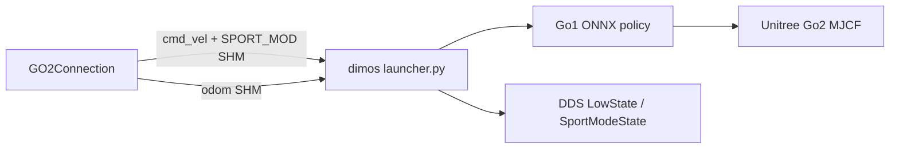

# Unitree official MuJoCo simulator

DimOS can drive [unitree_mujoco](https://github.com/unitreerobotics/unitree_mujoco) instead of the legacy in-repo MuJoCo stack (head camera, multi-depth lidar, custom office scenes).

## Setup

```bash
git clone https://github.com/unitreerobotics/unitree_mujoco third_party/unitree_mujoco

# Go2 stairs / mapping blueprints (MuJoCo + DDS + torch for VoxelGridMapper/memory2)
uv sync --extra go2-sim

# MuJoCo only (no Go2 blueprint stack): uv sync --extra sim
```

### CycloneDDS (required for `unitree-sdk2py`)

The Python package `cyclonedds` must compile against the **C library**. There is **no** `cyclonedds` Homebrew formula on macOS.

**macOS — build from source (recommended):**

```bash
cd /path/to/topsun_dimos
./bin/install-cyclonedds
# Copy the export lines the script prints, e.g.:
export CYCLONEDDS_HOME="$PWD/.cyclonedds/install"
export DYLD_LIBRARY_PATH="$CYCLONEDDS_HOME/lib:${DYLD_LIBRARY_PATH:-}"
uv sync --extra go2-sim
```

Requires `cmake` and Xcode CLT (`xcode-select --install`). Same steps as [unitree_sdk2_python](https://github.com/unitreerobotics/unitree_sdk2_python#faq).

**macOS / Linux — Nix (no sudo):** see [docs/usage/transports/dds.md](../usage/transports/dds.md).

**Linux apt:** `sudo apt install cyclonedds-dev` then set `CYCLONEDDS_HOME` — see dds.md.

If `uv sync` fails with `Could not locate cyclonedds`, export `CYCLONEDDS_HOME` **before** syncing.

At runtime, CycloneDDS must use **domain id 1** and interface **`lo`**, matching `simulate_python/config.py`.

## CLI

| Flag | Default | Meaning |
|------|---------|---------|
| `--simulation` | off | Enable MuJoCo |
| `--mujoco-backend unitree` | `unitree` | Official Unitree sim + DDS |
| `--mujoco-backend dimos` | | Legacy DimOS sim (perception-rich) |
| `--mujoco-room stairs` | | `scene_dimos_stairs.xml` when vendored |

```bash
# Stairs locomotion (ONNX + Sport SHM mirror; no lidar/video in unitree backend)
dimos --simulation run unitree-go2-stairs

# Full perception stack (legacy sim)
dimos --simulation --mujoco-backend dimos run unitree-go2-stairs
```

## Architecture



- **Locomotion**: Unitree sim is low-level only; DimOS runs the same Go1 ONNX policy as legacy sim, reading velocity and stair Sport gains from shared memory.
- **State**: Official bridge publishes `rt/sportmodestate` and `rt/lowstate`; odometry for DimOS modules is written to SHM from `qpos`.
- **Perception**: Official Go2 MJCF has no head camera or lidar. Use `--mujoco-backend dimos` for mapping / stair detection that needs point clouds, or replay mode.

## Stairs scene

`dimos/simulation/unitree_mujoco/scenes/scene_dimos_stairs.xml` includes Unitree `go2.xml` plus 10 treads (15 cm riser) aligned with `build_scene_stairs.py`. Start pose: `--mujoco-start-pos 2.5,0.0` (blueprint default).

## Low-level / SDK2 examples

With the launcher running, you can also send `rt/lowcmd` from `third_party/unitree_mujoco/example/python/` (stand, walk) on domain 1 — DimOS ONNX and external LowCmd must not fight; the DimOS launcher ignores external LowCmd while active.
