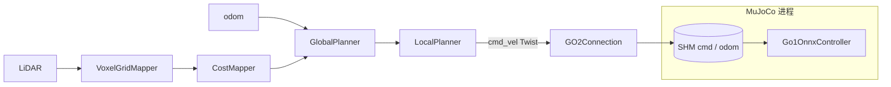
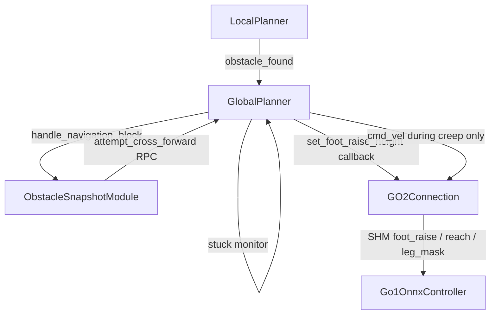

# Go2 仿真门槛越障与导航改造说明

本文档汇总在 `office1_clear` 场景下，为 Unitree Go2 实现的**门槛越障导航**相关改动（基于对话中的需求迭代）。面向后续维护、演示与联调。

---

## 1. 做了什么事情

### 1.1 场景与任务

- 在 MuJoCo 场景 **`office1_clear`** 中放置 **3 道门槛**（门洞宽 3 m，沿 Y 方向），用于仿真越障与导航测试。
- 门槛高度沿前进方向递增：**5 cm → 7 cm → 15 cm**（近狗处最低，远处最高）。
- 门槛沿 **−X** 间隔 2 m 布置，位置约为 **X = −1 m / −3 m / −5 m**。
- 调整机器狗**出生点与朝向**：spawn 在 `(0.106, 1.447)`，`yaw = π`，**头朝 −X**（面向门槛走廊）。

### 1.2 导航与越障策略

- 在蓝图 **`unitree-go2`** 上启用 **遇障先越障、再绕障、最后停车**（`obstacle_navigation`），**不依赖 VLM/视觉识障**，依赖 LiDAR 高度代价 costmap。
- 移除「遇障拍照」：越障/绕障用尽后仅停车并打日志，不再写 JPEG。
- **路径跟踪速度**相对 `main` 提高：蓝图配置 `planner_robot_speed = 1.1` m/s（`main` 默认本地规划约 0.55 m/s）。
- **仿真专用越障步态**：取消正常 ONNX 步态与路径跟随时持续抬腿；仅在越障阶段施加关节偏置（20 cm 抬腿、5 cm 前探）。

### 1.3 越障步态（仿真）

- 通过 MuJoCo 共享内存向 **Go1OnnxController** 注入抬腿/前探/单腿掩码。
- **单腿交替**：先左前（FL）再右前（FR）；抬一侧时**对侧前腿 + 对角后腿**加强支撑，减轻侧倾。
- **分腿步进**：每条前腿抬高后仅缓慢前进约 12 cm（`obstacle_cross_leg_step_m`），落地等待后再抬另一条，避免「一条腿已过门槛、另一条卡门槛」。
- 修正大腿偏置符号（Go1 上负向 thigh ctrl 抬躯干）、越障时即使本地规划器已 idle 也强制启用 20 cm/5 cm 步态参数。

### 1.4 代价地图与触发

- 高度代价 `can_climb = 0.30`，使约 10 cm 级门槛在 costmap 上约为中等代价，**15 cm 级接近满代价（100）**，优先尝试直穿而非过早绕路。
- 本地规划器路径前方出现 **OCCUPIED(100)** 或 **stuck**（仿真 stuck 阈值 1.0 m）时，触发 `ObstacleSnapshotModule.handle_navigation_block()`。

---

## 2. 大概方法是什么

### 2.1 架构分层

| 层级 | 职责 |
|------|------|
| **场景** | `thresholds.py` 生成门槛 XML；注入 `scene_office1_clear.xml` |
| **感知建图** | LiDAR → `VoxelGridMapper` → `CostMapper`（高度梯度代价） |
| **规划** | `ReplanningAStarPlanner` / `GlobalPlanner`：A* + 本地 P 控制跟路径 |
| **遇障决策** | `ObstacleSnapshotModule`：cross → detour → stop |
| **仿真执行** | `GO2Connection` → MuJoCo SHM `cmd_vel` + `foot_raise` / `front_reach` / `front_leg_mask` |
| **策略偏置** | `Go1OnnxController.get_control()` 在 ONNX 输出上叠加关节 ctrl |

### 2.2 越障决策优先级

```
blocked (stuck | obstacle_found on path)
    → 1) attempt_cross_forward()  （最多 2 次）
    → 2) replan detour            （最多 1 次）
    → 3) cancel_goal / stop
```

### 2.3 越障步态时序（仿真）

```
停车 → 可选短后退
    → FL 抬高 + 支撑 + 缓进 ~12 cm → 落地等待
    → FR 抬高 + 支撑 + 缓进 ~12 cm → 落地等待
    → 停车等待 odom 达到 min_advance（不再持续 cmd_vel 前进）
```

步态参数由 `cross_threshold_gait()` 固定为 **0.20 m 抬腿、0.05 m 前探**（有障碍时，不随 cost 缩放）。

### 2.4 单腿支撑（policy）

- `front_leg_mask = 2`：抬 FL，FR 前腿下压 + RR 对角后腿承重。
- `front_leg_mask = 1`：抬 FR，FL 前腿下压 + RL 对角后腿承重。
- 全网轻微躯干抬升（对称 thigh 负偏置 + 后髋后倾），仅抬腿侧加大小腿/大腿抬升与前探。

---

## 3. 数据流是什么

### 3.1 常态导航（未触发越障）



- **输入**：仿真传感器、全局 costmap、目标点（Rerun/点击/LCM）。
- **输出**：`cmd_vel`（线速度约 1.1 m/s 上限，由 `PController` 生成）。

### 3.2 遇障与越障



**关键流说明：**

| 数据 | 路径 |
|------|------|
| 前方障碍 | `PathClearance.is_obstacle_ahead()` → cost == 100 → `obstacle_found` |
| 卡住 | `PositionTracker`（8 s 窗口，仿真阈值 1 m）→ `stuck` |
| 越障参数 | `GlobalPlanner` → `GO2.set_foot_raise_height(h, reach, mask)` → `ShmWriter.write_command` |
| 运动指令 | `LocalPlanner.cmd_vel` → `GO2.move(twist)` → SHM linear/angular |
| 里程计反馈 | SHM odom → 规划器判断 `Cross forward succeeded` |

**SHM 命令布局（9× float32）：**  
`linear(3) + angular(3) + foot_raise + front_reach + front_leg_mask`  
（mask：0=无越障腿，1=抬 FR，2=抬 FL）

### 3.3 与 main 分支差异（数据路径）

- **main**：`obstacle_found` → 直接 `_replan_path()`，无 SHM 步态、无 `ObstacleSnapshotModule`。
- **本分支**：同上 costmap 触发，但插入 **越障模块 + 仿真步态 SHM**，越障期间 **本地规划器常处于 idle**，前进仅由 `GlobalPlanner.attempt_cross_forward()` 短时发 `cmd_vel`。

---

## 4. 最终交付物是什么

### 4.1 可运行蓝图与命令

```bash
dimos stop
dimos --simulation --mujoco-room office1_clear run unitree-go2
```

可选关闭越障（行为接近 main，仅 replan）：

```bash
dimos --simulation --mujoco-room office1_clear --no-obstacle-navigation run unitree-go2
```

（`--no-obstacle-navigation` 为**全局参数**，须写在 `run` 之前。）

### 4.2 场景与配置交付

| 交付物 | 路径 / 说明 |
|--------|-------------|
| 门槛参数与 XML 生成 | `dimos/simulation/mujoco/scenes/thresholds.py` |
| 注入后的场景文件 | `dimos/simulation/mujoco/scenes/scene_office1_clear.xml` |
| 场景再生脚本 | `scripts/generate_office1_clear_scene.py` |
| Go2 智能栈蓝图 | `dimos/robot/unitree/go2/blueprints/smart/unitree_go2.py` |
| 全局配置项 | `dimos/core/global_config.py`（`obstacle_*`、`mujoco_start_*` 等） |

**当前门槛与 spawn 默认值：**

| 项目 | 值 |
|------|-----|
| 门槛 X | −1 / −3 / −5 m |
| 门槛高度 | 5 / 7 / 15 cm |
| 间隔 | 2 m（沿 −X） |
| `mujoco_start_pos` | `0.106, 1.447` |
| `mujoco_start_yaw` | π（朝 −X） |
| `planner_robot_speed` | 1.1 m/s |
| 越障抬腿/前探 | 0.20 m / 0.05 m |

### 4.3 代码模块交付

| 模块 | 路径 | 作用 |
|------|------|------|
| 遇障编排 | `dimos/navigation/obstacle_snapshot/module.py` | cross / detour / stop |
| 规划与越障机动 | `dimos/navigation/replanning_a_star/global_planner.py` | 分腿序列、`attempt_cross_forward` |
| 越障参数映射 | `dimos/navigation/replanning_a_star/foot_raise.py` | 固定 20 cm / 5 cm |
| 规划模块接线 | `dimos/navigation/replanning_a_star/module.py` | 注册 callback / obstacle handler |
| 本地规划速度 | `dimos/navigation/replanning_a_star/local_planner.py` | `planner_robot_speed` |
| 仿真策略偏置 | `dimos/simulation/mujoco/policy.py` | `Go1OnnxController` 单腿/支撑 |
| SHM 协议 | `dimos/simulation/mujoco/shared_memory.py` | cmd 扩展字段 |
| MuJoCo 连接 | `dimos/robot/unitree/mujoco_connection.py` | `set_foot_raise_height` |
| Go2 连接封装 | `dimos/robot/unitree/go2/connection.py` | RPC 转发 |

### 4.4 测试

| 文件 | 内容 |
|------|------|
| `dimos/navigation/replanning_a_star/test_foot_raise.py` | 越障 gait 固定高度单元测试 |

### 4.5 明确未交付 / 非目标

- **MCAP 录制**：DimOS 无内置 `.mcap`；可用 Foxglove 客户端录或 `memory2` SQLite / pickle 回放。
- **真机越障步态**：仿真为 SHM 关节偏置；真机路径可走 `UnitreeSkillContainer` 的 `FootRaiseHeight` 等 sport 命令（与仿真逻辑分离）。
- **VLM 识障**：未接入；障碍来自 **LiDAR 高度 costmap**。

### 4.6 常用调参 CLI

```bash
dimos show-config | grep -E 'planner_robot_speed|obstacle_|mujoco_start'

# 示例
dimos --simulation --mujoco-room office1_clear run unitree-go2 \
  --planner-robot-speed 1.1 \
  --obstacle-cross-leg-step-m 0.12 \
  --obstacle-cross-leg-land-s 0.85
```

---

## 附录：迭代问题与对策（简表）

| 现象 | 对策 |
|------|------|
| 第三道门槛在房间外 | 门槛整体向狗方向平移；改沿 −X 排布 |
| 越障时一侧腿过、一侧卡门槛侧倾 | 单腿步进 + 对侧/对角支撑；取消持续前进+交替抬腿 |
| 躯干前倾/头栽 | 大腿偏置改符号；取消路径跟踪期持续抬腿 |
| 平均速度很慢 | 越障阻塞时间长；可用 `--no-obstacle-navigation` 对比 |
| `foot_raise_m=0` 越障无效 | 规划 idle 后仍强制 `max_cost≥100` 启用步态 |
| 误触发拍照 | 已删除 snapshot 存图逻辑 |

---

*文档版本：与 `feat/cuenca` 分支当前实现一致；若仅修改 `thresholds.py`，需重新注入 `scene_office1_clear.xml` 或运行 `scripts/generate_office1_clear_scene.py`。*
