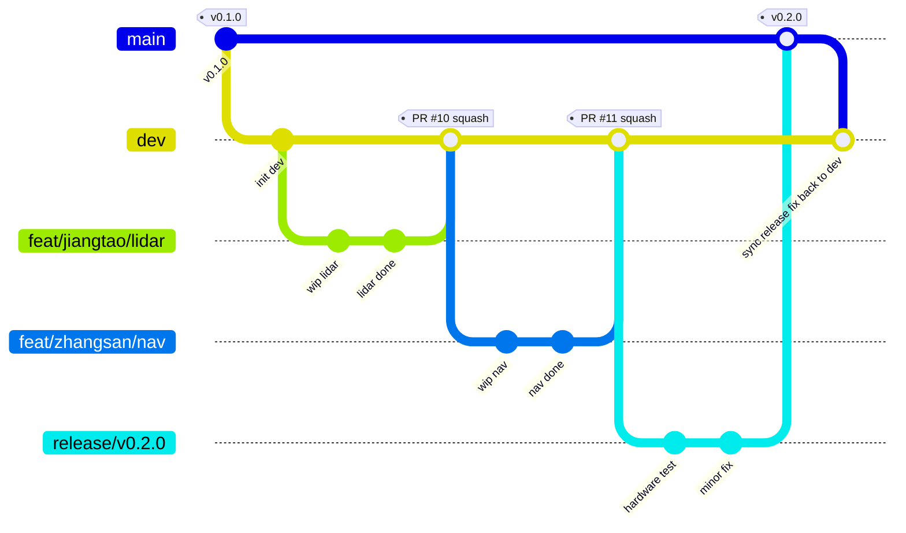

# 团队 Git 工作流

> **适用范围**: dimos 机器人项目团队协作
> **仓库**: `https://github.com/topsun-bot/topsun_dimos/pulls`（GitHub，作为团队主仓库）
> **上游**: `dimensionalOS/dimos`（社区上游，单向拉取）
> **维护者**: jiangtao

---

## 一、总览

### 分支模型

```
upstream/main (社区上游)
        │
        │ git fetch upstream
        ▼
   ┌──────────────────────────────────────────────────────┐
   │  main      ← 稳定版，已在机器人上验证                  │
   │   ↑                                                    │
   │   │ release PR (测试通过后)                            │
   │   │                                                    │
   │  dev       ← 团队开发主分支（默认分支）                │
   │   ↑                                                    │
   │   │ feature PR (Code Review + CI 通过)                │
   │   │                                                    │
   │  feat/<name>/<feature>   ← 个人开发分支                │
   │  fix/<name>/<bug>        ← 个人 bugfix 分支            │
   │  hotfix/<urgent-fix>     ← 紧急修复（直接基于 main）   │
   │  release/<version>       ← 发布候选（可选）            │
   └──────────────────────────────────────────────────────┘
```

### 三层质量门禁

| 分支 | 谁能合 | 进入条件 | 用途 |
|---|---|---|---|
| **个人分支** | 自己 | 无 | 日常开发 |
| **dev** | 所有开发者（自助 PR） | CI 绿 + 1 个 Reviewer approve | 团队代码集成 |
| **main** | 测试 / Team Lead | 在真实硬件验证通过 | 稳定发布 |

---

## 二、分支命名规范

### 强制前缀

| 前缀 | 用途 | 示例 |
|---|---|---|
| `feat/` | 新功能 | `feat/jiangtao/lidar-driver` |
| `fix/` | bug 修复 | `fix/zhangsan/odom-drift` |
| `hotfix/` | 紧急修复 main 上的问题 | `hotfix/cmd-vel-runaway` |
| `refactor/` | 重构 | `refactor/jiangtao/blueprint-cleanup` |
| `docs/` | 仅文档 | `docs/api-reference` |
| `test/` | 仅测试 | `test/coverage-improve` |
| `chore/` | 杂项（依赖、CI 等） | `chore/bump-uv` |
| `release/` | 发布候选 | `release/v0.2.0` |

### 命名规则

- 全小写，单词用 `-` 连接
- 个人分支建议加用户名：`feat/<username>/<feature>`
- 长度 ≤ 50 字符

---

## 三、Commit 消息规范（Conventional Commits）

格式：

```
<type>(<scope>): <短描述>

<可选的详细描述>
```

| type | 用途 |
|---|---|
| `feat` | 新功能 |
| `fix` | 修 bug |
| `docs` | 文档 |
| `refactor` | 重构（不改变行为） |
| `test` | 加/改测试 |
| `chore` | 杂项 |
| `perf` | 性能优化 |
| `ci` | CI 配置 |

示例：

```
feat(navigation): add cross-wall path planner

实现了基于 voxel map 的 cross-wall 规划算法,
解决了机器人在多层楼之间不能规划的问题。

Closes #42
```

---

## 四、完整开发流程

### 4.1 第一次 clone 仓库

```bash
git clone git@github.com:topsun-bot/topsun_dimos.git
cd dimos
git remote add upstream https://github.com/dimensionalOS/dimos.git
git fetch upstream
```

### 4.2 日常开发（从 dev 开新分支）

```bash
# 1. 同步 dev 最新代码
git fetch origin
git checkout dev
git pull origin dev

# 2. 基于 dev 创建你的功能分支
git checkout -b feat/jiangtao/my-feature

# 3. 开发 + commit（可以多次 commit）
vim dimos/xxx.py
git add -A
git commit -m "feat(xxx): add some functionality"

# 4. 跑本地验证（必须）
bash scripts/verify.sh

# 5. push 到远端
git push -u origin feat/jiangtao/my-feature

# 6. 创建 PR 到 dev
gh pr create \
  --repo jiangtao129/dimos \
  --base dev \
  --head feat/jiangtao/my-feature \
  --title "feat(xxx): add some functionality" \
  --body-file /tmp/pr-body.md \
  --reviewer zhangsan,lisi

# 7. 启用 auto-merge（CI 通过 + 至少一个 approval 后自动合）
gh pr merge <PR_NUMBER> \
  --repo jiangtao129/dimos \
  --auto \
  --squash \
  --delete-branch
```

### 4.3 PR 出现冲突的处理

当 dev 上别人先合了 PR，你的 PR 提示 conflict：

```bash
# 1. 拉最新 dev
git fetch origin

# 2. 切到你的分支
git checkout feat/jiangtao/my-feature

# 3. 把 dev 合进来
git merge origin/dev

# 4. 手动解决冲突文件（搜 <<<<<<< 标记）
vim <冲突文件>
git add <冲突文件>
git commit -m "merge: resolve conflict with dev"

# 5. 重新跑 verify
bash scripts/verify.sh

# 6. push 更新 PR
git push origin feat/jiangtao/my-feature
```

### 4.4 PR 被 Reviewer 提了意见

```bash
# 在同一个分支上继续改
vim <文件>
git add -A
git commit -m "review: fix xxx as suggested"
git push origin feat/jiangtao/my-feature

# PR 会自动更新,CI 重跑
```

---

## 五、Release 流程（dev → main）

> 只有指定人员（测试 / Team Lead）能做这一步。

### 5.1 准备 release 分支

```bash
# 测试人员从 dev 创建 release 分支
git fetch origin
git checkout -b release/v0.2.0 origin/dev
git push -u origin release/v0.2.0
```

### 5.2 在 release 分支上做硬件验证

- 在机器狗 / 机械臂上跑测试
- 如果发现 bug：
  - **小 bug**：直接在 release 分支上修，commit，push
  - **大 bug**：回到 dev 上修，PR 合到 dev，再把 dev 合到 release

```bash
# 把新的 dev 改动同步到 release（验证期间 dev 可能有新合入）
git checkout release/v0.2.0
git merge origin/dev
git push origin release/v0.2.0
```

### 5.3 验证通过后合到 main

```bash
# 创建 release PR
gh pr create \
  --repo jiangtao129/dimos \
  --base main \
  --head release/v0.2.0 \
  --title "release: v0.2.0" \
  --body "## 本次发布内容
- feat: 新功能 1
- fix: 修复问题 2
- 硬件验证报告: [link]
"

# Team Lead 审核后 merge（不要 squash,保留 release commit）
gh pr merge <PR_NUMBER> \
  --repo jiangtao129/dimos \
  --merge \
  --delete-branch
```

### 5.4 打 tag

```bash
git checkout main
git pull origin main
git tag -a v0.2.0 -m "Release v0.2.0"
git push origin v0.2.0
```

---

## 六、Hotfix 流程（紧急修 main）

> main 上发现严重 bug，dev 上的进度还没法发，怎么办？

```bash
# 1. 从 main 创建 hotfix 分支
git fetch origin
git checkout -b hotfix/cmd-vel-runaway origin/main

# 2. 修 bug + commit
vim dimos/xxx.py
git add -A
git commit -m "fix(safety): clip cmd_vel to prevent runaway"

# 3. 跑 verify
bash scripts/verify.sh

# 4. push
git push -u origin hotfix/cmd-vel-runaway

# 5. 创建两个 PR：一个到 main，一个到 dev（保持两边同步）
gh pr create --base main --head hotfix/cmd-vel-runaway --title "hotfix: clip cmd_vel"
gh pr create --base dev --head hotfix/cmd-vel-runaway --title "hotfix: clip cmd_vel"
```

---

## 七、CI 策略

### Workflow 触发规则

| Workflow | PR 到 dev | PR 到 main | push 到 dev | push 到 main |
|---|---|---|---|---|
| `verify.yml` | ✅ | ✅ | ✅ | ✅ |
| `ci.yml`（上游完整 CI） | ✅ | ✅ | ✅ | ✅ |
| `autofix.yml` | ✅ | ✅ | ❌ | ❌ |

### Branch Protection 规则

#### main 分支（严格）

- ✅ Require PR before merging
- ✅ Require at least 1 approval
- ✅ Require status checks: `verify`
- ✅ Require branches up to date
- ✅ Do not allow bypassing（admin 也要走流程）
- ✅ Restrict who can push: 只有 Team Lead / 测试人员

#### dev 分支（中等）

- ✅ Require PR before merging
- ✅ Require at least 1 approval
- ✅ Require status checks: `verify`
- ❌ 不强制 up-to-date（允许快速集成）

#### 个人分支（无保护）

- 自由 push / force push

---

## 八、角色与权限

| 角色 | 谁 | 权限 |
|---|---|---|
| **Developer** | 所有开发者 | 创建分支、提 PR 到 dev、review 别人的 PR |
| **Reviewer** | 老手开发者（每个 PR 至少 1 人） | approve PR |
| **Tester** | 测试团队 | 在 release 分支跑硬件验证、合并 release → main |
| **Team Lead** | 项目负责人 | 最终决定 release、打 tag、维护 branch protection |

---

## 九、与上游 upstream 同步

> 谁来做：每周由 Team Lead / jiangtao 操作一次，统一同步上游更新。

```bash
# 1. 拉上游
git fetch upstream

# 2. 创建同步分支
git checkout -b chore/sync-upstream-2026-05-15 origin/dev

# 3. 合并上游 main
git merge upstream/main
# 解决冲突
git push -u origin chore/sync-upstream-2026-05-15

# 4. 提 PR 到 dev
gh pr create \
  --base dev \
  --head chore/sync-upstream-2026-05-15 \
  --title "chore: sync upstream/main (2026-05-15)"
```

---

## 十、Code Review 规范

### Reviewer 必查项

| 等级 | 检查内容 | 命中后行动 |
|---|---|---|
| **P0 阻塞** | 控制循环里有未限幅的 cmd_vel / 力矩 | 必须改才能合 |
| **P0 阻塞** | secret（API key / token）入 git | 必须改 |
| **P0 阻塞** | 实时 loop 里有阻塞 IO | 必须改 |
| **P1 警告** | RPC 签名变化（不兼容） | 写明迁移方案才合 |
| **P1 警告** | 新增依赖没解释为什么 | 评论问清楚 |
| **P2 建议** | 命名 / 注释 / 风格 | 评论但不阻塞 |

### Reviewer 不要做的事

- ❌ 揪 typo / import 顺序（让 ruff / pre-commit 处理）
- ❌ 不读完整 PR 就 approve

---

## 十一、PR 模板

建议创建 `.github/pull_request_template.md`：

```markdown
## 改动概述

<!-- 一两句话说清楚做了什么 -->

## 改动原因

<!-- 为什么要这么改？解决什么问题？ -->

## 测试方式

- [ ] `bash scripts/verify.sh` 本地通过
- [ ] 在硬件上跑过（如果改动涉及 control / safety）
- [ ] 加了单元测试 / 集成测试

## 影响面

- [ ] 改动 RPC 签名（标 P1）
- [ ] 改动配置默认值
- [ ] 新增依赖
- [ ] 改动 CI

## 相关 Issue

Closes #<issue 编号>
```

---

## 十二、禁止操作

1. ❌ **直接 push 到 `main`** —— 必须走 PR
2. ❌ **直接 push 到 `dev`** —— 必须走 PR
3. ❌ **force push 到 `main` / `dev`** —— 任何情况
4. ❌ **跳过 `verify.sh`** —— CI 失败先修代码，不要改 verify
5. ❌ **PR 里塞 secret** —— `.env` / API key 必须在 `.gitignore` 里
6. ❌ **一发 PR 改 50 个不相关文件** —— 拆成小 PR
7. ❌ **CI 没绿就强合** —— admin 也不行（branch protection 已禁）

---

## 十三、完整流程图



### 文字版流程图

```
开发者电脑 (jiangtao)              GitHub (jiangtao129/dimos)              测试 / 硬件
─────────────────                  ────────────────────────                ─────────

git fetch origin
git checkout -b feat/jiangtao/X
  origin/dev
   │
   │ 开发 + commit
   │
   ├── git push origin feat/jiangtao/X ──────► origin/feat/jiangtao/X
   │
   │ gh pr create --base dev ──────────────►  PR 创建
   │                                            │
   │                                            ├── CI 自动跑 (verify.yml)
   │                                            │
   │                                            ├── Reviewer 审核 → approve
   │                                            │
   │                                            ├── auto-merge: squash
   │                                            ▼
   │                                          origin/dev (多了一个 squash)
   │
   │                                          ... 累积一段时间 ...
   │
   │                          测试 创建 release/v0.2.0 ◄──────────── 测试人员
   │                                            │
   │                                            ├── 在机器狗上跑验证 ────► 验证过程
   │                                            │
   │                                            ├── 验证通过
   │                                            │
   │                                            ├── PR: release/v0.2.0 → main
   │                                            │
   │                                            ├── Team Lead approve
   │                                            │
   │                                            ├── merge (不 squash)
   │                                            ▼
   │                                          origin/main + tag v0.2.0
   │
   │ git fetch origin
   │ git pull origin dev
   │  ← 看到 release fix 已回流到 dev
```

---

## 十四、常用命令速查

```bash
# === 开始新功能 ===
git fetch origin
git checkout -b feat/jiangtao/X origin/dev

# === 同步 dev 最新 ===
git fetch origin
git merge origin/dev   # 在自己分支上

# === push + PR + auto-merge 一条龙 ===
git push -u origin feat/jiangtao/X
gh pr create --base dev --head feat/jiangtao/X --title "..." --body-file /tmp/pr.md
gh pr merge <NUM> --auto --squash --delete-branch

# === 看 PR 状态 ===
gh pr list
gh pr view <NUM>
gh pr checks <NUM>

# === 看 CI 失败原因 ===
gh run list --workflow verify.yml --limit 5
gh run view <RUN_ID> --log-failed

# === 清理本地已合并的分支 ===
git branch --merged dev | grep -v dev | xargs git branch -d
```

---

## 十五、问答

**Q: 个人分支多长时间内必须合？**
A: 建议 ≤ 1 周。超过一周容易和 dev 冲突太多。

**Q: 一定要走 PR 吗？文档改动也要？**
A: 是的，所有合到 dev / main 的改动都走 PR，没有例外。

**Q: Reviewer 拖着不 review 怎么办？**
A: 在 PR 里 `@` 提醒，超过 2 天 escalate 给 Team Lead。

**Q: 我的 PR 一直 conflict，每次解完别人又合了新的怎么办？**
A: 优先合你的 PR；或者把别人的 PR rebase 到你后面。沟通解决。

**Q: dev 上发现的 bug 怎么修？**
A: 跟正常 feature 一样：`fix/<name>/<bug>` 分支 → PR 到 dev。

**Q: 多个分支同时开发同一功能怎么办？**
A: 一个功能一个分支，多人协作可以在同一分支上 push（需要先沟通），但建议拆成多个独立 PR。
