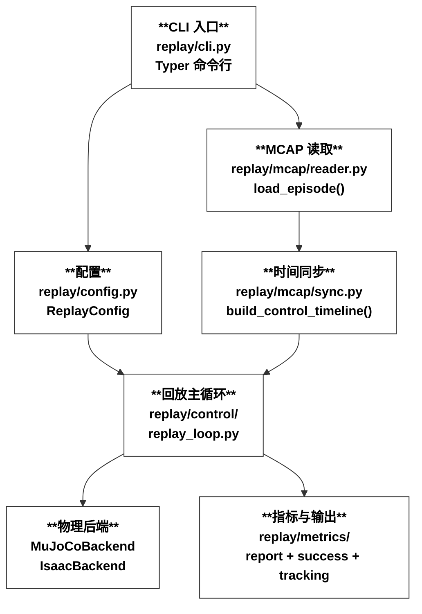
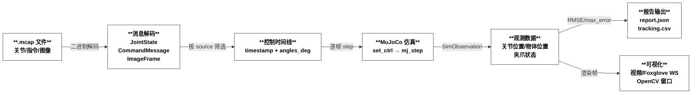
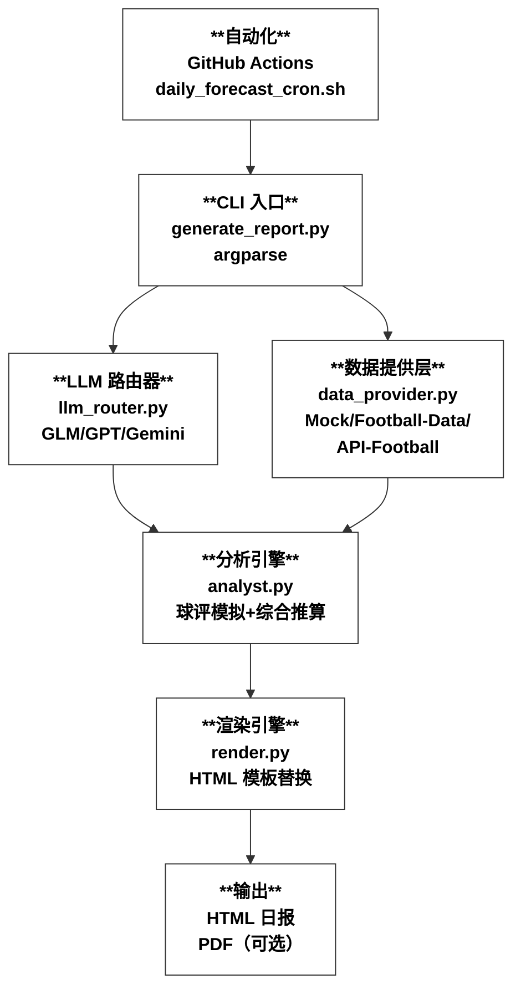
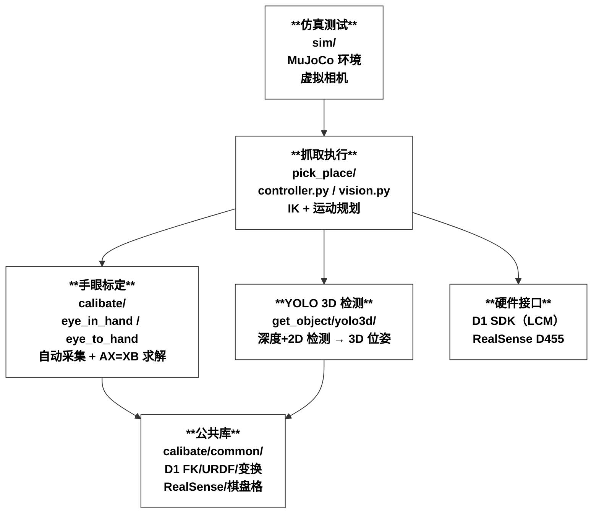
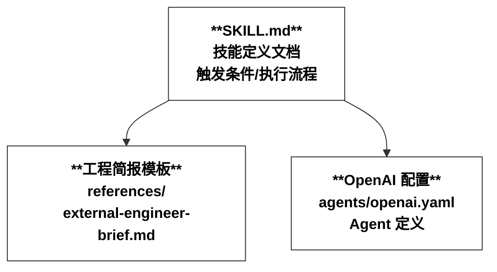
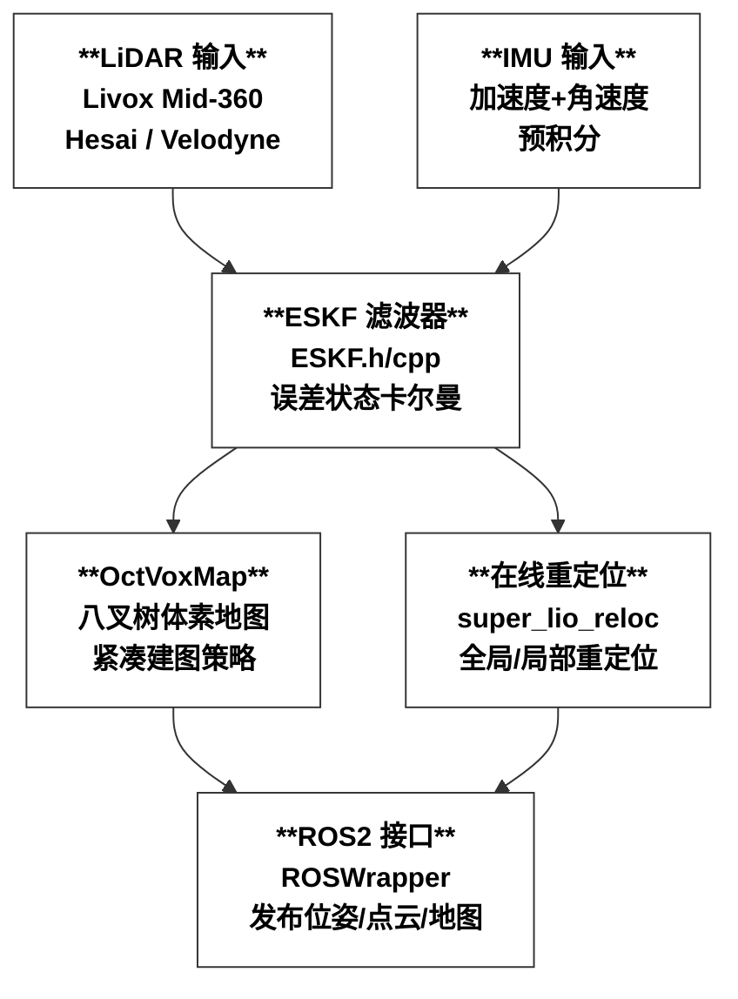
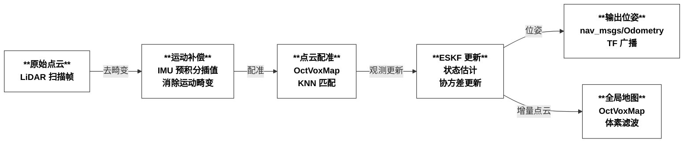
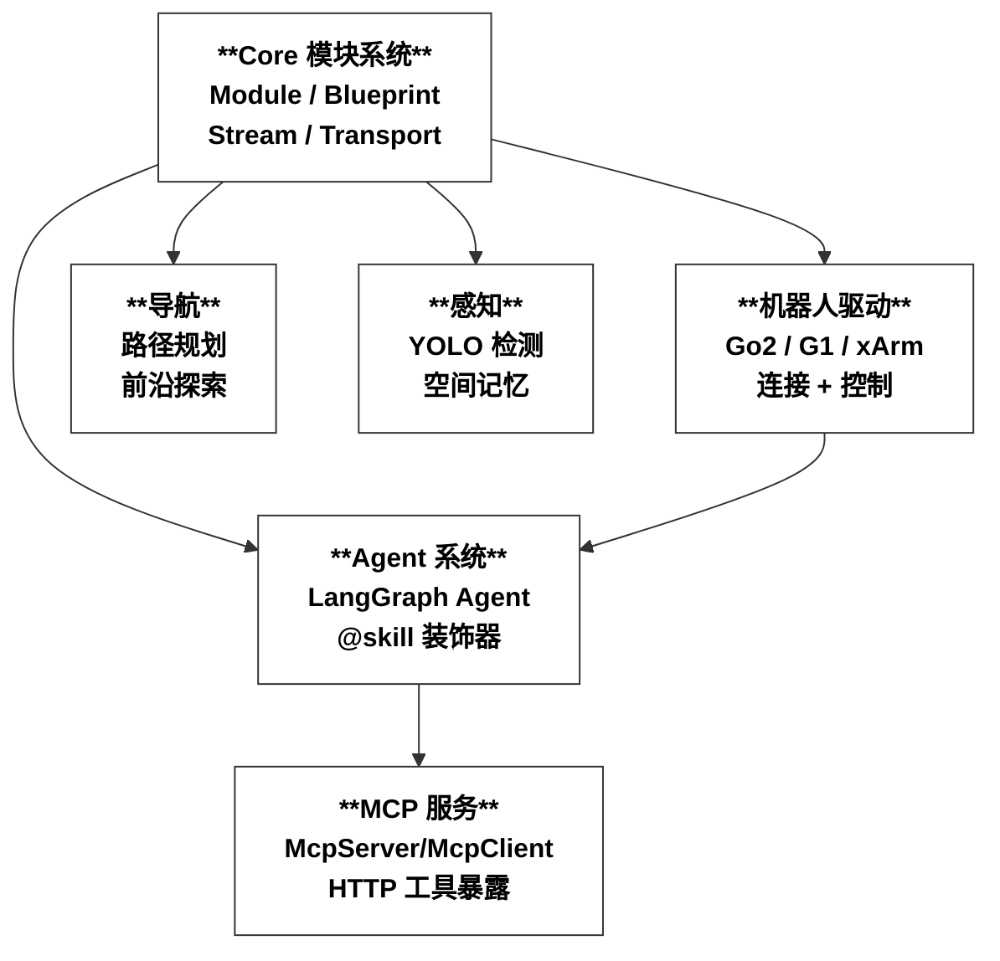

# topsun-bot 组织代码仓库分析报告

> 分析日期：2026-07-30 | 覆盖最近活跃的 6 个仓库

---

## 目录

1. [仓库总览](#1-仓库总览)
2. [sim — D1 MCAP 物理回放系统](#2-sim--d1-mcap-物理回放系统)
3. [ai-match-forecast — AI 赛事预测日报](#3-ai-match-forecast--ai-赛事预测日报)
4. [calibration — 手眼标定 + YOLO 3D + 抓取](#4-calibration--手眼标定--yolo-3d--抓取)
5. [skills — Cursor 自研技能](#5-skills--cursor-自研技能)
6. [Super-LIO — LiDAR 惯性里程计](#6-super-lio--lidar-惯性里程计)
7. [topsun_dimos — DimOS 定制分支](#7-topsun_dimos--dimos-定制分支)
8. [各仓库问题汇总](#8-各仓库问题汇总)

---

## 1. 仓库总览

| 仓库 | 语言 | 最近推送 | 简介 | 活跃度 |
|------|------|----------|------|--------|
| **topsun_dimos** | Python | 07-29 | DimOS 定制分支，G1 迎宾蓝图 | ⭐⭐⭐ |
| **skills** | YAML/MD | 07-29 | Cursor 自研 skill（ChatGPT Pro 委派） | ⭐ |
| **Super-LIO** | C++ | 07-28 | LiDAR-IMU 紧耦合里程计 | ⭐⭐ |
| **ai-match-forecast** | Python/HTML | 07-19 | AI 世界杯赛事预测日报生成器 | ⭐⭐ |
| **sim** | Python | 07-10 | D1 机械臂 MCAP 物理闭环回放 | ⭐⭐ |
| **calibration** | Python/C++ | 06-25 | D1 手眼标定 + YOLO 3D + 抓取 | ⭐⭐ |

---

## 2. sim — D1 MCAP 物理回放系统

**定位**：从 MCAP 录制文件中提取 D1 机械臂关节轨迹，在 MuJoCo（或 Isaac Sim）中闭环回放，对比 sim 与 real 的误差，输出跟踪精度报告和视频。

### 2.1 架构图

### 2.2 数据流图

### 2.3 发现的问题

| # | 严重度 | 问题 | 位置 |
|---|--------|------|------|
| 1 | 🔴 高 | **硬编码 MCAP 文件名** `eda9cc2192f7.mcap`，`default_data_paths()` 只认这一个文件，不支持多 episode 批量回放 | `config.py` |
| 2 | 🟡 中 | **Isaac 后端未实现**，`isaac_backend.py` 存在但无实质代码，`create_backend("isaac")` 会失败 | `backends/` |
| 3 | 🟡 中 | **夹爪映射有歧义**，`map_d1_gripper_deg()` 的 servo scale 0-60 → 度数映射是经验值，缺少校验或配置化 | `mujoco_backend.py` |
| 4 | 🟡 中 | **Foxglove 依赖可选但无 extras 定义**，`pyproject.toml` 中可能缺少 `[foxglove]` extra group | `pyproject.toml` |
| 5 | 🟢 低 | **`_grasp_attached` 物理伪造**：直接覆写 qpos 模拟抓取，非物理接触力，精度有限 | `mujoco_backend.py` |
| 6 | 🟢 低 | **无单元测试覆盖核心回放循环**，仅有 `test_mcap_reader.py` 和 `test_foxglove.py` | `tests/` |

---

## 3. ai-match-forecast — AI 赛事预测日报

**定位**：多模型（智谱 GLM-5.2 / GPT-4o / Gemini 2.5 Pro）驱动的足球赛事预测系统，通过 Gemini Google Search grounding 获取实时赛事数据，输出 HTML 日报。

### 3.1 架构图

### 3.2 数据流图

### 3.3 发现的问题

| # | 严重度 | 问题 | 位置 |
|---|--------|------|------|
| 1 | 🔴 高 | **使用 `urllib` 而非 `requests`**，违反项目代码规范，错误处理和重试逻辑不健壮 | `data_provider.py`, `llm_router.py` |
| 2 | 🔴 高 | **API Key 在 URL 中明文暴露**，Gemini `?key=xxx` 拼接，日志/异常堆栈可能泄露 key | `llm_router.py` |
| 3 | 🟡 中 | **`_safe_json()` 正则贪心匹配**，`re.search(r"\{.*\}", raw, re.DOTALL)` 会错误匹配嵌套 JSON 的外层 | `analyst.py` |
| 4 | 🟡 中 | **Football-Data 真实接入未实现**，`_fetch_football_data_matches()` 直接 `raise NotImplementedError` | `data_provider.py` |
| 5 | 🟡 中 | **全局可变状态 `_API_FOOTBALL_LAST_CALL`** 用于限速，多线程不安全 | `data_provider.py` |
| 6 | 🟡 中 | **无测试文件**，整个 `code/` 目录没有任何测试覆盖 | `code/` |
| 7 | 🟢 低 | **HTML 日报文件名含中文**（`日报-2026-07-19.html`），部分服务器/CI 环境可能有编码问题 | 根目录 |
| 8 | 🟢 低 | **`sys.path` 操作**，`generate_report.py` 通过 `sys.path.insert` 引入模块，非标准包管理方式 | `generate_report.py` |

---

## 4. calibration — 手眼标定 + YOLO 3D + 抓取

**定位**：D1 机械臂的完整视觉抓取管线——手眼标定（Eye-in-Hand / Eye-to-Hand）→ YOLO 3D 物体检测 → 逆运动学抓取。

### 4.1 架构图

### 4.2 数据流图

### 4.3 发现的问题

| # | 严重度 | 问题 | 位置 |
|---|--------|------|------|
| 1 | 🔴 高 | **目录名拼写错误** `calibate`（应为 `calibrate`），会导致可读性和搜索问题 | 根目录 |
| 2 | 🟡 中 | **`sys.path.insert` 跨目录引用**，`vision.py` 通过路径操作导入 `calibate` 和 `get_object`，非标准包结构 | `pick_place/vision.py` |
| 3 | 🟡 中 | **缺少 `pyproject.toml`**，只有 `requirements-dev.txt` 和 `requirements-docker.txt`，无标准化打包 | 根目录 |
| 4 | 🟡 中 | **仿真 vs 真实 camera 切换耦合**，`EyeToHandVision.__init__` 中通过 `sim_env is not None` 分支切换，逻辑混合 | `vision.py` |
| 5 | 🟢 低 | **`third_party` 目录管理**，第三方依赖以子目录形式存在，未使用 git submodule 或包管理器 | `third_party/` |
| 6 | 🟢 低 | **中英文注释混用**，代码注释和日志中文英文混合，国际化困难 | 全局 |

---

## 5. skills — Cursor 自研技能

**定位**：为 Cursor AI Agent 提供的自定义 skill，当前仅有一个 `topsun-delegate-to-chatgpt-pro`，用于将复杂任务委派给 ChatGPT Pro 执行。

### 5.1 架构图

### 5.2 发现的问题

| # | 严重度 | 问题 | 位置 |
|---|--------|------|------|
| 1 | 🟡 中 | **仓库过于空旷**，整个仓库只有 4 个文件，无 CI、无测试、无 `pyproject.toml` 或 `package.json` | 根目录 |
| 2 | 🟢 低 | **SKILL.md 极长**（170 行），绝大部分是流程规范文档，实际可执行逻辑为零，更适合放在 wiki 或 docs 中 | `SKILL.md` |
| 3 | 🟢 低 | **无版本管理**，技能文件缺少版本号和变更日志 | 根目录 |

---

## 6. Super-LIO — LiDAR 惯性里程计

**定位**：高精度 LiDAR-IMU 紧耦合里程计系统（RA-L 2026 论文），支持 ROS2，紧凑建图策略。

### 6.1 架构图

### 6.2 数据流图

### 6.3 发现的问题

| # | 严重度 | 问题 | 位置 |
|---|--------|------|------|
| 1 | 🟡 中 | **最近修复 NaN 问题**（commit `42a61372`），`RightJacobianSO3` 在小角度时数值不稳定，说明核心算法有边界条件风险 | `ESKF.cpp` |
| 2 | 🟡 中 | **重定位模块有 relocation issue**（commit `f89f48dc`，issue #29），近期才修复，稳定性待验证 | `super_lio_reloc.cpp` |
| 3 | 🟡 中 | **多分支混乱**，有 `ros_topsun`、`ros2_topsun`、`ros2_humble`、`ros2_foxy` 等 7 个分支，无 `main` 分支，维护困难 | 分支管理 |
| 4 | 🟢 低 | **无 CI/CD 配置**，C++ 项目缺乏自动构建和测试流水线 | 根目录 |
| 5 | 🟢 低 | **插值畸变校正**近期修改（`c66dd182`），核心算法仍在迭代中 | `super_lio.cpp` |

---

## 7. topsun_dimos — DimOS 定制分支

**定位**：基于 DimOS 框架的 topsun 定制版本，增加了 G1 人形机器人迎宾和导览功能。（代码即当前工作区，架构详见 `AGENTS.md`）

### 7.1 架构图

### 7.2 最近提交焦点

最近提交集中在 **G1 迎宾蓝图**（`feat(g1): Orin greeter onboard voice, TTS, and nav tuning`），包括：
- G1 迎宾与导览蓝图
- Orin 板载语音 TTS
- 导航参数调优
- CI lint 修复

### 7.3 发现的问题

| # | 严重度 | 问题 | 位置 |
|---|--------|------|------|
| 1 | 🟡 中 | **G1 迎宾代码与 CI 冲突**，最近 3 个 commit 中 2 个是修 CI lint 的，说明开发-测试循环不够紧密 | `.github/workflows/` |
| 2 | 🟡 中 | **处于 detached HEAD 状态**，当前 checkout 在 `a5259958` 而非分支，可能是 PR 合并后未切回 main | git 状态 |
| 3 | 🟢 低 | **大量 PR 合并集中在 05-29**（#97, #109, #104, #103），有批量合并代码质量风险 | git 历史 |

---

## 8. 各仓库问题汇总

### 按严重度分类

**🔴 高优先级（建议立即处理）**

| 仓库 | 问题 | 建议 |
|------|------|------|
| ai-match-forecast | 使用 `urllib` 而非 `requests` | 统一使用 `requests`，添加超时和重试 |
| ai-match-forecast | API Key 明文拼接 URL | 改用 Header 传递或环境变量加密 |
| calibration | 目录名 `calibate` 拼写错误 | 重命名为 `calibrate` |
| sim | 硬编码 MCAP 文件名 | 配置化，支持多 episode |

**🟡 中优先级（建议近期处理）**

| 仓库 | 问题 | 建议 |
|------|------|------|
| ai-match-forecast | 零测试覆盖 | 添加 pytest 单元测试 |
| ai-match-forecast | 正则贪心匹配 JSON | 使用 JSON parser 或非贪心正则 |
| calibration | `sys.path` 跨目录引用 | 统一为 Python 包结构 |
| calibration | 缺 `pyproject.toml` | 添加标准化打包配置 |
| sim | Isaac 后端未实现 | 补充实现或标记为 WIP |
| Super-LIO | 多分支无 main | 统一分支策略，确定主分支 |
| Super-LIO | 核心算法有 NaN 边界问题 | 添加数值稳定性测试 |
| skills | 仓库过于空旷 | 考虑合并到主仓库 |
| topsun_dimos | CI lint 频繁修复 | 添加 pre-commit hooks |

**🟢 低优先级（建议后续优化）**

- sim：抓取物理伪造、测试不足
- ai-match-forecast：中文文件名、`sys.path` 操作
- calibration：第三方依赖管理、注释风格统一
- Super-LIO：无 CI/CD
- skills：版本管理

### 整体建议

1. **统一项目结构**：各 Python 仓库应统一使用 `pyproject.toml` + `uv`/`pip` 标准化包管理
2. **补充 CI/CD**：`calibration` 和 `Super-LIO` 缺乏自动化测试和构建
3. **提升测试覆盖**：`ai-match-forecast` 和 `sim` 的测试覆盖率极低
4. **安全审计**：API Key 管理需要统一规范，避免明文暴露
5. **分支策略**：`Super-LIO` 需要确定主分支，减少维护成本
