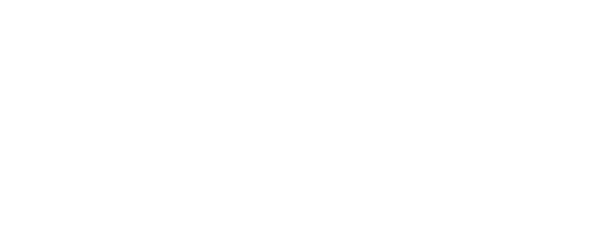
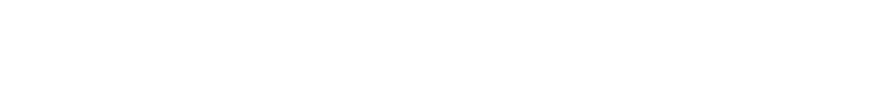

# Cockpit

The cockpit is the built-in web app for dimOS robots. It shows camera, map, keyboard teleop, chat panels, and others. You define the panels and their layout in your Python blueprint, next to the robot's other modules, and the page follows the blueprint. You do not need to build a frontend. A panel can also be a full-page tab (the resource stats page). The relay serves the same app to every viewer, so the cockpit has no plug-in mechanism. If you need a panel of your own, build a page with the [web SDK](/docs/web/web_sdk.md) instead.

## Run it

Locally, add `--local-relay` to any `dimos run`. dimos starts a relay on your machine, connects the robot to it, and opens `http://127.0.0.1:7780/` in your browser:

```bash
uv run dimos --simulation run --local-relay unitree-go2-cockpit
```

This needs the `web` extra. A blueprint without a `cockpit(...)` call still gets a default cockpit: video, map with the robot's position, keyboard teleop. A blueprint that contains `cockpit(...)` always runs the bridge, and starts a local relay by itself when you give it no `--relay-url`. Details on the [Bridge](/docs/web/bridge.md) page.

The local relay only works from a browser on the same machine. Browsers allow WebTransport only on secure pages, and `http://<lan-ip>` is not one. To reach a robot from another machine, point it at a hosted relay with `--relay-url` and open that relay's address in the browser. The page then asks for a viewer token. See [Relay](/docs/web/relay.md) and [Relay hosting](/docs/web/relay_hosting.md).

The browser needs WebTransport. Chromium and Firefox are the tested ones.

## What you see


The header holds, from left to right:

- `Overview` and one tab per page, when the blueprint declares pages.
- The `panels` / `channels` switch. `panels` is the grid. `channels` is a table of every channel the robot advertises, with its encoding, rate, age, sequence number and latest value.
- The connection state (`connected`, `reconnecting` with the next retry, `failed`), the watched robot's name and model, `switch robot` when the relay has more than one robot, and `log out` when a viewer token is stored.

Each panel has a title bar with a health badge (`waiting`, `stale 3 s`, `14.0 fps`) and a maximize button. Esc restores the grid.

When several robots are registered on the relay, the page shows a picker. A lone robot is watched automatically. When the relay requires a viewer token, the page shows a token form instead. The token stays in the browser's local storage until you log out.

Two notices can replace the grid. "Waiting for a robot to register" means no robot is connected yet (or the page is still connecting, the header shows which). "This robot's software is newer than this Cockpit build" means the robot sent a manifest this page cannot read. Reload, the relay serves the newest cockpit.


## Describe the layout in Python

`cockpit()` returns a blueprint. Compose it onto a robot with `autoconnect`, the same way you add any module. This is [`unitree_go2_cockpit.py`](/dimos/robot/unitree/go2/blueprints/smart/unitree_go2_cockpit.py#L20):

```python skip
from dimos.core.coordination.blueprints import autoconnect
from dimos.robot.unitree.go2.blueprints.smart.unitree_go2 import unitree_go2
from dimos.web.cockpit import Col, Map2D, Map3D, Row, Teleop, Video, cockpit

unitree_go2_cockpit = autoconnect(
    unitree_go2,
    cockpit(
        layout=Row(
            Col(Video("color_image"), Map3D()),
            Col(
                Map2D(path="path", click="clicked_point", stop="stop_movement"),
                Teleop(),
                shares=[3, 1],
            ),
            shares=[2, 1],
        ),
    ),
)
```

`Row` splits the space horizontally, `Col` vertically. Both take panels or nested splits, plus an optional `shares` list with one number per child (equal shares when omitted). The tree above renders like this:

<details>
<summary>diagram source</summary>

```pikchr fold output=assets/layout.svg
color = white
fill = none
boxrad = 5px
margin = 0.06in

V: box "Video" wid 2.2in ht 0.8in
D: box "Map3D" wid 2.2in ht 0.8in with .nw at V.sw + (0, -0.05in)
M: box "Map2D" wid 1.1in ht 1.2in with .nw at V.ne + (0.05in, 0)
T: box "Teleop" wid 1.1in ht 0.4in with .nw at M.sw + (0, -0.05in)

line from (V.w.x, V.n.y + 0.12in) to (M.e.x, V.n.y + 0.12in)
text "Row shares=[2, 1]" with .s at (0.5 * (V.w.x + M.e.x), V.n.y + 0.16in)
line from (V.w.x - 0.12in, V.n.y) to (V.w.x - 0.12in, D.s.y)
text "Col" with .e at (V.w.x - 0.18in, 0.5 * (V.n.y + D.s.y))
line from (M.e.x + 0.12in, M.n.y) to (M.e.x + 0.12in, T.s.y)
text "Col shares=[3, 1]" with .w at (M.e.x + 0.18in, 0.5 * (M.n.y + T.s.y))
```

</details>



Panels named in `pages=[...]` render as full-page tabs instead of grid cells. A panel can appear in both places. With no `layout` and no `channels`, `cockpit()` uses the default preset: `Row(Video("color_image"), Col(Map2D("global_costmap", "odom"), Teleop(), shares=[3, 1]), shares=[2, 1])`. That is also what `--local-relay` gives a blueprint that has no `cockpit()` at all.

`cockpit()` compiles the tree into a manifest, a small JSON document the bridge sends to the relay and the relay hands to every viewer. It lists the panels, the layout, and the channels the panels need, and the page subscribes to exactly those. Everything is checked when the blueprint is defined, not when the robot starts:

```python
from dimos.web.cockpit import Col, Map2D, Row, Stats, Teleop, Video, cockpit

blueprint = cockpit(
    layout=Row(Video("color_image"), Col(Map2D(), Teleop(), shares=[3, 1]), shares=[2, 1]),
    pages=[Stats()],
)
manifest = blueprint.blueprints[0].kwargs["manifest"]
for panel in manifest["panels"]:
    print(panel["id"], panel["kind"], panel["channels"])
print(manifest["layout"])
print(manifest["pages"])
for channel in manifest["channels"]:
    print(channel["ch"], channel["encoding"], channel["delivery"], channel["maxHz"])
```

```results
p0 video ['color_image']
p1 map2d ['global_costmap', 'odom']
p2 teleop ['tele_cmd_vel']
p3 stats ['resource_stats']
{'row': ['p0', {'col': ['p1', 'p2'], 'shares': [3, 1]}], 'shares': [2, 1]}
['p3']
color_image jpeg.v1 latest 30.0
odom pose.json.v1 reliable 20.0
global_costmap costmap.zlib.v1 latest 5.0
resource_stats stats.json.v1 latest 2.0
tele_cmd_vel twist.json.v1 latest 15.0
```

An impossible tree or a wrong stream fails right there:

```python
from dimos.web.cockpit import Row

try:
    Row()
except ValueError as e:
    print(e)
```

```results
Row needs at least one child
```

Change the layout and rerun the robot: the browser rearranges. A panel you dropped stops its channel at the source, unless another panel, a page, the channels tab or another viewer still needs it (see [Which channels the page reads](#which-channels-the-page-reads)).

## Panels

Every panel takes a `title` (shown in its title bar, the panel id when empty) and the names of the streams it reads. Stream names are matched by `autoconnect` against the robot's modules. A stream that no module publishes is still advertised, and its panel shows `waiting for data`.

Which names a panel can use depends on the stream:

- The bridge has four built-in ports with fixed codecs: `color_image`, `odom`, `global_costmap` and `tele_cmd_vel`. The default panel arguments name them.
- Map2D's `path`, `click` and `stop`, Map3D's `cloud`, Chat's four streams and Stats' `resource_stats` are declared by the panel itself, so any name works there.
- Video's `stream`, and Map2D's `costmap` and `pose`, must be a built-in port or a `Channel` in `channels=[...]` that repeats what the panel asks for: the encoding, the delivery, and the panel's params (`quality` for Video). Teleop always drives `tele_cmd_vel`.

A second camera, for example:

```python
from dimos.msgs.sensor_msgs.Image import Image
from dimos.web.cockpit import Channel, Row, Video, cockpit

blueprint = cockpit(
    layout=Row(Video("color_image"), Video("front_cam", title="front")),
    channels=[
        Channel(
            "front_cam",
            Image,
            encoding="jpeg.v1",
            delivery="latest",
            max_hz=30.0,
            params={"quality": 75},
        )
    ],
)
for channel in blueprint.blueprints[0].kwargs["manifest"]["channels"]:
    print(channel["ch"], channel["encoding"], channel["delivery"], channel["maxHz"])
```

```results
color_image jpeg.v1 latest 30.0
front_cam jpeg.v1 latest 30.0
```

Without the `Channel`, `Video("front_cam")` fails when the blueprint is defined:

```python
from dimos.web.cockpit import Video, cockpit

try:
    cockpit(layout=Video("front_cam"))
except ValueError as e:
    print(e)
```

```results
unknown stream 'front_cam'; this robot bridge supports: color_image, global_costmap, odom
```

### Video

`Video(stream="color_image", *, max_hz=30.0, quality=75, title="")`

One `Image` stream as JPEG frames. `max_hz` caps the frame rate and `quality` is the JPEG quality (0 to 100).

### Map2D

`Map2D(costmap="global_costmap", pose="odom", *, path=None, click=None, stop=None, costmap_hz=5.0, pose_hz=20.0, title="")`

A 2D occupancy grid (`OccupancyGrid`) with the robot's pose (`PoseStamped`) drawn on it. `pose=None` drops the marker. Three optional streams make the map interactive:

- `path`: a `Path` stream drawn as a line (the planner's current plan).
- `click`: a click on the map publishes a `PointStamped` on this stream (the planner takes it as a goal).
- `stop`: a cancel button that publishes a `Bool` on this stream. It is shown while a path is active.

The Go2 blueprints use `path="path"`, `click="clicked_point"` and `stop="stop_movement"`.

### Map3D

`Map3D(cloud="global_map", pose="odom", *, res=0.05, max_hz=1.0, pose_hz=20.0, title="")`

The world in 3D: a `PointCloud2` stream drawn as one point per voxel, coloured by height, with the robot's pose (`PoseStamped`) as a red cone. `pose=None` drops the cone and the follow toggle. Drag to orbit, wheel to zoom, right-drag to pan. The `follow` toggle keeps the camera a few metres behind and above the robot as it drives. Orbit, zoom and pan then hold relative to the robot.

`cloud` is any point cloud, the mapper's whole-world map by default. The bridge quantizes it to `res` metres (the mapper's own voxel size by default) and sends occupancy bits, not points: the Go2's office-sized map costs about 100 KB per frame instead of the 6 MB of its LCM encoding. A map over a million voxels is sent coarser. An empty cloud clears the panel. `max_hz` caps the frame rate. The renderer (three.js) is downloaded only by pages that show this panel.

### Teleop

`Teleop(stream="tele_cmd_vel", *, max_linear=0.8, max_angular=1.0, boost=2.0, publish_hz=15.0, watchdog_ms=300.0, title="")`

Keyboard driving. Publishes `Twist` messages on `stream`. `max_linear` (m/s) and `max_angular` (rad/s) are the speeds the keys command, `boost` multiplies both while Shift is held, `publish_hz` is how often the held keys are resent, and `watchdog_ms` is how long the bridge waits without a command before it stops the robot. See [Keyboard teleop](#keyboard-teleop).

### Chat

`Chat(input="human_input", messages="agent", idle="agent_idle", audio="audio_in", *, title="")`

The conversation with the robot's agent (the same streams the `humancli` tool uses). Typed text goes out on `input`, the agent's messages come back on `messages`, `idle` drives the thinking indicator, and the push-to-talk microphone sends recordings on `audio`. The blueprint needs the agent modules (the `agents` extra) and ffmpeg for the audio. The microphone button appears only on a secure page.

### Stats

`Stats(*, title="Stats")`

Live CPU, memory, thread and file-descriptor numbers for every worker process, like the `dtop` tool. Meant for `pages=[...]`. It turns the resource monitor on for the run (`--no-dtop` still wins).

## Keyboard teleop

Click the teleop panel to arm it. While it is armed:

| Key | Effect |
|---|---|
| W / S | forward / backward |
| Q / E | strafe left / right |
| A / D | turn left / right |
| Shift | boost (speeds times `boost`) |
| Space | emergency stop (the robot stops, the panel stays armed) |
| Esc | disarm |

Releasing the last key sends a zero command, repeated twice over 200 ms, and the panel stays armed. Focus leaving the panel, the window losing focus and the tab being hidden all disarm and zero (Esc disarms by dropping focus), and a disconnect disarms. A key that stays pressed keeps the robot moving: nothing can tell a held key from a stuck one, and the watchdog below only catches silence. Only one viewer can drive a robot at a time. A second viewer that arms gets `teleop_held` until the first one disarms or disconnects.

Three hops make sure that a broken link stops the robot instead of leaving it moving:

1. The cockpit sends a zero and releases the lease on every disarm (Esc, focus loss, a hidden tab), and disarms locally on a disconnect. This covers a closed or backgrounded tab.
2. The relay releases the lease and tells the bridge to stop when the driving viewer disconnects or switches robots. This covers a page that vanished.
3. The bridge stops the robot on its own after `watchdog_ms` (300 ms by default) without a command. This hop is authoritative and covers a dead relay or a dead network. It works even when the relay is killed and no goodbye reaches either end.

<details>
<summary>safety diagram</summary>

```pikchr fold output=assets/teleop_chain.svg
color = white
fill = none
boxrad = 5px
margin = 0.06in

C: box "1. Cockpit" "zero on every" "disarm" wid 1.2in ht 0.8in
arrow right 0.7in "commands" above
R: box "2. Relay" "releases the lease," "sends teleop_stop" wid 1.5in ht 0.8in
arrow right 0.7in "commands" above
B: box "3. Bridge" "zero after watchdog_ms" "of silence (300 ms default)" wid 2.0in ht 0.8in
arrow right 0.7in "Twist" above
M: box "robot" wid 0.8in ht 0.8in
```

</details>



The mechanism on the bridge side (generation numbers, clamps, why zeros are sent only once) is on the [Bridge](/docs/web/bridge.md#teleop-watchdog) page.

## Which channels the page reads

The page subscribes to every channel it can use as soon as it loads, whatever tab or panel is visible, and keeps those subscriptions until the manifest changes. The bridge encodes a channel only while at least one viewer is subscribed, so an open page keeps the robot encoding its cheap channels.

Cheap means channels with a JSON encoding, and LCM encodings whose message has no variable-length array. They are read for the channels tab whether or not a panel shows them. Video frames, costmaps, voxel maps and LCM messages with variable-length arrays (point clouds, scans, paths) are read only when a panel binds them or a [web SDK](/docs/web/web_sdk.md) page subscribes. A channel whose encoding the cockpit cannot decode is listed with `no decoder` and left alone.

The reason to have this distinction (cheap/expensive) is because you normally want everything present even if you're not focused on it. But some messages are espensive, so only those are excluded.

## Ready-made blueprints

- `unitree-go2-cockpit`: the Go2 navigation stack with video, the 3D voxel map, an interactive map (goal clicks, path, cancel) and teleop.
- `unitree-go2-agentic-cockpit`: the same plus the agent chat with push-to-talk, a full-page camera tab and the stats tab. It replaces the older `WebInput` page of the agentic blueprint.

They are [`unitree_go2_cockpit.py`](/dimos/robot/unitree/go2/blueprints/smart/unitree_go2_cockpit.py) and [`unitree_go2_agentic_cockpit.py`](/dimos/robot/unitree/go2/blueprints/agentic/unitree_go2_agentic_cockpit.py).
