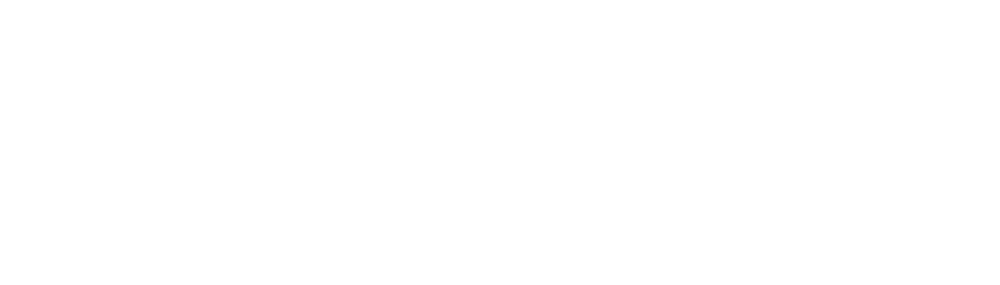

# Web

The web project is how you can view robot data and teleop the robot from a browser. There are two primary methods: the cockpit (where you used established panels to construct a UI for your robot) or the web SDK (where you can construct your own UI however you like).

Both version operate through a relay. You can run it on your computer, or host it on a server so the robot can be reached from anywhere.

<details>
<summary>diagram</summary>

```pikchr fold output=assets/overview.svg
color = white
fill = none
boxrad = 5px
margin = 0.06in

Robot: [
  M: box "modules" "camera, planner, ..." wid 1.4in ht 0.65in
  B: box "Bridge" wid 0.9in ht 0.65in with .w at M.e + (0.3in, 0)
  arrow <-> from M.e to B.w
  text "Robot: dimOS runtime" bold with .sw at M.nw + (0, 0.1in)
]
RB: box dashed wid Robot.wid + 0.3in ht Robot.ht + 0.3in at Robot

R: box "Relay" "PC or server" wid 1.2in ht 0.65in with .w at (RB.e.x + 0.75in, Robot.M.y)

Browser: [
  C: box "Cockpit" wid 1.1in ht 0.5in
  text "or" with .n at C.s + (0, -0.02in)
  S: box "Your app" "(web SDK)" wid 1.1in ht 0.55in with .n at last text.s + (0, -0.02in)
  text "Browser" bold with .sw at C.nw + (0, 0.1in)
] with .w at (R.e.x + 0.9in, R.y + 0.15in)
BB: box dashed wid Browser.wid + 0.3in ht Browser.ht + 0.3in at Browser

arrow from (RB.e.x, R.y + 0.12in) to (R.w.x, R.y + 0.12in) "data" above
arrow from (R.w.x, R.y - 0.12in) to (RB.e.x, R.y - 0.12in) "commands" below
arrow from (R.e.x, R.y + 0.12in) to (BB.w.x, R.y + 0.12in) "data" above
arrow from (BB.w.x, R.y - 0.12in) to (R.e.x, R.y - 0.12in) "commands" below
```

</details>



Common terms:

* A **blueprint** is the Python description of a robot: which modules run and how they connect.
* A **module** is one component of the robot's software (a camera driver, a planner) running in the dimOS runtime.
* A **stream** is a typed flow of messages between modules.
* A **channel** carries one stream between the robot and the browser, in one direction and with one encoding.
* A **manifest** lists the channels and panels a robot offers, and every viewer receives it from the relay.

## Try it

No robot needed. This simulates a Go2 robot on your machine and opens the cockpit in your browser:

```bash
uv run dimos --simulation run --local-relay unitree-go2-agentic-cockpit
```

The page at `http://127.0.0.1:7780/` shows the camera, the map with the robot's position, and a teleop panel (you can drive with the keyboard), and a chat panel for the robot's agent (it needs an `OPENAI_API_KEY`, like the other agentic blueprints).

## Pages

Using it:

- [Cockpit](/docs/web/cockpit.md): the prebuilt app, and how to describe its panels and layout in Python.
- [Web SDK](/docs/web/web_sdk.md): build your own page or app against the relay.
- [Bridge](/docs/web/bridge.md): the module inside the robot process that feeds the relay, with its channels, encodings and codecs.

Deploying it:

- [Relay](/docs/web/relay.md): the server in the middle, local and hosted modes, flags, auth and TLS.
- [Relay hosting](/docs/web/relay_hosting.md): step by step on a VM with Docker and a certificate, or on a LAN.

Contributing:

- [Development](/docs/web/development.md): the Deno workspace, dev servers, builds and tests.
- [Wire protocol](/docs/web/protocol.md): framing, messages, delivery modes and the WebTransport workarounds.
