# 从零理解 dimos Spatial Memory — 让机器人"记住"去过的地方

> 本文面向所有希望理解 dimos 空间记忆系统的开发者, 需要对 Python、向量数据库有基本概念即可。
> 基于 dimos `main`（upstream）分支 commit `b45e5d581`。

---

## 目录

- [一、通俗篇：空间记忆是怎么回事](#一通俗篇空间记忆是怎么回事)
- [二、总览：Spatial Memory 的 3 层架构](#二总览spatial-memory-的-3-层架构)
- [三、第一代 SpatialMemory 模块详解](#三第一代-spatialmemory-模块详解)
- [四、第二代 memory2 存储引擎详解](#四第二代-memory2-存储引擎详解)
- [五、语义搜索与 Agent 技能](#五语义搜索与-agent-技能)
- [六、可视化体系](#六可视化体系)
- [七、端到端实战 — 运行 Go2 空间记忆蓝图](#七端到端实战--运行-go2-空间记忆蓝图)
- [八、扩展点和延伸阅读](#八扩展点和延伸阅读)

---

# 一、通俗篇：空间记忆是怎么回事

> **这一章 0 代码、0 框架、0 dimos 类名**, 只讲领域概念。

## 1.1 为什么需要空间记忆?（动机）

想象你是一只狗, 主人说"去厨房拿拖鞋"。你能做到是因为:

1. **你走过家里每个房间**, 眼睛拍了无数"照片"
2. **你记住了每张照片对应的位置** — 在客厅看到沙发, 在厨房看到冰箱
3. **你能用语言检索** — 听到"厨房"就想到冰箱那个位置

机器人也需要同样的能力。这就是 **空间记忆 (Spatial Memory)**:

```
                  眼睛(摄像头)
                      │
                  拍照片(图像帧)
                      │
               ┌──────┴──────┐
               │  我在哪?    │  ← 里程计/TF
               │  (x, y, θ)  │
               └──────┬──────┘
                      │
          ┌───────────┴───────────┐
          │  把照片变成"数字指纹"   │  ← CLIP 向量嵌入
          │  (512维向量)           │
          └───────────┬───────────┘
                      │
           ┌──────────┴──────────┐
           │  存到"记忆数据库"     │  ← 向量数据库
           │  (位置 + 指纹 + 时间) │
           └──────────┬──────────┘
                      │
           ┌──────────┴──────────┐
           │  "厨房在哪?" → 检索  │  ← 语义搜索
           │  → 返回 (x, y, θ)   │
           └─────────────────────┘
```

## 1.2 空间记忆的关键概念

| 概念 | 类比 | 作用 |
|------|------|------|
| **观察 (Observation)** | 一张带位置标签的照片 | 记录某时刻、某位置看到了什么 |
| **嵌入 (Embedding)** | 照片的"数字指纹" | 把图像/文字变成可比较的向量 |
| **流 (Stream)** | 相册里的一本分类册 | 同类型数据的有序序列 |
| **存储 (Store)** | 整个相册柜 | 管理所有分类册的数据库 |
| **回放 (Replay)** | 倒带播放录像 | 用历史数据模拟实时运行 |
| **命名位置 (Tagged Location)** | 在地图上插大头针 | 给某个位置起名字, 如"办公桌" |

## 1.3 两代记忆系统的演进

dimos 的空间记忆经历了两代:

```
第一代: SpatialMemory (dimos/perception/)
  ├── ChromaDB 向量数据库
  ├── CLIP 图像嵌入
  └── VisualMemory 图像存储
        ↓ 演进
第二代: memory2 (dimos/memory2/)
  ├── SQLite + sqlite-vec 向量搜索
  ├── 统一 Stream API
  ├── 懒加载 + 流式处理
  └── Recorder / SemanticSearch 模块
```

**第一代**功能完整, 目前仍是蓝图中默认使用的版本; **第二代**架构更干净, 支持录制回放, 正在逐步替代第一代。

## 1.4 核心流程的直觉解释

整个空间记忆可以概括为三句话:

1. **边走边记** — 机器人每走一段距离就拍一张照, 算出图像指纹, 连同位置一起存入数据库
2. **开口就查** — Agent 或人类说"找到厨房", 系统把"厨房"也变成指纹, 和数据库里所有照片指纹比对, 找到最像的
3. **查到就走** — 最像的照片带着位置信息, 把这个位置发给导航模块, 机器人就走过去了

## 1.5 CLIP 嵌入为什么能"听懂"自然语言?

CLIP (Contrastive Language-Image Pretraining) 是 OpenAI 的模型, 它的核心思想:

- 同时训练**图像编码器**和**文本编码器**
- 让"一张厨房照片"和"kitchen"这个词在向量空间里**距离很近**
- 这样搜索"kitchen"就等于搜索"看起来像厨房的照片"

这就是为什么机器人能用自然语言检索空间记忆。

---

# 二、总览：Spatial Memory 的 3 层架构

> 完整架构图 — 从传感器到 Agent 技能。

```mermaid
flowchart TB
    subgraph L1["第 1 层 — 传感器输入"]
        CAM["摄像头<br/>color_image: Image"]
        ODOM["里程计/TF<br/>world → base_link"]
    end

    subgraph L2["第 2 层 — 记忆引擎"]
        subgraph V1["第一代: SpatialMemory"]
            SP["SpatialMemory 模块<br/>dimos/perception/spatial_perception.py"]
            CLIP1["CLIP 嵌入提供器<br/>ImageEmbeddingProvider"]
            CHROMA["ChromaDB 向量库<br/>SpatialVectorDB"]
            VMEM["VisualMemory<br/>图像 pickle 存储"]
        end
        subgraph V2["第二代: memory2"]
            REC["Recorder 模块<br/>录制 In 端口到 SQLite"]
            SS["SemanticSearch 模块<br/>CLIP 嵌入 + 向量检索"]
            STORE["SqliteStore<br/>统一存储后端"]
            STREAM["Stream API<br/>懒加载/链式变换"]
        end
    end

    subgraph L3["第 3 层 — 上层消费者"]
        NAV["NavigationSkillContainer<br/>navigate_with_text / tag_location"]
        AGENT["McpClient Agent<br/>LLM 调用技能"]
        VIS["可视化<br/>Space / Plot / Rerun"]
    end

    CAM -->|color_image| SP
    ODOM -->|tf.get| SP
    SP --> CLIP1
    CLIP1 --> CHROMA
    CHROMA --> VMEM

    CAM -->|color_image| REC
    ODOM -->|tf| REC
    REC --> STORE
    STORE --> STREAM
    STREAM --> SS

    SP -->|SpatialMemorySpec| NAV
    SS -->|@skill search| AGENT
    NAV -->|@skill| AGENT
    STREAM --> VIS
```

| 层 | 模块 | 输入 | 输出 |
|----|------|------|------|
| 传感器 | 摄像头 / TF | 硬件 | `Image`, `TransformStamped` |
| 记忆引擎 (v1) | `SpatialMemory` | `color_image`, TF | ChromaDB 条目 |
| 记忆引擎 (v2) | `Recorder` → `SemanticSearch` | 任意 `In` 端口 | SQLite 记录, `Stream[EmbeddedObservation]` |
| 上层消费 | `NavigationSkillContainer`, `McpClient` | 语义查询 | `PoseStamped` 导航目标 |

---

# 三、第一代 SpatialMemory 模块详解

## 3.1 SpatialMemory — 边走边记的核心

文件: `dimos/perception/spatial_perception.py`

**问题**: 机器人走来走去, 怎么把"在哪看到了什么"自动存下来?

**答案**: 订阅摄像头图像流, 每隔一定距离/时间就拍一帧, 用 CLIP 计算嵌入向量, 连同 6DoF 位姿存入 ChromaDB。

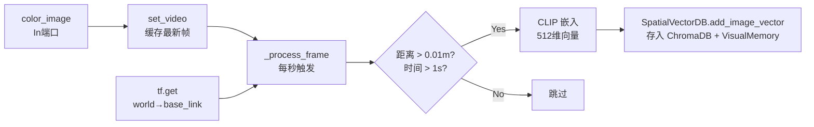

核心代码片段:

```python
# dimos/perception/spatial_perception.py:216-294
def _process_frame(self) -> None:
    tf = self.tf.get("world", "base_link")
    if tf is None or self._latest_video_frame is None:
        return
    current_pose = tf.to_pose()
    # 检查距离约束
    if self.last_position is not None:
        distance_moved = np.linalg.norm([...])
        if distance_moved < self.min_distance_threshold:
            return
    # 检查时间约束
    if self.last_record_time is not None:
        if time.time() - self.last_record_time < self.min_time_threshold:
            return
    # CLIP 嵌入 → 存入向量库
    frame_embedding = self.embedding_provider.get_embedding(self._latest_video_frame)
    self.vector_db.add_image_vector(
        vector_id=frame_id, image=self._latest_video_frame,
        embedding=frame_embedding, metadata=metadata,
    )
```

**配置参数表**:

| 字段 | 默认值 | 含义 |
|------|--------|------|
| `collection_name` | `"spatial_memory"` | ChromaDB 集合名称 |
| `embedding_model` | `"clip"` | 嵌入模型类型 |
| `embedding_dimensions` | `512` | 嵌入向量维度 |
| `min_distance_threshold` | `0.01` | 最小移动距离（米）才记录 |
| `min_time_threshold` | `1.0` | 最小时间间隔（秒）才记录 |
| `new_memory` | `True` | 是否清空旧记忆从头开始 |
| `db_path` | `assets/output/memory/spatial_memory/chromadb_data` | ChromaDB 持久化路径 |

## 3.2 SpatialVectorDB — 向量数据库封装

文件: `dimos/agents_deprecated/memory/spatial_vector_db.py`

**问题**: 怎么高效地存储和检索带位置信息的图像嵌入?

**答案**: 封装 ChromaDB, 提供三种查询方式: 按位置、按图像相似度、按文字。

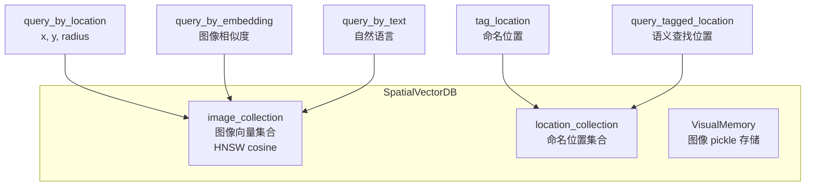

**三种查询方式对比**:

| 查询方式 | 方法 | 输入 | 原理 | 典型场景 |
|----------|------|------|------|----------|
| 位置查询 | `query_by_location` | x, y, radius | 欧氏距离过滤 | "这个点附近看到了什么" |
| 图像查询 | `query_by_embedding` | 图像 | CLIP 余弦相似度 | "哪里看到过类似的场景" |
| 文本查询 | `query_by_text` | 自然语言 | CLIP 文→图跨模态 | "厨房在哪里" |
| 标签查询 | `query_tagged_location` | 自然语言 | ChromaDB 文档搜索 | "回到办公桌" |

## 3.3 RobotLocation — 命名位置数据结构

文件: `dimos/types/robot_location.py`

**问题**: 怎么表示"办公桌"这样一个命名地点?

**答案**: 一个数据类, 包含名字 + 3D 位置 + 3D 旋转 + 元数据。

```python
# dimos/types/robot_location.py:26-49
@dataclass
class RobotLocation:
    name: str                                    # "kitchen"
    position: tuple[float, float, float]         # (x, y, z)
    rotation: tuple[float, float, float]         # (roll, pitch, yaw)
    frame_id: str | None = None
    timestamp: float = field(default_factory=time.time)
    location_id: str = field(default_factory=lambda: f"loc_{uuid.uuid4().hex[:8]}")
    metadata: dict[str, Any] = field(default_factory=dict)
```

## 3.4 SpatialMemorySpec — 跨模块调用协议

文件: `dimos/perception/spatial_memory_spec.py`

**问题**: 导航技能模块怎么调用 SpatialMemory 的方法?

**答案**: 通过 Spec Protocol 模式, 蓝图在构建时自动注入依赖。

```python
# dimos/perception/spatial_memory_spec.py:21-24
class SpatialMemorySpec(Spec, Protocol):
    def tag_location(self, robot_location: RobotLocation) -> bool: ...
    def query_tagged_location(self, query: str) -> RobotLocation | None: ...
    def query_by_text(self, text: str, limit: int = 5) -> list[dict]: ...
```

## 3.5 第一代完整数据流

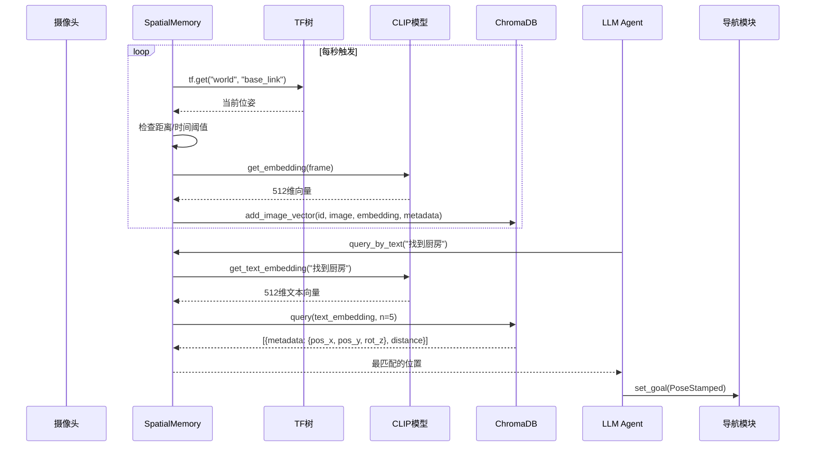

---

# 四、第二代 memory2 存储引擎详解

## 4.1 Store — 统一存储入口

文件: `dimos/memory2/store/base.py`, `dimos/memory2/store/sqlite.py`

**问题**: 第一代用 ChromaDB + pickle, 不够统一; 能不能所有数据都存在一个地方?

**答案**: `SqliteStore` — 一个 SQLite 文件包含所有 stream, 支持元数据、Blob、向量三层存储。

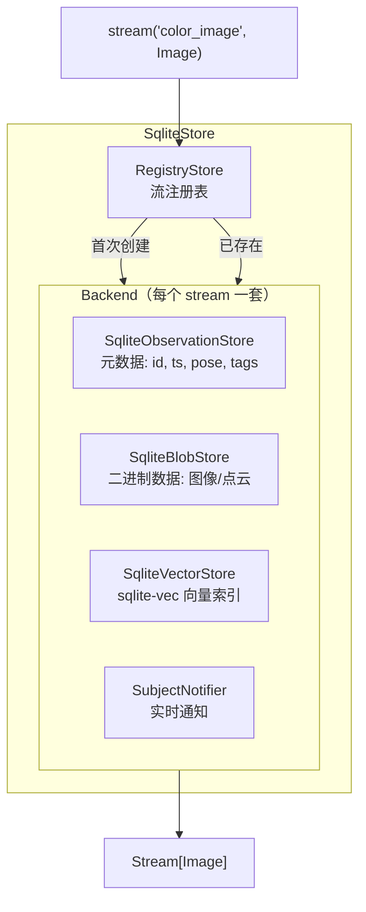

```python
# 打开一个录制文件, 列出所有流
from dimos.memory2.store.sqlite import SqliteStore
store = SqliteStore(path="recording.db")
for name, stream in store.streams.items():
    print(stream.summary())
# Stream("color_image"): 4164 items, ... (292.5s)
# Stream("lidar"): 2251 items, ...
```

## 4.2 Stream — 懒加载链式 API

文件: `dimos/memory2/stream.py`

**问题**: 怎么对记忆数据做过滤、变换、搜索, 又不一次性加载所有数据到内存?

**答案**: `Stream[T]` — 惰性迭代器, 所有操作都返回新 Stream, 直到真正迭代时才执行。

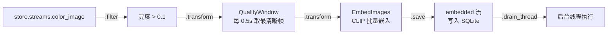

**Stream 核心 API 速查**:

| 方法 | 作用 | 示例 |
|------|------|------|
| `.filter(pred)` | 按条件过滤 | `.filter(lambda obs: obs.data.brightness > 0.1)` |
| `.transform(xf)` | 链式变换 | `.transform(EmbedImages(clip))` |
| `.map_data(fn)` | 映射数据 | `.map_data(lambda obs: obs.data.sharpness)` |
| `.search(vec, k=N)` | 向量搜索 | `.search(clip.embed_text("kitchen"))` |
| `.near(pose, r)` | 空间过滤 | `.near(robot_pose, 2.0)` |
| `.after(t)` / `.before(t)` | 时间过滤 | `.after(start_time)` |
| `.live()` | 实时尾追 | `.live().transform(...)` |
| `.save(target)` | 保存到另一个流 | `.save(embedded_stream)` |
| `.drain()` / `.drain_thread()` | 消费全部 | 触发惰性链执行 |
| `.to_list()` | 物化为列表 | 非 live 流转列表 |
| `.first()` / `.last()` | 取首/末条 | |
| `.count()` / `.summary()` | 统计信息 | |

## 4.3 Observation — 带位姿的时间戳数据

文件: `dimos/memory2/type/observation.py`

**问题**: 每条记忆里到底存了什么?

**答案**: `Observation[T]` — 包含 id、时间戳、位姿、标签、惰性数据的泛型容器。

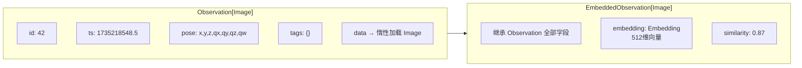

> **关键设计**: `obs.data` 是惰性的 — 元数据从 SQLite 读取很快, 而实际图像数据只在访问 `.data` 时才从 BlobStore 加载。这让遍历上千条记录不会撑爆内存。

## 4.4 Recorder — 自动录制模块

文件: `dimos/memory2/module.py:247-323`

**问题**: 怎么把机器人运行时的所有传感器数据录下来?

**答案**: 继承 `Recorder`, 声明想录的 `In` 端口, 自动存入 SQLite。

```python
# 示例: 录制彩色图像和激光雷达
class MyRecorder(Recorder):
    color_image: In[Image]
    lidar: In[PointCloud2]

# 蓝图中使用:
# blueprint.add(MyRecorder, db_path="session.db")
```

> **Replay 模式**: 当 `GlobalConfig.replay=True` 时, Recorder 自动禁用（不覆盖已有录制文件）。

## 4.5 SemanticSearch — 第二代语义搜索

文件: `dimos/memory2/module.py:192-237`

**问题**: 第二代的语义搜索怎么工作?

**答案**: 实时嵌入管线 + `@skill` 暴露给 Agent。

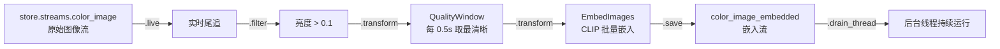

```python
# dimos/memory2/module.py:220-237
@skill
def search(self, query: str) -> PoseStamped:
    query_vector = self.model.embed_text(query)
    results = self.embeddings.search(query_vector)

    def _similarity(obs):
        return obs.similarity or 0.0

    return results.transform(peaks(key=_similarity, distance=1.0)).last().pose_stamped
```

> **`peaks()` 的作用**: 在相似度曲线上做峰值检测, 只保留真正突出的匹配, 过滤掉"还行但不够好"的结果。

## 4.6 Replay — 录制回放

文件: `dimos/memory2/replay.py`

**问题**: 怎么用历史录制数据模拟实时运行?

**答案**: `store.replay()` 返回一个 `Replay` 视图, 所有流共享同一个时间锚点, 按原始速度或倍速回放。

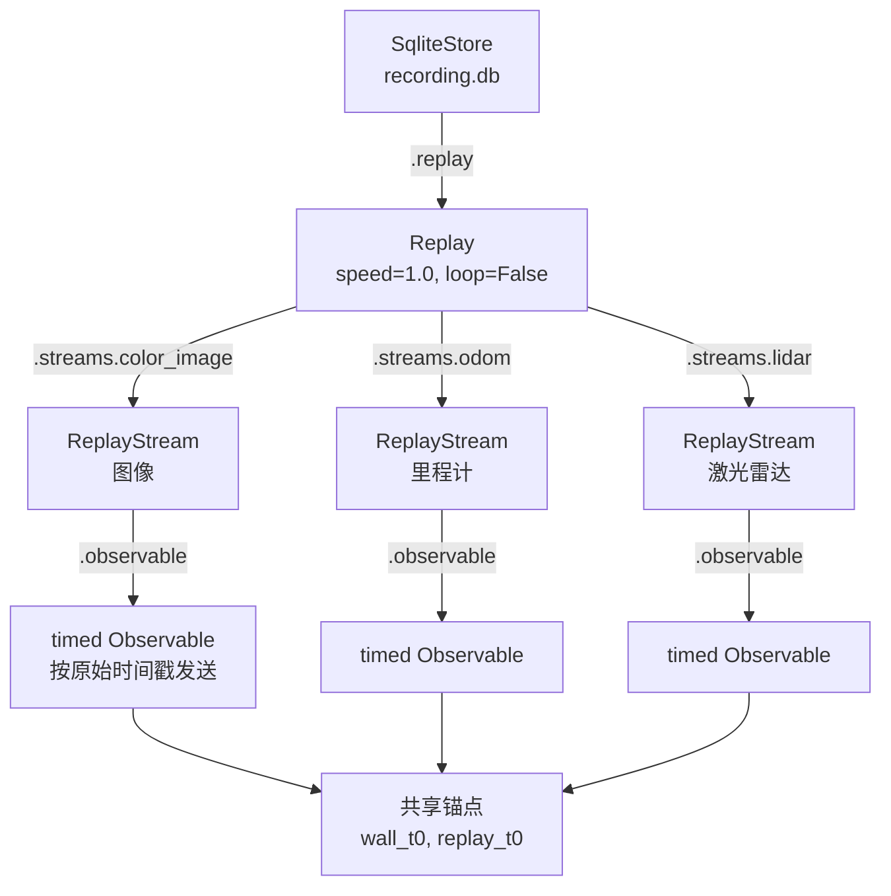

**Replay 配置**:

| 参数 | 类型 | 含义 |
|------|------|------|
| `speed` | `float` | 回放倍速, 1.0=原速 |
| `seek` | `float` | 跳过开头 N 秒 |
| `duration` | `float` | 只回放 N 秒 |
| `from_timestamp` | `float` | 从指定 Unix 时间戳开始 |
| `loop` | `bool` | 是否循环回放 |

## 4.7 Transform 工具箱

文件: `dimos/memory2/transform.py`

memory2 提供了丰富的流变换工具:

| 变换器 | 作用 | 典型用法 |
|--------|------|----------|
| `downsample(n)` | 每 N 帧取 1 帧 | 降低处理负载 |
| `throttle(interval)` | 按时间间隔采样 | 固定频率输出 |
| `QualityWindow(fn, window)` | 滑动窗口取最优 | 每 0.5s 取最清晰图像 |
| `EmbedImages(model)` | CLIP 批量嵌入 | 生成向量索引 |
| `speed()` | 计算速度 (m/s) | 分析运动轨迹 |
| `smooth(window)` | 滑动平均 | 平滑噪声数据 |
| `peaks(prominence, distance)` | 峰值检测 | 找到搜索结果中的显著峰 |
| `significant(method)` | 统计显著性过滤 | 去除非显著峰 |
| `normalize()` | 归一化到 [0,1] | 标准化数值范围 |

## 4.8 第二代完整架构总图

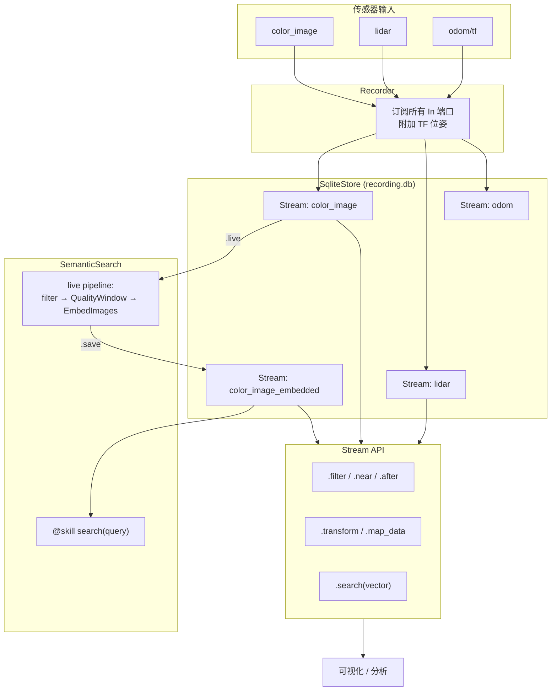

---

# 五、语义搜索与 Agent 技能

## 5.1 NavigationSkillContainer — 导航技能

文件: `dimos/agents/skills/navigation.py`

**问题**: LLM Agent 怎么让机器人"去厨房"?

**答案**: `NavigationSkillContainer` 暴露 `@skill` 方法, Agent 调用后按优先级尝试三种导航策略。

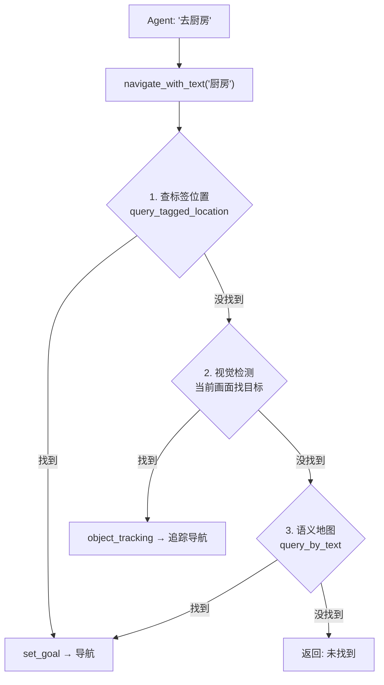

**两个关键 @skill 方法**:

```python
# tag_location — 给当前位置命名
@skill
def tag_location(self, location_name: str) -> str:
    """Tag this location in the spatial memory with a name."""
    # 读取当前 odom → 构造 RobotLocation → spatial_memory.tag_location()

# navigate_with_text — 用自然语言导航
@skill
def navigate_with_text(self, query: str) -> str:
    """Navigate to a location by querying the semantic map using natural language."""
    # 依次尝试: 标签匹配 → 视觉检测 → 语义地图搜索
```

## 5.2 CLIP 嵌入模型

文件: `dimos/models/embedding/clip.py`

| 方法 | 输入 | 输出 | 用途 |
|------|------|------|------|
| `embed(image)` | 一张或多张 `Image` | `Embedding` (512维) | 图像向量化 |
| `embed_text(text)` | 一段或多段文字 | `Embedding` (512维) | 文字向量化 |
| `compare_one_to_many` | query + candidates | 相似度张量 | GPU 加速批量比对 |

> **模型**: 默认使用 `openai/clip-vit-base-patch32`, 支持 GPU 推理, 在 `start()` 时做一次 warmup。

---

# 六、可视化体系

## 6.1 Space — 2D 空间画布

文件: `dimos/memory2/vis/space/space.py`

Space 是 memory2 的 2D 空间可视化画布, 支持智能分发:

```python
from dimos.memory2.vis.space.space import Space

drawing = Space()
drawing.add(global_map)                    # 占据栅格地图
drawing.add(store.streams.color_image)     # 按时间戳着色的轨迹
drawing.add(matches)                       # 搜索结果热力图
drawing.to_svg("output.svg")
```

## 6.2 Plot — 时序图表

文件: `dimos/memory2/vis/plot/plot.py`

```python
from dimos.memory2.vis.plot.plot import Plot
from dimos.memory2.transform import speed, smooth

plot = Plot()
plot.add(
    store.streams.color_image
    .transform(speed())
    .transform(smooth(50))
)
plot.to_svg("speed.svg")
```

## 6.3 Rerun 桥接

`dimos/memory2/vis/space/rerun.py` 和 `dimos/memory2/vis/plot/rerun.py` 支持将 Space/Plot 数据发送到 Rerun 可视化工具。

---

# 七、端到端实战 — 运行 Go2 空间记忆蓝图

## 7.1 蓝图拓扑

文件: `dimos/robot/unitree/go2/blueprints/smart/unitree_go2_spatial.py`

```python
unitree_go2_spatial = autoconnect(
    unitree_go2,                # 基础 Go2 栈（连接、感知、导航等）
    SpatialMemory.blueprint(),  # 空间记忆模块
    PerceiveLoopSkill.blueprint(),
    SecurityModule.blueprint(camera_info=GO2Connection.camera_info_static),
).global_config(n_workers=8)
```

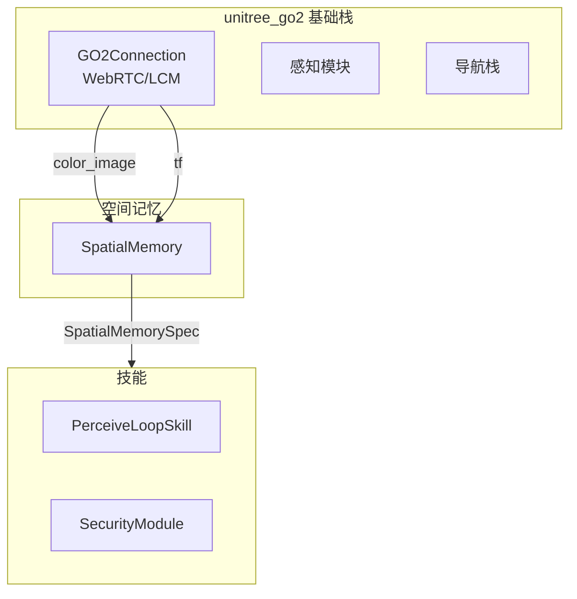

## 7.2 启动命令

### 实机运行（Go2 四足机器人）

```bash
# 带空间记忆的 Go2 基础栈
dimos run unitree-go2-spatial --robot-ip 192.168.123.161

# 带 Agent + MCP 的完整 agentic 栈（包含空间记忆 + 导航技能）
dimos run unitree-go2-agentic --robot-ip 192.168.123.161
```

### 回放模式（无需硬件）

```bash
# 使用录制数据回放
dimos --replay run unitree-go2-spatial

# agentic 版本回放
dimos --replay run unitree-go2-agentic
```

### G1 人形机器人

```bash
# G1 仿真（含空间记忆）
dimos --simulation run unitree-g1-agentic-sim

# G1 实机
dimos run unitree-g1-agentic --robot-ip 192.168.123.161
```

## 7.3 通过 MCP 与空间记忆交互

```bash
# 先启动 agentic 蓝图
dimos --replay run unitree-go2-agentic --daemon

# 查看可用技能
dimos mcp list-tools

# 标记当前位置
dimos mcp call tag_location --arg location_name="办公桌"

# 导航到语义位置
dimos mcp call navigate_with_text --arg query="kitchen"

# 用自然语言跟 Agent 对话
dimos agent-send "帮我找到客厅在哪里"
```

## 7.4 一次完整交互的时序图

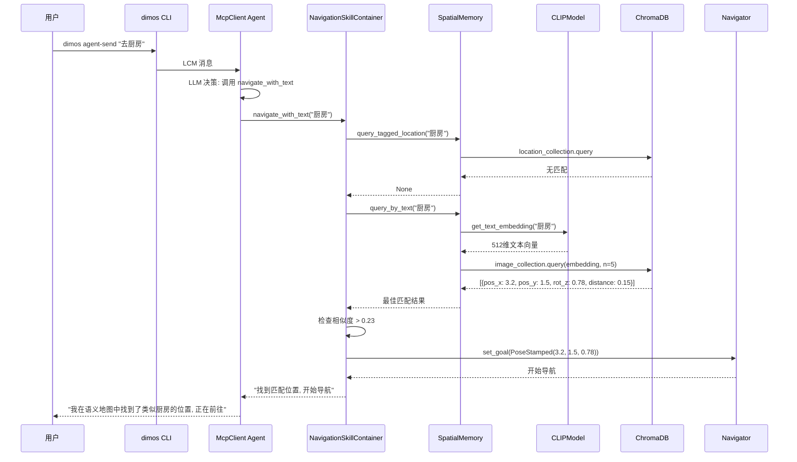

---

# 八、扩展点和延伸阅读

## 8.1 怎么用 memory2 Stream API 做自定义分析

```python
from dimos.memory2.store.sqlite import SqliteStore
from dimos.memory2.transform import speed, smooth, throttle
from dimos.models.embedding.clip import CLIPModel

# 打开录制
store = SqliteStore(path="recording.db")

# 查看速度变化
speeds = store.streams.color_image.transform(speed()).transform(smooth(50))
for obs in speeds:
    print(f"t={obs.ts:.1f} speed={obs.data:.2f} m/s")

# 语义搜索
clip = CLIPModel()
clip.start()
vec = clip.embed_text("corridor")
matches = store.streams.color_image_embedded.search(vec, k=10)
for obs in matches:
    print(f"similarity={obs.similarity:.3f} pose={obs.pose}")
```

## 8.2 怎么写自定义 Recorder

```python
from dimos.memory2.module import Recorder
from dimos.core.stream import In
from dimos.msgs.sensor_msgs.Image import Image
from dimos.msgs.sensor_msgs.PointCloud2 import PointCloud2

class MyRecorder(Recorder):
    color_image: In[Image]
    depth_image: In[Image]
    lidar: In[PointCloud2]

# 在蓝图中:
# autoconnect(robot_stack, MyRecorder.blueprint(db_path="my_session.db"))
```

## 8.3 推荐学习资料

| 主题 | 路径 |
|------|------|
| Module 系统 | `docs/usage/modules.md` |
| Blueprint 组合 | `docs/usage/blueprints.md` |
| memory2 官方文档 | `docs/capabilities/memory/index.md` |
| memory2 Plot 文档 | `docs/capabilities/memory/plot.md` |
| Agent 系统 | `docs/agents/` |
| CLI 使用 | `docs/usage/cli.md` / `docs/development/dimos_run.md` |
| 导航和建图教程 | `docs/cursor/dimos-navigation-mapping-tutorial.md` |

## 8.4 参数 Cheatsheet

| 想做的事 | 看哪 |
|----------|------|
| 调整记录频率 | `SpatialConfig.min_distance_threshold`（默认 0.01m）/ `min_time_threshold`（默认 1.0s） |
| 换嵌入模型 | `SpatialConfig.embedding_model`（默认 "clip"）/ `SemanticSearchConfig.embedding_model`（默认 `CLIPModel`） |
| 持久化路径 | `SpatialConfig.db_path` / `MemoryModuleConfig.db_path`（默认 "recording.db"） |
| 清空旧记忆 | `SpatialConfig.new_memory = True` |
| 回放速度 | `ReplayConfig.speed`（默认 1.0） |
| 跳过开头 | `ReplayConfig.seek`（秒） |
| 语义匹配阈值 | `NavigationSkillContainer._similarity_threshold`（默认 0.23） |
| Worker 数量 | `GlobalConfig.n_workers`（unitree_go2_spatial 设为 8） |
| MCP 端口 | `GlobalConfig.mcp_port`（默认 9990） |
| 向量搜索最大返回 | `SqliteVectorStore._DEFAULT_K`（默认 4096） |

---

> 文档基于 upstream/main `b45e5d581`。后续 dev 同步后细节可能调整, 但整体架构应保持稳定。
