# DimOS 建图 / 导航 / 规划模块两个月更新笔记 — 2026-03-01 → 2026-05-06

> 写给已经熟悉 dimos 基础概念（Module / Blueprint / Skill / OccupancyGrid）的开发者，**只看 Navigation、Mapping、Planning 这三条线**，重点圈出和 Unitree Go2 相关的改动。
>
> 数据范围：upstream/dev 分支上从 `2026-03-01` 到 `2026-05-06` 共 8 周内合并的所有 PR（约 32 个相关 commit），最新基于 commit `884e7ed02`。

---

## 目录

- [一、通俗篇：这两个月 nav/mapping 都干了啥](#一通俗篇这两个月-navmapping-都干了啥)
- [二、总览：32 个 commit 的主题地图](#二总览32-个-commit-的主题地图)
- [三、建图层：从点云到栅格的演进](#三建图层从点云到栅格的演进)
- [四、规划层：A\* + 点击导航 + replanning](#四规划层a--点击导航--replanning)
- [五、自主探索 — 巡逻模块大特性](#五自主探索--巡逻模块大特性)
- [六、Memory2 子系统 — 把"记忆"当作模块](#六memory2-子系统--把记忆当作模块)
- [七、Go2 平台演进 — 5 条直接相关的 PR](#七go2-平台演进--5-条直接相关的-pr)
- [八、可视化与 UX — Rerun 一统天下](#八可视化与-ux--rerun-一统天下)
- [九、升级注意事项与 cheatsheet](#九升级注意事项与-cheatsheet)

---

# 一、通俗篇：这两个月 nav/mapping 都干了啥

> 0 dimos 类名、0 Python 代码，纯讲"哪些事情以前不行，现在行了"。

## 1.1 一句话总结

**这两个月，dimos 的导航/建图/规划几乎是被全方位改造了一遍**：你能用鼠标点击地图导航了、机器人能自己巡逻整个房间了、有了一个全新的"记忆数据库"能让机器人记住自己看过什么、Go2 这台机器人也升级到了"既能用 webrtc 又能直连 DDS"两条腿走路。

## 1.2 五件最直观的事

**1）你点哪儿，机器人就去哪儿。** 以前用 Go2 必须写代码或者发 LCM 命令才能让它走路。现在打开浏览器看 Rerun viewer，鼠标点地图上某个点，机器人就开始往那走。

**2）机器人自己会巡逻。** 以前你得自己写个"覆盖路径"算法或者手动给一串目标点。现在新加了一个 patrolling 模块，跟它说一句 "start patrol"，它自己挑下一个该去的点，走过的地方记录下来不重复访问，整个房间走完为止。三种策略可选：随机、覆盖优化（voronoi 骨架优先）、frontier（往未知区域走）。

**3）机器人有了"长期记忆"。** 全新的 memory2 子系统，专门给机器人存它"看到 / 听到 / 走过"的东西。可以问它"上次你看到那个红色椅子在哪？"——它去翻自己的记忆数据库，用 CLIP 模型做语义搜索，给你一个坐标，规划器接过来就能去。

**4）Go2 现在能直接对话了。** 以前 dimos 跟 Go2 沟通必须走 webrtc（适合远程控制，但延迟高、协议不稳定）。这两个月加了一条直连 DDS 的路径，用 Unitree 自家的 SDK，本地局域网里命令延迟从 100ms 下降到 ~10ms。还顺手解锁了 Rage Mode（最大前进 2.5 m/s）。

**5）Voxel 地图绘图速度快了 10 倍。** 以前点云是用一个个小立方体（Box3D）画的，1.5 万个体素 viewer 直接卡。现在改成球体（Sphere/Points3D），画法快、看着也好看。

## 1.3 为什么会有这一波更新？

dimos 的核心定位是"通用的机器人模块系统"，但去年年底的实际状态是：**架子搭好了，但"机器人本身的大脑"还很薄**。具体说有 4 个长期痛点：

| 痛点 | 旧状态 | 谁觉得难受 |
|---|---|---|
| 没有 "记忆" | 机器人重启就忘所有东西，每次都要重新建图 | 任何想做长时段任务的人 |
| 没有"覆盖性探索" | 只有手动给目标点 + frontier 一种自主探索 | 想让机器人自己跑遍整间房子的人 |
| Go2 只能 webrtc | 延迟高、协议复杂、不能跑高频控制 | 想做精确控制 / 高频反馈的人 |
| 鼠标点击地图导航做不到 | 必须发 LCM 命令或写代码 | 任何 demo / 现场 / 调试的人 |

这两个月这 4 件事都被解决了。

## 1.4 哪 5 条线最值得关心？

按"未来你会怎么用 dimos"排序：

1. **memory2 子系统**（PR #1536, #1682, #1769, #1925）— 这是 dimos 未来一年的"知识层"基础设施，**所有需要"长期记忆"的特性都将基于它**
2. **patrolling 模块**（PR #1488, #1939）— 完整的自主巡逻能力，agent 一句话就能跑
3. **Go2 SDK adapter**（PR #1885）— 一条全新的真机控制路径，从 webrtc 解放
4. **clicked_point + dimos-viewer**（PR #1394, #1414）— 让 demo 现场指挥变成"鼠标点击就行"
5. **Frontier patrol router**（PR #1488）— 主动寻找未知区域填进地图

---

# 二、总览：32 个 commit 的主题地图

## 2.1 时间线 — 按月看

```mermaid
flowchart LR
  subgraph m03early["3 月初 — 点击导航 + 多机基础"]
    p1394["clicked_point + viewer click<br/>#1394 (3-04)"]
    p1414["dimos-viewer 集成<br/>#1414 (3-05)"]
    p1487["Go2 fleet support<br/>#1487 (3-07)"]
  end

  subgraph m03mid["3 月中 — Memory2 + Patrol 起步"]
    p1511["temporal memory + rerun<br/>#1511 (3-12)"]
    p1525["Go2 G1 split layout<br/>#1525 (3-12)"]
    p1536["Memory2 子系统初版<br/>#1536 (3-15)"]
    p1488["patrolling 模块<br/>#1488 (3-17)"]
    p1362["Go2 webrtc TwistBase<br/>#1362 (3-21)"]
  end

  subgraph m04early["4 月初 — 持续打磨"]
    p1682["memory2 StreamModule<br/>#1682 (4-09)"]
    p1747["rerun pipeline 延迟优化<br/>#1747 (4-04)"]
    p1793["voxel 改 sphere<br/>#1793 (4-17)"]
  end

  subgraph m04mid["4 月中 — Go2 起飞"]
    p1903["Go2 rage mode webrtc<br/>#1903 (4-22)"]
    p1769["memory2 plotting/Recorder<br/>#1769 (4-24)"]
    p1885["Go2 SDK adapter cyclonedds<br/>#1885 (4-27)"]
  end

  subgraph m05["5 月初 — 收尾"]
    p1925["memory2 go2 autorecorder fix<br/>#1925 (5-01)"]
    p1939["patrol async 重写<br/>#1939 (5-01)"]
  end

  m03early --> m03mid --> m04early --> m04mid --> m05
```

## 2.2 按主题分类的完整 PR 列表

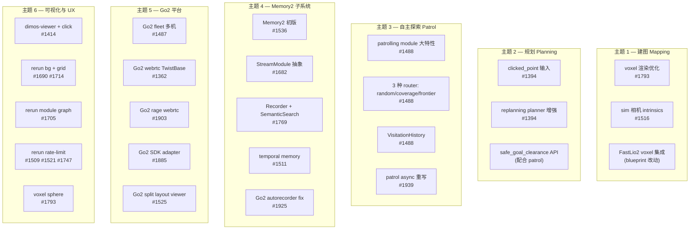

## 2.3 影响面对照表

**A. 大特性（5 个）— 大概率改你的 blueprint**

| # | PR | 影响范围 |
|---|---|---|
| #1488 | patrolling module | 新增 `dimos/navigation/patrolling/`、新 skill `start_patrol`/`stop_patrol`、加进 `unitree-go2` blueprint |
| #1536 | Memory2 子系统 | 新增 `dimos/memory2/`，~3000 行；重写整个 memory 层 |
| #1769 | Memory2 增强 | `Recorder`、`SemanticSearch`、`MemoryModule` 基类 |
| #1885 | Go2 SDK adapter | 新增 `dimos/hardware/drive_trains/unitree_go2/adapter.py`，新 blueprint `unitree-go2-keyboard-teleop` |
| #1414 | dimos-viewer | 替换 stock rerun 为 `dimos-viewer`，全 dimos blueprint 默认启用 click-to-nav |

**B. 中特性（4 个）— 局部范围**

| # | PR | 影响范围 |
|---|---|---|
| #1394 | clicked_point input | `ReplanningAStarPlanner` 加 `clicked_point: In[PointStamped]` |
| #1487 | Go2 fleet | 新 `Go2FleetConnection` + `unitree-go2-fleet` blueprint |
| #1362 | Go2 webrtc TwistBase | Go2 接入 ControlCoordinator，新 `unitree-go2-coordinator` |
| #1903 | Go2 rage mode | `unitree-go2-webrtc-rage-keyboard-teleop` blueprint |

**C. 优化与修复（5 个）**

| # | PR | 影响 |
|---|---|---|
| #1793 | voxel sphere | 渲染 ~10× 速度，删掉 Go2 blueprint 里 `_convert_global_map` |
| #1939 | patrol async | `PatrollingModule` 改 async；接口未变 |
| #1925 | go2 autorecorder fix | replay 模式跳过 Recorder、Image JPEG 改 RGB |
| #1747 | rerun latency | bridge 内部 backpressure |
| #1511 | temporal memory | `unitree-go2-temporal-memory` blueprint 强化 |

## 2.4 大架构图：这些 PR 改了哪些层

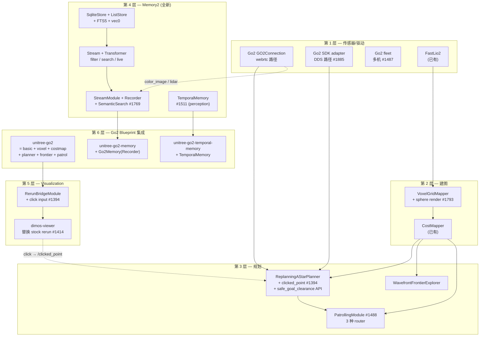

每一层在后面都有专门一章。

---

# 三、建图层：从点云到栅格的演进

> 本章涉及 PR：#1793 voxel sphere · #1525 split layout · #1747 rerun latency · #1516 sim camera intrinsics。

## 3.1 dimos 现有的建图栈（截至 5-06）

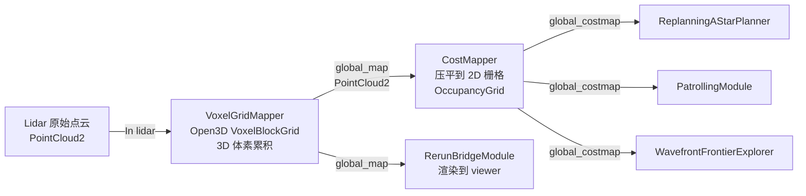

**注意一点**：`VoxelGridMapper` 的 `lidar` 是 `In[PointCloud2]`，而 Go2 上"lidar 数据"实际从哪来？看 `unitree_go2_basic.py` 没有 lidar 模块，是因为 Go2 自带 4D Lidar 直接走 webrtc/DDS 的传感器路径，由 `GO2Connection` 把 `lidar` 流发出来给 VoxelGrid 用——一切靠 `autoconnect` 按 `(name, type)` 自动接好。

## 3.2 PR #1793 — voxel 渲染从 Boxes3D 改成 Points3D（Spheres）

**问题**：`PointCloud2.to_rerun(mode="boxes")` 给每个体素画一个小立方体。1.5 万个体素 → 在 rerun viewer 里 4-5 fps，鼠标拖视角直接卡死。

**答案**：换成 `Points3D` + `radii=voxel_size/2`，rerun 内部用球体 splat 渲染，GPU 一把梭。

代码层面就两行（`dimos/msgs/sensor_msgs/PointCloud2.py:650-707`）：

```python
def to_rerun(
    self,
    voxel_size: float = 0.05,
    mode: str = "spheres",   # 旧默认是 "points"
    ...
) -> Any:
    ...
    return rr.Points3D(
        positions=points,
        radii=voxel_size / 2,
        colors=point_colors,
        class_ids=class_ids,
    )
```

`unitree_go2_basic.py` 里同步删掉了：

```python
# 删除前
def _convert_global_map(grid):
    return grid.to_rerun(voxel_size=0.1, mode="boxes")

rerun_config = {
    "visual_override": {
        "world/global_map": _convert_global_map,  # ← 删掉
    },
    "max_hz": {
        "world/global_map": 5,  # ← 改成 0（不限速）
    },
}
```

| 对比项 | 旧（Boxes3D） | 新（Points3D + spheres） |
|---|---|---|
| 1 万体素帧率 | ~4 fps | ~30 fps |
| GPU 占用 | 高 | 低 |
| 视觉效果 | 像素化 | 平滑 |
| `max_hz` 限速 | 必须设 5（不然卡死） | 设 0（不限速） |

## 3.3 PR #1525 — Go2 / G1 base blueprint 加 Camera | 3D split layout

`unitree_go2_basic.py` 加了一个 `_go2_rerun_blueprint()`，让 viewer 默认显示左右分屏：

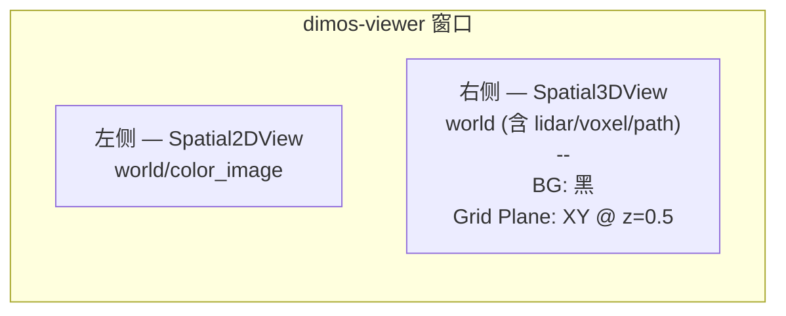

代码：

```python
def _go2_rerun_blueprint() -> Any:
    return rrb.Blueprint(
        rrb.Horizontal(
            rrb.Spatial2DView(origin="world/color_image", name="Camera"),
            rrb.Spatial3DView(
                origin="world",
                name="3D",
                background=rrb.Background(kind="SolidColor", color=[0, 0, 0]),
                line_grid=rrb.LineGrid3D(plane=rr.components.Plane3D.XY.with_distance(0.5)),
                overrides={"world/lidar": rrb.EntityBehavior(visible=False)},
            ),
            column_shares=[1, 2],
        ),
        rrb.TimePanel(state="hidden"),
        rrb.SelectionPanel(state="hidden"),
    )
```

注意 `world/lidar` 默认隐藏——因为 voxel map 已经把累积的体素显示出来了，原始 lidar 点会让画面太乱。

## 3.4 PR #1747 / #1509 / #1521 — rerun pipeline 限速优化

3 个相关 PR 共同解决一件事：**rerun viewer OOM 问题**。

| PR | 改动 |
|---|---|
| #1509 | RerunBridgeModule 加 `max_hz` 配置：每个 entity path 单独限速 |
| #1521 | 只对"重消息类型"（Image、PointCloud2）限速，其它类型放行 |
| #1747 | bridge 内部加 backpressure：rerun viewer 慢时丢老数据，不让 dimos 主流水线被堵 |

`max_hz` 在每个 blueprint 里配置：

```python
rerun_config = {
    "max_hz": {
        "world/global_map": 0,    # 0 = 不限速（voxel 现在是球体了）
        "world/color_image": 0,   # 0 = 不限速
        "world/global_costmap": 0,
    },
}
```

设为 0 表示"现在不需要限速了"——这是 #1793 voxel sphere 优化之后的连锁效果。

## 3.5 PR #1516 — sim 相机用真实 intrinsics

之前在 mujoco/unity 仿真里，相机内参是写死的；rerun viewer 渲染 3D 反投影会和真实视角对不上。修复后 simulator 输出的 `CameraInfo` 用 sim engine 实际的相机参数，反投影正确。**对所有用 sim + viewer 调试的人都有意义**。

---

# 四、规划层：A* + 点击导航 + replanning

> 本章涉及 PR：#1394 clicked_point + replanning planner · #1414 dimos-viewer 集成。

## 4.1 ReplanningAStarPlanner 现在的 4 个输入

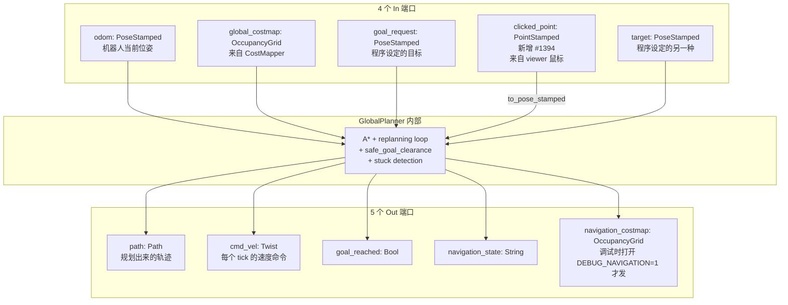

## 4.2 PR #1394 — clicked_point 输入怎么接通的

新增的 4 行代码（`dimos/navigation/replanning_a_star/module.py:67-73`）：

```python
self.register_disposable(
    Disposable(
        self.clicked_point.subscribe(
            lambda pt: self._planner.handle_goal_request(pt.to_pose_stamped())
        )
    )
)
```

`PointStamped.to_pose_stamped()` 会保留 `(x, y, z)`，姿态用 identity quaternion——因为鼠标点击只能给位置，朝向就让规划器到那儿之后保持当前朝向。

LCM topic 约定是 `/clicked_point` + `PointStamped` 类型，autoconnect 会自动按 `(stream_name, type)` 找到匹配的发布者。

## 4.3 PR #1414 — 把鼠标点击送到 LCM 的全链路

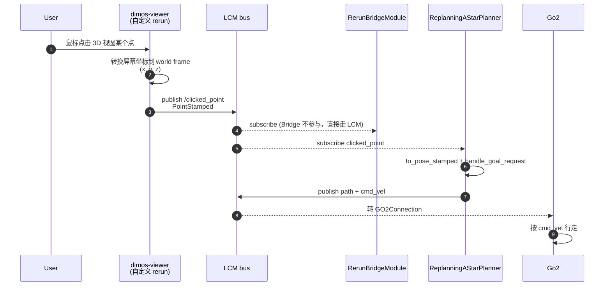

注意 **dimos-viewer 是个独立 npm 包**：

```
pip install dimos[viewer]   # 把 dimos-viewer>=0.30.0a1 拉进来
```

Bridge 在启动时优先 `rerun_bindings.spawn(executable_name="dimos-viewer")`，找不到才 fall back 到 stock `rr.spawn()`。stock rerun 没有点击 → LCM 这条管线，所以**只有装了 dimos-viewer 才有 click-to-navigate**。

## 4.4 配套：safe_goal_clearance 的 RPC

`ReplanningAStarPlanner` 同时新增了 3 个 RPC（来自 #1488 patrol PR，但 planner 内部加在这里）：

```python
@rpc
def set_replanning_enabled(self, enabled: bool) -> None: ...

@rpc
def set_safe_goal_clearance(self, clearance: float) -> None: ...

@rpc
def reset_safe_goal_clearance(self) -> None: ...
```

为什么？**巡逻模块需要这两个开关**：

- `set_replanning_enabled(False)` —— 巡逻时 router 已经挑了一个完全可达的目标，不需要规划器再做"卡住时换目标"的 replanning
- `set_safe_goal_clearance(...)` —— 巡逻给的目标点 clearance 是按机器人旋转直径定的，比平时严格

巡逻结束后调 `reset_safe_goal_clearance()` 恢复默认。

## 4.5 跑起来 — Go2 + 点击导航最简流程

```bash
# 1. 装 dimos-viewer（已经是核心依赖了，不用单独装）
# 2. 启动完整 Go2 stack
dimos --replay run unitree-go2

# 3. dimos-viewer 自动弹窗
# 4. 鼠标在 3D 视图上点一下 → 机器人开始走
```

`unitree-go2` blueprint 等价于：

```python
unitree_go2 = autoconnect(
    unitree_go2_basic,           # GO2Connection + RerunBridge + WebsocketVis
    VoxelGridMapper.blueprint(),  # 点云 → voxel
    CostMapper.blueprint(),       # voxel → costmap
    ReplanningAStarPlanner.blueprint(),  # 含 clicked_point 输入
    WavefrontFrontierExplorer.blueprint(),
    PatrollingModule.blueprint(),
).global_config(n_workers=9, robot_model="unitree_go2")
```

---

# 五、自主探索 — 巡逻模块大特性

> 本章涉及 PR：#1488 patrol module 大特性 · #1939 patrol async 重写。

## 5.1 问题：原来的"自主探索"只有一种

dimos 之前**只有 frontier exploration 一种自主行走方式**：找到地图边界（已知和未知的交界线）→ 选最近的 frontier → 让规划器去那儿。但 frontier 用完了机器人就停下了，**没法做"我已经知道这是个房间，去把每个角落都看一遍"** 这种"覆盖性巡逻"。

## 5.2 答案：3 种 router + 1 个统一 module

PR #1488 引入了一整套：

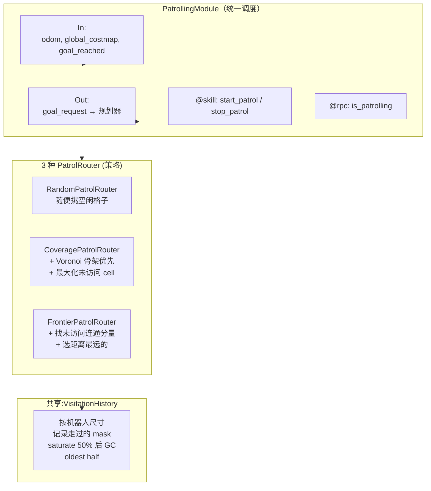

## 5.3 三种 router 的"性格"

| Router | 适合场景 | 工作原理 | 缺点 |
|---|---|---|---|
| **random** | 测试 / 没什么要求 | 在 safe mask 里随机选一个未访问的 cell | 路径来回跳，效率低 |
| **coverage** | 室内打扫式遍历 | 1）对地图做 Voronoi gradient 拿到"骨架"  2）骨架附近的 cell 给高权重  3）Min-cost A\* 一次出 7 个候选，挑最远的 | 大房间需要时间收敛 |
| **frontier** | 探索未知区域 | 1）找连通分量  2）按 size / distance 评分  3）选最佳分量里距离最远的 cell | 完成探索后停下 |

**默认是 `coverage`**——`PatrollingModule.__init__` 写死了：

```python
self._router = create_patrol_router("coverage", clearance_radius_m)
```

要换成 `frontier` 或 `random`，得修改源码或者派生子类（短期内会做成 config 字段）。

## 5.4 VisitationHistory — 不会随地图变化重置

巡逻需要记住"哪些 cell 已经走过"。如果直接在 OccupancyGrid 上标记 mask，地图增长 / 重启就丢了。所以新增了 `VisitationHistory`：

- **存的是世界坐标点**（`list[(x, y)]`），不是栅格 cell
- 来一张新 grid 就用现有的世界点重建 mask
- 当 visited 占地图 **50% 时**触发"半数 GC"：丢掉最旧的一半点
- 每个点用机器人尺寸的 disk 在 mask 上画圆，所以"走过一次相当于覆盖一个机器人身大小的区域"

```python
class VisitationHistory:
    _saturation_threshold = 0.50    # 50% 时触发 GC
    _min_distance_m = 0.05          # 5cm 以内的两点算同一个，不重复存
    
    def handle_odom(self, x, y):
        if self._points and (...) ** 2 + (...) ** 2 < self._min_distance_m ** 2:
            return  # 抖动过滤
        self._points.append((x, y))
        ...
        if self.get_saturation() >= self._saturation_threshold:
            n = len(self._points)
            self._points = self._points[n // 2:]  # 砍掉最老一半
            self._rebuild()
```

## 5.5 PR #1939 — 改成 async 之后的代码长什么样

PR #1488 初版用 `threading.Lock + asyncio.run_coroutine_threadsafe`，后来 #1939 借助 `feat(modules): async modules`（#1920，详见 [上一篇升级笔记](/docs/cursor/dimos-upstream-update-2026-05-06.md)）整个改写：

```python
class PatrollingModule(Module):
    odom: In[PoseStamped]
    global_costmap: In[OccupancyGrid]
    goal_reached: In[Bool]
    goal_request: Out[PoseStamped]

    async def main(self) -> AsyncGenerator[None, None]:
        yield
        await self._stop_patrolling()

    async def handle_odom(self, msg: PoseStamped) -> None:
        self._latest_pose = msg
        self._router.handle_odom(msg)

    async def handle_global_costmap(self, msg: OccupancyGrid) -> None:
        self._router.handle_occupancy_grid(msg)

    async def handle_goal_reached(self, _msg: Bool) -> None:
        self._goal_reached_event.set()

    @skill
    async def start_patrol(self) -> str:
        """Start patrolling the known area..."""
        if self._patrol_task and not self._patrol_task.done():
            return "Patrol is already running. Use `stop_patrol` to stop."

        self._router.reset()
        self._planner_spec.set_replanning_enabled(False)
        self._planner_spec.set_safe_goal_clearance(
            self._global_config.robot_rotation_diameter / 2 + EXTRA_CLEARANCE
        )
        self._patrol_task = asyncio.create_task(self._patrol_loop())
        return "Patrol started. Use `stop_patrol` to stop."

    async def _patrol_loop(self) -> None:
        while True:
            goal = self._router.next_goal()
            if goal is None:
                logger.info("No patrol goal available, retrying in 2s")
                await asyncio.sleep(2.0)
                continue
            self._goal_reached_event.clear()
            self.goal_request.publish(goal)
            await self._goal_reached_event.wait()
```

零锁，单 asyncio loop，整 120 行。**对外接口和 #1488 完全一致**（同样的 skill 名字、同样的 In/Out 端口）。

## 5.6 跑起来 — agent 一句话开启巡逻

`unitree-go2-agentic` 已经内置了 `PatrollingModule`：

```bash
dimos --replay run unitree-go2-agentic
```

然后 LLM 端：

```
你: 把这个房间巡逻一下
agent: [tool: start_patrol] Patrol started. Use stop_patrol to stop.
agent: 我已经开始巡逻了，会按 coverage 策略走遍房间已知的所有区域。
```

巡逻进行中机器人按 router 的 `next_goal()` 不停产生新目标，每到一个就标记 visited，直到大部分区域都走过为止。说"停下"：

```
你: 停
agent: [tool: stop_patrol] Patrol stopped.
```

---

# 六、Memory2 子系统 — 把"记忆"当作模块

> 本章涉及 PR：#1536 初版 · #1682 StreamModule cleanup · #1769 plotting + Recorder + SemanticSearch · #1925 Go2 autorecorder fix · #1511 temporal memory。

## 6.1 为什么需要 Memory2？

之前的 dimos 有一个 `dimos/memory/` 子包，但它是**单一目的的时序数据库**——存"机器人某时刻看到了什么"，没有：

- 大 blob 存储（图像、点云）单独一层
- 文本 / 向量搜索
- "lazy 流式查询"语义
- 跨 module 的统一接口

#1536 完全推倒重写，叫 memory2，**把所有这些集成到一个 store**。

## 6.2 一图看懂 Memory2 架构

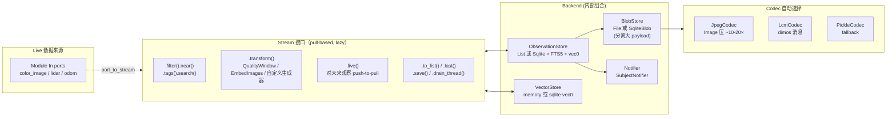

**4 个新概念**：

| 概念 | 作用 |
|---|---|
| `Store` | 命名空间。`store.stream("color_image")`、`store.stream("logs")` |
| `Stream` | 查询/迭代接口，**lazy 直到 terminal** (`.to_list()`、`.drain()`、`.live()`) |
| `Backend` | 4 件套合体：ObservationStore + BlobStore + VectorStore + Notifier |
| `Transformer` | 流上的算子，把上游 iterator 转成新 iterator（含 EmbedImages、QualityWindow） |

## 6.3 Quick start — 30 秒体验

```python
from dimos.memory2.store.sqlite import SqliteStore

store = SqliteStore(path="/tmp/test.db")
logs = store.stream("logs", str)

logs.append("Motor started", ts=1.0, tags={"level": "info"})
logs.append("Joint 3 fault", ts=2.0, tags={"level": "error"})
logs.append("Motor stopped", ts=3.0, tags={"level": "info"})

print(logs.before(5.0).tags(level="error").to_list())
# [Observation("Joint 3 fault", ts=2.0)]
```

10 个可链式调用的 filter：`.after(t)` `.before(t)` `.at(t)` `.near(pose, radius)` `.tags(**kv)` `.filter(predicate)` `.search(embedding, k)` `.order_by(field)` `.limit(k)` `.offset(n)`。

5 个 terminal：`.to_list()` `.last()` `.first()` `.drain()` `.save(another_stream)`。

## 6.4 PR #1769 — 三个真正能用的 Module

光有底层 Store 不够，#1769 加了 3 个 dimos Module 把 memory2 接到流水线：

### MemoryModule

存储的"占位 module"——open SqliteStore，给子类用。

### Recorder（关键）

**自动把 In ports 写到 SQLite**，零代码：

```python
from dimos.memory2.module import Recorder
from dimos.core.stream import In
from dimos.msgs.sensor_msgs.Image import Image
from dimos.msgs.sensor_msgs.PointCloud2 import PointCloud2

class Go2Memory(Recorder):
    color_image: In[Image]
    lidar: In[PointCloud2]
    odom: In[PoseStamped]
    config: Go2MemoryConfig

class Go2MemoryConfig(RecorderConfig):
    db_path: str | Path = "recording_go2.db"
```

部署到 blueprint：

```python
unitree_go2_memory = autoconnect(
    unitree_go2,                  # 已含 GO2Connection 等
    Go2Memory.blueprint(),         # 自动订阅 color_image/lidar/odom 写库
).global_config(n_workers=10)
```

`dimos run unitree-go2-memory` 跑起来，Go2 边走边把每帧图像/lidar/位姿写到本地 SQLite。

### SemanticSearch（关键）

**让 agent 能用自然语言找记忆**：

```python
class SemanticSearch(MemoryModule):
    @rpc
    def start(self) -> None:
        super().start()
        self.model = self.register_disposable(self.config.embedding_model())  # CLIPModel
        self.model.start()
        self.embeddings = self.store.stream("color_image_embedded", Image)

        # 流水线：live image → 亮度过滤 → 质量窗口去重 → CLIP embed → 存
        self.store.streams.color_image \
           .live() \
           .filter(lambda obs: obs.data.brightness > 0.1) \
           .transform(QualityWindow(lambda img: img.sharpness, window=0.5)) \
           .transform(EmbedImages(self.model, batch_size=2)) \
           .save(self.embeddings) \
           .drain_thread()

    @skill
    def search(self, query: str) -> PoseStamped:
        """Search visual memories by text query, return best matching pose."""
        query_vector = self.model.embed_text(query)
        results = self.embeddings.search(query_vector)
        # 找相似度峰值，按 distance 1 米去重
        return results.transform(peaks(key=_similarity, distance=1.0)).last().pose_stamped
```

agent 用法：

```
你: 上次你看到那个红色椅子在哪？
agent: [tool: search] (PoseStamped at x=2.3, y=0.5)
agent: 我在房间东北角看到过红色椅子，正在导航过去...
```

`search()` 返回 `PoseStamped` 直接送给 `goal_request`，整个链路自动闭环。

## 6.5 PR #1925 — replay 模式 Recorder 自动跳过

之前 bug：`unitree-go2-memory` 即便加了 `--replay` 也会 overwrite 本地 db，把 LFS 数据集污染。修复：

```python
@rpc
def start(self) -> None:
    super().start()
    if self.config.g.replay:
        logger.info("Replay mode active — Recorder disabled, leaving %s untouched", self.config.db_path)
        return
    ...
```

同时 `unitree-go2.py` 里 `Go2Memory` 加了 `odom: In[PoseStamped]` 字段，让录制带上里程计。

## 6.6 PR #1511 — TemporalMemory（用 VLM 的视频 RAG）

**和 memory2 平行的另一种"记忆"**：基于 VLM 的视频检索。

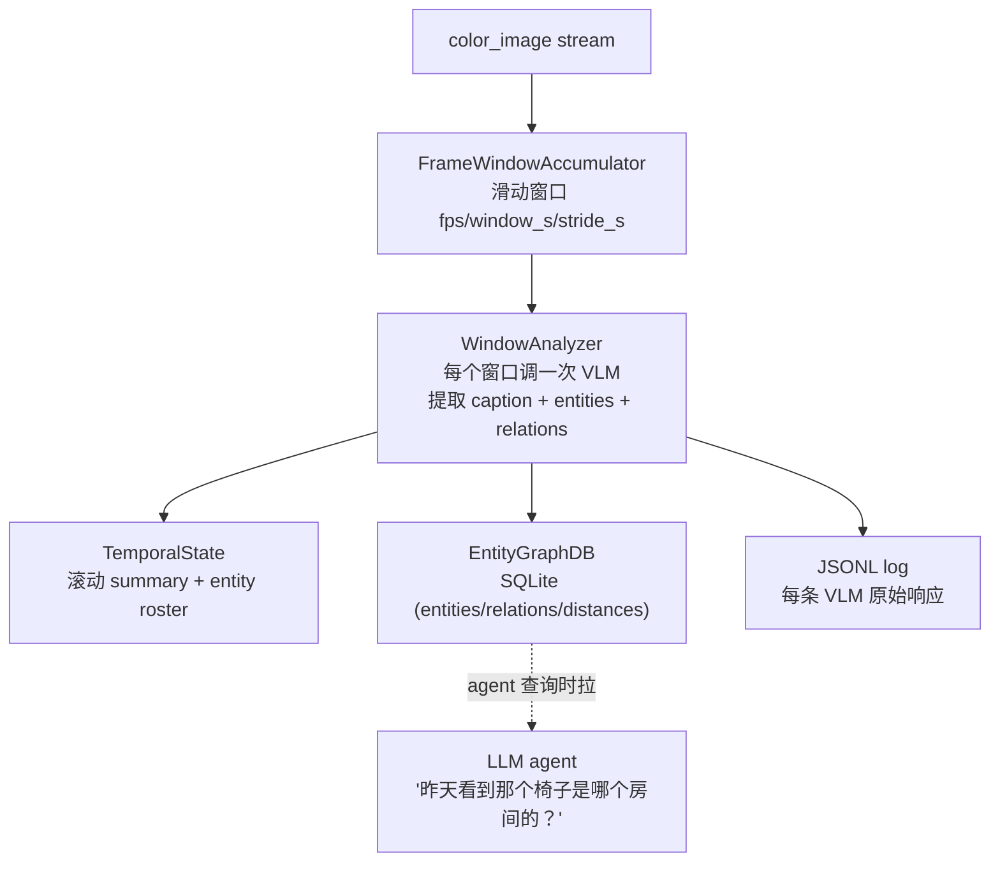

**VLM 调用预算**：默认配置下约 26 次/分钟（窗口分析 12 + summary 2 + distance 12）。可以通过 `TemporalMemoryConfig` 调节：

| 字段 | 默认 | 含义 |
|---|---|---|
| `fps` | 1.0 | 帧采样率 |
| `window_s` | 5.0 | 窗口长度 |
| `stride_s` | 5.0 | 窗口间步长 |
| `max_frames_per_window` | 3 | 每窗口最多送 VLM 多少帧 |
| `summary_interval_s` | 30.0 | 滚动 summary 频率 |
| `enable_distance_estimation` | True | 是否调 VLM 估 entity 距离 |
| `db_dir` | `~/.local/state/dimos/temporal_memory/` | 持久化位置 |
| `new_memory` | False | start 时是否清空老记忆 |

`unitree-go2-temporal-memory` blueprint 是它的标准入口：

```bash
export OPENAI_API_KEY=...
dimos --replay run unitree-go2-temporal-memory
humancli  # 跟 agent 聊天
```

---

# 七、Go2 平台演进 — 5 条直接相关的 PR

> 本章涉及 PR：#1487 fleet · #1362 webrtc TwistBase · #1903 rage mode webrtc · #1885 SDK adapter · #1925 autorecorder。

## 7.1 这 5 个 PR 的关系图

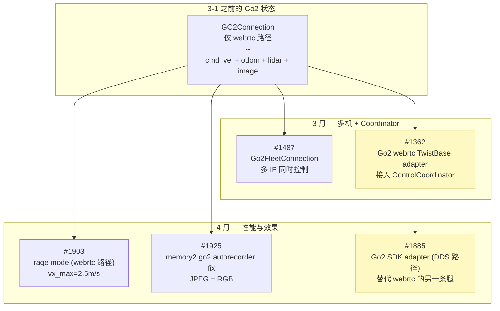

## 7.2 PR #1487 — Go2 fleet 多机控制

新 `Go2FleetConnection` 类（继承 `GO2Connection`）。机制：

- **第一台 Go2 走完整路径**（订阅传感器、回调、所有 RPC）
- **后续 Go2 只接收广播命令**（move, standup, liedown）

```python
class Go2FleetConnection(GO2Connection):
    config: FleetConnectionConfig

    def __init__(self, **kwargs):
        super().__init__(**kwargs)
        self._extra_ips = self.config.ips[1:]
        self._extra_connections: list[Go2ConnectionProtocol] = []

    @rpc
    def start(self):
        for ip in self._extra_ips:
            conn = make_connection(ip, self.config.g)
            conn.start()
            self._extra_connections.append(conn)
        super().start()  # 主 Go2
        for conn in self._extra_connections:
            conn.balance_stand()
            conn.set_obstacle_avoidance(self.config.g.obstacle_avoidance)
```

启动方式：

```bash
ROBOT_IPS=10.0.0.102,10.0.0.209 dimos run unitree-go2-fleet
```

新 `GlobalConfig.robot_ips` 字段（逗号分隔）。

## 7.3 PR #1362 — Go2 接入 ControlCoordinator（webrtc 路径）

引入 **TransportTwistBaseAdapter**：

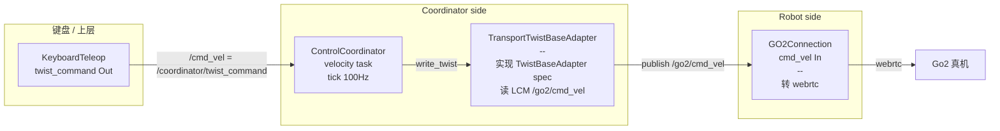

新 blueprint `unitree-go2-coordinator`：

```python
unitree_go2_coordinator = autoconnect(
    GO2Connection.blueprint(),
    ControlCoordinator.blueprint(
        hardware=[HardwareComponent(
            hardware_id="go2",
            hardware_type=HardwareType.BASE,
            joints=make_twist_base_joints("go2"),  # ["go2/vx", "go2/vy", "go2/wz"]
            adapter_type="transport_lcm",  # 走 LCM 中继
        )],
        tasks=[TaskConfig(name="vel_go2", type="velocity", joint_names=..., priority=10)],
    ),
).remappings([
    (GO2Connection, "cmd_vel", "go2_cmd_vel"),
    (GO2Connection, "odom", "go2_odom"),
]).transports(...)
```

意义：**Go2 现在和 xArm/Piper 一样能享受 ControlCoordinator 的 servo / velocity 任务调度**。

## 7.4 PR #1903 — Rage mode 通过 webrtc 接入

Rage Mode 是 Unitree 高速模式（最大前进 ~2.5 m/s）。

```python
class GO2Connection(...):
    @rpc
    def start(self):
        ...
        if self.config.mode == "rage":
            self._enable_rage_mode()  # 发 webrtc API 命令
```

新 blueprint `unitree-go2-webrtc-rage-keyboard-teleop`：

```python
unitree_go2_webrtc_rage_keyboard_teleop = autoconnect(
    unitree_go2_webrtc_keyboard_teleop,
    GO2Connection.blueprint(mode="rage"),  # 关键
    KeyboardTeleop.blueprint(linear_speed=1.25, angular_speed=1.2),
).global_config(obstacle_avoidance=True)
```

注意 `obstacle_avoidance=True`：rage 模式速度高，没避障跑起来很危险。

## 7.5 PR #1885 — Go2 SDK adapter（最大变化）

**这是过去两个月对 Go2 最大的改动**。引入了一条**完全独立于 webrtc 的控制路径**。

### 工作原理

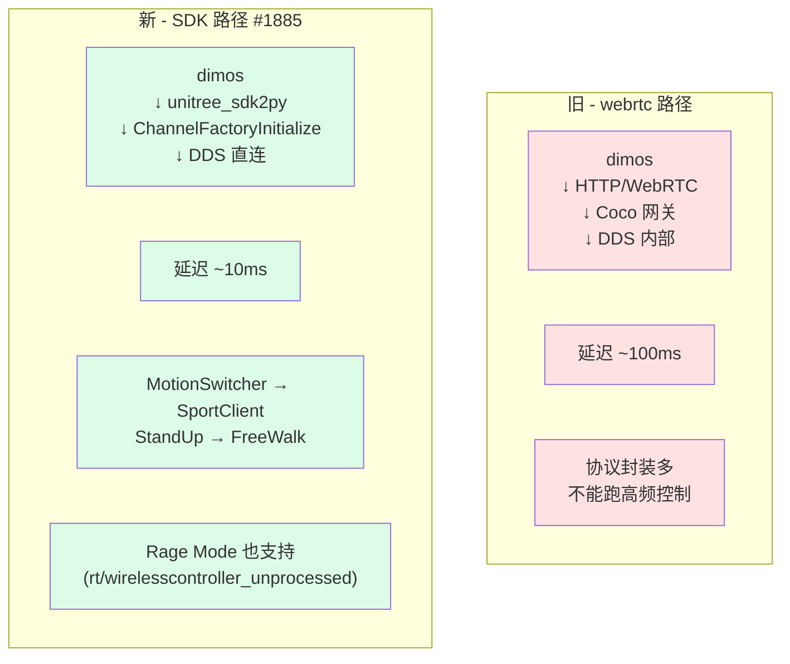

### 配置代价

不是装个 pip 就完了。需要：

1. **nix build cyclonedds**（构建 cyclonedds C 库）：

   ```bash
   nix build nixpkgs#cyclonedds   # 一次/机器
   ```

2. **配 venv 环境变量**（在 `.venv/bin/activate` 末尾追加）：

   ```bash
   export CYCLONEDDS_HOME=$(readlink -f ./result)
   export LD_LIBRARY_PATH="$CYCLONEDDS_HOME/lib:$LD_LIBRARY_PATH"
   ```

3. **装 unitree-dds extra**：

   ```bash
   uv pip install -e ".[unitree-dds]"
   ```

### 启动

```bash
export ROBOT_IP=192.168.123.161
dimos run unitree-go2-keyboard-teleop  # 注意：这是新 blueprint，DDS 直连
```

跟旧的 `unitree-go2-webrtc-keyboard-teleop` 区分清楚——名字差一个 webrtc。

### 新 adapter 的能力

`UnitreeGo2TwistAdapter`（`dimos/hardware/drive_trains/unitree_go2/adapter.py`，691 行）：

| 能力 | 实现 |
|---|---|
| Twist 命令（vx, vy, wz） | `SportClient.Move(vx, vy, vyaw)` |
| 启动序列 | `ChannelFactoryInitialize → MotionSwitcher → StandUp → BalanceStand → FreeWalk` |
| 状态反馈 | 订阅 `rt/sportmodestate`，更新 `latest_state` |
| Rage Mode | 发 `WirelessController_` 到 `rt/wirelesscontroller_unprocessed`，100Hz |
| 速度饱和 | 普通模式 `vx ∈ [-1, 1]`；rage 模式 `vx ∈ [-2.5, 2.5]` |

注册名：`"unitree_go2"` —— 在 blueprint 里：

```python
HardwareComponent(
    hardware_id="go2",
    hardware_type=HardwareType.BASE,
    joints=make_twist_base_joints("go2"),
    adapter_type="unitree_go2",       # ← 这里
    adapter_kwargs={"rage_mode": False},
)
```

### 两条路径对比

| 维度 | webrtc 路径 | SDK 路径（新） |
|---|---|---|
| 延迟 | ~100ms | ~10ms |
| 依赖 | aiortc + 几个 npm 包 | unitree-sdk2py + cyclonedds |
| 安装难度 | pip install 即可 | 需要 nix + 环境变量 + extra |
| 远程控制 | ✓（穿 NAT） | ✗（必须同局域网） |
| 高频闭环 | ✗ | ✓ |
| Rage Mode | webrtc API 调用 | 直接 publish DDS |
| 适合 | demo / 远程 / 不在意延迟 | 真机部署 / 学习 / 高频反馈 |

---

# 八、可视化与 UX — Rerun 一统天下

> 本章涉及 PR：#1414 dimos-viewer · #1525 split layout · #1690 rerun bg · #1714 grid · #1705 module graph · #1747/#1509/#1521 限速 · #1793 sphere · #1516 sim camera · #1477/#1478 viewer 重命名。

## 8.1 dimos viewer 选型变化时间线

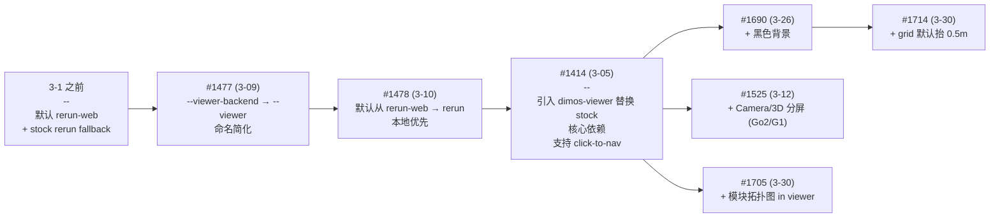

## 8.2 dimos-viewer 跟 stock rerun 有什么不一样？

| 能力 | stock rerun | dimos-viewer |
|---|---|---|
| 看 dimos 数据 | ✓ | ✓ |
| 鼠标点击 → LCM `/clicked_point` | ✗ | ✓ |
| 与 dimos blueprint 自动 grpc 连接 | 同样 grpc | 同样 grpc |
| 安装 | rerun-sdk pip 自动带 | `pip install dimos-viewer` 单独 |
| dimos 默认启用 | ✓（fallback） | ✓（优先） |

`RerunBridgeModule.start()` 启动时优先尝试 `rerun_bindings.spawn(executable_name="dimos-viewer", ...)`；找不到才用 `rr.spawn()`（stock）。

## 8.3 PR #1705 — 模块拓扑图 in viewer

新 entity path `world/blueprint`：把当前 dimos blueprint 的 module 拓扑图（Module 节点 + 输入输出连线）作为 `GraphNodes + GraphEdges` 推到 rerun。打开 viewer 多一个 "Blueprint" tab 就能看到现在 stack 实际跑了哪些 module，连线方向是怎么样的。

适合：

- 验证 `autoconnect` 是不是按你预期接好了
- 调试"我的 cmd_vel 怎么没到 GO2Connection"——一眼看到中间有没有连线
- 给同事 demo dimos 是怎么组装机器人的

## 8.4 PR #1747 / #1509 / #1521 — 限速防 OOM

合在一起：rerun viewer 是 Python 进程，处理速度慢。dimos 主流水线如果直接全速推数据，viewer 会 OOM、dimos 反过来被 backpressure 卡住。

3 个 PR 的合力：

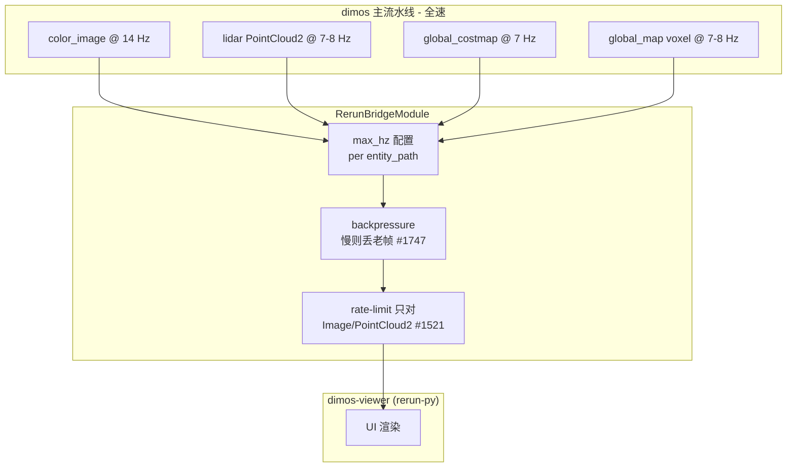

`max_hz=0` 表示不限速，`max_hz=5` 表示这条 entity path 最多 5Hz。

```python
rerun_config = {
    "max_hz": {
        "world/global_map": 0,       # 不限（voxel sphere 优化后）
        "world/color_image": 0,      # 不限
        "world/global_costmap": 0,
    },
}
```

## 8.5 PR #1690 + #1714 — 视觉细节

两个看起来微小但实际很重要的改动：

- **#1690**：rerun viewer 默认背景从浅灰改黑色。看 voxel 地图 / point cloud 时对比度高很多
- **#1714**：3D 视图的 grid plane 抬高 0.5 m。Go2 站立时身体大概在 0.3-0.5 m，原来 grid 在地面会和机器人重叠造成视觉干扰

---

# 九、升级注意事项与 cheatsheet

## 9.1 想做什么 → 用哪个 blueprint

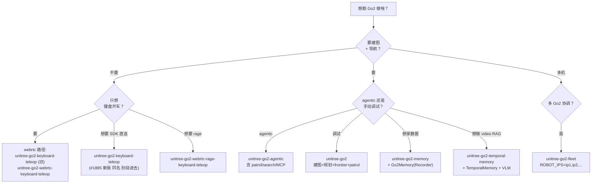

## 9.2 老代码升级注意

| 改动 | 老代码 | 新代码 |
|---|---|---|
| voxel mode 默认 | `to_rerun(mode="boxes")` | `to_rerun(mode="spheres")` |
| Recorder 在 replay 模式 | 会污染 db | 自动跳过（#1925） |
| Image JPEG 编解码格式 | BGR | RGB（[详见上一篇](/docs/cursor/dimos-upstream-update-2026-05-06.md)） |
| viewer CLI flag | `--viewer-backend rerun` | `--viewer rerun` |
| 默认 viewer | `rerun-web` | `rerun` (即 dimos-viewer) |
| `from dimos.memory import ...` | 老 memory 子包 | 新写代码用 `dimos.memory2`，老 memory 仍存在但不推荐 |
| Patrol 调用 | 同上 | 接口未变（#1939 内部 async 改写不影响调用方） |

## 9.3 Memory2 上手 cheatsheet

```python
# 1. 创建 store
from dimos.memory2.store.sqlite import SqliteStore
store = SqliteStore(path="my.db")

# 2. 命名空间隔离
images = store.stream("images", Image)
logs = store.stream("logs", str)

# 3. 写
images.append(my_image, ts=time.time(), pose=(x, y, z), tags={"camera": "front"})

# 4. 查询（lazy 直到 terminal）
recent = images.after(t).limit(10).to_list()
nearby = images.near(pose, radius=2.0).to_list()
last = images.last()

# 5. 流式管道
edges = images.transform(MyTransformer()).save(store.stream("edges"))
edges.drain()

# 6. Live (订阅未来观察)
for obs in images.live().transform(process):
    handle(obs)

# 7. 向量搜索
results = embedded_stream.search(query_vec, k=5).to_list()
```

## 9.4 Patrol 配置 cheatsheet

| 想做的事 | 怎么改 |
|---|---|
| 换 router 类型 | 派生 `PatrollingModule` 子类，重写 `__init__` 里的 `create_patrol_router("frontier", ...)` |
| 改 saturation 阈值 | 改 `VisitationHistory._saturation_threshold = 0.50` |
| 改抖动过滤距离 | `VisitationHistory._min_distance_m = 0.05` |
| 改候选数 | `CoveragePatrolRouter._candidates_to_consider = 7` |
| 改 frontier 最小簇 | `FrontierPatrolRouter._min_cluster_cells = 20` |
| 改额外 clearance | `dimos.navigation.patrolling.constants.EXTRA_CLEARANCE` |

## 9.5 Go2 SDK adapter 排错速查

| 症状 | 解决 |
|---|---|
| `ModuleNotFoundError: unitree_sdk2py` | `uv pip install -e ".[unitree-dds]"` |
| `Could not locate cyclonedds` | `nix build nixpkgs#cyclonedds` 然后配 `LD_LIBRARY_PATH` |
| DDS discovery 失败 | `ping $ROBOT_IP` 能通；同一台主机不能跑两个 DDS domain |
| `StandUp() / FreeWalk()` 失败 | 把 Go2 放平地上重启电源 |
| 机器人不响应 cmd_vel | 等 5 秒看 `[Go2] Locomotion ready` 日志 |
| arms swap | 不适用（Go2 是四足，没 LR 概念） |

## 9.6 32 个 PR 速查（按主题分组）

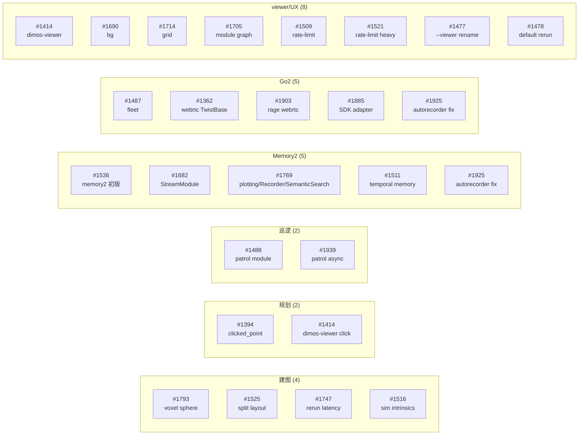

## 9.7 进一步阅读

- 上一篇：[DimOS upstream/dev 升级笔记 — 2026-04-28 → 2026-05-06](/docs/cursor/dimos-upstream-update-2026-05-06.md)（async modules、tool streams、G1 wholebody、OpenArm 等）
- 上上一篇：[从零理解 dimos 的建图与导航](/docs/cursor/dimos-navigation-mapping-tutorial.md)（基础概念入门）
- `dimos/navigation/patrolling/` — patrol 模块源码 + 3 个 router 实现
- `dimos/memory2/` — memory2 子系统 + 多个 markdown 文档（`intro.md`, `architecture.md`, `streaming.md`, `embeddings.md`, `blobstore/blobstore.md`）
- `dimos/perception/experimental/temporal_memory/README.md` — temporal memory 完整说明
- `dimos/hardware/drive_trains/unitree_go2/README.md` — Go2 SDK adapter 安装与使用
- `dimos/visualization/rerun/test_viewer_integration.py` — dimos-viewer 集成测试参考

---

> **本文档基于 dimos commit `884e7ed02`**（2026-05-06）。统计周期 2026-03-01 ~ 2026-05-06，共 8 周，约 32 个相关 commit。
>
> 后续 dev 同步可能调整细节，但本文档涉及的核心架构（memory2 子系统、patrol module、ReplanningAStarPlanner 输入约定、Go2 双路径方案）应保持稳定。
