# 从零理解 dimos 的建图与导航

> 给完全没接触过 SLAM / 自主导航的工程师看的教程。先用大白话讲清"机器人到底在做什么"，再带你一层层走进 dimos 的代码实现。配大量流程图，最后能上手用、改、扩展。
>
> **基于 dimos `main` 分支 `d2e695b38`（2026-05-13 同步）的代码。**
>
> **2026-05-14 更新说明**：上游合并了 **Nav Stack 0.1**（新增 `dimos/navigation/nav_stack/`），这是一套**全新的、基于 C++ NativeModule 的导航栈**，目前主要给 Unitree G1 humanoid + FastLIO2 + Livox 用。**Go2 仍然用本教程里描述的"老栈"**（VoxelGridMapper + CostMapper + ReplanningAStarPlanner + WavefrontFrontierExplorer + PatrollingModule + MovementManager），核心架构没变。新老两套栈的对比参见 [二、新老导航栈对比](#新增-nav-stack-01--另一条平行路线)。

---

## 目录

- [一、通俗篇：建图和导航是怎么回事](#一通俗篇建图和导航是怎么回事)
- [二、总览：dimos 的四层架构](#二总览dimos-的四层架构)
  - [新增：Nav Stack 0.1 — 另一条平行路线](#新增-nav-stack-01--另一条平行路线)
- [三、建图（Mapping）— 让机器人"看见"环境](#三建图mapping-让机器人看见环境)
- [四、导航（Navigation）— 让机器人"会走路"](#四导航navigation-让机器人会走路)
- [五、自主探索（Frontier Exploration）— 让机器人"自己出门"](#五自主探索frontier-exploration-让机器人自己出门)
- [六、端到端实战 — 用 Go2 做一次完整任务](#六端到端实战-用-go2-做一次完整任务)
- [七、扩展点和延伸阅读](#七扩展点和延伸阅读)
  - [7.5 Nav Stack 0.1 完全指南](#75-nav-stack-01-完全指南)

---

# 一、通俗篇：建图和导航是怎么回事

## 1.1 机器人为什么需要"地图"？

你蒙着眼走路会撞墙。机器人也是一样：要会走路，必须先知道"哪里能走、哪里有墙、哪里有桌子"。这件事就叫**建图（Mapping）**。

**核心问题**：机器人身上挂着传感器（雷达、相机、IMU），它收到的是一堆"距离"和"图像"，怎么变成一张"地图"？

## 1.2 SLAM 是什么

SLAM = **S**imultaneous **L**ocalization **A**nd **M**apping = "同时定位与建图"。

机器人面对一个鸡生蛋蛋生鸡的问题：

- 想建图 → 需要知道自己在哪（不然每次扫的点云就拼不起来）
- 想知道在哪 → 需要一张图作参照（不然 GPS 在室内根本不准）

SLAM 就是同时解这两个问题的算法。dimos **不自己实现 SLAM**，而是把它当作"外部黑盒"来用：

| 你的硬件 | 用什么 SLAM | 提供什么输出 |
|----------|------------|--------------|
| Livox MID-360 雷达 | **FastLIO2** | `odom`（机器人在世界里的姿态）+ `lidar`（一帧扫描点云，已对齐到世界坐标系） |
| Unitree Go2 自带 | Go2 SLAM | 同上 |
| 仿真环境 MuJoCo | 仿真器直接给 | 同上（甚至不需要 SLAM） |

> **第一个关键点**：`odom`（odometry，里程计）= 机器人在世界里的位置 + 朝向。后面所有规划都建立在这个之上。

## 1.3 三种地图：从粗到细

### 体素地图（Voxel Map）— 3D 的乐高积木

把空间切成 5cm × 5cm × 5cm 的小方块（叫 voxel），雷达扫到哪个方块里有点，就把这个方块标记为"占据"。整个房间就被表示成了一堆乐高积木。

```
真实世界                体素地图
   桌子                  ▓▓▓▓
   ▔▔▔     →          ▓    ▓
   |||                 ▓    ▓
```

适合：3D 可视化、避障、表示完整 3D 结构。

### 占据栅格（Occupancy Grid）— 2D 的格子图

机器人通常只在地面上走，3D 太冗余。把地面切成 5cm × 5cm 的小格子，每个格子标三种状态：

| 值 | 含义 | 颜色 |
|-----|-----|------|
| `0` (FREE) | 空地，能走 | 白 |
| `100` (OCCUPIED) | 墙/障碍物 | 黑 |
| `-1` (UNKNOWN) | 没扫到，不知道 | 灰 |

这就是经典的**占据栅格地图（OccupancyGrid）**。它比体素地图小得多，足够规划路径用。

### Cost map（成本图）— 占据栅格的精装修版

只有 0/100/-1 太粗。实际规划时希望：

- 离墙远的地方便宜（cost 小）
- 离墙近的地方贵（cost 大），逼着机器人走中间
- 完全过不去的地方禁止（cost = 100）

cost map 就是这样一张"灰度图"：每个格子的值在 0-100 之间，越大越不想去。规划时找 cost 之和最小的路。

```
普通占据栅格        Cost map
███     ███      ███99887766↗↗
   .  .            997  .  .  .  .  
.  .  .            76  .  .  .  .  
███     ███      ███76776699↗↗
```

> **第二个关键点**：dimos 的规划是**在 cost map 上跑 A***，不是直接在占据栅格上跑。

## 1.4 路径规划：A* 算法的直观理解

给定**起点**和**终点**，找一条最便宜（或最短）的路。

最经典的算法叫 **A***（A-star）。直观地说：

1. 从起点开始，每次"看一圈"四周 8 个邻居格子
2. 给每个邻居算两个分数：
   - **g**：从起点到这里实际走过的成本
   - **h**：从这里到终点的"直线估计"成本（叫**启发函数**）
3. 优先去 `g + h` 最小的格子继续展开
4. 反复，直到到达终点
5. 然后回溯走过来的路径

A* 比"暴力搜所有可能"快得多，因为 `h` 让它一直朝着终点方向"瞄"。

## 1.5 控制器：把"路径"翻译成"轮子转速"

规划器吐出来的是"经过点 P1 → P2 → P3 → ... → 终点"的一串坐标。但机器人只听得懂 `Twist`（线速度 + 角速度）的命令。

**控制器（controller）** 干的就是这个翻译活：

- 看自己当前位置和朝向
- 看路径上前方一个点（叫 **lookahead 点**）
- 算出"我应该转多少度、走多快"
- 输出 `Twist(linear=v, angular=ω)`

dimos 用的是**比例控制（P controller）**：误差越大，纠偏越用力。简单但够用。

---

# 二、总览：dimos 的四层架构

dimos 的"建图 + 导航"完整链路可以分成 **4 层 8 个模块**：

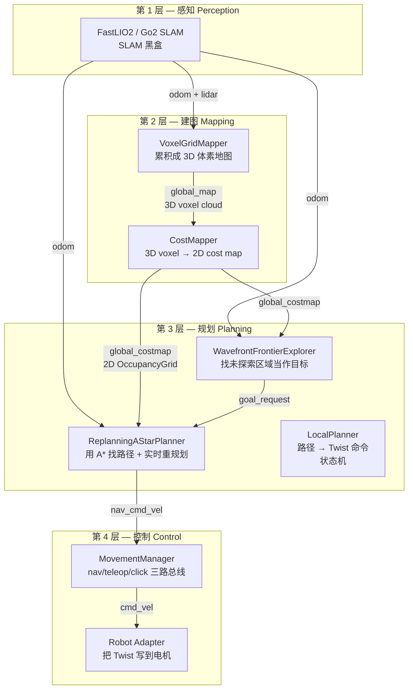
```mermaid
flowchart TB
    subgraph L1["第 1 层 — 感知 Perception"]
        SLAM[FastLIO2 / Go2 SLAM<br/>SLAM 黑盒]
    end

    subgraph L2["第 2 层 — 建图 Mapping"]
        VOX[VoxelGridMapper<br/>累积成 3D 体素地图]
        COST[CostMapper<br/>3D voxel → 2D cost map]
    end

    subgraph L3["第 3 层 — 规划 Planning"]
        FRO[WavefrontFrontierExplorer<br/>找未探索区域当作目标]
        GLOBAL[ReplanningAStarPlanner<br/>用 A* 找路径 + 实时重规划]
        LOCAL[LocalPlanner<br/>路径 → Twist 命令<br/>状态机]
    end

    subgraph L4["第 4 层 — 控制 Control"]
        MM[MovementManager<br/>nav/teleop/click 三路总线]
        ROBOT[Robot Adapter<br/>把 Twist 写到电机]
    end

    SLAM -->|odom + lidar| VOX
    SLAM -->|odom| GLOBAL
    SLAM -->|odom| FRO
    VOX -->|global_map<br/>3D voxel cloud| COST
    COST -->|global_costmap<br/>2D OccupancyGrid| GLOBAL
    COST -->|global_costmap| FRO
    FRO -->|goal_request| GLOBAL
    GLOBAL -->|nav_cmd_vel| MM
    MM -->|cmd_vel| ROBOT
```

| 层 | 模块 | 输入 | 输出 |
|----|------|------|------|
| 感知 | `FastLIO2` | 原始雷达点云 + IMU | `odom` + `lidar`（已对齐到世界） |
| 建图 | `VoxelGridMapper` | `lidar` 点云流 | `global_map`（3D 体素点云） |
| 建图 | `CostMapper` | `global_map` | `global_costmap`（2D OccupancyGrid） |
| 规划 | `WavefrontFrontierExplorer` | `global_costmap` + `odom` | `goal_request`（自动选探索目标） |
| 规划 | `ReplanningAStarPlanner` | `odom` + `global_costmap` + `goal_request` | `nav_cmd_vel` |
| 控制 | `MovementManager` | `nav_cmd_vel` + `tele_cmd_vel` + `clicked_point` | `cmd_vel` + `stop_movement` |
| 控制 | Robot Adapter | `cmd_vel` | 电机指令 |

## 新增：Nav Stack 0.1 — 另一条平行路线

> 上游 commit `2a430b55b`（2026-05-09）合并了**完整的第二套导航栈** `dimos/navigation/nav_stack/`，主要给 **Unitree G1 humanoid** 用，但任何带 LiDAR 的平台都能接。
>
> **关键认知**：**Go2 没有切到这套**。Go2 的 `unitree_go2` blueprint 里仍然是老栈。本教程主体（第三~六章）讲的是老栈，依然完全适用。本节只做新老对比，让你明白"看到了 Nav Stack 但跟我看的教程对不上"是怎么回事。

### 为什么要做新栈？

老栈的几个痛点：

1. **Python A* 单线程算路径**：100m × 100m 的大地图扛不住
2. **没有回环检测**：长时间跑，里程计会漂移
3. **OccupancyGrid 抹掉 Z 轴信息**：humanoid 上下楼梯、跨过低矮障碍时不够用
4. **VoxelGridMapper 只累积，不衰减**：动态物体（行人、家具被搬走）会留痕迹

Nav Stack 0.1 的核心思路是：**把重计算搬到 C++ NativeModule，把"地形"作为头等公民**。

### 模块对照表

| 职责 | 老栈（Go2 在用） | Nav Stack 0.1（G1 在用） |
|------|------|------|
| **里程计修正** | 无（直接用 SLAM 给的 odom） | `PGO`（C++ GTSAM iSAM2 + ICP 回环检测）→ `corrected_odometry` |
| **地形/可走表面** | `VoxelGridMapper`（Open3D VoxelBlockGrid 全局累积） | `TerrainAnalysis`（C++，按高度阈值 + 动态衰减输出 `terrain_map` 点云） |
| **局部地形扩展** | 无 | `TerrainMapExt`（Python，41×41 滚动地形格 + BFS 连通性） |
| **障碍/代价表示** | `CostMapper` → 2D `OccupancyGrid` | 直接用 `terrain_map` 点云（保留 Z） |
| **全局规划** | `ReplanningAStarPlanner`（Python A* + C++ 加速） | 二选一：`FarPlanner`（C++ visibility graph，大地图）/ `SimplePlanner`（Python 简化 A*） |
| **局部避障** | `LocalPlanner`（Python 状态机内置） | `LocalPlanner`（**独立 C++ NativeModule**，多路径多扫描融合） |
| **路径跟踪** | `PController`（Python） | `PathFollower`（C++ pure pursuit + PID） |
| **自主探索** | `WavefrontFrontierExplorer` | `TarePlanner`（可选） |
| **录制** | `Recorder` (memory2) | `NavRecord`（专用，记 14 个导航 topic） |
| **坐标系** | 只用 `map` | 严格分层：`map` → `odom` → `body` → `sensor` |
| **输出** | `nav_cmd_vel` | `nav_cmd_vel`（PathFollower 的 `cmd_vel` 在 blueprint 里 remap 成这个） |
| **构图方式** | 手动 `autoconnect(VoxelGridMapper, CostMapper, ...)` | `create_nav_stack(planner="far", use_terrain_map_ext=True, ...)` 一行 |

### Nav Stack 0.1 的拓扑

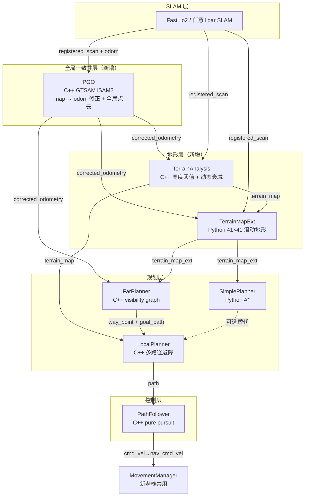
```mermaid
flowchart TB
    subgraph SLAM[SLAM 层]
        FL[FastLio2 / 任意 lidar SLAM]
    end

    subgraph CORR["全局一致性层（新增）"]
        PGO[PGO<br/>C++ GTSAM iSAM2<br/>map → odom 修正 + 全局点云]
    end

    subgraph TERR["地形层（新增）"]
        TA[TerrainAnalysis<br/>C++ 高度阈值 + 动态衰减]
        TME[TerrainMapExt<br/>Python 41×41 滚动地形]
    end

    subgraph PLAN[规划层]
        FAR[FarPlanner<br/>C++ visibility graph]
        SIMP[SimplePlanner<br/>Python A*]
        LP[LocalPlanner<br/>C++ 多路径避障]
    end

    subgraph CTRL[控制层]
        PF[PathFollower<br/>C++ pure pursuit]
    end

    FL -->|registered_scan + odom| PGO
    PGO -->|corrected_odometry| TA
    PGO -->|corrected_odometry| TME
    PGO -->|corrected_odometry| FAR
    FL -->|registered_scan| TA
    FL -->|registered_scan| TME
    TA -->|terrain_map| TME
    TME -->|terrain_map_ext| FAR
    TME -->|terrain_map_ext| SIMP
    TA -->|terrain_map| LP

    FAR -->|way_point + goal_path| LP
    SIMP -.可选替代.-> LP
    LP -->|path| PF
    PF -->|cmd_vel→nav_cmd_vel| MM[MovementManager<br/>新老栈共用]
```

### 谁在用？

- **G1 onboard / sim**：`dimos/robot/unitree/g1/blueprints/navigation/unitree_g1_nav_onboard.py` 调用 `create_nav_stack(...)`
- **Go2**：**没动**，仍是老栈

如果你只关心 Go2，**第三~六章完全有效**，直接读下去。如果你要给 G1 改导航或者想了解 Nav Stack 0.1 内部细节，跳到 [7.5 Nav Stack 0.1 完全指南](#75-nav-stack-01-完全指南)。

---

# 三、建图（Mapping）— 让机器人"看见"环境

## 3.1 第一站：SLAM 提供 odom

dimos 不实现 SLAM，但用一个 **FastLIO2** 模块（`dimos/hardware/sensors/lidar/fastlio2/`）把 SLAM 包成普通 dimos 模块。

> FastLIO2（Fast LiDAR-Inertial Odometry 2）是港大开源的 SOTA 雷达 SLAM。Livox MID-360 + IMU → 实时输出 `odom` + `lidar` 帧（每帧已对齐到世界坐标系）。

实例（`mid360_fastlio_voxels` blueprint）：

```python
mid360_fastlio_voxels = autoconnect(
    FastLio2.blueprint(),                                 # SLAM 进程
    VoxelGridMapper.blueprint(voxel_size=0.05),           # 体素累积
    vis_module("rerun", rerun_config={...}),              # 可视化
)
```

只要有 SLAM 在跑，下游所有模块都能从 `odom` 拿到当前姿态、从 `lidar` 拿到点云。

## 3.2 第二站：VoxelGridMapper — 把点云累积成 3D 地图

文件：`dimos/mapping/voxels.py`

**问题**：每帧雷达只能看到附近一块，怎么把多帧拼成一张完整的 3D 地图？

**答案**：用 Open3D 的 `VoxelBlockGrid`（GPU 加速的 3D 哈希表）。每帧来了：

1. 把每个点除以 voxel size 取整 → 得到 voxel 坐标 `(x, y, z)`
2. 把这个坐标作为 key 插到哈希表里

哈希表自带去重，扫过千百次同一个地方也只占一个 voxel。

### Column carving（列裁剪）

如果一个 (x, y) 列的 voxel 在新一帧里出现了，**先把这个列上所有老 voxel 删掉**再插入新 voxel。这样能处理"东西被搬走了"的情况（动态物体不会在地图上留痕迹）。

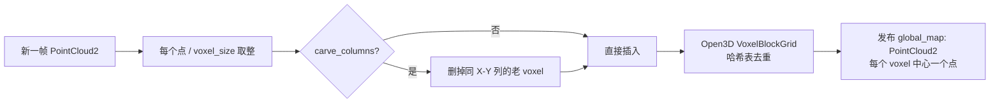
```mermaid
flowchart LR
    A[新一帧 PointCloud2] --> B[每个点 / voxel_size 取整]
    B --> C{carve_columns?}
    C -->|是| D[删掉同 X-Y 列的老 voxel]
    C -->|否| E[直接插入]
    D --> E
    E --> F[Open3D VoxelBlockGrid<br/>哈希表去重]
    F --> G[发布 global_map: PointCloud2<br/>每个 voxel 中心一个点]
```

### 框架视角看 VoxelGridMapper

`VoxelGridMapper` 继承自上一节升级里的 **`StreamModule`**：声明一个 `In[PointCloud2]` 和一个 `Out[PointCloud2]`，剩下的输入累积、输出节流由基类自动黏合。

```python
class VoxelGridMapper(StreamModule[PointCloud2, PointCloud2]):
    config: VoxelGridMapperConfig
    lidar: In[PointCloud2]          # 雷达原始扫描
    global_map: Out[PointCloud2]    # 累积后的全局体素地图

    def pipeline(self, stream):
        return stream.transform(VoxelMapTransformer(**cfg))
```

> **2026-05 更新**：commit `1737d037e` 修了一个**CUDA 内存泄漏**。Open3D 的 `HashMap` 操作（carving、`key_tensor()[idx]`、`find()`、`activate()`）每次都会从设备分配缓冲区，但 Open3D 的 caching allocator **不会主动归还**——长跑下 VRAM 每次调用涨 ~0.8 MB 直到 OOM。现在每次 insert 后会显式释放：
>
> ```python
> if str(self._dev).startswith("CUDA"):
>     o3c.cuda.release_cache()
> ```
>
> 影响：用 GPU 跑 `VoxelGridMapper` 几小时不再爆显存。CPU 模式不受影响。

## 3.3 第三站：CostMapper — 把 3D voxel 拍扁成 2D 占据栅格

文件：`dimos/mapping/costmapper.py` + `dimos/mapping/pointclouds/occupancy.py`

**问题**：地面机器人不需要 3D，需要"地面上每个格子能不能踩"的 2D 视角。

**答案**：把 3D voxel 投影到 X-Y 平面，用某种算法判断"这个格子可走/不可走"。

dimos 提供 **3 种 occupancy 算法**（注册在 `OCCUPANCY_ALGOS`）：

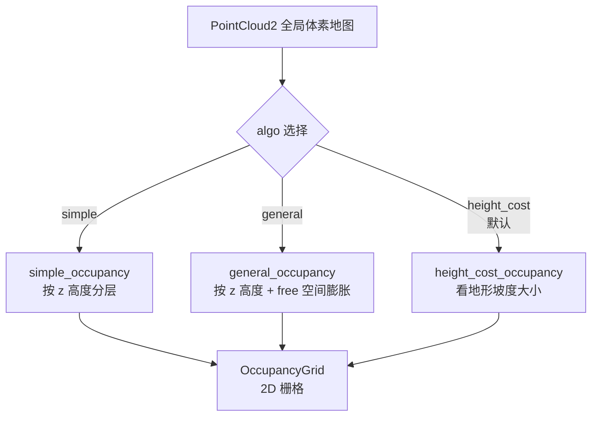
```mermaid
flowchart TB
    PCD[PointCloud2 全局体素地图] --> ALGO{algo 选择}
    ALGO -->|simple| S[simple_occupancy<br/>按 z 高度分层]
    ALGO -->|general| G[general_occupancy<br/>按 z 高度 + free 空间膨胀]
    ALGO -->|height_cost<br/>默认| H[height_cost_occupancy<br/>看地形坡度大小]
    
    S --> OUT[OccupancyGrid<br/>2D 栅格]
    G --> OUT
    H --> OUT
```

### 三种算法对比

| 算法 | 思路 | 适合 | 缺点 |
|------|------|------|------|
| `simple` | 高度在 [min_h, max_h] 之间 = 障碍；低于 = free | 室内、地面平坦 | 不分坡度 |
| `general` | 同上 + 把扫到的地面附近一圈也标 free | 同上，但 free 空间更确定 | 算得慢 |
| `height_cost` **默认** | 计算每个格子的**地形坡度**（用 Sobel 算子求高度梯度），坡度越大 cost 越高 | 户外、有台阶/斜坡的环境 | 需要好几个超参数 |

### `height_cost_occupancy` 详解（默认算法）

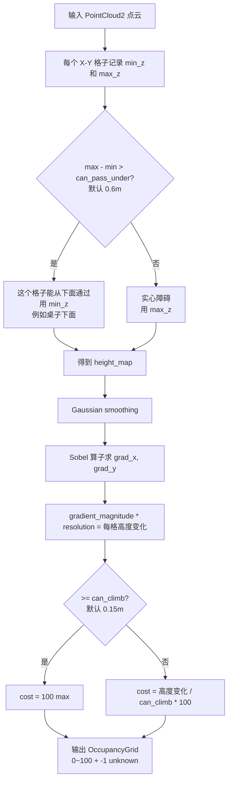
```mermaid
flowchart TB
    PTS[输入 PointCloud2 点云] --> H1[每个 X-Y 格子记录 min_z 和 max_z]
    H1 --> H2{max - min > can_pass_under?<br/>默认 0.6m}
    H2 -->|是| H3[这个格子能从下面通过<br/>用 min_z<br/>例如桌子下面]
    H2 -->|否| H4[实心障碍<br/>用 max_z]
    H3 --> H5[得到 height_map]
    H4 --> H5
    H5 --> H6[Gaussian smoothing]
    H6 --> H7[Sobel 算子求 grad_x, grad_y]
    H7 --> H8[gradient_magnitude * resolution = 每格高度变化]
    H8 --> H9{>= can_climb?<br/>默认 0.15m}
    H9 -->|是| H10[cost = 100 max]
    H9 -->|否| H11[cost = 高度变化 / can_climb * 100]
    H10 --> OUT
    H11 --> OUT[输出 OccupancyGrid<br/>0~100 + -1 unknown]
```

**配置项含义**：

| 字段 | 默认 | 含义 |
|------|------|------|
| `resolution` | 0.05 | 每格 5cm |
| `can_pass_under` | 0.6 | 高度差超过这个就算"底下能过"（桌椅下方） |
| `can_climb` | 0.15 | 一格内高度变化超过这个就 cost=100（爬不上去） |
| `ignore_noise` | 0.05 | 小于这个的高度变化忽略（雷达噪声） |
| `smoothing` | 1.0 | Gaussian 平滑系数 |

## 3.4 第四站：把 OccupancyGrid 进一步加工成"导航地图"

`OccupancyGrid` 还不能直接给规划器用，需要两步加工：

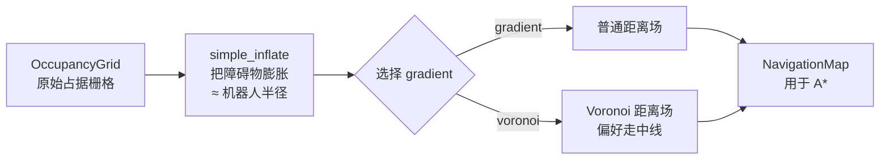
```mermaid
flowchart LR
    OG[OccupancyGrid<br/>原始占据栅格] --> INFLATE[simple_inflate<br/>把障碍物膨胀<br/>≈ 机器人半径]
    INFLATE --> GRAD{选择 gradient}
    GRAD -->|gradient| G1[普通距离场]
    GRAD -->|voronoi| G2[Voronoi 距离场<br/>偏好走中线]
    G1 --> NAV[NavigationMap<br/>用于 A*]
    G2 --> NAV
```

### 障碍物膨胀（`simple_inflate`）

A* 把机器人当成一个"点"。但机器人有半径，紧贴墙走会刮到。解决办法：**把所有障碍物按机器人半径膨胀**。这样规划出来的"点的路径"自动满足"机器人不撞墙"。

具体实现（`dimos/mapping/occupancy/inflation.py`）：

```python
# 把半径转成格子数
cell_radius = ceil(robot_radius / resolution)
# 圆形 kernel
kernel = (x*x + y*y <= cell_radius*cell_radius)
# 用 scipy 二值膨胀
inflated = scipy.ndimage.binary_dilation(occupied, kernel)
```

### 梯度成本图（`gradient` / `voronoi_gradient`）

膨胀完之后，墙外的格子还是要么 0 要么 100。希望"离墙越远越便宜"，所以叠一个**距离场**：

- `gradient`：每个 free 格子的 cost = `1 - clip(到最近障碍距离 / max_distance, 0, 1)` × 100
- `voronoi_gradient`：偏好走两侧障碍中间的"中线"（Voronoi 图的边）

最终得到的就是"在 cost 上跑 A*"用的图。

> dimos 在 `GlobalPlanner` 里**同时维护两张 NavigationMap**：
>
> - `_navigation_map` (Voronoi)：远距离用，偏好走中线
> - `_navigation_map_near` (gradient)：近距离用（< 1.5m），偏好直来直去

## 3.5 完整的"建图链"流程

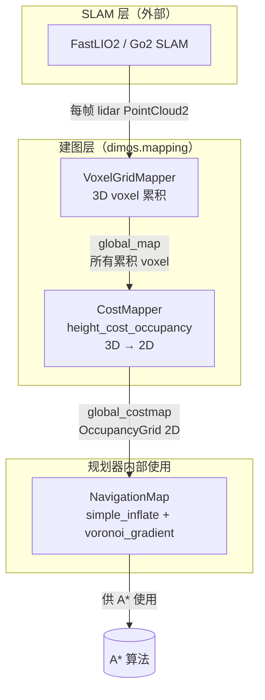
```mermaid
flowchart TB
    subgraph SLAM["SLAM 层（外部）"]
        S1[FastLIO2 / Go2 SLAM]
    end

    subgraph MAP["建图层（dimos.mapping）"]
        M1[VoxelGridMapper<br/>3D voxel 累积]
        M2[CostMapper<br/>height_cost_occupancy<br/>3D → 2D]
    end

    subgraph PLAN["规划器内部使用"]
        P1[NavigationMap<br/>simple_inflate + voronoi_gradient]
    end

    S1 -->|每帧 lidar PointCloud2| M1
    M1 -->|global_map<br/>所有累积 voxel| M2
    M2 -->|global_costmap<br/>OccupancyGrid 2D| P1
    P1 -->|供 A* 使用| ASTAR[(A* 算法)]
```

---

# 四、导航（Navigation）— 让机器人"会走路"

dimos 的导航主力是 `ReplanningAStarPlanner`（`dimos/navigation/replanning_a_star/`）。它不是单一类，而是 **6 个文件 6 个职责**的小系统：

| 文件 | 类 | 职责 |
|------|----|----|
| `module.py` | `ReplanningAStarPlanner` | dimos Module 包装，端口和生命周期 |
| `global_planner.py` | `GlobalPlanner` | 协调器：监听 odom/goal/costmap，调度全局规划 + 局部跟随 |
| `min_cost_astar.py` | `min_cost_astar()` | A* 算法本体（含 C++ 加速实现） |
| `local_planner.py` | `LocalPlanner` | 状态机 + 沿路径跟踪 + 控制器调用 |
| `navigation_map.py` | `NavigationMap` | 把 OccupancyGrid 加工成 cost map |
| `controllers.py` | `PController` / `PdController` | 把"位置误差"转 Twist |
| `goal_validator.py` | `find_safe_goal()` | 把不可达目标拉到附近可达点 |
| `position_tracker.py` | `PositionTracker` | 检测"卡住" |
| `path_clearance.py` | `PathClearance` | 检测前方动态障碍 |
| `replan_limiter.py` | `ReplanLimiter` | 防止无限重规划 |

下面分四个层次讲清楚。

## 4.1 顶层数据流

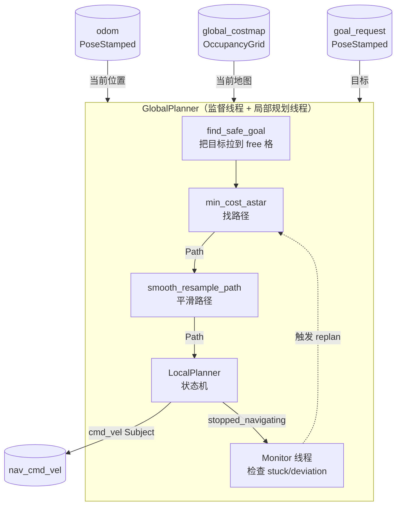
```mermaid
flowchart TB
    ODOM[(odom<br/>PoseStamped)] -->|当前位置| GP
    COSTMAP[(global_costmap<br/>OccupancyGrid)] -->|当前地图| GP
    GOAL[(goal_request<br/>PoseStamped)] -->|目标| GP

    subgraph GP["GlobalPlanner（监督线程 + 局部规划线程）"]
        direction TB
        VAL[find_safe_goal<br/>把目标拉到 free 格]
        ASTAR[min_cost_astar<br/>找路径]
        SMOOTH[smooth_resample_path<br/>平滑路径]
        LP[LocalPlanner<br/>状态机]
        MON[Monitor 线程<br/>检查 stuck/deviation]
    end

    VAL --> ASTAR
    ASTAR -->|Path| SMOOTH
    SMOOTH -->|Path| LP
    LP -->|cmd_vel Subject| OUT_CMD[(nav_cmd_vel)]
    LP -->|stopped_navigating| MON
    MON -.->|触发 replan| ASTAR
```

## 4.2 第一步：A* 在做什么

文件：`dimos/navigation/replanning_a_star/min_cost_astar.py`

**接口**：`min_cost_astar(costmap, goal, start) -> Path | None`

**核心算法**（伪代码版本）：

```
open_set = priority_queue { (f=0, start) }
closed_set = {}
came_from = {}
g_score = { start: 0 }

while open_set 非空:
    current = open_set.pop_min()
    
    if current == goal:
        return reconstruct_path(came_from, current)
    
    closed_set.add(current)
    
    for neighbor in 8 个邻居:
        if neighbor 已 closed 或 cost >= 100: continue
        cell_cost = neighbor 在 costmap 上的值（0~99，UNKNOWN 给惩罚）
        tentative_g = g_score[current] + cell_cost   # ← 关键：累积 cost
        if tentative_g < g_score.get(neighbor, ∞):
            came_from[neighbor] = current
            g_score[neighbor] = tentative_g
            f = tentative_g                          # ← cost 优先，距离次之
            heappush(open_set, (f, neighbor))
```

**dimos 的两个特别之处**：

1. **优先级是 `(累积cost, 累积距离 + 启发距离)`**，是个二元组比较，先比 cost 后比距离。这意味着 A* 优先找"安全"的路，再在同等安全度下找"最短"。
2. **C++ 加速**：`min_cost_astar.py:25` 试图 import `min_cost_astar_cpp`（一个 pybind11 编译的 C++ 实现），如果有就用 C++ 版（快 10x+），fallback 到 Python。
3. **启发函数用 Octile 距离**（适合 8-邻接，比欧氏距离更准）。

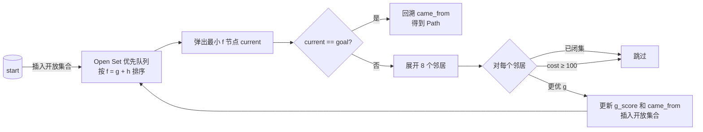
```mermaid
flowchart LR
    START[(start)] -->|插入开放集合| Q
    Q[Open Set 优先队列<br/>按 f = g + h 排序]
    Q --> POP[弹出最小 f 节点 current]
    POP --> CHECK{current == goal?}
    CHECK -->|是| DONE[回溯 came_from<br/>得到 Path]
    CHECK -->|否| EXP[展开 8 个邻居]
    EXP --> NB{对每个邻居}
    NB -->|已闭集| SKIP[跳过]
    NB -->|cost &ge; 100| SKIP
    NB -->|更优 g| UP[更新 g_score 和 came_from<br/>插入开放集合]
    UP --> Q
```

## 4.3 第二步：safe goal — 智能纠偏目标

如果你点的目标恰好在墙里、桌子上，A* 直接 fail。`find_safe_goal` 解决这个：

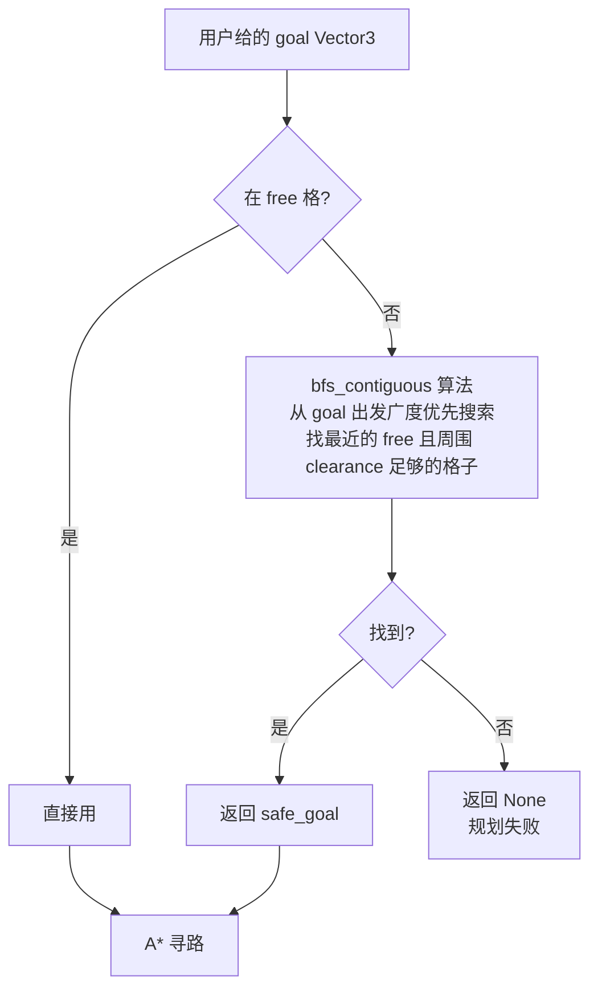
```mermaid
flowchart TB
    G[用户给的 goal Vector3] --> CHK{在 free 格?}
    CHK -->|是| OK[直接用]
    CHK -->|否| BFS[bfs_contiguous 算法<br/>从 goal 出发广度优先搜索<br/>找最近的 free 且周围 clearance 足够的格子]
    BFS --> R{找到?}
    R -->|是| SAFE[返回 safe_goal]
    R -->|否| NULL[返回 None<br/>规划失败]
    OK --> NEXT[A* 寻路]
    SAFE --> NEXT
```

**`min_clearance` = `robot_rotation_diameter / 2`**：要求新目标周围至少有半个机器人转身半径的余量，免得到了之后转不开。

## 4.4 第三步：path smoothing — 让路径不那么折角

A* 输出的路径是格子坐标序列，常常 zigzag。直接给控制器，机器人会忽左忽右"画蛇"。

`smooth_resample_path`（`dimos/mapping/occupancy/path_resampling.py`）：

1. 用线性插值上采样到 100+ 个点
2. 用 `uniform_filter1d` 滑窗平均（默认窗口 100）平滑 X、Y 坐标
3. 重新按指定 spacing（默认 0.1m）重采样
4. 起点终点保持不动
5. 自动给每个点算朝向（朝向下一点）

效果：

```
A* 原始（zigzag）           平滑后
.___                        .____
    |                            \____
    .___                              ___
        |                                ____.
        .____.                                .
```

## 4.5 第四步：LocalPlanner 状态机 — 沿路径走

`LocalPlanner._loop()`（`local_planner.py:163`）是个 4 状态有限状态机，10Hz 控制循环：

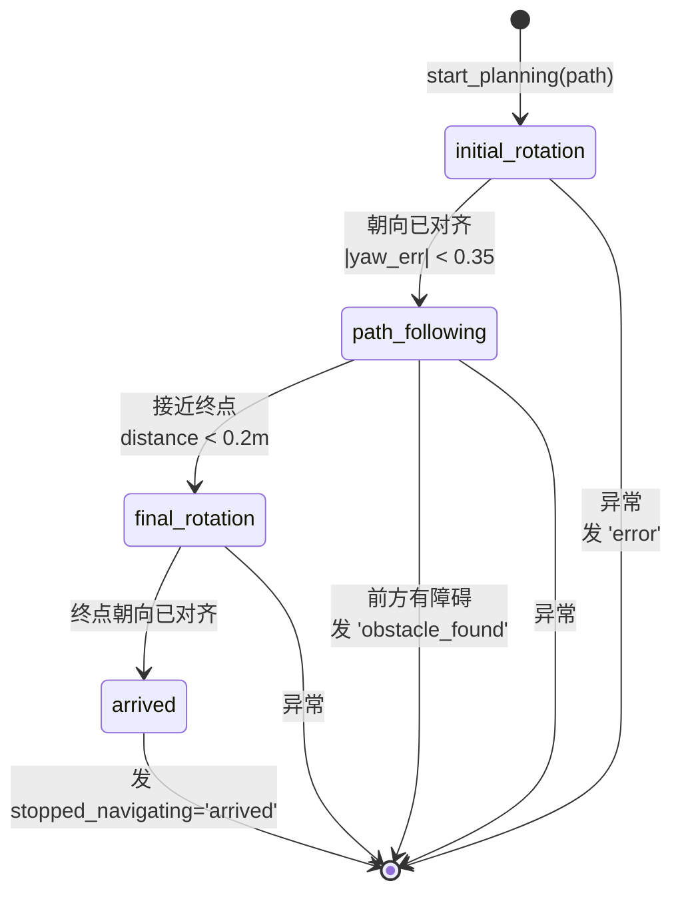
```mermaid
stateDiagram-v2
    [*] --> initial_rotation : start_planning(path)
    initial_rotation --> path_following : 朝向已对齐<br/>|yaw_err| < 0.35
    path_following --> final_rotation : 接近终点<br/>distance < 0.2m
    final_rotation --> arrived : 终点朝向已对齐
    arrived --> [*] : 发 stopped_navigating='arrived'
    
    path_following --> [*] : 前方有障碍<br/>发 'obstacle_found'
    initial_rotation --> [*] : 异常<br/>发 'error'
    path_following --> [*] : 异常
    final_rotation --> [*] : 异常
```

每个状态在做什么：

| 状态 | 用什么算 cmd_vel |
|------|-----------------|
| `initial_rotation` | `controller.rotate(yaw_error)` — 原地转到第一个 waypoint 的朝向 |
| `path_following` | 找路径上当前最近点 → 算 lookahead 点 → `controller.advance(lookahead, odom)` |
| `final_rotation` | `controller.rotate(yaw_error)` — 转到目标的最终朝向 |
| `arrived` | 发 `Twist()`（零速）+ 通知 GlobalPlanner |

## 4.6 第五步：PController — 从 lookahead 点算 Twist

文件：`dimos/navigation/replanning_a_star/controllers.py`

```python
def advance(self, lookahead_point, current_odom) -> Twist:
    direction = lookahead_point - current_pos
    desired_yaw = arctan2(dy, dx)
    yaw_error = desired_yaw - robot_yaw
    
    angular_v = k_angular * yaw_error            # P 控制
    
    if |yaw_error| > 90°:
        return Twist(linear=0, angular=angular_v)  # 大角度先原地转
    
    # 朝向差越大走越慢
    linear_v = max_speed * (1 - |yaw_error| / 90°)
    return Twist(linear=linear_v, angular=angular_v)
```

**直观规则**：

- 朝向差 > 90° → 只转不走（rotate-then-drive）
- 朝向差小 → 边走边纠
- 离 lookahead 点越歪，线速度越慢

还有个 `PdController`（PD 控制，加了导数项），用于减小震荡，但默认用的是 P。

## 4.7 第六步：重规划 — 路上发生意外了怎么办

`GlobalPlanner._thread_entrypoint()` 是个**监督线程**，10Hz 跑下面这套逻辑：

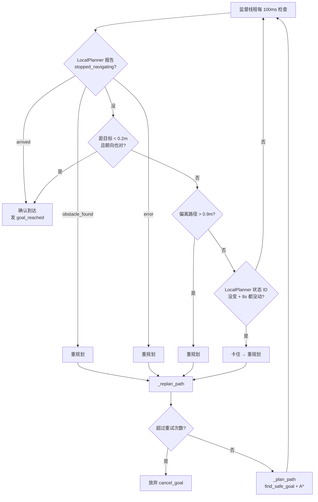
```mermaid
flowchart TB
    LOOP[监督线程每 100ms 检查] --> COND1{LocalPlanner 报告<br/>stopped_navigating?}
    COND1 -->|arrived| ARR[确认到达<br/>发 goal_reached]
    COND1 -->|obstacle_found| RP1[重规划]
    COND1 -->|error| RP2[重规划]
    COND1 -->|没| COND2{距目标 < 0.2m<br/>且朝向也对?}
    COND2 -->|是| ARR
    COND2 -->|否| COND3{偏离路径 > 0.9m?}
    COND3 -->|是| RP3[重规划]
    COND3 -->|否| COND4{LocalPlanner 状态 ID<br/>没变 + 8s 都没动?}
    COND4 -->|是| RP4[卡住 → 重规划]
    COND4 -->|否| LOOP

    RP1 --> RP[_replan_path]
    RP2 --> RP
    RP3 --> RP
    RP4 --> RP
    RP --> RPC{超过重试次数?}
    RPC -->|是| CANCEL[放弃 cancel_goal]
    RPC -->|否| GP[_plan_path<br/>find_safe_goal + A*]
    GP --> LOOP
```

**4 个触发重规划的条件**：

1. **LocalPlanner 报告 `obstacle_found`**：`PathClearance` 在前方扫到新障碍
2. **偏离路径 > 0.9m**：被外力推开 / 控制器漂了
3. **卡住**：`PositionTracker` 在 8 秒窗口内位置变化 < 0.4m
4. **接收到新 goal**：直接 `_plan_path()`

`ReplanLimiter` 防止无限重规划：每 N 次重规划必须实际向目标推进 X 米，否则就放弃。

## 4.8 第七步：和 MovementManager 联动

`MovementManager` 是导航/遥控/点击 **三路命令的总线**。文件位置 `dimos/navigation/movement_manager/movement_manager.py`（**注意**：早期叫 `dimos/navigation/smart_nav/modules/movement_manager/`，commit `2a430b55b` 已经搬到现在的位置；如果你看老文档/老 import 报错，就是这个原因）。

### 端口

```python
class MovementManager(Module):
    # 输入
    clicked_point:   In[PointStamped]   # 用户在 viewer 上点的位置
    nav_cmd_vel:     In[Twist]          # 来自 ReplanningAStarPlanner
    tele_cmd_vel:    In[Twist]          # 来自 KeyboardTeleop / 摇杆

    # 输出
    goal:            Out[PointStamped]  # 转发点击作为目标
    way_point:       Out[PointStamped]  # 当前 waypoint（也用于取消信号）
    cmd_vel:         Out[Twist]         # 实际下发给机器人的速度
    stop_movement:   Out[Bool]          # 通知 planner 停止
```

### 三个关键行为

**1. 点击转目标 + 安全检查**

```python
MAX_CLICK_HORIZONTAL_M = 500.0   # 防止点到无穷远
MAX_CLICK_VERTICAL_M   = 50.0
```

收到 `clicked_point` 时先校验 NaN/Inf 和量级，通过了再同时发 `way_point` + `goal`。

**2. 遥控优先 + 冷却期**

收到 `tele_cmd_vel` 时立刻：
- 发 `stop_movement=True` 让 planner 取消
- 发一个**坐标全 NaN 的 PointStamped 作为 goal**（"安全回退"语义，让任何还在跑的 planner 知道"放弃当前目标"）
- 把遥控速度按 `tele_cmd_vel_scaling` 缩放后发到 `cmd_vel`

之后 1 秒（`tele_cooldown_sec`）内进来的 `nav_cmd_vel` 全部忽略，避免 planner 抢方向盘。

**3. 自动 nav 模式**

cooldown 过了 + 没有遥控输入 → `nav_cmd_vel` 直接转发到 `cmd_vel`。

### 完整时序

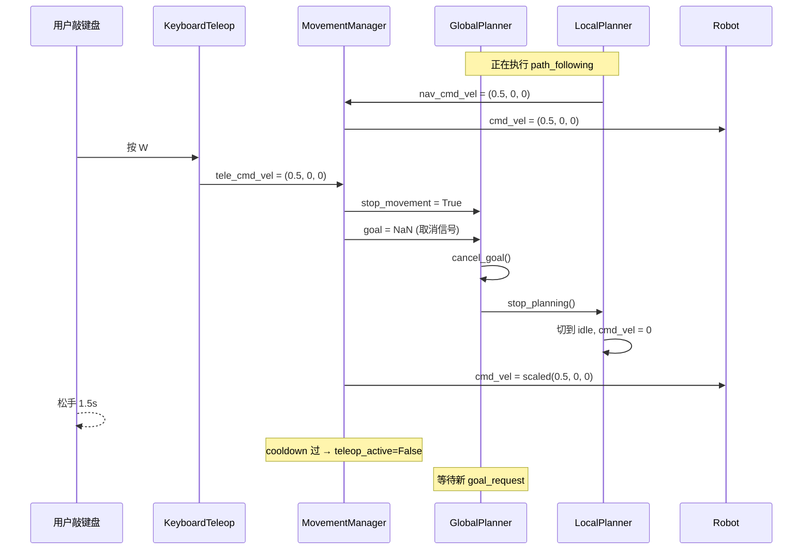
```mermaid
sequenceDiagram
    participant U as 用户敲键盘
    participant T as KeyboardTeleop
    participant MM as MovementManager
    participant GP as GlobalPlanner
    participant LP as LocalPlanner
    participant R as Robot

    Note over GP, LP: 正在执行 path_following
    LP->>MM: nav_cmd_vel = (0.5, 0, 0)
    MM->>R: cmd_vel = (0.5, 0, 0)

    U->>T: 按 W
    T->>MM: tele_cmd_vel = (0.5, 0, 0)
    MM->>GP: stop_movement = True
    MM->>GP: goal = NaN (取消信号)
    GP->>GP: cancel_goal()
    GP->>LP: stop_planning()
    LP->>LP: 切到 idle, cmd_vel = 0
    MM->>R: cmd_vel = scaled(0.5, 0, 0)

    U-->>U: 松手 1.5s
    Note over MM: cooldown 过 → teleop_active=False

    Note over GP: 等待新 goal_request
```

> **额外说明**：新栈 Nav Stack 0.1 的 `PathFollower.cmd_vel` 在 blueprint 里被 remap 成 `nav_cmd_vel`，所以**MovementManager 同时服务老栈和新栈**——这就是为什么它没放在 `replanning_a_star/` 目录下，而是单独一个模块。

---

# 五、自主探索（Frontier Exploration）— 让机器人"自己出门"

文件：`dimos/navigation/frontier_exploration/wavefront_frontier_goal_selector.py`

## 5.1 Frontier 是什么

**Frontier** = 已知 free 空间和未知空间的**边界**。机器人想"探索"，就要往这些边界走 — 走过去之后那块未知就变成已知了。

```
███████████          ███████████
█.........█          █.........█
█....R....█          █....R....█       
█.........█    →     █.........█      
█.........█          █....F....█       F = frontier
█fff???????          █fff......█       探索后变成 free
```

## 5.2 Wavefront 算法步骤

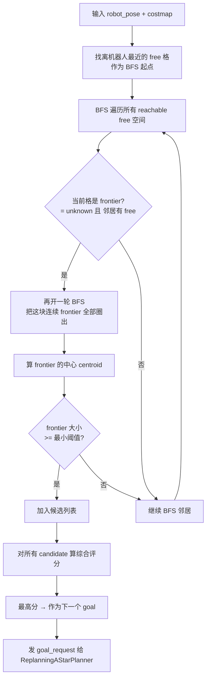
```mermaid
flowchart TB
    A[输入 robot_pose + costmap] --> B[找离机器人最近的 free 格<br/>作为 BFS 起点]
    B --> C[BFS 遍历所有 reachable free 空间]
    C --> D{当前格是 frontier?<br/>= unknown 且 邻居有 free}
    D -->|是| E[再开一轮 BFS<br/>把这块连续 frontier 全部圈出]
    D -->|否| F[继续 BFS 邻居]
    E --> G[算 frontier 的中心 centroid]
    G --> H{frontier 大小<br/>>= 最小阈值?}
    H -->|是| I[加入候选列表]
    H -->|否| F
    F --> C
    I --> J[对所有 candidate 算综合评分]
    J --> K[最高分 → 作为下一个 goal]
    K --> L[发 goal_request 给 ReplanningAStarPlanner]
```

## 5.3 综合评分（5 个权重）

`_compute_comprehensive_frontier_score`：

| 维度 | 权重 | 含义 |
|------|------|------|
| **info_gain** | 30% | frontier 越大，能新看到的区域越多 |
| **explored_distance** | 30% | 离已经探索过的目标越远越好（避免来回打转） |
| **distance** | 20% | 适中距离最好（5m 默认 lookahead） |
| **obstacles** | 15% | 离障碍物越远越安全 |
| **momentum** | 5% | 偏好"上次方向"，避免乱转 |

最高分胜出，发给规划器。

## 5.4 与 Planner 的协作

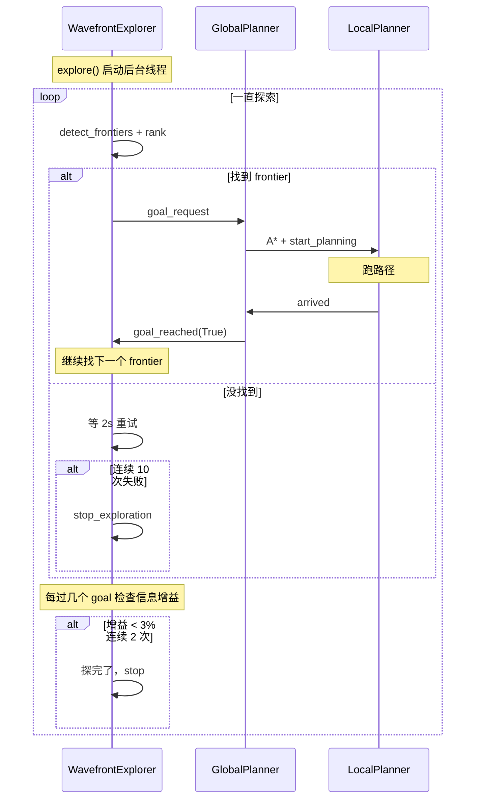
```mermaid
sequenceDiagram
    participant E as WavefrontExplorer
    participant GP as GlobalPlanner
    participant LP as LocalPlanner

    Note over E: explore() 启动后台线程
    
    loop 一直探索
        E->>E: detect_frontiers + rank
        alt 找到 frontier
            E->>GP: goal_request
            GP->>LP: A* + start_planning
            Note over LP: 跑路径
            LP->>GP: arrived
            GP->>E: goal_reached(True)
            Note over E: 继续找下一个 frontier
        else 没找到
            E->>E: 等 2s 重试
            alt 连续 10 次失败
                E->>E: stop_exploration
            end
        end
        
        Note over E: 每过几个 goal 检查信息增益
        alt 增益 < 3% 连续 2 次
            E->>E: 探完了，stop
        end
    end
```

agent 可以通过 skill 启停：

```python
@skill
def begin_exploration(self) -> str: ...
@skill
def end_exploration(self) -> str: ...
```

## 5.5 PatrollingModule — 已知地图上的"巡逻"

文件：`dimos/navigation/patrolling/module.py`

**问题**：地图已经建好了（或者用户希望机器人在已知区域里反复巡查），怎么让它**自动循环挑下一个目标点**？

**答案**：`PatrollingModule` 内置三种 `PatrolRouter`：

| Router | 行为 | 适合 |
|--------|------|------|
| `RandomPatrolRouter` | 在 free 区域随机采样 | 监控类应用 |
| `CoveragePatrolRouter` **默认** | 优先走"很久没访问"的格子（看 `VisitationHistory`） | 全覆盖巡逻 |
| `FrontierPatrolRouter` | 同时考虑 frontier，类似第五章 | 边巡边探 |

```python
@skill
async def start_patrol(self) -> str: ...
@skill
async def stop_patrol(self) -> str: ...
```

> **2026-05 更新**（commit `3bda85b9f`）：`PatrollingModule` 从 **threading + Event** 改造成 **asyncio**：
>
> - 巡逻循环 `_patrol_loop` 现在是 `async def`，`await self._goal_reached_event.wait()` 替代旧的 `threading.Event.wait()`
> - skill 方法标 `async def`，agent 调用 `start_patrol` / `stop_patrol` 时不再阻塞 event loop
> - 三个回调（`handle_odom`, `handle_global_costmap`, `handle_goal_reached`）改为 `async def` 自动挂到 reactive stream
> - 停止巡逻时 `_stop_patrolling` 会 `await self._patrol_task` 优雅取消
>
> **行为不变，只是不再吃线程池配额、不再阻塞**。这是 dimos `Module` 系统支持 `async` 的必然演进。

---

# 六、端到端实战 — 用 Go2 做一次完整任务

## 6.1 启动命令

```bash
# 真机
dimos run unitree-go2 --robot-ip 192.168.123.161

# 仿真
dimos --simulation run unitree-go2-agentic-sim
```

`unitree-go2` blueprint（`dimos/robot/unitree/go2/blueprints/smart/unitree_go2.py`）的拓扑：

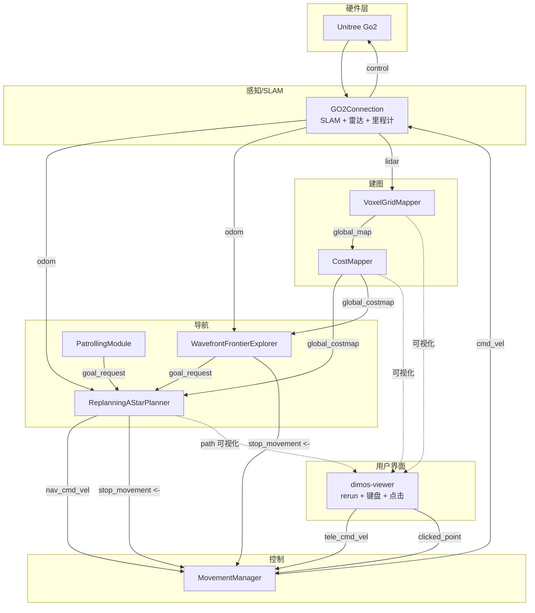
```mermaid
flowchart TB
    subgraph HW[硬件层]
        GO2[Unitree Go2]
    end

    subgraph SLAM[感知/SLAM]
        CONN[GO2Connection<br/>SLAM + 雷达 + 里程计]
    end

    subgraph MAP[建图]
        VOX[VoxelGridMapper]
        COST[CostMapper]
    end

    subgraph NAV[导航]
        PLAN[ReplanningAStarPlanner]
        EXP[WavefrontFrontierExplorer]
        PAT[PatrollingModule]
    end

    subgraph CTRL[控制]
        MM[MovementManager]
    end

    subgraph UI[用户界面]
        VIEWER[dimos-viewer<br/>rerun + 键盘 + 点击]
    end

    GO2 --> CONN
    CONN -->|odom| PLAN
    CONN -->|odom| EXP
    CONN -->|lidar| VOX
    VOX -->|global_map| COST
    COST -->|global_costmap| PLAN
    COST -->|global_costmap| EXP
    
    EXP -->|goal_request| PLAN
    PAT -->|goal_request| PLAN
    
    PLAN -->|nav_cmd_vel| MM
    PLAN -->|stop_movement &lt;-| MM
    EXP -->|stop_movement &lt;-| MM
    
    VIEWER -->|tele_cmd_vel| MM
    VIEWER -->|clicked_point| MM
    
    MM -->|cmd_vel| CONN
    CONN -->|control| GO2
    
    COST -.可视化.-> VIEWER
    VOX -.可视化.-> VIEWER
    PLAN -.path 可视化.-> VIEWER
```

## 6.2 一次"点哪走哪"的完整数据流

假设你启动了系统，在 rerun 上点击地图 (3.5m, 2.0m) 一个位置：

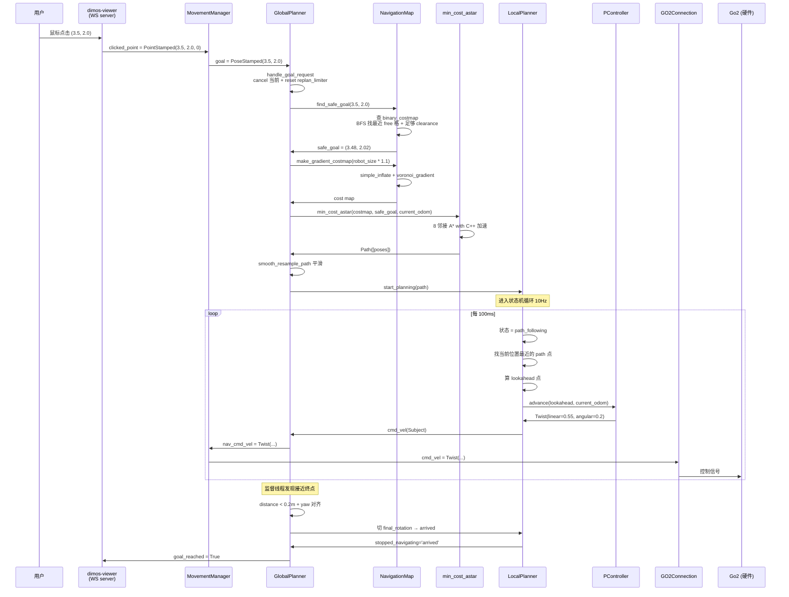
```mermaid
sequenceDiagram
    participant U as 用户
    participant V as dimos-viewer<br/>(WS server)
    participant MM as MovementManager
    participant GP as GlobalPlanner
    participant NM as NavigationMap
    participant ASTAR as min_cost_astar
    participant LP as LocalPlanner
    participant CT as PController
    participant CONN as GO2Connection
    participant ROBOT as Go2 (硬件)

    U->>V: 鼠标点击 (3.5, 2.0)
    V->>MM: clicked_point = PointStamped(3.5, 2.0, 0)
    MM->>GP: goal = PoseStamped(3.5, 2.0)
    
    GP->>GP: handle_goal_request<br/>cancel 当前 + reset replan_limiter
    GP->>NM: find_safe_goal(3.5, 2.0)
    NM->>NM: 查 binary_costmap<br/>BFS 找最近 free 格 + 足够 clearance
    NM->>GP: safe_goal = (3.48, 2.02)
    
    GP->>NM: make_gradient_costmap(robot_size * 1.1)
    NM->>NM: simple_inflate + voronoi_gradient
    NM->>GP: cost map
    GP->>ASTAR: min_cost_astar(costmap, safe_goal, current_odom)
    ASTAR->>ASTAR: 8 邻接 A* with C++ 加速
    ASTAR->>GP: Path([poses])
    
    GP->>GP: smooth_resample_path 平滑
    GP->>LP: start_planning(path)
    
    Note over LP: 进入状态机循环 10Hz
    
    loop 每 100ms
        LP->>LP: 状态 = path_following
        LP->>LP: 找当前位置最近的 path 点
        LP->>LP: 算 lookahead 点
        LP->>CT: advance(lookahead, current_odom)
        CT->>LP: Twist(linear=0.55, angular=0.2)
        LP->>GP: cmd_vel(Subject)
        GP->>MM: nav_cmd_vel = Twist(...)
        MM->>CONN: cmd_vel = Twist(...)
        CONN->>ROBOT: 控制信号
    end
    
    Note over GP: 监督线程发现接近终点
    GP->>GP: distance < 0.2m + yaw 对齐
    GP->>LP: 切 final_rotation → arrived
    LP->>GP: stopped_navigating='arrived'
    GP->>V: goal_reached = True
```

## 6.3 Agent 用语义检索找东西的完整链路

如果你用了 `unitree-go2-agentic` 这种带 agent 的 blueprint，agent 收到"去找咖啡杯"指令的全程：

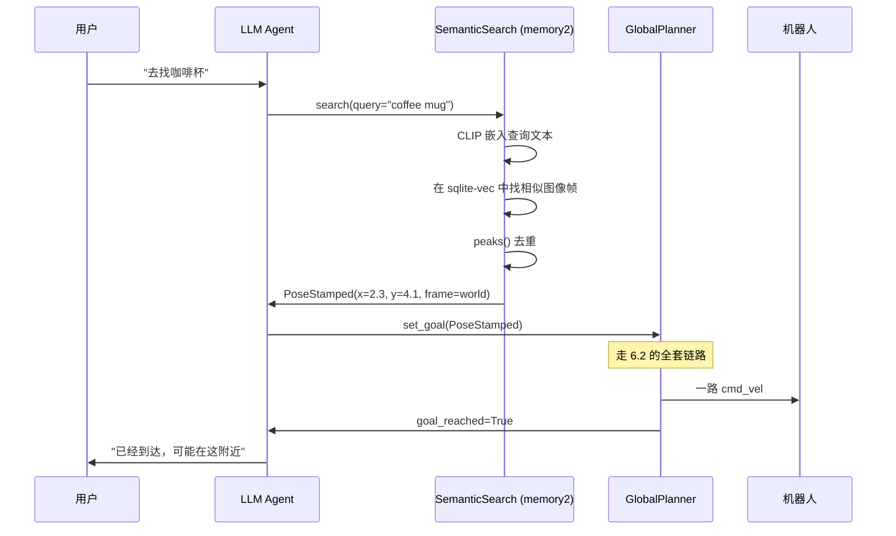
```mermaid
sequenceDiagram
    participant USER as 用户
    participant AGENT as LLM Agent
    participant SS as SemanticSearch (memory2)
    participant GP as GlobalPlanner
    participant ROBOT as 机器人

    USER->>AGENT: "去找咖啡杯"
    AGENT->>SS: search(query="coffee mug")
    SS->>SS: CLIP 嵌入查询文本
    SS->>SS: 在 sqlite-vec 中找相似图像帧
    SS->>SS: peaks() 去重
    SS->>AGENT: PoseStamped(x=2.3, y=4.1, frame=world)
    AGENT->>GP: set_goal(PoseStamped)
    Note over GP: 走 6.2 的全套链路
    GP->>ROBOT: 一路 cmd_vel
    GP->>AGENT: goal_reached=True
    AGENT->>USER: "已经到达，可能在这附近"
```

---

# 七、扩展点和延伸阅读

## 7.1 自己写一个 occupancy 算法

只需在 `dimos/mapping/pointclouds/occupancy.py` 里：

```python
@dataclass(frozen=True)
class MyConfig(OccupancyConfig):
    my_param: float = 1.0

def my_occupancy(cloud: PointCloud2, **kwargs) -> OccupancyGrid:
    cfg = MyConfig(**kwargs)
    points, _ = cloud.as_numpy()
    # ... 你的算法 ...
    return OccupancyGrid(grid=..., resolution=cfg.resolution, origin=..., frame_id=...)

OCCUPANCY_ALGOS["my_algo"] = my_occupancy
```

然后在 blueprint 里：

```python
CostMapper.blueprint(config=Config(algo="my_algo", config=MyConfig(my_param=2.0)))
```

## 7.2 自己写一个 controller

实现 `dimos/navigation/replanning_a_star/controllers.py:Controller` 协议：

```python
class MyController:
    def advance(self, lookahead_point, current_odom) -> Twist: ...
    def rotate(self, yaw_error) -> Twist: ...
    def reset_errors(self) -> None: ...
    def reset_yaw_error(self, value) -> None: ...
```

在 `LocalPlanner.__init__` 把 `self._controller` 替换成你的实现。

## 7.3 替换 SLAM 后端

只要任何模块对外暴露：

- `odom: Out[PoseStamped]`
- `lidar: Out[PointCloud2]`（点云已对齐到 world frame）

就能无缝接入下游建图链。dimos 已支持的：

- FastLIO2（`dimos/hardware/sensors/lidar/fastlio2/`）
- Unitree Go2 内置 SLAM（`dimos/robot/unitree/go2/connection.py`）
- MuJoCo 仿真（`dimos/simulation/engines/mujoco_sim_module.py`）

## 7.4 推荐入门资料

如果想从 dimos 跳出去系统学：

- **SLAM**：港大 FastLIO2 论文（dimos 用的就是这个的实现），或 Cartographer (Google) 入门
- **A* 与改进**：D* / D* Lite / RRT* / Hybrid A*
- **costmap**：ROS Navigation 的 costmap_2d 包文档（dimos 的设计深受其影响）
- **控制**：Pure Pursuit（lookahead 控制的鼻祖）、Stanley Controller、TEB Local Planner
- **Pose Graph Optimization**：GTSAM 教程、《Probabilistic Robotics》第 11 章

## 7.5 Nav Stack 0.1 完全指南

> 这是 commit `2a430b55b`（2026-05-09）合并的全新导航栈。**注意：Go2 没用，G1 在用**。本节只在你需要给 G1 改导航 / 在自己平台上接 Nav Stack 时再读。

### 7.5.1 八个模块速览

| 模块 | 父类 | 实现语言 | 一句话职责 |
|------|------|---------|-----------|
| `PGO` | `NativeModule` | C++（GTSAM iSAM2 + PCL ICP） | 回环检测，输出 `corrected_odometry` + `map→odom` TF |
| `TerrainAnalysis` | `NativeModule` | C++ | 雷达扫描 → `terrain_map` 点云（高度阈值 + 动态衰减） |
| `TerrainMapExt` | `Module` | Python | 41×41 滚动地形格 + BFS 连通性 → `terrain_map_ext` |
| `FarPlanner` | `NativeModule` | C++ | visibility graph 全局规划，**大地图优势** |
| `SimplePlanner` | `Module` | Python | 简化 A*，从 `terrain_map_ext` 直接构 2D costmap |
| `LocalPlanner` | `NativeModule` | C++ | 多路径并行评估的局部避障，输出 `path` |
| `PathFollower` | `NativeModule` | C++ | pure pursuit + PID yaw 控制，输出 `cmd_vel` |
| `TarePlanner` | `NativeModule` | C++ | TARE 自主探索（可选） |
| `NavRecord` | `Recorder` | Python | 把 14 个导航 topic 录到 memory2 SQLite |

### 7.5.2 数据流（完整版）

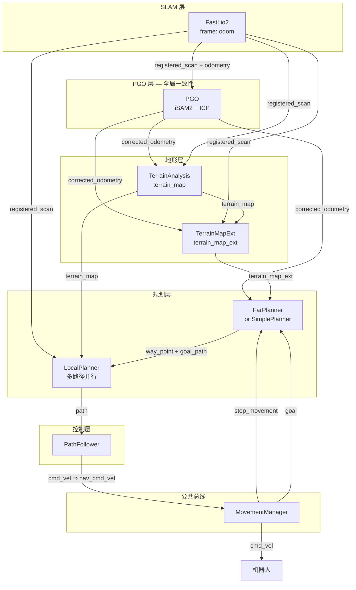
```mermaid
flowchart TB
    subgraph SLAM[SLAM 层]
        FL[FastLio2<br/>frame: odom]
    end

    subgraph PGO_LAYER["PGO 层 — 全局一致性"]
        PGO[PGO<br/>iSAM2 + ICP]
    end

    subgraph TERRAIN[地形层]
        TA[TerrainAnalysis<br/>terrain_map]
        TME[TerrainMapExt<br/>terrain_map_ext]
    end

    subgraph PLAN[规划层]
        FAR[FarPlanner<br/>or SimplePlanner]
        LP_NS[LocalPlanner<br/>多路径并行]
    end

    subgraph CTRL[控制层]
        PF[PathFollower]
    end

    subgraph BUS[公共总线]
        MM[MovementManager]
    end

    FL -->|registered_scan + odometry| PGO
    PGO -->|corrected_odometry| TA
    PGO -->|corrected_odometry| TME
    PGO -->|corrected_odometry| FAR
    FL -->|registered_scan| TA
    FL -->|registered_scan| TME
    FL -->|registered_scan| LP_NS
    TA -->|terrain_map| TME
    TA -->|terrain_map| LP_NS
    TME -->|terrain_map_ext| FAR
    FAR -->|way_point + goal_path| LP_NS
    LP_NS -->|path| PF
    PF -->|cmd_vel ⇒ nav_cmd_vel| MM
    MM -->|cmd_vel| ROBOT[机器人]
    MM -->|stop_movement| FAR
    MM -->|goal| FAR
```

### 7.5.3 一句话启动

```python
from dimos.navigation.nav_stack.main import create_nav_stack
from dimos.hardware.sensors.lidar.fastlio2.module import FastLio2
from dimos.navigation.movement_manager.movement_manager import MovementManager
from dimos.core.coordination.blueprints import autoconnect

my_nav_stack = autoconnect(
    FastLio2.blueprint(),
    create_nav_stack(
        planner="far",              # "far" 或 "simple"
        use_terrain_map_ext=True,
        vehicle_height=1.5,         # G1 的身高
        max_speed=1.0,
        replan_rate=0.5,            # SimplePlanner 用
        record=False,               # True 启用 NavRecord
    ),
    MovementManager.blueprint(),
)
```

### 7.5.4 关键概念：四层坐标系

旧栈所有数据都标 `frame_id="map"`。Nav Stack 0.1 严格分层（`dimos/navigation/nav_stack/frames.py`）：

```
map     ←  PGO 修正后的全局一致坐标（不漂移，但有跳变）
 │  PGO 发布 map→odom TF
 ↓
odom    ←  里程计本地坐标（连续，但会漂移）
 │  机器人本体
 ↓
body    ←  机器人重心
 │  传感器外参
 ↓
sensor  ←  雷达坐标系
```

> **PGO 启动时会先发一个 identity TF**（map ≡ odom），让下游模块能立刻 query map→body，不必等第一次回环。

### 7.5.5 各模块端口表

#### PGO

| 方向 | 端口 | 类型 | 说明 |
|------|------|------|------|
| In | `registered_scan` | `PointCloud2` | 已对齐到 odom 的扫描 |
| In | `odometry` | `Odometry` | SLAM 给的本地里程计 |
| Out | `corrected_odometry` | `Odometry` | 应用 map→odom 修正后的里程计 |
| Out | `global_map` | `PointCloud2` | 全局点云（已应用所有回环修正） |
| Out | `pgo_tf` | `Odometry` | map→odom TF（同时也 publish 到 dimos TF buffer） |

#### TerrainAnalysis（C++ NativeModule，30+ 个配置项）

| 方向 | 端口 | 类型 | 说明 |
|------|------|------|------|
| In | `registered_scan` | `PointCloud2` | 雷达扫描 |
| In | `odometry` | `Odometry` | 用 corrected_odometry remap |
| Out | `terrain_map` | `PointCloud2` | 带"地面高度差"的点云 |

关键配置：

| 字段 | 默认 | 含义 |
|------|------|------|
| `scan_voxel_size` | 0.05 | 雷达扫描下采样体素 |
| `terrain_voxel_size` | 0.2 | 地形格体素 |
| `terrain_voxel_half_width` | 10 | 滚动窗口半宽（共 21×21 格） |
| `obstacle_height_threshold` | 0.1 | 高于这个 = 障碍 |
| `vehicle_height` | 1.5 | 机器人高度（G1） |
| `decay_time` | 1.0 | 旧观测衰减时间（秒） |
| `clear_dynamic_obstacles` | True | 是否清除动态障碍 |

#### FarPlanner（C++，visibility graph）

| 方向 | 端口 | 类型 | 说明 |
|------|------|------|------|
| In | `terrain_map_ext` | `PointCloud2` | 优先用 |
| In | `terrain_map` | `PointCloud2` | 备选 |
| In | `registered_scan` | `PointCloud2` | 用于即时避障判断 |
| In | `odometry` | `Odometry` | corrected_odometry |
| In | `goal` | `PointStamped` | 来自 MovementManager |
| In | `stop_movement` | `Bool` | 取消 |
| Out | `way_point` | `PointStamped` | 给 LocalPlanner 的下一个 waypoint |
| Out | `goal_path` | `Path` | 全局路径（仅可视化） |
| Out | `graph_nodes` | `GraphNodes3D` | visibility graph 节点（可视化） |
| Out | `graph_edges` | `LineSegments3D` | graph 边 |
| Out | `contour_polygons` | `ContourPolygons3D` | 障碍轮廓 |
| Out | `nav_boundary` | `PolygonStamped` | 导航边界 |

#### LocalPlanner（C++，**核心避障**）

| 方向 | 端口 | 类型 | 说明 |
|------|------|------|------|
| In | `registered_scan` | `PointCloud2` | 实时扫描 |
| In | `odometry` | `Odometry` | corrected_odometry |
| In | `terrain_map` | `PointCloud2` | 地形 |
| In | `way_point` | `PointStamped` | 来自 FarPlanner/SimplePlanner |
| In | `goal_pose` | `PoseStamped` | 终点姿态 |
| In | `joy_cmd` | `Twist` | 摇杆 |
| In | `speed` | `Float32` | 限速 |
| In | `navigation_boundary` | `PolygonStamped` | 不能跨过的边界 |
| In | `added_obstacles` | `PointCloud2` | 手动加障碍 |
| In | `cancel_goal` | `Bool` | 取消 |
| Out | `path` | `Path` | 局部路径（给 PathFollower） |
| Out | `effective_cmd_vel` | `Twist` | 直接控制（绕过 PathFollower） |
| Out | `free_paths` | `PointCloud2` | 候选无碰撞路径（可视化） |
| Out | `slow_down` | `Int8` | 减速等级 |
| Out | `goal_reached` | `Bool` | 到达 |

#### PathFollower（C++，pure pursuit）

| 方向 | 端口 | 类型 | 说明 |
|------|------|------|------|
| In | `path` | `Path` | 来自 LocalPlanner |
| In | `odometry` | `Odometry` | corrected_odometry |
| In | `speed` | `Float32` | 限速 |
| In | `slow_down` | `Int8` | 减速 |
| In | `safety_stop` | `Int8` | 紧急停 |
| Out | `cmd_vel` | `Twist` | **在 main.py 里 remap 成 `nav_cmd_vel`** |

关键配置：

| 字段 | 默认 | 含义 |
|------|------|------|
| `look_ahead_distance` | 0.5 | pure pursuit lookahead 距离（m） |
| `max_speed` | 1.0 | 最大线速度（m/s） |
| `max_yaw_rate` | 45.0 | 最大角速度（deg/s，C++ 内部转 rad） |
| `goal_tolerance` | 0.3 | 终点容差（m） |
| `vehicle_config` | `omniDir` | 全向 / 标准 |
| `max_acceleration` | 1.0 | 最大加速度 |

### 7.5.6 SimplePlanner — Python 版的简化全局规划

如果你不想编译 FarPlanner 的 C++ 二进制，可以用 `planner="simple"`：

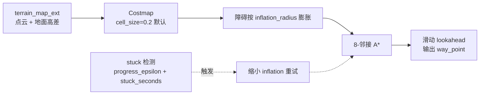
```mermaid
flowchart LR
    TM[terrain_map_ext<br/>点云 + 地面高差] --> CM[Costmap<br/>cell_size=0.2 默认]
    CM --> INFL[障碍按 inflation_radius 膨胀]
    INFL --> ASTAR[8-邻接 A*]
    ASTAR --> WP[滑动 lookahead<br/>输出 way_point]
    
    STUCK[stuck 检测<br/>progress_epsilon + stuck_seconds] -.触发.-> SHRINK[缩小 inflation 重试]
    SHRINK -.-> ASTAR
```

特点：

- 完全 Python 实现，调试方便
- 内置**卡住时缩小障碍膨胀**的容错逻辑（`stuck_shrink_factor`）
- 适合测试/开发，性能上不如 FarPlanner

### 7.5.7 NavRecord — 专用导航录制

把以下 14 个 topic 全录到 SQLite（默认 `nav_recording.db`）：

```
cmd_vel, corrected_odometry, path, goal_path,
way_point, goal, stop_movement, effective_cmd_vel,
slow_down, goal_reached, terrain_map, global_map,
odometry, registered_scan
```

后续可以用 dimos 的 rosbag fixture 工具（`dimos/navigation/nav_stack/tests/rosbag_fixtures.py`）回放这些数据做离线测试。

> **注意**：注释明确写了 G1 onboard 上启用 `record=True` 可能触发 TLS 内存分配失败（aarch64 + Python 多进程的已知问题）。所以 `main.py` 用的是 lazy import，`record=False` 时根本不导入。

### 7.5.8 老栈 vs 新栈 一图懂

```mermaid
flowchart LR
    subgraph OLD["老栈（Go2 在用）"]
        direction TB
        O1[VoxelGridMapper] --> O2[CostMapper] --> O3[ReplanningAStarPlanner]
        O3 -->|nav_cmd_vel| OMM[MovementManager]
    end

    subgraph NEW["Nav Stack 0.1（G1 在用）"]
        direction TB
        N0[FastLio2] --> N1[PGO] --> N2[TerrainAnalysis] --> N3[TerrainMapExt]
        N3 --> N4[FarPlanner] --> N5[LocalPlanner] --> N6[PathFollower]
        N6 -->|nav_cmd_vel| NMM[MovementManager]
    end
```

**两个栈通过 `nav_cmd_vel` 接口对齐 MovementManager**——所以你完全可以"半新半老"混用，这也是为什么 commit `2a430b55b` 没把老栈删掉。

## 7.6 快速 cheatsheet

### 老栈（Go2 用）

| 想做的事 | 看哪 |
|---------|------|
| 改 voxel 大小 | `VoxelGridMapper.config.voxel_size`（默认 0.05） |
| 改机器人尺寸 | `GlobalConfig.robot_width` / `robot_rotation_diameter` |
| 改 A* unknown 区域成本 | `min_cost_astar(unknown_penalty=...)`（默认 0.8） |
| 改控制频率 | `LocalPlanner._control_frequency`（默认 10Hz） |
| 改导航最大速度 | `LocalPlanner._speed`（默认 0.55 m/s） |
| 改卡住判定 | `GlobalPlanner._stuck_time_window=8s`, `_stuck_threshold=0.4m` |
| 改重规划阈值 | `GlobalPlanner._max_path_deviation=0.9m` |
| 调试模式画导航 cost map | `export DEBUG_NAVIGATION=1` |
| 调试 frontier 评分 | 看 logs，`logger.info("Distance score: ...")` |

### Nav Stack 0.1（G1 用）

| 想做的事 | 看哪 |
|---------|------|
| 一行起栈 | `create_nav_stack(planner="far"/"simple", ...)` |
| 切换全局规划器 | `planner="far"`（C++ visibility graph）/ `"simple"`（Python A*） |
| 改机器人身高 | `vehicle_height=1.5`（影响 TerrainAnalysis、TerrainMapExt、FarPlanner） |
| 改最大速度 | `max_speed=1.0`（同时传给 LocalPlanner + PathFollower） |
| 改 lookahead | `path_follower={"look_ahead_distance": 0.5}` |
| 启用录制 | `record=True`（默认关，G1 onboard 慎开） |
| 启用探索 | `use_tare=True` |
| 改 PGO 回环搜索半径 | `pgo={"loop_search_radius": 1.0}` |
| 改地形格大小 | `terrain_voxel_size=0.2` |
| 加载 Rerun 默认配色 | `nav_stack_rerun_config(agentic_debug=True)` |

### FastLIO2（2026-05 新增）

| 想做的事 | 看哪 |
|---------|------|
| 设置传感器安装位姿 | `FastLio2.config.mount = Pose(x=..., y=..., z=..., orientation=...)` |
| 输出 frame 名 | `frame_id="odom"`（之前默认是 `"map"`，新版用 `"odom"`） |
| 子 frame 名 | `child_frame_id="body"` |

---

> 文档基于 `d2e695b38`（2026-05-13 同步）。**Nav Stack 0.1（commit `2a430b55b`）已合并到 main，但 Go2 没换栈**——所以本教程的主体仍然有效，第七章新增 Nav Stack 0.1 章节作为 G1 / 自定义平台的参考。后续再有大变动会出新版。
