# 从零理解 dimos 的重定位系统（Relocalization）

> 给已经了解 dimos 建图 + 导航老栈（VoxelGridMapper → CostMapper → A*）的工程师看的进阶教程。先用大白话讲清"为什么要重定位"，再一层层走进 `dimos/mapping/relocalization/` 的代码实现，对比老栈的不同，探讨改进方向。
>
> **基于 dimos `main` 分支 commit `7d2affd7d`（2026-06-24，sync upstream/main 100 commits）。**
>
> **2026-06-24 更新说明**：相比 `b45e5d58`（2026-05-25），**在线重定位部分（`RelocalizationModule` / `relocalize.py`）没有改动**；但**离线 PGO 建图管线被彻底重构**——`relocalization/pgo.py` 已删除并迁移到 `dimos/mapping/loop_closure/`，从「`_SimplePGO` 类 + `pgo_then_voxels()` 两遍函数」改成「memory2 `PGO` Transformer + `PoseGraph` 数据类」的流式架构；CLI 命令从 `dimos export-premap` 改为 `dimos map global ... --export`。本文第三章、第六章、第七章已按新代码更新，并在变更处标注。

---

## 目录

- [一、通俗篇：重定位是怎么回事](#一通俗篇重定位是怎么回事)
- [二、总览：重定位系统的三层架构](#二总览重定位系统的三层架构)
- [三、离线建图（Premap Export）— 把走过的路变成高精度地图](#三离线建图premap-export-把走过的路变成高精度地图)
- [四、在线重定位（Relocalization Module）— 在旧地图里找到自己](#四在线重定位relocalization-module-在旧地图里找到自己)
- [五、与老导航栈的关系和对比](#五与老导航栈的关系和对比)
- [六、端到端实战 — 用 Go2 做一次完整重定位导航](#六端到端实战-用-go2-做一次完整重定位导航)
- [七、改进方向和延伸阅读](#七改进方向和延伸阅读)

---

# 一、通俗篇：重定位是怎么回事

## 1.1 老栈的问题：每次开机就失忆

在 [建图与导航教程](dimos-navigation-mapping-tutorial.md) 里我们讲过：老导航栈是这样工作的：

```
启动 → SLAM 从零建图 → 体素累积 → costmap → A* 规划 → 走
```

问题来了：**每次重启、机器人关机再开机，SLAM 就从零开始**。之前建好的地图全丢了。

这就像人每天早上起来都失忆——你得重新认路、重新探索。

**核心痛点**：
- 第一次建图花了 10 分钟探索整个办公室
- 第二天开机……又得探索一遍
- 而且第一次的地图**更精确**（走了更多地方、有回环校正），新建的不如旧的好

## 1.2 重定位解决什么

重定位（Relocalization）= **在一张已有的地图里，找到"我现在在哪"**。

类比：你去过一次图书馆，画了一张手绘地图。第二天再去，只要拿着旧地图看看周围书架的位置，就知道"我现在在三楼科技区第 2 排"——不用重新画地图。

**关键区别**：

| | 老栈（纯在线） | 重定位栈 |
|---|---|---|
| 地图来源 | 开机后实时建 | **离线预制** + 实时局部 |
| 坐标系 | 每次 SLAM 自己定义 | **对齐到全局地图** |
| 首次可导航时间 | 等探索完 | 几秒内（有 premap 就行） |
| 精度 | 受实时 drift 影响 | PGO 回环校正后精度更高 |
| 可重复性 | 每次不同 | 同一个坐标系、可复现 |

## 1.3 三步走：录制 → 导出 → 重定位

整个流程分三步：

```
┌─────────────────────────────────────────────────────────────────┐
│ 第 1 步：录制（一次性）                                           │
│   机器人四处走 → 录下 lidar + odom 到 SQLite                      │
├─────────────────────────────────────────────────────────────────┤
│ 第 2 步：离线导出 premap（一次性）                                 │
│   PGO 回环校正 → 两遍体素融合 → 生成 .pc2.lcm 高精度地图            │
├─────────────────────────────────────────────────────────────────┤
│ 第 3 步：在线重定位（每次启动）                                    │
│   加载 premap → 多尺度 RANSAC+ICP → 找到 world→map 变换            │
│   → 融合本地图 + premap → 输出到 costmap → 照常 A* 导航            │
└─────────────────────────────────────────────────────────────────┘
```

## 1.4 关键概念定义

| 概念 | 含义 |
|------|------|
| **Premap** | 预制地图，由离线 PGO pipeline 生成的高精度 3D 点云 |
| **PGO** | Pose Graph Optimization，位姿图优化——用回环约束修正 SLAM 累积漂移 |
| **Keyframe** | 关键帧——PGO 里每隔一段距离/角度采样的帧 |
| **Loop Closure** | 回环检测——发现"我回到了以前来过的地方"，用来纠正漂移 |
| **FPFH** | Fast Point Feature Histograms，点云局部特征描述子 |
| **RANSAC** | 随机采样一致性，用于粗配准（初始对齐） |
| **ICP** | Iterative Closest Point，迭代最近点，用于精配准 |
| **world frame** | 当前 SLAM 的坐标系（每次开机可能不同） |
| **map frame** | premap 的坐标系（固定不变） |
| **TF world→map** | 重定位算出的变换，把当前坐标系对齐到 premap 坐标系 |

## 1.5 它能干什么 / 不能干什么

**能**：
- 机器人关机重启后，几秒内恢复到同一个全局坐标系
- 导航到"上次记住的"固定位置（如充电桩、工位编号）
- 利用全局 premap 做 costmap，无需等本地图建完

**不能**：
- 环境变化太大（搬了家具、换了房间布局）→ 匹配失败
- 没有 lidar 的场景（纯视觉重定位需另外的方案）
- 动态障碍物（premap 是静态的，需要本地图来补充动态信息）

---

# 二、总览：重定位系统的三层架构

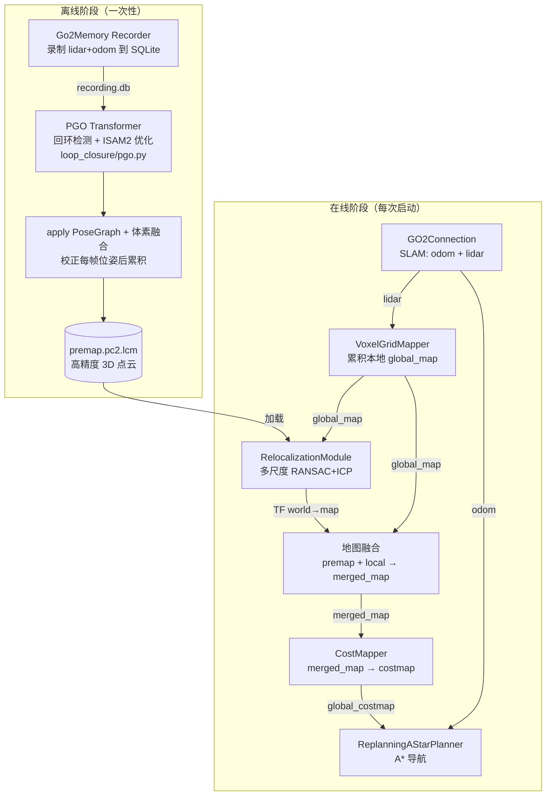

| 阶段 | 模块 | 输入 | 输出 |
|------|------|------|------|
| 离线 | `Go2Memory (Recorder)` | lidar + odom + color_image | `recording_go2.db` |
| 离线 | `PGO` Transformer + `dimos map global --export` | SQLite stream | `<dataset>.pc2.lcm` |
| 在线 | `VoxelGridMapper` | lidar 流 | `global_map` (3D) |
| 在线 | `RelocalizationModule` | global_map + premap | TF(world→map) + `merged_map` |
| 在线 | `CostMapper` | merged_map / global_map | `global_costmap` (2D) |
| 在线 | `ReplanningAStarPlanner` | costmap + odom + goal | `nav_cmd_vel` |

> **2026-06 变更**：离线导出从 `pgo_then_voxels()` 函数（`relocalization/pgo.py`）改为 `dimos map global <dataset> --export`（底层用 `loop_closure/pgo.py` 的 `PGO` Transformer）。在线三个模块不变。

---

# 三、离线建图（Premap Export）— 把走过的路变成高精度地图

## 3.1 第一站：录制数据 — Go2Memory

文件：`dimos/robot/unitree/go2/blueprints/smart/unitree_go2.py`

**问题**：怎么把机器人走一圈的所有传感器数据存下来？

**答案**：`Go2Memory` 继承自 `Recorder`（memory2 模块），把 `lidar`、`odom`、`color_image` 三路流写入 SQLite 数据库。

```python
class Go2Memory(Recorder):
    color_image: In[Image]
    lidar: In[PointCloud2]
    odom: In[PoseStamped]
    config: Go2MemoryConfig  # db_path = "recording_go2.db"
```

使用方式：

```bash
dimos run unitree-go2-memory --robot-ip 192.168.123.161
# 机器人四处走一圈，Ctrl-C 停止
# 生成 recording_go2.db
```

## 3.2 第二站：PGO 位姿图优化 — `PGO` Transformer

文件：`dimos/mapping/loop_closure/pgo.py`（**2026-06 迁移**：原 `dimos/mapping/relocalization/pgo.py` 已删除）

> **架构变更（2026-06）**：原来是一个 `_SimplePGO` 类一把梭。现在重构成 memory2 的 **Transformer** 架构，三个公开类型：
> - **`PGO`**（`Transformer[PointCloud2, PoseGraph]`）：把它套在 lidar 流上，每检测到一次回环就吐出一个累积的 `PoseGraph` 快照（流末尾再补吐一次，保证 `.last()` 总有结果）。
> - **`PoseGraph`**（frozen dataclass，**本身也是 Transformer**）：携带 `keyframes`（节点）和 `loops`（回环边）。用 `stream.transform(graph)` 把任意流的 `obs.pose` 改写到校正后的坐标系，或用 `graph.correct(pose)` 做单次校正。
> - **`_PGOState`**（内部类，取代老的 `_SimplePGO`）：真正跑 ISAM2 + ICP 回环的增量状态机。
>
> 典型用法：
> ```python
> graph = lidar.transform(PGO()).last().data   # 批处理：跑完整条流拿最终 PoseGraph
> corrected = some_stream.transform(graph)      # 应用：把校正量贴回任意流的 pose
> for snapshot in lidar.transform(PGO()): ...   # 实时可视化：每次回环吐一个快照
> ```

**问题**：SLAM 给的 odom 有累积漂移，走一圈回来发现"起点"差了 20cm。怎么修正？

**答案**：位姿图优化（PGO）。核心思想——把每个关键帧看作图的"节点"，把相邻帧的相对运动看作"边"（约束），如果检测到回环（"我回到了老地方"），就加一条新边，然后用 GTSAM 的 ISAM2 把所有节点位置一起优化。

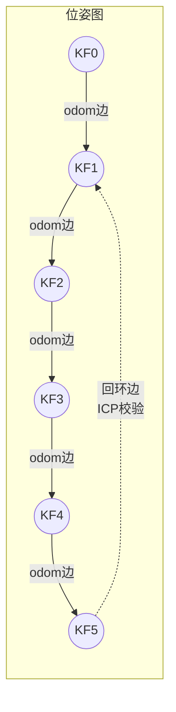

**关键帧检测**（`_PGOState._is_keyframe`，原名 `is_key_pose`）：

```python
# dimos/mapping/loop_closure/pgo.py
def _is_keyframe(self, local_pose) -> bool:
    if not self._key_poses:
        return True
    delta = self._key_poses[-1].local.inverse().compose(local_pose)
    delta_trans = float(np.linalg.norm(np.asarray(delta.translation())))
    # 从旋转矩阵迹算夹角: cos(theta) = (tr(R) - 1) / 2
    cos_theta = float(np.clip((np.trace(delta.rotation().matrix()) - 1.0) / 2.0, -1.0, 1.0))
    delta_deg = float(np.degrees(np.arccos(cos_theta)))
    # 位移 > 0.5m 或 旋转 > 10° → 新关键帧
    return delta_trans > self._cfg.key_pose_delta_trans or delta_deg > self._cfg.key_pose_delta_deg
```

**回环检测**（`_PGOState._search_for_loops`，原名 `search_for_loops`）：

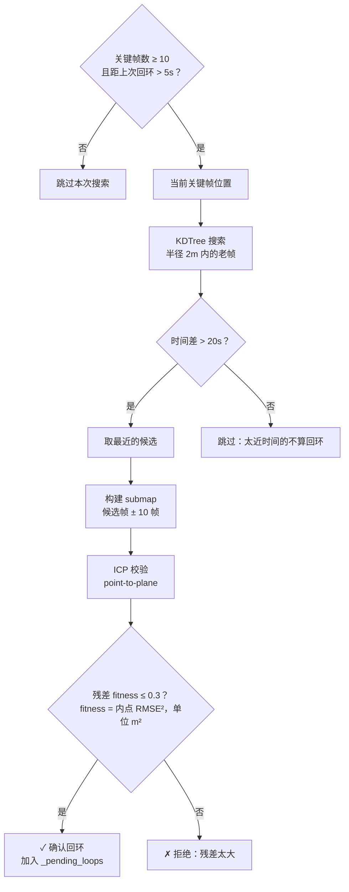

> **fitness 语义变更（2026-06）**：新版 `_icp()` 返回的 `fitness` 是**内点均方距离 RMSE²（m²），越小越好**，并直接被 `_smooth_and_update` 当作回环边的平移方差 `sigma_trans²`（下限 1e-4，约 1cm）。回环接受条件是 `fitness <= loop_score_thresh`（即残差 ≤ 0.3 m²）。这和老版 Open3D `fitness`（0~1，越大越好）含义相反，注意区分。

| 参数（`PGOConfig` 字段） | 默认值 | 含义 |
|------|--------|------|
| `key_pose_delta_trans` | 0.5m | 关键帧平移阈值 |
| `key_pose_delta_deg` | 10° | 关键帧旋转阈值 |
| `loop_search_radius` | 2.0m | 回环搜索半径 |
| `loop_time_thresh` | 20s | 回环时间差最小值 |
| `loop_score_thresh` | 0.3 | ICP 残差阈值 m²（≤ 才接受，越小越严格） |
| `loop_submap_half_range` | 10 帧 | submap 范围 |
| `min_keyframes_for_loop_search` | 10 | **新增**：少于这么多关键帧不搜回环 |
| `min_loop_detect_duration` | 5.0s | **新增**：两次回环检测的最小间隔 |
| `submap_resolution` | 0.2m | **新增**：submap / 关键帧点云体素分辨率 |
| `max_icp_iterations` | 50 | ICP 最大迭代次数 |
| `max_icp_correspondence_dist` | 1.0m | ICP 最大对应距离 |
| `odom_rot_var` / `odom_trans_var_xy` / `odom_trans_var_z` | 1e-6 / 1e-4 / 1e-6 | **新增**：里程计 between-factor 噪声方差（z 更紧，因 Go2 是平面机器人） |
| `loop_rot_var` | 0.05 | **新增**：回环边旋转方差（平移方差由 ICP 残差逐边给出） |

**ISAM2 优化**（`_PGOState._smooth_and_update`，原名 `smooth_and_update`）：

```python
# dimos/mapping/loop_closure/pgo.py
# 回环边的平移方差直接用 ICP 残差（下限 1e-4 m²），旋转方差用固定 loop_rot_var
# 增量更新 ISAM2，回环约束让节点位置全局一致
self._isam2.update(self._graph, self._values)
# 如果有回环，多跑几轮收敛
if has_loop:
    for _ in range(self._cfg.loop_closure_extra_iterations):
        self._isam2.update()
# 更新所有关键帧的全局位姿
estimates = self._isam2.calculateBestEstimate()
for i in range(len(self._key_poses)):
    self._key_poses[i].optimized = estimates.atPose3(i)
# world_corrected <- world_raw 的整体校正量（取最新关键帧）
last = self._key_poses[-1]
self._world_correction = last.optimized.compose(last.local.inverse())
```

## 3.3 第三站：插值校正 + 体素融合 — `PoseGraph` + `stream.transform`

文件：`dimos/mapping/loop_closure/pgo.py`（`PoseGraph._interp`）+ `dimos/mapping/utils/cli/map.py`（`dimos map global`）

> **架构变更（2026-06）**：原来的 `pgo_then_voxels()` 一个函数把「PGO + 两遍 + 体素融合」全包了。现在拆成三个清晰的步骤——PGO 产出 `PoseGraph`，`stream.transform(graph)` 应用校正，再各自体素融合。插值逻辑（SLERP 旋转 + 线性平移）现在封装在 `PoseGraph._interp()` / `correction_at(ts)` 里。

**问题**：PGO 修正了关键帧位姿，但最终需要的是一个稠密点云地图。直接用关键帧点云拼接会有"重影"（墙壁出现两层），因为中间帧没被校正。

**答案**：用 `PoseGraph` 把**每一帧**的位姿插值校正后，再喂进 VoxelGrid。

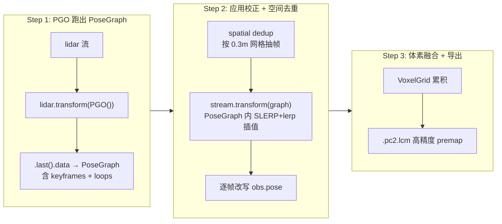

**插值校正的关键逻辑**（`PoseGraph._interp`，封装在数据类内部）：

```python
# dimos/mapping/loop_closure/pgo.py
# 每个关键帧的漂移量: world_corrected <- body <- world_raw
drifts = [(kf.optimized + kf.local.inverse()) for kf in self.keyframes]
slerp = Slerp(ts_arr, Rotation.from_quat(np.stack(quat_list)))  # 旋转 SLERP

def interp(ts: float) -> Transform:
    ts_clip = float(np.clip(ts, ts_arr[0], ts_arr[-1]))
    R = slerp([ts_clip])[0].as_matrix()                          # 旋转插值
    # ... 线性平移插值 (1-alpha)*t[idx-1] + alpha*t[idx]
    return Transform(..., frame_id="world_corrected", child_frame_id="world_raw")
```

应用到任意流（点云或位姿）：

```python
# 改写每帧 obs.pose 到校正坐标系
corrected = lidar.transform(graph)
# 或单独对点云应用某一时刻的校正量
pc.transform(graph.correction_at(obs.ts))
```

> **为什么不直接用关键帧点云？**
> 关键帧之间间隔 0.5m，中间的帧如果不校正就插入 VoxelGrid，它们的位姿还是有漂移的。`PoseGraph` 的插值校正保证**每一帧**都用 SLERP/lerp 后的校正量对齐，消除"重影"。

> **另有 `pgo_auto.py`（新增）**：`dimos/mapping/loop_closure/pgo_auto.py` 提供了一组**可组合的 Stream 阶段**（`pgo_keyframes` → `keyframes_to_corrections` → `make_interpolator` → `apply_corrections`），是同一套 PGO 逻辑的「函数式管线」版本，便于在 memory2 流水线里逐段插拔和可视化。两者底层 ISAM2 + ICP 算法一致。

使用命令（**2026-06 变更**，原 `dimos export-premap` 已移除）：

```bash
dimos map global recording_go2 --export
# --export 隐含 --pgo，输出 ./recording_go2.pc2.lcm 到当前目录
```

## 3.4 ICP 实现细节

文件：`dimos/mapping/loop_closure/pgo.py`（`_icp` 函数）

PGO 内部的 ICP 用 Open3D Tensor Pipeline 的 **point-to-plane** 方法：

```python
# dimos/mapping/loop_closure/pgo.py::_icp
tgt_pcd.estimate_normals(max_nn=30, radius=0.3)  # point-to-plane 需要目标法线
result = o3d.t.pipelines.registration.icp(
    source=src_pcd, target=tgt_pcd,
    max_correspondence_distance=max_dist,
    init_source_to_target=init_T,
    estimation_method=TransformationEstimationPointToPlane(),
    criteria=ICPConvergenceCriteria(max_iteration=max_iter),
)
# 返回 (tf, fitness)，其中 fitness = inlier_rmse² (m²)，被当作回环边平移方差
rmse = float(result.inlier_rmse)
return tf, rmse * rmse
```

> **为什么 point-to-plane 而不是 point-to-point？**
> 室内场景有大量墙面。Point-to-point ICP 会让点沿墙面滑动（"slide along wall" 问题），收敛慢且不准。Point-to-plane 利用法线方向约束，只在法线方向拉近点，平行于墙的方向不管，收敛快 2-3 倍。

## 3.5 完整的 "离线建图" 流程

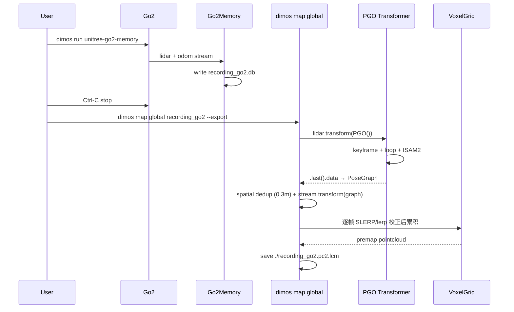

---

# 四、在线重定位（Relocalization Module）— 在旧地图里找到自己

## 4.1 第一站：模块入口 — `RelocalizationModule`

文件：`dimos/mapping/relocalization/module.py`

**问题**：系统启动后，怎么把"当前在本地图中的位置"对齐到"premap 的全局坐标"？

**答案**：`RelocalizationModule` 订阅 `global_map`（实时体素地图），每 2 秒做一次重定位尝试，算出 `TF(world → map)` 变换。

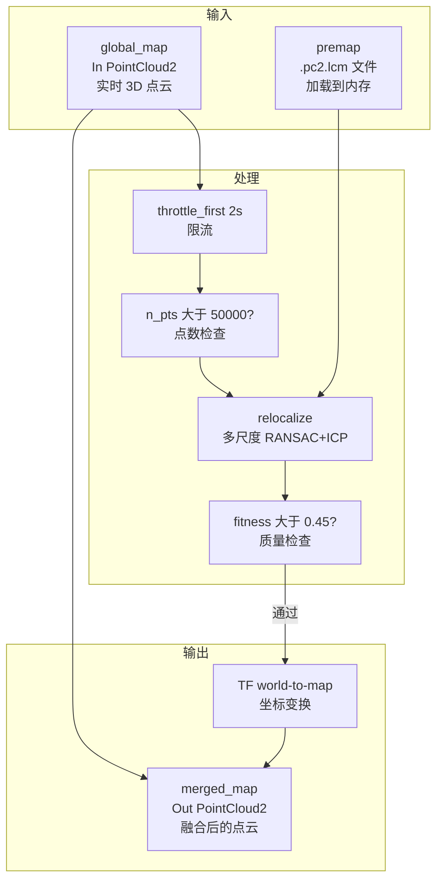

**三路订阅的职责**：

| 订阅 | 频率 | 作用 |
|------|------|------|
| `global_map → _try_relocalize` | 每 2s（throttle） | 核心：算 TF |
| `(global_map, world_to_map) → _on_merge_input` | 每帧 | 融合 premap + local → merged_map |
| `interval(2s) + world_to_map → _publish_periodic` | 2s | 重发 TF 和 loaded_map |

## 4.2 第二站：多尺度 RANSAC+ICP — `relocalize()`

文件：`dimos/mapping/relocalization/relocalize.py`

**问题**：给定一个"局部地图"（当前扫的）和"全局地图"（premap），初始位姿完全未知，怎么对齐？

**答案**：多尺度 FPFH + RANSAC 粗配准 → 重力过滤 → 墙面精排 → ICP 精配准。

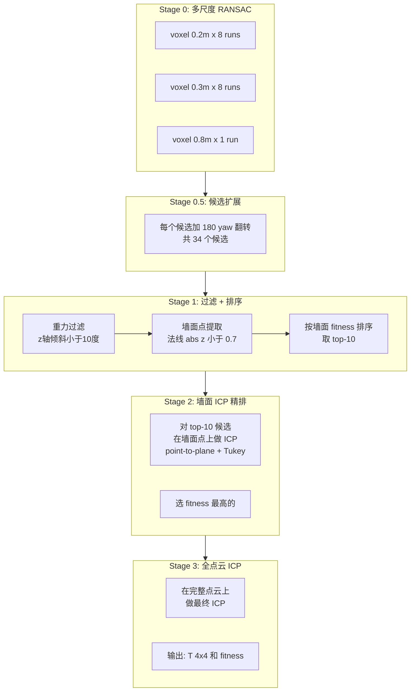

**为什么要多尺度？**

| 尺度 | 作用 |
|------|------|
| 0.8m | 最粗——计算快，给大方向 |
| 0.3m | 中间——平衡精度和速度 |
| 0.2m | 最细——高精度候选 |

每个尺度多次运行（Open3D RANSAC 内部随机采样），增加找到正确解的概率。

**为什么要 180° yaw 翻转？**

FPFH 是局部特征，对称环境（走廊）可能把前后方向搞反。加一个 180° 翻转候选，确保不会错过"方向反了但位置对的"情况。

**为什么用墙面点排序而不是全部点？**

地板/天花板的法线是竖直的——它们在任何 yaw 角度下都能完美匹配（因为是水平面）。如果用全部点排序，一个 180° 翻转的错误候选可能因为"地板匹配很好"而得分很高。**只用墙面点**排序，可以把真正墙壁对齐的候选选出来。

**SCALE_PLAN 参数**：

```python
SCALE_PLAN = [
    (0.2, 8),   # 8 次 RANSAC，精细尺度
    (0.3, 8),   # 8 次 RANSAC，中等尺度
    (0.8, 1),   # 1 次 RANSAC，粗糙尺度（只需要大方向）
]
RANSAC_ITERS = 500_000       # 每次 RANSAC 的迭代上限
FINE_VOXEL = 0.1             # 最终 ICP 的体素大小
RERANK_DIST = 0.15           # 精排的 inlier 距离阈值
GRAVITY_TILT_MAX_DEG = 10.0  # 重力过滤角度阈值
```

## 4.3 第三站：地图融合 — merged_map

文件：`dimos/mapping/relocalization/module.py:173`

**问题**：有了 TF(world→map)，怎么让 costmap 同时用上 premap 和 local 信息？

**答案**：`_on_merge_input` 把 premap 变换到 world 坐标系，和本地图合并后输出 `merged_map`。

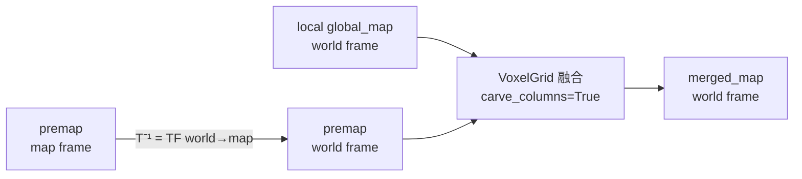

**Column Carving** 的作用：

premap 是旧数据，如果环境发生了变化（比如桌子搬走了），premap 里的"桌子体素"还在。Column Carving 的逻辑是：**如果本地图在某个 (x,y) 柱子上有新数据，就把 premap 在同一 (x,y) 柱子上的旧数据删掉**。

效果：动态区域用本地数据、静态区域保留 premap 数据——"新鲜覆盖陈旧"。

```python
if self.config.use_carving:
    grid = VoxelGrid(carve_columns=True)
    grid.add_frame(premap_in_world)  # 先加旧的
    grid.add_frame(local)            # 再加新的（会覆盖旧的同列体素）
    self.merged_map.publish(grid.get_global_pointcloud2())
```

## 4.4 第四站：CostMapper 消费 merged_map

文件：`dimos/mapping/costmapper.py`

`CostMapper` 同时订阅 `global_map` 和 `merged_map`。有 merged_map 时**优先用它**：

```python
def _select_map(pair):
    gmap, merged = pair
    return merged if merged is not None else gmap
```

这意味着：
- 重定位成功前：costmap 基于 local global_map
- 重定位成功后：costmap 基于 merged_map（premap + local 融合）

导航规划器看到的 costmap 会**瞬间扩大**——从只有局部探索过的区域，变成整个 premap 覆盖范围。

## 4.5 完整的 "在线重定位" 数据流

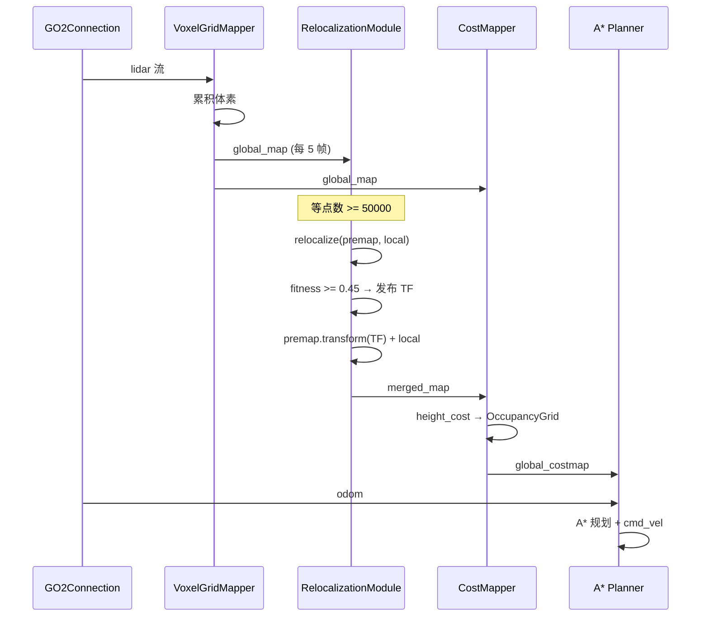

---

# 五、与老导航栈的关系和对比

## 5.1 架构对比

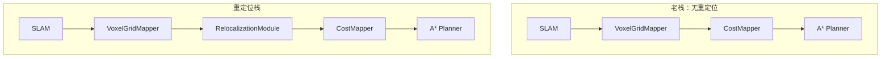

**唯一差异**：重定位栈在 VoxelGridMapper 和 CostMapper 之间插入了 `RelocalizationModule`。下游的 A* 规划、MovementManager、控制器完全不变。

## 5.2 详细对比表

| 维度 | 老栈 | 重定位栈 | 说明 |
|------|------|----------|------|
| **地图来源** | 实时 VoxelGrid 累积 | premap + 实时融合 | 重定位栈首次可用范围大 |
| **坐标系** | SLAM 自定义 | 对齐到 premap | 可跨次启动复用坐标 |
| **首次规划延迟** | 等探索足够区域 | 加载 premap 即可 | ~5s vs ~30s+ |
| **costmap 精度** | 受实时 drift 影响 | PGO 校正 + carving | 墙壁更薄更准 |
| **环境变化适应** | 自动（实时建图） | 靠 carving 覆盖 | premap 太旧可能误导 |
| **额外依赖** | 无 | gtsam-extended, 预录制 | 离线阶段需要 gtsam |
| **CPU/GPU 开销** | 低 | RANSAC+ICP 2s/次 | 每 2s 一次，非阻塞 |
| **Blueprint** | `unitree-go2` | `unitree-go2-relocalization` | 后者 autoconnect 了前者 |

## 5.3 数据流对比

**老栈**：

```
lidar → VoxelGridMapper → global_map → CostMapper → costmap → A*
```

**重定位栈**：

```
lidar → VoxelGridMapper → global_map ──┬──→ RelocalizationModule ─→ merged_map ─→ CostMapper → A*
                                        └──→ CostMapper (fallback if no TF yet)
```

> **关键设计**：重定位失败时（fitness < 阈值 或 点数不够），系统**退化为老栈**——CostMapper 直接用 global_map。不会因为重定位失败就停止导航。

---

# 六、端到端实战 — 用 Go2 做一次完整重定位导航

## 6.1 步骤总览

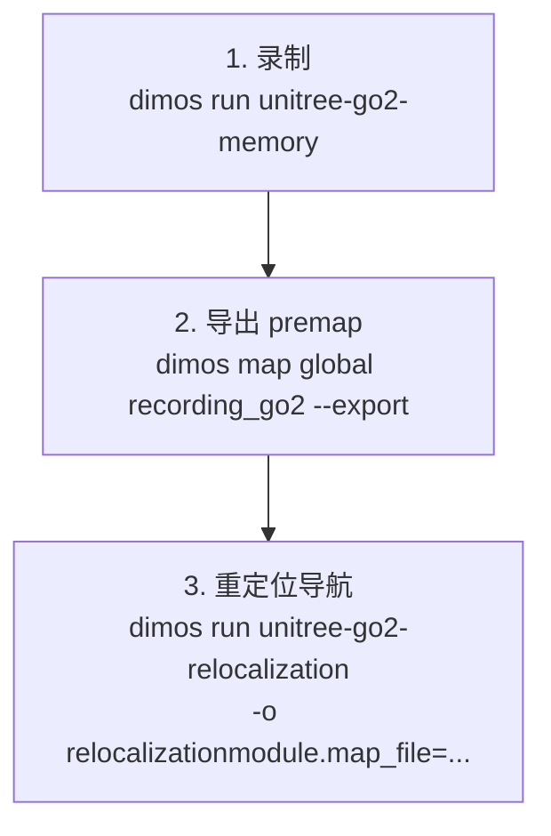

## 6.2 详细命令

**第 1 步：录制**

```bash
# 真机录制（用机器人四处走一圈）
dimos run unitree-go2-memory --robot-ip 192.168.123.161

# 或 replay 模式测试
dimos --replay run unitree-go2-memory
```

生成 `recording_go2.db`（~1.8GB for 3 minutes）。

**第 2 步：导出 premap**（**2026-06 变更**：原 `dimos export-premap` 已替换为 `dimos map global`）

```bash
dimos map global recording_go2 --export
# --export 隐含 --pgo，输出 ./recording_go2.pc2.lcm 到当前目录
# 加 --no-gui 跳过 rerun viewer（无头运行）
```

`recording_go2` 可以是裸文件名（先查 cwd 再查 `data/`）、相对路径或绝对路径。

可选参数（`dimos map global --help`）：

| 参数 | 默认 | 说明 |
|------|------|------|
| `--voxel` | 0.05 | 体素大小，越小越精细、文件越大 |
| `--device` | CUDA:0 | Open3D 计算设备（如 CPU:0） |
| `--seek` | 0 | 跳过开头 N 秒 |
| `--duration` | 全部 | 从 `--seek` 起只用 N 秒数据 |
| `--pgo` | False | 跑 PGO（`--export` 会自动开启） |
| `--pgo-tol` | 0.3 | 空间去重网格（米），0 表示保留每一帧 |
| `--full-pgo` | False | 额外建一张「全帧」PGO 地图做对比 |
| `--carve/--no-carve` | False | 列雕刻（每个 X,Y 列只保留最新帧） |
| `--out` | `./<dataset>.rrd` | 自定义 .rrd 输出路径 |
| `--no-gui` | False | 只写 .rrd 不开 rerun |

> 注意：输出文件名现在是 `./<dataset>.pc2.lcm`（如 `recording_go2.pc2.lcm`），不再带 `_twopass_map` 后缀。

**第 3 步：重定位导航**

```bash
# Replay 测试（map_file 名字就是上一步的 dataset 名）
dimos --replay --replay-db recording_go2 run unitree-go2-relocalization \
  -o relocalizationmodule.map_file=recording_go2

# 真机
dimos run unitree-go2-relocalization --robot-ip 192.168.123.161 \
  -o relocalizationmodule.map_file=recording_go2
```

## 6.3 Rerun 可视化

启动后在 Rerun 中可以看到：

| 通道 | 内容 |
|------|------|
| `world/global_map` | 实时累积的本地 3D 点云 |
| `world/global_costmap` | 2D 占据栅格（融合后） |
| `world/loaded_map`（如配置） | premap 在 world 坐标系下 |

当重定位成功时，你会看到 costmap **突然扩大**——这是 merged_map 生效的标志。

## 6.4 时序图：一次完整重定位的过程

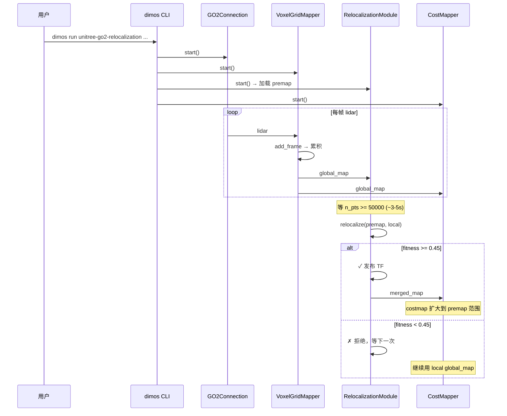

---

# 七、改进方向和延伸阅读

## 7.1 当前系统的局限性

| 局限 | 原因 | 影响 |
|------|------|------|
| 首次重定位需 50K 点 | 点太少 RANSAC 找不到好匹配 | 开机后 3-5s 才能第一次尝试 |
| RANSAC 耗时 ~2-5s | 17 次 RANSAC + ICP | CPU 密集，限制频率 |
| 环境变化大时失败 | FPFH 依赖几何不变性 | 搬家后需重建 premap |
| 无增量更新 premap | 当前 premap 是一次性的 | 不会随使用自动改善 |
| 仅 3D LiDAR | 重定位算法需要 3D 点云 | 纯视觉场景不可用 |

## 7.2 可改进方向

### 7.2.1 加速重定位

**方案 A：学习式特征替代 FPFH**

用 PointNet++ / FCGF (Fully Convolutional Geometric Features) 替代手工 FPFH。在同等 RANSAC 迭代数下 inlier ratio 更高 → 可以减少 RANSAC 次数。

**方案 B：粗到精的层次策略**

当前同时跑 3 个尺度 × 多次。可以改为：先粗尺度快速确定大方向（<100ms），再只在最优候选附近做精细匹配。

**方案 C：利用 odom 先验**

如果重定位不是第一次（已经成功过一次），后续可以用上次的 TF 作为初始估计，跳过 RANSAC 直接 ICP。

### 7.2.2 增量更新 premap

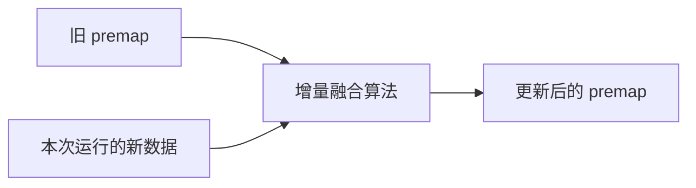

思路：每次关机前，把本次新探索到的区域（local 中有但 premap 中没有的）追加到 premap。

### 7.2.3 多模态重定位

加入视觉特征（ORB / SuperPoint + SuperGlue）做辅助：
- LiDAR 退化场景（长走廊、空旷大厅）视觉特征仍然丰富
- 可以用视觉给 RANSAC 提供更好的初始值

### 7.2.4 语义辅助

识别场景中的语义实体（门、窗、柱子），用它们的相对位置关系做粗定位，再用点云精配准。对环境变化更鲁棒（门的位置不会轻易变）。

### 7.2.5 fitness 阈值自适应

当前 `fitness_threshold = 0.45` 是固定的。可以根据：
- 点云覆盖面积
- 几何复杂度（特征丰富 vs 退化）
- 历史成功率

动态调整阈值，减少误拒绝。

## 7.3 参数 Cheatsheet

| 想做的事 | 看哪 |
|----------|------|
| 调整重定位频率 | `RELOC_INTERVAL = 2.0`（module.py） |
| 降低点数要求 | `MIN_LOCAL_POINTS = 50000`（module.py） |
| 调松/紧重定位质量 | `fitness_threshold`（Config） |
| 关闭 carving | `-o relocalizationmodule.use_carving=false` |
| 显示 premap | `-o relocalizationmodule.publish_loaded_map=true` |
| 调整 PGO 关键帧密度 | `key_pose_delta_trans` / `key_pose_delta_deg`（`loop_closure/pgo.py::PGOConfig`） |
| 调松/紧回环检测 | `loop_score_thresh`（PGOConfig，默认 0.3，单位 m²，≤ 才接受） |
| 调里程计/回环噪声 | `odom_trans_var_*` / `loop_rot_var`（PGOConfig，新增） |
| 加速 RANSAC | 减少 `SCALE_PLAN` 中的 runs 数量（`relocalize.py`） |
| 更精细 premap | `dimos map global X --export --voxel 0.03` |
| 更粗 premap（减小文件） | `dimos map global X --export --voxel 0.1` |
| 空间去重密度 | `dimos map global X --export --pgo-tol 0.2`（越小越密） |

## 7.4 文件结构速查

```
dimos/mapping/relocalization/          # 在线重定位（2026-06 未改动）
├── module.py       # RelocalizationModule — 在线重定位 Module
└── relocalize.py   # relocalize() — 多尺度 RANSAC+ICP 核心算法

dimos/mapping/loop_closure/            # 离线 PGO（2026-06 从 relocalization/ 迁移至此）
├── pgo.py          # PGO Transformer + PoseGraph + _PGOState（取代老的 _SimplePGO）
├── pgo_auto.py     # 可组合 Stream 阶段版 PGO（pgo_keyframes / apply_corrections ...）
├── eval.py         # PGO 评测
└── test_pgo.py     # 单元测试

dimos/mapping/utils/cli/
└── map.py          # `dimos map global ... --export` 离线建图/导出 CLI（取代 export-premap）

dimos/mapping/
├── voxels.py       # VoxelGrid / VoxelGridMapper — 体素累积
└── costmapper.py   # CostMapper — 点云→costmap，消费 merged_map

dimos/robot/unitree/go2/blueprints/smart/
└── unitree_go2.py  # unitree_go2_relocalization blueprint 定义（Go2Memory + RelocalizationModule）
```

## 7.5 推荐学习资料

| 主题 | 资料 |
|------|------|
| ICP 算法 | [Open3D ICP Tutorial](http://www.open3d.org/docs/latest/tutorial/pipelines/icp_registration.html) |
| FPFH 特征 | Rusu et al., "Fast Point Feature Histograms (FPFH)" ICRA 2009 |
| GTSAM / ISAM2 | [GTSAM Tutorial](https://gtsam.org/tutorials/intro.html) |
| 位姿图优化 | Grisetti et al., "A Tutorial on Graph-Based SLAM" IEEE 2010 |
| RANSAC | Fischler & Bolles, "Random Sample Consensus" CACM 1981 |
| Point-to-Plane ICP | Chen & Medioni, "Object modeling by registration" 1991 |
| dimos 老导航栈 | [dimos-navigation-mapping-tutorial.md](dimos-navigation-mapping-tutorial.md) |

---

> 文档基于 `7d2affd7d`（2026-06-24，sync upstream/main 100 commits）。相比 `b45e5d58`（2026-05-25）的主要变更：离线 PGO 从 `relocalization/pgo.py`（`_SimplePGO` + `pgo_then_voxels()`）迁移并重构为 `loop_closure/pgo.py`（`PGO` Transformer + `PoseGraph`）+ `pgo_auto.py`；CLI 从 `dimos export-premap` 改为 `dimos map global ... --export`；ICP 回环 fitness 语义从 Open3D fitness（越大越好）改为内点 RMSE²（越小越好）。在线重定位（`RelocalizationModule` / `relocalize.py`）保持不变。后续上游同步后细节可能调整，但整体架构应保持稳定。
