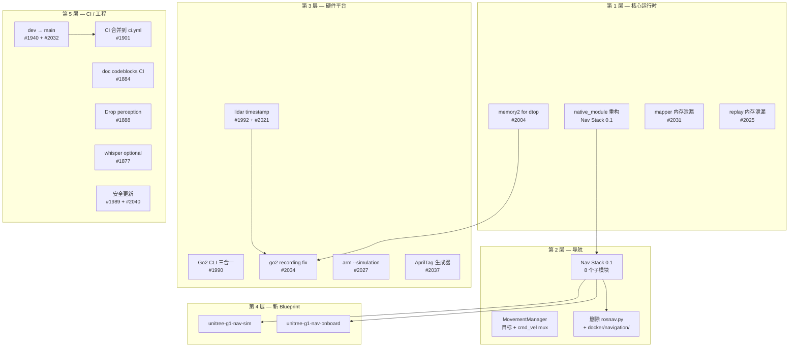
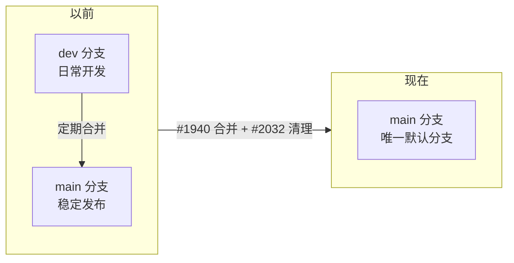
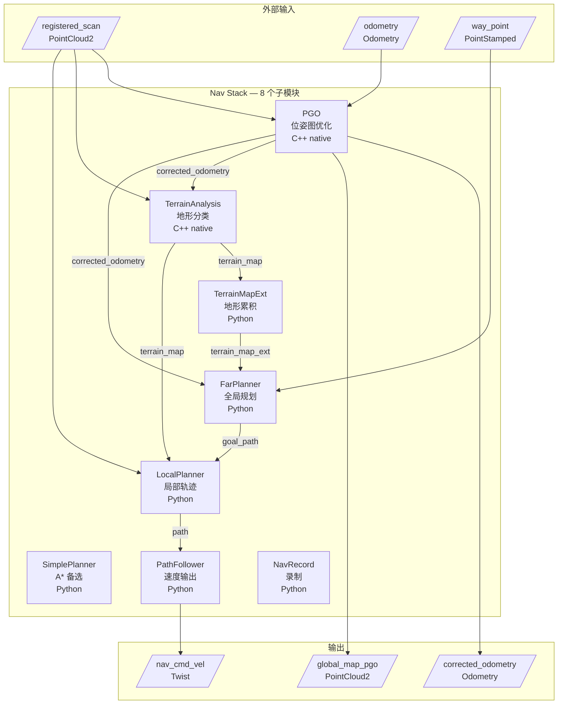
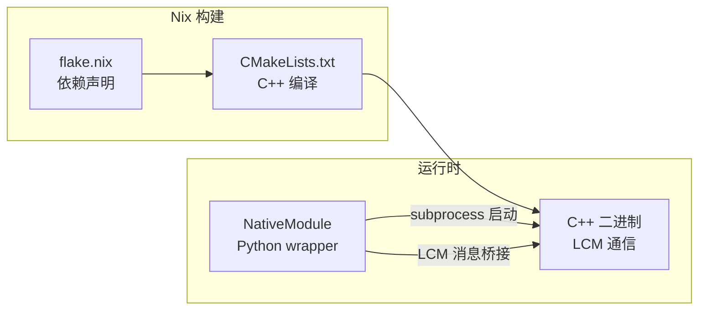
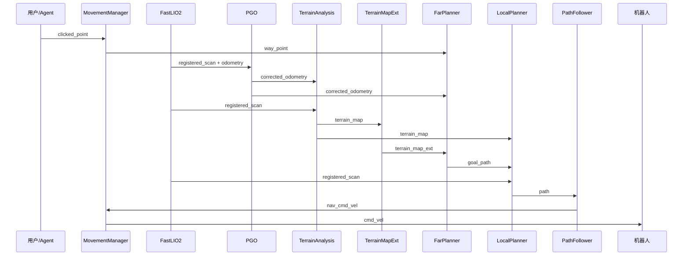
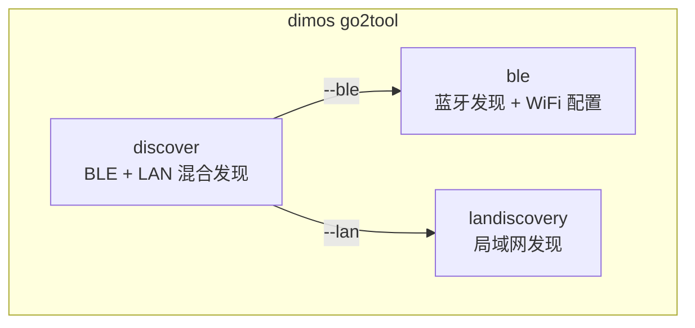
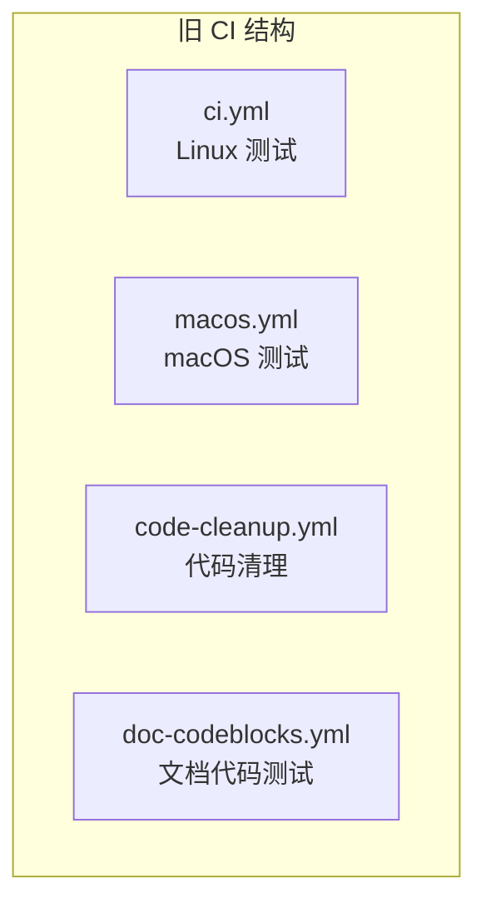
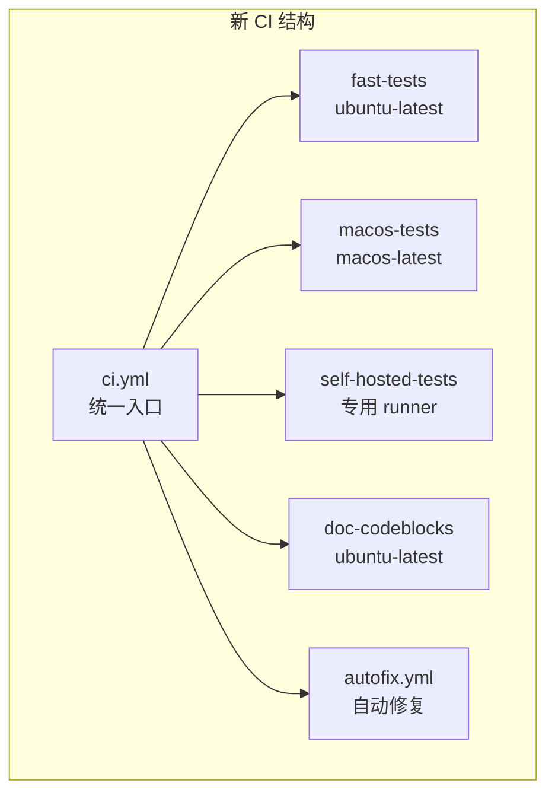
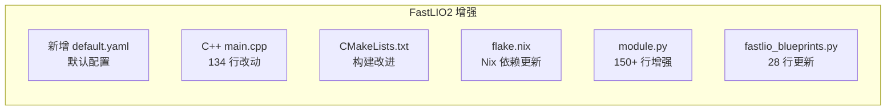
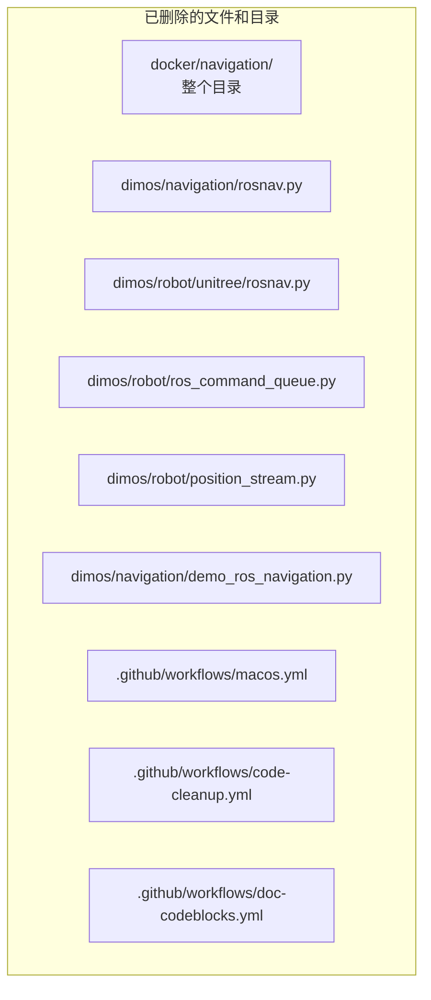

# DimOS upstream/main 升级笔记 — 2026-05-06 → 2026-05-13

> 写给已经熟悉 dimos 基础概念（Module / Blueprint / Skill）的开发者。一次性把过去这 7 天 upstream/main 上 30 个新 commit 讲清楚：做了什么、为什么这么做、怎么用、老代码要不要改。
>
> 基于 dimos commit `d2e695b38`（`Split tests off of self hosted runner`，#1901）。上一个基线是 `884e7ed02`。

---

## 目录

- [一、通俗篇：这次升级带来什么](#一通俗篇这次升级带来什么)
- [二、总览：30 个 commit 全景](#二总览30-个-commit-全景)
- [三、分支策略变更 — dev → main](#三分支策略变更--dev--main)
- [四、Nav Stack 0.1 — 本地导航栈大特性](#四nav-stack-01--本地导航栈大特性)
- [五、Go2 平台 — CLI 工具 + lidar 时间戳修复](#五go2-平台--cli-工具--lidar-时间戳修复)
- [六、CI/CD 大重构](#六cicd-大重构)
- [七、其它改动合集](#七其它改动合集)
- [八、升级注意事项](#八升级注意事项)
- [九、cheatsheet](#九cheatsheet)

---

# 一、通俗篇：这次升级带来什么

> 这一章 0 dimos 类名、0 Python 代码，只讲"日常感受层面发生了什么"。

## 1.1 一句话

**这次更新让 dimos 拥有了完全原生的本地导航栈、一套 Go2 命令行工具箱、更简洁的 CI 流水线，以及正式从 dev 分支切换到 main 作为默认开发分支。**

## 1.2 为什么会有这次更新？

过去一段时间 dimos 的导航功能依赖外部 ROS 导航栈（通过 Docker 容器运行），这带来了部署复杂性和性能开销。同时 Go2 机器人在现场使用时缺少便捷的发现和配置工具。此外，dev/main 双分支策略给新贡献者带来了困惑。

| 痛点 | 真实场景举例 |
|---|---|
| 导航依赖 Docker 里的 ROS 栈 | 部署一台 Go2 要拉几个 GB 的 Docker 镜像，还要配 ROS bridge |
| Go2 现场找不到 IP | 每次换网络都要翻路由器 DHCP 表 |
| lidar 点云时间戳不准 | SLAM 地图漂移，建图效果差 |
| dev/main 两个分支容易混淆 | 新人提 PR 不知道该选哪个分支 |
| CI 散落在多个 workflow 文件 | macos.yml、code-cleanup.yml、doc-codeblocks.yml 各自独立，维护麻烦 |

## 1.3 哪些人会"立刻感觉到不同"

**Go2 用户**：可以用 `dimos go2tool discover` 一键发现局域网/蓝牙上的所有 Go2 机器人，还能用 BLE 给 Go2 配 WiFi。

**导航开发者**：全新的 Nav Stack 0.1 不再需要 Docker/ROS，纯 DimOS 模块组合，8 个子模块通过 LCM 流通信。

**CI 维护者**：3 个独立 workflow 合并成 1 个 `ci.yml`，自托管 runner 上只跑 self_hosted 标记的测试。

**所有开发者**：`dev` 分支已合并到 `main` 并删除，以后只用 `main`。

## 1.4 这次升级的"含金量"

- **316 个文件变更**，+18442 行 / -6846 行
- 最大单个 commit（Nav Stack 0.1）涉及 **144 个文件 / +13279 行**
- 新增 **8 个导航子模块**（含 2 个 C++ native module）
- 新增 **3 个 Go2 CLI 子命令**
- **删除了整个 `docker/navigation/` 目录**（~2000 行旧 ROS 导航配置）

---

# 二、总览：30 个 commit 全景

## 2.1 时间线（从老到新）


## 2.2 影响面对照表

**大特性（3 个）**

| # | commit / PR | 影响范围 | 你需要关心吗？ |
|---|---|---|---|
| Nav Stack 0.1 | `2a430b55b` | 新增 `dimos/navigation/nav_stack/`、删除 `docker/navigation/`、G1 nav blueprint | **会**：所有导航相关开发 |
| dev → main | #1940 + #2032 | 分支策略、CI 配置、文档 | **会**：所有开发者，需更新 remote 和本地分支 |
| CI 重构 | #1901 | `.github/workflows/` | **会**：CI 维护者、PR 提交者 |

**中特性（4 个）**

| # | PR | 影响范围 | 你需要关心吗？ |
|---|---|---|---|
| #1990 | go2 cli | 新增 `dimos/robot/unitree/go2/cli/` | Go2 用户 |
| #1992 + #2021 | lidar timestamp | `go2/connection.py` | Go2 lidar 用户 |
| #1888 | Drop perception | 去掉重量级依赖 | **会**：如果用了 perception extras |
| #2037 | AprilTag 生成器 | 新增 `dimos/utils/cli/apriltag.py` | 需要标定/标签的用户 |

**修复与维护（23 个）**

| 类别 | PRs | 说明 |
|---|---|---|
| memory2 增强 | #2004, #2031, #2034 | dtop 改用 memory2、mapper 内存泄漏修复、go2 recording 修复 |
| replay 修复 | #2025 | 修复 replay 模式内存泄漏 |
| arm blueprints | #2027 | 修复 `--simulation` flag |
| 安全更新 | #1989, #2040 | 升级有漏洞的依赖包 |
| codecov | #1889, #2026, #2030 | 添加 → 禁用 status check → 修复分支 |
| 新 replay 数据集 | #1991, #2044 | go2_hongkong_office、go2_slamabuse1/2 |
| whisper | #1877 | 改为 optional extra |
| doc codeblocks | #1884, #2052 | 文档代码块自动测试 CI |
| 杂项 | #1994, #2019, #2029 | md-babel bump、小修复、problems 模板 |

## 2.3 大架构图：30 个变化落在 dimos 哪里



---

# 三、分支策略变更 — dev → main

> commit #1940 `4ef4e83cc` + #2032 `045f234d2` + codecov 分支切换 `fd2535998`

## 3.1 问题：dev/main 双分支让人困惑

dimos 一直维护 `dev`（日常开发）和 `main`（稳定发布）两个分支。但在实际操作中：

- 新贡献者不清楚 PR 该对哪个分支
- `main` 长期落后 `dev`，很少有人同步
- CI 配置需要同时覆盖两个分支，增加维护负担

## 3.2 答案：合并 dev → main，删除 dev



具体操作：

1. **#1940**：`dev` 分支整体 merge 进 `main`（`Merge pull request #1940 from dimensionalOS/dev`）
2. **#2032**：清理所有文档和配置中对 `dev` 的引用——`.codecov.yml`、`ci.yml`、`docker-build.yml`、`README.md`、安装文档等
3. **codecov**：`fd2535998` 将 codecov 的 branch 从 `dev` 改为 `main`

## 3.3 对你的影响

> **第一个关键点**：以后 PR 全部对 `main` 开，不再有 `dev` 分支。

如果你的本地仓库还在跟踪 `dev`：

```bash
git fetch upstream
git checkout main
git merge upstream/main
# dev 已经没用了，可以删除
git branch -d dev
```

---

# 四、Nav Stack 0.1 — 本地导航栈大特性

> commit `2a430b55b` · 144 个文件 / +13279 -4542 行 · 这是本次升级的最大变化。

## 4.1 问题：导航为什么要"原生化"

dimos 以前的导航方案是通过 Docker 容器运行 ROS Navigation Stack，再用 bridge 把数据流搬进搬出。这带来了：

| 痛点 | 表现 |
|---|---|
| 部署复杂 | 需要 Docker + ROS bridge + 大量配置文件 |
| 延迟高 | 数据在 LCM → ROS → LCM 之间跳来跳去 |
| 调试难 | 问题可能在 Docker 内，也可能在 bridge，定位困难 |
| 不灵活 | 想改一个 planner 参数要进 Docker 容器改 yaml |

## 4.2 答案：纯 DimOS 模块组合的 Nav Stack

Nav Stack 0.1 把导航栈完全实现为 DimOS Module 的组合。不依赖 ROS，不需要 Docker，所有模块通过 LCM/SHM 流通信。



## 4.3 8 个子模块一览

| 模块 | 语言 | 职责 | 输入 | 输出 |
|---|---|---|---|---|
| **PGO** | C++ | 位姿图优化 + 回环检测 | `registered_scan`, `odometry` | `corrected_odometry`, `global_map_pgo` |
| **TerrainAnalysis** | C++ | 地形分类（地面/障碍物） | `registered_scan`, `corrected_odometry` | `terrain_map` |
| **TerrainMapExt** | Python | 地形累积器 | `terrain_map`, `corrected_odometry` | `terrain_map_ext` |
| **FarPlanner** | Python | 全局规划（visibility graph） | `terrain_map_ext`, `way_point`, `corrected_odometry` | `goal_path` |
| **SimplePlanner** | Python | 全局规划（A*，备选） | `terrain_map`, `way_point`, `corrected_odometry` | `goal_path` |
| **LocalPlanner** | Python | 局部轨迹选择 + 避障 | `registered_scan`, `terrain_map`, `goal_path`, `odometry` | `path` |
| **PathFollower** | Python | 路径跟踪 → cmd_vel | `path`, `odometry` | `nav_cmd_vel` |
| **NavRecord** | Python | 导航数据录制 | 全部流 | 文件 |

## 4.4 两个 C++ Native Module

PGO 和 TerrainAnalysis 是 C++ 实现的 native module，通过 Nix flake 管理编译依赖：



> **重要**：`native_module.py` 在这次 commit 中有 **262 行变更**，主要是增强了 C++ 模块与 Python 层的消息桥接能力，支持更多消息类型（`PointCloud2`、`ContourPolygons3D`、`GraphNodes3D`、`LineSegments3D` 等）。

## 4.5 新增消息类型

| 消息类型 | 文件 | 用途 |
|---|---|---|
| `ContourPolygons3D` | `dimos/msgs/nav_msgs/ContourPolygons3D.py` | 地形边界多边形 |
| `GraphNodes3D` | `dimos/msgs/nav_msgs/GraphNodes3D.py` | 全局规划图节点 |
| `LineSegments3D` | `dimos/msgs/nav_msgs/LineSegments3D.py` | 全局规划路径段 |

## 4.6 使用方法

最简方式——用 `create_nav_stack()` 工厂函数：

```python
from dimos.navigation.nav_stack.main import create_nav_stack

nav = create_nav_stack(
    planner="far",              # "far"（默认）或 "simple"（A*）
    use_tare=False,             # 是否启用 TARE 前沿探索
    use_terrain_map_ext=True,   # 持久化地形累积
    vehicle_height=0.5,         # 机器人高度，传播到 terrain + planners
    max_speed=1.0,              # 传播到 local planner + path follower
    terrain_voxel_size=0.2,
    replan_rate=0.5,            # 全局规划频率 (Hz)
)
```

在 Blueprint 里组合：

```python
from dimos.core.coordination.blueprints import autoconnect

full_blueprint = autoconnect(
    robot_connection(),
    fastlio2_blueprint(),
    create_nav_stack(planner="far"),
    movement_manager(),
    rerun_vis(),
)
```

## 4.7 新 G1 导航 Blueprint

Nav Stack 0.1 还带来了两个新的 G1 Blueprint：

| Blueprint | 文件 | 用途 |
|---|---|---|
| `unitree-g1-nav-sim` | `g1/blueprints/navigation/unitree_g1_nav_sim.py` | G1 仿真导航 |
| `unitree-g1-nav-onboard` | `g1/blueprints/navigation/unitree_g1_nav_onboard.py` | G1 机载导航 |

这两个 blueprint 整合了 FastLIO2 + Nav Stack + G1 连接 + MovementManager + Rerun 可视化。

## 4.8 删除了什么

| 删除项 | 说明 |
|---|---|
| `docker/navigation/` 整个目录 | ~2000 行 Docker/ROS 导航配置 |
| `dimos/navigation/rosnav.py` | 411 行 ROS Navigation bridge |
| `dimos/robot/unitree/rosnav.py` | 134 行 Unitree ROS 导航 |
| `dimos/robot/ros_command_queue.py` | 473 行 ROS 命令队列 |
| `dimos/robot/position_stream.py` | 161 行位置流 |
| `dimos/navigation/demo_ros_navigation.py` | 62 行旧 demo |

> **第一个关键点**：如果你的代码依赖了 `rosnav.py`、`ros_command_queue.py` 或 `position_stream.py`，需要迁移到 Nav Stack 0.1 的接口。

## 4.9 Nav Stack 完整数据流



---

# 五、Go2 平台 — CLI 工具 + lidar 时间戳修复

## 5.1 Go2 CLI 三合一工具 — `dimos go2tool`

> PR #1990 · commit `a448dc241` · 新增 3 个文件 / 1196 行

以前要找 Go2 的 IP 地址，得手动翻路由器 DHCP 表或者用 `nmap` 扫描。现在有了三合一 CLI 工具：



### discover 命令

同时使用 BLE 和 LAN 两种方式发现 Go2：

```bash
# 默认 BLE + LAN 同时扫描，7 秒超时
dimos go2tool discover

# 只用 BLE
dimos go2tool discover --ble

# 只用 LAN，改 poll 间隔
dimos go2tool discover --lan --lan-tick 1.0

# 持续扫描不停
dimos go2tool discover -t 0
```

输出格式：

```
SOURCE NAME           IP              MAC                 SERIAL
BLE    Go2-XXXX       192.168.123.161 AA:BB:CC:DD:EE:FF   B42D2XXXXXXXXX
LAN    Go2-YYYY       192.168.123.162 11:22:33:44:55:66   B42D2YYYYYYYYY
```

### BLE WiFi 配置

通过蓝牙给 Go2 配置 WiFi（不需要先知道 IP）：

```bash
# 扫描 BLE 设备
dimos go2tool ble scan

# 给指定设备配 WiFi
dimos go2tool ble wifi-config --device "Go2-XXXX" --ssid "MyWiFi" --password "secret"
```

### 三个子模块

| 文件 | 行数 | 功能 |
|---|---|---|
| `go2/cli/go2tool.py` | 207 | 主入口 + discover 命令 |
| `go2/cli/ble.py` | 350 | BLE 扫描 + WiFi provisioning |
| `go2/cli/landiscovery.py` | 214 | LAN mDNS/broadcast 发现 |

## 5.2 Lidar 时间戳修复

> PR #1992 `e2b1fd050` + PR #2021 `9c7d68319`

### 问题

Go2 的 lidar 点云带的时间戳有时候不准——和系统时钟有微小偏差。这导致 SLAM 算法在融合 IMU 和 lidar 数据时出现时间对齐错误，地图会"漂移"。

### 修复分两步


1. **#1992 基础修复**：修正了 Go2 lidar 数据的时间戳生成逻辑
2. **#2021 自适应修正**：增加了 adaptive timestamp correction——当检测到时间戳偏差过大时，自动校正偏移量

> **第二个关键点**：如果你之前遇到 Go2 建图漂移问题，升级到这个版本应该能显著改善。

---

# 六、CI/CD 大重构

## 6.1 三合一：macos.yml + code-cleanup.yml + doc-codeblocks.yml → ci.yml

> PR #1901 `d2e695b38` + PR #1884 `3eb2592cb` + PR #2052 `31e4c35d0`

### 以前



4 个独立的 workflow 文件，各自定义触发条件、运行环境、缓存策略——维护负担大。

### 现在



| 变化 | 说明 |
|---|---|
| 删除 `macos.yml` | macOS 测试移入 `ci.yml` 的 job |
| 删除 `code-cleanup.yml` | 清理逻辑移入 `ci.yml` |
| 删除 `doc-codeblocks.yml` | 文档代码测试移入 `ci.yml` |
| 新增 `autofix.yml` | 自动修复 workflow |
| self_hosted 分离 | 自托管 runner 只跑 `self_hosted` 标记的测试 |

### CI 分支从 dev 改为 main

所有 CI trigger 从 `dev` 改为 `main`：

```yaml
on:
  push:
    branches: [main]
  pull_request:
    branches: [main]
```

## 6.2 Doc Codeblocks CI

> PR #1884 `3eb2592cb` + PR #2052 `31e4c35d0`

新增了一个 CI 步骤，自动测试文档中的代码块是否可运行：

- `bin/run-doc-codeblocks` 脚本扫描所有 `docs/**/*.md` 文件
- 提取 ` ```python ` 代码块
- 验证语法正确性和可执行性
- 支持 `skip` 标记跳过特定代码块
- 35 个文档文件被调整以适配这个 CI

---

# 七、其它改动合集

## 7.1 memory2 增强

### dtop 改用 memory2（#2004）

`dtop`（DimOS top — 监控工具）从内部计数器改为使用 `memory2` 作为后端，统一了数据存储层。

### mapper 内存泄漏修复 + measurement transforms（#2031）

- `dimos/mapping/voxels.py`：修复了 mapper 模块的内存泄漏——长时间运行后 voxel map 会无限增长
- `dimos/memory2/transform.py`：新增 38 行 measurement transform 工具

### go2 recording 修复（#2034）

修复了 Go2 录制的若干问题：
- `memory2/module.py`：54 行改动，修复编解码和数据完整性
- 更新了 `go2_hongkong_office` 和 `go2_short` 录制数据集

## 7.2 AprilTag/ArUco 生成器（#2037）

新增 `dimos apriltag` CLI 命令，可以生成可打印的 AprilTag/ArUco 标签 PDF：

```bash
# 生成 tag36h11 家族、ID 0、150mm 大小的 A4 PDF
dimos apriltag --family tag36h11 --id 0 --size 150 --paper A4 -o tag.pdf

# 生成 aruco 标签
dimos apriltag --family aruco_original --id 42 --size 100
```

支持的标签家族：

| 家族 | 最大 ID | 像素尺寸 |
|---|---|---|
| `tag36h11` | 586 | 8×8 |
| `tag25h9` | 34 | 7×7 |
| `tag16h5` | 29 | 6×6 |
| `aruco_original` | 1023 | 7×7 |
| `aruco_mip_36h12` | 249 | 8×8 |

生成的 PDF 包含：
- 矢量渲染的标签（任意 DPI 清晰打印）
- 校准尺（calibration ruler）
- 标签信息标注（家族、ID、尺寸）

## 7.3 Drop Perception — 精简依赖（#1888）

移除了重量级的 `perception` 依赖包，减小安装体积。相关的导入和文档都做了更新。

> **如果你的代码 `from dimos.perception import ...`**：检查一下是否被影响，可能需要安装额外的 extras。

## 7.4 Whisper 变 Optional Extra（#1877）

`whisper`（语音识别）从默认依赖改为可选 extra，默认使用更轻量的 `faster-whisper`：

```bash
# 只装 faster-whisper（默认）
uv sync

# 需要完整 whisper
uv sync --extra whisper
```

## 7.5 Replay 内存泄漏修复（#2025）

修复了 replay 模式下的内存泄漏——长时间回放录制数据时，内存会持续增长。

## 7.6 Arm Blueprints --simulation 修复（#2027）

修复了 teleop arm blueprints 在使用 `--simulation` flag 时的启动问题，简化了相关代码。

## 7.7 安全更新（#1989 + #2040）

两轮依赖包安全升级：

| PR | 变更 |
|---|---|
| #1989 | `pyproject.toml` + `uv.lock` 更新有已知漏洞的包 |
| #2040 | 第二轮安全升级 + `package-lock.json` 更新 |

## 7.8 新 Replay 数据集

| 数据集 | PR | 说明 |
|---|---|---|
| `go2_hongkong_office` | #1991 | 新的香港办公室录制 |
| `go2_short` | #2034 | 短录制（修复版） |
| `go2_slamabuse1` / `go2_slamabuse2` | #2044 | SLAM 压力测试录制 |
| `nav_stack_paths` | Nav Stack 0.1 | 导航栈路径录制 |
| `og_nav_60s` | Nav Stack 0.1 | 60 秒 occupancy grid 导航录制 |

## 7.9 FastLIO2 增强

Nav Stack 0.1 中对 FastLIO2 做了增强：



- 新增了 `config/default.yaml` 默认配置文件
- C++ 端增强了消息处理能力
- Python wrapper 增加了更多配置选项
- Blueprint 更新以适配 Nav Stack

---

# 八、升级注意事项

## 8.1 必须做的

| 项目 | 操作 |
|---|---|
| 切换默认分支 | `git fetch upstream && git checkout main && git merge upstream/main`，删除本地 `dev` |
| 检查 rosnav 依赖 | 如果你的代码用了 `dimos/navigation/rosnav.py`、`dimos/robot/unitree/rosnav.py` 或 `docker/navigation/`，需要迁移到 Nav Stack |
| 检查 position_stream | `dimos/robot/position_stream.py` 已删除 |
| 检查 ros_command_queue | `dimos/robot/ros_command_queue.py` 已删除 |

## 8.2 建议做的

| 项目 | 操作 |
|---|---|
| 更新依赖 | `uv sync --extra all` 拉取最新依赖（安全更新 + 新包） |
| Go2 用户试试 go2tool | `dimos go2tool discover` 发现机器人 |
| 试试 AprilTag 生成器 | `dimos apriltag --family tag36h11 --id 0 --size 150` |
| 检查 perception 导入 | `from dimos.perception import ...` 可能受 #1888 影响 |
| 检查 whisper 导入 | 如果用了 whisper，需要 `uv sync --extra whisper` |

## 8.3 不需要做的

| 项目 | 原因 |
|---|---|
| 改 Blueprint 组合方式 | Nav Stack 通过 `create_nav_stack()` 自动组合，向后兼容 |
| 改 CI 配置 | 如果你只是 PR 贡献者，CI 变化对你透明 |
| 改 lidar 代码 | 时间戳修复在底层，不需要改应用层代码 |

## 8.4 关键文件删除清单



---

# 九、cheatsheet

## 9.1 常用命令速查

| 想做的事 | 命令 |
|---|---|
| 发现 Go2 | `dimos go2tool discover` |
| BLE 配 WiFi | `dimos go2tool ble wifi-config --device "Go2-XXXX" --ssid "WiFi" --password "xxx"` |
| 生成 AprilTag | `dimos apriltag --family tag36h11 --id 0 --size 150 -o tag.pdf` |
| 创建 Nav Stack | `create_nav_stack(planner="far")` |
| G1 仿真导航 | `dimos --simulation run unitree-g1-nav-sim` |
| G1 机载导航 | `dimos run unitree-g1-nav-onboard --robot-ip 192.168.123.161` |
| 更新依赖 | `uv sync --extra all` |
| 切到 main | `git checkout main && git merge upstream/main` |

## 9.2 Nav Stack 参数速查

| 想调的事 | 参数 | 默认值 |
|---|---|---|
| 换全局规划器 | `planner=` | `"far"` |
| 启用前沿探索 | `use_tare=` | `False` |
| 机器人高度 | `vehicle_height=` | `1.5`（TerrainAnalysis 默认） |
| 最大速度 | `max_speed=` | `1.0` |
| 障碍物高度阈值 | `terrain_analysis={"obstacle_height_threshold": ...}` | `0.1` |
| 地形体素大小 | `terrain_voxel_size=` | `0.2` |
| 重规划频率 | `replan_rate=` | `0.5` Hz |
| 目标到达阈值 | `waypoint_threshold=` | `None`（使用各模块默认） |
| 启用导航录制 | `record=` | `False` |

## 9.3 新文件索引

| 目录/文件 | 说明 |
|---|---|
| `dimos/navigation/nav_stack/` | Nav Stack 0.1 全部代码 |
| `dimos/navigation/nav_stack/main.py` | `create_nav_stack()` 工厂函数 |
| `dimos/navigation/nav_stack/modules/` | 8 个子模块 |
| `dimos/navigation/movement_manager/` | MovementManager 模块 |
| `dimos/robot/unitree/go2/cli/` | Go2 CLI 工具 |
| `dimos/utils/cli/apriltag.py` | AprilTag 生成器 |
| `dimos/robot/unitree/g1/blueprints/navigation/` | G1 导航 blueprint |
| `dimos/robot/unitree/g1/config.py` | G1 配置 |
| `dimos/robot/unitree/g1/g1.urdf` | G1 URDF 模型 |
| `dimos/robot/unitree/g1/effectors/high_level/` | G1 高层控制 |
| `dimos/msgs/nav_msgs/ContourPolygons3D.py` | 地形多边形消息 |
| `dimos/msgs/nav_msgs/GraphNodes3D.py` | 规划图节点消息 |
| `dimos/msgs/nav_msgs/LineSegments3D.py` | 路径段消息 |
| `docs/capabilities/navigation/nav_stack.md` | Nav Stack 官方文档 |
| `stubs/` | 新增 chromadb/mujoco/onnxruntime/pygame/pymavlink/tensorzero 类型存根 |

## 9.4 30 个 commit 完整索引

| 序号 | commit | PR | 日期 | 标题 | 类型 |
|---|---|---|---|---|---|
| 1 | `23d0eeeec` | #1994 | 05-06 | md-babel-py bump | 维护 |
| 2 | `5799282e4` | #1991 | 05-07 | new hong kong office recording | 数据 |
| 3 | `8f7dd6970` | #1989 | 05-06 | security: update packages | 安全 |
| 4 | `3b2622ab1` | #1877 | 05-06 | whisper optional extra | 依赖 |
| 5 | `5a5e213ac` | #1888 | 05-06 | Drop perception | 依赖 |
| 6 | `4b0cd6b07` | #1889 | 05-06 | Add codecov | CI |
| 7 | `e2b1fd050` | #1992 | 05-07 | go2 lidar timestamps bugfix | 修复 |
| 8 | `a448dc241` | #1990 | 05-08 | go2 cli | 特性 |
| 9 | `28733c32c` | #2004 | 05-07 | memory2 for dtop | 重构 |
| 10 | `9c7d68319` | #2021 | 05-07 | adaptive timestamp correction | 修复 |
| 11 | `dd2f20ecc` | #2026 | 05-08 | Disable codecov status check | CI |
| 12 | `be50d2f3c` | #2025 | 05-08 | fixes replay mem leak | 修复 |
| 13 | `e1857d9f4` | #2027 | 05-08 | arm --simulation flag fix | 修复 |
| 14 | `1bd1c2d10` | #2019 | 05-08 | small fixes for release | 修复 |
| 15 | `4ef4e83cc` | #1940 | 05-09 | dev merge main | 分支 |
| 16 | `d31c8fdbe` | #2029 | 05-09 | chore: add problems back | 维护 |
| 17 | `fd2535998` | — | 05-09 | codecov branch dev → main | CI |
| 18 | `ab128f0b9` | — | 05-09 | docs: remove mentions of dev | 文档 |
| 19 | `045f234d2` | #2032 | 05-09 | moving-to-main | 分支 |
| 20 | `880945e5c` | #2030 | 05-09 | Fix codecov branch | CI |
| 21 | `d0f168c9a` | #2029 | 05-09 | add problems back | 维护 |
| 22 | `859353398` | #2034 | 05-09 | go2 recording fix | 修复 |
| 23 | `1737d037e` | #2031 | 05-09 | mapper memory leak fix | 修复 |
| 24 | `3eb2592cb` | #1884 | 05-09 | doc codeblocks ci | CI |
| 25 | `2a430b55b` | — | 05-09 | Nav Stack 0.1 | 大特性 |
| 26 | `907906836` | #2040 | 05-10 | security upgrade 2 | 安全 |
| 27 | `fa901a2df` | #2044 | 05-11 | go2 apriltag recordings | 数据 |
| 28 | `31e4c35d0` | #2052 | 05-13 | doc codeblocks fix | 修复 |
| 29 | `bc0fd6730` | #2037 | 05-13 | AprilTag generator | 特性 |
| 30 | `d2e695b38` | #1901 | 05-12 | CI refactor | CI |

---

> 文档基于 `d2e695b38`（upstream/main）。后续同步后细节可能调整，但整体架构应保持稳定。
