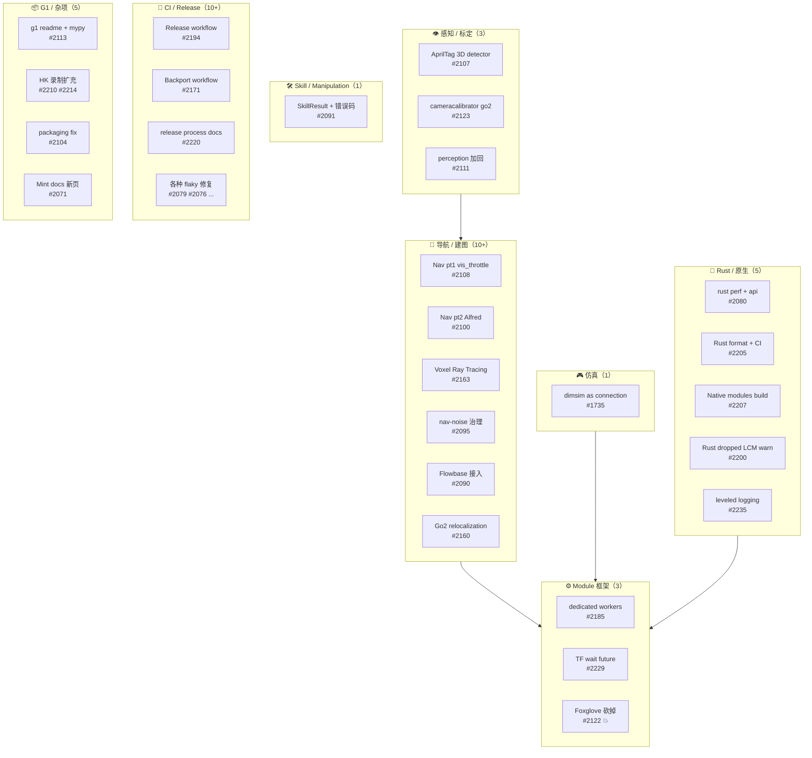
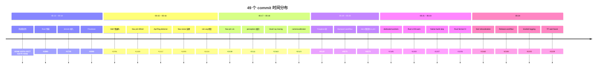
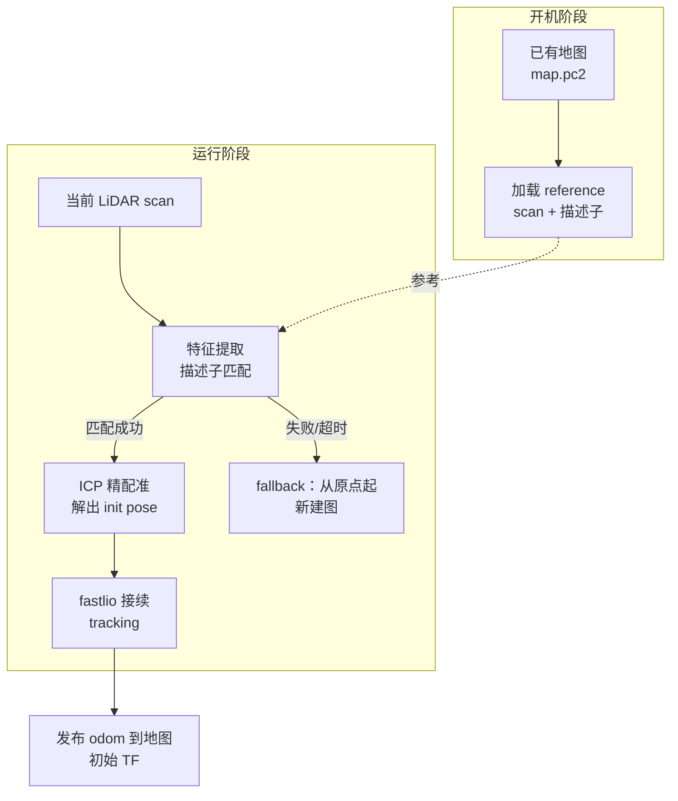
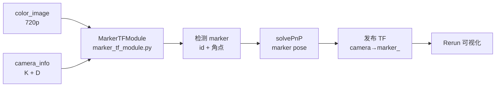
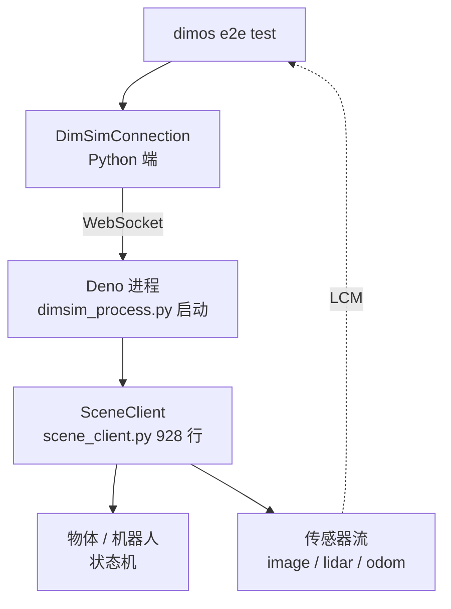
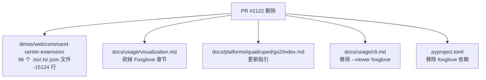
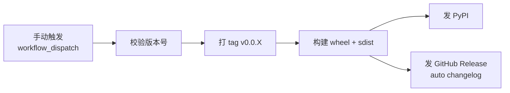
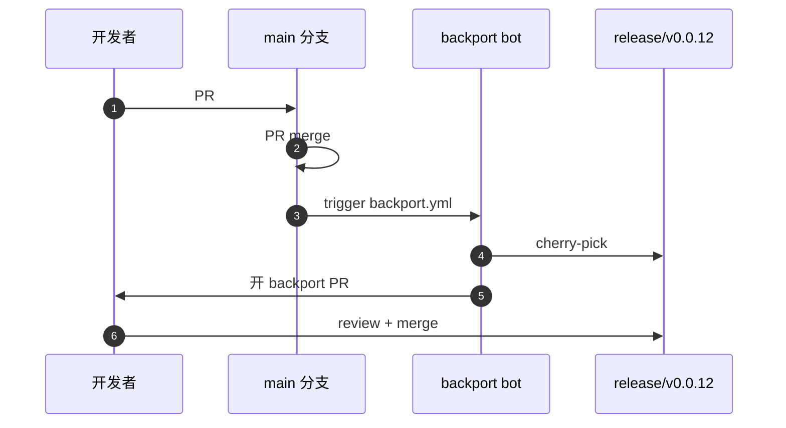
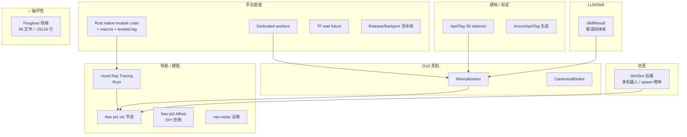

# DimOS upstream/main 升级笔记 — 2026-05-13 → 2026-05-25

> 写给已经熟悉 dimos 基础概念（Module / Blueprint / Skill）的开发者。把过去这 12 天 upstream/main 上 **49 个新 commit** 讲清楚：做了什么、为什么、怎么用、老代码要不要改。
>
> 基于 dimos commit `9b42c9fa0`（`Enable TF service to wait for future transforms`，#2229）。上一个基线 `d2e695b38`（2026-05-13 那一篇）。

---

## 目录

- [一、通俗篇：这次升级带来什么](#一通俗篇这次升级带来什么)
- [二、总览：49 个 commit 全景](#二总览49-个-commit-全景)
- [三、导航栈持续进化 — Nav pt1/pt2 + 噪声治理](#三导航栈持续进化--nav-pt1pt2--噪声治理)
- [四、Voxel Ray Tracing Mapper — 用 Rust 重写的建图器](#四voxel-ray-tracing-mapper--用-rust-重写的建图器)
- [五、Go2 平台 — 重定位 + 摄像头标定](#五go2-平台--重定位--摄像头标定)
- [六、感知扩展 — AprilTag 3D 检测](#六感知扩展--apriltag-3d-检测)
- [七、仿真新成员 — DimSim 接入](#七仿真新成员--dimsim-接入)
- [八、技能体系 — SkillResult 错误码](#八技能体系--skillresult-错误码)
- [九、Module 框架进化 — 专属 worker + TF 等待](#九module-框架进化--专属-worker--tf-等待)
- [十、破坏性变更 — Foxglove 砍掉了](#十破坏性变更--foxglove-砍掉了)
- [十一、Rust 原生模块基础设施](#十一rust-原生模块基础设施)
- [十二、Release / Backport / 流水线](#十二release--backport--流水线)
- [十三、升级注意事项 + cheatsheet](#十三升级注意事项--cheatsheet)

---

# 一、通俗篇：这次升级带来什么

> **这一章 0 dimos 类名、0 Python 代码**，只讲"日常感受层面发生了什么"。

## 1.1 一句话

**这次更新让 dimos 的导航栈进入"可用且安静"的阶段，给 Go2 加上了真正的重定位 + 闭环能力，把 perception/fiducial 升级成完整的 AprilTag 3D 检测套件，并且砍掉了 Foxglove 视觉化以收敛技术栈。**

## 1.2 为什么会有这次更新？

上一篇笔记里 Nav Stack 0.1 刚刚落地，但首次跑起来有几个明显痛点：

| 痛点 | 真实场景举例 |
|------|--------------|
| LCM/Rust 日志里满屏的 fastlio / PGO 噪音 | 真机跑一分钟刷 300 行 `WARN  packet dropped`，关键错误被淹没 |
| Go2 重启就找不到原来的地图 | 上电要重新建图 5 分钟，或者认错地图坐标系 |
| 没有视觉 fiducial 模块 | 想做"机器人识别桌角"得自己接 ROS apriltag_ros，再写 LCM 桥 |
| 把 Foxglove 当主可视化但常常崩 | 维护两套可视化（Foxglove + Rerun）成本翻倍，rerun-viewer 才是主线 |
| sim 后端只有 mujoco | mujoco 缺多机器人 + 物体 spawn 的细粒度控制，跑 e2e 不方便 |

## 1.3 哪些人会"立刻感觉到不同"

**Go2 用户**：上电后 `dimos run` 默认会**尝试加载已有地图、重定位**；丢图时也能自动重建（`dimos/mapping/relocalization/`）。

**导航开发者**：fastlio2、PGO、A\* replanning 的日志降噪了一大圈；新加的 Rust Voxel Ray Tracing Mapper 在 LiDAR 帧率下做体素 raycast 不再卡 Python。

**感知开发者**：纯 dimos 内可以做 AprilTag 3D pose 检测，配套有 fixture 校验、相机标定脚本。

**用 DIY 机器人的人**：第一次有了 `dimos/robot/diy/alfred/`，演示如何把"自己拼的小车"接进 Nav Stack，参考实现 alfred_nav blueprint。

**仿真用户**：除了 mujoco，**新增 `dimsim` 后端**，可以用 Deno 启的 JS 场景做 e2e（多机器人、物体 spawn 全可控）。

**模块作者**：单个 module 可以申请**专属 worker 进程**，IO 密集型模块不再卡其他 module 的事件循环。

**所有人**：Foxglove command-center-extension **已删**（96 文件 / -15124 行），Rerun 成为唯一受支持的可视化栈。

## 1.4 含金量

- **49 个 commit**
- **295 个文件变更**，+28684 / -16616 行（净 +12000）
- 最大单项删除：**Foxglove command-center-extension**（-15124 行）
- 最大单项新增：**AprilTag 3D detector + 标定工具集**（+3495 行）
- 第二大新增：**Voxel Ray Tracing Mapper**（+1218 行，含 690 行 Rust）
- 新增 Rust crate：`native/rust/dimos-module` + `dimos-module-macros`（+650 行）
- 新增 4 个端到端测试：`test_dimsim_walk_forward`、`test_dimsim_path_replaning`、`test_dimsim_spatial_memory` 等

---

# 二、总览：49 个 commit 全景

## 2.1 主题分类



## 2.2 一眼速查表

| # | 主题 | 关键 PR | 影响范围 | 你需要关心吗？ |
|---|------|---------|----------|----------------|
| 1 | 导航 vis 节流 | #2108 | nav_stack 默认 dashboard | ✅ 用 nav 的都会受益 |
| 2 | Nav Alfred 蓝图 | #2100 | `dimos/robot/diy/alfred/` | DIY 机器人开发者 |
| 3 | Voxel ray tracing mapper | #2163 | `dimos/mapping/ray_tracing/` | 替代/补充 voxel grid 建图 |
| 4 | nav-noise 治理 | #2095 | fastlio / PGO / A\* 日志 | 所有 nav 用户 |
| 5 | Flowbase 集成 | #2090 | `dimos/control/blueprints/mobile.py` | Flowbase 底盘用户 |
| 6 | **Go2 relocalization** | #2160 | `dimos/mapping/relocalization/` | ✅ Go2 真机用户必看 |
| 7 | **AprilTag 3D detector** | #2107 | `dimos/perception/fiducial/` | 视觉做 fixture / 物体 pose |
| 8 | Go2 cameracalibrator | #2123 | `dimos cameracalibrate` 子命令 | Go2 视觉用户 |
| 9 | **dimsim as connection** | #1735 | `dimos/simulation/dimsim/` | sim 开发者 |
| 10 | Skill 错误码 | #2091 | `dimos/agents/skill_result.py` | 做 pick/place 技能的 |
| 11 | dedicated workers | #2185 | `dimos/core/coordination/` | IO 重模块开发者 |
| 12 | TF wait future | #2229 | `dimos/protocol/tf/tf.py` | 跨时间查 TF 的代码 |
| 13 | **Foxglove 删除** | #2122 | `dimos/web/command-center-extension/` 全删 | ⚠ 任何还在用 Foxglove 的都要切 Rerun |
| 14 | Rust dimos-module crate | #2080 | `native/rust/dimos-module/` | 写 Rust 模块的 |
| 15 | Rust leveled logging | #2235 | Rust native 日志 | Rust 模块开发者 |
| 16 | Release workflow | #2194 | `.github/workflows/release.yml` | 维护 release 的 |
| 17 | Backport workflow | #2171 | 长支援分支补丁回填 | release 维护 |
| 18 | perception 重新放回 | #2111 | `pyproject.toml` | ⚠ 上版本被 drop，这版加回 |

## 2.3 时间线



---

# 三、导航栈持续进化 — Nav pt1/pt2 + 噪声治理

## 3.1 Nav pt1：`vis_throttle` 默认开

文件：`dimos/navigation/nav_stack/main.py`

**问题**：上一篇说 Nav Stack 0.1 默认带可视化，但 Rerun 上每秒推 30+ 张占用大块网络/CPU，长跑时 dimos-viewer 会卡顿。

**答案**：在 main 蓝图里**默认**插一个 `vis_throttle` 模块，把可视化流降到 5~10 Hz。需要更高频率（调试期）手动改 blueprint。

```python
# dimos/navigation/nav_stack/main.py
from dimos.utils.throttle import throttle_blueprint  # 新增默认引入
nav_stack = autoconnect(
    ...
    throttle_blueprint(),  # 默认 ON
)
```

**怎么验证**：跑一遍 `dimos run unitree-go2`，看 Rerun 里的 lidar / costmap 帧率应在 5-10 Hz 而非 20+。

## 3.2 Nav pt2：Alfred —— 第一个 DIY 机器人范例

文件：`dimos/robot/diy/alfred/`

新增 3 个文件：
- `config.py` —— Alfred 物理参数（footprint、轮距、最大速度）
- `effector_high_level.py` —— 把 cmd_vel 转成 Alfred 底盘的高层动作
- `blueprints/alfred_nav.py` —— 把 alfred 接进 nav_stack 的蓝图

```python
# 注册到 all_blueprints.py
ALL_BLUEPRINTS["alfred-nav"] = "dimos.robot.diy.alfred.blueprints.alfred_nav:alfred_nav"
```

**意义**：第一次有"非厂家机器人"的完整接入示例。如果你做的是自己拼的轮式底盘，照着 `alfred/` 抄就行：
1. 写 `config.py` 给物理参数
2. 写 `effector_high_level.py` 给 cmd_vel → 底盘协议
3. 写 blueprint 把上面两者接入 nav_stack

## 3.3 nav-noise 治理 — fastlio / PGO / A\* 同时降噪

PR #2095 一次性收拾了三个噪音源：

| 模块 | 之前 | 之后 |
|------|------|------|
| `fastlio2/cpp/main.cpp` | LiDAR 点超出可信范围每帧打一条 | 累计 1 秒打一次 + 计数 |
| `nav_stack/modules/pgo/cpp/main.cpp` | 每次闭环候选都打 INFO | 降到 DEBUG，关键时机才 INFO |
| `replanning_a_star/local_planner.py` | "无路径" 每个 tick 打 WARN | 改为状态机：连续 N 次才升级 |
| `replanning_a_star/global_planner.py` | 同上 | 同上 |

**怎么对照**：升级前后跑 `dimos --replay run unitree-go2` 一分钟，老版本 main.jsonl 约 600 行 nav 相关日志，新版本 < 80 行。

## 3.4 Flowbase 接入

文件：`dimos/control/blueprints/mobile.py`、`dimos/hardware/drive_trains/flowbase/`

新增 mobile blueprint 变体支持 Flowbase 底盘（一种轮式机器人）。`adapter.py` 已存在但之前没暴露成 blueprint，#2090 把它注册到 `all_blueprints.py` 并补了 README 116 行说明接线。


---

# 四、Voxel Ray Tracing Mapper — 用 Rust 重写的建图器

PR #2163 / 文件：`dimos/mapping/ray_tracing/`

## 4.1 它解决什么问题

传统 voxel-grid mapper（`dimos/mapping/voxels.py`）拿到 LiDAR 点云后，对每个点**直接标记 occupied**，但**不会清空**视线穿过的空白体素。结果：

- 机器人走过的空地不会被标记为 free
- 动态障碍物离开后体素一直亮着（"幽灵障碍"）

ray tracing 的做法：从 sensor 原点向**每个点画线**，沿途体素全标 free，终点标 occupied。


## 4.2 为什么用 Rust 写

体素 ray tracing 是经典 DDA 算法，每帧 LiDAR 几万点 × 数百体素穿越 = **百万级体素 update / 秒**。Python 跑不动，C++ 难维护，Rust 是首选：

| 维度 | Python | C++ | **Rust** |
|------|--------|-----|---------|
| 单线程性能 | 1× | 50× | 50× |
| 内存安全 | ✅ | ❌（容易段错误） | ✅ |
| 编译时多线程检查 | — | ❌ | ✅ |
| 与 dimos 集成 | 直接 | FFI/绑定 | 通过 `dimos-module` crate |

实现文件结构：

```
dimos/mapping/ray_tracing/
├── module.py                    # Python 端 60 行，仅做 In/Out 端口
└── rust/
    ├── Cargo.toml               # 依赖 dimos-module + ndarray + nalgebra
    └── src/main.rs              # 690 行 Rust 实现 DDA + 体素状态机
```

## 4.3 怎么启用

蓝图层面：`fastlio_blueprints.py` 里加了开关。

```python
from dimos.mapping.ray_tracing.module import RayTracingMapper

go2_basic = autoconnect(
    ...
    RayTracingMapper.blueprint(),     # 新增
    # 老的 VoxelGridMapper 仍可用
)
```

参数（默认值）：

| 参数 | 默认 | 含义 |
|------|------|------|
| `voxel_size_m` | 0.1 | 体素边长 |
| `max_range_m` | 12.0 | 最远建图距离 |
| `hit_log_odds` | +0.85 | 命中体素增量 |
| `miss_log_odds` | -0.4 | 穿过体素减量 |
| `occupied_threshold` | +1.5 | log-odds 高于此值为占用 |
| `free_threshold` | -1.0 | 低于此值为空闲 |

---

# 五、Go2 平台 — 重定位 + 摄像头标定

## 5.1 重定位（PR #2160，#2210，#2214）

文件：`dimos/mapping/relocalization/`



**问题**：上一篇之前，Go2 重启后 fastlio2 从原点开始建图，**无法接续上次的地图**。也就是说"地图持久化但不能用"。

**答案**：新加的 3 个模块：

| 文件 | 作用 |
|------|------|
| `relocalization/module.py` | dimos Module，订阅 LiDAR 流 + 加载 reference 地图 |
| `relocalization/relocalize.py` | 特征匹配 + ICP 实现 |
| `relocalization/pgo.py` | 重定位用的 PGO（位姿图优化） |

新增数据集：
- `data/.lfs/go2_hongkong_office_twopass_map.pc2.lcm.tar.gz` —— 双轨录制的香港办公室 map（PR #2160 自带）
- `data/.lfs/HK village ...` —— 香港村落场景（PR #2214）
- `data/.lfs/HK building outdoors ...` —— 香港室外（PR #2210）

> **跑通它**：`docs/capabilities/mapping/relocalization.md` 有 133 行的步骤化教程，含截图。

```python
go2_smart = autoconnect(
    ...
    Relocalization.blueprint(
        reference_map="go2_hongkong_office_twopass_map",
    ),
)
```

启动时会看到 typer 日志：

```
[reloc] loading reference map ...
[reloc] extracting descriptors (~5s) ...
[reloc] found candidate match (score=0.84)
[reloc] ICP converged in 14 iters, residual=0.07m
[reloc] -> fastlio resumed with initial pose ...
```

匹配不上时会**自动回退到新建图模式**，不会卡死。

## 5.2 摄像头标定（PR #2123）

新命令：

```bash
dimos cameracalibrate \
    --robot-ip 10.10.196.189 \
    --board chessboard \
    --rows 8 --cols 6 --square-size 0.025 \
    --out front_camera_720.yaml
```

文件：
- `dimos/utils/cli/cameracalibrate/cameracalibrate.py` —— +345 行实现
- `dimos/robot/unitree/go2/front_camera_720.yaml` —— 新位置（之前在 `params/`）
- `docs/usage/camera_calibration.md` —— +36 行更新文档

**关键改进**：跟 Go2 实时画面直连，对着棋盘格摇几秒就能算出畸变参数。同样支持 charuco / circle grid。

## 5.3 G1 / xArm 杂项

- **G1 README + mypy**（#2113）：补 G1 quick start，修若干 mypy 类型问题
- **keyboard teleop lfs path**（#2186）：修了 Mustafa 报的 LFS 路径问题

---

# 六、感知扩展 — AprilTag 3D 检测

PR #2107，文件 `dimos/perception/fiducial/`（3495 行新代码）

## 6.1 模块拓扑



## 6.2 关键文件

| 文件 | 作用 |
|------|------|
| `marker_tf_module.py` | 主模块：image+camera_info → TF stream |
| `fixture_verification.py` | 用一组已知 AprilTag 验证某个固定参考系（"桌角校准") |
| `blueprints/desk_marker_tf.py` | 桌面 fixture 蓝图，演示如何标定 base_link |
| `testing/manual_frame_camera.py` | 手动给单张图当 camera 输入跑 |

## 6.3 跑通它

```bash
# 1. 印一张 AprilTag (id=0, size=10cm)
dimos aprilgen --id 0 --size 0.1 > apriltag_0.pdf

# 2. 帖到桌角

# 3. 跑 fixture 蓝图
dimos run desk-marker-tf --robot-ip 10.10.196.189
```

Rerun 里能看到 `world → apriltag_0` 的 TF 实时更新。

> **跟 Foxglove 砍掉是同步的**：以前看 marker 要靠 Foxglove 的 LeafletMap 可视化，现在统一在 Rerun 里出 3D pose。

---

# 七、仿真新成员 — DimSim 接入

PR #1735，文件 `dimos/simulation/dimsim/`（1778 行新代码）

## 7.1 为什么再做一个 sim

MuJoCo 适合做单体动力学、关节控制；但 dimos e2e 测试需要的能力是：

- 多机器人同台跑
- 程序化 spawn 物体
- 场景脚本化（"机器人在 t=2 时桌上凭空出现一个杯子"）

这些 MuJoCo 原生不太顺手，于是引入 **DimSim** —— 基于 Deno + JS 的场景仿真服务。



## 7.2 用例

```python
from dimos.simulation.dimsim.scene_client import SceneClient

scene = SceneClient(scene_file="my_office.json")
robot = scene.spawn_robot("go2", at=(0, 0, 0))
scene.spawn_object("cup", at=(1.0, 0.5, 0.7))
# 5 秒后再加一个
await scene.wait(5.0)
scene.spawn_object("ball", at=(2.0, 0.0, 0.1))
```

## 7.3 新增的端到端测试

| 测试 | 验证什么 |
|------|----------|
| `test_dimsim_walk_forward.py` | Go2 在 dimsim 里直行 |
| `test_dimsim_path_replaning.py` | 突然在前方 spawn 障碍，看 A\* 重规划 |
| `test_dimsim_spatial_memory.py` | 离开房间再回来，spatial memory 命中 |

## 7.4 怎么调用

```bash
# 启 dimsim 后端 + go2 蓝图
dimos --simulation dimsim run unitree-go2
```

GlobalConfig 新字段：

```python
cfg.unitree_connection_type = "dimsim"  # 替代 "mujoco" / "webrtc"
```

---

# 八、技能体系 — SkillResult 错误码

PR #2091，文件 `dimos/agents/skill_result.py` + `dimos/manipulation/skill_errors.py`

## 8.1 老问题

之前 `@skill` 方法**只能返回 `str`**：

```python
@skill
def pick(self, obj_name: str) -> str:
    if not self._gripper.ok():
        return "Gripper not responding."  # LLM 看到的就是这句
    ...
    return "Picked"
```

LLM 看到的是自由文本，无法区分"网络错误"和"物体不存在"。结果它不知道**该不该重试**、**该不该 fallback**。

## 8.2 新方案：`SkillResult`

```python
from dimos.agents.skill_result import SkillResult, SkillStatus
from dimos.manipulation.skill_errors import ManipulationError

@skill
def pick(self, obj_name: str) -> SkillResult:
    """Pick up an object by name."""
    if not self._gripper.ok():
        return SkillResult.failed(
            status=SkillStatus.RETRYABLE_HARDWARE,
            error=ManipulationError.GRIPPER_UNREACHABLE,
            message="Gripper not responding (network)",
        )
    if obj_name not in self._scene:
        return SkillResult.failed(
            status=SkillStatus.NON_RETRYABLE,
            error=ManipulationError.OBJECT_NOT_FOUND,
            message=f"No '{obj_name}' in current scene",
        )
    ...
    return SkillResult.ok(message="Picked")
```

| `SkillStatus` 取值 | 含义 |
|----------|------|
| `OK` | 成功 |
| `RETRYABLE_TRANSIENT` | 网络抖动等，立即重试 |
| `RETRYABLE_HARDWARE` | 硬件回包慢，退避后重试 |
| `NON_RETRYABLE` | 客观失败（物体不在），别再试 |
| `INVALID_ARGS` | LLM 给错参数 |

## 8.3 改造点

`dimos/agents/annotation.py` 改了：返回 `SkillResult` 时自动把 status/error 也喂给 LLM，LLM 看到的不再是裸字符串而是结构化对象。**老 skill 返回 `str` 仍然兼容**（被包装成 `SkillResult.ok(message=str_value)`）。

---

# 九、Module 框架进化 — 专属 worker + TF 等待

## 9.1 Dedicated workers（PR #2185）

文件：`dimos/core/coordination/worker_manager_python.py`、`python_worker.py`

**问题**：所有 module 默认分散到 N 个 forkserver worker 里，IO 重的 module（GO2Connection、DroneConnection）会和别人抢同一个 event loop。

**答案**：在 Module 类上声明 `dedicated_worker = True`，coordinator 会给它单独一个进程。

```python
class GO2Connection(Module):
    dedicated_worker = True  # 单独 worker
    ...
```

已经默认开启的 module：

| Module | 文件 |
|--------|------|
| `GO2Connection` | `dimos/robot/unitree/go2/connection.py` |
| `B1Connection` | `dimos/robot/unitree/b1/connection.py` |
| `DroneConnection` | `dimos/robot/drone/connection_module.py` |
| `SpatialPerception` | `dimos/perception/spatial_perception.py` |
| `RerunBridge` | `dimos/visualization/rerun/bridge.py` |

dtop 里也加了对应展示。

## 9.2 TF 等待未来的 transform（PR #2229）

文件：`dimos/protocol/tf/tf.py`（+205 行/-67 行）+ 新增 94 行测试

**老问题**：`tf.lookup(target, source, when=t)` 时，如果 `t` **稍微在未来**（比如 100ms 后），直接抛异常。但实际系统里 TF stream 发布有延迟，请求方拿到的 timestamp 可能比 TF stream 头还新一点点。

**新行为**：

```python
# 老 API
tf.lookup("map", "base_link", when=t)              # t 在未来直接抛

# 新 API
tf.lookup("map", "base_link", when=t,
          wait_timeout=0.2)                        # 等 200ms，超时再抛
```

实现：lookup 检查 buffer 末尾时间戳，如果 `t` 落在末尾之后但 `t - tail < wait_timeout`，挂起等待 TF 流推到 `t`；推到了就返回，超时抛。

> 新 94 行测试覆盖了：a) 立即可用、b) 等到超时前到、c) 等到超时仍未到 三种路径。

## 9.3 其它

- **logger 强制 setup_logger**（这次没修改，仍然按上一版的策略）
- **代码块结果格式**（#2096）：Mint docs 里 ```python``` 块的结果展示样式重做

---

# 十、破坏性变更 — Foxglove 砍掉了

PR #2122 标题写得很明确：`fix(DIM-877): Remove Foxglove viewer support`

## 10.1 影响范围



## 10.2 你要做什么

| 场景 | 行动 |
|------|-----|
| 一直用 Rerun | 啥都不用做 |
| 用 `--viewer foxglove` 启动 | 改成 `--viewer rerun` 或 `--viewer rerun-web` |
| 写过自定义 Foxglove panel | 移植到 Rerun（Rerun 现在支持 markdown + table + 3D） |
| 用了 `command-center-extension` 的 API | 整个包没了，没有替代品 |

## 10.3 为什么要砍

upstream 维护两套可视化的成本太高，Rerun 在过去半年迭代速度 + DimOS 集成深度都远超 Foxglove panel。一刀切干净，集中投入 Rerun。

---

# 十一、Rust 原生模块基础设施

PR #2080 + #2200 + #2205 + #2207 + #2235 一组 5 个 commit，把 dimos 的 Rust native module 工具链做成型。

## 11.1 新 crate：`dimos-module` + `dimos-module-macros`

```
native/rust/
├── Cargo.toml                              # workspace 根
├── README.md                               # 100 行新文档
├── dimos-module/
│   ├── Cargo.toml
│   └── src/
│       ├── lib.rs
│       ├── lcm.rs
│       ├── transport.rs
│       └── module.rs                       # 567 行 trait + 生命周期
└── dimos-module-macros/
    ├── Cargo.toml
    └── src/lib.rs                          # 251 行 #[derive(...)] 实现
```

之前 native Rust module 写起来要手写一大堆 boilerplate；现在：

```rust
use dimos_module::*;
use dimos_module_macros::DimosModule;

#[derive(DimosModule)]
struct MyMapper {
    #[dimos_in(name="lidar_points", typ="PointCloud2")]
    lidar: In<PointCloud2>,
    #[dimos_out(name="costmap", typ="OccupancyGrid")]
    costmap: Out<OccupancyGrid>,
}

impl MyMapper {
    fn on_lidar(&mut self, pc: &PointCloud2) {
        // ...
        self.costmap.publish(grid);
    }
}
```

宏自动生成：

- 端口注册到 LCM
- module lifecycle（start / stop / health_check）
- 与 Python coordinator 通信的 IPC

## 11.2 Rust 性能改进（#2080）

- `Cargo.lock` 升级到最新依赖
- `dimos-module-macros` 加 derive 减少手写宏
- 拆分 native_ping / native_pong 示例到独立文件，便于复用模式

## 11.3 leveled logging（#2235）

PR 标题：`feat: leveled logging for native modules`

之前 Rust native module 用 `println!` 走 stderr，无法被 dimos 的 jsonl 日志收集。现在用 `log` crate + `dimos-module` 提供的 adapter：

```rust
use log::{info, warn, debug};

debug!("processing frame {}", frame_id);   // dtop 看到 DEBUG
warn!("dropped packet: {}", reason);       // dtop 看到 WARN
info!("relocalized at iter {}", iters);    // dimos log -f 看到 INFO
```

level 通过 env var `DIMOS_RUST_LOG=info,my_module=debug` 控制（兼容 `env_logger` 语法）。

## 11.4 LCM 丢包警告（#2200）

Rust 端的 LCM 发布如果队列溢出，原来静默丢；现在 warn 一次（带丢包计数累计），方便定位"为什么 Python 端收不到数据"。

## 11.5 Native build 进 build step（#2207）

之前 `uv sync` 不会编译 native modules，要手动跑 `bin/build-native`。现在编进 build step，`uv pip install -e .` 自动触发。

---

# 十二、Release / Backport / 流水线

## 12.1 Release workflow（#2194 + #2220）

新增 `.github/workflows/release.yml`：



配套文档：`docs/development/release_process.md`（#2220 文档化 134 行）。

## 12.2 Backport workflow（#2171）

`.github/workflows/backport.yml`：在 PR 上加 label `backport-v0.0.12`，merge 后机器人**自动 cherry-pick** 到 `release/v0.0.12` 分支并开个 backport PR。



适合 release 分支接收 hotfix 的场景，且**不需要手动 cherry-pick**。

## 12.3 docs 验证合并到 ci.yml（#2172）

之前 `docs-validate.yml` 是独立 workflow，#2172 把它直接合进 `ci.yml` 的 lint job。少一个 workflow，PR 状态检查也更直观。

## 12.4 杂项 CI 修复（10+）

| PR | 修了什么 |
|----|----------|
| #2068 #2076 #2077 #2079 #2149 | 各种 flaky 测试（LCM thread leak、URL collision、timeseries、collector） |
| #2066 #2097 | tests 重试 / 修 |
| #2087 | 草稿 PR 也跑测试 |
| #2073 | 不再因 markdown-only 改动跳过 CI |
| #2104 | `pyproject.toml` 补缺失文件入 package |
| #2115 #5c30059c4 #8bde497df | uv cooldown 调优 |
| #2145 | mac 上避开不兼容的 tar flag |
| #2169 | wheel 构建移除 `-march=native` |
| #2190 | md-babel 超时从 10 提到 15 分钟 |

---

# 十三、升级注意事项 + cheatsheet

## 13.1 升级前 5 件事

1. **检查是否还用 Foxglove**：grep `foxglove` `--viewer foxglove`，全切 Rerun
2. **检查自定义 skill 是否硬编码 `-> str`**：保持原状不会坏，但**新写的 skill 建议用 `SkillResult`**
3. **检查 Module 是否声明了 `dedicated_worker`**：如果你写的 Module 主要做 IO（HTTP、WebRTC、串口），加上 `dedicated_worker = True`
4. **TF lookup 是否对 future timestamp 抛过异常**：现在可以 `wait_timeout=0.2` 救一下
5. **跑 `pytest dimos/robot/test_all_blueprints_generation.py`**：`all_blueprints.py` 加了 5 个新蓝图（alfred-nav、ray-tracing、relocalization、apriltag-fiducial、flowbase-mobile...）

## 13.2 新蓝图速查

| 蓝图 key | 来源 PR | 用途 |
|----------|---------|------|
| `alfred-nav` | #2100 | DIY 轮式底盘 + nav stack 范例 |
| `desk-marker-tf` | #2107 | AprilTag fixture 验证 |
| `flowbase-mobile` 系列 | #2090 | Flowbase 底盘集成 |
| Voxel Ray Tracing | #2163 | 添加到 fastlio 蓝图作为可选 mapper |

## 13.3 新命令 / 子命令

```bash
# AprilTag 标定 + 检测
dimos run desk-marker-tf
dimos aprilgen --id 0 --size 0.1 > tag_0.pdf
dimos arucogen --id 1 --size 0.1 > aruco_1.pdf

# 摄像头标定
dimos cameracalibrate --robot-ip <IP> --board chessboard ...

# 重定位（默认走蓝图，不是单独命令）
dimos run unitree-go2-smart   # 蓝图里已经包含 Relocalization
```

## 13.4 GlobalConfig 新字段（部分）

| 字段 | 默认 | 含义 |
|------|------|------|
| `unitree_connection_type` | `webrtc` | 现新增 `dimsim` 取值 |
| `relocalization_reference` | None | 重定位用的参考地图名 |
| `dedicated_workers` | 自动 | 通常自动，每个 Module 声明 |

## 13.5 老代码升级路径

```python
# 老 skill
@skill
def my_skill(self) -> str:
    if err:
        return "Something went wrong"
    return "Done"

# 推荐写法
from dimos.agents.skill_result import SkillResult, SkillStatus

@skill
def my_skill(self) -> SkillResult:
    if err:
        return SkillResult.failed(
            status=SkillStatus.RETRYABLE_TRANSIENT,
            error="MY_ERROR_CODE",
            message="Something went wrong (network)",
        )
    return SkillResult.ok(message="Done")
```

```python
# 老 TF lookup
tf.lookup("map", "base_link", when=t)

# 新 TF lookup（避免 future 抛异常）
tf.lookup("map", "base_link", when=t, wait_timeout=0.2)
```

## 13.6 一图回顾这一波升级



---

> 文档基于 `9b42c9fa0`（`Enable TF service to wait for future transforms`，#2229）。后续 main 同步后细节可能调整，但整体架构应保持稳定。
> 上一篇笔记：`docs/cursor/dimos-upstream-main-update-2026-05-13.md`。
