# DimOS upstream/dev 升级笔记 — 2026-04-28 → 2026-05-06

> 写给已经熟悉 dimos 基础概念（Module / Blueprint / Skill）的开发者。一次性把过去这 8 天 upstream/dev 上 13 个新 PR 讲清楚：做了什么、为什么这么做、怎么用、老代码要不要改。
>
> 基于 dimos commit `884e7ed02`（`Task: OpenArm Integration with DimOS`，#1897）。本地 `feat/jiangtao` 已经 fast-forward 到这个版本。

---

## 目录

- [一、通俗篇：这次升级带来了什么](#一通俗篇这次升级带来了什么)
- [二、总览：13 个 commit 的全景图](#二总览13-个-commit-的全景图)
- [三、Async Modules — 模块系统迈入 asyncio 时代](#三async-modules--模块系统迈入-asyncio-时代)
- [四、Tool Streams — 让 Skill 边干活边汇报](#四tool-streams--让-skill-边干活边汇报)
- [五、G1 全身控制 — 29-DOF 人形低层接入](#五g1-全身控制--29-dof-人形低层接入)
- [六、OpenArm 集成 — 第一个无 SDK 双臂研究平台](#六openarm-集成--第一个无-sdk-双臂研究平台)
- [七、其它新功能合集](#七其它新功能合集)
- [八、修复与撤销](#八修复与撤销)
- [九、升级注意事项 — 老代码该改什么](#九升级注意事项--老代码该改什么)
- [十、参数 cheatsheet 与延伸阅读](#十参数-cheatsheet-与延伸阅读)

---

# 一、通俗篇：这次升级带来了什么

> 这一章 0 dimos 类名、0 Python 代码，只讲"日常感受层面发生了什么"。

## 1.1 一句话

**这次更新让 dimos 在 4 个维度同时往前走了一大步：模块写得更简单了、机器人能边动边和你说话了、新加了一个 7-DOF 双臂硬件、人形机器人能直接收发关节命令了。**

## 1.2 为什么会有这次更新？

dimos 在过去几个月一直围绕"统一的机器人模块系统"往前推。但有几个长期痛点：

| 痛点 | 真实场景举例 |
|---|---|
| 模块里写并发要靠 `threading.Lock`，写错就死锁 | 比如"如果手柄按下了就忽略导航命令"——两个 callback 抢一个布尔变量 |
| Skill 一旦开始干活，LLM 就听不到任何中间反馈 | "去把球捡过来"——LLM 只会等几分钟看到一个最终字符串，中间不知道在哪 |
| 想接一个新硬件臂，得先翻它的 SDK；没 SDK 就跑不动 | OpenArm 是开源臂，根本没有 Python SDK，只有 CAN 协议 |
| G1 人形只能跑高层 sport-mode，没法直接发关节命令 | 想做 wholebody 控制 / 学习 / 仿真到真机迁移 都做不了 |

这次更新一次性解决了上面 4 个痛点。

## 1.3 哪些人会"立刻感觉到不同"

**Skill 作者**：可以让 LLM 实时看到你的 skill 在干什么了——以前必须返回时一次性给最终结果。

**模块作者**：写并发不再需要锁。整个模块一个 asyncio 事件循环跑，所有回调都在同一个线程上，状态变量直接读写就行。

**G1 用户**：现在能直接发 29 个关节的目标位姿到真机/仿真，相当于 "解锁了人形机器人的低层接口"。

**新硬件接入者**：OpenArm 给出了"没 SDK 也能做"的完整范例——纯 SocketCAN 自研驱动 + dimos 适配器 + Drake 规划器。下次你接一个国产臂，可以照着这个流程走。

**性能调优者**：`dtop` 现在能看每个 worker 的子进程 CPU 了，配套 `dtop-plot` 能从录制的 jsonl 离线画出每个模块的 CPU/PSS/线程数曲线图。

## 1.4 什么是"async 模块"——一个不写代码的解释

想象你在咖啡店点单：

- **多线程模式**（旧）：吧台前面 3 个店员同时干活，大家共用一台收银机。每次有人按收银机，得先大喊"我用了"——这就是锁。喊错了有人会同时按下，账目就乱了。
- **async 模式**（新）：吧台只有 1 个店员，但他能同时记住 N 单：泡咖啡的时候转身去做面包，面包烤上转回来盛咖啡。永远只有他一个人摸收银机，永远不会按错。

**怎么知道某一单还没做完？**——店员手里拿着每一单的小卡片（slot），新订单来了直接覆盖最旧的那张同名卡片，保证只做"最新订单"。这在 dimos 里叫 **LATEST policy**：消息来得太快了就丢中间的，只处理最新一条，反正你最关心当前状态。

## 1.5 什么是 "tool stream"——一个不写代码的解释

想象你叫师傅来修空调：

- **旧 skill**：师傅进门后从屋里出来 30 分钟，最后跟你说"修好了"。期间你完全不知道他在干嘛。
- **新 skill + tool stream**：师傅每隔 30 秒从屋里冒出来一次："拆面板了"、"在测压力"、"换电容"……你（LLM）就能根据进度判断他要不要换工具、是不是卡住了。

技术细节就是：skill 在后台干活的同时，可以随时通过 `start_tool / tool_update / stop_tool` 三个动作把"进度文本"实时推回给 LLM 客户端。LLM 把这些当成普通的 user message 加到对话历史里，可以基于它推理。

---

# 二、总览：13 个 commit 的全景图

## 2.1 时间线（从老到新）

```mermaid
flowchart LR
  subgraph d0428["04-28"]
    p1924["Revert rconnect2<br/>#1924"]
  end
  subgraph d0430["04-30"]
    p1920["async modules<br/>#1920"]
    p1895["setup_logger<br/>强制 #1895"]
  end
  subgraph d0501["05-01"]
    p1713["tool streams<br/>#1713"]
    p1909["peek_stream<br/>#1909"]
    p1925["memory2 go2 fix<br/>#1925"]
    p1939["patrol async<br/>#1939"]
    p1944["CI macOS skip<br/>#1944"]
    p1948["CI cleanup linux<br/>#1948"]
  end
  subgraph d0502["05-02"]
    p1954["G1 wholebody<br/>#1954"]
  end
  subgraph d0504["05-04"]
    p1958["MuJoCo sim teleop<br/>#1958"]
  end
  subgraph d0505["05-05"]
    p1880["dtop child cpu<br/>+ dtop-plot #1880"]
  end
  subgraph d0506["05-06"]
    p1897["OpenArm 集成<br/>#1897"]
  end

  d0428 --> d0430 --> d0501 --> d0502 --> d0504 --> d0505 --> d0506
```

## 2.2 影响面对照表

按类型分 4 组讲。

**大特性（4 个）**

| # | PR | 影响范围 | 你需要关心吗？ |
|---|---|---|---|
| #1920 | async modules | `dimos/core/module.py`、`core.py` | **会**：所有 Module 作者，向后兼容但建议改写 |
| #1713 | tool streams | `dimos/agents/mcp/`、`Module` 三件套 | **会**：所有 Skill 作者 |
| #1954 | G1 wholebody | 新 `dimos/hardware/whole_body/`、新 `g1-coordinator` blueprint | 只有 G1 用户 |
| #1897 | OpenArm | 新增 `dimos/hardware/manipulators/openarm/`、`dimos/utils/workspace.py` | 只有 OpenArm 用户，但 workspace 工具通用 |

**中特性（3 个）**

| # | PR | 影响范围 | 你需要关心吗？ |
|---|---|---|---|
| #1909 | peek_stream | `dimos.Dimos.peek_stream` | 写脚本/调试用 |
| #1958 | sim teleop | 新 `teleop-quest-{xarm6,xarm7,piper}-sim` blueprint | 没真机也能 VR teleop |
| #1880 | dtop | `dtop` 加子进程 CPU、新 `dtop-plot` | 性能分析者 |

**修复与重构（4 个）**

| # | PR | 影响范围 | 你需要关心吗？ |
|---|---|---|---|
| #1925 | memory2 fix | `Recorder` 替换 replay 逻辑、`Image` JPEG 编解码统一 RGB | **会**：用 to_jpeg/from_jpeg 的代码 |
| #1939 | patrol async | `PatrollingModule` 接口未变 | 内部重写，对外无影响 |
| #1895 | setup_logger | 新 unit test 拦截 `logging.getLogger` | **会**：仍在用 `logging.getLogger(__name__)` 的代码 |
| #1924 | Revert rconnect2 | 撤销之前的 reconnect2 改动 | 用过那块代码的人 |

**CI 维护（2 个）**

| # | PR | 影响范围 |
|---|---|---|
| #1944 | CI macOS | macOS runner 上 fast tests 不再失败 |
| #1948 | code-cleanup | code-cleanup workflow 限定 ubuntu-latest |

## 2.3 大架构图：13 个变化落在 dimos 哪里

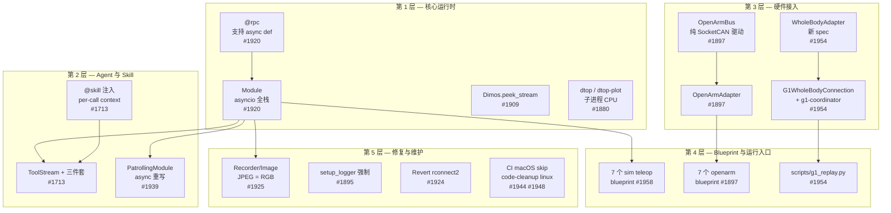

每一层后面会专门讲一章。

---

# 三、Async Modules — 模块系统迈入 asyncio 时代

> PR：#1920 · commit `8e8e9278c` · 主要改动：`dimos/core/module.py` +268 行、`dimos/core/core.py` +44 行、6 个新测试文件。

## 3.1 问题：sync module 的"锁地狱"

dimos 的 Module 一直跑在自己的 forkserver worker 进程里，但**进程内**并发是怎么处理的？答案是：每个流的回调跑在一个 rxpy 调度线程上，多流就有多线程。这就引出了一个老问题：

```python
# 旧写法：必须自己加锁
class MovementManager(Module):
    def __init__(self, ...):
        self._lock = threading.Lock()
        self._teleop_active = False

    def _on_nav_cmd_vel(self, msg):
        with self._lock:
            if not self._teleop_active:
                self.cmd_vel.publish(msg)

    def _on_tele_cmd_vel(self, msg):
        with self._lock:
            self._teleop_active = True
            self.cmd_vel.publish(msg)
```

每多一个布尔标志、每多一个共享 dict，都得想清楚加不加锁。死锁 / 竞态 bug 写过的人都懂。

## 3.2 答案：单 asyncio loop + 自动派遣

PR #1920 给每个 Module 加了一个**专属 asyncio 事件循环**（`self._loop`），跑在一个 daemon 线程上。所有"应该并发"的回调都被改成往这个循环上派遣，循环本身是单线程，所以**只要回调写成 `async def`，就不需要锁了**。

整体派遣流程：

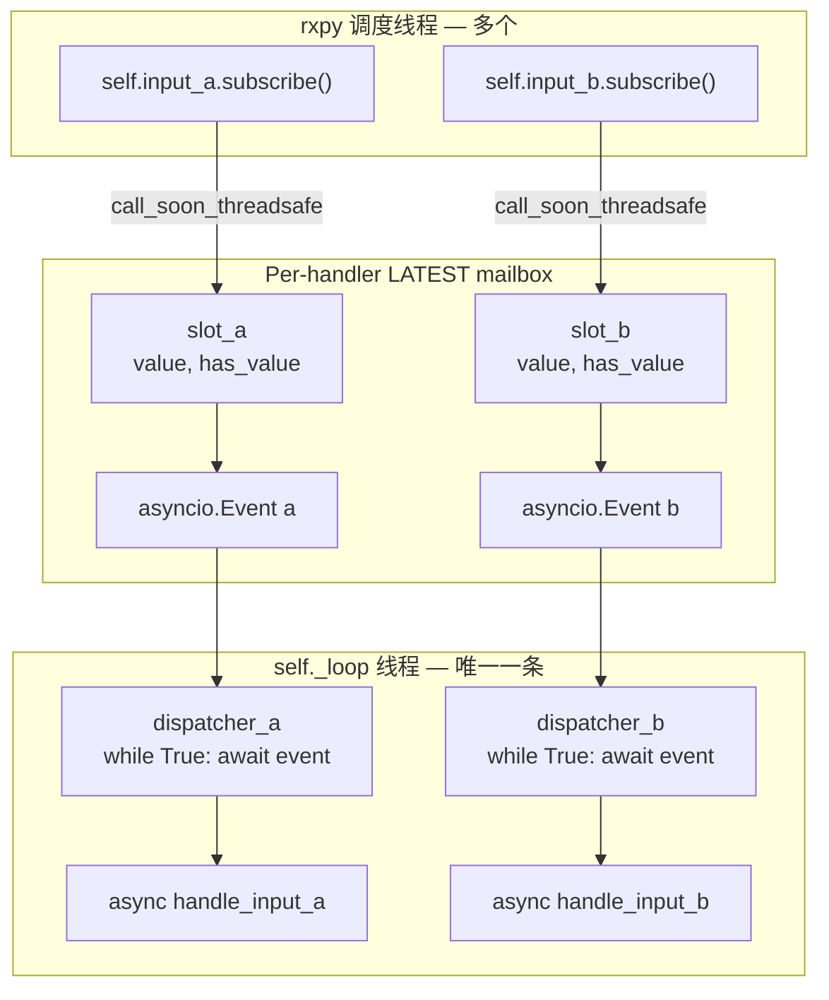

关键性质：

- **同一 handler 不会并发**：`dispatcher_a` 一个 while 循环串行调用 `handle_input_a`。
- **跨 handler 不会并发**：所有 handler 共享 `self._loop` 一条线程。
- **新消息来得太快就丢中间的**：slot 只有一个 value 槽位，覆盖即丢失，这就是 LATEST policy。
- **handler 是 `async def`，可以随便 `await`**，因为不阻塞别的逻辑。

## 3.3 7 个新 API / 写法

| API | 在哪 | 用途 |
|---|---|---|
| `async def handle_<input_name>(self, msg)` | Module 子类 | 自动绑定到 `self.<input_name>` 的订阅，由 dispatcher 派遣 |
| `@rpc async def foo()` | Module 子类 | 让 `@rpc` 同时支持 async；调用方按其线程位置决定阻塞还是返回 coroutine |
| `self.spawn(coro)` | Module | 从 sync 上下文（如 `start()`）启动一个长跑 coroutine，统一记录异常 |
| `self.process_observable(obs, async_cb)` | Module | 把任意 rxpy observable 接到 self._loop，复用 LATEST 派遣 |
| `async def main(self)` 单 yield 异步生成器 | Module 子类 | 在 `start()` 时跑前半段，`stop()` 时跑后半段，资源声明与回收紧邻 |
| `Spec` Protocol 加 `async def` | spec 文件 | 让消费者 await 一个 async 模块的 RPC：`await self._x.do_thing()` |
| `_logging_task_factory` | 内部 | 给 loop 上的所有 task 自动绑日志，未捕获异常不再静默丢失 |

## 3.4 写一个标准的 async 模块

```python
import asyncio
from collections.abc import AsyncIterator

from dimos.core.module import Module
from dimos.core.stream import In, Out
from dimos.core.core import rpc
from dimos.msgs.geometry_msgs.PointStamped import PointStamped
from dimos.msgs.geometry_msgs.Twist import Twist


class MovementManager(Module):
    clicked_point: In[PointStamped]
    nav_cmd_vel: In[Twist]
    tele_cmd_vel: In[Twist]

    cmd_vel: Out[Twist]
    goal: Out[PointStamped]

    def __init__(self, **kwargs):
        super().__init__(**kwargs)
        self._teleop_active = False
        self._timer_future = None

    async def main(self) -> AsyncIterator[None]:
        self._heavy_resource = create_some_resource()
        yield
        self._heavy_resource.shutdown()

    async def handle_clicked_point(self, msg: PointStamped) -> None:
        self.goal.publish(msg)

    async def handle_nav_cmd_vel(self, msg: Twist) -> None:
        if not self._teleop_active:
            self.cmd_vel.publish(msg)

    async def handle_tele_cmd_vel(self, msg: Twist) -> None:
        self._teleop_active = True
        self.cmd_vel.publish(msg)

    @rpc
    def start(self) -> None:
        super().start()
        self._timer_future = self.spawn(self._timer_loop())

    @rpc
    def stop(self) -> None:
        if self._timer_future:
            self._timer_future.cancel()
        super().stop()

    async def _timer_loop(self) -> None:
        while True:
            await asyncio.sleep(1.0)
```

注意 4 个细节：

1. **`_teleop_active` 直接读写**，没锁，因为它只在 `self._loop` 线程被改。
2. **`main()` 必须是 async 生成器，且只能 yield 一次**——前半段是 setup（被 `start()` 触发执行到 yield），后半段是 teardown（被 `stop()` 触发执行 yield 之后）。
3. **`start()` 仍然是 sync `@rpc`**，因为它要从外部线程被 RPC 框架调用。在里面用 `self.spawn(coro)` 启动长跑 task。
4. **handler 名字必须是 `handle_<input_name>`** — `_auto_bind_handlers()` 按这个约定查找。

## 3.5 sync ↔ async 互通：Spec 的两种写法

如果你的模块是 async 的，但消费方是 sync：

```python
class NameSpec(Spec, Protocol):
    async def say_hello(self, name: str) -> str: ...

class SyncNameSpec(Spec, Protocol):
    def say_hello(self, name: str) -> str: ...
```

两个 Spec 都能匹配同一个 `NameModule`：

- 消费方在 `_loop` 上：用 `NameSpec`，写 `await self._name.say_hello("a")`，零额外开销。
- 消费方在别的线程上：用 `SyncNameSpec`，写 `self._name.say_hello("a")`，框架会把 coroutine 调度到目标 module 的 `_loop` 上并阻塞当前线程等结果。

反向也成立——sync 模块可以被 async 模块通过 `await self._x.foo()` 调用，框架会把 sync 调用 wrap 成 awaitable。

## 3.6 一图看懂全部派遣路径

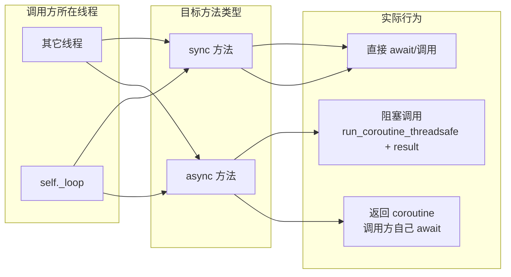

**这是 sync/async 互通的全部规则**——不需要记，按"调用方在哪个线程 + 目标是不是 async"两个维度推导即可。

---

# 四、Tool Streams — 让 Skill 边干活边汇报

> PR：#1713 · commit `b507ce417` · 主要改动：新增 `dimos/agents/mcp/tool_stream.py`、`Module` 三件套、`@skill` 注入 per-call context、新 `docs/usage/tool_streams.md`。

## 4.1 问题：长 skill 的"沉默期"

`follow_person` / `look_out_for` 这种 skill 的形态是"返回得很快，但后台还一直在干活"。例如 `follow_person` 一返回就告诉 LLM "started following"，但实际上跟踪可能持续好几分钟。期间发生了什么——目标丢了？对方走太快？跟丢路线了？——LLM 完全不知道。

**直觉答案是 "log to a file"**——但 LLM 不读文件。它只能"看到"输入消息队列里出现的内容。

## 4.2 答案：把 skill 内部进度变成 LLM 的 user message

PR #1713 引入了一条专用通道叫 **tool stream**。它的工作原理是：

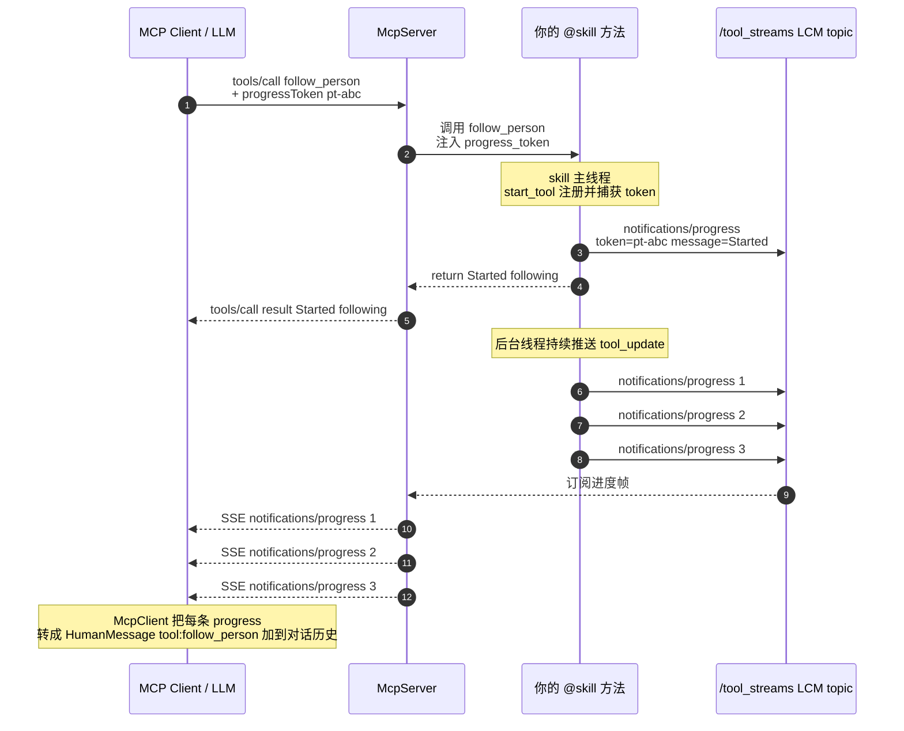

10 个步骤里值得记的 3 件事：

- **第 2 步注入 token**：`@skill` 装饰器有一个 thread-local 的 `_SKILL_CONTEXT`，被 MCP server 调用时 `params._meta.progressToken` 会塞进去，skill 内部用 `current_skill_context()` 读出来。
- **第 8/9/10 步走 LCM 而非直接走 socket**：因为 skill 通常跑在 worker 进程，而 `McpServer` 是单独一个 module，**进程间唯一可靠通道是 LCM**。所以 tool_stream 用 `pLCMTransport("/tool_streams")` 当中介。
- **第 11 步是 dimos 私有约定**：MCP 标准里 `notifications/progress` 没有 tool 名字字段；dimos 在 `_meta.tool_name` 里塞进去，让自家的 `McpClient` 能把进度路由成 `[tool:<name>] message` 形式的 HumanMessage。外部客户端看不懂这个 `_meta` 时直接忽略。

## 4.3 三件套：`start_tool` / `tool_update` / `stop_tool`

只有这 3 个方法是用户面：

```python
import time
from threading import Thread

from dimos.agents.annotation import skill
from dimos.core.module import Module


class FollowPerson(Module):
    @skill
    def follow_person(self, person_id: int) -> str:
        """Follow the given person until they go out of sight."""
        self.start_tool("follow_person")

        def _loop():
            try:
                for i in range(60):
                    time.sleep(1.0)
                    target_dist = self._track(person_id)
                    self.tool_update(
                        "follow_person",
                        f"step {i}: distance={target_dist:.2f}m"
                    )
            finally:
                self.stop_tool("follow_person")

        Thread(target=_loop, daemon=True).start()
        return "Started following"
```

LLM 端会先看到 `Started following`，然后每秒看到一条 `[tool:follow_person] step k: distance=...` 的 user message，可以根据这些消息推理"是不是该停下来" / "是不是要切到别的 skill"。

## 4.4 三条铁律（违反会 raise）

来自 `tool_stream.py` docstring：

| 规则 | 违反时的现象 |
|---|---|
| `start_tool` 必须在 skill 主线程上调用 | `RuntimeError: ToolStream must be constructed inside a @skill call`，因为 `current_skill_context()` 只在 skill 主线程能拿到 |
| 同一个 module 上 `start_tool("x")` 不能并发开两次 | `RuntimeError: Tool 'x' is already active` |
| `tool_update` / `stop_tool` 是线程安全的 | OK，背景 worker 可以随便发 update |

## 4.5 配合 async skill

如果 skill 是 `@skill async def`，LLM 通信的注入仍然有效（看 `dimos/agents/annotation.py:42-71`）：

```python
@skill
async def go_to(self, x: float, y: float) -> str:
    """Walk to a 2D location."""
    self.start_tool("go_to")
    try:
        async for status in self._navigator.execute_with_status(x, y):
            self.tool_update("go_to", status)
        return f"Arrived at {x},{y}"
    finally:
        self.stop_tool("go_to")
```

## 4.6 端口与协议（不写代码也能调）

- **LCM topic**：`/tool_streams`（`TOOL_STREAM_TOPIC` 常量）
- **MCP 方法**：有 `progressToken` 时用 `notifications/progress`，没有时退回 `notifications/message`（log 帧）。
- **HTTP 端口**：MCP server 默认 9990 (`GlobalConfig.mcp_port`)，进度通过 `GET /mcp` 的 SSE 连接推送。

curl 示例（不带 progressToken，会落到 log 帧）：

```bash
curl -N http://localhost:9990/mcp
```

这条 SSE 连接一开就持续接收 `notifications/message` 帧，可以用来旁观系统正在干什么。

---

# 五、G1 全身控制 — 29-DOF 人形低层接入

> PR：#1954 · commit `89adbcb5e` · 主要改动：新增 `dimos/hardware/whole_body/`、`G1WholeBodyConnection`、`unitree-g1-coordinator` blueprint、`scripts/g1_replay.py`、29-DOF MotorCommandArray 消息类型。

## 5.1 问题：原来的 G1 stack 缺了什么

之前 dimos 上的 G1 走的是 **sport-mode**：发 Twist (vx, vy, wz) 给 Unitree 自家的高层步态控制器，机器人自己解算腿部动作。这套接口好处是开箱即用，缺点是：

- 上半身（腰 3-DOF + 双臂 14-DOF）**完全没接口**
- 不能跑自己的 wholebody 学习策略
- 不能从仿真到真机迁移 RL 策略
- 不能做精细的 IK 任务（伸手抓东西）

要解决这些，必须直接发 `motor_cmd[i].q/dq/kp/kd/tau` 共 29 个关节的低层指令，并接收 `motor_state[i]` + `imu_state` 的反馈。

## 5.2 答案：3 层架构 + 1 个新 spec

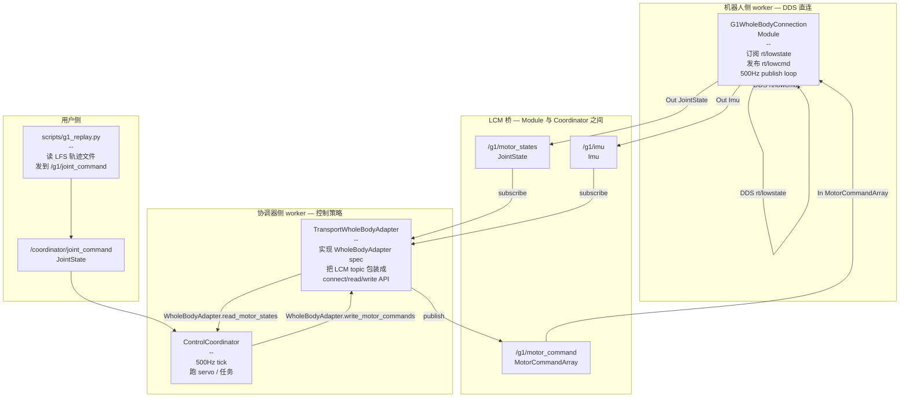

3 层各司其职：

| 层 | 文件 | 职责 |
|---|---|---|
| **Connection 层** | `dimos/robot/unitree/g1/wholebody_connection.py` | 唯一摸 DDS 的人。29 个电机 → JointState，IMU → Imu。订阅 LCM 命令转回 DDS。 |
| **Adapter 层** | `dimos/hardware/whole_body/transport/adapter.py` | 实现 `WholeBodyAdapter` spec。可被 `ControlCoordinator` 当成普通硬件。 |
| **Coordinator 层** | `dimos/control/coordinator.py`（增强） | 现在认识 `HardwareType.WHOLE_BODY`，500Hz tick 跑 servo / 学习策略 / IK。 |

## 5.3 新 spec：WholeBodyAdapter

参考 `dimos/hardware/whole_body/spec.py`：

```python
@dataclass(frozen=True)
class MotorCommand:
    q: float = POS_STOP    # target position (rad)
    dq: float = VEL_STOP   # target velocity (rad/s)
    kp: float = 0.0        # position gain
    kd: float = 0.0        # velocity gain
    tau: float = 0.0       # feedforward torque (Nm)


@runtime_checkable
class WholeBodyAdapter(Protocol):
    def connect(self) -> bool: ...
    def disconnect(self) -> None: ...
    def is_connected(self) -> bool: ...
    def read_motor_states(self) -> list[MotorState]: ...
    def has_motor_states(self) -> bool: ...
    def read_imu(self) -> IMUState: ...
    def write_motor_commands(self, commands: list[MotorCommand]) -> bool: ...
```

未来其它人形（Apptronik、Tesla Optimus、UC Berkeley 等）只要实现这 7 个方法就能接入。`registry.py` 通过 auto-discovery 找到所有 adapter，叫 `unitree_g1`、`transport_lcm` 等名字。

## 5.4 29-DOF 关节顺序约定

`make_humanoid_joints("g1")` 返回固定顺序，**这是单一来源真值**：

| 索引区间 | 含义 | 例子 |
|---|---|---|
| 0-5 | 左腿 6-DOF | `g1/left_hip_pitch`、`g1/left_hip_roll`、…、`g1/left_ankle_roll` |
| 6-11 | 右腿 6-DOF | `g1/right_hip_pitch`、… |
| 12-14 | 腰 3-DOF | `g1/waist_yaw`、`g1/waist_roll`、`g1/waist_pitch` |
| 15-21 | 左臂 7-DOF | `g1/left_shoulder_pitch`、…、`g1/left_wrist_yaw` |
| 22-28 | 右臂 7-DOF | `g1/right_shoulder_pitch`、…、`g1/right_wrist_yaw` |

注意 G1 的硬件 LowCmd 实际有 35 个 motor slot，dimos 只用前 29 个；`mode_machine` 字段是从第一帧 LowState 读出来再回写到每个 LowCmd（G1 固件要求）。

## 5.5 端到端跑一次：g1_replay.py

`scripts/g1_replay.py` 是这个新 stack 的 demo：从 LFS 拉 `g1_wholebody_replay.json` 轨迹，回放到运行中的 coordinator。

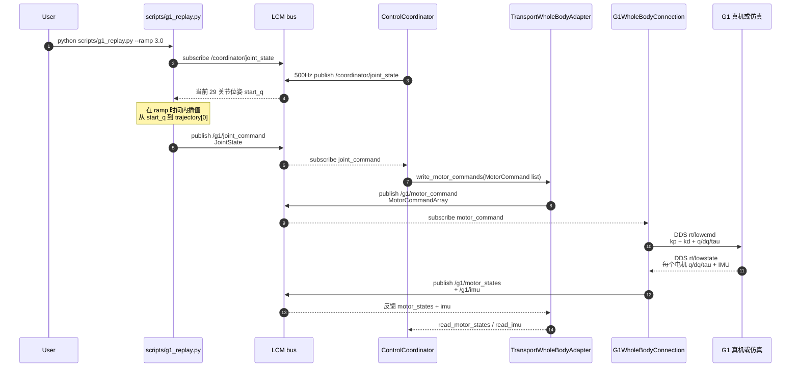

跑起来只要两个终端：

```bash
# 终端 1：启动 coordinator
ROBOT_INTERFACE=enp4s0 dimos run unitree-g1-coordinator

# 终端 2：回放轨迹
python scripts/g1_replay.py --ramp 3.0
```

**`--ramp 3.0` 的作用**：先把当前真机姿态在 3 秒内平滑插值到轨迹的第 0 帧，避免一上来 29 个关节同时跳跃。

## 5.6 安全性细节

- **`POS_STOP = 2.146e9`、`VEL_STOP = 16000.0`**：Unitree 哨兵值，写入 motor_cmd 表示"这个 DOF 不命令"。`G1WholeBodyConnection.start()` 默认所有 motor_cmd 都是 POS_STOP + 0 增益，确保启动到第一条命令到达期间不会乱抖。
- **`release_sport_mode=True`**：调 `MotionSwitcherClient.ReleaseMode()` 直到没有任何高层控制器在跑，**否则低层命令会被高层 stomping 覆盖**。
- **`mode_machine` 同步**：必须从第一帧 LowState 读出来回写到 LowCmd，否则 G1 固件拒收。

---

# 六、OpenArm 集成 — 第一个无 SDK 双臂研究平台

> PR：#1897 · commit `884e7ed02`（最新一条）· 主要改动：新增 14 个文件、~2500 行代码、24 个单元测试、`docs/capabilities/manipulation/openarm_integration.md` 完整说明书。

## 6.1 它和别的臂有什么不一样？

| 臂 | 传输 | Python SDK |
|---|---|---|
| xArm | TCP/IP | `xarm-python-sdk` |
| Piper | CAN（经 SDK） | `piper_sdk` |
| R1 Pro | Galaxea | Galaxea SDK |
| Go2 / G1 | WebRTC / DDS | Unitree SDK |
| Panda | FCI | `panda-py` |
| **OpenArm** | **裸 SocketCAN** | **没有** |

**OpenArm 是开源臂，零 SDK。**唯一接口是 SocketCAN 上跑的 Damiao MIT-mode 协议（每帧 8 字节 bit-packed `q[16] | dq[12] | kp[12] | kd[12] | tau[12]`）。所以 dimos 这次做的事是：**完整从零写了一个驱动 + 适配器 + 7 个 blueprint + 文档**。它的设计方式之后会变成"接入新臂"的范式。

## 6.2 6 层架构

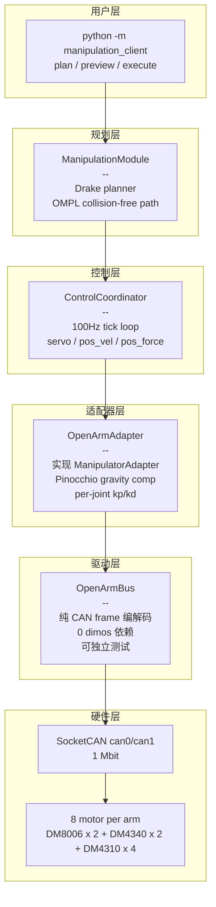

**亮点：driver 与 adapter 分离**。`driver.py` 没有任何 dimos 依赖，可以拿 `can.Bus(interface="virtual")` 做 loopback 单元测试，13 个测试全跑过。这意味着如果有人想脱离 dimos 用 OpenArm，复制 `driver.py` 一个文件就能用。

## 6.3 7 个新 blueprint

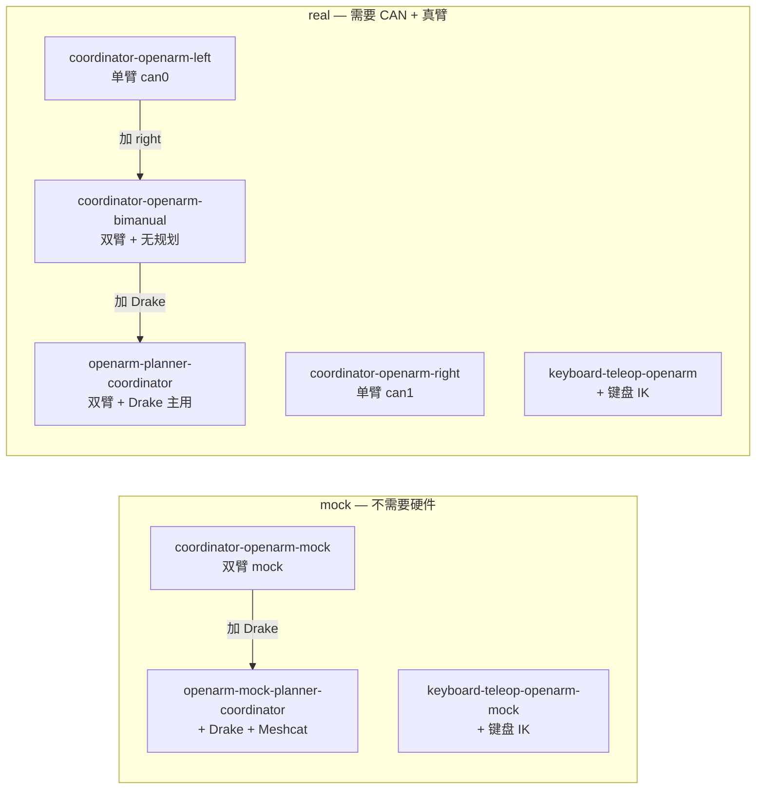

7 个 blueprint 推荐的"开机顺序"是 `mock-planner → 单臂 → 双臂`：先用 mock 验证连线，再上单臂，再双臂；每一步失败回退一步。

## 6.4 Quick start 5 步

第 1 步——bring up CAN 总线：

```bash
sudo ./dimos/robot/manipulators/openarm/scripts/openarm_can_up.sh can0 can1
```

第 2 步——验证 16 个电机能正常回话：

```bash
python ./dimos/robot/manipulators/openarm/scripts/openarm_can_probe.py --channel can0
python ./dimos/robot/manipulators/openarm/scripts/openarm_can_probe.py --channel can1
```

预期输出：每条总线上 `8/8 motors replied`，转子温度 25-30 °C。

第 3 步（首次）——把所有电机切到 MIT 模式（`CTRL_MODE=MIT`，写一次永久生效）：

```bash
python ./dimos/robot/manipulators/openarm/scripts/openarm_set_mit_mode.py --channel can0
python ./dimos/robot/manipulators/openarm/scripts/openarm_set_mit_mode.py --channel can1
```

之后每次 `connect()` 也会自动写一遍（idempotent）。如果跳过这步且电机没在 MIT 模式，会出现 **"motor 回 probe 但不动"** 的诡异现象（因为电机会忽略 MIT 帧）。

第 4 步——跑 blueprint。第一次推荐 mock：

```bash
dimos run openarm-mock-planner-coordinator
```

Meshcat 自动开在 [http://localhost:7000](http://localhost:7000)。

第 5 步——开 REPL 客户端控制双臂：

```bash
python -i -m dimos.manipulation.planning.examples.manipulation_client
```

```python
>>> robots()
['left_arm', 'right_arm']
>>> joints("left_arm")
[0.02, -0.01, -0.13, 0.15, 0.17, -0.07, 0.10]
>>> plan([0.3, 0, 0, 0, 0, 0, 0], "left_arm") and preview("left_arm") and execute("left_arm")
True
>>> plan_pose(0.1, 0.3, 0.5, "left_arm") and execute("left_arm")
True
```

`plan / preview / execute` 用 `and` 链起来——任何一步返回 False 就短路停下，避免在 `FAULT` 状态下还往硬件发命令。

## 6.5 关键配置参数

| 配置 | 默认 | 文件 | 含义 |
|---|---|---|---|
| `LEFT_CAN` / `RIGHT_CAN` | `can1` / `can0` | `dimos/robot/manipulators/openarm/blueprints.py` | 哪个 CAN 接口对应哪只手；arms swap 时翻这个 |
| `_DEFAULT_KP` | `[100, 100, 80, 80, 60, 60, 60]` | `adapter.py` | 7 个关节的位置增益。肩>肘>腕；过大震荡 |
| `_DEFAULT_KD` | `[1.5, 1.5, 1.0, 1.0, 0.8, 0.8, 0.8]` | `adapter.py` | 阻尼。>2 会出现高频蜂鸣 |
| `gravity_comp` | `True` | `adapter.py` | Pinocchio 计算 G(q)，不用拉高 kp 也能稳态保持 |
| `AUTO_SET_MIT_MODE` | `True` | `blueprints.py` | 每次 connect 写一次 MIT 模式（幂等） |
| `OPENARM_COLLISION_EXCLUSIONS` | URDF 中给定 | `dimos/robot/catalog/openarm.py` | link5 link7 mesh 重叠 3mm，规划时排除碰撞 |

## 6.6 一个新增的通用工具：workspace.py

`dimos/utils/workspace.py` 是 OpenArm 集成顺手做的，但和 OpenArm 无关——**对任意 URDF 都能用**。它提供 4 种用法：

| 命令 | 用途 |
|---|---|
| `python -m dimos.utils.workspace <urdf>` | 可视化整个工作空间为彩色点云（颜色 = Yoshikawa 可操纵性指数） |
| `python -m dimos.utils.workspace <urdf> query x y z` | 查询某点能不能到达 |
| `python -m dimos.utils.workspace <urdf> suggest x y z` | 列出该点附近能到达的姿态，按可操纵性排序 |
| `python -m dimos.utils.workspace <urdf> interactive` | 交互式：可视化 + 输入坐标查询 |

绿色 = 灵活，红色 = 接近奇异。规划时**避开红色区域**，IK 才容易收敛。

## 6.7 Damiao 协议要点（写驱动才需要）

只有一帧最关键——MIT 控制帧（8 字节 bit-packed）：

```
bit layout: q[16] | dq[12] | kp[12] | kd[12] | tau[12]

float_to_uint(x, lo, hi, bits):
    return clamp((x - lo) / (hi - lo) * ((1 << bits) - 1))
```

钳位范围：`kp ∈ [0, 500]`、`kd ∈ [0, 5]`，`q/dq/tau` 范围按 motor 型号（DM8006 / DM4340 / DM4310 各异），见 `docs/capabilities/manipulation/openarm_integration.md` 的"Motor mapping"表。

---

# 七、其它新功能合集

## 7.1 MuJoCo Sim teleop — 不用真机也能 VR 摇臂（#1958）

PR #1958 给 xArm6/xArm7/Piper 三种臂在 **MuJoCo 仿真中** 加上了 Quest VR 遥操作。新增 7 个 blueprint：

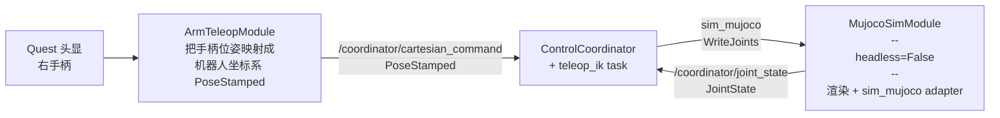

启动一行命令：

```bash
dimos run teleop-quest-xarm7-sim   # XArm7
dimos run teleop-quest-xarm6-sim   # XArm6
dimos run teleop-quest-piper-sim   # Piper
```

**核心机制**：`coordinator_teleop_sim_xarm7` 这种新增 blueprint 把 `MujocoSimModule` autoconnect 到了 `ControlCoordinator`，`ControlCoordinator` 看到 `adapter_type="sim_mujoco"` 时不去连真机的 TCP/CAN，而是直接读写 mujoco 模型的关节。其余路径（teleop IK、夹爪等）和真机一致，所以**用真机时改一行 `adapter_type` 就行**。

适用场景：

- 没买真机但想验证 IK / 控制器
- 真机调试间歇期想跑 dual-arm 实验
- 录制 demonstrations 给 imitation learning

## 7.2 `peek_stream` — 一行抓任意流的下一帧（#1909）

`Dimos.peek_stream(name, timeout=1.0)` 让你在写脚本 / 调试时能"瞄一眼"任何模块的输出流，不用写 subscriber。

```python
from dimos import Dimos

app = Dimos.connect()  # 接到正在跑的 daemon

img = app.peek_stream("color_image", 1.0)
print(type(img), img.shape, img.format)

import cv2, numpy as np
cv2.imshow("color_image", np.array(img.data))
cv2.waitKey(0)
```

实现细节：

- 遍历所有正在跑的 module，看哪个 module 的 `inputs` 或 `outputs` 里有同名流
- 找到就调远端 `stream.get_next(timeout)` 阻塞等
- timeout 内部限制为 25 秒（rpyc 同步请求超时上限）
- `np.array(img.data)` 这步必须做，因为 `img.data` 是 RPyC 代理对象，cv2 检查 type 会报错

## 7.3 `dtop` 子进程 CPU + `dtop-plot` 离线绘图（#1880）

`dtop`（dimos top）原来只显示 worker 自身 CPU。**现在能展开看每个 worker 的子进程**——比如某 worker 启了一个 ffmpeg 或者 rerun viewer，子进程吃了 80% CPU 你以前看不到，现在能看到。

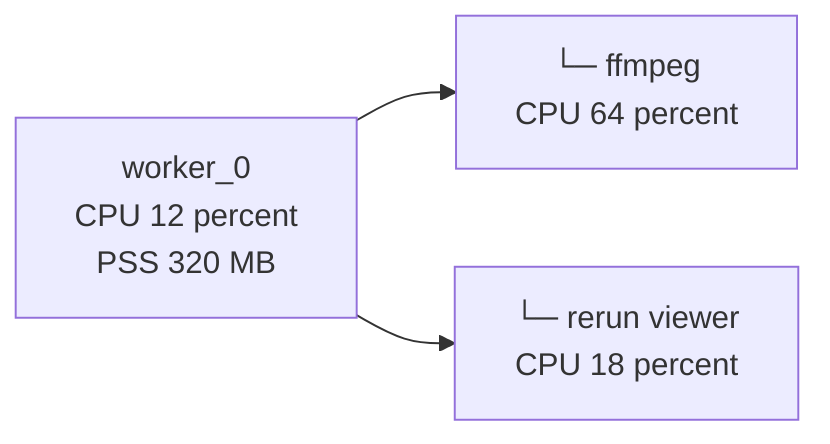

新工具 `dtop-plot`：把 dtop 录制的 jsonl 离线画成 PNG 曲线图。

```bash
# 先录一段
dimos top --jsonl /tmp/run.jsonl

# 之后离线分析
dtop-plot /tmp/run.jsonl --metrics cpu_percent,pss,num_threads
# 默认输出 /tmp/run.ignore.png
```

支持的指标：`cpu_percent`、`pss`、`num_threads`、`num_children`、`num_fds`、`cpu_time_user`、`cpu_time_system`、`cpu_time_iowait`、`io_read_bytes`、`io_write_bytes`。

适合性能 regress 排查、对比实验、给 PR 附图证明"我没让 CPU 涨"。

## 7.4 PatrollingModule 改成 async（#1939）

巡逻模块原来用 `asyncio.run()` + 大量手动 `Lock`，PR #1939 把它彻底改写成 dimos 的 async-module 范式：

| 旧 | 新 |
|---|---|
| `def _on_odom(self, msg)` | `async def handle_odom(self, msg)` |
| `def _on_global_costmap(self, msg)` | `async def handle_global_costmap(self, msg)` |
| `threading.Event() / threading.Lock()` | `asyncio.Event()`，无锁 |
| `start_patrol` 用 `asyncio.run_coroutine_threadsafe` | `@skill async def start_patrol`，直接 `asyncio.create_task` |

对外接口（`start_patrol` / `stop_patrol` / `is_patrolling`）完全没变。如果你只是用，不需要改任何代码。

## 7.5 `setup_logger` 强制（#1895）

PR #1895 加了一个 unit test `dimos/project/test_get_logger.py`，**扫整个 dimos 目录**，发现任何文件用了 `= logging.getLogger` 就 fail（白名单除外）。

```python
# ❌ 被拦
import logging
logger = logging.getLogger(__name__)

# ✅ 通过
from dimos.utils.logging_config import setup_logger
logger = setup_logger()
```

为什么？`setup_logger()` 会自动接好 dimos 的 structured-log 格式 + per-run 文件输出 + structlog 上下文绑定。直接用 stdlib `logging.getLogger()` 拿不到这些。

迁移工作量很小，机械替换：

```bash
rg -l '= logging.getLogger' dimos/
# 逐个文件替换 import 和那一行
```

如果是合理的特例（standalone 脚本、第三方 logger 抑制），加到 `WHITELIST` 里。

---

# 八、修复与撤销

## 8.1 memory2 + Go2 autorecorder 修复（#1925）

3 个相关改动：

**1) `Recorder` 在 replay 模式下不开自动录像**

之前的 bug：`unitree-go2-spatial` 这种 blueprint 默认带 `Recorder` 模块自动写 SQLite。replay 模式下也会写，污染 LFS 数据库。

```python
# dimos/memory2/module.py
class Recorder(MemoryModule):
    def start(self):
        super().start()
        if self.config.g.replay:
            logger.info("Replay mode active — Recorder disabled")
            return
        ...
```

**2) `Image.to_jpeg` / `from_jpeg` 统一走 RGB**

之前的接口里：
- `to_jpeg()` 内部把图像 `to_bgr()` 之后再编码 → 编码出来的 JPEG 字节里像素是 BGR 顺序
- `from_jpeg()` 解码后得到 `ImageFormat.BGR`

这意味着 **同一帧图像编码后再解码，dimos 内部认为它从 RGB 变成 BGR 了**——下游 detection 模型收到 BGR 输入会出错。

修复：统一走 RGB（用 turbojpeg 的 `TJPF_RGB`）：

```python
# 编码
rgb_array = self.to_rgb().data
jpeg_data = jpeg.encode(rgb_array, quality=quality, pixel_format=TJPF_RGB)

# 解码
rgb_array = jpeg.decode(msg.data, pixel_format=TJPF_RGB)
return cls(data=rgb_array, format=ImageFormat.RGB, ...)
```

**这是一个轻微的破坏性改动**：如果你有以前生成的 JPEG 字节缓存（assume 解出来是 BGR），现在会得到 RGB；要么重新生成、要么解码后 `to_bgr()`。

**3) Go2 ReplayConnection 切换数据集**

```python
# dimos/robot/unitree/go2/connection.py
class ReplayConnection:
    def __init__(self, dataset: str = "go2_china_office", ...):
        self.dataset = dataset
        ...
```

旧默认是 `go2_bigoffice`，现在是 `go2_china_office`（数据集已加进 LFS）。`Image` 也加了 alpha 通道丢弃的 warning，提醒你 RGBA→RGB 时丢了 alpha。

**4) `Go2Memory` 加 `odom: In[PoseStamped]`**

为了让录制带上里程计：

```python
class Go2Memory(Recorder):
    color_image: In[Image]
    lidar: In[PointCloud2]
    odom: In[PoseStamped]   # 新增
```

## 8.2 Revert "Jeff/fix/rconnect2"（#1924）

PR #1924 撤销了之前 PR `Jeff/fix/rconnect2`（rconnect2 是某种重连优化）。回到撤销前的状态意味着：

- `dimos/utils/generic.py` 中的 helper 删了 17 行
- `dimos/visualization/rerun/bridge.py` 改回旧实现
- `dimos/navigation/replanning_a_star/module.py` 等多个文件回退

Revert 的原因 commit message 没说，但既然合并到 dev 了，说明 #1924 之前的实现引入了问题。**用过那块代码的人需要知道 API/行为有回退**。

## 8.3 CI 维护

| PR | 改动 | 影响 |
|---|---|---|
| #1944 | `test_stream.py` 等 3 个文件加 macOS skip 标记 | macOS runner 上跑 fast tests 不再失败 |
| #1948 | `code-cleanup.yml` 加 `runs-on: ubuntu-latest` | 防止 macOS runner 跑 ruff format 慢 + 输出不一致 |

---

# 九、升级注意事项 — 老代码该改什么

## 9.1 一图概览：升级风险点

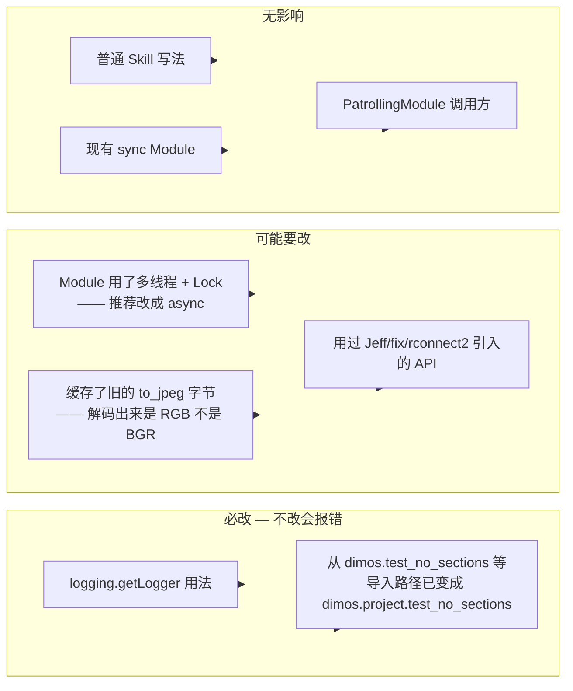

## 9.2 必改

**(a) `logging.getLogger` → `setup_logger`**

```bash
rg -l '= logging.getLogger' dimos/ --type py
```

逐个替换：

```python
# 改前
import logging
logger = logging.getLogger(__name__)

# 改后
from dimos.utils.logging_config import setup_logger
logger = setup_logger()
```

不改的话 unit test `dimos/project/test_get_logger.py` fail。

**(b) test 文件位置变化**

如果你有代码 import：
- `dimos.test_no_sections` → 改为 `dimos.project.test_no_sections`
- `dimos.test_no_init_files` → 改为 `dimos.project.test_no_init_files`

## 9.3 强烈建议改

**(c) 把多线程 Module 改成 async-first**

如果你的 Module 长这样：

```python
class MyModule(Module):
    def __init__(self, ...):
        self._state_lock = threading.Lock()
        self._state = ...

    def _on_input_a(self, msg):
        with self._state_lock:
            self._state.do(msg)
```

强烈建议改成：

```python
class MyModule(Module):
    def __init__(self, **kwargs):
        super().__init__(**kwargs)
        self._state = ...

    async def handle_input_a(self, msg) -> None:
        self._state.do(msg)
```

短的代码、零锁、零死锁可能。详见第三章。

**(d) JPEG 缓存重生成**

如果你有持久化的 `Image.to_jpeg()` 字节（比如存了一个 jpeg 缓存目录或 redis），用 `from_jpeg()` 解出来现在会得到 `ImageFormat.RGB` 而非 `ImageFormat.BGR`。下游若 hardcode 了 BGR：

```python
# 兼容旧字节最稳的一招
img = Image.from_jpeg(old_bytes).to_bgr()
```

或者重新生成所有缓存（推荐，未来代码更干净）。

## 9.4 LFS 新增文件

upstream/dev 引入了 3 个新 LFS 文件：

| 文件 | 用途 |
|---|---|
| `data/.lfs/g1_wholebody_replay.json.tar.gz` | `scripts/g1_replay.py` 默认轨迹 |
| `data/.lfs/openarm_description.tar.gz` | OpenArm URDF + meshes |
| `data/.lfs/go2_china_office.db.tar.gz` | Go2 replay 默认数据集 |

如果你之前 `git lfs pull` 过，且能访问 upstream LFS server，重新 `git lfs pull` 就好。如果你跟我们一样**internal 网络访问 upstream LFS 有问题**，merge 时 dimos `data/.lfs/*` 会留 LFS pointer，需要时再用 `git lfs pull --include data/.lfs/g1_wholebody_replay.json.tar.gz` 单独取（或换一个能访问的网络环境）。

## 9.5 `.gitignore` 调整

upstream 删掉了 `# Hidden/personal directories` 块，把 `.hidden/` 行也删了。如果你本地有自己的 `.hidden/` 用法，需要重新加回来。

我们工作分支的 `.gitignore` 在合并冲突时把 `.cursor/` 和 `.hidden/` 一起留下来了，参见末尾"基于 commit"。

---

# 十、参数 cheatsheet 与延伸阅读

## 10.1 想做什么 → 看哪里

| 想做的事 | 看哪 |
|---|---|
| 写一个新 Module，用 async | 第三章；`docs/usage/modules.md` 增补的 "Async modules (lock-free state)" 节 |
| 让 skill 边干活边把进度推回 LLM | 第四章；`docs/usage/tool_streams.md` |
| 跑 G1 wholebody 控制 | 第五章；`scripts/g1_replay.py` 注释 + `dimos/robot/unitree/g1/blueprints/basic/unitree_g1_coordinator.py` |
| 跑 OpenArm | 第六章；`docs/capabilities/manipulation/openarm_integration.md`（最权威） |
| 不用真机做 VR 摇臂 | 7.1；`teleop-quest-{xarm6,xarm7,piper}-sim` |
| 调试时抓某个流的下一帧 | 7.2；`Dimos.peek_stream(name, timeout)` |
| 看每个 worker 的子进程 CPU | 7.3；`dtop` 直接展开看；`dtop-plot <jsonl>` 离线画图 |
| 接入新硬件 arm | 6.2 的 6 层架构；driver 与 adapter 分离 |
| 接入新硬件 humanoid | 5.3；实现 `WholeBodyAdapter` 7 个方法即可 |
| 写 logger | `from dimos.utils.logging_config import setup_logger` |

## 10.2 13 个 PR 速查

| 想知道 | commit | PR |
|---|---|---|
| async modules 是怎么跑的 | `8e8e9278c` | #1920 |
| tool stream 协议 | `b507ce417` | #1713 |
| G1 wholebody 下沉到哪 | `89adbcb5e` | #1954 |
| OpenArm 集成全部代码 | `884e7ed02` | #1897 |
| MuJoCo sim teleop blueprint | `943936df6` | #1958 |
| `peek_stream` 入口 | `e72d1e353` | #1909 |
| dtop 子进程 CPU + dtop-plot | `4db959687` | #1880 |
| memory2 + JPEG fix | `427895b2b` | #1925 |
| patrol 改 async | `3bda85b9f` | #1939 |
| setup_logger 强制 | `21612595c` | #1895 |
| Revert rconnect2 | `5d329a57e` | #1924 |
| CI macOS skip | `747c53ac2` | #1944 |
| code-cleanup linux only | `d2f1cbc21` | #1948 |

## 10.3 端口与默认值

| 项 | 默认 | 来源 |
|---|---|---|
| MCP HTTP server | `9990` | `GlobalConfig.mcp_port` |
| Tool stream LCM topic | `/tool_streams` | `dimos/agents/mcp/tool_stream.py:46` |
| G1 关节命令 LCM topic | `/g1/joint_command` | `unitree_g1_coordinator.py` |
| G1 motor states 反馈 | `/g1/motor_states` | 同上 |
| G1 imu 反馈 | `/g1/imu` | 同上 |
| Coordinator joint state | `/coordinator/joint_state` | 各 coordinator blueprint |
| Coordinator cartesian cmd | `/coordinator/cartesian_command` | teleop blueprint |
| OpenArm CAN 速率 | 1 Mbit classical | `openarm_can_up.sh` |
| OpenArm 控制 tick | 100 Hz | `OpenArmAdapter` |
| G1 控制 tick | 500 Hz | `unitree_g1_coordinator` |

## 10.4 涉及的关键 spec / 协议

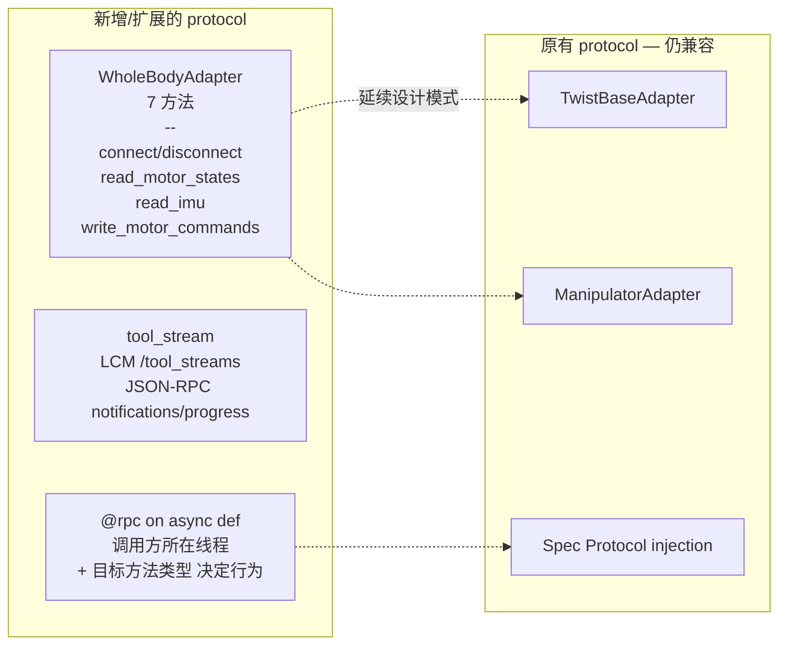

## 10.5 LFS / 环境

升级之后建议跑一遍：

```bash
# 1. 看 LFS 文件状态
ls -la data/.lfs/ | grep openarm
ls -la data/.lfs/ | grep g1_wholebody
ls -la data/.lfs/ | grep go2_china_office

# 2. 同步依赖（升级有可能改了 pyproject.toml）
uv sync --all-extras --no-extra dds

# 3. 跑 fast tests 确保 setup 正常
uv run pytest -x

# 4. 看自动生成 blueprint 是否最新
pytest dimos/robot/test_all_blueprints_generation.py
```

## 10.6 进一步阅读

文档：

- `docs/usage/modules.md` — 增补了 "Async modules (lock-free state)" 章节
- `docs/usage/tool_streams.md` — tool stream 完整说明
- `docs/usage/python-api.md` — `peek_stream` 用法
- `docs/capabilities/manipulation/openarm_integration.md` — OpenArm 完整说明书
- `dimos/robot/unitree/g1/wholebody_connection.py` — G1 wholebody 实现
- `scripts/g1_replay.py` — G1 端到端演示脚本

PR 链接（Github）：

```
upstream/dev 的 13 个 PR 编号：
#1924 #1920 #1895 #1909 #1944 #1948 #1925 #1939 #1713 #1954 #1958 #1880 #1897
```

---

> **本文档基于 dimos commit `884e7ed02`**（`Task: OpenArm Integration with DimOS`，#1897，2026-05-06）。
>
> 本地 `feat/jiangtao` 已 fast-forward 到此 commit；本地 `dev` 也同步更新到此 commit。
>
> LFS 文件因网络原因可能仍是 pointer，按需 `git lfs pull --include data/.lfs/<file>` 单独获取。
>
> 后续 dev 同步可能调整细节，但本文档涉及的核心架构（async modules、tool streams、WholeBodyAdapter spec、OpenArm 6 层架构）应保持稳定。

