# 深入理解 feat/semantic-nav-robust-loop — 语义导航与空间记忆

> 写给需要在 Go2/G1 上跑「自然语言导航」「房间记忆」「门/地标拓扑规划」的开发者；需要了解 dimos 模块/Blueprint 基础。
> 基于 dimos `feat/semantic-nav-robust-loop` 分支 commit `211e8f69`。

---

## 目录

- [一、通俗篇：语义导航是怎么回事](#一通俗篇语义导航是怎么回事)
- [二、总览：分支改动的 5 层架构](#二总览分支改动的-5-层架构)
- [三、空间记忆层 — 让机器人「记住去过哪」](#三空间记忆层--让机器人记住去过哪)
- [四、地标与拓扑层 — 让机器人「知道门在哪、怎么走」](#四地标与拓扑层--让机器人知道门在哪怎么走)
- [五、语义导航技能 — 让 LLM 说「去电脑」就能走](#五语义导航技能--让-llm-说去电脑就能走)
- [六、感知增强与 orbit 技能](#六感知增强与-orbit-技能)
- [七、端到端实战 — unitree-go2-spatial 完整链路](#七端到端实战--unitree-go2-spatial-完整链路)
- [八、扩展点和延伸阅读](#八扩展点和延伸阅读)

---

# 一、通俗篇：语义导航是怎么回事

> **这一章 0 代码、0 框架、0 dimos 类名**，只讲领域概念，让没接触过的人能跟上。

## 1.1 为什么需要语义导航？

传统机器人导航只能做两件事：

1. **坐标导航**：「去 (3.5, 2.1)」—— 人不知道坐标在哪。
2. **地图导航**：在 occupancy grid 上点一个目标 —— 需要 GUI，且目标必须是「空位」。

真实场景里，人说的是：

- 「去办公室」
- 「找到灭火器」
- 「去厨房门口」

这就需要 **语义导航**：把自然语言 → 机器人能执行的路径。

## 1.2 关键概念定义

| 概念 | 大白话 |
|------|--------|
| **空间记忆** | 机器人边走边拍照片，用 CLIP 向量存起来；以后问「厨房在哪」可以语义检索 |
| **地标记忆** | 把「门、房间、物体」的 3D 坐标 + 名字存成结构化记录 |
| **拓扑图** | 地标之间连边，规划「先过门 A 再过门 B」的粗路径 |
| **VLM** | 视觉大模型，看一帧图回答「图里有电脑吗？在哪？」 |
| **Fallback 链** | 一种方法找不到就试下一种，直到成功或全部失败 |

## 1.3 导航的几种层次

```
  用户说「去电脑」
        │
        ▼
  ┌─────────────────────────────────────────┐
  │ L1  tagged room   — CLIP 匹配已标记房间  │
  │ L2  in-frame      — VLM 在当前画面找 bbox │
  │ L3  landmark      — 地标记忆 + 拓扑路径   │
  │ L4  room sweep    — 逐房间 360° 扫描      │
  │ L5  vlm memory    — 对历史照片批量 VLM    │
  │ L6  clip map      — CLIP 语义地图检索     │
  └─────────────────────────────────────────┘
        │
        ▼
  局部规划器 + 运动控制 → 机器人走过去
```

> **第一个关键点**：这不是单一算法，而是 **6 层 fallback**，每层解决不同失败模式（房间级 / 物体级 / 跨房间）。

## 1.4 核心算法直观解释

**CLIP 语义匹配**（类比：给每张照片贴标签的搜索引擎）

- 机器人拍照 → CLIP 编码成 512 维向量 → 存入 ChromaDB
- 查询「厨房」→ 把文字也编码 → 找最近邻向量 → 得到当时机器人位置

**VLM 物体检测**（类比：让 GPT-4V 看照片圈出物体）

- 当前帧 → VLM 返回 JSON `[{"name":"电脑", ...}]` → 存为 landmark
- 导航时 VLM 在当前帧找 bbox → 2D 追踪 → 转成 3D 目标

**拓扑规划**（类比：地铁换乘图）

- 每个门/房间是一个站
- 距离 < 8m 的站之间连边
- A* 找最短路径 → 依次导航到每个 waypoint

## 1.5 控制 / 输出怎么落地

```
  navigate_with_text("电脑")
       → fallback 链命中 L3 landmark
       → TopologyGraph.shortest_path(当前位置, 电脑地标)
       → [门A, 走廊, 电脑] 三个 waypoint
       → 依次 set_goal → MovementManager → cmd_vel → 电机
       → 到达后可选 wave/sit/point
```

---

# 二、总览：分支改动的 5 层架构

> 本分支相对 `main` 共 **83 文件、+12029 / -214 行**，核心围绕「语义导航 + 空间记忆 + 鲁棒 fallback」。

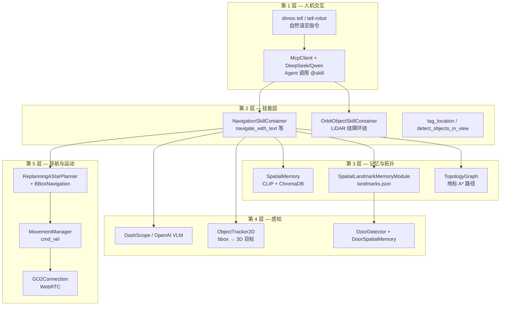

| 层 | 模块 | 输入 | 输出 |
|----|------|------|------|
| 交互 | `tell.py` / `tell_robot` | 用户自然语言 | LCM `/human_input` |
| 技能 | `NavigationSkillContainer` | query 字符串 | 导航结果 str |
| 记忆 | `SpatialMemory` | color_image + odom | CLIP 向量库 |
| 地标 | `SpatialLandmarkMemoryModule` | RPC record/query | `SpatialRecord` |
| 拓扑 | `TopologyGraph` | 地标集合 | waypoint 序列 |
| 感知 | VLM + `ObjectTracker2D` | Image | bbox / 物体名 |
| 导航 | `ReplanningAStarPlanner` | goal PoseStamped | cmd_vel |
| 硬件 | `GO2Connection` | cmd_vel | WebRTC 运动 |

## 2.1 分支 commit 时间线（核心功能）

| Commit | 内容 |
|--------|------|
| `9cc59b5c` | feat: spatial memory, door detection & embodied RAG |
| `46679b11` | feat: orbit_object skill — LiDAR wall-following |
| `35f36751` / `e36d4670` | 功能提交：navigate_with_text fallback 链完善 |
| `dc3e24c4` | perf: 长时运行 memory 上限（Chroma/VisualMemory） |
| `5fcde089` | fix: Codex review + CI lint |

---

# 三、空间记忆层 — 让机器人「记住去过哪」

## 3.1 第一站：SpatialMemory — CLIP 语义地图

文件：`dimos/perception/spatial_perception.py`

**问题**：机器人走过很多位置，如何按「语义」检索「厨房在哪」而不是记坐标？

**答案**：每帧图像 + 位姿 → CLIP embedding → ChromaDB 持久化；查询时用文字 embedding 做最近邻。

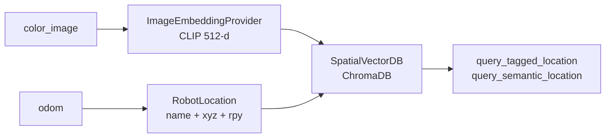

代码片段（配置默认值）：

```python
# dimos/perception/spatial_perception.py
class SpatialConfig(ModuleConfig):
    embedding_model: str = "clip"
    embedding_dimensions: int = 512
    min_distance_threshold: float = 0.01   # 米，太近不重复存
    min_time_threshold: float = 1.0        # 秒
    max_stored_frames: int = 500           # FIFO 上限
    max_room_images: int = 100             # 每房间参考图上限
    new_memory: bool = False               # True = 清空重建
```

| 字段 | 默认 | 含义 |
|------|------|------|
| `max_stored_frames` | 500 | 全局帧数 FIFO 上限，防内存泄漏 |
| `max_room_images` | 100 | 单房间参考图上限 |
| `min_distance_threshold` | 0.01m | 位移小于此值不存新帧 |
| `db_path` | `assets/output/memory/spatial_memory/chromadb_data` | Chroma 持久化目录 |

> **第二个关键点**：本分支加了 **Chroma 损坏自动 wipe 重建** 和 **帧数/房间图上限**，解决长时运行内存膨胀（PR #69）。

## 3.2 第二站：tag_location — 标记房间

**问题**：用户说「这是办公室」，机器人如何记住？

**答案**：`NavigationSkillContainer.tag_location(name, num_photos)`：

- `num_photos=0`：当前朝向拍 1 张
- `num_photos≥2`：原地 360° 均匀拍 N 张 → 存入 room reference images → VLM 扫描物体

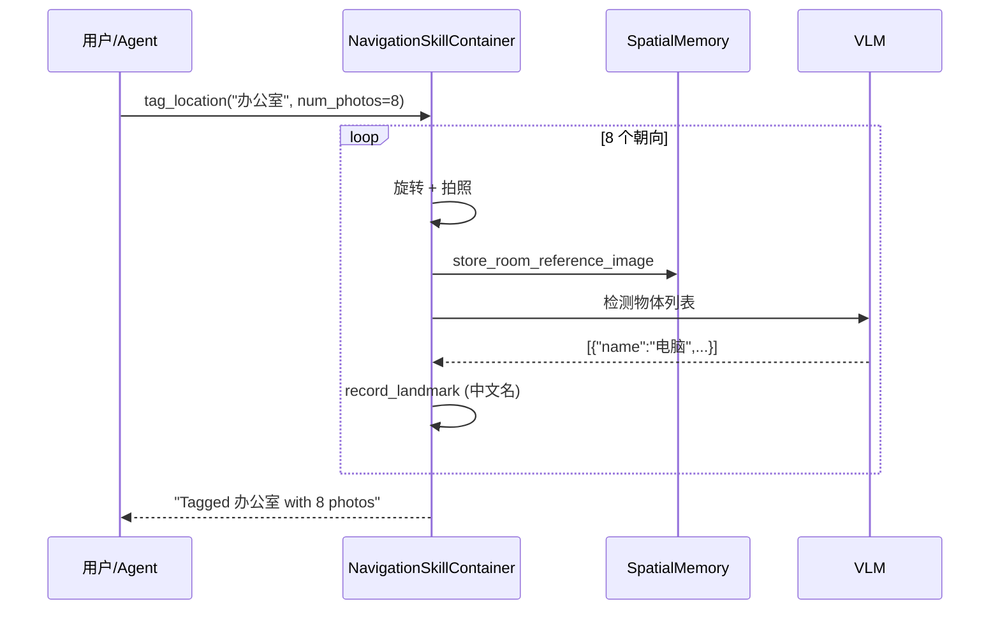

## 3.3 SpatialMemory 完整数据链

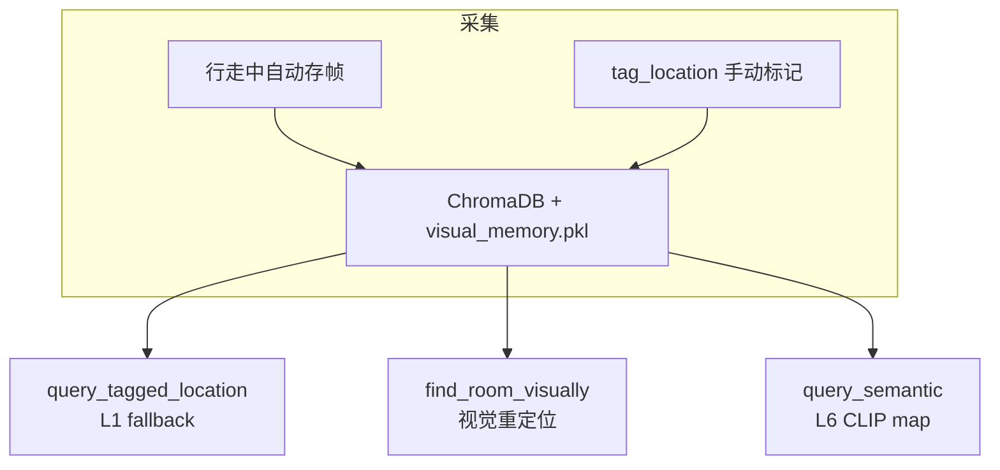

---

# 四、地标与拓扑层 — 让机器人「知道门在哪、怎么走」

## 4.1 第一站：SpatialRecord — 统一空间记录

文件：`dimos/types/spatial_record.py`

**问题**：原先只有「门」一种记录类型，无法表达房间、物体地标。

**答案**：统一 `SpatialRecord`，用 `RecordType` 区分：

| RecordType | 用途 | 典型 state |
|------------|------|------------|
| `DOOR` | 门 | open / closed |
| `ROOM` | 房间入口/中心 | — |
| `LANDMARK` | 物体/兴趣点 | — |
| `UNKNOWN` | 未分类 | — |

```python
@dataclass
class SpatialRecord:
    name: str = ""
    record_type: RecordType = RecordType.UNKNOWN
    position: tuple[float, float, float] = (0.0, 0.0, 0.0)
    rotation: tuple[float, float, float] = (0.0, 0.0, 0.0)
    record_id: str = field(default_factory=...)
    confidence: float = 0.0
    image_snapshot_path: str = ""
    state: str = ""          # 门：open/closed
    observation_count: int = 1
```

## 4.2 第二站：SpatialLandmarkMemoryModule — 持久化地标

文件：`dimos/perception/detection/door/door_spatial_memory_module.py`

**问题**：地标需要在 blueprint 里可注入、可 RPC 调用、可持久化。

**答案**：Module 包装 `SpatialLandmarkMemory`，数据存 `~/.local/state/dimos/landmark_memory/landmarks.json`。

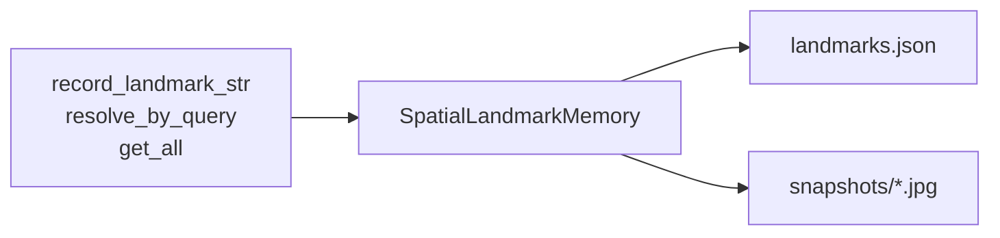

| RPC 方法 | 作用 |
|----------|------|
| `record_landmark_str(...)` | 写入/更新地标（RPC 安全，全 primitive 参数） |
| `resolve_by_query(name)` | 模糊匹配中文名 |
| `get_all()` | 返回全部记录供拓扑建图 |
| `deduplicate_nearby(...)` | 合并距离过近的重复地标 |

## 4.3 第三站：TopologyGraph — 粗粒度路径规划

文件：`dimos/navigation/topology.py`

**问题**：两个远距离地标之间，局部 A* 可能找不到路；需要「先过门 A 再过门 B」的粗规划。

**答案**：8m 内地标连边 → Dijkstra/A* → waypoint 序列 → 依次 `set_goal`。

```python
# dimos/navigation/topology.py
_MAX_EDGE_DISTANCE = 8.0

class TopologyGraph:
    def add_record(self, record: SpatialRecord) -> None: ...
    def shortest_path(self, sx, sy, gx, gy) -> list[SpatialRecord]: ...
```

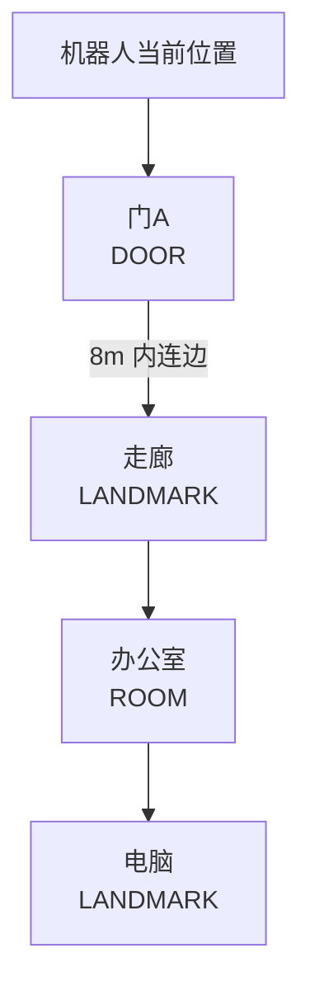

> **第三个关键点**：`navigate_to_landmark` 会先建 `TopologyGraph`，再 **逐 waypoint 等待到达**（`b99c7072 fix: wait for each topological waypoint`），避免「还没过门就设下一个目标」。

## 4.4 门检测链路

文件：`dimos/perception/detection/door/door_detector.py`、`door_spatial_memory.py`

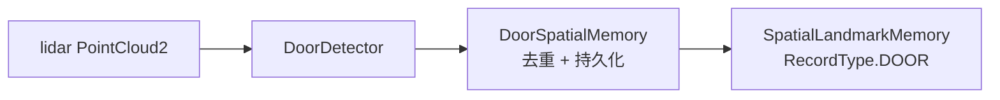

---

# 五、语义导航技能 — 让 LLM 说「去电脑」就能走

## 5.1 NavigationSkillContainer 架构

文件：`dimos/agents/skills/navigation.py`（+1829 行，本分支最大改动）

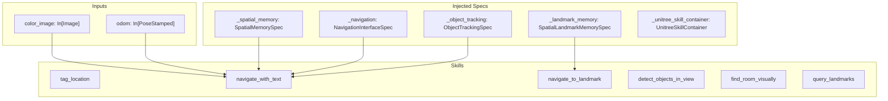

## 5.2 navigate_with_text — 六层 Fallback 链

**问题**：用户说「去电脑」，可能指房间、物体、或地标；单一策略必然失败。

**答案**：按 `DIMOS_NAV_FALLBACK` 环境变量排序，依次尝试直到命中。

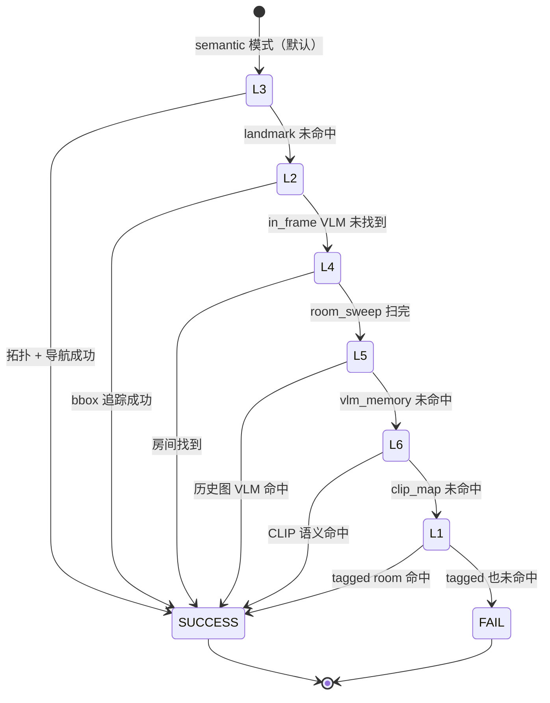

| 层级 | 名称 | 策略 | 典型场景 |
|------|------|------|----------|
| L3 | landmark | 地标记忆 + TopologyGraph | 「去电脑」（已 detect_objects 存过） |
| L2 | in_frame | VLM bbox + ObjectTracker2D | 电脑在当前视野内 |
| L4 | room_sweep | 逐 ROOM 360° 扫描 + VLM | 跨房间找物体 |
| L5 | vlm_memory | 对 SpatialMemory 历史图批量 VLM | 物体不在当前帧但在记忆里 |
| L6 | clip_map | CLIP 语义地图最近邻 | 模糊描述 |
| L1 | tagged | CLIP 匹配 tag_location 标记 | 「去办公室」 |

环境变量：

```bash
export DIMOS_NAV_FALLBACK=semantic    # 默认：landmark 优先
export DIMOS_NAV_FALLBACK=room_first  # tagged room 优先
```

## 5.3 VLM 集成 — 中文物体名

本分支新增 `dimos/models/vl/dashscope.py`（阿里云 DashScope），并强化 **中文名** 约束：

```python
_VLM_OBJECT_LIST_PROMPT = (
    "列出图中所有可单独指认的物体..."
    "【硬性要求】JSON 里每个 name 必须是 1–4 个汉字的中文名词。"
    "禁止英文：不要写 computer/desk/chair..."
)
```

英文 fallback 映射表 `_VLM_NAME_EN_TO_ZH` 把 `computer→电脑`、`monitor→显示器` 等常见误输出纠正回来。

## 5.4 navigate_to_landmark — 拓扑 + 视觉漂移校正

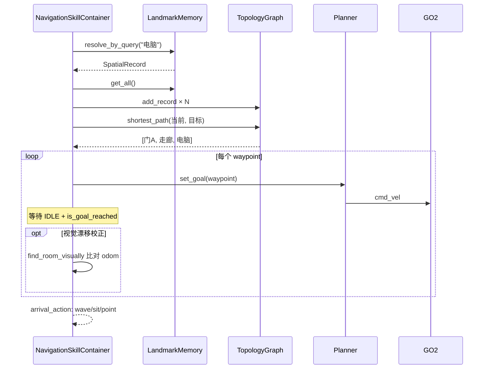

| 参数 | 默认 | 含义 |
|------|------|------|
| `arrival_action` | `stop` | 到达后：stop / sit / wave / point |
| `arrival_distance` | 0.5m | 站立距离 |
| `_drift_soft_m` | 0.3m | 软漂移阈值，触发重定位 |
| `_drift_hard_m` | 1.0m | 硬漂移，放弃导航 |
| `_relocalize_interval_s` | 3.0s | 重定位间隔 |

## 5.5 导航技能完整链

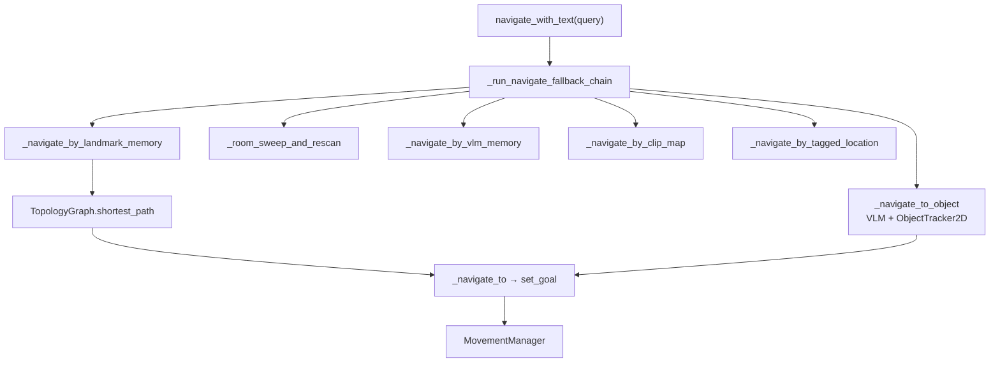

---

# 六、感知增强与 orbit 技能

## 6.1 OrbitObjectSkillContainer — LiDAR 绕障环绕

文件：`dimos/agents/skills/orbit_object.py`（+508 行，新文件）

**问题**：需要围绕某个障碍物/物体走一圈（巡检、环视）。

**答案**：从 `OccupancyGrid` 提取最近 occupied 边缘 → 沿切线方向 wall-following → 发布 `cmd_vel`。

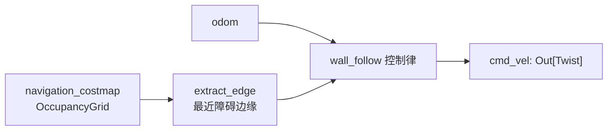

```python
@skill
def orbit_object(
    self,
    direction: str = "clockwise",
    duration: float = 30.0,
    standoff_distance: float = 0.8,
) -> str:
    """Orbit around the nearest obstacle edge detected in the costmap."""
```

文档：`docs/development/orbit_object.md`（519 行详细说明）

## 6.2 unitree_go2_spatial Blueprint 变化

文件：`dimos/robot/unitree/go2/blueprints/smart/unitree_go2_spatial.py`

```python
unitree_go2_spatial = (
    autoconnect(
        unitree_go2,                              # 基础导航栈
        SpatialMemory.blueprint(new_memory=...),
        SpatialLandmarkMemoryModule.blueprint(),  # 新增
        ObjectTracker2D.blueprint(frame_id="camera_link"),
        BBoxNavigationModule.blueprint(),
        PerceiveLoopSkill.blueprint(),
        SecurityModule.blueprint(...),
    )
    .remappings([(BBoxNavigationModule, "detection2d", "detection2darray")])
    .global_config(n_workers=8)
)
```

## 6.3 新增 Agentic Blueprint

| Blueprint | LLM 后端 |
|-----------|----------|
| `unitree-go2-agentic-deepseek` | DeepSeek |
| `unitree-go2-agentic-qwen-mlx` | Qwen MLX 本地 |
| `unitree-g1-agentic-deepseek` | DeepSeek |
| `unitree-g1-agentic-sim-deepseek` | DeepSeek + MuJoCo sim |

## 6.4 tell / tell-robot CLI

文件：`dimos/robot/cli/tell.py`、`dimos/utils/cli/tell_robot.py`

```bash
# 向运行中的 agent 发自然语言，同步等待回复
dimos tell "去办公室找电脑"
tell-robot "tag this location as kitchen"
```

底层：LCM `/human_input` 发布 → 订阅 `/agent` + `/agent_idle` 流式打印 LangChain 消息。

---

# 七、端到端实战 — unitree-go2-spatial 完整链路

## 7.1 启动命令 + Blueprint 拓扑

```bash
# 1. 启动 spatial 栈（含导航 + 记忆 + 追踪）
dimos run unitree-go2-spatial --robot-ip <GO2_IP>

# 2. 另开终端，启动 agentic（含 NavigationSkillContainer）
dimos run unitree-go2-agentic-deepseek --daemon

# 3. 发指令
dimos tell "先标记这里为办公室，然后去找电脑"
```

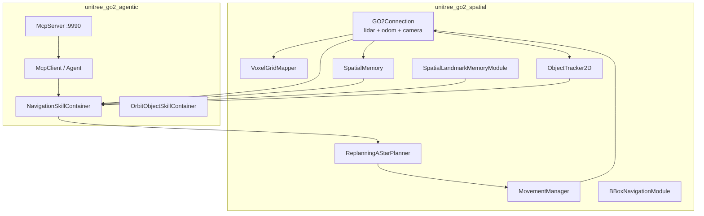

## 7.2 一次完整「去电脑」时序

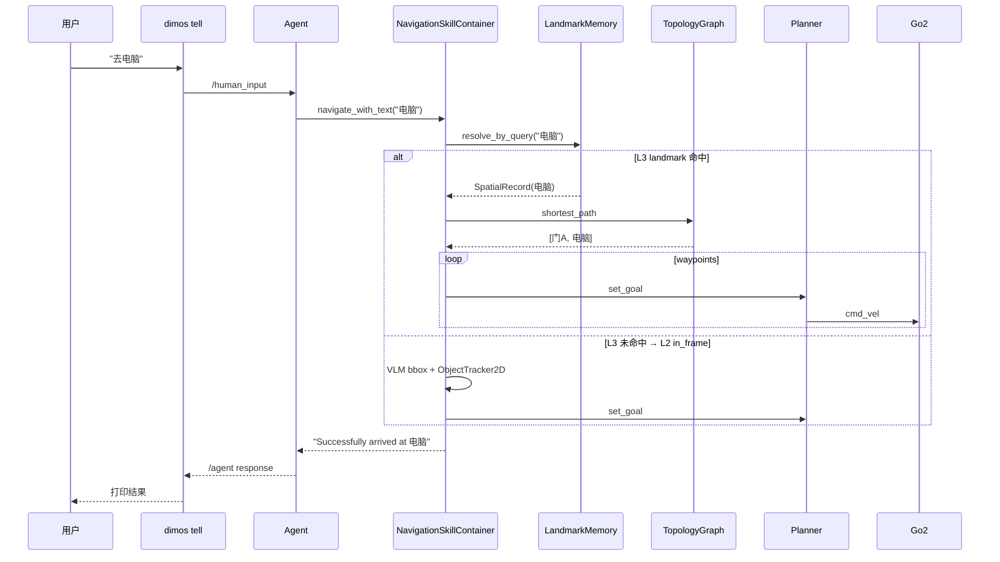

## 7.3 Agent 典型工具调用链

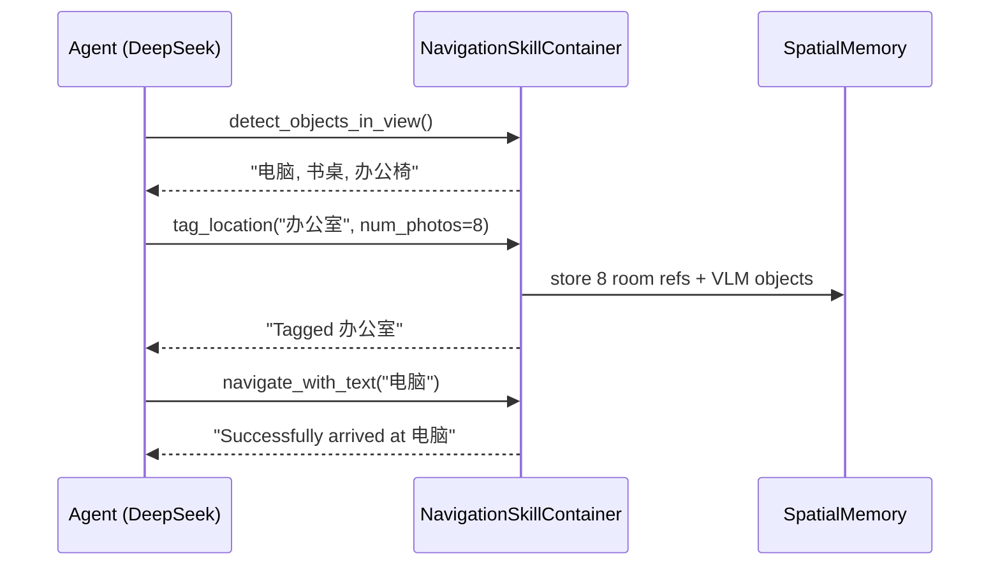

---

# 八、扩展点和延伸阅读

## 8.1 怎么调整 Fallback 顺序

修改环境变量即可，无需改代码：

```bash
export DIMOS_NAV_FALLBACK=room_first   # 先找 tagged room
export DIMOS_NAV_FALLBACK=semantic     # 默认：landmark 优先
```

或在 `navigation.py` 的 `_NAV_FALLBACK_STRATEGIES` 字典里加新策略名。

## 8.2 怎么替换 VLM 后端

`NavigationSkillContainer.__init__` 调用 `_create_vl_model()`，支持：

| 环境变量 | 后端 |
|----------|------|
| `DIMOS_VLM_PROVIDER=dashscope` | 阿里云 DashScope（新） |
| `DIMOS_VLM_PROVIDER=openai` | OpenAI GPT-4o |
| 默认 | 读 `.env` / GlobalConfig |

## 8.3 怎么给新机器人加 spatial blueprint

参考 `unitree_go2_spatial.py` 和 G1 的 `unitree_g1_nav_onboard.py`：

1. 在 `dimos/robot/<robot>/config.py` 定义 `internal_odom_offsets["mid360_link"]`
2. `autoconnect(base_stack, SpatialMemory, SpatialLandmarkMemoryModule, ObjectTracker2D, ...)`
3. agentic blueprint 里 `_common_agentic` 已包含 `NavigationSkillContainer`

## 8.4 推荐学习资料

| 资料 | 路径 |
|------|------|
| orbit 技能文档 | `docs/development/orbit_object.md` |
| 模块架构（中/英/日/德） | `docs/architecture/modules*.md` |
| VLM 导航测试脚本 | `test_vlm_navigation.py` |
| orbit 独立 demo | `demo_orbit_standalone.py` |

## 8.5 参数 cheatsheet

| 想做的事 | 看哪 |
|----------|------|
| 改 fallback 顺序 | `export DIMOS_NAV_FALLBACK=semantic\|room_first` |
| 清空空间记忆重建 | `dimos run unitree-go2-spatial --new-memory` |
| 改 CLIP 帧上限 | `SpatialConfig.max_stored_frames`（默认 500） |
| 改拓扑连边距离 | `TopologyGraph(max_edge_distance=8.0)` |
| 改 VLM 为 DashScope | `export DIMOS_VLM_PROVIDER=dashscope` + `.env` API key |
| 调试导航日志 | 日志关键字 `[L2]` `[L3]` `[VLM]` `[tag_location]` |
| 发自然语言给 agent | `dimos tell "..."` 或 `tell-robot "..."` |
| 查已存地标 | agent 调用 `query_landmarks()` skill |
| 绕障碍物环绕 | agent 调用 `orbit_object(direction="clockwise")` |
| 地标持久化路径 | `~/.local/state/dimos/landmark_memory/landmarks.json` |
| ChromaDB 路径 | `assets/output/memory/spatial_memory/chromadb_data` |

## 8.6 分支改动文件清单（按目录）

| 目录 | 主要改动 |
|------|----------|
| `dimos/agents/skills/` | `navigation.py` +1829, `orbit_object.py` +508, 测试 |
| `dimos/navigation/` | `topology.py` 新, `visual/query.py` 增强 |
| `dimos/perception/` | `spatial_perception.py` +489, `door/` 新模块 |
| `dimos/types/` | `spatial_record.py`, `door_record.py` 新 |
| `dimos/models/vl/` | `dashscope.py` 新 |
| `dimos/robot/` | 新 agentic blueprints, `tell.py`, go2/g1 spatial 改动 |
| `dimos/visualization/` | rerun bridge 内存上限 |
| `docs/` | architecture 多语言, orbit_object.md |
| `.github/` | auto-merge workflow, CI 优化 |
| `scripts/` | `pipeline.sh` 新（587 行 CI 流水线脚本） |

---

> 文档基于 `feat/semantic-nav-robust-loop` @ `211e8f69`。后续 dev 同步后细节可能调整，但整体「空间记忆 → 地标拓扑 → 六层 fallback 语义导航」架构应保持稳定。
