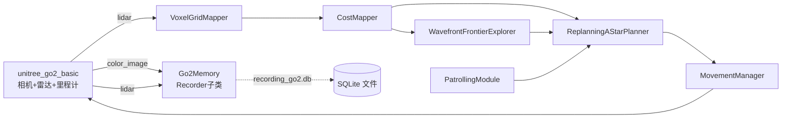
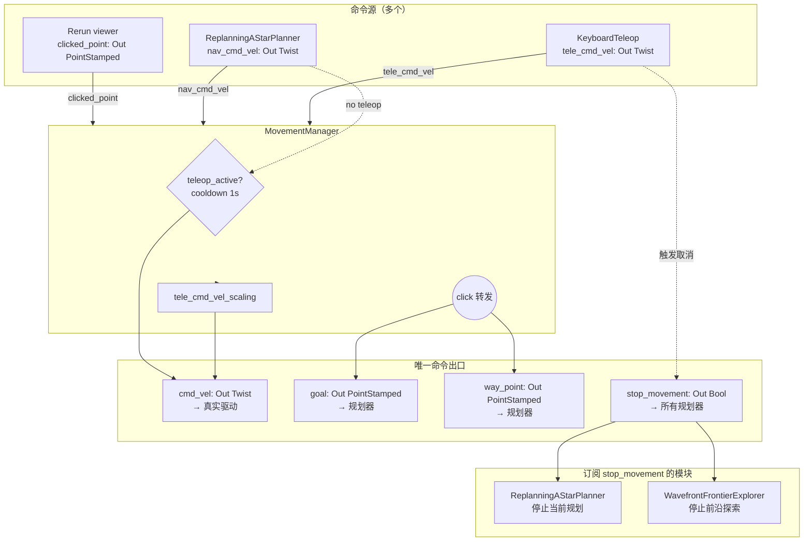
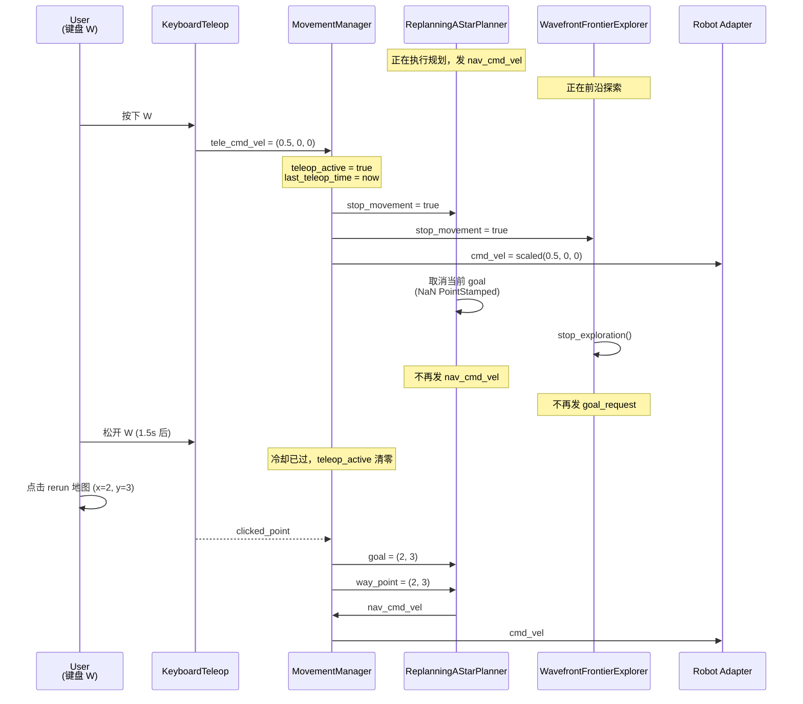
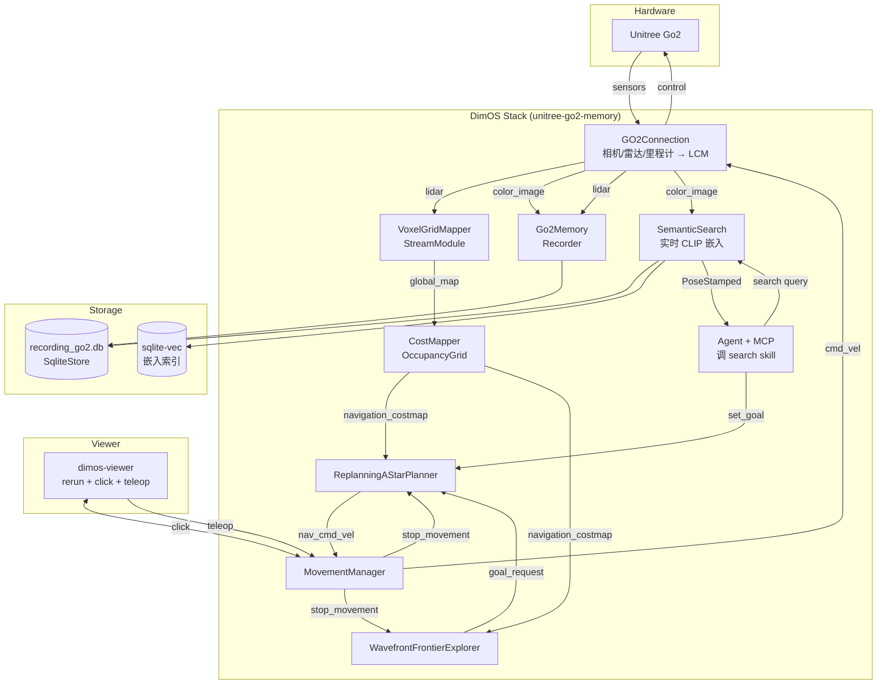

# Memory / Navigation / Mapping 详解（dev 更新 2026-04-28）

> 本文档对 `docs/upstream-update-2026-04-28.md` 中**最重要的两块**做深度讲解，配框架图与可运行的代码示例。
>
> 涉及的 commit：
> - `1d0d507a8` Feat/memory2 — plotting, examples, recorder module, semantic search (#1769)
> - `5532e8b60` perf(rerun): render voxel maps as Points3D spheres (#1793)
> - `50b3f7c45` Jeff/fix/rconnect2 (#1784) — 引入 `MovementManager` + 一系列控制流改动

---

## 一、Memory 系统（memory2）

### 1.1 它解决什么问题

机器人运行时会持续产生**异构传感器流**：图像、点云、里程计、检测结果、CLIP embedding……以前的 `dimos.memory` 只能"存"，不能：

- 用一行链式 API 做**懒加载流水线**（节流 → 滤亮度 → 取每窗口最佳帧 → CLIP embedding → 存到 SQLite-vec → 索引检索）
- 把任意流投影到 **2D 时序曲线**或 **3D 空间地图**做可视化
- 实时录制 + 离线回放共用同一套 API
- 把 LLM agent 的"找到我办公室桌子上的杯子"翻译成**带姿态的语义检索**

memory2 把这些一次到位。

### 1.2 架构总览

```mermaid
graph TB
  subgraph Producers["数据生产者（Module 端）"]
    CAM[Camera Module<br/>color_image: Out Image]
    LID[Lidar Module<br/>lidar: Out PointCloud2]
    ODOM[Odom Module<br/>odom: Out Odometry]
  end

  subgraph Recorder["Recorder 模块（dimos.memory2.module.Recorder）"]
    R[port_to_stream]
  end

  subgraph Backend["持久化后端"]
    SQLITE[(SqliteStore<br/>recording.db)]
    VEC[(SqliteVecStore<br/>语义向量索引)]
    NULL[NullStore<br/>纯内存)]
  end

  subgraph StreamAPI["Stream 流水线 (lazy, pull-based)"]
    S1[store.streams.color_image]
    T1[.live]
    T2[.filter brightness gt 0.1]
    T3[.transform QualityWindow]
    T4[.transform EmbedImages CLIP]
    T5[.save embeddings]
  end

  subgraph Consumers["消费者"]
    SS[SemanticSearch.search query→PoseStamped]
    VIS_PLOT[vis.plot 2D SVG/rerun]
    VIS_SPACE[vis.space 3D SVG/rerun]
    SM[StreamModule 把 Stream 当作普通 Module 部署]
  end

  CAM --> R
  LID --> R
  ODOM --> R
  R --> SQLITE
  R --> NULL

  SQLITE --> S1
  S1 --> T1 --> T2 --> T3 --> T4 --> T5 --> VEC

  VEC --> SS
  S1 --> VIS_PLOT
  S1 --> VIS_SPACE
  S1 --> SM
```

### 1.3 五个核心抽象

| 概念 | 文件 | 作用 |
|------|------|------|
| **`Observation[T]`** | `dimos/memory2/type/observation.py` | 一个观测点：`(ts, data: T, pose, tags)`。所有流的最小单位 |
| **`Backend[T]`** | `dimos/memory2/backend.py` | 字节级存取，定义 `append/iterate/notify`。具体实现：`SqliteStore`/`NullStore`/`SqliteVecStore` |
| **`Store`** | `dimos/memory2/store/` | 一个文件/数据库下的多个 `Stream` 集合。`store.streams.color_image` 这种语法糖入口 |
| **`Stream[T]`** | `dimos/memory2/stream.py` | **懒求值**的链式 API：`store.stream("lidar", PointCloud2).live().filter(...).transform(...).save(target)`。直到 `for ... in` 或 `.drain()` 才执行 |
| **`Transformer[T,R]`** | `dimos/memory2/transform.py` | 流水线的算子：`Iterator[Obs] → Iterator[Obs]`。已有 `throttle / downsample / speed / smooth / peaks / significant / normalize / QualityWindow / Batch / EmbedImages` 等 |

### 1.4 三个新可注册模块

| 名称 (registry) | 类 | 用途 |
|-----------------|----|----|
| `memory-module` | `MemoryModule` | 抽象基类，提供 `db_path` 配置和 `SqliteStore` 自动管理 |
| `recorder` | `Recorder` | **录制**：把任意 `In[T]` 端口的消息持久化到 SQLite。**子类化时声明端口即可** |
| `semantic-search` | `SemanticSearch` | **语义检索**：在线对图像流做 CLIP 嵌入并存入 sqlite-vec，暴露 `search(query) -> PoseStamped` skill 给 LLM agent |

### 1.5 一个关键的桥接：`StreamModule`

> 把 push 式的 dimos `Module`（`In/Out` 端口）和 pull 式的 memory2 `Stream` 流水线**自动黏合**。

之前你要写一个"接收点云 → 体素化 → 发回去"的模块需要手工管理订阅。现在直接：

```python
class VoxelGridMapper(StreamModule[PointCloud2, PointCloud2]):
    config: VoxelGridMapperConfig

    def pipeline(self, stream: Stream[PointCloud2]) -> Stream[PointCloud2]:
        return stream.transform(VoxelMap(**self.config.model_dump()))

    lidar: In[PointCloud2]
    global_map: Out[PointCloud2]
```

`StreamModule.start()` 自动：

1. 用 `NullStore`（纯内存 backend）作为 in-memory 桥
2. 把 `lidar` 端口收到的消息 `port_to_stream` 进 store
3. 对 `store.stream("lidar").live()` 应用你定义的 `pipeline`
4. 把流水线输出 `stream_to_port` 到 `global_map` 端口

要求：**恰好一个 `In` 端口和一个 `Out` 端口**。

实际效果：dimos 的 `dimos/mapping/voxels.py:VoxelGridMapper` 这次升级就改成了 `StreamModule[PointCloud2, PointCloud2]` —— 类型端到端可静态检查。

### 1.6 可视化：`memory2/vis/`

两套独立子系统：

| 子系统 | 作用 | 输出 |
|--------|------|------|
| `vis/plot/` | **2D 时序/分布曲线**（亮度随时间、检测置信度直方图等） | SVG / rerun |
| `vis/space/` | **3D 空间地图**（voxel + 轨迹 + 兴趣点） | SVG / rerun |

两边都可以混合 `Space()` / `Plot()` 容器，往里 `add()` 任意 `Stream`、`Observation`、点、线、图形元素，然后 `to_svg("file.svg")` 或 `to_rerun()`。

### 1.7 实际使用：录制 + 离线分析 + 语义检索

#### 步骤 1 — 录制（在线）

最简单的录制只要起一个 blueprint：

```bash
# 这个 blueprint 自带 Go2Memory(Recorder)，会把 color_image + lidar 写到 recording_go2.db
dimos run unitree-go2-memory --robot-ip 192.168.123.161
```

`unitree-go2-memory` 的拓扑（来自 `dimos/robot/unitree/go2/blueprints/smart/unitree_go2.py`）：



要自定义录什么，直接写一个 `Recorder` 子类：

```python
from dimos.memory2.module import Recorder, RecorderConfig
from dimos.core.stream import In
from dimos.msgs.sensor_msgs.Image import Image
from dimos.msgs.sensor_msgs.PointCloud2 import PointCloud2

class MyRecorder(Recorder):
    config: RecorderConfig
    color_image: In[Image]
    lidar: In[PointCloud2]
    # 想录什么就声明什么 In[...] 端口，会自动建表
```

#### 步骤 2 — 离线分析（`docs/capabilities/memory/index.md` 的实战流程）

```python
import pickle
from dimos.memory2.store.sqlite import SqliteStore
from dimos.memory2.transform import speed, smooth, throttle
from dimos.memory2.vis.space.space import Space
from dimos.utils.data import get_data

store = SqliteStore(path=get_data("go2_bigoffice.db"))

# 看看里面录了什么
for name, stream in store.streams.items():
    print(stream.summary())
# Stream("color_image"): 4164 items, ... (292.5s)
# Stream("color_image_embedded"): 267 items, ...
# Stream("lidar"): 2251 items, ...
# Stream("odom"): 5465 items, ...

global_map = pickle.loads(get_data("unitree_go2_bigoffice_map.pickle").read_bytes())

# 把整段录像的速度画到地图上
drawing = Space()
drawing.add(global_map)
drawing.add(
    store.streams.color_image
        .transform(speed())          # 计算每两帧之间的速度（m/s）
        .transform(smooth(50))        # 50 帧滑窗平均
)
drawing.to_svg("speed_overlay.svg")
```

输出是带着 turbo 配色的时序速度叠加图（覆盖在体素地图上）。

#### 步骤 3 — 语义检索（在线，agent 可调）

把 `SemanticSearch` 加进 blueprint，agent 就能拿到一个 `search(query: str) -> PoseStamped` 的 skill：

```python
from dimos.memory2.module import SemanticSearch

blueprint = autoconnect(
    unitree_go2_memory,
    SemanticSearch.blueprint(db_path="recording_go2.db"),
)
```

agent 调 `search("kitchen sink")` 后 `SemanticSearch.search()` 内部做的事（`dimos/memory2/module.py:228-245`）：

1. CLIP embed 查询文本
2. 在 sqlite-vec 里 cosine 相似度检索
3. 用 `peaks(key=similarity, distance=1.0)` 在时间维度去重（避免连续 30 帧都返回同一个东西）
4. 取最后一个高峰，返回它的 `PoseStamped`

agent 可以拿这个 PoseStamped 去 `set_goal()` 让机器人走过去。

### 1.8 Transformer 速查表

`dimos/memory2/transform.py` 里目前可链式调用的算子（按用途分组）：

| 类别 | 算子 | 说明 |
|------|------|------|
| **采样** | `downsample(n)` | 每 n 个取一个 |
|  | `throttle(interval_sec)` | 每秒最多一个 |
|  | `QualityWindow(quality_fn, window_sec)` | 每个时间窗口取质量最高的一个（如最清晰的图） |
| **聚合** | `Batch(fn, batch_size)` | 攒齐 N 个再批处理（嵌入、批量推理） |
|  | `EmbedImages(model, batch_size)` | 专门给 CLIP 这类视觉嵌入用的 Batch |
| **统计** | `speed()` | 由 pose + ts 计算瞬时速度 |
|  | `smooth(n)` / `smooth_time(sec)` | 滑窗均值（按样本数 / 按时间） |
|  | `normalize()` | 把 data 归一化到 [0,1] |
| **检测** | `peaks(prominence, distance, width, key)` | scipy `find_peaks` 找信号峰值（用于"事件检测"） |
|  | `significant(method='mad'/'otsu'/'gap')` | 在峰值上用统计方法挑显著的 |

链起来就是机器人感知里的"流式信号处理"工具链。

---

## 二、Navigation 系统重构

### 2.1 它解决什么问题

之前 Navigation / Teleop 同时控制机器人会出问题：

- 用户敲键盘想纠正位置时，导航器还在持续往同一个目标推 `cmd_vel` —— **冲突**
- 没有统一的"取消当前目标"通道，frontier explorer 自己玩自己的，规划器自己玩自己的
- 点击 rerun 上的地图想重新设置目标时，规划器和 explorer 都没收到信号

### 2.2 解决方案：`MovementManager` 总线

> 把所有"谁来命令机器人"的源（teleop / 导航 / 点击）汇聚成一根，输出唯一的 `cmd_vel`，并广播一个 `stop_movement` 信号让所有规划器知道"取消"。

`dimos/navigation/smart_nav/modules/movement_manager/movement_manager.py`：



### 2.3 优先级与冷却

`MovementManager` 内部状态机（`movement_manager.py:100-133`）：

| 收到消息 | 动作 |
|---------|------|
| `tele_cmd_vel`（键盘） | **立即接管**：发出 `stop_movement=True`（取消所有导航），把 teleop 的 `cmd_vel` 按 `tele_cmd_vel_scaling` 缩放后发出。记录 `teleop_active=True` |
| `nav_cmd_vel`（规划器） | 如果 teleop 处于 active 状态且 **冷却时间 < 1.0s**（可配），**丢弃**；否则发出 |
| `clicked_point`（rerun 点击） | 同时发到 `goal` 和 `way_point` 两个出口（前者给规划器，后者给可视化），让点哪走哪 |

效果：**用户敲键盘的瞬间，导航器停下；松手 1 秒后，导航器自动恢复接管**。

### 2.4 接口契约的变化（破坏性）

为了让 `MovementManager` 居中，规划器/探索器的端口名做了重命名：

| 模块 | 旧端口 | 新端口 |
|------|--------|--------|
| `ReplanningAStarPlanner` | `cmd_vel: Out[Twist]` | **`nav_cmd_vel: Out[Twist]`** |
| `ReplanningAStarPlanner` | — | **`stop_movement: In[Bool]`**（新增订阅） |
| `WavefrontFrontierExplorer` | — | **`stop_movement: In[Bool]`**（新增订阅） |

> **如果你的自定义 blueprint 依赖原 `ReplanningAStarPlanner.cmd_vel` 出口名，更新后会自动连不上。** 需要要么改名为 `nav_cmd_vel`，要么显式 `.remappings({"nav_cmd_vel": "cmd_vel"})`。

### 2.5 stop_movement 总线的工作流



---

## 三、Mapping 渲染优化

### 3.1 PointCloud2 默认渲染从 `boxes` → `spheres`（`#1793`）

`dimos/msgs/sensor_msgs/PointCloud2.py:to_rerun()`：

| 项 | 旧 | 新 |
|----|----|----|
| 默认 `mode` | `"points"` (实际渲染 `Boxes3D`) | **`"spheres"`** （`Points3D` 球） |
| 新参数 | — | `bottom_cutoff: float \| None`（裁掉地面以下的点） |
| 空点云防护 | 无 | 新增空 cloud 早返回 |

**收益**：原来 100k 个 voxel 渲染成 100k 个 Box3D 在 rerun 里非常卡，改成 Points3D 后帧率提升 5-10×。

### 3.2 OccupancyGrid 新增 RGBA 纹理生成（`#1769`）

`dimos/mapping/occupancy/visualizations.py:generate_rgba_texture()`：

```python
from dimos.mapping.occupancy.visualizations import generate_rgba_texture

rgba = generate_rgba_texture(
    grid,                   # OccupancyGrid
    colormap="viridis",     # matplotlib colormap (None=Foxglove 蓝紫风格)
    opacity=0.6,            # 0~1 透明度
    cost_range=(0, 80),     # 只渲染 cost 在 [0,80] 的格子
    background="#484981",   # 背景色
)
# 返回 ndarray (H, W, 4)
```

支持 unknown (-1) 透明、范围外 cost 用背景色填充等细节。

### 3.3 `VoxelGridMapper` 的类型注解

只是从 `class VoxelGridMapper(StreamModule)` 改成 `class VoxelGridMapper(StreamModule[PointCloud2, PointCloud2])` —— 配合 `StreamModule` 改造，端到端类型检查可工作。

---

## 四、把它们串起来：一次完整的 Go2 任务



**典型交互场景**：

1. **机器人开机**：感知模块（雷达 → 体素地图 → cost map）开始填地图
2. **录制启动**：`Go2Memory` 把 `color_image`/`lidar` 持续写入 `recording_go2.db`
3. **后台索引**：`SemanticSearch` 自动 throttle 到 ~2Hz、滤掉暗帧、取每 0.5s 最清晰的一张、CLIP 嵌入、写入 sqlite-vec
4. **用户点击 rerun 地图**：`MovementManager` 把点 → `goal` → `ReplanningAStarPlanner` → `nav_cmd_vel` → `MovementManager` → `cmd_vel` → 机器人走过去
5. **agent 收到指令"找到我的咖啡杯"**：调 `search("coffee mug")` → 拿到 `PoseStamped` → 调 `set_goal()` → 上面 step 4 的链路重新走一遍
6. **用户中途想插手**：按 W —— `MovementManager` 立刻发 `stop_movement` → `ReplanningAStarPlanner` 取消 goal、`WavefrontFrontierExplorer` 停止探索 → 用户的 teleop 接管 1 秒冷却期

---

## 五、迁移 Checklist

### 你的代码如果做了下面这些事，需要更新：

- ✅ **直接订阅 `ReplanningAStarPlanner.cmd_vel`** → 改用 `nav_cmd_vel`，或加 `MovementManager` 居中
- ✅ **自定义 blueprint 同时启用 teleop 和 nav** → 加 `MovementManager.blueprint()`，让两边走它
- ✅ **依赖 PointCloud2 默认渲染为 boxes** → 显式传 `mode="boxes"`
- ✅ **使用 `dimos.memory.timeseries.TimedSensorReplay`** → 它现在是 memory2 的 shim，路径改为 `dataset/stream`（不是文件路径）；想读老 pickle 用 `dimos.memory.timeseries.legacy.LegacyPickleStore`
- ✅ **自定义 `StreamModule` 子类** → 必须**恰好一个** In + 一个 Out 端口，否则 `start()` 直接抛 `TypeError`

### 你的工程如果想用上新功能：

- 想录数据 → 写一个 `Recorder` 子类，几行代码搞定
- 想给 agent 加"找东西"能力 → 加 `SemanticSearch` 模块即可，自动接相机
- 想画时序信号叠到地图上 → 用 `dimos.memory2.vis.space.Space()` + `transform(speed())` 等
- 想做事件检测 → `.transform(peaks(...)).transform(significant(...))`

---

## 六、参考文档

upstream 在这次更新里同步加了大量第一手文档（都已 merge 到本地 dev）：

- `docs/capabilities/memory/index.md` — Memory2 端到端 walkthrough
- `docs/capabilities/memory/plot.md` — 2D plot 教程
- `docs/capabilities/memory/algo_comparison.md` — peak detection 算法对比
- `docs/capabilities/memory/demo_rerun.py` — 配套示例代码
- `docs/development/conventions.md` — 项目编码约定（含 `vis_module` 用法）
- `dimos/memory2/architecture.md` / `intro.md` / `embeddings.md` / `streaming.md` — 模块内文档

> 想看完整的可视化资产（svg/png），直接去 `docs/capabilities/memory/assets/` 浏览。
