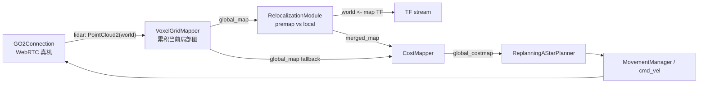

# Go2 relocalization 命令、定位、地图合并与固定起点优化分析

日期：2026-06-29  
代码基线：本地仓库 `/Users/taojiang/huazhijian/topsun-bot/topsun_dimos`

## 0. 核心结论

你这条命令启动的是“标准 Go2 老导航栈 + RelocalizationModule”：

```bash
dimos run unitree-go2-relocalization --robot-ip 192.168.123.161 \
  -o relocalizationmodule.map_file=recording_go2
```

它的定位逻辑不是 FastLIO 那种连续 SLAM 定位，而是：

1. 先从 `recording_go2.pc2.lcm` 加载一张离线建好的 premap，坐标系设为 `map`。
2. 实时从 Go2 LiDAR 累积当前局部/启动后地图，坐标系是当前运行的 `world`。
3. 每隔 2 秒，当当前地图点数超过 50,000 后，调用 `relocalize(premap, local_map)`。
4. `relocalize()` 用 FPFH 特征、多尺度 RANSAC、wall-only ICP、final ICP 算出 `T_map_world`，也就是“把当前 world 里的点放到旧地图 map 里”的 4x4 变换矩阵。
5. 模块把它取逆，发布 `world <- map` 的 TF。之后把 premap 变换到当前 `world`，再与当前局部地图合成 `merged_map`。
6. `CostMapper` 优先用 `merged_map` 生成导航 costmap，A* / MovementManager 后续不需要知道地图是本地还是合并来的。

如果 Go2 每次都从同一个物理位置、同一个朝向启动，确实可以大幅缩短启动匹配时间。最激进方案是直接发布固定 `world <- map` TF，基本跳过全局匹配；保守方案是把固定起点作为 ICP 初值，只跑小范围 ICP 做校正，跳过 17 次 RANSAC。现在 1 分 30 秒很可能不是“单次 ICP”本身，而是“等局部地图积累到 50,000 点 + 首次 premap 特征/下采样缓存 + 17 次 RANSAC + 10 次 wall ICP + 1 次 final ICP + 多次失败重试”的总耗时。

注意：你原命令里 `recording_go2，` 如果末尾真的是中文逗号 `，`，实际会被当成文件名的一部分，代码会去找 `recording_go2，.pc2.lcm`，通常会失败。应使用英文命令里的 `recording_go2`，不要带中文逗号。

## 1. 命令如何进入代码

### 1.1 `unitree-go2-relocalization` 定位到哪个蓝图

蓝图注册在：

- `dimos/robot/all_blueprints.py:119`

```python
"unitree-go2-relocalization": "dimos.robot.unitree.go2.blueprints.smart.unitree_go2:unitree_go2_relocalization"
```

实际蓝图定义在：

- `dimos/robot/unitree/go2/blueprints/smart/unitree_go2.py:94-97`

```python
unitree_go2_relocalization = autoconnect(
    unitree_go2,
    RelocalizationModule.blueprint(),
).global_config(n_workers=11)
```

`unitree_go2` 本身是：

- `GO2Connection`
- `VoxelGridMapper(emit_every=5)`
- `CostMapper`
- `ReplanningAStarPlanner`
- `WavefrontFrontierExplorer`
- `PatrollingModule`
- `MovementManager`

对应 `dimos/robot/unitree/go2/blueprints/smart/unitree_go2.py:41-49`。

所以 `unitree-go2-relocalization` 不是独立新导航栈，而是在原 `unitree-go2` 上插入 `RelocalizationModule`。

### 1.2 `--robot-ip` 怎么生效

`--robot-ip 192.168.123.161` 是 `GlobalConfig.robot_ip`。字段定义在：

- `dimos/core/global_config.py:33-45`

Go2 连接模块的配置默认从 `GlobalConfig` 取 IP：

- `dimos/robot/unitree/go2/connection.py:67-69`

```python
class ConnectionConfig(ModuleConfig):
    ip: str = Field(default_factory=lambda m: m["g"].robot_ip)
```

连接类型由 `GlobalConfig.unitree_connection_type` 决定：

- `dimos/core/global_config.py:96-101`

如果不是 replay、simulation，就返回 `"webrtc"`。然后：

- `dimos/robot/unitree/go2/connection.py:117-139`

会创建 `UnitreeWebRTCConnection(ip, ...)`，即连真机。

### 1.3 `-o relocalizationmodule.map_file=recording_go2` 怎么生效

CLI 对 `-o` 的解析在：

- `dimos/robot/cli/dimos.py:190-217`

它把点号路径解析成嵌套字典：

```python
relocalizationmodule.map_file=recording_go2
```

变成：

```python
{
  "relocalizationmodule": {
    "map_file": "recording_go2"
  }
}
```

`relocalizationmodule` 这个名字来自 `ModuleBase.name`：

- `dimos/core/module.py:174-177`

类名 `RelocalizationModule` 被 lower 后就是 `relocalizationmodule`。

`RelocalizationModule` 的配置字段在：

- `dimos/mapping/relocalization/module.py:46-52`

```python
class Config(ModuleConfig):
    map_file: str | None = None
    publish_loaded_map: bool = False
    fitness_threshold: float = 0.45
    use_carving: bool = True
```

因此你的 `-o` 最终就是给 `self.config.map_file` 赋值。

## 2. premap 从哪里来

当前命令只加载已有地图，不负责建图。标准流程是先录制：

```bash
dimos run unitree-go2-memory --robot-ip 192.168.123.161
```

`Go2Memory` 在：

- `dimos/robot/unitree/go2/blueprints/smart/unitree_go2.py:52-71`

它记录 `color_image`、`lidar`、`odom`，并用最近的 odom 给 lidar 设置 pose。

然后导出 premap：

```bash
dimos map global recording_go2 --export
```

这个命令在：

- `dimos/mapping/utils/cli/map.py:291-388`

关键逻辑：

- `resolve_named_path(dataset, ".db")` 找到 `recording_go2.db`，见 `map.py:402`。
- 读取 `lidar` stream，见 `map.py:408-410`。
- 按位姿做空间去重，默认 `pgo_tol=0.3m`，见 `map.py:415-447`。
- 如果 `--export`，会强制打开 PGO，见 `map.py:405-407`。
- PGO 第一遍优化轨迹，见 `map.py:457-461`。
- PGO 第二遍用校正后的轨迹重建地图，见 `map.py:467-476`。
- 最后写出 `./recording_go2.pc2.lcm`，见 `map.py:575-579`。

在线重定位加载的就是这个 `.pc2.lcm`。

## 3. 在线数据流

简化数据流如下：



Go2 LiDAR 入口：

- `dimos/robot/unitree/connection.py:277-284`

```python
self.raw_lidar_stream()
  .pipe(
      ops.map(pointcloud2_from_webrtc_lidar),
      ops.map(time_is_now),
  )
```

`pointcloud2_from_webrtc_lidar()` 把 Unitree 原始点云转成 `PointCloud2(frame_id="world")`：

- `dimos/robot/unitree/type/lidar.py:60-82`

`GO2Connection.start()` 订阅并发布这个流：

- `dimos/robot/unitree/go2/connection.py:245-257`

`VoxelGridMapper` 把 `lidar` 累积成 `global_map`：

- `dimos/mapping/voxels.py:245-268`

`unitree_go2` 里设置 `VoxelGridMapper.blueprint(emit_every=5)`，所以每 5 帧输出一次当前体素地图：

- `dimos/robot/unitree/go2/blueprints/smart/unitree_go2.py:41-44`

## 4. RelocalizationModule 如何找 Go2 在旧地图里的位置

### 4.1 启动时加载 premap

入口在：

- `dimos/mapping/relocalization/module.py:67-109`

如果没有 `map_file`，模块直接禁用：

```python
if not self.config.map_file:
    logger.info("Relocalization module disabled (no map_file configured)")
    return
```

有 `map_file` 时：

- `module.py:75` 用 `resolve_named_path(self.config.map_file, ".pc2.lcm")` 找文件。
- `module.py:76` 用 `PointCloud2.lcm_decode()` 读取 premap。
- `module.py:77` 把 premap 的 `frame_id` 设成 `"map"`。

`resolve_named_path()` 的查找逻辑在：

- `dimos/utils/data.py:117-130`

它会尝试：

1. 你给的是绝对路径，直接用。
2. 当前路径存在，直接用。
3. repo root 下存在，直接用。
4. 如果没带 `.pc2.lcm` 后缀，就追加后缀再找。
5. 最后去 `data/` 里找。

### 4.2 什么时候尝试重定位

订阅逻辑在：

- `dimos/mapping/relocalization/module.py:79-88`

```python
self.global_map.observable().pipe(
    ops.throttle_first(RELOC_INTERVAL),
    ops.do_action(self._maybe_log_skip),
    ops.filter(self._has_enough_points),
)
.pipe(ops.map(self._try_relocalize))
.subscribe(self._publish_tf)
```

关键常量：

- `RELOC_INTERVAL = 2.0`
- `MIN_LOCAL_POINTS = 50_000`

也就是说：最多每 2 秒尝试一次，并且当前累计地图点数必须达到 50,000。点数不够时只打 warning，不会进入 ICP/RANSAC。

### 4.3 `relocalize()` 返回的矩阵是什么意思

调用点在：

- `dimos/mapping/relocalization/module.py:129-163`

```python
T, fitness = _relocalize(self._premap.pointcloud, msg.pointcloud)
```

这里：

- 第一个参数 `self._premap.pointcloud` 是旧地图，坐标系 `map`。
- 第二个参数 `msg.pointcloud` 是当前启动后的局部/累计地图，坐标系 `world`。

`relocalize()` 文档写的是“Estimate the 4x4 transform placing local_map into global_map”，见：

- `dimos/mapping/relocalization/relocalize.py:123-132`

所以返回的 `T` 是：

```text
T_map_world: map <- world
```

即把当前 `world` 里的点变换到旧地图 `map` 里。

但模块后续要发布的 TF 是 `world <- map`，因为 merge 时要把 premap 变换到当前 `world`。所以代码做了：

- `module.py:150-156`

```python
T_inv = np.linalg.inv(T)
new_tf = Transform(
    translation=Vector3(*T_inv[:3, 3]),
    rotation=Quaternion.from_rotation_matrix(T_inv[:3, :3]),
    frame_id="world",
    child_frame_id="map",
)
```

这个 `Transform(frame_id="world", child_frame_id="map")` 的矩阵是：

```text
T_world_map: world <- map
```

后面 `premap.transform(tf)` 就能把旧地图从 `map` 放进当前 `world`。

## 5. relocalize.py 的算法逻辑

算法主体在：

- `dimos/mapping/relocalization/relocalize.py`

### 5.1 预处理

`_preprocess()`：

- `relocalize.py:41-51`

每个 voxel size 都做：

1. `voxel_down_sample(voxel_size)`
2. `estimate_normals(radius=voxel_size * 2)`
3. `compute_fpfh_feature(radius=voxel_size * 5)`

全局 premap 的预处理有进程内缓存：

- `_GLOBAL_CACHE` 在 `relocalize.py:54-60`
- `_global_preprocess()` 在 `relocalize.py:63-71`
- `_global_fine()` 在 `relocalize.py:74-84`

注意：这是进程内缓存。每次重新启动 `dimos run`，第一次匹配仍然要重新算 premap 的 downsample、normal、FPFH。

### 5.2 多尺度 RANSAC 候选生成

参数在：

- `relocalize.py:28-36`

```python
SCALE_PLAN = [
    (0.2, 8),
    (0.3, 8),
    (0.8, 1),
]
RANSAC_ITERS = 500_000
FINE_VOXEL = 0.1
```

所以一次 `relocalize()` 会做：

- 0.2m voxel 下 8 次 RANSAC
- 0.3m voxel 下 8 次 RANSAC
- 0.8m voxel 下 1 次 RANSAC

总计 17 次 RANSAC。每次 RANSAC 的最大迭代预算是 500,000，见：

- `relocalize.py:87-114`

这通常比最后 ICP 更重。

### 5.3 180 度 yaw flip 候选

RANSAC 生成候选后，代码又给每个候选加一个绕当前局部点云 centroid 的 180 度 yaw 翻转：

- `relocalize.py:151-164`

这会把 17 个候选扩展到 34 个候选。目的是处理室内结构里“同一个位置、相反朝向”的歧义。

### 5.4 重力过滤

候选会被 `_gravity_tilt_deg()` 过滤，默认允许 z 轴倾斜不超过 10 度：

- `relocalize.py:117-120`
- `relocalize.py:166-168`

这避免点云被配到倾斜得离谱的 3D 姿态。

### 5.5 wall-only 排序与 ICP

接下来代码把 floor/ceiling 排除，只保留墙面法向：

- `relocalize.py:170-187`

原因是地板/天花板平面在 yaw 上有旋转对称性，会让错误朝向也看起来不错。墙面更能约束 yaw 和 xy。

然后：

1. Stage 1：对候选用 wall-only fine fitness 排序，取 top 10，见 `relocalize.py:189-194`。
2. Stage 2：对 top 10 每个候选跑 point-to-plane ICP，最多 70 iter，见 `relocalize.py:196-211`。
3. Stage 3：用最好的候选在 full cloud 上跑 final ICP，最多 50 iter，见 `relocalize.py:213-221`。

这里的 ICP 是精配准，不是全局搜索。它依赖 RANSAC 已经把初始位姿放到足够接近的位置。

## 6. 地图 merge 是怎么做的

merge 入口在：

- `dimos/mapping/relocalization/module.py:173-191`

```python
premap_in_world = self._premap.transform(tf)
if self.config.use_carving:
    grid = VoxelGrid(carve_columns=True, frame_id=local.frame_id, show_startup_log=False)
    grid.add_frame(premap_in_world)
    grid.add_frame(local)
    self.merged_map.publish(grid.get_global_pointcloud2())
else:
    self.merged_map.publish(local + premap_in_world)
```

逻辑是：

1. `tf` 是 `world <- map`。
2. `self._premap.transform(tf)` 把旧地图从 `map` 转到当前 `world`。
3. `use_carving=True` 时，新建一个 `VoxelGrid(carve_columns=True)`。
4. 先 add premap，再 add local。因为 `carve_columns=True` 会按 XY 列清理旧 voxel，所以 local 当前观测可以覆盖 premap 中同一列的旧信息。
5. 发布 `merged_map`。

如果 `use_carving=False`，就简单把 `local + premap_in_world` 拼起来，速度通常更快，但重复点和旧障碍清理会差一些。

下游 `CostMapper` 的选择逻辑在：

- `dimos/mapping/costmapper.py:54-79`

```python
return merged if merged is not None else gmap
```

所以只要 `merged_map` 出现，导航 costmap 优先来自“当前局部图 + 旧 premap”的融合结果。

## 7. 为什么你看到启动匹配要 1 分 30 秒

从代码看，耗时可能分成几段。

### 7.1 等当前局部地图点数超过 50,000

`MIN_LOCAL_POINTS = 50_000`，见：

- `dimos/mapping/relocalization/module.py:42`

点数不到时根本不会进入 `_try_relocalize()`：

- `module.py:111-123`

这段时间容易被误认为“ICP 在跑”，其实算法还没开始。

### 7.2 首次 premap 缓存成本

第一次进入 `relocalize()` 时，global premap 会在多个尺度上做 downsample、normal、FPFH：

- `relocalize.py:63-84`

这次成本只在当前进程内缓存。重启后重新计算。

### 7.3 17 次 RANSAC 才是主要全局搜索成本

一次完整 relocalize 默认 17 次 RANSAC，每次最多 500,000 iterations：

- `relocalize.py:30-35`
- `relocalize.py:100-114`

如果场景重复、走廊相似、墙面特征少、局部地图还不够完整，RANSAC 会生成很多低质量候选，然后被 fitness gate 拒绝。模块 2 秒后又会再试一次。

### 7.4 ICP 也有 11 次，但它不是唯一大头

每次完整 relocalize 有：

- top 10 wall-only ICP，每个最多 70 iter。
- 1 次 full-cloud final ICP，最多 50 iter。

见：

- `relocalize.py:196-221`

所以“ICP 计算转换矩阵耗时久”这个说法有一半对：最后确实靠 ICP 精修矩阵，但全局找初值主要靠 FPFH + RANSAC。

### 7.5 relocalize.py 用的是 Open3D legacy registration

在线 `relocalize.py` 用的是：

```python
o3d.pipelines.registration
```

这是 Open3D legacy API。它不走 `VoxelGrid` 那套 tensor/CUDA 路径。因此即便 `VoxelGridMapper` 可用 CUDA，在线 relocalize 的 RANSAC/ICP 仍主要是 CPU 负载。

### 7.6 merge 本身也可能拖慢后续刷新

配准成功后，`_on_merge_input()` 每次都：

1. 把整张 premap transform 一遍。
2. 新建一个 `VoxelGrid`。
3. add 整张 premap。
4. add 当前 local。
5. 输出合并地图。

见：

- `dimos/mapping/relocalization/module.py:181-189`

这不是“算初始转换矩阵”的成本，但如果你修掉 relocalize 启动慢后，后续仍感觉卡，就要测 merge 这段。

## 8. 固定起点能不能大幅缩短匹配时间

可以，但前提要说清楚。

Go2 当前在线点云的 `frame_id` 是 `world`，这个 `world` 是每次启动后的本地世界/里程计世界。只要机器人每次物理启动位置和朝向都固定，那么：

```text
T_map_world: map <- world
```

就是固定的，或者只在很小范围内变化。

这意味着你不需要每次做“全局找自己在哪”。可以直接给系统一个已知初值。

推荐分三档做。

## 9. 推荐改法 A：固定起点直接发布 TF，最快

适用条件：

- 机器人每次放在同一地面标记点。
- 朝向也固定，比如机头对准墙上的箭头。
- 误差小到 costmap/导航可以接受，比如平移误差小于 10-20 cm，yaw 小于 2-5 度。

改法：

1. 给 `RelocalizationModule.Config` 增加配置：

```python
fixed_start_in_map: str | None = None  # "x,y,z,yaw_deg"，表示当前 world 原点在 map 里的位姿
fixed_start_mode: str = "none"         # "none" | "publish" | "icp_init"
```

2. 在 `start()` 里加载 premap、注册 merge 订阅之后，解析 `fixed_start_in_map`。
3. 构造 `T_map_world`。
4. 取逆得到 `T_world_map`。
5. 发布 `Transform(frame_id="world", child_frame_id="map")` 到 `_world_to_map`。
6. 如果 `fixed_start_mode == "publish"`，可以不注册周期性全局 relocalize，或者保留 fallback 但不要阻塞 merge。

很重要：当前 `_world_to_map` 是 `Subject`，不是 `BehaviorSubject`。如果你在订阅建立前 `on_next()`，这个固定 TF 会丢。要么：

- 先注册 `combine_latest(... self._world_to_map ...)`，再 `on_next(fixed_tf)`；
- 或者把 `_world_to_map` 改成能保留最近值的 subject。

推荐命令形态：

```bash
dimos run unitree-go2-relocalization --robot-ip 192.168.123.161 \
  -o relocalizationmodule.map_file=recording_go2 \
  -o relocalizationmodule.fixed_start_mode=publish \
  -o relocalizationmodule.fixed_start_in_map=0,0,0,0
```

上面配置是建议新增的，目前代码还没有这些字段。

如果你的 premap 原点就是录图时机器人启动点，并且新启动也在同一姿态，`0,0,0,0` 可能就是对的。如果不是，需要标定一次真实的 `T_map_world`。

## 10. 推荐改法 B：固定起点作为 ICP 初值，兼顾速度和校正

适用条件：

- 每次起点大致固定，但会有几十厘米或几度误差。
- 你想保留点云精配准，而不是完全相信人工摆放。

核心思想：

现在 `relocalize()` 的流程是：

```text
FPFH + 17 次 RANSAC -> 34 个候选 -> top10 wall ICP -> final ICP
```

固定起点后可以改成：

```text
固定 T_map_world 初值 -> 小范围 wall/full ICP -> fitness gate -> 成功则发布 TF
失败再 fallback 到原全局 RANSAC
```

这样可以跳过最慢的 FPFH/RANSAC 全局搜索。

建议在 `relocalize.py` 新增一个函数，而不是硬塞进原 `relocalize()`：

```python
def relocalize_with_initial(
    global_map: o3d.geometry.PointCloud,
    local_map: o3d.geometry.PointCloud,
    init_T_map_world: np.ndarray,
    *,
    max_correspondence_distance: float = 0.3,
    max_iteration: int = 30,
) -> tuple[np.ndarray, float]:
    ...
```

内部可以复用现有逻辑：

- `src_fine = local_map.voxel_down_sample(FINE_VOXEL)`
- `tgt_fine = _global_fine(global_map, FINE_VOXEL)`
- 估计 normal
- 用 `_wall_subset()` 先跑一次 point-to-plane ICP
- 再用 full cloud 跑一次 final ICP

为了更快，建议再加一个 crop：

1. 用 `init_T_map_world` 把 `src_fine` 变到 `map`。
2. 取它的 AABB，向外扩 2-5 米。
3. 用这个 AABB crop `tgt_fine`。
4. ICP 只对局部 premap 子图做。

这样 target 不再是整张 premap，而是启动点附近的一小块。

推荐新增配置：

```python
fixed_start_mode: str = "none"          # none | publish | icp_init
fixed_start_in_map: str | None = None
fixed_start_icp_max_dist: float = 0.3
fixed_start_icp_max_iter: int = 30
fixed_start_crop_radius: float = 8.0
fixed_start_fallback_global: bool = True
min_local_points: int = 50_000
fixed_start_min_local_points: int = 8_000
```

然后 `_try_relocalize()` 里：

```python
if self.config.fixed_start_mode == "icp_init" and self._fixed_T_map_world is not None:
    try:
        T, fitness = _relocalize_with_initial(
            self._premap.pointcloud,
            msg.pointcloud,
            self._fixed_T_map_world,
            ...
        )
    except Exception:
        ...
    if fitness >= self.config.fitness_threshold:
        return self._tf_from_T_map_world(T)
    if not self.config.fixed_start_fallback_global:
        return None

# fallback: 原来的全局 relocalize()
T, fitness = _relocalize(self._premap.pointcloud, msg.pointcloud)
```

这里需要注意 fitness 的含义：当前在线 `relocalize()` 返回的是 Open3D `fitness`，越大越好，模块用 `fitness < threshold` 拒绝，默认 threshold 是 `0.45`。如果你新函数返回 RMSE 或 RMSE²，就不能直接复用这个 threshold。建议新函数也返回 Open3D registration result 的 `fitness`，保持语义一致。

## 11. 如何标定固定起点

### 11.1 最简单方法：复用一次成功 relocalize 的结果

现在日志只打印了平移：

- `module.py:157-162`

```python
reloc_t={T[:3, 3].round(3).tolist()}
published_t={T_inv[:3, 3].round(3).tolist()}
```

这不够保存完整姿态。建议临时增加一行调试日志：

```python
logger.info(f"T_map_world={np.array2string(T, precision=6, suppress_small=True)}")
```

跑一次完整 relocalize 成功后，把这个矩阵保存为固定初值。后续启动就可以直接使用。

### 11.2 更工程化的方法：保存一个 JSON

新增配置：

```python
fixed_start_transform_file: str | None = None
```

文件内容：

```json
{
  "frame": "map<-world",
  "matrix": [
    [1.0, 0.0, 0.0, 0.0],
    [0.0, 1.0, 0.0, 0.0],
    [0.0, 0.0, 1.0, 0.0],
    [0.0, 0.0, 0.0, 1.0]
  ]
}
```

这样比在 CLI 里塞 16 个数字更可靠。

### 11.3 现场要求

固定点必须同时固定：

- 机器人底盘中心位置。
- 机器人 yaw 朝向。
- premap 对应的 map 坐标。
- LiDAR/机体外参不能变化。

如果只固定位置不固定朝向，ICP 初值仍可能落入错误 yaw，尤其走廊、墙面重复的环境。

## 12. 还可以顺手调的参数

### 12.1 把 `MIN_LOCAL_POINTS` 做成配置项

现在是常量：

- `dimos/mapping/relocalization/module.py:42`

```python
MIN_LOCAL_POINTS = 50_000
```

建议改成：

```python
class Config(ModuleConfig):
    min_local_points: int = 50_000
    fixed_start_min_local_points: int = 8_000
```

固定初值模式下不需要等 50,000 点再做全局定位。直接发布固定 TF 时，甚至不需要等这个门槛；只要有 `global_map`，就能 merge。

### 12.2 降低 RANSAC 重试量

如果还保留全局 relocalize，可以把：

- `SCALE_PLAN`
- `RANSAC_ITERS`

做成参数。当前硬编码在：

- `dimos/mapping/relocalization/relocalize.py:30-36`

例如固定起点 fallback 模式可以用轻量计划：

```python
SCALE_PLAN_FAST = [
    (0.3, 2),
    (0.8, 1),
]
RANSAC_ITERS_FAST = 100_000
```

但这会降低“从未知位置找回自己”的能力。建议只在固定起点 fallback 里用，不要替代通用默认值。

### 12.3 预计算 premap 特征到磁盘

当前 `_GLOBAL_CACHE` 只在进程内缓存，见：

- `relocalize.py:54-60`

如果你仍要全局 relocalize，但每次启动都用同一张 premap，可以考虑离线保存：

- `tgt_fine`
- 各尺度 `tgt_down`
- 各尺度 `tgt_fpfh`

启动时直接加载。这能省掉首次 premap 预处理，但仍省不掉 RANSAC 本身。

### 12.4 merge 侧优化

如果固定 TF 后仍卡顿，重点测：

- `module.py:181` 的 `self._premap.transform(tf)`
- `module.py:183-187` 的临时 `VoxelGrid` 构造和 add_frame

优化方向：

1. 固定 TF 时，把 `premap_in_world` 缓存起来，不要每帧重新 transform。
2. 如果现场接受旧障碍重复，先用 `-o relocalizationmodule.use_carving=false` 验证速度。
3. 限制 merge 发布频率，例如每 1-2 秒合并一次，而不是每个 `global_map` 更新都合并。
4. 后续再考虑持久化 premap grid 或局部 crop merge。

## 13. 推荐实施顺序

第一步：确认当前慢在哪里。加计时日志，把 `_try_relocalize()` 里的总耗时拆成：

- 等点数阶段：日志已有 `relocalize skipped`。
- premap/global cache 首次构建。
- local preprocess。
- RANSAC。
- candidate rerank。
- wall ICP。
- final ICP。
- merge。

第二步：先做固定 TF publish 模式。目标是验证“同点启动是否可直接导航”：

```bash
dimos run unitree-go2-relocalization --robot-ip 192.168.123.161 \
  -o relocalizationmodule.map_file=recording_go2 \
  -o relocalizationmodule.fixed_start_mode=publish \
  -o relocalizationmodule.fixed_start_in_map=<x,y,z,yaw_deg>
```

第三步：如果固定摆放误差不可忽略，再做 `icp_init` 模式：

```bash
dimos run unitree-go2-relocalization --robot-ip 192.168.123.161 \
  -o relocalizationmodule.map_file=recording_go2 \
  -o relocalizationmodule.fixed_start_mode=icp_init \
  -o relocalizationmodule.fixed_start_in_map=<x,y,z,yaw_deg> \
  -o relocalizationmodule.fixed_start_icp_max_dist=0.3 \
  -o relocalizationmodule.fixed_start_min_local_points=8000
```

第四步：保留 fallback：

```bash
-o relocalizationmodule.fixed_start_fallback_global=true
```

如果固定初值 ICP 失败，再走原来的全局 RANSAC，避免机器人被放错位置时直接错配。

## 14. 验证标准

建议每次修改后记录这些指标：

| 指标 | 现在代码预期 | 固定 TF 模式目标 | 固定初值 ICP 模式目标 |
|---|---:|---:|---:|
| 首次 `merged_map` 出现 | 可能几十秒到 1 分多 | 1-5 秒内 | 5-15 秒内 |
| 首次成功 relocalize | 取决于 50k 点 + RANSAC | 不需要 | 5-15 秒内 |
| 是否能容忍放错位置 | 可以全局找回 | 不可以 | 有 fallback 时可以 |
| 计算量 | 高 | 极低 | 中低 |
| 风险 | 慢但通用 | 固定点错了就错 | 初值太差可能局部最优 |

可视化上打开 Rerun，看：

- `world/global_map`：当前启动后局部图。
- `world/merged_map`：premap 变到 world 后与当前局部图的融合结果。
- `world/navigation_costmap`：下游实际用于导航的 costmap。

如果 `global_map` 和 `merged_map` 中墙面重合，说明 TF 对了。如果两张图平移/旋转错开，固定起点参数不对。

## 15. 最小代码改动清单

建议先只改两个文件：

1. `dimos/mapping/relocalization/module.py`
   - 增加固定起点配置。
   - 把 `MIN_LOCAL_POINTS` 做成 config。
   - 增加 `T_map_world -> Transform(world<-map)` 的 helper。
   - start 后按配置发布固定 TF。
   - `_try_relocalize()` 支持 `icp_init` 分支和 fallback。

2. `dimos/mapping/relocalization/relocalize.py`
   - 抽出 `_wall_subset()` 到顶层，供新函数复用。
   - 新增 `relocalize_with_initial()`。
   - 可选：支持 target crop。

不建议第一步就大改蓝图或下游导航。因为当前蓝图已经把 `merged_map` 接进 `CostMapper`，真正瓶颈在 `RelocalizationModule` 和 `relocalize.py`。

## 16. 一句话回答你的问题

如果每次 Go2 都从同一固定点、同一朝向启动，是的，可以大大缩短匹配 premap 的时间。最直接的改法是在 `RelocalizationModule` 里支持固定 `T_map_world`，启动后立即发布 `world <- map` TF，让 merge 立刻开始；更稳的改法是用这个固定变换作为 ICP 初值，只做小范围精配准，并在失败时 fallback 到当前的全局 FPFH + RANSAC + ICP。
