# 从零理解本次上游同步 — dimos upstream/main 2026-07-09 → 07-29 全景解读

> 这份文档写给正在 `jtlinux` 分支上做 Go2 现场导航 / 空间记忆的同学。前置知识：会用 git、知道 dimos 的 Module / Blueprint 概念即可，不需要提前读过上游代码。
> 基线：本地 `jtlinux` 与 `upstream/main` 的共同祖先为 commit `fdf3cb7d6`（2026-07-09，`Scene package cooking pipeline #2544`）；对照的上游头部为 `f0490b890`（2026-07-29 14:07）。

---

## 目录

- [一、通俗篇：这次"落后 99 个提交"到底意味着什么](#一通俗篇这次落后-99-个提交到底意味着什么)
- [二、总览：基线定位与 99 个提交的分布](#二总览基线定位与-99-个提交的分布)
- [三、Go2 导航与运动控制详解 — 上游本期的主战场](#三go2-导航与运动控制详解--上游本期的主战场)
- [四、空间记忆与重定位详解 — 核心冻结、周边补齐](#四空间记忆与重定位详解--核心冻结周边补齐)
- [五、框架与平台侧变化 — 合并前必须知道的结构调整](#五框架与平台侧变化--合并前必须知道的结构调整)
- [六、端到端实战 — 评估合并影响并跑通新导航栈](#六端到端实战--评估合并影响并跑通新导航栈)
- [七、扩展点和延伸阅读](#七扩展点和延伸阅读)

---

# 一、通俗篇：这次"落后 99 个提交"到底意味着什么

> **这一章 0 代码、0 dimos 类名**，只讲概念，让没跟过上游的人也能读懂后面的分析。

## 1.1 一句话

**上游这 20 天给 Go2 装上了"以真实米每秒下发指令 + 按行进距离而非时钟索引参考点"的全位姿轨迹跟踪栈，把模块通信从局域网组播扩展到 Zenoh 路由，并把遥操作与可视化搬到浏览器；空间记忆核心逻辑基本冻结，只补了到达时间戳与标定物工具。**

## 1.2 为什么会有这次更新？

| 痛点 | 真实场景举例 |
|---|---|
| 给 Go2 下的是"摇杆推几成"，不是真实速度 | 控制器里写 0.5，机器人实际走多快取决于固件版本，跨机不可复现 |
| 轨迹跟踪按时钟走，机器人卡一下就追不上 | 避障停顿后参考点已跑远，机器人拼命加速、甩尾、冲过目标点 |
| 四足能横移，但控制器强迫它"脸朝走向" | 过窄门时被迫扭身，摄像头离开目标 |
| 停止指令跨线程直接下发，偶发不生效 | 下了零速但机器人多转一段 |
| 控制器调参靠现场试，没有量化对比 | 改一个增益要重跑一遍，好坏凭感觉 |
| 模块通信靠局域网组播，跨网段不通 | 4G 远程只能靠 WebRTC 单条链路 |
| 彩色图以原始数组灌进 Rerun | 现场跑几十分钟可视化侧内存持续攀升 |
| Recorder 落库时间戳失真、无位姿流刷警告 | 事后对齐传感器与位姿对不上，日志被 warning 淹没 |
| 文档、CLI、测试辅助文件散落多处 | `dimos/robot/cli` 与 `dimos/utils/cli` 两套 CLI 并存 |

## 1.3 什么是"基线"，为什么它会往后退

想象两个人从同一本书的第 100 页开始各自往后写。你写了 138 页自己的内容，原作者又往后写了 99 页。那么：

- **基线**就是"你们最后共同看过的那一页" — 这里是 `fdf3cb7d6`，时间 2026-07-09；
- **落后**不是"你写错了"，而是"原作者又写了 99 页你没读过"；
- 麻烦只发生在**你们改了同一页**的地方 — 这在 git 里叫冲突。

```text
        共同祖先 fdf3cb7d6 (07-09)
              │
   ┌──────────┴──────────┐
   │                     │
本地 jtlinux          upstream/main
 138 个提交            99 个提交
（Go2 4G / 重定位     （全位姿轨迹跟踪 /
  / 诊断体系）          Zenoh / 云遥操作）
   │                     │
   └───── 待合并 ────────┘
```

## 1.4 上游这三周在忙什么：三条主线

用大白话概括，上游同时推进了三件事：

**主线一：让四足机器人"走得准"。** 之前给 Go2 下的指令是"模拟手柄摇杆推多少"，机器人实际走多快取决于固件心情。本期把指令换成"我要 0.55 米每秒"这种真实物理量，然后在上面搭了一整套轨迹跟踪 + 自动标定 + 打分台架。

**主线二：换通信管道。** 原来模块之间靠局域网组播（LCM）说话，本期引入了 Zenoh —— 可以理解成从"在同一间办公室里喊话"升级成"有电话号码的路由网络"，跨网段、跨公网都能通。

**主线三：把遥操作和可视化搬上云。** 原来要人坐在机器人旁边的电脑前，现在浏览器打开一个页面就能开车。

## 1.5 通俗解释：什么叫"全位姿跟踪"，跟以前有什么不同

先说以前的做法，业内叫 **纯追踪（Pure Pursuit）**：

```text
路径:  ●──●──●──●──●──●
              ↑
        机器人盯住前方一个"胡萝卜点"，
        朝它走过去。走到了，胡萝卜往前挪一格。
```

它只管"位置走对"，机器人**必然是脸朝着走的方向**，像开汽车。

四足机器人其实能"横着走"（螃蟹步），所以可以做更强的事 —— 这就是 **全位姿跟踪（holonomic full-pose tracking）**：

```text
路径上每个点带两个信息:  位置 (x, y) + 我希望你面朝哪 (yaw)
              ↑
        机器人可以"脸朝走廊尽头，身体横着挪过窄门"
```

这对现场巡检很有价值：过窄门时保持摄像头对着目标，而不是被迫扭身。

## 1.6 通俗解释："进度索引"取代"时钟索引"

传统轨迹跟踪是**按时钟走**的：第 3 秒你应该到 A 点。问题是机器人一旦卡住（打滑、避障停了一下），时钟不等人，参考点跑远了，机器人只能拼命追，甩尾、过冲。

本期上游改成**按走了多远走**：

> 每一拍先算"机器人在这条路径上走到了百分之几"，然后把参考点设在"它当前进度再往前 0.25 米"。

```text
时钟索引:  参考点 ══════▶ 已经跑到这
机器人    ●──────（追不上，甩尾）

进度索引:  机器人 ●──▶ 参考点（永远只在前方 0.25m）
           机器人慢了，参考点就等它
```

好处是三条：机器人慢了参考点自动等；重新规划路径时不用"重置时钟、从静止重新加速"；卡住不会累积出巨大误差。

## 1.7 通俗解释：为什么"摇杆量"和"米每秒"必须区分

Go2 的 WebRTC 通道有两种下发方式：

| 方式 | 你发的数字含义 | 类比 |
|---|---|---|
| 手柄仿真（`WIRELESS_CONTROLLER`） | 摇杆推了几成，无量纲 | 踩油门踩了 30% |
| 速度接口（`SPORT_MOD` Move） | 真实 m/s 与 rad/s | 定速巡航设 60 km/h |

如果你的控制器是按"米每秒"设计和标定的，却走手柄仿真通道下发，那么**指令值和实际速度是两套单位**，表现就是"机器人跑得比预期快、冲过目标点才停"。上游本期把这两条路显式分开，可配置切换 —— 这一点对我们本地正在做的旋转停止时序验证直接相关，见 3.1 与 3.2。

## 1.8 哪些人会"立刻感觉到不同"

**做 Go2 旋转 / 停止时序的人（也就是我们眼下的活）**：`96d2e9a8d` 改了零速指令的下发路径 —— 从"调用线程直接 publish"变成"投递到 WebRTC 事件循环线程并等确认"。合并后 `validate_go2_rotation_stop.py` 的结论可能变，必须重跑。

**做 Go2 路径跟踪的人**：多了两套现成的全位姿跟踪实现、三档运动包线（`walk` / `trot` / `run_conservative`）、一套自动调参打分台架，以及一份版本化的 Go2 系统辨识标定件。以前要自己写的东西现在可以直接对比着用。

**做重定位 / 空间记忆的人**：好消息 —— `memory2` 与 `mapping/relocalization/` 的代码面基本没动，合并风险低。新增的收益是每条观测多了 `reception_ts` 到达时间戳（可直接算链路时延），以及 `dimos apriltag --3d` 能一条命令打出带支腿的实体标定板。

**在现场跑长时任务的人**：`a93b7daa6` 把彩色图改成 JPEG 编码后再交给 Rerun，可视化侧内存不再线性上涨。

**改过 CLI / 遥操作 / 测试辅助文件的人**：注意路径搬迁。`dimos/robot/cli/` 与 `dimos/utils/cli/` 合并成 `dimos/cli/`，`dimos/teleop/quest_hosted/` 整个删除，`dimos/learning/` 改名 `dimos/imitation/`。这些是 git 不会自动帮你合的地方，详见 5.5、5.6 与 6.1。

**用 `-o` 覆盖模块配置的人**：`66ce4235c` 修了嵌套配置被整段替换而非合并的 bug，纯收益。

**用 `GO2_RUN_PROFILE` 环境变量的人**：这个变量（`GlobalConfig.go2_run_profile`）**已被移除**，改用 blueprint 参数或 `-o danholonomictc.run_profile=...`。

## 1.9 这次同步的"含金量"

- **716 个文件变更**，+99778 行 / -9880 行，99 个提交，20 天
- 最大单个提交是 DimSim 场景编辑（`7f7c303e2`，140 文件 / +23336 行），与我们无关
- **与我们最相关的最大提交是 Go2 全位姿位姿跟踪**（`aba27d433`，36 文件 / +7447 行）
- 次大相关提交是 dannav 轨迹控制栈（`51177c4c7`，21 文件 / +3239 行）
- 新增 **10 个 Go2 相关 blueprint**（4 个 holonomic/rpp 控制与跑批 + 4 个 zenoh + mls-htc + multi）
- **空间记忆核心只改了 14 行**（`memory2/module.py`），是本期最"安静"的模块
- 删除 **`dimos/teleop/quest_hosted/` 整个目录**（约 1374 行）

---

# 二、总览：基线定位与 99 个提交的分布

## 2.1 基线与差距一览

| 项目 | 值 |
|---|---|
| 本地分支 | `jtlinux`（跟踪 `origin/jtlinux`） |
| 上游远端 | `upstream` = `https://github.com/dimensionalOS/dimos.git` |
| **共同基线** | `fdf3cb7d6` — *Scene package cooking pipeline (#2544)*，2026-07-09 00:30 +0200 |
| 上游头部 | `f0490b890` — *leshy to codeowner /dimos/perception/ (#3269)*，2026-07-29 14:07 +0300 |
| **落后上游** | **99 个提交** |
| 本地领先 | 138 个提交 |
| 时间跨度 | 20 天 |
| 上游只有 `main`，无 `dev` | `upstream/dev` 已不存在，同步目标就是 `upstream/main` |

> **第一个关键点**：上游头部 `f0490b890` 的时间是 07-29 14:07，就是今天 —— 说明上游仍在高频迭代，同步窗口越拖越贵。

## 2.2 时间线：与我们相关的提交落在哪几天


> 注意最后一周的密度：`#3194` / `#3173` / `#3256` 三个纯结构调整挤在一起 —— **本期的合并痛点主要不是功能冲突，而是路径搬迁**。

## 2.3 影响面对照表

**大特性 — 你一定要关心的（4 个）**

| 提交 | 影响范围 | 你需要关心吗？ |
|---|---|---|
| `aba27d433` Go2 全位姿位姿跟踪 #2948 | 新增 `dimos/control/tasks/*_follower_task/`、`control/benchmarking/`、4 个 Go2 blueprint | **会** — 路径跟踪的新基线实现 |
| `51177c4c7` dannav 轨迹控制 #2697 | 新增 `dimos/navigation/dannav/`、`unitree-go2-mls-htc` | **会** — 与上者是并行的两套方案 |
| `53710acec` Velocity API #2859 | `unitree/connection.py`、`go2/connection.py` | **会** — 我们改过同一批文件 |
| `96d2e9a8d` stop_movement 线程编排 #2977 | `unitree/connection.py` | **会** — 与我们的旋转停止验证同一条路径 |

**中特性 — 按方向决定（6 个）**

| 提交 | 影响范围 | 你需要关心吗？ |
|---|---|---|
| `5109eff4f` Recorder 到达时戳 #2927 | `memory2/module.py` | 做空间记忆 / 时延分析的会 |
| `a93b7daa6` Image 内存修复 #3149 | `sensor_msgs/Image.py`、`unitree_go2_basic.py` | 现场长跑的会 |
| `0be2f0ec7` AprilTag 3D 生成器 #3166 | 新增 `cli/apriltag3d.py`、`perception/fiducial/` 微调 | 做重定位标定的会 |
| `959b26fd1` Go2 Zenoh 栈 #3141 | 新增 `go2/zenoh/`、4 个 blueprint | 评估 4G 远程链路方案的会 |
| `68704fa6e` blueprint 命名空间 #2725 | `blueprints.py`、`module_coordinator.py` | **会** — 我们改过 `blueprints.py` |
| `ed8d1bea7` 控制协调器声明式 #2959 | `coordinator.py`、各任务 `_registry.py` | **会** — 我们改过任务注册表 |

**结构调整 — git 不会自动帮你合的（3 个）**

| 提交 | 动作 | 我们受影响的文件 |
|---|---|---|
| `60f92b43b` #3194 | `learning`→`imitation`、`core/tests`→`core/demos`、`agents/testing.py`→`agents/testing/` | `dimos/core/tests/demo_devex.py` |
| `07d58dbee` #3256 | `robot/cli` + `utils/cli` → `dimos/cli` | `robot/cli/dimos.py`、`robot/cli/tell.py`、`utils/cli/tell_robot.py`、`mapping/utils/cli/summary.py` |
| `0ecb7cce3` #3173 | 删除 `teleop/quest_hosted/` 整个目录 | `quest_hosted/sdp.py`、`quest_hosted/video_track.py` |

**其余 86 个 — 分类速览**

| 类别 | 数量 | 说明 |
|---|---|---|
| 特性 | 35 | 大头是机械臂规划、Web/Cockpit、云端遥操作，与我们无交集 |
| 文档 | 15 | 含重定位文档重写 `#2764`（对我们有参考价值） |
| CI / 发布 | 15 | 合并后照跑即可，不需要动 |
| 修复 | 9 | 见上表中特性部分 |
| 维护 / 重构 | 15 | 结构调整为主，见上表 |
| 测试 | 4 | 含 `#3247` 让 memory2 测试不再拉 84MB LFS |
| 数据集 | 2 | zed_office_hd 立体、xarm6 世界信念 |
| 回退 | 2 | ArduinoModule 当天回退、VoxelGrid `time_window` 移除 |
| 依赖 / 性能 | 2 | actions 组升级、macOS OpenMP 被动等待 |

## 2.4 99 个提交的主题分布

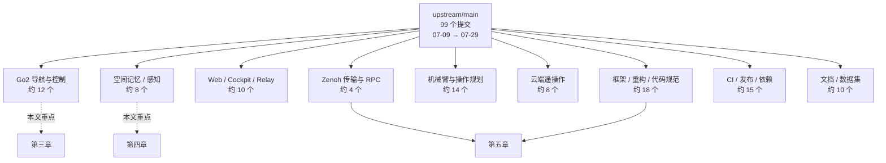

## 2.5 与我们直接相关的提交清单

| 提交 | 标题 | 相关度 | 章节 |
|---|---|---|---|
| `53710acec` | Velocity API (#2859) | 极高 | 3.1 |
| `96d2e9a8d` | fix(unitree): marshal stop_movement zero-twist onto the loop thread (#2977) | 极高 | 3.2 |
| `51177c4c7` | holonomic trajectory controller (#2697) | 极高 | 3.3 |
| `aba27d433` | Go2 holonomic Pose tracker trajectory controller (#2948) | 极高 | 3.4 |
| `959b26fd1` | Ivan/feat/go2zenoh (#3141) | 高 | 3.5 |
| `e0a2cb49a` | Fix/ivan/3d planner voxel colors (#2983) | 中 | 3.6 |
| `2cc6d56a1` | fix: better save path for nav recordings (#2796) | 中 | 3.6 |
| `5109eff4f` | fix(memory2): recorder ingress reception_ts + poseless streams (#2927) | 极高 | 4.1 |
| `a93b7daa6` | fix memory issues DIM-1326 (#3149) | 高 | 4.4 |
| `a72af0aaa` | revert(voxels): drop unused time_window mode (#2845) | 中 | 4.3 |
| `c3b9a37da` | Swastika/docs/navigation relocalization (#2764) | 高 | 4.5 |
| `0be2f0ec7` | quick fiduciary 3d printable generator (#3166) | 高 | 4.6 |
| `68704fa6e` | feat: blueprint namespaces (#2725) | 高 | 5.1 |
| `ed8d1bea7` | Control coordinator refactor to add declarative task (#2959) | 高 | 5.3 |
| `91418fcfe` | Replace RPC with native Zenoh RPC (#3176) | 中 | 5.4 |
| `60f92b43b` | chore: restructure dimos files (part 1) (#3194) | 高（冲突源） | 5.5 |
| `0ecb7cce3` | hosted-teleop: remove quest_hosted and cleanup (#3173) | 高（冲突源） | 5.6 |

---

# 三、Go2 导航与运动控制详解 — 上游本期的主战场

> 这是本期上游投入最重的方向：约 12 个提交、超过 1 万行新代码，全部围绕"让 Go2 沿规划路径走得准、可测量、可复现"。

## 3.1 第一站：Velocity API — 把"摇杆量"换成"米每秒"

文件：`dimos/robot/unitree/connection.py`、`dimos/robot/unitree/go2/connection.py`（提交 `53710acec`）

**问题**：过去所有 `move(twist)` 调用都被翻译成手柄摇杆偏移量下发。控制器里写的 `0.5`，机器人到底走多快？没人能保证，而且随固件版本漂移。

**答案**：新增一条走 `SPORT_MOD` 的 `Move` 请求通道，参数是真实 `x / y / z`（m/s、rad/s），由配置项一键切换。

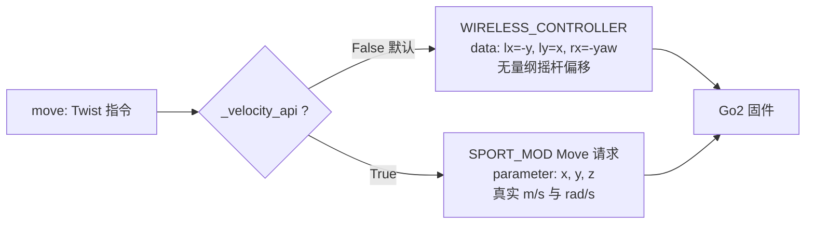

关键实现被收敛到一个私有方法，两条路只在这里分叉：

```python
def _publish_movement(self, x: float, y: float, yaw: float) -> None:
    if self._velocity_api:
        self.conn.datachannel.pub_sub.publish_without_callback(
            RTC_TOPIC["SPORT_MOD"],
            data={
                "header": {"identity": {"id": self._move_ids.next() + 1,
                                        "api_id": SPORT_CMD["Move"]}},
                "parameter": json.dumps({"x": x, "y": y, "z": yaw}),
            },
            msg_type=DATA_CHANNEL_TYPE["REQUEST"],
        )
        return
    self.conn.datachannel.pub_sub.publish_without_callback(
        RTC_TOPIC["WIRELESS_CONTROLLER"],
        data={"lx": -y, "ly": x, "rx": -yaw, "ry": 0},
    )
```

配置入口：

| 位置 | 字段 | 默认 |
|---|---|---|
| `ConnectionConfig` | `velocity_api: bool` | `False` |
| `GO2Connection.blueprint(...)` | `velocity_api=True` | — |
| `make_connection(...)` | `velocity_api` 透传给 `UnitreeWebRTCConnection` | `False` |

> **第二个关键点**：默认仍是手柄仿真，**不会**自动改变我们现有行为。但一旦启用上游的全位姿跟踪控制器，就**必须**同时开 `velocity_api=True` —— 上游 blueprint 的注释明确写了原因："标定件是针对速度接口做的，用默认通道会指令值与实际速度不符，机器人跑得过快并滑过目标点"。

另有两个副产品：`SequentialIds` 用于给每条 Move 请求分配递增 id（新固件要求），断连时的停止指令也统一走 `_publish_movement(0, 0, 0)`，不再手工拼 payload。

## 3.2 第二站：stop_movement 的线程编排修复 — 与我们的旋转停止工作直接相关

文件：`dimos/robot/unitree/connection.py`（提交 `96d2e9a8d`，10 行）

**问题**：`stop_movement()` 直接在调用者线程上执行发布。WebRTC 的 datachannel 归属于连接自己的 asyncio 事件循环线程，跨线程直接 publish 属于未定义行为 —— 表现是**"停"这条零速指令有时根本没发出去**，机器人多转了一段。

**答案**：把零速指令封成协程，用 `run_coroutine_threadsafe` 投递到事件循环线程，并同步等待最多 1 秒确认发出。

```python
async def async_stop() -> None:
    self._publish_movement(0, 0, 0)

if not self.loop.is_running():
    return
try:
    asyncio.run_coroutine_threadsafe(async_stop(), self.loop).result(timeout=1.0)
except Exception as e:
    logger.warning("Failed to publish stop twist: %s", e)
```

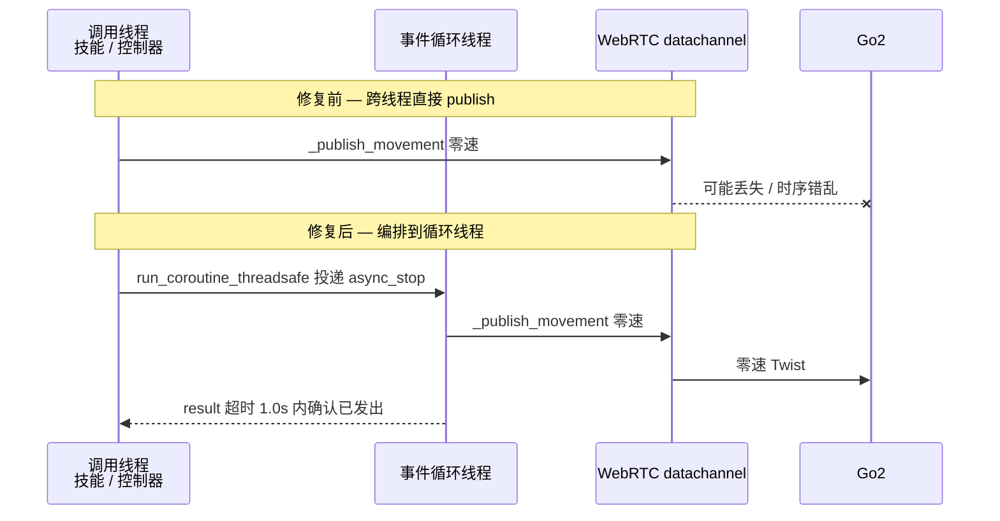

> **第三个关键点**：我们本地在 `jiangtao/scripts/validate_go2_rotation_stop.py` 与 `20260729-Go2旋转反馈时间戳与零速度执行真机验证报告.md` 里排查的"零速下发到实际停转的延迟"，上游这个补丁正好动的是同一条路径。合并后要重跑那份验证：一部分我们观测到的延迟可能由这里解释，也可能与我们本地的 `rotate min stick 0.2` 标定（`ba00a2136`）叠加产生新行为。

## 3.3 第三站：dannav 全位姿轨迹控制栈 — 3200 行新代码

提交 `51177c4c7`，新增目录 `dimos/navigation/dannav/`。这是**规划侧**的新控制链，与 3.4 的**控制侧**任务是两套并行实现。

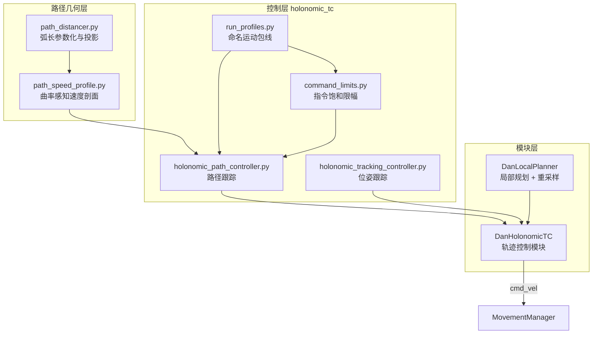

### 运动包线（run profile）—— 现场调参的主旋钮

`GO2_RUN_PROFILES` 里预置了三档，全部是 SI 单位上界：

| 字段 | `walk` | `trot` | `run_conservative` | 含义 |
|---|---|---|---|---|
| `requested_planner_speed_m_s` | 0.55 | 1.0 | 1.5 | 请求巡航速度（仍会被曲率/减速段压低） |
| `max_tangent_accel_m_s2` | 1.0 | 1.5 | 2.0 | 沿路径加速度上限 |
| `max_normal_accel_m_s2` | 0.6 | 0.8 | 1.0 | 向心（曲率）加速度上限 |
| `goal_decel_m_s2` | 1.0 | 1.2 | 1.5 | 接近目标的减速度 |
| `max_planar_cmd_accel_m_s2` | 5.0 | 5.0 | 6.0 | `cmd_vel` 平面变化率上限 |
| `max_yaw_rate_rad_s` | 1.0 | 1.2 | 1.0 | 偏航角速度上限 |
| `max_yaw_accel_rad_s2` | 5.0 | 5.0 | 4.0 | 偏航角加速度上限 |

四种设置途径（来自上游 `docs/run_profiles.md`）：

| 途径 | 写法 | 状态 |
|---|---|---|
| Blueprint | `DanHolonomicTC.blueprint(run_profile="walk")` | 部署时生效 |
| CLI 覆盖 | `dimos run <bp> -o danholonomictc.run_profile=trot` | 部署时生效 |
| 模块默认 | 省略即 `"walk"` | 生效 |
| 运行时 RPC | `DanHolonomicTC.set_run_profile("trot")` | 已实现，暂无生产调用方 |

> 注意：原先的环境变量 `GO2_RUN_PROFILE`（即 `GlobalConfig.go2_run_profile`）**已被移除**，改用 blueprint 或 CLI 模块配置。

### 新 blueprint：`unitree-go2-mls-htc`

文件 `dimos/robot/unitree/go2/blueprints/navigation/unitree_go2_mls_htc.py`，把体素建图 + MLS 3D 规划 + 全位姿轨迹控制串成一条完整链：

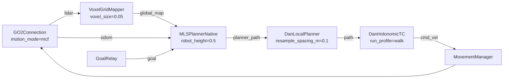

值得记的两个现场参数：`go2_lidar_height = 0.5`（Go2 头部雷达实际离地约 0.3 m，但 MLS 规划器在 0.5 时表现更好，是经验值）；`resample_spacing_m=0.1`（把 MLS 输出的锯齿路径重采样平滑）。

## 3.4 第四站：Go2 全位姿位姿跟踪任务 + 打分台架 — 7400 行新代码

提交 `aba27d433`，是本期单笔最大的 Go2 相关改动。它走的是 `ControlCoordinator` 任务体系（而非 3.3 的独立模块），新增三个跟踪任务和一整套基准测试设施。

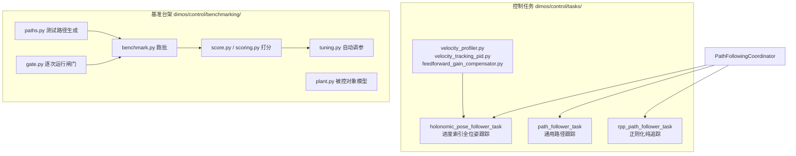

### 进度索引参考的实现要点

核心类是 `ProgressPathReference`（`progress_reference.py`）。三个设计决策值得记：

1. **弧长参数化，不用时钟**：每拍把机器人位置投影到路径上得到进度 `s_robot`，参考位姿取路径在 `s_robot + lookahead` 处的插值。上游原话是"机器人落后了参考就等它；重新规划只需重新投影，没有时钟要重置，也不用从静止重新加速"。
2. **航向是规划器指令的航向，不是路径切线**：`yaw` 沿弧长插值，与位置同等对待。这正是 1.5 讲的"面朝走廊尽头横穿窄门"能力。
3. **投影窗口化且近乎单调**：每次只在 `[s_prev - back_m, s_prev + window_m]` 区间内搜索，避免闭合路径（起点即终点）在第一拍就匹配到远端；同时允许有界回退，让参考能等被推后的机器人。

另外一个细节：路径上重合的相邻航点会被折叠，但**保留后一个的 yaw** —— 这样"原地转向提示"可以作为该站点的航向目标存活下来。

### 两个控制器的取舍

| 场景 | 用哪个 | 原因 |
|---|---|---|
| 路径带指令航向、需要横移 | `holonomic_pose_follower` | 同时跟踪位置与偏航 |
| 只有位置、想让机器人脸朝走向 | `rpp_path_follower` | RPP 天然朝切线方向 |
| 两个都挂在一个 coordinator 里 | **禁止** | 会互相抢底盘关节 |

### 四个新 blueprint

| blueprint | 作用 |
|---|---|
| `unitree-go2-holonomic-controller` | 纯 LCM 接口的全位姿控制进程，`/path` + `/speed` 进，`/cmd_vel` 出 |
| `unitree-go2-holonomic-benchmark` | 上者 + Benchmarker 同进程，用内置路径电池跑批 |
| `unitree-go2-rpp-controller` | RPP 版本的同构控制进程 |
| `unitree-go2-rpp-benchmark` | RPP 版本的跑批 |

接口约定（两个 controller 完全一致）：

| 方向 | 端口 | 话题 | 类型 |
|---|---|---|---|
| IN | `path` | `/path` | `nav_msgs/Path` |
| IN | `speed` | `/speed` | `std_msgs/Float32`（本期新增的消息类型） |
| OUT | `odom` | `/go2/odom` | `geometry_msgs/PoseStamped` |
| OUT | `cmd_vel` | `/cmd_vel` | `geometry_msgs/Twist` |
| 操作员闸门 | `operator_command` | `/benchmark/gate` | `std_msgs/Int8` |
| 观测 | `joint_state` | `/coordinator/joint_state` | `sensor_msgs/JointState`（positions = x, y, yaw） |

任务优先级设计：`vel_go2` 键盘遥操作任务优先级 20，跟踪任务优先级 10 —— 按住 WASD 就抢占跟踪器，用于两次跑批之间手动摆位；`KeyboardTeleop.blueprint(publish_only_when_active=True)` 保证松手就不再发 Twist，因此能与跟踪器共存。

**自标定**：跟踪器在收到第一条路径时，从随代码提交的位姿域标定件 `artifacts/go2_posedomain.json` 自举 —— 各轴 P 增益来自被控对象拟合、前馈增益求逆、实测包线上限。这意味着上游已经对 Go2 做过一次系统辨识，标定结果是版本化的。

## 3.5 第五站：Go2 Zenoh 栈 — 跨网段跑导航

提交 `959b26fd1` 新增 `dimos/robot/unitree/go2/zenoh/`，包含 `zenohconnection.py`（185 行）与 4 个 blueprint：

| blueprint | 说明 |
|---|---|
| `go2-zenoh-basic` | 基础连接 |
| `go2-zenoh-nav` | 导航栈 |
| `go2-zenoh-htc` | 带全位姿轨迹控制 |
| `go2-zenoh-raycaster` | 光线投射建图 |

配套还加了 `foxglove_msgs/CompressedVideo` 与 `std_msgs/String` 两个消息类型，以及 MLS 规划器的可视化模块 `mls_planner/viz.py`。

> 对我们的意义：现场 4G 远程链路目前靠 WebRTC，Zenoh 路线是另一条候选。合并后可以拿 `go2-zenoh-nav` 直接对比时延与稳定性，不必自己再写一层。

## 3.6 第六站：两个小而实用的修复

**规划器可视化配色**（`e0a2cb49a`，`mls_planner/utils/plan_rrd.py` +121 行）：MLS 规划器在 Rerun 里画搜索面、节点、加权边时的着色重做。配合 blueprint 里的 `planner_viz_hz`（默认 0.0 关闭，调高即开）可以看到规划器"想过什么"，排查绕路问题很有用。

**导航录制保存路径**（`2cc6d56a1`）：把录制落盘目录收敛到 `dimos/constants.py` 的常量，`unitree_go2_mid360_record` 与 `unitree_go2_nav_3d` 两个 blueprint 同步改用。注意 `dimos/constants.py` 是我们本地也改过的文件，属于冲突点。

## 3.7 完整的 Go2 控制链 — 本期后的全貌

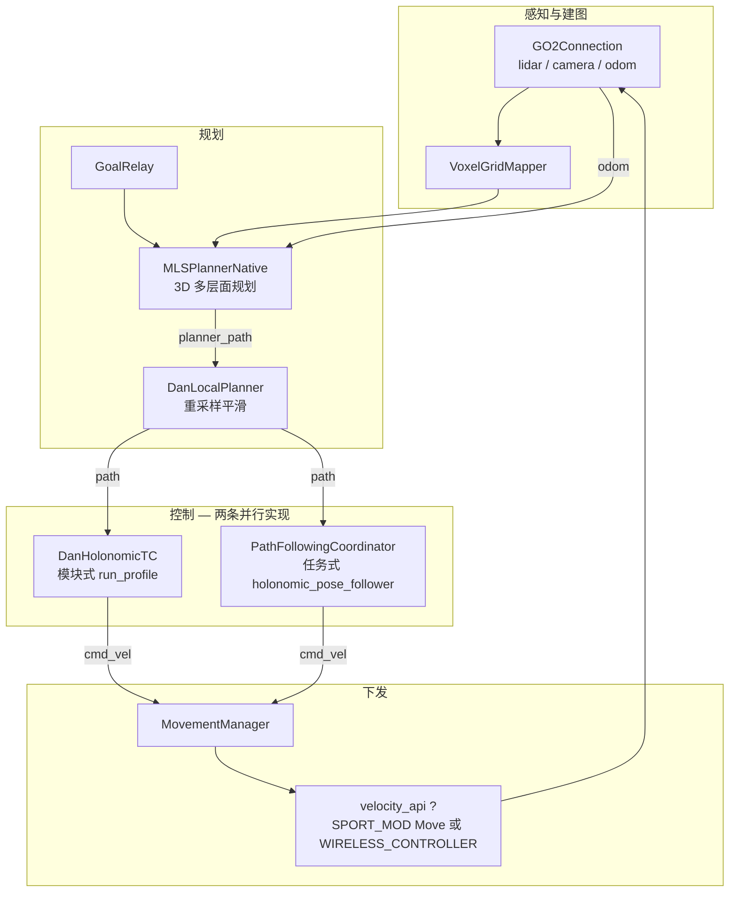

---

# 四、空间记忆与重定位详解 — 核心冻结、周边补齐

> **本章最重要的结论先说**：`dimos/memory2` 的核心逻辑本期**几乎没有改动** —— 20 天里只有 1 个实质性修复（14 行）、1 个测试瘦身、1 个后端小改。上游本期把精力放在了周边：重定位文档重写、AprilTag 标定物 3D 打印生成器、以及 Rerun 侧的内存修复。对我们正在做的重定位 / ICP 地图合并工作来说，**上游 API 面基本稳定，合并风险低**。

## 4.1 第一站：Recorder 的接收时间戳与无位姿流

文件：`dimos/memory2/module.py`（提交 `5109eff4f`，10 增 4 删）

**问题一**：Recorder 内部有一个合并式的分发队列。消息真正被处理时已经排队了一段时间，落库时打的时间戳失真，事后对齐传感器与位姿时对不上。

**问题二**：有些流天生没有位姿可锚定（指令流、命令流），但 Recorder 会对每条这类消息打一条 warning，日志被刷爆。

**答案**：入队前先盖上到达时间戳，并显式声明哪些端口是"无位姿流"。

```python
class RecorderConfig(MemoryModuleConfig):
    # 天生没有位姿可锚定的端口名（命令流等）
    poseless_streams: list[str] = Field(default_factory=list)
```

```python
async def on_msg(stamped: tuple[float, Any]) -> None:
    recv_ts, msg = stamped
    ts = self._resolve_ts(name, msg)
    pose = await self._resolve_pose(name, msg, ts)
    if not pose and name not in self.config.poseless_streams:
        logger.warning("[%s] No pose for time %s ...", name, ts, ...)
    stream.append(msg, ts=ts, pose=pose, tags={"reception_ts": recv_ts})

# 在合并式分发队列之前盖上到达时间
stamped = input_topic.pure_observable().pipe(ops.map(lambda msg: (time.time(), msg)))
self.process_observable(stamped, on_msg)
```

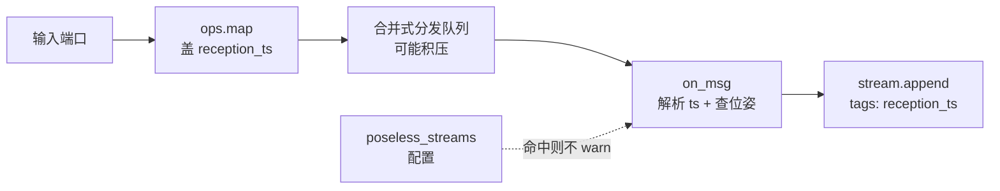

> **第四个关键点**：`reception_ts` 现在作为 tag 存进每条观测。做事后时序分析时，**同一条记录里同时有"消息自带时间戳"和"框架收到时间戳"**，两者之差就是链路时延 —— 这对我们排查 4G 链路下的传感器滞后是现成的工具。

## 4.2 第二站：JPEG 编解码测试改用合成帧

文件：`dimos/memory2/codecs/test_codecs.py`（提交 `9481d789e`，10 增 16 删）

原来测 JPEG codec 要拉一个 84 MB 的 LFS 数据集，本地跑测试和 CI 都被拖慢。改成程序生成合成帧。对我们的意义很直接：`uv run pytest dimos/memory2` 不再需要那份 LFS 资产。

## 4.3 第三站：VoxelGrid 回退 time_window 模式

文件：`dimos/mapping/voxels.py`（提交 `a72af0aaa`，-31 行）

`VoxelGrid` 里那个"只保留最近一个时间窗内的体素"的模式因为无人使用被移除。**如果我们本地有代码依赖它，合并后会报错** —— 但从本地改动清单看，我们改的是 `dimos/mapping/costmapper.py` 和 `relocalization/`，没碰 `voxels.py`，风险可控。

## 4.4 第四站：Rerun 图像内存修复 — 现场长跑必须知道

文件：`dimos/msgs/sensor_msgs/Image.py`（提交 `a93b7daa6`，DIM-1326）

**问题**：`Image.to_rerun()` 原来按格式分发成 `rr.Image(raw_ndarray)`。彩色图以**原始未压缩数组**灌进 Rerun，长时间跑内存暴涨。

**答案**：彩色图统一改为 JPEG 编码后再交给 Rerun，深度图保持原样。

```python
def to_rerun(self) -> Any:
    """彩色图走 JPEG 编码, 深度图保持原始."""
    match self.format:
        case ImageFormat.DEPTH | ImageFormat.DEPTH16:
            return rr.DepthImage(self.data)
        case ImageFormat.GRAY16:
            return rr.Image(self.data, color_model="L")
        case _:
            return rr.EncodedImage(contents=self.to_jpeg_bytes(), media_type="image/jpeg")
```

同时 `unitree_go2_basic.py` 的 `rerun_config` 加了一行 `"world/lidar": 1`（约 7.7 Hz，blueprint 里默认隐藏）。

> **第五个关键点**：这条修复解释了一类我们可能遇到过的现象 —— Go2 现场跑几十分钟后可视化侧内存持续攀升。它是纯收益，且 `unitree_go2_basic.py` 是我们本地也改过的文件，合并时要保住这两处。

## 4.5 第五站：重定位文档重写

提交 `c3b9a37da`，改动集中在 `docs/capabilities/navigation/`：

| 文件 | 改动 |
|---|---|
| `relocalization.md` | 218 行大改，重写流程与参数说明 |
| `deep_dive.md` | 59 行修订 |
| `index.md` | 18 行修订 |
| `assets/go2_reloc_blueprint.svg` | 新增 342 行 Go2 重定位 blueprint 拓扑图 |
| `assets/go2nav_dataflow.svg` | 数据流图更新 |
| `platforms/quadruped/go2/index.md` | 10 行修订 |

代码零改动 —— 这是**纯文档**提交。但对我们价值不低：上游画出了官方版的 Go2 重定位 blueprint 拓扑，可以和我们本地 `unitree_go2_relocalization_memory_agentic` 的实现对照，看是否有结构性分歧。

## 4.6 第六站：AprilTag 3D 打印生成器 — 现场标定物一条命令搞定

提交 `0be2f0ec7`，新增 `dimos/utils/cli/apriltag3d.py`（753 行），把 `dimos apriltag` 命令从"出 PDF"扩展成"出可 3D 打印的实体标定板"。

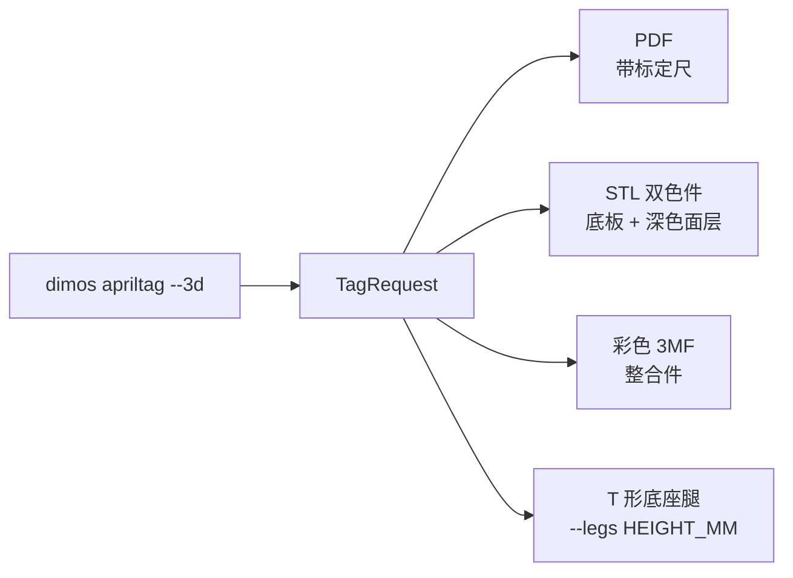

关键参数（全部来自 CLI 帮助文本）：

| 参数 | 默认 | 含义 |
|---|---|---|
| `--3d` | 关 | 除 PDF 外，另出每个 tag 的 STL 对 + 彩色 3MF |
| `--thickness-mm` | 3.0 | 底板厚度 |
| `--marker-mm` | 0.8 | 深色面层深度，即换料层高 |
| `--margin-cells` | 1.0 | 静默区边框，以 tag 格为单位 |
| `--holes` / `--hole-dia-mm` | 开 / 3.4 | 四角安装孔，3.4 mm 是 M3 过孔 |
| `--back-text` / `--text-inlay` | 开 / 开 | 背面刻家族与 ID，并用彩色实体填充刻痕 |
| `--legs HEIGHT_MM` | 0.0 | 生成平铺可打印的 T 形足支腿，高度是地面到 **tag 中心**（即位姿原点）；隐含开启 `--holes` |
| `--leg-thickness-mm` | 6.0 | 支腿立柱厚度 |
| `--leg-brace` | 开 | 立柱背面加三角加强筋 |

> **第六个关键点**：`--legs` 的高度定义是"地面到 tag 中心"，也就是标定物的**位姿原点**。这个约定很关键 —— 打印出来的支腿高度可以直接作为 tag 在世界坐标里的 z，不用现场量。这对我们做重定位地面真值标定是省事的。

同期 `dimos/perception/fiducial/` 下 `marker_detect.py` / `marker_pose.py` / `marker_transformer.py` 有小幅调整并补了测试。

## 4.7 本章小结：空间记忆链在本期后的样子

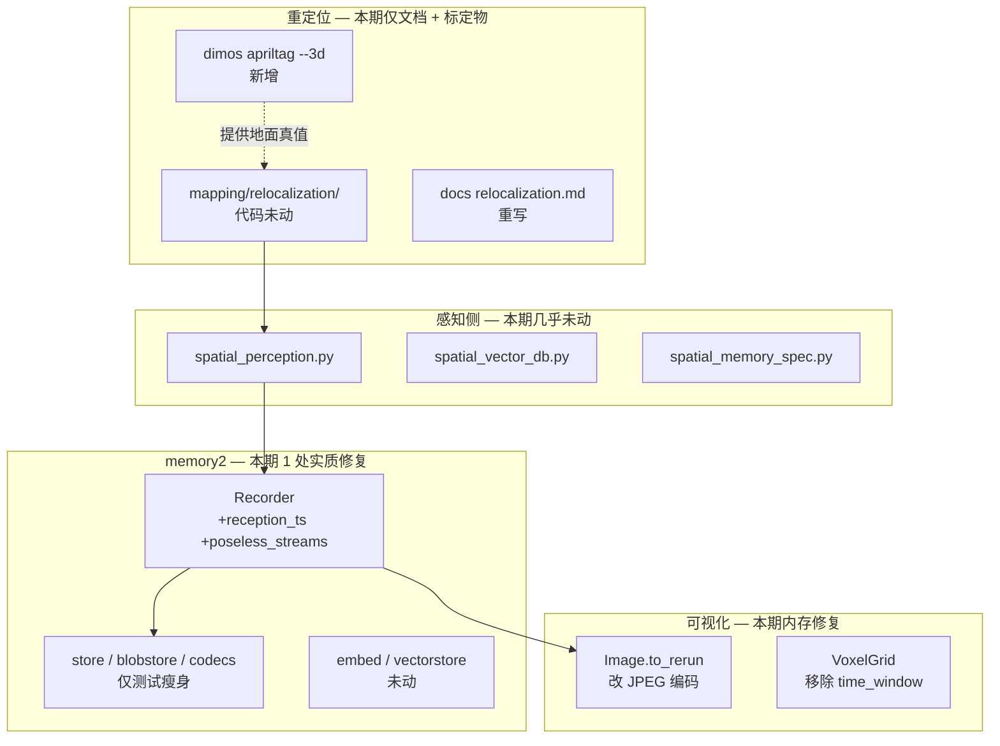

---

# 五、框架与平台侧变化 — 合并前必须知道的结构调整

## 5.1 Blueprint 命名空间（`68704fa6e`）

`autoconnect` 与 `ModuleCoordinator` 支持命名空间，同一个 blueprint 可以多实例部署而不撞名。配套新增 `unitree-go2-multi` 与 `unitree-go2-multi-teleop` 两个多机 blueprint。改动落在 `blueprints.py`（+170）与 `module_coordinator.py`（+383）—— 这两个文件我们本地也改过（`blueprints.py`），是主要冲突面之一。

## 5.2 外部 blueprint 注册与嵌套配置覆盖

- `61b6fe729`：新增 `dimos/robot/external_blueprints.py`，第三方包可以把自己的 blueprint 注册进 `dimos run`，不必改 `all_blueprints.py`。
- `66ce4235c`：修复 `-o` 覆盖嵌套模块配置时会整段替换而非合并的问题。我们大量使用 `-o module.field=value`，这是纯收益。
- `1297afd7b`：新增 `dimos cache clean`，统一清理 native 构建产物、deno、mesh 缓存。

## 5.3 ControlCoordinator 声明式任务重构（`ed8d1bea7` + `56af113d2` + `5089e2c0e`）

三个提交合起来把控制协调器改成声明式：

| 提交 | 变化 |
|---|---|
| `ed8d1bea7` | `coordinator.py` 大改（489 行），新增 `routing.py`，各任务从 `xxx_task.py` 里的注册逻辑抽到独立 `_registry.py` |
| `56af113d2` | 取消输入流的固定白名单 —— 任意 In 流都能路由进协调器 |
| `5089e2c0e` | 协调器输出**按机器人拆分**的 `JointState` 流 |

> **第七个关键点（冲突预警）**：任务注册文件的命名/位置本期有调整。我们本地改了 `velocity_task/__registry__.py`、`teleop_task/__registry__.py`、`trajectory_task/__registry__.py`、`servo_task/__registry__.py`，而上游对应的是 `_registry.py` 且内容重写。这一块合并时**不要指望 git 自动合**，要按上游新结构重新落我们的改动。

## 5.4 Zenoh 传输与原生 RPC（`ec31b461e` + `91418fcfe`）

- `ec31b461e`：Rust 侧 Zenoh 支持 + transport API 重构。
- `91418fcfe`（DIM-1145）：新增 `dimos/protocol/rpc/zenohrpc.py`（197 行），从 `pubsubrpc.py` 里移掉 27 行旧路径，RPC 改走 Zenoh 原生查询而非在 pub/sub 上模拟。我们本地改过 `dimos/protocol/rpc/spec.py`，需要复核。

## 5.5 文件结构重构（`60f92b43b`、`28cd3f228`、`07d58dbee`）

| 旧路径 | 新路径 | 出处 |
|---|---|---|
| `dimos/learning/` | `dimos/imitation/` | `60f92b43b` |
| `dimos/core/tests/`（demo 类） | `dimos/core/demos/` | `60f92b43b` |
| `dimos/agents/testing.py` | `dimos/agents/testing/mock_model.py` | `60f92b43b` |
| `dimos/agents/agent_test_runner.py` | `dimos/agents/testing/agent_test_runner.py` | `60f92b43b` |
| `dimos/agents/vlm_stream_tester.py` | `dimos/agents/testing/vlm_stream_tester.py` | `60f92b43b` |
| `dimos/mapping/utils/cli/` | `dimos/mapping/cli/` | `0be2f0ec7` |
| **`dimos/robot/cli/`** | **`dimos/cli/`** | `07d58dbee` |
| **`dimos/utils/cli/`** | **`dimos/cli/`** | `07d58dbee` |
| `dimos/utils/docs/doclinks.py` | `dimos/cli/doclinks.py` | `07d58dbee` |
| `get_project_root()` | 已删除 | `28cd3f228` |

`07d58dbee`（*chore: group cli together*）把原先并存的两套 CLI 目录合并成一个 `dimos/cli/` —— **`dimos/robot/cli/` 和 `dimos/utils/cli/` 现在都不存在了**。61 个文件被移动，内容基本只改 import。

> **冲突预警**：我们本地改过 `dimos/robot/cli/dimos.py`、`dimos/robot/cli/tell.py`、`dimos/utils/cli/tell_robot.py`、`dimos/core/tests/demo_devex.py`、`dimos/mapping/utils/cli/summary.py` —— 这 5 个文件的父目录全部被上游搬走，都会是 rename/modify 冲突。其中 `dimos/robot/cli/dimos.py` 是我们改动较多的文件（加过子命令），要重点核对。

## 5.6 quest_hosted 被整体删除（`0ecb7cce3`）

`dimos/teleop/quest_hosted/` **目录已不存在**。相关能力迁到：

| 旧文件 | 新位置 |
|---|---|
| `quest_hosted/sdp.py` | `dimos/protocol/pubsub/impl/webrtc/providers/sdp.py` |
| `quest_hosted/video_track.py` | `dimos/protocol/pubsub/impl/webrtc/providers/video_track.py` |
| `quest_hosted/hosted_teleop_module.py` | 拆入 `dimos/teleop/hosted/*` |
| blueprint `teleop-hosted-go2` | 改名 `teleop-hosted-go2-multicam`，模块路径 `dimos.teleop.hosted.blueprints.cloudflare` |

> **冲突预警（最需要注意的一处）**：我们本地改过 `quest_hosted/sdp.py` 与 `quest_hosted/video_track.py`。合并时 git 会报 delete/modify —— **必须手工把我们的改动搬到 `dimos/protocol/pubsub/impl/webrtc/providers/` 下的同名文件**，否则改动会静默丢失。

## 5.7 Web / Cockpit 新栈（`04566056f` → `66cd4d916`）

上游用 5 个 PR 搭了一条全新的浏览器侧链路：Deno 运行时 → Relay 中继 → Python 客户端 → E2E → 协议 v2 可靠流 → Cockpit 浏览器会话客户端 + UI。新增目录 `dimos/web/relay_bridge/` 与 `web/relay/`。这块与我们当前工作无交集，但它引入了 Deno 依赖（`dimos/utils/deno.py`），首次运行会下载工具链 —— 现场无外网设备要留意。

## 5.8 其他值得一提的

| 提交 | 内容 |
|---|---|
| `109146dc7` | 用 `aiohttp` 替换 `httpx` |
| `d15aa0973` | macOS 上设置 OpenMP 被动等待策略，降低空转 CPU |
| `76c4a0adc` / `94e48c2fa` | 代码规范：禁止无用 `_` 变量、禁止 `__new__` |
| `bdf0e9938` → `df8ef3c7f` | ArduinoModule 加入后当天被回退 |
| `95836028e` / `bf859ac24` | 新增 zed_office_hd 立体与 xarm6 世界信念数据集 |
| `de6c8f090` / `9e148c16f` / `f2ad044f6` | 新增 Galaxea A1Z、OpenYAM 支持与 RoboPlan 多机规划 |

---

# 六、端到端实战 — 评估合并影响并跑通新导航栈

## 6.1 冲突面清单：本地与上游都改过的 18 个文件

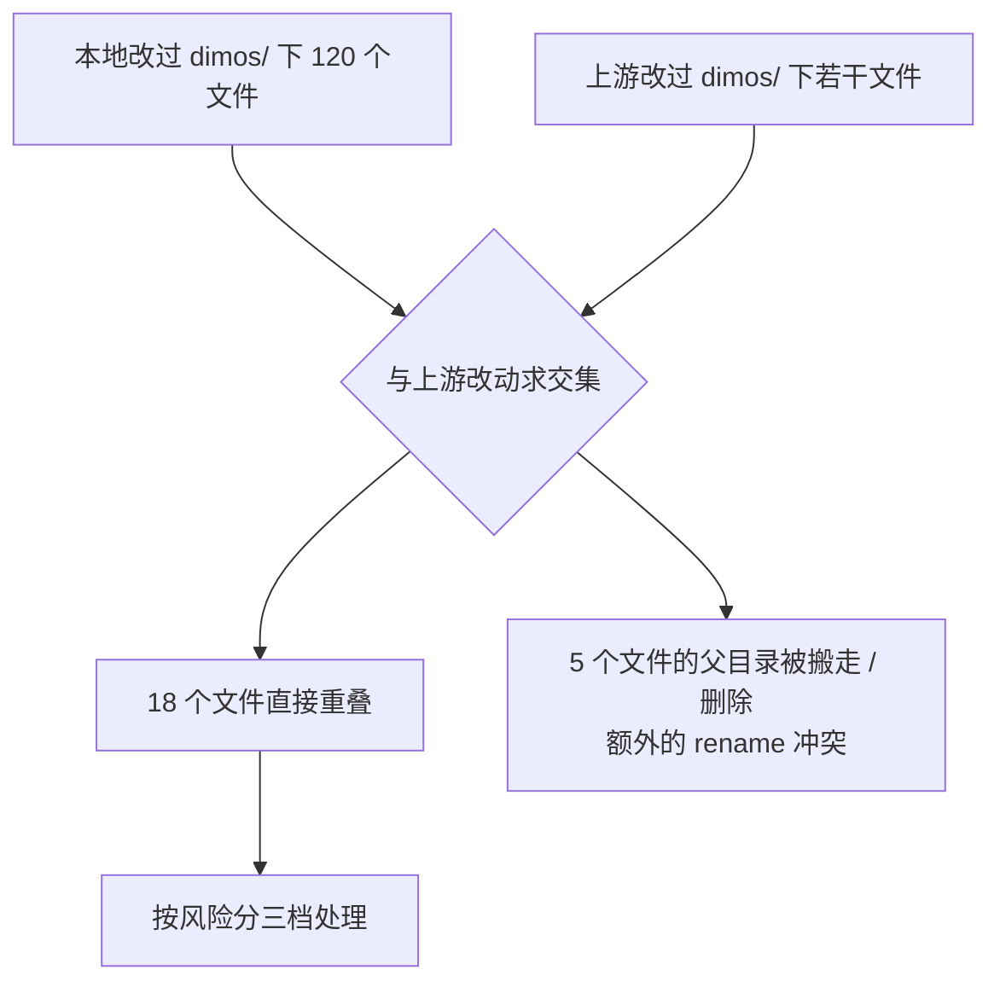

| 文件 | 上游为什么改 | 风险 |
|---|---|---|
| `dimos/robot/unitree/connection.py` | Velocity API + stop_movement 线程编排 | **高** — 我们改过 rotate 标定与停止逻辑 |
| `dimos/robot/unitree/go2/connection.py` | `velocity_api` 配置透传 | **高** |
| `dimos/robot/unitree/test_connection.py`、`go2/test_connection.py` | 配套测试 | 高 |
| `dimos/control/tasks/cartesian_ik_task/_registry.py` 等注册表 | 声明式任务重构 | **高** — 命名与结构都变了 |
| `dimos/core/coordination/blueprints.py` | blueprint 命名空间 | **高** |
| `dimos/robot/all_blueprints.py` | 自动生成，条目大量增删 | 中 — 合并后重新生成即可 |
| `dimos/robot/unitree/go2/blueprints/basic/unitree_go2_basic.py` | rerun_config 加 `world/lidar` | 中 |
| `dimos/constants.py` | 导航录制路径常量 | 中 |
| `dimos/core/global_config.py` | 移除 `go2_run_profile`、命名空间字段 | 中 |
| `dimos/robot/unitree/unitree_skill_container.py` | 随连接层调整 | 中 |
| `dimos/robot/unitree/mujoco_connection.py`、`dimsim_connection.py` | 随连接层调整 | 中 |
| `dimos/teleop/keyboard/keyboard_teleop_module.py` | 遥操作调整 | 中 |
| `dimos/agents/mcp/mcp_client.py` | 随 testing 模块搬迁 | 低 |
| `dimos/manipulation/planning/factory.py` | 操作规划组 | 低 |
| `dimos/navigation/replanning_a_star/global_planner.py` | `path_distancer` 小改 | 低 |
| `dimos/simulation/engines/mujoco_engine.py` | 仿真调整 | 低 |

额外的**目录级冲突**（git 不会自动处理）：

| 本地改过的文件 | 上游动作 | 必须做的事 |
|---|---|---|
| `dimos/teleop/quest_hosted/sdp.py`、`video_track.py` | 目录整体删除 | 手工迁到 `dimos/protocol/pubsub/impl/webrtc/providers/` |
| `dimos/robot/cli/dimos.py`、`robot/cli/tell.py` | 目录并入 `dimos/cli/` | 改动搬到 `dimos/cli/` 下同名文件 |
| `dimos/utils/cli/tell_robot.py` | 目录并入 `dimos/cli/` | 同上 |
| `dimos/core/tests/demo_devex.py` | 目录改名为 `core/demos/` | 改动搬到新路径 |
| `dimos/mapping/utils/cli/summary.py` | 目录上移为 `mapping/cli/` | 改动搬到新路径 |

## 6.2 必须做的

| 项目 | 操作 |
|---|---|
| 迁移 quest_hosted 改动 | `sdp.py` / `video_track.py` 的本地改动搬到 `dimos/protocol/pubsub/impl/webrtc/providers/`，否则静默丢失 |
| 迁移 CLI 改动 | `dimos/robot/cli/` 与 `dimos/utils/cli/` 下我们加的子命令搬到 `dimos/cli/` |
| 重新生成 blueprint 注册表 | `pytest dimos/robot/test_all_blueprints_generation.py` — `all_blueprints.py` 是自动生成的，冲突不要手工解 |
| 检查 `GO2_RUN_PROFILE` 用法 | 该环境变量与 `GlobalConfig.go2_run_profile` 已删除，改用 blueprint 参数或 `-o` |
| 重新对齐控制任务注册表 | 我们改过的 `*_task/__registry__.py` 与上游重写后的 `_registry.py` 结构不同，按新结构重落 |
| 重跑旋转停止验证 | `96d2e9a8d` 动了零速下发路径，我们 07-29 的验证结论需要复核 |

## 6.3 建议做的

| 项目 | 操作 |
|---|---|
| 同步依赖 | `uv sync --extra all` — 本期换了 aiohttp、加了 Deno 与 RoboPlan |
| 清一次缓存 | 新命令 `dimos cache clean`，重构后旧的 native 产物可能失配 |
| 试跑新导航栈 | `dimos --replay run unitree-go2-mls-htc`，先在回放数据上看效果 |
| 评估 Zenoh 链路 | `go2-zenoh-nav` 与我们现有 4G WebRTC 方案做时延对比 |
| 打一套实体标定板 | `dimos apriltag 0-5 --3d --legs 1200`，替换现在的纸质标定物 |
| 读上游重定位文档 | `docs/capabilities/navigation/relocalization.md` 已重写，与我们实现对照 |
| 给 Recorder 声明无位姿流 | `Recorder.blueprint(poseless_streams=[...])` 消除日志刷屏 |

## 6.4 不需要做的

| 项目 | 原因 |
|---|---|
| 改现有 `move()` 调用 | `velocity_api` 默认 `False`，行为与合并前一致，不会自动改变 |
| 迁移到新的轨迹跟踪栈 | 两套新实现都是独立 blueprint / 任务，不影响现有 `replanning_a_star` 链路 |
| 动 CI 配置 | 本期 15 个 CI/发布提交对我们透明，照跑即可 |
| 关心 Web / Cockpit | 全新目录 `dimos/web/relay_bridge/` 与 `web/`，与我们无交集 |
| 关心机械臂相关的 35 个特性提交 | xArm / Piper / OpenYAM / A1Z / RoboPlan 与 Go2 无交集 |
| 改 `voxels.py` 相关代码 | 移除的 `time_window` 模式我们没用过 |

## 6.5 上游删除的文件清单

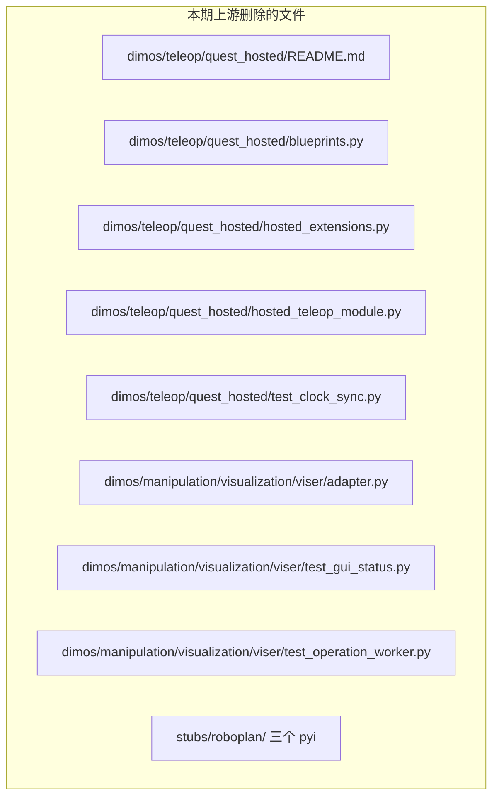

另有被**移除的配置项**：`GlobalConfig.go2_run_profile`、`VoxelGrid` 的 `time_window` 模式、`get_project_root()` 函数。

## 6.6 建议的合并顺序

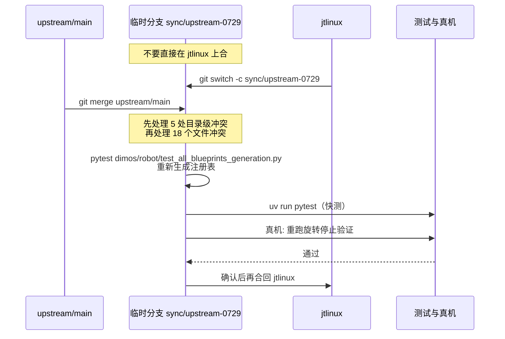

关键命令：

```bash
# 1. 建同步分支, 不在业务分支上直接合
git switch -c sync/upstream-0729 jtlinux
git merge upstream/main

# 2. 先看目录级冲突（delete/modify、rename/modify）
git status --short | grep -E '^(DU|UD|AU|UA)'

# 3. 冲突解完后重新生成 blueprint 注册表（这个文件是自动生成的）
source .venv/bin/activate
pytest dimos/robot/test_all_blueprints_generation.py

# 4. 快测
uv run pytest

# 5. 确认新导航栈能起（回放数据, 不接机器人）
dimos list | grep -E 'holonomic|mls-htc|zenoh'
dimos --replay run unitree-go2-mls-htc --daemon
dimos log -f
dimos stop
```

## 6.7 真机验证清单：合并后必须重跑的三项

| 项 | 为什么 | 命令 / 脚本 |
|---|---|---|
| 旋转停止时序 | 上游 `96d2e9a8d` 改了零速下发路径，可能与我们的 `rotate min stick 0.2` 标定叠加 | `python jiangtao/scripts/validate_go2_rotation_stop.py` |
| 重定位 + ICP 地图合并 | `memory2` 的 `reception_ts` 改了落库 tag，确认我们的解析脚本兼容 | `python jiangtao/scripts/debug_relocalize.py` |
| 长跑内存 | `Image.to_rerun` 改 JPEG 后，确认可视化侧内存曲线改善 | `dimos run ... --viewer rerun` 后观察 30 分钟 |

## 6.8 试用上游新导航栈的最小路径

如果只想先感受一下全位姿跟踪（不动我们现有栈）：

```bash
# 纯控制进程, 路径从任意来源经 /path 进来
dimos run unitree-go2-holonomic-controller --robot-ip 192.168.123.161

# 或者用上游内置的路径电池跑批打分
dimos run unitree-go2-holonomic-benchmark --robot-ip 192.168.123.161

# 换运动包线（walk / trot / run_conservative）
dimos run unitree-go2-mls-htc -o danholonomictc.run_profile=trot
```

> 提醒：`unitree-go2-holonomic-controller` 内部已经写死 `GO2Connection.blueprint(velocity_api=True)`。**不要**把它降级成默认通道 —— 标定件是针对速度接口做的。

---

# 七、扩展点和延伸阅读

## 7.1 想自己加一档运动包线

编辑 `dimos/navigation/dannav/holonomic_tc/run_profiles.py`，往 `GO2_RUN_PROFILES` 里加一项。注册表键必须等于 `RunProfile.name`，所有数值字段必须是正有限浮点数，否则构造时就抛 `RunProfileError`：

```python
GO2_RUN_PROFILES = RunProfileRegistry(
    profiles={
        # ... 已有的 walk / trot / run_conservative ...
        "indoor_slow": RunProfile(
            name="indoor_slow",           # 必须与字典键一致
            requested_planner_speed_m_s=0.3,
            max_tangent_accel_m_s2=0.6,
            max_normal_accel_m_s2=0.4,
            goal_decel_m_s2=0.8,
            max_planar_cmd_accel_m_s2=3.0,
            max_yaw_rate_rad_s=0.8,
            max_yaw_accel_rad_s2=3.0,
        ),
    },
)
```

然后 `dimos run <bp> -o danholonomictc.run_profile=indoor_slow` 即可。

## 7.2 想给 Recorder 声明无位姿流

```python
Recorder.blueprint(
    poseless_streams=["cmd_vel", "operator_command"],
)
```

这样这些端口不会再刷 "No pose for time ..." 警告，落库时依然带 `reception_ts` tag。

## 7.3 想打一套现场标定板

```bash
# 出 PDF + STL + 3MF, 并生成到 tag 中心离地 1.2m 的支腿
dimos apriltag 0-5 --3d --legs 1200 --size-mm 150 --out ./tags/
```

打印时按 `--marker-mm 0.8` 换料，背面刻字用 `--text-inlay` 填色。支腿高度参数是**地面到 tag 中心**，直接就是位姿原点的 z。

## 7.4 参数 cheatsheet

| 想做的事 | 看哪 |
|---|---|
| 切 Go2 下发通道 | `GO2Connection.blueprint(velocity_api=True)`，默认 `False` |
| 调轨迹跟踪速度包线 | `DanHolonomicTC.blueprint(run_profile=...)` 或 `-o danholonomictc.run_profile=...` |
| 只改巡航速度不改加速度 | `DanHolonomicTC.blueprint(speed_m_s=1.0)` |
| 看规划器搜索过程 | `unitree_go2_mls_htc.py` 里 `planner_viz_hz`，默认 0.0 |
| 改 MLS 规划器认为的雷达高度 | `unitree_go2_mls_htc.py` 里 `go2_lidar_height`，Go2 用 0.5 而非实际 0.3 |
| 平滑 MLS 输出的锯齿路径 | `DanLocalPlanner.blueprint(resample_spacing_m=0.1)` |
| 关掉 Recorder 的无位姿警告 | `Recorder.blueprint(poseless_streams=[...])` |
| 查链路时延 | 观测记录里 `reception_ts` tag 减去消息自带 ts |
| 清理构建缓存 | `dimos cache clean` |
| 上游重定位官方拓扑图 | `docs/capabilities/navigation/assets/go2_reloc_blueprint.svg` |
| 全位姿控制器接口约定 | `unitree_go2_holonomic_controller.py` 的模块 docstring |
| 运动包线契约文档 | `dimos/navigation/dannav/holonomic_tc/docs/run_profiles.md` |

## 7.5 推荐按这个顺序读上游源码

1. `dimos/robot/unitree/go2/blueprints/basic/unitree_go2_holonomic_controller.py` — 模块 docstring 就是一份完整设计说明，先读它
2. `dimos/control/tasks/holonomic_pose_follower_task/progress_reference.py` — 进度索引参考的核心
3. `dimos/navigation/dannav/holonomic_tc/docs/run_profiles.md` — 运动包线契约与限幅流
4. `dimos/robot/unitree/go2/blueprints/navigation/unitree_go2_mls_htc.py` — 完整导航栈拓扑
5. `docs/capabilities/navigation/relocalization.md` — 本期重写的重定位文档
6. `dimos/memory2/architecture.md` — 空间记忆架构（本期未改，仍是有效参考）

## 7.6 新文件与新 blueprint 索引

**新增目录 / 文件（只列与我们相关的）**

| 路径 | 说明 |
|---|---|
| `dimos/navigation/dannav/` | dannav 轨迹控制栈全部代码 |
| `dimos/navigation/dannav/holonomic_tc/run_profiles.py` | `GO2_RUN_PROFILES` 运动包线注册表 |
| `dimos/navigation/dannav/holonomic_tc/docs/run_profiles.md` | 运动包线契约文档 |
| `dimos/navigation/dannav/local_planner/module.py` | `DanLocalPlanner` |
| `dimos/control/tasks/holonomic_pose_follower_task/` | 进度索引全位姿跟踪任务 |
| `dimos/control/tasks/path_follower_task/` | 通用路径跟踪任务 |
| `dimos/control/tasks/rpp_path_follower_task/` | 正则化纯追踪任务 |
| `dimos/control/tasks/rpp_path_follower_task/artifacts/go2_posedomain.json` | Go2 位姿域标定件 |
| `dimos/control/benchmarking/` | 跑批、打分、自动调参台架 |
| `dimos/control/path_following_coordinator.py` | `PathFollowingCoordinator` |
| `dimos/control/routing.py` | 控制协调器输入路由 |
| `dimos/robot/unitree/go2/zenoh/` | Go2 Zenoh 连接与 blueprint |
| `dimos/protocol/rpc/zenohrpc.py` | Zenoh 原生 RPC |
| `dimos/cli/apriltag3d.py` | AprilTag 3D 可打印件生成器 |
| `dimos/cli/cache.py` | `dimos cache clean` |
| `dimos/msgs/std_msgs/Float32.py`、`String.py` | 新消息类型 |
| `dimos/msgs/foxglove_msgs/CompressedVideo.py` | 压缩视频消息 |
| `dimos/navigation/nav_3d/mls_planner/viz.py` | MLS 规划器可视化 |
| `dimos/web/relay_bridge/`、`web/` | Cockpit / Relay 新栈（与我们无交集） |

**新增 Go2 相关 blueprint（10 个）**

| blueprint | 说明 |
|---|---|
| `unitree-go2-mls-htc` | 体素建图 + MLS 3D 规划 + dannav 全位姿轨迹控制 |
| `unitree-go2-holonomic-controller` | 全位姿跟踪独立控制进程 |
| `unitree-go2-holonomic-benchmark` | 上者 + 内置路径电池跑批 |
| `unitree-go2-rpp-controller` | RPP 版独立控制进程 |
| `unitree-go2-rpp-benchmark` | RPP 版跑批 |
| `go2-zenoh-basic` / `go2-zenoh-nav` / `go2-zenoh-htc` / `go2-zenoh-raycaster` | Zenoh 传输下的四个 Go2 栈 |
| `unitree-go2-multi` / `unitree-go2-multi-teleop` | 借 blueprint 命名空间实现的多机 |

## 7.7 99 个提交完整索引

按时间从老到新。类型标注：特性 35、文档 15、CI 11、修复 9、维护 9、重构 6、发布 4、测试 4、数据 2、回退 2、依赖 1、性能 1。

| 序号 | commit | PR | 日期 | 标题 | 类型 |
|---|---|---|---|---|---|
| 1 | `2cc6d56a1` | #2796 | 07-09 | fix: better save path for nav recordings | 修复 |
| 2 | `ec31b461e` | #2753 | 07-09 | feat(transport): rust zenoh support and api refactor | 特性 |
| 3 | `bdf0e9938` | #1879 | 07-09 | feat(arduino): add ArduinoModule with full arduino sim (and real arduino) support | 特性 |
| 4 | `7d3bb364d` | #2832 | 07-10 | Swastika/docs chore/cleanup and fix links | 文档 |
| 5 | `53710acec` | #2859 | 07-10 | Velocity API | 特性 |
| 6 | `51177c4c7` | #2697 | 07-11 | holonomic trajectory controller | 特性 |
| 7 | `66ce4235c` | #2829 | 07-10 | fix(config): merge nested module overrides | 修复 |
| 8 | `3d8b21cb5` | #2836 | 07-10 | fix(mls-planner): macOS fix, link pyo3 cdylib | 修复 |
| 9 | `a72af0aaa` | #2845 | 07-11 | revert(voxels): drop unused time_window mode from VoxelGrid | 回退 |
| 10 | `df8ef3c7f` | #2868 | 07-11 | Revert "feat(arduino): add ArduinoModule with full arduino sim (and r… | 回退 |
| 11 | `61b6fe729` | #2517 | 07-10 | feat: external blueprint registration | 特性 |
| 12 | `23cd255ad` | #2767 | 07-11 | Fix test_basic_deployment in CI | CI |
| 13 | `c602749bf` | #2936 | 07-14 | Run CI on merge queue | CI |
| 14 | `76c4a0adc` | #2928 | 07-15 | fix: disallow unused _ variables | 维护 |
| 15 | `de6c8f090` | #2947 | 07-14 | Add Galaxea A1Z arm in simulation | 特性 |
| 16 | `ce2c71a68` | #2665 | 07-14 | Initial  xArm6 WorldBelief perception stack | 特性 |
| 17 | `8e054ae12` | #2861 | 07-15 | feat(g1-groot): navigation on the real G1 (Point-LIO + raytracing costmap) | 特性 |
| 18 | `c3b9a37da` | #2764 | 07-15 | Swastika/docs/navigation relocalization | 文档 |
| 19 | `27b81078d` | #2967 | 07-15 | docs(teleop): rename Hosted Teleop page to Remote Teleop | 文档 |
| 20 | `30ede4ea0` | #2798 | 07-15 | feat(hosted-teleop): Go2 teleoperation over Cloudflare broker | 特性 |
| 21 | `7f7c303e2` | #2187 | 07-15 | DimSim scene editing/authoring in JS + moving inside dimos | 特性 |
| 22 | `96d2e9a8d` | #2977 | 07-15 | fix(unitree): marshal stop_movement zero-twist onto the loop thread | 修复 |
| 23 | `a29c8a06f` | #2971 | 07-15 | chore: bump version to 0.0.14b1 (beta pre-release) | 发布 |
| 24 | `e7df6f683` | #2982 | 07-16 |  add latency graph and description to hosted teleop page | 文档 |
| 25 | `fda65085f` | #2945 | 07-15 | docs(hosted-teleop): operator how-to + config/architecture refresh | 文档 |
| 26 | `76a335e55` | #2973 | 07-16 | serve LFS media via dimos-docs-assets so it renders on mintlify | 文档 |
| 27 | `a2ad2561e` | #2991 | 07-15 | style(docs): fix trailing whitespace breaking lint on main | 文档 |
| 28 | `ec70097b7` | #2984 | 07-16 | add dimTELE banner | 文档 |
| 29 | `68704fa6e` | #2725 | 07-16 | feat: blueprint namespaces | 特性 |
| 30 | `7a5a5851f` | #2980 | 07-16 | fix: delete dead dimsim code | 维护 |
| 31 | `2a8e728f1` | #2995 | 07-16 | fix: run all tests locally | 测试 |
| 32 | `4f79d1479` | #2347 | 07-16 | add gitHub community files for contributors and AI-assisted development | 文档 |
| 33 | `97727e5fe` | #3003 | 07-16 | fix: large file | 维护 |
| 34 | `e0a2cb49a` | #2983 | 07-17 | Fix/ivan/3d planner voxel colors | 修复 |
| 35 | `94e48c2fa` | #3009 | 07-17 | feat: ban `__new__` | 维护 |
| 36 | `29f355552` | #3007 | 07-16 | fix: remove removed cibuildwheel enable group breaking release builds | 发布 |
| 37 | `92a853a40` | #3013 | 07-17 | [Backport release/0.0.14b1] fix: remove removed cibuildwheel enable group breaking release builds | 发布 |
| 38 | `8500f7409` | #3056 | 07-20 | build(deps): bump the actions group across 1 directory with 6 updates | 依赖 |
| 39 | `2758db862` | #2999 | 07-20 | fix(manipulation): stabilize agentic xArm simulation | 修复 |
| 40 | `e4e703d95` | #3052 | 07-21 | fewer fields | 维护 |
| 41 | `0c8d75f92` | #2866 | 07-21 | Build all GC Roots into Cachix | CI |
| 42 | `4f57654e5` | — | 07-21 | Merge release/0.0.14b1 back to main | 发布 |
| 43 | `ed8d1bea7` | #2959 | 07-20 | Control coordinator refactor to add declarative task | 重构 |
| 44 | `3871007f1` | #3004 | 07-21 | feat(hosted-teleop): Arm hosted teleoperation over the Cloudflare broker | 特性 |
| 45 | `56af113d2` | #3110 | 07-21 | feat(control): removes frozen set of input streams - now Any Input stream can be routed to the control coordinator | 特性 |
| 46 | `9e148c16f` | #3049 | 07-21 | chore: add OpenYAM URDF support | 特性 |
| 47 | `300f48c0d` | #3112 | 07-21 | feat: add Viser robot mesh display options | 特性 |
| 48 | `3bfc1f109` | #3065 | 07-22 | add links to cards | 文档 |
| 49 | `cdd577bfc` | #3060 | 07-22 | [Tests] Add unit tests for SequentialIds | 测试 |
| 50 | `04566056f` | #3042 | 07-22 | feat(web): PR 1 - Deno | 特性 |
| 51 | `959b26fd1` | #3141 | 07-22 | Ivan/feat/go2zenoh | 特性 |
| 52 | `579aefd70` | #3101 | 07-22 | feat: Piper teleop polishing | 特性 |
| 53 | `5bc870302` | #3144 | 07-22 | feat(hosted-teleop): auto-select operator view via robot_type broker config | 特性 |
| 54 | `28cd3f228` | #3131 | 07-23 | chore: remove get_project_root | 维护 |
| 55 | `a66d6a032` | #3067 | 07-23 | Add backport label to Dependabot PRs and check docker weekly | CI |
| 56 | `a93b7daa6` | #3149 | 07-23 | fix memory issues DIM-1326 | 修复 |
| 57 | `306714162` | #2546 | 07-23 | docs(drone): fix dead pre-built RosettaDrone APK link | 文档 |
| 58 | `10793320a` | #2645 | 07-23 | feat: manipulation planning group | 特性 |
| 59 | `aba27d433` | #2948 | 07-23 | Go2 holonomic Pose tracker trajectory controller | 特性 |
| 60 | `2cd122afd` | #3043 | 07-23 | feat(web): PR 2 - Relay | 特性 |
| 61 | `f859247f9` | #3028 | 07-24 | ai disclose rule update | 文档 |
| 62 | `109146dc7` | #2974 | 07-23 | Replace httpx with aiohttp | 重构 |
| 63 | `5109eff4f` | #2927 | 07-23 | fix(memory2): recorder ingress reception_ts + poseless streams | 修复 |
| 64 | `4a78e1400` | #3008 | 07-24 | ci: smoke-build a wheel on PRs touching release build config | CI |
| 65 | `2ec2ba43d` | #2726 | 07-24 | Fix typos and grammar | 文档 |
| 66 | `a3d3547b4` | #3108 | 07-24 | feat: visualize manipulation obstacles | 特性 |
| 67 | `1dbb6c27a` | #3044 | 07-24 | feat(web): PR 3 - Python client | 特性 |
| 68 | `f67661625` | #3045 | 07-24 | feat(web): PR 4 - E2E | 特性 |
| 69 | `3a8599460` | #3027 | 07-25 | Swastika/chore/readme update | 文档 |
| 70 | `41037bb86` | #3167 | 07-24 | Persist dependencies on disk | CI |
| 71 | `b81897314` | #3171 | 07-24 | ci: label first-time contributor PRs | CI |
| 72 | `8f307c08d` | #3165 | 07-25 | Add @Dreamsorcerer as global codeowner | 维护 |
| 73 | `f2ad044f6` | #3155 | 07-25 | feat: add RoboPlan multi-robot planning | 特性 |
| 74 | `d15aa0973` | #3190 | 07-26 | Cut Mac OpenMP spin-wait CPU by setting passive wait policy. DIM-1329 | 性能 |
| 75 | `5089e2c0e` | #3130 | 07-25 | feat(control): per-robot JointState output streams | 特性 |
| 76 | `6b7e25964` | #3174 | 07-26 | chore: clean up .gitignore | 维护 |
| 77 | `0ecb7cce3` | #3173 | 07-25 | hosted-teleop: remove quest_hosted and cleanup | 重构 |
| 78 | `60f92b43b` | #3194 | 07-27 | chore: restructure dimos files (part 1) | 重构 |
| 79 | `0be2f0ec7` | #3166 | 07-27 | quick fiduciary 3d printable generator | 特性 |
| 80 | `abf515258` | #3068 | 07-27 | feat: local relay | 特性 |
| 81 | `ebb59ed5d` | #3208 | 07-27 | Fix uv disk persistence | CI |
| 82 | `84a8515d2` | #3192 | 07-27 | test: pin Drake backend in manipulation integration suite | 测试 |
| 83 | `1297afd7b` | #3178 | 07-27 | feat(cli): add dimos cache clean | 特性 |
| 84 | `95836028e` | #3209 | 07-27 | data: zed_office_hd stereo | 数据 |
| 85 | `68bb0bddb` | #3229 | 07-27 | fix(ci): refetch PR before labeling new contributors | CI |
| 86 | `9481d789e` | #3247 | 07-28 | test(memory2): synthetic frames for jpeg codec case — drop 84MB LFS fetch | 测试 |
| 87 | `020a59f1e` | #3164 | 07-28 | feat: add atomic manipulation obstacle updates | 特性 |
| 88 | `bf859ac24` | #3255 | 07-28 | data: xarm6_worldbelief_realsense_d435i kitchen and stationery | 数据 |
| 89 | `737d1739c` | #3231 | 07-29 | fix: rpc docs | 文档 |
| 90 | `913f6e74b` | #3257 | 07-28 | fix(ci): detect first-time contributors by commit history | CI |
| 91 | `382d365be` | #3204 | 07-29 | feat(web): add protocol v2 manifests and reliable streams | 特性 |
| 92 | `2382267c3` | #3213 | 07-29 | Use numprocesses=logical | CI |
| 93 | `91418fcfe` | #3176 | 07-29 | Replace RPC with native Zenoh RPC - DIM-1145 | 重构 |
| 94 | `6d9c41193` | #3267 | 07-29 | fix: deno rate limit | 修复 |
| 95 | `84c026e84` | #3258 | 07-29 | feat: show native module build outputs | 特性 |
| 96 | `07d58dbee` | #3256 | 07-29 | chore: group cli together | 重构 |
| 97 | `b9277177f` | #3205 | 07-29 | feat(cockpit): add browser session client | 特性 |
| 98 | `66cd4d916` | #3206 | 07-29 | feat(cockpit): add UI and local relay integration | 特性 |
| 99 | `f0490b890` | #3269 | 07-29 | leshy to codeowner /dimos/perception/ | 维护 |

---

> 本文档基于本地基线 `fdf3cb7d6` 与上游头部 `f0490b890`（2026-07-29 14:07 +0300）撰写。上游仍在高频迭代，实际合并时请重新 `git fetch upstream` 并核对提交范围。
