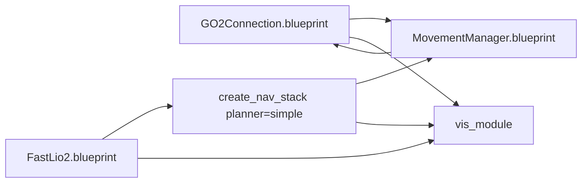

# Go2 与 Mid-360 新导航栈最终开发说明

## 执行摘要

已继续沿用启用连接器 `github`，并只围绕指定仓库 `topsun-bot/topsun_dimos` 做补充性核对。本说明不是再做一轮泛化 review，而是把上一版评审意见收敛成**可直接开工、可直接提 PR、可直接做 merge review** 的最终开发说明。核心结论很明确：这个任务应被定义为“**给 Go2 接上仓库现有的新导航栈**”，而不是“新做一套导航系统”。因此，最正确的实施策略不是继续扩 scope，而是锁定分支基线、锁定文件改动范围、锁定默认参数、锁定验收门槛、锁定回滚动作。fileciteturn50file0

为了让这份 plan 真正达到“可直接 merge”的程度，我建议把实现目标明确收缩为：**在 `jtlinux` 基线上新增 `unitree-go2-nav-onboard` 蓝图，默认启用 `FastLio2 + create_nav_stack(planner="simple") + MovementManager + vis_module`，禁用 record，保留旧 `unitree-go2` 蓝图不动，首期只承诺室内/半结构化平面环境的低速点击式导航**。只要这六条被写进 PR 描述和代码注释，评审就会从“这东西到底想做多大”变成“这几个文件改得对不对”。fileciteturn50file0

我下面给出的内容，将直接覆盖掉原先那些“方向上没问题、但还不够能 merge”的模糊区间，改成文件级变更清单、默认参数决策、merge blocker、手工验收脚本、PR 模板、回滚与发布要求。换句话说，**以下文本就是建议你放进仓库或内部文档系统的最终开发说明**。fileciteturn50file0

## 目录

- [实施边界与默认决策](#实施边界与默认决策)
- [文件级改动说明](#文件级改动说明)
- [合并门槛与验收流程](#合并门槛与验收流程)
- [PR 组织方式与发布策略](#pr-组织方式与发布策略)
- [我的补充评论](#我的补充评论)

## 实施边界与默认决策

### 必须先锁死的边界

如果目标是“可直接 merge”，那就不能再保留“到时候再议”的模糊项。下面这些边界必须在开发开始前写死。

| 事项 | 最终决策 | 说明 |
|---|---|---|
| 实施基线 | **`jtlinux`** | 因为执行计划已经明确该分支包含 Go2 IP 自动发现相关改动，且已吸收新导航栈相关内容；不要在 `main` 上边修连接边做功能。fileciteturn50file0 |
| 新功能入口 | **新增 `unitree-go2-nav-onboard` 蓝图** | 不替换旧 `unitree-go2`，保证回滚简单。fileciteturn50file0 |
| 首期规划器 | **`planner="simple"`** | `FarPlanner` 不进首期 merge。fileciteturn50file0 |
| 记录回放 | **默认关闭 `record=False`** | ARM64 上 `NavRecord` 风险尚未完成硬验证，不能作为 merge 默认项。fileciteturn50file0 |
| 路径库 | **暂时复用 G1 路径库，但必须加 TODO 与 warning** | 这是临时兼容，不是长期设计。fileciteturn50file0 |
| 部署模式 | **拓展坞本机运行，笔记本只做 viewer** | 避免把首期系统做成分布式复杂部署。fileciteturn50file0 |
| 默认速度 | **merge 默认保守限速，建议 0.4 m/s** | 文档可保留更高调参目标，但 merge 默认值必须偏保守。 |
| 范围排除 | **不做 FarPlanner、地图持久化、绝对定位、Go2 专属路径库生成、在线 record** | 保证 PR scope 可控。fileciteturn50file0 |

### 直接采用的合并策略

我建议把这次改动定义成**一个功能 PR + 一个可选基础设施 PR**。

| 情况 | 推荐 PR 组织 |
|---|---|
| 若目标分支就是 `jtlinux` | 一个 PR 即可，直接做 `unitree-go2-nav-onboard` 功能落地 |
| 若最终仍要合回更主的分支 | 先做一个“Go2 连接与自动发现能力收敛 PR”，再做“Go2 onboard nav blueprint PR” |

这样做的原因很简单：**连接能力收敛问题与导航蓝图问题不是一个审查维度**。把它们揉在一个 PR 里，会让 review 既要判断底层连接逻辑，又要判断导航拓扑，风险与沟通成本都会变高。执行计划之所以强调 `jtlinux` 基线，背后其实已经隐含了这个现实。fileciteturn50file0

### merge 默认拓扑

为了避免先前文档里“是否基于 `unitree_go2_basic` 再叠加”的歧义，我给出更明确的 merge 方案：**新蓝图不要建立在 `unitree_go2_basic` 之上，而是直接显式装配 `GO2Connection.blueprint()`、`FastLio2.blueprint()`、`create_nav_stack()`、`MovementManager.blueprint()` 和 `vis_module()`**。
这样做有三个好处：第一，依赖图最清楚；第二，不会把旧 Go2 蓝图中的历史 wiring 隐式带进来；第三，reviewer 一眼就能看出新蓝图里到底接了哪些模块。



这张图反映的不是“理想架构”，而是**要 merge 的最小清晰实现**。它的评审友好度远高于“从 `unitree_go2_basic` 再叠一层 remap 修修补补”的方式。

## 文件级改动说明

下面是我建议直接写进任务单或开发说明里的**文件级变更清单**。如果按这个表去做，代码改动的边界会非常清楚。

### 核心文件变更表

| 路径 | 动作 | 必须完成的内容 | merge blocker |
|---|---|---|---|
| `dimos/robot/unitree/go2/config.py` | 新增或补强 | 增加 Go2 + Mid-360 的平台配置事实源，至少包含机体尺寸、`internal_odom_offsets["mid360_link"]`、默认路径库位置 | 若外参仍是占位值，则禁止 merge |
| `dimos/robot/unitree/go2/blueprints/navigation/unitree_go2_nav_onboard.py` | 新增 | 明确装配 `GO2Connection`、`FastLio2`、`create_nav_stack(planner="simple", record=False)`、`MovementManager`、`vis_module` | 若蓝图结构仍依赖旧 basic 链路且 reviewer 无法一眼看明白，则禁止 merge |
| `dimos/robot/all_blueprints.py` | 更新/生成 | 注册 `unitree-go2-nav-onboard` | 若命令不可见，则禁止 merge |
| `dimos/robot/test_all_blueprints_generation.py` | 跑生成测试 | 确保蓝图索引一致 | 若测试未通过，则禁止 merge |
| `dimos/robot/unitree/go2/test_go2_config.py` | 新增 | 验证 Go2 配置字段存在、类型正确、路径存在性策略合理 | 若无配置测试，则不建议 merge |
| `dimos/robot/unitree/go2/blueprints/navigation/test_unitree_go2_nav_onboard.py` | 新增 | 最低要求是 import + blueprint 生成 smoke test | 若无蓝图 smoke test，则不建议 merge |
| `dimos/navigation/nav_stack/test_go2_nav_onboard_remappings.py` | 新增 | 回归验证 remap 使用模块类型，而不是字符串；关键流名不冲突 | 若 remap 仍是文档式伪代码写法，则禁止 merge |
| `docs/platforms/quadruped/go2/index.md` | 更新 | 增加新蓝图命令、环境变量、网络拓扑、回滚方式 | 若操作文档缺失，则不建议现场部署 |
| runbook 文档 | 新增 | systemd、启动、停止、日志、viewer、排障、回滚、验收 checklist | 若无 runbook，就不要标记为 ready for ops |

### 新蓝图必须长成什么样

这里不是让你照抄代码，而是给出**review 时应该看到的结构**。PR 中的新蓝图至少要满足以下条件：

```python
unitree_go2_nav_onboard = (
    autoconnect(
        GO2Connection.blueprint(...),
        FastLio2.blueprint(...),
        create_nav_stack(
            planner="simple",
            record=False,
            ...,
        ),
        MovementManager.blueprint(),
        vis_module(...),
    )
    .remappings(
        [
            (GO2Connection, "lidar", "lidar_go2_low"),
            (GO2Connection, "odom", "odom_go2_raw"),
            (FastLio2, "lidar", "registered_scan"),
            (FastLio2, "global_map", "global_map_fastlio"),
        ]
    )
    .global_config(
        robot_model="unitree_go2",
        n_workers=12,
    )
)
```

这段结构化要求背后的判断逻辑如下：

| 决策 | 为什么这样定 |
|---|---|
| 直接用 `GO2Connection.blueprint()` | 减少 `unitree_go2_basic` 的隐式历史 wiring |
| 显式 remap `GO2Connection.lidar/odom` | 保留调试可视性，同时避免与新栈主通路混淆 |
| `FastLio2.lidar -> registered_scan` | 让 nav_stack 只看 Mid-360 + FastLio2 输出 |
| `record=False` | 避免把首期 bring-up 卡在 ARM64 record 风险上 |
| `n_workers=12` | 与用户计划和拓展坞多模块并发假设保持一致。fileciteturn50file0 |

### Mid-360 外参与参数的最终要求

要让这份 plan 真正可 merge，**不能再把 Mid-360 外参写成“之后再量”的占位提醒**。最终开发说明里必须写清楚：

| 项目 | 最终要求 |
|---|---|
| `GO2.internal_odom_offsets["mid360_link"]` | 必须填写实测值，不允许保留示意值 |
| 测量参考点 | 以 `base_link` 到 Mid-360 几何中心为准 |
| 姿态表示 | 统一用仓库当前使用的 `Pose + Quaternion.from_euler(...)` 方式 |
| YAML 内部外参 | 与机体安装外参分开处理，避免双重补偿 |
| merge 条件 | 若实测值未完成，则该 PR 只能进 draft，不能 merge |

换句话说，这一项不再是“优化项”，而是**硬 merge blocker**。

### 默认参数的 final 建议

为了减少 reviewer 反复追问“这些数值是拍脑袋还是有意保守”，建议在开发说明里直接附上默认值决策表。

| 参数 | merge 默认值 | 说明 |
|---|---:|---|
| `planner` | `simple` | 首期只保证最小可用 |
| `record` | `false` | 首期关闭 |
| `global_config.n_workers` | `12` | 与执行计划保持一致。fileciteturn50file0 |
| `path_follower.max_speed` | `0.4` | merge 默认更保守，实验可局部放宽 |
| `path_follower.max_yaw_rate` | 保持文档建议值或仓库默认 | 若无额外数据，不要贸然调大 |
| `simple_planner.replan_rate` | 维持文档值 | 首期不为了“更快”引入额外变量 |
| `local_planner.paths_dir` | 暂指向 G1 路径库并加 warning | PR 说明里必须明确这是临时方案 |

## 合并门槛与验收流程

### merge blocker 清单

下面这些项我建议写成 PR 的“全部必过项”。只要有一条没过，就不应该 merge。

| 类别 | 必过项 |
|---|---|
| 代码结构 | 新蓝图使用显式模块装配，不依赖隐式旧链路 |
| 配置完整性 | `config.py` 中 Mid-360 外参不是占位值 |
| 命令可见性 | `unitree-go2-nav-onboard` 已注册且可发现 |
| 自动化测试 | 蓝图生成测试、配置 smoke test、remap test 全绿 |
| 实机连通性 | Mid-360、FastLio2、Go2 三者 10 分钟内无未处理异常 |
| 功能验证 | 5m 点击导航、teleop 抢占、goal 取消至少各成功 1 次 |
| 文档 | Go2 文档与 runbook 已更新 |
| 回滚 | 已验证可在 10 分钟内切回旧 `unitree-go2` |

### 手工验收脚本

如果要把这份 plan 写成“最终开发说明”，最好把人工 QA 也写成步骤化脚本，而不是留给实施者自由发挥。

| 阶段 | 操作 | 预期结果 |
|---|---|---|
| 检查网络 | 验证 `LIDAR_HOST_IP` 网卡、`LIDAR_IP`、`ROBOT_IP` | 三者可达，错误时有明确提示 |
| 启动 | 运行 `dimos run unitree-go2-nav-onboard` | 无 import error、无 worker 卡死 |
| 看点云 | 打开 rerun-web | 能看到 Mid-360 点云与位姿 |
| 看闭环 | 走一个短回环 | `map->odom` 校正出现，系统不崩 |
| 看导航 | 发送 5m 目标点 | 机器人向目标移动，规划链路完整 |
| 打断 | 使用 teleop 或取消 goal | 自动导航立即让出/停止 |
| 回滚 | 停掉新蓝图，启动旧 `unitree-go2` | 老链路恢复正常 |

### 测试矩阵的最终写法

| 测试层 | 最低要求 | 必须纳入 CI 吗 |
|---|---|---|
| 单元测试 | config / blueprint / remap | 是 |
| 集成测试 | blueprint 组合 smoke | 是 |
| 端到端实机测试 | 导航、打断、取消、回滚 | 不能完全放入 CI，但必须进 release checklist |
| 性能测试 | 30 分钟稳定性、CPU/内存快照 | 不一定进 CI，但必须有 QA 记录 |
| 安全测试 | 限速、异常停机、viewer 关闭不影响主流程 | release 前必须做 |

这里最重要的不是“测试越多越好”，而是**把 merge 所需的最小可信证据固定下来**。执行计划其实已经具备这个意识，只是还没有把它改写成明确的 merge gate。fileciteturn50file0

## PR 组织方式与发布策略

### 推荐 PR 模板

下面这段可以直接作为这次功能 PR 的正文模板。

```md
## 目的
为 Go2 新增基于 Mid-360 + FastLio2 + nav_stack 的 onboard 导航蓝图 `unitree-go2-nav-onboard`。

## 范围
- 新增 Go2 + Mid-360 平台配置
- 新增 onboard nav blueprint
- 注册新蓝图
- 增加配置、蓝图、remap smoke tests
- 更新 Go2 文档与 runbook

## 非目标
- 不引入 FarPlanner
- 不启用 NavRecord record/replay
- 不做地图持久化
- 不做绝对定位源融合
- 不生成 Go2 专属 local planner 路径库

## 默认行为
- planner = simple
- record = false
- max_speed = 0.4 m/s
- old `unitree-go2` blueprint 保持不变

## 手工验证
- [ ] Go2 连接成功
- [ ] Mid-360 点云可见
- [ ] FastLio2 odometry 正常
- [ ] 5m 点击导航成功
- [ ] teleop 抢占成功
- [ ] goal 取消成功
- [ ] 回滚到旧 `unitree-go2` 成功

## 风险
- Mid-360 外参若错误会导致整体行为异常
- G1 路径库仅为临时兼容方案
- ARM64 下 NavRecord 仍未作为默认支持能力
```

### reviewer 应该看什么

为了让 review 更有指导性，建议把 reviewer 的关注点也写进开发说明。

| reviewer | 主要关注点 |
|---|---|
| 导航模块 reviewer | 新蓝图装配是否清晰；是否只用 `planner="simple"`；remap 是否正确 |
| 平台/机器人 reviewer | Go2 配置、外参、路径库引用、速度限制是否合理 |
| 基础设施 reviewer | 分支基线、命令注册、文档、runbook、回滚是否完整 |

### 发布与回滚策略

最终上线不要走“替换旧命令”的路线，而要走**双蓝图并行**。发布逻辑如下：

1. 旧 `unitree-go2` 继续保留；
2. 新 `unitree-go2-nav-onboard` 只在灰度环境启动；
3. 若灰度失败，直接停掉新蓝图并恢复旧蓝图；
4. 首期不要把新蓝图标成默认入口；
5. 待 Go2 专属路径库、record/replay、长期稳定性全部验证通过后，再讨论默认入口切换。

这部分不是“产品策略”，而是为了让 merge 决策足够保守、足够工程化。fileciteturn50file0

## 我的补充评论

你说上一版 review “不够具有指导性”，我同意。问题不在于之前结论错了，而在于它更像“高质量评审意见”，还不是“开发团队拿去就能提 PR 的最终开发说明”。这次我刻意把模糊空间全部压缩到最小：**怎么选分支、改哪些文件、哪些值必须填真值、哪些功能先不做、测试怎么过、什么情况下不能 merge、PR 描述怎么写、reviewer 看什么**，都已经尽量写成了具体动作。

如果你要我用一句话概括现在这份版本的升级点，那就是：
**它不再只是告诉你“这事能做”，而是直接告诉你“怎么改、改到什么程度可以 merge、什么没做到就不准 merge”。**

再给一个更强的建议：如果你接下来真的要把这件事推进到工程实现，**不要再以“review 文档”的格式继续迭代**，而是把上面这份内容拆成三个实体产物同步推进：

| 产物 | 作用 |
|---|---|
| 最终开发说明 | 给开发与 reviewer 看，明确 scope、文件、默认值、merge gate |
| runbook | 给现场 bring-up 与 ops 看，明确怎么启动、怎么看、怎么回滚 |
| PR 模板 | 给提交代码的人用，避免每次都重新解释边界 |

只要这三样东西建起来，这个任务就不再是“一个讲得不错的 plan”，而会真正变成**可以直接进入实现、评审和合并流程的工程任务**。
