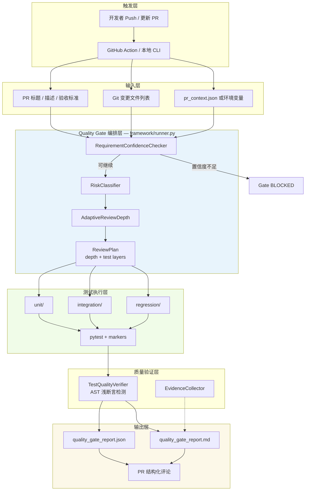
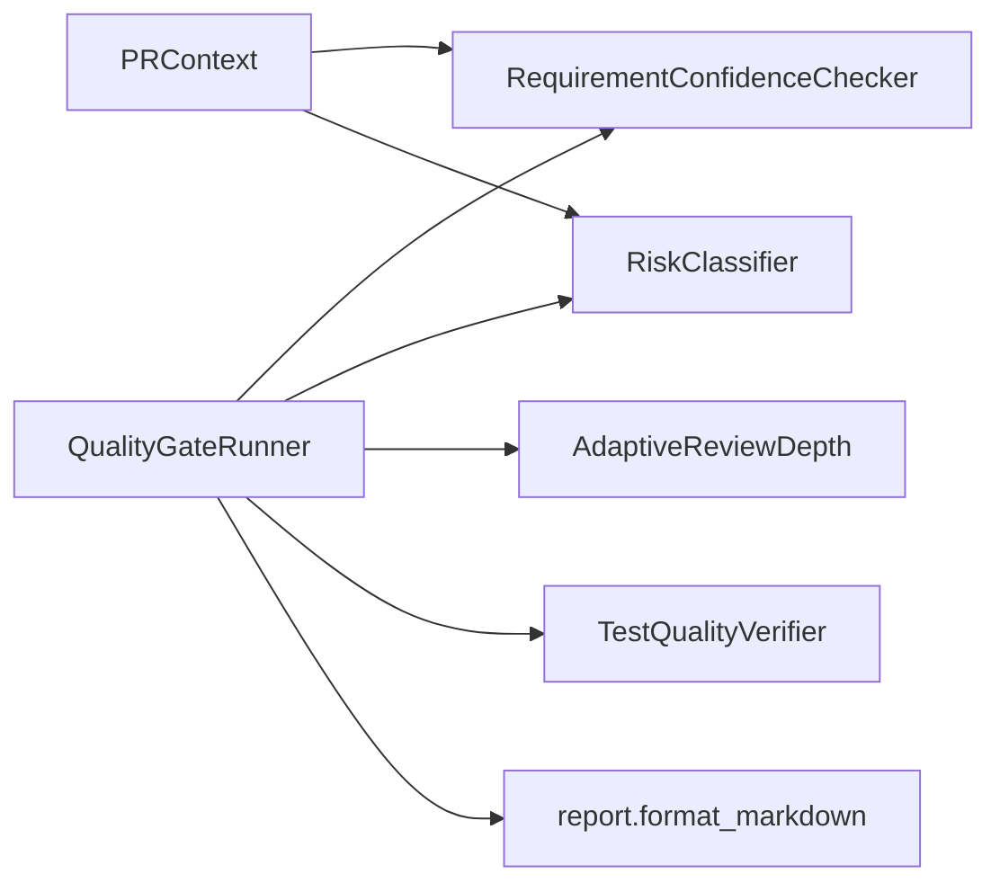

# Quality Gate 测试框架（`test/`）

基于 **Codex PR Quality Gate** 思路，在 **`test/`** 维护跨模块回归与契约测试；**不修改** `dimos/` 业务代码。

## 工作模式

| 场景 | 做法 |
|------|------|
| **每日（main）** | `git pull main` → 按 **[`AGENTS.md`](AGENTS.md)** 用本地 AI 扩充 `test/`（优先 `regression/`）→ 合入 `main` |
| **同事 PR**（提醒） | CI 跑 [`quality-gate-regression`](../.github/workflows/quality-gate-regression.yml），结果**写入 PR 评论**，**不阻塞合并** |
| **同事 PR**（门禁） | CI 跑 [`quality-gate-pr-blocking`](../.github/workflows/quality-gate-pr-blocking.yml)：通过则评论 `origin_test Pass`；失败则评论驳回理由并让 required check 失败（是否阻塞取决于 branch protection 配置） |
| **本地模拟 PR** | `./test/bin/run_regression.sh -v` |

> PR 上**不会**自动生成新用例；测试库在 `main` 上持续积累。

## 设计目标

| 能力维度 | 模块 |
|----------|------|
| 需求置信度检查 | `framework/requirement.py` |
| 风险等级分类 | `framework/risk.py` |
| 自适应审查深度 | `framework/review_depth.py` |
| 历史行为 / 回归感知 | `framework/risk.py` + `regression/` |
| 基于证据的审查 | `framework/evidence.py` |
| 测试质量验证 | `framework/test_quality.py` |
| 结构化报告 | `framework/report.py` |
| 流程编排 | `framework/runner.py` |

## 架构图



### 组件依赖（简图）



## 目录结构

```
test/
├── README.md                 # 本文档
├── pytest.ini                # 独立 pytest 配置（与 dimos/ 内测试分离）
├── conftest.py               # markers、evidence fixture
├── bin/run_quality_gate.py   # CLI 入口
├── framework/                # 框架核心（可复用库）
├── unit/                     # 单元测试
├── integration/              # 集成测试
├── regression/               # 回归测试
└── .quality_gate/            # 报告与 PR 上下文（运行时生成）
    ├── pr_context.example.json
    └── reports/
```

## 快速开始

```bash
# 与 PR CI 一致：仅回归层
./test/bin/run_regression.sh -v

# 全量 test/（每日扩充后）
PYTHONPATH=. python3 -m pytest test/ -c test/pytest.ini -v

# 可选：本地 Gate 报告骨架
PYTHONPATH=. python3 test/bin/run_quality_gate.py --skip-tests
```

### 环境变量

| 变量 | 说明 |
|------|------|
| `QUALITY_GATE_PR_TITLE` | PR 标题 |
| `QUALITY_GATE_PR_BODY` | PR 描述（含验收标准） |
| `QUALITY_GATE_BASE_REF` | diff 基准分支，默认 `main` |

## 测试分层与标记

- `@pytest.mark.unit` — 快速、无外部依赖
- `@pytest.mark.integration` — 跨模块导入/装配
- `@pytest.mark.regression` — 锁定历史默认行为

审查深度由风险自动映射：

| 风险 | Review Depth | 执行的测试层 |
|------|--------------|--------------|
| Low | Shallow | unit |
| Medium | Normal | unit + regression |
| High / Critical | Deep | unit + integration + regression |

## 边界（Least Privilege）

- **允许**：读取代码与 PR、修改 `test/`、生成报告、PR 评论
- **禁止**：修改 `dimos/`、依赖、workflow、自动修 Bug、自动合并

## 与仓库主测试的关系

- `dimos/` 下测试：项目默认 `uv run pytest`（`pyproject.toml` 中 `testpaths = ["dimos"]`）
- `test/` 下测试：Codex Quality Gate 专用，独立 `pytest.ini`，供 AI 补充与门禁执行

## 同事如何用 Cursor 生成测试用例

目标：把“PR 描述中的验收标准”转成能通过门禁的 `test/` 用例（并尽量写在 `test/regression/` 里锁定历史行为）。

门禁约束（写之前先自检）：
- marker 必须正确：`@pytest.mark.unit` / `integration` / `regression`
- 测试函数必须包含明确断言（禁止 `assert True/False/1/0/None`）
- 禁止空测试体、禁止只有 `pass`
- 若你写的是 `regression`：至少一个用例必须使用 `evidence` fixture，并调用 `evidence.add(...)`

推荐对话结构（直接复制并替换括号内容）：

```text
你是一个测试用例生成器。我要新增/补充与我将提交的 PR 对应的测试用例（只允许新增/修改 test/ 目录，禁止改 dimos/ 业务代码）。

【PR 标题】
[在这里写标题]

【PR 描述（必须包含验收标准）】
[粘贴 PR 描述正文；确保包含 acceptance/验收/criteria/expected behavior/test plan/测试 等关键词，且不少于 40 字]

【功能摘要】
[一句话说明功能是什么、解决什么问题]

【验收标准 / Acceptance Criteria】
1) [...]
2) [...]
（如有）3) [...]

【变更影响范围（用于推断门禁风险与测试层）】
- 主要改动路径：[给 2-3 个前缀，例如 dimos/navigation/... / dimos/agents/...]

【测试准则】
- 只修改 test/（不触碰 .github/、pyproject、dimos/）
- 为每条验收标准生成一个或多个测试用例
- regression 用例：至少一个使用 evidence 并调用 evidence.add(...)
- 禁止浅断言（不得出现 assert True/False/1/0/None）
- 不得写空测试体、禁止只有 pass

【输出要求】
1) 先给“测试计划”（每条验收标准 -> 对应测试用例/目录）
2) 再给“可落地代码”（完整文件内容、-> None、类型标注、版权头）
3) 给出本地验证命令：./test/bin/run_regression.sh -v（以及需要时全量 pytest 命令）
```
